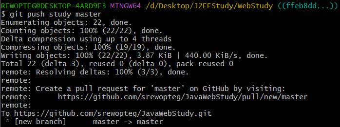
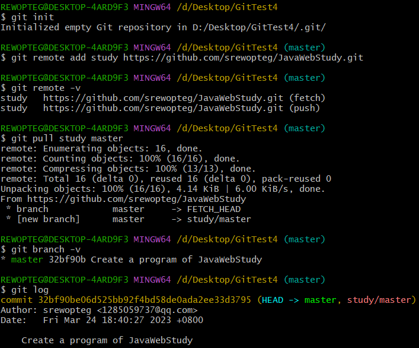
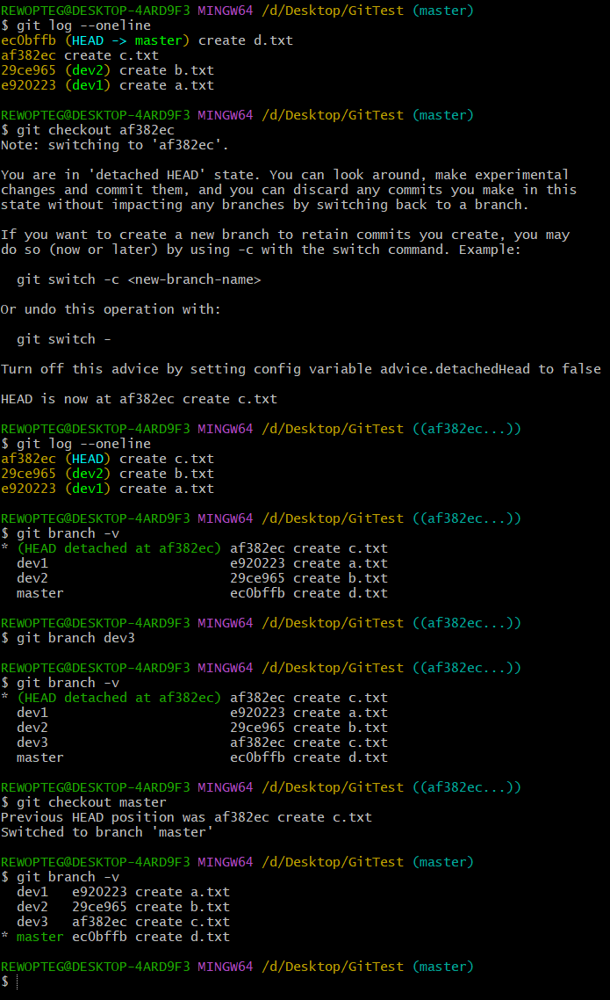

# 一、Git简介

> Git是一个开源的分布式版本控制系统。核心功能如下。
> 
> > 进行项目的版本管理
> 
> > 团队的协同开发（通过版本管理实现）

---

> Git仓库：
> 
> > 存储项目的历史版本。该仓库只供一个项目使用，即一个仓库存储一个项目的历史版本。
> 
> Maven仓库：
> 
> > 存储项目的依赖。该仓库供多个项目使用。

# 二、Git架构


# 三、Git基本使用

| 创建Git版本仓库【git init】                       |
|:----------------------------------------- |
|  |
| 在项目根目录打开dos窗口                             |

| 将工作空间中的内容添加至暂存区（index）【git add .】         |
|:----------------------------------------- |
|  |
| “.” 表示当前文件夹下所有内容                          |

| 查看版本库状态【git status】                       |
| ----------------------------------------- |
|  |

| 将缓存区中内容提交到仓库（生成一个版本）【git commit -m "..."】                |
| -------------------------------------------------------- |
|                 |
| 必须要写版本日志（-m "..."），否则无法提交                                |
| 将暂存区中的内容提交到版本时，会记录当前版本的提交的用户信息，因此在版本提交前需要先绑定用户信息（用户名和邮箱） |

| 产看版本库中的历史版本【git log】【git log --oneline】                                                      |
| -------------------------------------------------------------------------------------------- |
|                                                     |
| 显示版本详细信息，上图黄色字体中 commit 后面的一串字符为版本ID                                                         |
| 上图黄色字体后面的 HEAD 表示当前工作空间中显示的版本                                                                |
|                                                     |
| 显示版本部分信息，上图中的 "--oneline" 表示每个版本只显示一行                                                        |
| **注意：如果使用了 【git checkout 版本ID】这一命令切换了历史版本，那么执行上述两个命令只会显示最初版本到 HEAD 版本之间的版本，该历史版本之后的版本将不会显示** |

| 设置用户信息【git config --global ...】           |
| ----------------------------------------- |
|  |

| 查看Git配置信息【git config --list】              |
| ----------------------------------------- |
|  |

| 切换当前工作空间显示的项目版本【git checkout 版本ID】        |
| ----------------------------------------- |
|  |
| git log --oneline 中显示的部分版本ID也可            |


|  |
| ---------------------------------------------------------------------------- |
| 【git reset --hard 版本ID】表示回退到指定版本，与【git checkout 版本ID】相同                      |


| 设置忽略文件（在项目中添加 " .gitignore " 文件，下图是在项目根目录中添加）                                |
| ---------------------------------------------------------------------------- |
|  |
| 上图中每行代码前加了 “ ! ” 的代表不忽略这类文件，没加的代表忽略这类文件                                      |
| 忽略文件不会保存到版本中（git add/commit 等将会忽略它们）                                         |
| " .gitignore " 文件可以添加在项目中任何地方，该文件中的忽略文件的相对路径是以 " .gitignore " 文件所在路径为根路径     |
| " .gitignore " 文件不是忽略文件，会被添加到版本中                                             |

---

**【git checkout】与【git reset】区别：**


# 四、Git远程仓库

> 远程仓库获得方式
> 
> > 使用GitLab搭建私服
> 
> > 远程仓库提供商
> > 
> > > GitHub
> > 
> > > Gitee
> > 
> > > Coding（使用较少）

---

远程仓库操作：

1. 创建本地工作空间

2. 初始化本地仓库 (git init)

3. 将工作空间搭建的项目结构添加到暂存区 (git add)

4. 将暂存区内容提交到版本库，生成第一个版本 (git commit -m "...")

5. 为当前项目创建一个远程仓库 (eg: https://github.com/srewopteg/JavaWebStudy.git)

6. 本地仓库关联远程仓库
   
   | 下图中 study 为远程仓库的别名，省略不写则直接使用远程仓库名 JavaWebStudy |
   | ---------------------------------------------- |
   |       |

7. 查看远程仓库状态
   
   

8. 将本地仓库部署到远程仓库
   
   | 初次部署时需要输入 github 账号和密码                                                       |
   | ---------------------------------------------------------------------------- |
   |                                     |
   | **study 为远程仓库别名，master 为该远程仓库的一个分支**                                         |
   |                                     |
   | **如果要连接其他远程仓库 ( github 账号密码改变)，那么需要将下图中关于Github 的 Windows 凭据删除 (下图红框所示)**    |
   |  |
   | **如果要添加该 github 账号密码下其他远程仓库，只需再次执行【git push】即可**                             |

9. 从远程仓库获取项目到本地
   
   |                                     |
   | ---------------------------------------------------------------------------- |
   |                                     |
   |  |

10. 制作一个远程仓库的本地拷贝
    
    |  |
    | ---------------------------------------------------------------------------- |
    |                                     |
    | 上图中拷贝的是整个远程仓库（master 分支 和 dev 分支），使用默认分支                                     |
    |                                     |
    | 上图中拷贝的是整个远程仓库（master 分支 和 dev 分支），使用指定分支                                     |
    | **使用上述命令拷贝一个仓库时无需【git init】初始化一个仓库**                                         |
    
    此为【git pull】执行结果，对比上述【git clone】，观察二者区别：
    
    |  |
    | ----------------------------------------- |
    |  |
    
    观察它们获取项目的过程可知：
    
    【git clone】无需初始化本地仓库，而是直接将整个远程仓库复制下来
    
    【git pull】相当于从远程仓库某一分支获取最新版本，然后再与本地分支merge
    
    使用【git checkout】命令：
    
    【git clone】复制的项目可以切换到远程仓库中的任一分支
    
    【git pull】拉取仓库某一分支，无法切换到远程仓库任一分支
    
    其他：
    
    当远程仓库被设置了保护分支时，此时没有权限的用户可以使用【git clone】拷贝项目。但是由于用户没有权限，不能使用【git remote】连接远程仓库，所以不能使用【git pull】（能连接远程仓库，就能对仓库进行推送和拉取）。如下所示：
    
    在某些场合，git 会自动在本地和远程分支之间，建立一种追踪关系。比如，在 git clone 的时候，所有本地分支默认与远程主机的同名分支，建立追踪关系，也就是说，本地的 master 分支自动 “追踪“ origin/master 分支。git 可以手动建立追踪，`git branch --set-upstream master origin/next`  --->指定 master 分支追踪到 origin/next。
    
    如果当前分支只有一个追踪分支，连远程主机名都可以省略。git pull 表示当前分支自动与唯一一个追踪分支进行合并。
    
    
    
    
    
    由上图可知，master 分支正在跟踪 origin/master 分支。且该项目可以查看到远程仓库所有分支。
    
    
    
    
    
    由上图可知，master 分支自动与唯一一个跟踪分支进行了合并。且该项目只能看得到远程仓库中的 master 分支。
    
    看下述11

11. 跟踪分支：
    
    
    
    

---

解决协同开发冲突问题：

| 将远程仓库同步到本地                                                 |
| ---------------------------------------------------------- |
|                   |
| 执行上述指令后，git 会将远程仓库最新版本在本地仓库中用 FETCH_HEAD 指针指向它             |
| **将同步的最新版本合并到本地分支中**                                       |
|                   |
| merge 后面加的是要合并的版本，此处为将 FETCH_HEAD 指针指向的版本合并到 HEAD 指针指向的版本中 |

---

【git fetch】与【git pull】区别：


# 五、Git分支

分支就是版本库中记录版本的支线，分支之间相互独立，使用分支能对项目起到保护作用。

分支特性：

+ 创建一个新的版本库，默认创建一个主分支 (master)

+ 每个分支可以进行单独管理（单独分支，保护分支，只读分支等）

+ 分支是可以合并的

---

分支的基本操作：

```shell
git branch //查看本地所有分支 

git branch -r //查看远程所有分支

git branch -a //查看本地和远程的所有分支

git branch <branchname> //新建分支

git branch -d <branchname> //删除本地分支

git branch -d -r <branchname> //删除远程分支，删除后还需推送到服务器

git push origin:<branchname>  //删除后推送至服务器

git branch -m <oldbranch> <newbranch> //重命名本地分支
/**
*重命名远程分支：
*1、删除远程待修改分支
*2、push本地新分支到远程服务器
*/

//git中一些选项解释:

-d
--delete：删除

-D
--delete --force的快捷键

-f
--force：强制

-m
--move：移动或重命名

-M
--move --force的快捷键

-r
--remote：远程

-a
--all：所有
```

---

HEAD指针处于游离状态说明及解决方法：

+ 说明


+ 解决方法（1）


+ 解决方法（2）



| 为了避免 HEAD 指针出现游离态，我们在使用 checkout 时就为其创建一个分支 |
| ------------------------------------------- |
| `git checkout <commit id> -b <branch name>` |
| **如果不需要该分支，可以使用 -d 将其删除**                   |
| `git branch -d <branch name>`               |

---

在Git中，如果文件没有变化，那么在生成新的版本时不会将其重复放入新的版本中，即Git在存储时只记录新的版本和新的版本改变。

---

【git merge】与【git log】扩展： 

|                                                                                                                                                                                                                                    |
| -------------------------------------------------------------------------------------------------------------------------------------------------------------------------------------------------------------------------------------------------------------------------------------------------------------- |
| **1、图形化查看 HEAD 指针指向的分支的结构【git log --oneline --graph】**                                                                                                                                                                                                                                                         |
|                                                                                                                                                                                                                                                                       |
| 显示了 dev 分支和 dev3 分支的一部分，为何没有显示 dev2 分支呢？因为该命令并不是显示整个版本库的分支结构，而是显示某一分支的分支结构。由上图可知，master 分支分别存在与 dev 分支和 dev3 分支合并的版本，所以 dev 分支和 dev3 分支以 master 一节点为起点，以 master 另一节点为合并点的这一部分是也属于 master 分支。而之所以显示 test 分支和 test2 分支，是因为这两个分支是以 master 分支的一节点为起点，以起点所在这一节点为合并点（起点与合并点为同一节点），所以 test 分支和 test2 分支也属于 master 分支。 |
| **2、【get merge】三方合并（递归策略的合并）**                                                                                                                                                                                                                                                                                 |
|                                                                                                                                                                                                                                                                       |
| 该合并生成了节点 a69e5a4，且该节点属于 master 分支                                                                                                                                                                                                                                                                              |
| **3、【get merge】快速合并（快进合并）**                                                                                                                                                                                                                                                                                    |
|                                                                                                                                                                                                                                                                       |
| 未生成节点，master 分支指向了 dev3 分支的要合并的节点，此时合并的节点既是属于 dev3 分支，又是属于 master 分支。                                                                                                                                                                                                                                          |

---

企业常用分支模型：


