# 一、DOS常用命令


# 二、编译运行过程


# 三、数据类型


由操作平台决定字节大小


byte、short、int任意两者计算时自动转换为int。

float、double是近似值，int等精确值转换为float、double时会丢失精度。


除此之外，还可使用两数相乘及相除来实现不通过第三变量交换数据。

这几种都不靠谱：第三种两个数不能指向同一个内存单元（如`*a = &c; *b = &c;`交换\*a与\*b，此时\*a与\*b结果为0），第二种与第一种数不能太大，否则相加可能导致数据溢出。

# 四、逻辑控制与循环

case中创建的变量作用域为整个switch语句。


case加上大括号后，case中创建的变量作用域为对应case语句。


未来变量值可能为空，所以按上述方法写更好

# 五、数组(Arrays工具类)


数组存放在堆内存中


---


# 六、对象


## 6.1 对象的创建


```java
//匿名对象:只能使用一次，用完直接释放。
new Horse().run();
```

## 6.2 对象的存储

栈内存存储 变量名的地址 和 基本数据类型。

堆内存存储 对象。


## 6.3 对象的释放


Horse h = new Horse();  释放对象  h = null;


# 七、封装


方法运行时进栈，结束后出栈。

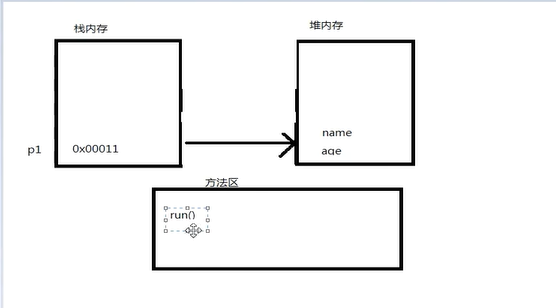

构造方法之间的调用：this(.......);  且必须放在语句块开头。


# 八、String参数传递

字符串就是一个对象。


结果输出"小飞"。原因：


结果输出"备备"。原因：


# 九、static关键字


结果：


静态代码块使用次数较多，可用来加载配置文件（程序运行时只读取一次的那种）。


# 十、单例设计模式


```java
public class danlimoshi {
    public static void main(String[] args) {
        Singleton1 s1 = Singleton1.getInstance();
        s1.print();

        Singleton2 s2 = Singleton2.getInstance();
        s2.print();
    }
}

//饿汉式: 类被加载后对象创建，程序结束释放。占用内存时间长，效率高。
class Singleton1 {
    private Singleton1() {
    }

    private static Singleton1 s = new Singleton1();
    public static Singleton1 getInstance() {
        return s;
    }
    public void print() {
        System.out.println("单例模式饿汉式！");
    }
}

//懒汉式: 第一次调用getInstance()后对象被创建，程序结束释放。占用内存时间短，效率低。建议使用。
class Singleton2 {
    private Singleton2() {
    }

    private static Singleton2 s;

    public static Singleton2 getInstance() {
        if(s == null) {
            s = new Singleton2();
        }
        return s;
    }

    public void print() {
        System.out.println("单例模式懒汉式！");
    }
}
//饿汉式对象s生命周期比懒汉式长。
//懒汉式多线程访问存在安全问题，可能会创建多个实例对象。
//单例模式优势：在设计一些工具类时（没有属性，只有方法），只需一个对象就能执行这一工具类，设计成单例模式可以避免创建多个类，节省内存。
//单例模式替代法：构造方法私有化+静态方法，JDK中大量使用。eg：Arrays.copOf();
/*
构造方法私有化+静态方法 VS 单例模式:
1、单例模式：只有创建的对象一直占内存，方法在执行时进栈，结束后出栈。
2、构造方法私有化+静态方法：静态方法一直占用内存，直到程序结束。
*/
```

# 十一、动态数组


# 十二、继承

+ 继承只能继承非私有的属性/方法等。

+ 构造方法不能被继承。

+ 一个类只能有一个父类。


# 十三、方法重写


public 访问级别最高，private最低。

# 十四、final关键字


对象声明为final，则对象的引用不能改变，对象中的属性值等可以改变。


# 十五、抽象类

抽象的方法只有声明，没有实现。


# 十六、接口


+ 接口与接口之间可以继承。

+ 接口可以多继乘。

+ 一个类可以实现多个接口。


# 十七、多态


# 十八、模板方法设计模式


```java
public class Main {
    public static void main(String[] args) {
        UserManager um = new UserManager();
        um.action("admin", "add");
    }
}

// 抽象类的应用
abstract class BaseManager {
    public void action (String name, String method) {
        if ("admin".equals(name)) {
            execute(method);
        } else {
            System.out.println("你没有权限！");
        }
    }

    public abstract void execute(String method);
}

class UserManager extends BaseManager {
    public void execute(String method) {
        if ("add".equals(method)) {
            System.out.println("执行了添加操作");
        } else if ("del".equals(method)) {
            System.out.println("执行了删除操作");
        }
    }
}
```

# 十九、策略模式


```java
public class Main {
    public static void main(String[] args) {
        BaseUserService user = new UserService();
        user.setISave(new FileSave());
        user.add("user");
    }
}

// 接口的应用
interface ISave {
    public void save(String data);
}

class FileSave implements ISave {
    public void save(String data) {
        System.out.println("保存数据到文件中！"+data);
    }
}

class NetSave implements ISave {
    public void save(String data) {
        System.out.println("保存数据到网络中！"+data);
    }
}

abstract class BaseUserService {
    private ISave isave;
    public void setISave(ISave isave) {
        this.isave = isave;
    }

    public void add(String data) {
        System.out.println("检查数据合法性！");
        isave.save(data);
        System.out.println("数据保存完毕！");
    }
    //public abstract void save(String data);
}

class UserService extends BaseUserService {

    /*
    public void save(String data) {
        System.out.println("保存数据到文件中！"+data);
    }
    */
}
```


重写toString();后，System.out.println(对象名);就会直接调用重写的toString();方法输出对象内容。其他Object类中的方法一样。


# 二十、简单工厂模式


```java
public class Main {
    public static void main(String[] args) {
        //Product phone = new Phone();
        //简单工厂模式
        Product phone = ProductFactory.geProduct("phone");
        if (null != phone) {
            phone.work();
        }
    }
}

//工厂类
class ProductFactory {
    public static Product geProduct(String name) {
        if ("phone".equals(name)) {
            return new Phone();
        } else if ("computer".equals(name)) {
            return new Computer();
        } else {
            return null;
        }
    }
}

interface Product {
    public void work();
}

class Phone implements Product {
    public void work(){
        System.out.println("手机开始工作！");
    }
}

class Computer implements Product {
    public void work(){
        System.out.println("电脑开始工作！");
    }
}
```

# 二十一、静态代理模式


```java
public class Main {
    public static void main(String[] args) {
        Action userAction = new UserAction();
        ActionProxy proxy = new ActionProxy(userAction);
        proxy.doAction();
    }
}

class ActionProxy implements Action {
    private Action target;  //被代理对象

    public ActionProxy(Action target) {
        this.target = target;
    }

    public void doAction() {
        long startTime = System.currentTimeMillis();
        target.doAction();
        long endTime = System.currentTimeMillis();
        System.out.println("共耗时："+(endTime-startTime));
    }
}

interface Action {
    public void doAction();
}

class UserAction implements Action {
    public void doAction() {
        System.out.println("用户开始做事！");
    }
}
```

# 二十二、适配器模式


```java
public class Main {
    public static void main(String[] args) {
        PowerA powerA = new PowerAImpl();
        work(powerA);

        PowerB powerB = new PowerBImpl();
        Adapter adapter = new Adapter(powerB);
        work(adapter);
    }

    public static void work(PowerA a) {
        System.out.println("正在连接...");
        a.insert();
        System.out.println("工作结束！");
    }
}

//适配器
class Adapter implements PowerA {
    private PowerB powerB;
    public Adapter(PowerB powerB) {
        this.powerB = powerB;
    }

    public void insert() {
        powerB.connect();
    }
}

interface PowerB {
    public void connect();
}

class PowerBImpl implements PowerB {
    public void connect() {
        System.out.println("电源B开始工作！");
    }
}

interface PowerA {
    public void insert();
}

class PowerAImpl implements PowerA {
    public void insert() {
        System.out.println("电源A开始工作！");
    }
}
```

# 二十三、内部类

## 23.1 成员内部类


## 23.2 方法内部类


```java
//show方法的局部变量或方法的参数，实际必须是常量final。
public void show() {
    int x = 10;
    class Inner2 {
        public void print() {
            //使用非final常量，能访问，但不能修改操作。JDK1.8版本及以上。
            System.out.println("方法内部类！"+x);
        }
    }
    Inner2 inner2 = new Inner2();
    inner2.print();
}
```


## 23.3 静态内部类


## 23.4 匿名内部类


---

通过内部类可以间接地实现多继承。


## 23.5 代码示例

```java
public class Main {
    public static void main(String[] args) {
        Outer outer = new Outer();
        outer.innerPrint();
        outer.show();
        //不建议这样创建内部类实例化对象。
        //Outer.Inner inner = outer.new Inner();
        //inner.print();

        Outer.Inner3 inner3 = new Outer.Inner3();
        inner3.print();

        outer.print1();
        outer.print2();

        outer.print3(new Eat() {
            public void eat() {
                System.out.println("eat:参数式匿名内部类！");
            }
        });
    }
}

class Outer {
    private String name = "Outer";
    //成员内部类
    public void innerPrint() {
        Inner inner = new Inner();
        inner.print();
    }
    private class Inner {
        public void print () {
            System.out.println("成员内部类！"+name);
        }
    }

    //方法内部类
    //show方法的局部变量或方法的参数，实际必须是常量final。
    public void show() {
        int x = 10;
        class Inner2 {
            public void print() {
                //使用非final常量，能访问，但不能修改操作。JDK1.8版本及以上。
                System.out.println("方法内部类！"+x+name);
            }
        }
        Inner2 inner2 = new Inner2();
        inner2.print();
    }

    //静态内部类。不能使用外部类的属性。
    static class Inner3 {
        public void print() {
            System.out.println("静态内部类！");
        }
    }

    //匿名内部类
    //继承式
    public void print1() {
        Cat cat = new Cat() {
            public void eat() {
                System.out.println("eat:继承式匿名内部类！");
            }
        };
        cat.eat();
    }
    //接口式
    public void print2() {
        Eat eat = new Eat() {
            public void eat() {
                System.out.println("eat:接口式匿名内部类！");
            }
        };
        eat.eat();
    }
    //参数式
    public void print3(Eat eat) {
        eat.eat();
    }
}

abstract class Cat {
    public abstract void eat();
}

interface Eat {
    public void eat();
}
```

# 二十四、链表


代码示例如下：

```java
public class Main {
    public static void main(String[] args) {
        NodeManager nm = new NodeManager();
        nm.add(5);
        nm.add(8);
        nm.add(6);
        nm.add(7);
        nm.add(2);
        nm.print();

        nm.del(7);
        nm.print();

        System.out.println(nm.find(6));
        System.out.println(nm.find(9));

        nm.update(8, 9);
        nm.print();

        nm.insert(8, 0);
        nm.print();
        nm.insert(1, 5);
        nm.print();
        nm.insert(4, 2);
        nm.print();
    }
}

class NodeManager {
    private Node root;  //根节点

    private int currentIndex = 0;  //当前节点序号

    //添加节点
    public void add(int data) {
        if(root == null) {
            root = new Node(data);
        } else {
            root.addNode(data);
        }
    }

    //删除节点
    public void del(int data) {
        if(root == null) {
            return;
        }
        if(root.data == data) {
            root = root.next;
        } else {
            root.delNode(data);
        }
    }

    //输出所有节点数据
    public void print() {
        if(root != null) {
            System.out.print(root.data+"->");
            root.printNode();
            System.out.println();
        }
    }

    //查找结点
    public boolean find(int data) {
        if(root == null) {
            return false;
        }
        if(root.data == data) {
            return true;
        } else {
            return root.findNode(data);
        }
    }

    //修改节点
    public boolean update(int oldData, int newData) {
        if(root == null) {
            return false;
        }
        if(root.data == oldData) {
            root.data = newData;
            return true;
        } else {
            return root.updateNode(oldData, newData);
        }
    }

    //插入节点
    public void insert(int data, int index) {
        if(index < 0) {
            return;
        }
        currentIndex = 0;
        if(index == currentIndex) {
            Node newNode = new Node(data);
            newNode.next = root;
            root = newNode;
        } else {
            root.insertNode(data, index);
        }
    }

    private class Node {
        private int data;
        private Node next;

        public Node(int data) {
            this.data = data;
        }

        //添加节点
        public void addNode(int date) {

            if(this.next == null) {
                this.next = new Node(date);
            } else {
                this.next.addNode(date);
            }

        }

        //删除节点
        public void delNode(int data) {
            if(this.next != null) {
                if(this.next.data == data) {
                    this.next = this.next.next;
                } else {
                    this.next.delNode(data);
                }
            }
        }

        //输出所有节点数据
        public void printNode() {
            if(this.next != null) {
                System.out.print(this.next.data+"->");
                this.next.printNode();
            }
        }

        //查找结点
        public boolean findNode(int data) {
            if(this.next != null) {
                if(this.next.data == data) {
                    return true;
                } else {
                    return this.next.findNode(data);
                }
            }
            return false;
        }

        //修改节点
        public boolean updateNode(int oldData, int newData) {
            if(this.next != null) {
                if(this.next.data == oldData) {
                    this.next.data = newData;
                    return true;
                } else {
                    return this.next.updateNode(oldData, newData);
                }
            }
            return false;
        }

        //插入节点
        public void insertNode(int data, int index) {
            currentIndex++;
            if(index == currentIndex) {
                Node newNode = new Node(data);
                newNode.next = this.next;
                this.next = newNode;
            } else {
                this.next.insertNode(data, index);
            }
        }
    }
}
```

# 二十五、基本数据类型包装类


# 二十六、面试题

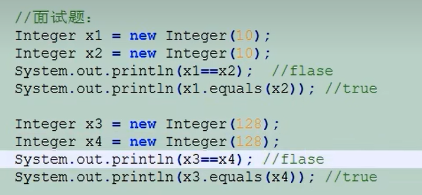


这是为什么？


java会把1个字节以内的数看作是经常会被使用的数，所以他把一个字节以内的数通过享元模式做了一个缓存。当把上图中的x7和x8均换成=127，结果就是true。

源码：


重点：


---

# 二十七、访问修饰符


package com.1.2.3;

+ com: 商业的意思

+ 1: 公司名称

+ 2: 项目名称

+ 3: 模块名称


# 二十八、异常处理


+ 受检异常：编译时出现的异常。

+ 非受检异常：运行时出现的异常。


catch捕获多个异常时，顺序由异常范围小的到范围大的。


```java
private static int method() {
    int a = 10;
    int b = 5;
    try {
        System.out.println("a = " + a);
        System.out.println("b = " + b);
        int c = a/b;
        System.out.println("a/b = " + c);
        return c;
    } catch(Exception e) {
        //代码测试时使用
        e.printStackTrace();
    } finally {
        System.out.println("Finally执行");
    }
    return -1;
} 
```

执行 return c; 之前，会判断 return c; 是否在try语句中，若在，会判断是否有finally语句，若有，则先执行finally语句，最后return c;。


```java
//自定义异常
public class MyException extends Exception {
    public MyException() {
        super();
    }
    public MyException(String s) {
        super(s);
    }
}
```

---


非受检异常RuntimeException使用throw抛出时，方法不写throws也不会报错，但是受检异常Exception使用throw抛出时，方法一定要写throws声明。

# 二十九、assert 断言


运行时给ZVM传参 （-ea）。


JDK1.7新特性


+ try后面加括号：表示执行完try语句后自动释放括号中的资源。（前提是括号中的资源类实现了Closeable接口）。


+ catch后的括号中可以写多个异常。当多个异常执行方法相同时。且这些异常不能是继承关系。即要是平级。

# 三十、String字符串


如果没有s1，则第17行代码创建了两个对象：（字符串常量池中创建一个，new在堆中申请内存创建了一个），有了s1，则第17行代码创建了一个对象：（new在堆中申请内存创建了一个）


```java
public class Ja2 {
    public static void main(String[] args) {
        //会产生5个对象。a，b，1，a+b，a+b+1。
        String a = "a";
        String b = "b";
        String c = a+b+1;
        System.out.println(c);

        //只会产生一个对象。
        String d = "a"+1+2+3+4+5+"b";
        System.out.println(d);

        //只有常量与变量相加才可能产生多个对象。

        StringBuffer sb = new StringBuffer();
        //会产生一个4个对象。a，b，1，a+b+1。
        sb.append(a).append(b).append(1);
        System.out.println(sb.toString());


    }
}
```

String实际上是一个字符数组。


final修饰，这就是为什么String字符串不能修改的原因。

## 30.1 String4种情况分析：直接赋值，考虑编译器和运行期


---


常量"a"在运行期时才会将自己赋给变量a，所以a1在编译期不能被确认，所以在运行期时会在堆内创建一个对象。所以，a1 != a2;

---


b是常量，编译期时就会将常量"b"赋给b，所以b1在编译期时就能够确认，所以b1 == b2;

---


c通过方法获得结果，而方法只有在运行期才会返回结果，所以c1在编译期不能被确认，所以在运行期时会在堆内创建一个对象。所以，c1 != c2;

---

‘


即使d是常量，但是方法只有在运行期才会返回结果，所以d1在编译期不能被确认，所以在运行期时会在堆内创建一个对象。所以，d1 != d2;

---


## 30.2 String常用方法


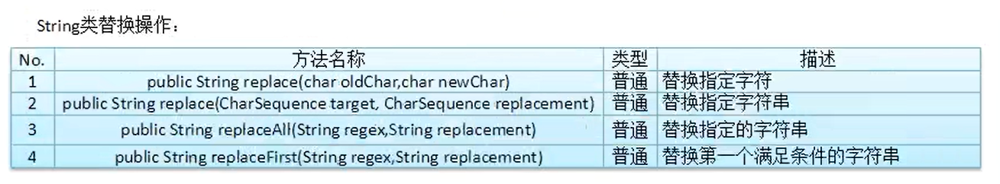


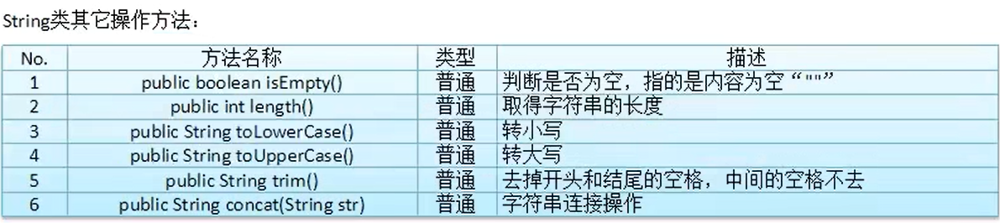

## 30.3 StringBuffer


## 30.4 StringBuilder


# 三十一、程序国际化


源代码与属性文件：

```java
import java.text.MessageFormat;
//import java.util.Locale;
import java.util.ResourceBundle;
import java.util.Scanner;

public class Ja1 {
    public static void main(String[] args) {
        // 创建一个本地语言环境对象，该对象会根据参数设置来自动选择与之相关的语言环境。
        // Locale locale_CN = new Locale("zh", "CN");
        // Locale locale_US = new Locale("en", "US");
        // 获取当前系统默认的语言环境。
        // Locale local_default = Locale.getDefault();

        Scanner scanner = new Scanner(System.in);

        // 用于绑定属性文件的工具类（参数：属性文件的基本名（就是前缀，eg：info））。
        ResourceBundle r = ResourceBundle.getBundle("chengxuguojihua.info");
        System.out.println(r.getString("system.name"));
        System.out.println(r.getString("input.username"));
        String userName = scanner.nextLine();
        System.out.println(r.getString("input.password"));
        String password = scanner.nextLine();

        if("admin".equals(userName) && "123".equals(password)){
            System.out.println(r.getString("login.success"));
        } else {
            System.out.println(r.getString("login.error"));
        }

        scanner.close();
    }
}
```

```properties
# info_en_US.properties

system.name=EMP Manager System
input.username=Input UserName
input.password=Input Password
login.success=Login Success!
login.error=Login Error
```

```properties
# info_zh_CN.properties

system.name=员工管理系统
input.username=输入用户名
input.password=输入密码
login.success=登录成功
login.error=登录失败
```


源代码：

```java
String welcome = r.getString("welcome");
// 将占位符进行替换。
welcome = MessageFormat.format(welcome, userName, password);
System.out.println(welcome);
```

```properties
welcome=Welcome to {0}{1}  //{0}{1}{2}...这是占位符
welcome=欢迎你，{0}{1}
```

# 三十二、日期工具类


GregorianCalendar：公历


# 三十三、Comparable

```java
public class Ja1 implements Comparable<Ja1> {
    private String name;
    private int age;

    public static void main(String[] args) {
        Ja1[] ja1 = {new Ja1("a", 2), new Ja1("e", 1), new Ja1("c", 3)};
        Arrays.sort(ja1);
        System.out.println(Arrays.toString(ja1));
    }

    public Ja1() {
    }

    public Ja1(String name, int age) {
        this.name = name;
        this.age = age;
    }

    @Override
    public int compareTo(Ja1 o) {
        /*
        if(this.age < o.age) {
            return -1;
        }
        if(this.age > o.age) {
            return 1;
        }
        return 0;
        */
        return this.age - o.age;
    }
    @Override
    public String toString() {
        return "["+name+","+age+"]";
    }
}
```

要通过对象属性对对象进行排序。那么对象必须实现Comparable<T>接口。


1. 查看Arrays源码中的sort源码，发现sort在排序时，会将对象强制转换为Comparable类型进行比较排序。

2. 若要使得Arrays类中的sort方法实现从大到小排序，只需颠倒public int compareTo(T o)方法中的返回值。


由此可知，相减结果大于零，则归并排序时数据交换。

# 三十四、Comparator


```java
import java.util.Arrays;

public class Ja1 implements Comparable<Ja1> {
    private String name;
    private int age;

    public static void main(String[] args) {
        Ja1[] ja1 = {new Ja1("a", 2), new Ja1("e", 1), new Ja1("c", 3)};
        Arrays.sort(ja1);
        System.out.println(Arrays.toString(ja1));
    }

    public Ja1() {
    }

    public Ja1(String name, int age) {
        this.name = name;
        this.age = age;
    }

    @Override
    public int compareTo(Ja1 o) {
        /*
        if(this.age < o.age) {
            return -1;
        }
        if(this.age > o.age) {
            return 1;
        }
        return 0;
        */
        return this.age - o.age;
    }
    @Override
    public String toString() {
        return "["+name+","+age+"]";
    }
}
```

```java
import java.util.Arrays;
import java.util.Comparator;

//符合oo原则，对修改关闭，对扩展开放。
public class Ja2 {
    private String name;
    private int age;

    public static void main(String[] args) {
        Ja2[] ja2 = {new Ja2("a", 2), new Ja2("e", 1), new Ja2("c", 3)};
        Arrays.sort(ja2, new Ja2Comparator());
        System.out.println(Arrays.toString(ja2));
    }

    public Ja2() {
    }

    public Ja2(String name, int age) {
        this.name = name;
        this.age = age;
    }

    public String getName() {
        return name;
    }

    public int getAge() {
        return age;
    }

    @Override
    public String toString() {
        return "["+name+","+age+"]";
    }
}

class Ja2Comparator implements Comparator<Ja2> {

    @Override
    public int compare(Ja2 o1, Ja2 o2) {
        return o1.getAge() - o2.getAge();
    }
}
```

# 三十五、Cloneable


像这种没有任何实现方法的接口，称为标记接口。

```java
public class Ja1 implements Cloneable {
    private String name;
    private int age;

    public static void main(String[] args) {
        Ja1 ja1 = new Ja1("喵喵", 6);

        try {
            Ja1 ja2 = (Ja1)ja1.clone();

            System.out.println(ja1.toString());
            System.out.println(ja2.toString());
            System.out.println(ja1 == ja2);
        } catch (CloneNotSupportedException e) {
            e.printStackTrace();
        }
    }

    public Ja1() {
    }

    public Ja1(String name, int age) {
        this.name = name;
        this.age = age;
    }

    public String getName() {
        return name;
    }

    public int getAge() {
        return age;
    }

    @Override
    public String toString() {
        return "["+name+","+age+"]";
    }

    @Override
    protected Object clone() throws CloneNotSupportedException {
        return super.clone();
    }
}
```

# 三十六、System类


代码示例请看第“三十七”章。

# 三十七、Runtime类


```java
import java.io.IOException;
import java.util.Date;

public class Ja1 {
    public static void main(String[] args) {
        System.out.println("HelloWorld");
        System.err.println("HelloWorld");
        System.out.println(System.currentTimeMillis());
        Date date = new Date();
        System.out.println(date);
        System.out.println(System.getProperty("os.name"));
        System.out.println(System.getProperty("java.home"));

        Runtime rt = Runtime.getRuntime();
        System.out.println("处理器数量："+rt.availableProcessors());
        System.out.println("jvm总内存数："+rt.totalMemory());
        System.out.println("jvm空闲内存数："+rt.freeMemory());
        System.out.println("jvm可用最大内存数："+rt.maxMemory());
        try {
            rt.exec("C:\\Program Files\\Microsoft Office\\root\\Office16\\WINWORD.EXE");
        } catch (IOException e) {
            e.printStackTrace();
        }
    }
}
```

# 三十八、大数据处理工具类


+ 因为BigDecimal表示的是精确的float和double，所以做除法时，如果除不尽，会直接报错，BigInteger不会。


---


BigInteger类的底层是一个不可变的int数组。


DecimalFormat类格式化时，采用的是四舍五入。

代码示例如下：

```java
import java.math.BigInteger;
import java.text.DecimalFormat;

public class Ja1 {
    public static void main(String[] args) {
        String val1 = "948654894654865148651";
        String val2 = "168456549684535898559";

        BigInteger b1 = new BigInteger(val1);
        BigInteger b2 = new BigInteger(val2);

        System.out.println(b1);
        System.out.println(b2);
        System.out.println(b1.divide(b2));

        System.out.println(new DecimalFormat("#").format(Math.PI));
    }
}
```

# 三十九、MD5工具类及BASE64编码


```java
import java.io.UnsupportedEncodingException;
import java.security.MessageDigest;
import java.security.NoSuchAlgorithmException;
import java.util.Arrays;
import java.util.Base64;

//MD5加密算法不可逆。
//BASE64编码算法可逆。
public class Ja1 {
    public static void main(String[] args) {
        String password = "admin123456";

        try {
            //通过MD5计算摘要。
            MessageDigest md = MessageDigest.getInstance("MD5");
            byte[] bytes1 = md.digest(password.getBytes("UTF-8"));

            System.out.println(Arrays.toString(bytes1));
            System.out.println(new String(bytes1));

            //a-z A-Z 0-9 / *  BASE64编码算法。
            String str = Base64.getEncoder().encodeToString(bytes1);
            System.out.println(str);
            //BASE64解码算法。
            byte[] bytes2 = Base64.getDecoder().decode(str);
            System.out.println(new String(bytes2));
        } catch (NoSuchAlgorithmException e) {
            e.printStackTrace();
        } catch (UnsupportedEncodingException e) {
            e.printStackTrace();
        }
    }
}
```

信息-摘要算法

+ 明文：信息

+ 密文：摘要

MD5加密算法不可逆，这也是为什么密码忘记只能修改或重置，而无法找回。


“==”代表BASE64编码的结尾。


# 四十、二叉树


```java
public class ErChaShu {
    private Node root;

    public void add(int data) {
        if(root == null) {
            root = new Node(data);
        } else {
            root.addNode(data);
        }
    }

    public void print() {
        if(root == null) {
            System.out.println("二叉树为空！");
        } else {
            root.printNode();
        }
    }

    public class Node {
        private int data;
        private Node left;
        private Node right;

        public Node() {
        }

        public Node(int data) {
            this.data = data;
        }

        public void addNode(int data) {
            if(this.data > data) {
                if(this.left == null) {
                    this.left = new Node(data);
                } else {
                    this.left.addNode(data);
                }
            } else {
                if(this.right == null) {
                    this.right = new Node(data);
                } else {
                    this.right.addNode(data);
                }
            }
        }

        // 中序遍历
        public void printNode() {
            if(this.left != null) {
                this.left.printNode();
            }

            System.out.print(this.data+"->");

            if(this.right != null) {
                this.right.printNode();
            }
        }

    }
}
```

```java
public class Ja1 {
    public static void main(String[] args) {
        ErChaShu es = new ErChaShu();
        es.add(8);
        es.add(3);
        es.add(10);
        es.add(1);
        es.add(6);
        es.add(14);
        es.add(4);
        es.add(7);
        es.add(13);
        es.print();
    }
}
```

# 四十一、Lambda表达式


+ 多个语句时，Lambda表达式不能省略大括号。


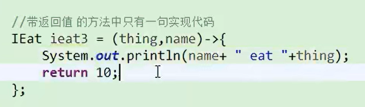


+ 代码中就只有一个return语句时，去掉大括号就必须把return关键字也去掉，否则大括号不能省。


代码示例如下：

```java
@FunctionalInterface
interface IEat {
    public boolean eat(String thing);
}

class IEatImpl implements IEat {
    public boolean eat(String thing) {
        System.out.println("eat "+thing);
        return true;
    }
}
```

```java
public class Ja1 {
    public static void main(String[] args) {
        IEat ieat1 = new IEatImpl();
        System.out.println(ieat1.eat("apple"));

        IEat ieat2 = new IEat() {
            public boolean eat(String thing) {
                System.out.println("eat "+thing);
                return true;
            } 
        };
        System.out.println(ieat2.eat("bnana"));

        //Lambda表达式
        //IEat ieat3 = (thing)->{System.out.println("eat apple bnana");};
        IEat ieat3 = (String thing)-> {
            System.out.println("eat apple bnana");
            return true;
        };
        System.out.println(ieat3.eat("apple bnana"));
    }
}
```

# 四十二、参数传递


+ Java中只有值传递，没有引用传递。

# 四十三、文件


+ delete删除目录时，目录必须是空目录。


+ renameTo方法中File对象的路径名相同，为重命名；不同，为移动文件。


或者


+ 列出指定类型的文件。

---

```java
File f1 = new File("E:\\Desktop\\JavaWorkSpace\\IOStudy\\test.txt");
File f2 = new File("E:/Desktop/JavaWorkSpace/IOStudy/test.txt");
```

+ 路径的两种写法：“\\\”、“/”。

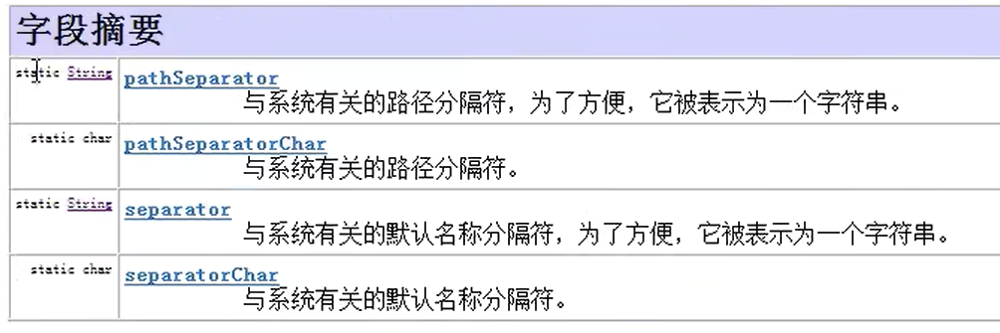

```java
File f2 = new File("C:"+File.pathSeparator+"Users"+File.pathSeparator+"123.txt");
```

# 四十四、IO

## 44.1 字节流


下述读取文件内容这一部分代码需牢记，这是模板。

```java
public class Ja2 {
    public static void main(String[] args) {
        out();
        in();
    }

    private static void out() {
        File file = new File("IOStudy/test.txt");

        try (OutputStream out = new FileOutputStream(file, true)) {
            String info = "再不努力我们就老了！\r\n";
            out.write(info.getBytes());

            out.close();
        } catch (IOException e) {
            e.printStackTrace();
        }
    }

    public static void in() {
        File file = new File("IOStudy/test.txt");

        try (InputStream in = new FileInputStream(file)) {
            byte[] bytes = new byte[10240];
            StringBuilder buf = new StringBuilder();
            int len = -1;  //每次读取的字节长度。

            //当读取文件内容的长度len为-1时，表示文件内容已全部读取完毕。
            while ((len = in.read(bytes)) != -1) {  
                buf.append(new String(bytes)); //会出错。
                // 2、buf.append(new String(bytes, 0, len));
            }
            /*
            当bytes字节数组无法一次性将文件数据读取时，上述方法输出时会出错，
            因为while循环每次读取时后面的内容会将前面的内容覆盖，
            若最后一次读取的数据小于bytes长度，上次读取的内容未完全覆盖，输出出错。
            可按while循环中2的方式写。
            */
            /*
            一个中文占两个字节，如果bytes数组大小为1或为单数时，输出一样会是乱码，
            因为我们每次循环读取后就将其转换为字符并添加进字符串中。
            解决方法：使用字符流。

            bytes数组为双数不行吗？
            不行，因为如果文件中是中英文或者中文+数字的话，一样会出错，
            英文与数字占一个字节。
            */
            System.out.println(buf);

            in.close();
        } catch (IOException e) {
            e.printStackTrace();
        }
    }
}
```

FileOutputStream部分源码。由下述代码可知，字节流与文件关联通过FileChannel对象实现。

```java
public class FileOutputStream extends OutputStream
{
    /**
     * Access to FileDescriptor internals.
     */
    private static final JavaIOFileDescriptorAccess fdAccess =
        SharedSecrets.getJavaIOFileDescriptorAccess();

    /**
     * The system dependent file descriptor.
     */
    private final FileDescriptor fd;

    /**
     * The associated channel, initialized lazily.
     */
    private volatile FileChannel channel;

    /**
     * The path of the referenced file
     * (null if the stream is created with a file descriptor)
     */
    private final String path;

    private final Object closeLock = new Object();

    private volatile boolean closed;
```

## 44.2 字符流


```java
public class Ja3 {
    public static void main(String[] args) {
        out();
        in();
    }

    private static void out() {
        File file = new File("IOStudy/test.txt");

        try (Writer out = new FileWriter(file, true)) {
            out.write("不努力，何来尊严！\r\n");

            out.close();
        } catch (IOException e) {
            e.printStackTrace();
        }
    }

    public static void in() {
        File file = new File("IOStudy/test.txt");

        try (Reader in = new FileReader(file)) {
            char[] cs = new char[1];
            StringBuilder buf = new StringBuilder();
            int len = -1;

            while ((len = in.read(cs)) != -1) {
                buf.append(new String(cs, 0, len));
            }

            System.out.println(buf);

            in.close();
        } catch (IOException e) {
            e.printStackTrace();
        }
    }
}
```

1. 使用断点调试会发现，当执行  out.write("不努力，何来尊严！\r\n");  后，数据不会写入文件，此时数据存放在了Writer的对象out的字符数组中（存放在了内存中）。

2. 该字符数组设置了缓存大小1024个字符（Reader类中的字符数组缓存大小默认8192字符），当字符数组存满了数据后，就会将数据写入文件之中。

3. 当执行了  out.flush();  或  out.close();  后，缓存的数据才会被写入文件中。

```java
public abstract class Writer implements Appendable, Closeable, Flushable {

    /**
     * Temporary buffer used to hold writes of strings and single characters
     */
    private char[] writeBuffer;

    /**
     * Size of writeBuffer, must be >= 1
     */
    private static final int WRITE_BUFFER_SIZE = 1024;
```

```java
public abstract class Reader implements Readable, Closeable {

    private static final int TRANSFER_BUFFER_SIZE = 8192;
```

## 44.3 字符流 VS 字节流

+ 字符流有缓存。

+ 字节流没有缓存。

+ 字符流的内部实现还是字节流。

+ 只有字符流才有编码，字节流没有编码。


+ 非文本文件：图片、视频等

+ 文本文件：txt，xml等

## 44.4 字节与字符的转换


```java
public class Ja5 {
    public static void main(String[] args) {

        try (OutputStream out = new FileOutputStream("IOStudy/test.txt", true)) {
            writeM(out);
        } catch (IOException e1) {
            e1.printStackTrace();
        }


        try (InputStream in = new FileInputStream("IOStudy/test.txt")) {
            readM(in);
        } catch (IOException e) {
            e.printStackTrace();
        }
    }

    private static void readM(InputStream in) {
        Reader reader = new InputStreamReader(in, Charset.forName("gb2312"));

        char[] cs = new char[1024];
        int len = -1;

        try {
            while ((len = reader.read(cs)) != -1) {
                System.out.println(new String(cs, 0, len));
            }
            reader.close();
        } catch (IOException e) {
            e.printStackTrace();
        }
    }

    public static void writeM (OutputStream out) {
        Writer write = new OutputStreamWriter(out);
        String s = "能忍人所不能忍，方能为人所不能为！\r\n";

        try {
            write.write(s);
            write.close();
        } catch (IOException e) {
            e.printStackTrace();
        }
    }
}
```

## 44.5 缓冲流


### 44.5.1 字节缓冲流


根据源码可以看出，

1. 默认缓冲大小为8192字节。

2. 根据构造函数可以看出，用户可自行设置缓冲区大小。

3. 该缓冲流内部是一个字节数组。

注：这三点与BufferedInputStream字节缓冲输入流一样。

```java
public class Ja6 {
    public static void main(String[] args) {
        byteWrite();
        byteRead();
    }

    private static void byteWrite() {
        File file = new File("IOStudy/test.txt");

        try (OutputStream out = new FileOutputStream(file, true)) {
            // 构造一个字节缓冲流，其参数是字节流。
            BufferedOutputStream bos = new BufferedOutputStream(out);

            String info = "不努力，活该被人瞧不起！\r\n";
            bos.write(info.getBytes());

            bos.close();
            //关闭BufferedOutputStream时，会同时关闭OutputStream。
            // out.close();
        } catch (IOException e) {
            e.printStackTrace();
        }
    }

    public static void byteRead() {
        File file = new File("IOStudy/test.txt");

        try (InputStream in = new FileInputStream(file)) {
            // 构造一个字节缓冲流，其参数是字节流。
            BufferedInputStream bis = new BufferedInputStream(in);

            byte[] cs = new byte[1024];
            int len = -1;

            while ((len = bis.read(cs)) != -1) {
                System.out.println(new String(cs, 0, len));
            }

            bis.close();
            //关闭BufferedInputStream时，会同时关闭InputStream。
            // in.close();
        } catch (IOException e) {
            e.printStackTrace();
        }
    }
}
```

### 44.5.2 字符缓冲流


图片中的转换过程是指解码过程。

FileReader每次读取数据后立刻进行字节转字符操作，而BufferedReader读取数据后则会直接放入缓存中，进行统一的转换，效率更高。

BufferedReader(...)和BufferedWriter(...)：其参数为字符流（Reader、Writer）。

## 44.6 打印流


```java
public class Ja8 {
    public static void main(String[] args) {
        bytePrint();
        charPrint();
    }

    private static void bytePrint() {
        File file = new File("IOStudy/test.txt");

        try (OutputStream out = new FileOutputStream(file, true)) {
            // 加缓存。
            BufferedOutputStream bos = new BufferedOutputStream(out);
            // 增强打印功能。
            PrintStream ps = new PrintStream(bos);

            ps.println("你不努力，没人会帮你！");

            ps.close();
        } catch (IOException e) {
            e.printStackTrace();
        }
    }

    private static void charPrint() {
        File file = new File("IOStudy/test.txt");

        try (Writer out = new FileWriter(file, true)) {
            // 加缓存。
            BufferedWriter bw = new BufferedWriter(out);
            // 增强打印功能。
            PrintWriter pw = new PrintWriter(bw);

            pw.println("你不努力，没人会帮你！");

            pw.close();
        } catch (IOException e) {
            e.printStackTrace();
        }
    }
}
```

打印流提供了许多print方法，使得许多数据无需转化成字符串或字节数组，可直接输出至文件中。

## 44.7 对象流与序列化


```java
public class Ja9 {
    public static void main(String[] args) {
        writeObject();
        readObject();
    }

    //对象序列化。
    public static void writeObject() {
        Dog dog1 = new Dog("二哈", 6, "公");
        Dog dog2 = new Dog("二虎", 8, "母");
        Dog[] dogs = {dog1, dog2};

        File file = new File("IOStudy/xuliehua.obj");

        try {
            OutputStream out = new FileOutputStream(file);
            ObjectOutputStream oos = new ObjectOutputStream(out);

            oos.writeObject(dogs);

            oos.close();
        } catch (FileNotFoundException e) {
            e.printStackTrace();
        } catch (IOException e) {
            e.printStackTrace();
        }
    }

    //对象反序列化。
    public static void readObject() {
        File file = new File("IOStudy/xuliehua.obj");

        try {
            InputStream in = new FileInputStream(file);
            ObjectInputStream ois = new ObjectInputStream(in);

            Dog[] dogs = (Dog[])ois.readObject();

            for(Dog d:dogs) {
                System.out.println(d);
            }

            ois.close();
        } catch (FileNotFoundException e) {
            e.printStackTrace();
        } catch (IOException e) {
            e.printStackTrace();
        } catch (ClassNotFoundException e) {
            e.printStackTrace();
        }
    }
}

// Serializable（标记接口）,为了告诉JVM该类对象可以被序列化。
// 如果一个类创建的对象需要被序列化，那么该类必须实现Serializable（标记接口）接口。
class Dog implements Serializable {
    private String name;
    private int age;
    private String sex;

    public Dog() {
    }
    public Dog(String name, int age, String sex) {
        this.name = name;
        this.age = age;
        this.sex = sex;
    }

    public void setName(String name) {
        this.name = name;
    }
    public String getName() {
        return name;
    }

    public void setAge(int age) {
        this.age = age;
    }
    public int getAge() {
        return age;
    }

    public void setSex(String sex) {
        this.sex = sex;
    }
    public String getSex() {
        return sex;
    }

    @Override
    public String toString() {
        return "姓名："+name+", "+"年龄："+age+", "+"性别："+sex;
    }
}
```

序列化多个对象时，可以使用对象数组。

## 44.8 字节数组流（内存中操作，与文件无关）


字节数组流可以通过对字节的操作来操作字符串，且通过流的方式操作字符串，使得对字符串的操作更加便捷。

```java
public class Ja10 {
    public static void main(String[] args) {
        byteArray();
    }

    private static void byteArray() {
        String s = "123asdSDF!@#$";

        ByteArrayInputStream bais = new ByteArrayInputStream(s.getBytes());
        ByteArrayOutputStream baos = new ByteArrayOutputStream();

        int curr = -1;
        while((curr = bais.read()) != -1) {
            if((curr >= 65 && curr <= 90) || (curr >= 97 && curr <= 122)) {
                baos.write(curr);
            }
        }
        System.out.println(baos.toString());
    }
}
```

## 44.9 数据流


```java
public class Ja11 {
    public static void main(String[] args) {
        write();
        read();
    }

    private static void write() {
        File file = new File("IOStudy/test.dat");
        try {
            OutputStream out = new FileOutputStream(file);
            BufferedOutputStream bos = new BufferedOutputStream(out);
            DataOutputStream dos = new DataOutputStream(bos);
            dos.writeInt(6);  //写入了4个字节，按照数据类型写入的。
            dos.writeByte(8); //写入了一个字节。
            dos.writeUTF("中");
            dos.close();
        } catch (FileNotFoundException e) {
            e.printStackTrace();
        } catch (IOException e) {
            e.printStackTrace();
        }
    }

    private static void read() {
        File file = new File("IOStudy/test.dat");
        try {
            InputStream in = new FileInputStream(file);
            BufferedInputStream bis = new BufferedInputStream(in);
            DataInputStream dis = new DataInputStream(bis);

            int num = dis.readInt();
            byte b = dis.readByte();
            String s = dis.readUTF();

            System.out.println(num+", "+b+", "+s);

            dis.close();
        } catch (FileNotFoundException e) {
            e.printStackTrace();
        } catch (IOException e) {
            e.printStackTrace();
        }
    }
}
```

由于数据流操作数据与机器无关，数据的大小取决于Java的字节，所以数据流通常用于网络传输中传输数据。

## 44.10 举例：文件的分割与合并

主函数：

```java
public static void main(String[] args) {
    File file = new File("resource/斗罗大陆 第238话.mp4");
    division(file, 1024*1024*20);

    String path = null;
    InputStream is = null;
    // 集合工具类。内部实现使用了数组。
    Vector<InputStream> v = new Vector<InputStream>();

    for (int i = 0; i < 13; i++) {
        path = "IOStudy/test/"+(i+1)+"-temp-斗罗大陆 第238话.mp4";
        try {
            is = new FileInputStream(new File(path));
        } catch (FileNotFoundException e) {
            e.printStackTrace();
        }
        v.add(is);
    }

    Enumeration<InputStream> es = v.elements();
    merge(es);
}
```

文件的分割：

```java
//文件分割。targetFile为要分割的文件，cutSize为每个分割文件的大小，单位字节。
private static void division(File targetFile, long cutSize) {
    if(targetFile == null) {
        return;
    }

    //计算总分割文件数。
    int num = targetFile.length()%cutSize == 0 ? (int)(targetFile.length()/cutSize):(int)(targetFile.length()/cutSize + 1);

    //构造一个文件输入流。
    try {
        BufferedInputStream bis = new BufferedInputStream(new FileInputStream(targetFile));
        BufferedOutputStream bos = null;

        byte[] bytes = null;  //每次要读取的字节数。
        int len = -1;

        int count = 0;  //每个文件要读取的次数。

        //循环次数为生成文件的个数。
        for(int i = 0; i < num; i++) {
            bos = new BufferedOutputStream(new FileOutputStream(new File("IOStudy/test/"+(i+1)+"-temp-"+targetFile.getName())));
            if(cutSize <= 1024) {
                bytes = new byte[(int)cutSize];
                count = 1;
            } else {
                bytes = new byte[1024];
                count = (int)cutSize/1024;
            }

            while (count > 0 && (len = bis.read(bytes)) != -1) {
                bos.write(bytes, 0, len);
                bos.flush();
                count--;
            }

            if(cutSize % 1024 != 0) {
                bytes = new byte[(int)cutSize % 1024];
                len = bis.read(bytes);
                bos.write(bytes, 0, len);
                bos.flush();
            }
            bos.close();
        }

        bis.close();

    } catch (FileNotFoundException e) {
        e.printStackTrace();
    } catch (IOException e) {
        e.printStackTrace();
    }
}
```

文件的合并：

## 44.11 合并流


构造方法：

1. ```java
   SequenceInputStream(Enumeration<? extends InputStream> e)
   ```
   
   初始化新创建 SequenceInputStream通过记住参数，它必须是一个 Enumeration（枚举）产生对象，它们的运行时类型是 InputStream 。
   
   ```java
   SequenceInputStream(InputStream s1, InputStream s2)
   ```
   
   通过记住两个 SequenceInputStream来初始化新创建的SequenceInputStream，这些参数将按顺序读取，首先是 s1 ，然后是 s2 ，以提供要从此 SequenceInputStream读取的字节。

```java
//文件合并。
private static void merge(Enumeration<InputStream> es) {
    //构造一个合并流。
    SequenceInputStream sis = new SequenceInputStream(es);

    try {
        BufferedOutputStream bos = new BufferedOutputStream(new FileOutputStream(new File("IOStudy/test/斗罗大陆 第238话.mp4")));

        byte[] bytes = new byte[1024];
        int len = -1;

        while((len = sis.read(bytes)) != -1) {
            bos.write(bytes, 0, len);
            bos.flush();
        }

        bos.close();
        sis.close();

        System.out.println("合并完成！");
    } catch (FileNotFoundException e) {
        e.printStackTrace();
    } catch (IOException e) {
        e.printStackTrace();
    }
}
```

## 44.12 字符串流


```java
private static void stringReader() {
    String info = "good good study, day day up";
    StringReader sr = new StringReader(info);
    // 流标记器。
    StreamTokenizer st = new StreamTokenizer(sr);

    int count = 0;

    while(st.ttype != StreamTokenizer.TT_EOF) {
        try {
            if(st.nextToken() == StreamTokenizer.TT_WORD) {
                count++;
            }
        } catch (IOException e) {
            e.printStackTrace();
        }
    }
    sr.close();
    //输出结果为6，因为总共有6个单词。
    System.out.println("count="+count);
}
```

通常字符串流的作用是将字符串转化成流的形式（与字节数组流类似，但字节数组流底层是字节数组，而字符串流底层是一个字符串），通过对流的操作来操作字符串。

## 44.13 StreamTokenizer

StreamTokenizer类接收输入流并将其解析为“令牌”，允许一次读取一个令牌。 解析过程由表和多个可以设置为各种状态的标志来控制。 流标记器可以识别标识符，数字，引用的字符串和各种注释样式。 


+ 作用：在Web开发中，我们经常要从服务器上获取数据，数据的返回格式通常是一个字符串（XML、JSON），我们需要把字符串构造成一个字符流，然后再用第三方的数据解析器来解析数据。

## 44.14 管道流


用于线程之间的数据通讯。

## 44.15 RandomAccessFile


```java
//使用RandomAccessFile类进行文件的复制。
public class Ja14 {
    public static void main(String[] args) {
        try {
            RandomAccessFile rafr = new RandomAccessFile("IOStudy/test.txt", "r");
            RandomAccessFile rafw = new RandomAccessFile("IOStudy/testcopy.txt", "rw");

            byte[] bytes = new byte[1024];
            int len = -1;

            while((len = rafr.read(bytes)) != -1) {
                rafw.write(bytes, 0, len);
            }

            rafr.close();
            rafw.close();
        } catch (FileNotFoundException e) {
            e.printStackTrace();
        } catch (IOException e) {
            e.printStackTrace();
        }

    }
}
```

## 44.16 Properties


```properties
# config.properties

# update config info
# Sat Feb 11 12:02:05 CST 2023
db.password=654321
db.username=admin
app.version=2
```

```java
public class Ja15 {
    public static String version;
    public static String username;
    public static String password;

    //静态代码块，在第一次使用的时候（创建对象）被调用，比构造方法还优先执行，只会执行一次。
    static {
        readConfig();   
    }

    public static void main(String[] args) {
        System.out.println(Ja15.version+", "+Ja15.username+", "+Ja15.password);

        writeConfig("2", "cj", "654321");
    }

    // 读配置文件。
    public static void readConfig() {
        Properties p = new Properties();
        try {
            // 通过当前线程的类加载器对象，来加载指定包下的配置文件，可替换下面的InputStream对象创建语句。
            //InputStream is = Thread.currentThread().getContextClassLoader().getResourceAsStream("IOStudy/config.properties");

            InputStream is = new FileInputStream("IOStudy/config.properties");
            p.load(is);  //加载文件。

            //从properties中获取数据。
            version = p.getProperty("app.version");
            username = p.getProperty("db.username");
            password = p.getProperty("db.password");

            is.close();
        } catch (FileNotFoundException e) {
            e.printStackTrace();
        } catch (IOException e) {
            e.printStackTrace();
        }
    }

    // 写配置文件。
    public static void writeConfig(String version, String useString, String password) {
        Properties p = new Properties();
        p.put("app.version", version);
        p.put("db.username", username);
        p.put("db.password", password);

        try {
            OutputStream out = new FileOutputStream("IOStudy/config.properties");

            p.store(out, "update config info");
            out.close();
        } catch (FileNotFoundException e) {
            e.printStackTrace();
        } catch (IOException e) {
            e.printStackTrace();
        }
    }
}
```

## 44.17 文件压缩与解压缩


代码：

```java
public class Ja16 {
    public static void main(String[] args) {
        compression("IOStudy/zip_test.zip", new File("IOStudy/test"));
        decompression("IOStudy/zip_test.zip", "IOStudy/test_jieya");
    }

    // 压缩
    private static void compression(String zipName, File targetFile) {
        System.out.println("正在压缩......");
        try {
            // 要生成的压缩文件
            ZipOutputStream zos = new ZipOutputStream(new FileOutputStream(zipName));
            zip(zos, targetFile, targetFile.getName());
            zos.close();
            System.out.println("压缩完成！");
        } catch (FileNotFoundException e) {
            e.printStackTrace();
        } catch (IOException e) {
            e.printStackTrace();
        }
    }

    private static void zip(ZipOutputStream zos, File targetFile, String name) throws IOException {
        if (targetFile.isDirectory()) {
            File[] files = targetFile.listFiles();

            if (files.length == 0) { // 空文件夹操作
                zos.putNextEntry(new ZipEntry(name + "/"));
            } else { // 非空文件夹操作
                for (File f : files) {
                    zip(zos, f, name + "/" + f.getName());
                }
            }
        } else {
            zos.putNextEntry(new ZipEntry(name));
            InputStream is = new FileInputStream(targetFile);
            BufferedInputStream bis = new BufferedInputStream(is);

            byte[] bytes = new byte[1024];
            int len = -1;

            while ((len = bis.read(bytes)) != -1) {
                zos.write(bytes, 0, len);
            }

            bis.close();
        }
    }

    // 解压缩
    private static void decompression(String targetName, String parent) {
        File fileParent = new File(parent);
        if (!fileParent.exists()) {
            fileParent.mkdirs();
        }

        System.out.println("解压开始......");

        try {
            ZipInputStream zis = new ZipInputStream(new FileInputStream(targetName));
            ZipEntry entry;
            File file;

            while ((entry = zis.getNextEntry()) != null) {
                System.out.println(entry.getName());
                if (entry.isDirectory()) {
                    new File(parent + "/" + entry.getName()).mkdirs();
                } else {
                    file = new File(parent, entry.getName());

                    if (!file.exists()) {
                        new File(file.getParent()).mkdirs();
                    }

                    OutputStream os = new FileOutputStream(file);
                    BufferedOutputStream bos = new BufferedOutputStream(os);

                    byte[] bytes = new byte[1024];
                    int len = -1;

                    while ((len = zis.read(bytes)) != -1) {
                        bos.write(bytes, 0, len);
                    }

                    bos.close();
                }
                System.out.println(parent + "/" + entry.getName() + "解压完成！");
            }
            zis.close();
        } catch (FileNotFoundException e) {
            e.printStackTrace();
        } catch (IOException e) {
            e.printStackTrace();
        }

    }
}
```

要压缩的文件目录：


压缩时第一次targetFile.listFiles()获取的文件目录结构


解压时ZipInputStream类中存储的文件结构


# 四十五、装饰者模式


```java
// 被装饰者的基类（接口）
public interface Drink {
    float cost();  // 计算价格
    String description();  // 描述
}
```

```java
// 被装饰者对象
public class SoyaBeakMilk implements Drink {

    @Override
    public float cost() {
        return 10f;
    }

    @Override
    public String description() {
        return "纯豆浆";
    }
}
```

```java
// 装饰者基类
public abstract class Decorator implements Drink {
    private Drink drink;

    public Decorator(Drink drink) {
        this.drink = drink;
    }

    @Override
    public float cost() {
        return drink.cost();
    }

    @Override
    public String description() {
        return drink.description();
    }
}
```

```java
// 装饰者对象
public class SugarDecorator extends Decorator {

    public SugarDecorator(Drink drink) {
        super(drink);
    }

    @Override
    public float cost() {
        return super.cost() + 1f;
    }

    @Override
    public String description() {
        return super.description() + "+糖";
    }
}
```

```java
// 装饰者对象
public class EggDecorator extends Decorator {

    public EggDecorator(Drink drink) {
        super(drink);
    }

    @Override
    public float cost() {
        return super.cost() + 3f;
    }

    @Override
    public String description() {
        return super.description() + "+鸡蛋";
    }
}
```

```java
// 装饰者对象
public class BleakBeanDecorator extends Decorator {

    public BleakBeanDecorator(Drink drink) {
        super(drink);
    }

    @Override
    public float cost() {
        return super.cost() + 2f;
    }

    @Override
    public String description() {
        return super.description() + "+黑豆";
    }
}
```

```java
public class Main {
    public static void main(String[] args) {
        Drink drink = new SoyaBeakMilk();
        SugarDecorator sugar = new SugarDecorator(drink);
        EggDecorator egg = new EggDecorator(sugar);
        BleakBeanDecorator blackBean = new BleakBeanDecorator(egg);

        System.out.println("您点的豆浆是："+blackBean.description());
        System.out.println("总价为："+blackBean.cost());
    }
}
```

# 四十六、装饰者模式VS代理模式

代理模式代码示例：

```java
public class Main {
    public static void main(String[] args) {
        Action userAction = new UserAction();
        ActionProxy proxy = new ActionProxy(userAction);
        proxy.doAction();
    }
}

class ActionProxy implements Action {
    private Action target;  //被代理对象

    public ActionProxy(Action target) {
        this.target = target;
    }

    public void doAction() {
        long startTime = System.currentTimeMillis();
        target.doAction();
        long endTime = System.currentTimeMillis();
        System.out.println("共耗时："+(endTime-startTime));
    }
}

interface Action {
    public void doAction();
}

class UserAction implements Action {
    public void doAction() {
        System.out.println("用户开始做事！");
    }
}
```

首先，让我们先看一下下面的这两个UML类图，他们分别描述了装饰器模式和代理模式的基本实现。

1. 装饰者模式


2. 代理模式


# 四十七、常见字符编码


unicode和GBK/GB2312编码固定占两个字节。


# 四十八、New IO（NIO）

### 48.1 缓冲区类型


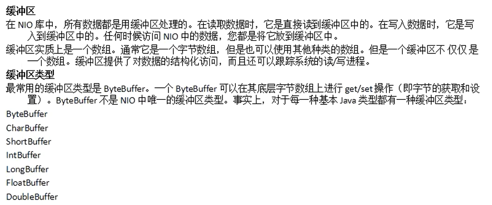


+ position：偏移量，表示当前位置，初始为0。

+ limit：写模式下，表示最多可往缓冲区写多少数据，初始值等于capacity。读模式下，表示最多可从缓冲区读多少数据（即缓冲区有多少数据）。

+ capacity：缓冲区容量大小，存储的数据不能超出这一范围。

```java
import java.nio.ByteBuffer;

public class Ja1 {
    public static void main(String[] args) {
        // 1.
        // 创建一个字节缓冲区，申请的内存空间为8个字节
        ByteBuffer buf = ByteBuffer.allocate(8);
        System.out.println("position:"+buf.position());
        System.out.println(" limit  :"+buf.limit());
        System.out.println("capacity:"+buf.capacity());
        System.out.println("-----------------------");

        // 向缓冲区中写入数据
        buf.put((byte)10);
        buf.put((byte)20);
        System.out.println("position:"+buf.position());
        System.out.println(" limit  :"+buf.limit());
        System.out.println("capacity:"+buf.capacity());
        System.out.println("-----------------------");

        // 缓冲区反转
        // 由写模式转换成读模式
        buf.flip();
        System.out.println("position:"+buf.position());
        System.out.println(" limit  :"+buf.limit());
        System.out.println("capacity:"+buf.capacity());
        System.out.println("-----------------------");

        // 告知当前位置和限制之间是否有元素
        if(buf.hasRemaining()) {
            // 返回当前位置与限制之间的元素数
            for(int i = 0; i < buf.remaining(); i++) {
                byte b = buf.get(i);
                System.out.println(b);
            }
        }
        System.out.println("-----------------------");

        // 2.
        /*
        读模式若未转成写模式，那么limit指针指向已存储数据大小位置。
        往里面写数据时，不能超过原先存储数据大小，否则会报错。如下图所示
        */
        buf.put((byte)50);
        System.out.println("position:"+buf.position());
        System.out.println(" limit  :"+buf.limit());
        System.out.println("capacity:"+buf.capacity());
        System.out.println("-----------------------");
        // buf.put((byte)50);
        // buf.put((byte)50);

        // 3.
        // 清除此缓冲区，即缓冲区恢复到初始化状态。
        // 由读模式转换成写模式，不过数据会全部清空
        buf.clear();
        System.out.println("position:"+buf.position());
        System.out.println(" limit  :"+buf.limit());
        System.out.println("capacity:"+buf.capacity());
        System.out.println("-----------------------");

        buf.put((byte)50);
        buf.put((byte)60);
        System.out.println("position:"+buf.position());
        System.out.println(" limit  :"+buf.limit());
        System.out.println("capacity:"+buf.capacity());
        System.out.println("-----------------------");

        buf.flip();
        System.out.println("position:"+buf.position());
        System.out.println(" limit  :"+buf.limit());
        System.out.println("capacity:"+buf.capacity());
        System.out.println("第一个数据："+buf.get(0));
        System.out.println("-----------------------");

        // 压缩此缓冲区 （可选操作）
        // 由读模式转换成写模式，原有数据会保留，limit指针恢复到初始化位置
        buf.compact();
        System.out.println("position:"+buf.position());
        System.out.println(" limit  :"+buf.limit());
        System.out.println("capacity:"+buf.capacity());
        System.out.println("-----------------------");

    }
}
```

输出结果：

1. 运行结果
   
   

2. 运行结果


3. 运行结果
   
   

缓冲区反转buf.flip();源码：

```java
public Buffer flip() {
    limit = position;
    position = 0;
    mark = -1;
    return this;
}
```


## 48.2 通道文件


也就是说，通道连接的是   操作系统   与   缓冲区   。

```java
private static void copyFile() {
    try {
        FileInputStream in = new FileInputStream("resource/斗罗大陆 第238话.mp4");
        FileOutputStream out = new FileOutputStream("resource/斗罗大陆 第238话_副本.mp4");

        // 创建一个输入文件的通道
        FileChannel fc1 = in.getChannel();
        // 创建一个输出文件的通道
        FileChannel fc2 = out.getChannel();

        ByteBuffer buf = ByteBuffer.allocate(1024);
        while(fc1.read(buf) != -1) {
            buf.flip();
            fc2.write(buf);
            buf.clear();
        }
        fc1.close();
        fc2.close();

        in.close();
        out.close();

        System.out.println("copy success!");
    } catch (FileNotFoundException e) {
        e.printStackTrace();
    } catch (IOException e) {
        e.printStackTrace();
    }   
}
```

## 48.3 内存映射

```java
private static void randomAccessFileCopy() {
    try {
        RandomAccessFile ranin = new RandomAccessFile("resource/斗罗大陆 第238话.mp4", "r");
        RandomAccessFile rafout = new RandomAccessFile("resource/斗罗大陆 第238话_副本2.mp4", "rw");

        FileChannel fc1 = ranin.getChannel();
        FileChannel fc2 = rafout.getChannel();

        long size = fc1.size();  // 输入流的字节大小

        // 输入流的缓冲区
        MappedByteBuffer inbuf = fc1.map(MapMode.READ_ONLY, 0, size);
        // 输出流的缓冲区
        MappedByteBuffer outbuf = fc2.map(MapMode.READ_WRITE, 0, size);

        for(int i = 0; i < size; i++) {
            outbuf.put(inbuf.get());
        }

        // 关闭通道时，会写入数据块
        fc1.close();
        fc2.close();
        ranin.close();
        rafout.close();

        System.out.println("copy success!");
    } catch (FileNotFoundException e) {
        e.printStackTrace();
    } catch (IOException e) {
        e.printStackTrace();
    }
}
```

不一定非要使用RandomAccessFile类才可以进行内存映射，copyFile()函数中也可以使用内存映射，用法与randomAccessFileCopy()函数相同。

+ IO操作性能比较（由高到低）
  
  1. 内存映射
  
  2. NIO读写文件
  
  3. 使用了缓存的IO流
  
  4. 无缓存的IO流

## 48.4 Path接口与Files类


获取Path的三种方法

```java
File file = new File("resource/斗罗大陆 第238话.mp4");

// 第一种
Path p1 = Paths.get("resource", "斗罗大陆 第238话.mp4");
System.out.println(p1);

// 第二种
Path p2 = file.toPath();
System.out.println(p2);

// 第三种
Path p3 = FileSystems.getDefault().getPath("resource", "斗罗大陆 第238话.mp4");
System.out.println(p3);
```


1. StandarOpenOption类（枚举类）（OpenOption接口的实现类）


2. StandardCopyOption类（枚举类）（CopyOption接口的实现类）


```java
// Files工具类的使用

Path p4 = Paths.get("NIO/test1.txt");
String info = "不努力，何来尊严！\n";

// 写入文件
try {
    Files.write(p4, info.getBytes(), StandardOpenOption.APPEND);
} catch (IOException e) {
    e.printStackTrace();
}

// 读取文件
try {
    byte[] bytes = Files.readAllBytes(p4);
    System.out.println(new String(bytes));
} catch (IOException e) {
    e.printStackTrace();
}

// 复制文件
try {
    Files.copy(p4, Paths.get("NIO", "test2.txt"), StandardCopyOption.REPLACE_EXISTING);
} catch (IOException e) {
    e.printStackTrace();
}

// 移动文件
try {
    Files.move(Paths.get("NIO", "test2.txt"), Paths.get("NIO", "test", "test2.txt"), StandardCopyOption.REPLACE_EXISTING);
} catch (IOException e) {
    e.printStackTrace();
}

// 删除文件1
try {
    Files.delete(Paths.get("NIO", "test", "test2.txt"));
} catch (IOException e) {
    e.printStackTrace();
}

// 删除文件2
try {
    Files.deleteIfExists(Paths.get("NIO", "test", "test2.txt"));
} catch (IOException e) {
    e.printStackTrace();
} 
```

# 四十九、集合

+ 集合中分为三大接口：Collection(集合)、Map(映射)、Iterator(迭代器)。


上图中，虚线代表接口，实线代表实现类。

## 49.1 Collection


+ Collection接口：用于存储单个对象的集合
  
  + List接口：
    
    1. 有序的
    
    2. 允许多个null元素
    
    3. 常用实现类：ArrayList、Vector、LinkedList

### 49.1.1 List


---


1. 采用动态对象数组实现，默认构造方法创建了一个空数组

```java
private static final Object[] DEFAULTCAPACITY_EMPTY_ELEMENTDATA = {};
transient Object[] elementData;
```

```java
public ArrayList() {
    this.elementData = DEFAULTCAPACITY_EMPTY_ELEMENTDATA;
}
```

2. ArrayList添加及扩容源码

```java
public boolean add(E e) {
    modCount++;
    add(e, elementData, size);
    return true;
}
```

```java
private void add(E e, Object[] elementData, int s) {
    if (s == elementData.length)
        elementData = grow();
    elementData[s] = e;
    size = s + 1;
}
```

```java
private Object[] grow() {
    return grow(size + 1);
}
```

```java
private Object[] grow(int minCapacity) {
    int oldCapacity = elementData.length;
    if (oldCapacity > 0 || elementData != DEFAULTCAPACITY_EMPTY_ELEMENTDATA) {
        int newCapacity = ArraysSupport.newLength(oldCapacity,
                minCapacity - oldCapacity, /* minimum growth */
                oldCapacity >> 1           /* preferred growth */);
        return elementData = Arrays.copyOf(elementData, newCapacity);
    } else {
        return elementData = new Object[Math.max(DEFAULT_CAPACITY, minCapacity)];
    }
}
```

+ 根据oldCapacity >> 1可知，通常情况下，ArrayList扩容后的大小为原来大小的1.5倍。之后再利用Arrays.copyOf()进行复制并扩大。

+ ArrayList第一次添加元素时，其大小被设置为DEFAULT_CAPACITY（上文else语句中）

```java
/**
 * Default initial capacity.
 */
private static final int DEFAULT_CAPACITY = 10;
```

3. 示例

```java
private static void arrayList() {
    /*
    使用集合来存储多个不同类型的元素（对象）时，处理需使用instanceof进行类型判断，
    这会很麻烦，实际开发中，不建议这样使用，建议在一个集合中存储相同类型的对象。
    */
    // List list = new ArrayList();
    List<String> list = new ArrayList<>();

    list.add("苍老师");
    list.add("李老师");
    list.add("王老师");
    list.add("马老师");

    // 遍历集合
    /*
    将list.size()从循环中单独拿出，效率更高。
    若将list.size()放入循环中，，每次循环都会调用执行一遍，
    而放入一个变量，则该局部变量会存入栈中，访问栈的变量要比调用方法效率高。
    */
    int size = list.size();
    // for(int i=0; i<list.size(); i++)
    for(int i=0; i<size; i++) {
        System.out.println(list.get(i));
    }
    System.out.println("-----------------");

    // 判断某元素是否在集合中
    System.out.println(list.contains("苍老师"));
    System.out.println("-----------------");

    // 删除集合中某元素
    System.out.println(list.remove("马老师"));
    System.out.println("-----------------");

    // 用指定元素替换列表中指定位置的元素，返回替换前的指定位置元素
    System.out.println(list.set(1, "朱老师"));
    System.out.println("-----------------");

    // 以正确的顺序返回一个包含此列表中所有元素的数组
    String[] str = list.toArray(new String[]{});
    for(String s:str) {
        System.out.println(s);
    }
    System.out.println("-----------------");
}
```

4. ArrayList底层是一个数组，所以不适合进行删除和插入操作。

5. ArrayList扩充次数太多，会导致性能下降，所以创建时赋予其初始容量。

```java
List<String> li = new ArrayList<>(10);
```

6. 线程不安全，适合在单线程访问时使用，效率较高。

---

使用方法与ArrayList基本一致。

1. 采用动态对象数组实现，默认创建大小为10。与ArrayList不同的是，Vector可以设置扩容的大小(capacityIncrement)。

```java
protected Object[] elementData;
protected int capacityIncrement;
```

```java
public Vector() {
    this(10);
}
```

```java
public Vector(int initialCapacity) {
    this(initialCapacity, 0);
}
```

```java
public Vector(int initialCapacity, int capacityIncrement) {
    super();
    if (initialCapacity < 0)
        throw new IllegalArgumentException("Illegal Capacity: " + initialCapacity);
    this.elementData = new Object[initialCapacity];
    this.capacityIncrement = capacityIncrement;
}
```


2. Vector添加及扩容

```java
public synchronized boolean add(E e) {
    modCount++;
    add(e, elementData, elementCount);
    return true;
}
```

```java
private void add(E e, Object[] elementData, int s) {
    if (s == elementData.length)
        elementData = grow();
    elementData[s] = e;
    elementCount = s + 1;
}
```

```java
private Object[] grow() {
    return grow(elementCount + 1);
}
```

```java
private Object[] grow(int minCapacity) {
    int oldCapacity = elementData.length;
    int newCapacity = ArraysSupport.newLength(oldCapacity,
            minCapacity - oldCapacity, /* minimum growth */
            capacityIncrement > 0 ? capacityIncrement : oldCapacity
                                       /* preferred growth */);
    return elementData = Arrays.copyOf(elementData, newCapacity);
}
```

+ 若设置了增量(capacityIncrement)，则扩容大小为（原大小+增量）。

+ 若未设置增量(capacityIncrement)，则扩容大小为（原大小*2）。
3. Vector底层是一个数组，所以不适合进行删除和插入操作。

4. Vector扩充次数太多，会导致性能下降，所以创建时赋予其初始容量。

5. 查看源码可发现，很多方法添加了synchronized修饰符，所以其是线程安全的，适合在多线程时访问使用。

6. 由于其线程安全，所以效率较低。

---


1. 该实现不是线程同步的，即线程不安全。

2. 示例

```java
private static void linkedList() {
    LinkedList<String> list = new LinkedList<>();

    list.add("苍老师");
    list.add("李老师");
    list.add("王老师");
    list.add("马老师");

    int size = list.size();
    for(int i = 0; i < size; i++) {
        System.out.println(list.get(i));
    }
    System.out.println("-----------------");
}
```

3. LinkedList类中包含三个属性。长度，头节点，尾节点。

```java
transient int size = 0;

/**
 * Pointer to first node.
 */
transient Node<E> first;

/**
 * Pointer to last node.
 */
transient Node<E> last;
```

4. 节点Node类是LinkedList类的静态内部类。通过Node类的属性可知，LinkedList是一个双向链表。

```java
private static class Node<E> {
    E item;
    Node<E> next;
    Node<E> prev;

    Node(Node<E> prev, E element, Node<E> next) {
        this.item = element;
        this.next = next;
        this.prev = prev;
    }
}
```

5. 适合插入和删除操作，性能高。

ArrayList在开发中用的次数最多，因为通过某个工具类（后面会讲）可以使其变得线程安全。

### 49.1.2 Set


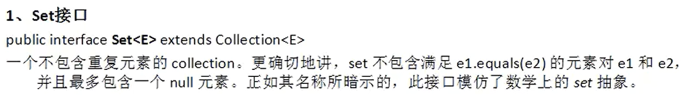

---

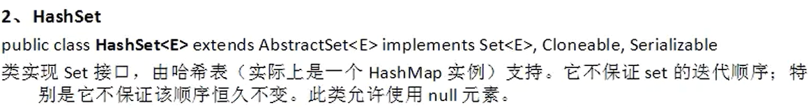

1. 根据HashSet类中属性，可知HashSet底层使用的是HashMap。

```java
@java.io.Serial
static final long serialVersionUID = -5024744406713321676L;

private transient HashMap<E,Object> map;

// Dummy value to associate with an Object in the backing Map
private static final Object PRESENT = new Object();
```

2. 根据元素添加方法，可知HashMap中第一个元素是我们需要的数据，第二个元素一直是PRESENT。即HashMap中把需要的元素作为HashMap的key存储，把一个固定的Object对象作为HashMap的value存储。

```java
public boolean add(E e) {
    return map.put(e, PRESENT)==null;
}
```

1. 哈希表由  数组+链表  实现。即数组中的每一个元素都是一个链表。当通过哈希值计算得出的数组中的位置已经存放了元素时，则将其放入该位置的链表后面。遍历时则是将数组从前到后的链表挨个进行遍历。

2. HashMap默认的初始容量为16。默认的最大容量为2的30次方。

```java
static final int DEFAULT_INITIAL_CAPACITY = 1 << 4; // aka 16
static final int MAXIMUM_CAPACITY = 1 << 30;
```

3. 两个对象属性相等，它们可以同时存入HashSet中，如何设置，可以使它们存入HashSet中时被判定为元素相等？即只能存一个。


之所以这样判断两个对象是否相等，是因为两个对象若相等，则其哈希值一定相等，两个对象不相等，则其哈希值可能想等，也可能不相等。即哈希值不等，则对象一定不等，哈希值相等，对象可能相等，可能不等。

所以如果要实现3中的方法，需重写hashCode()方法和equals()方法。之所以要重写，是因为对象继承的Object对象中的这两个方法，他们操作的都是对象的地址值，而非属性值。


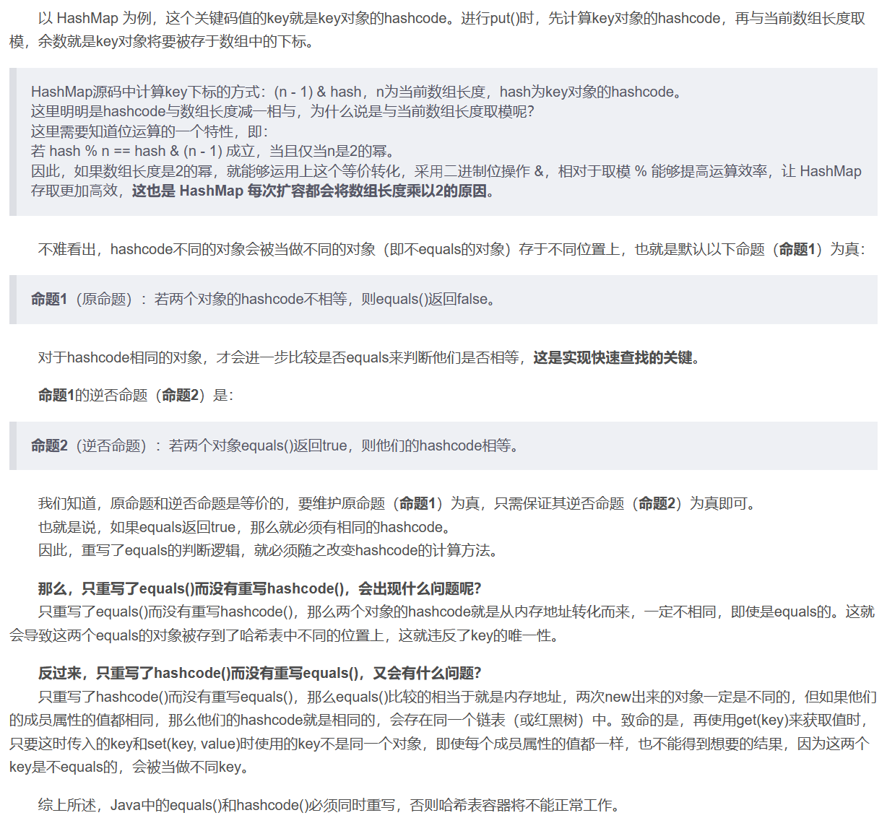

---

TreeSet底层使用的是TreeMap。

```java
private transient NavigableMap<E,Object> m;
private static final Object PRESENT = new Object();

public TreeSet() {
    this(new TreeMap<>());
}
```


```java
private static void treeSet() {
    TreeSet<Cat> tree = new TreeSet<>();

    Cat c1 = new Cat("喵喵", 5, 0);
    Cat c2 = new Cat("花花", 5, 1);
    Cat c3 = new Cat("咪咪", 8, 2);
    Cat c4 = new Cat("拉拉", 5, 3);

    tree.add(c1);
    tree.add(c2);
    tree.add(c3);
    tree.add(c4);

    System.out.println(tree.size());
}
```


报错原因是TreeSet是有序的，而上述代码类型为对象，未实现排序接口，所以报错。

解决方法：

+ Cat类实现Comparable接口。

+ 创建TreeSet时传入Comparator比较器。

改写内容：

```java
TreeSet<Cat> tree = new TreeSet<>(new CatComparator());


class CatComparator implements Comparator<Cat> {

    @Override
    public int compare(Cat c1, Cat c2) {
        return c1.getAge() - c2.getAge();
    }
}
```

改完后输出结果：


问题：

明明添加了4个元素，为何集合大小为2？

解答：

因为我们是按照年龄进行比较排序的，这四个元素中有三个元素年龄相等，都是5，TreeSet把年龄相等的当成是一个对象了。所以，比较器除了排序功能以外，还有判断重复元素这一功能。这就导致比较器不能只是简简单单进行相减，还要有其他判断与比较。

---

由  哈希表+链表  来实现。


## 49.2 Iterator


+ foreach在jdk1.5之后有的，Iterator和ListIterator在jdk1.2之后有的，Enumeration在jdk1.0之后有的。

+ 凡是实现了elements()方法的都能使用Enumeration接口遍历。

```java
public static void main(String args[]) {
    Enumeration<String> days;
    Vector<String> dayNames = new Vector<String>();
    dayNames.add("Sunday");
    dayNames.add("Monday");
    dayNames.add("Tuesday");
    dayNames.add("Wednesday");
    dayNames.add("Thursday");
    dayNames.add("Friday");
    dayNames.add("Saturday");
    days = dayNames.elements();
    while (days.hasMoreElements()){
        System.out.println(days.nextElement()); 
    }
}
```

+ 凡是实现了listIterator()方法的都能使用ListIterator接口遍历。(只有List集合实现了)

+ 凡是实现了iterator()方法的都能使用Iterator接口遍历。
  
  + Iterator方法
  
  
  
  + Iterator示例
  
  ```java
  // Iterator迭代
  private static void iteratorPrint(Collection<Cat> c) {
      Iterator<Cat> iter = c.iterator();
  
      while(iter.hasNext()) {
          System.out.println(iter.next());
      }
      System.out.println("-------------------");
  }
  ```

## 49.3 foreach与Consumer

+ 用法示例


+ :: 方法的引用。
  
  1. 引用静态方法。eg：Integer::valueOf。
  
  2. 应用对象的方法。eg：list::add。
  
  3. 引用构造方法。eg：Arrays::new。

+ 代码示例

```java
// foreach的lambda形式
private static void foreachLambdaPrint() {
    List<String> list = new ArrayList<>();

    list.add("Sam");
    list.add("Amy");
    list.add("Daming");
    list.add("Lingling");

    list.forEach((String s) -> {System.out.println(s);});
    System.out.println("-------------------");
}
```

+ 底层源码

```java
default void forEach(Consumer<? super T> action) {
    Objects.requireNonNull(action);
    for (T t : this) {
        action.accept(t);
    }
}
```

根据源码可知，forEach方法中使用的也是foreach遍历，只是写法上用Lambda表达式更加便利。

## 49.4 jdk1.8新特性


使用它们可以降低耦合性。

+ Consumer<T>接口底层源码

```java
@FunctionalInterface
public interface Consumer<T> {

    void accept(T t);

    default Consumer<T> andThen(Consumer<? super T> after) {
        Objects.requireNonNull(after);
        return (T t) -> { accept(t); after.accept(t); };
    }
}
```

+ Function<T, R>接口底层源码

```java
@FunctionalInterface
public interface Function<T, R> {

    R apply(T t);

    default <V> Function<V, R> compose(Function<? super V, ? extends T> before) {
        Objects.requireNonNull(before);
        return (V v) -> apply(before.apply(v));
    }

    default <V> Function<T, V> andThen(Function<? super R, ? extends V> after) {
        Objects.requireNonNull(after);
        return (T t) -> after.apply(apply(t));
    }

    static <T> Function<T, T> identity() {
        return t -> t;
    }
}
```

+ Function<T, R>接口代码示例

```java
public class FunctionJieKou {
    public static void main(String[] args) {
        functionTest();
    }

    public static String strToUpp(String str, Function<String, String> f) {
        return f.apply(str);
    }

    private static void functionTest() {
        // 也可写成 String s = strToUpp("woxiangxinziji", (str)->{return str.toUpperCase();});二者等价。
        // lambda表达式只有一条语句且不加大括号且有返回值时，可以省略return。加了大括号则不能省。
        String s = strToUpp("woxiangxinziji", (str)->str.toUpperCase());
        System.out.println(s);
    }
}
```

+ Function<T, R>接口的andThen()使用示例（Consumer接口相似）

```java
public class DemoFunctionAndThen {

    public static void main(String[] args) {
        method(
                str -> Integer.parseInt(str)+10,
                i -> i *= 10
        );
    }

    private static void method(Function<String, Integer> one, Function<Integer, Integer> two) {
        int num = one.andThen(two).apply("10");
        System.out.println(num + 20);
    }
}
```

1. 输出结果为220。先转换并加10，后乘以10，最后输出加20。

2. andThen可连用。eg：one.andThen(two).andThen(three).apply(str);（执行顺序为：apply(str)，andThen(two)，andThen(three)）
+ Supplier<T>接口底层源码

```java
@FunctionalInterface
public interface Supplier<T> {

    T get();
}
```

+ Supplier<T>接口代码示例

```java
private static void supplierTest() {

    List<Integer>list = getNums(10, () -> (int)(Math.random()*100));

    for(Integer i:list) {
        System.out.println(i);
    }
    System.out.println("----------");
}

private static List<Integer> getNums(int num, Supplier<Integer> sup) {
    List<Integer> list = new ArrayList<>();

    for(int i = 0; i < num; i++) {
        list.add(sup.get());
    }

    return list;
}
```

+ Predicate<T>接口底层源码

```java
@FunctionalInterface
public interface Predicate<T> {

    boolean test(T t);

    default Predicate<T> and(Predicate<? super T> other) {
        Objects.requireNonNull(other);
        return (t) -> test(t) && other.test(t);
    }

    default Predicate<T> negate() {
        return (t) -> !test(t);
    }

    default Predicate<T> or(Predicate<? super T> other) {
        Objects.requireNonNull(other);
        return (t) -> test(t) || other.test(t);
    }

    static <T> Predicate<T> isEqual(Object targetRef) {
        return (null == targetRef)
                ? Objects::isNull
                : object -> targetRef.equals(object);
    }

    @SuppressWarnings("unchecked")
    static <T> Predicate<T> not(Predicate<? super T> target) {
        Objects.requireNonNull(target);
        return (Predicate<T>)target.negate();
    }
}
```

+ Predicate<T>接口代码示例

```java
private static void predicateTest() {
    List<String> list = Arrays.asList("Sam", "Amy", "Daming", "Lingling");

    List<String> results = isContain(list, (s) -> s.contains("a"));

    results.forEach((s) -> System.out.println(s));
    System.out.println("----------");
}

public static List<String> isContain(List<String> list, Predicate<String> str) {
    List<String> results = new ArrayList<>();

    for(String s:list) {
        if(str.test(s)) {  // 测试是否符合要求
            results.add(s);
        }
    }

    return results;
}
```

Arrays.asList(T... a)方法：返回由指定数组支持的固定大小的列表。所以说，该列表大小固定，无法动态扩容。

## 49.5 Stream接口


+ 中间操作：对象.方法1.方法2...  方法2执行完后返回一个Stream流继续执行方法1。

+ 结束操作：对象.方法  方法执行完后便结束。

Stream流是一次性的，即执行完一次操作后便会关闭，要是需继续操作，则需再次创建。这就是为什么下述代码要创建st1,st2,st3,st4,st5,st6,st7这么多Stream流的原因。

```java
// foreach方法，结束操作
Stream<String> st1 = Stream.of("good", "good", "study", "day", "day", "up");

st1.forEach((str) -> System.out.println(str));
System.out.println("--------------");

// filter方法，中间操作
Stream<String> st2 = Stream.of("good", "good", "study", "day", "day", "up");

st2.filter((s) -> s.length()>3).forEach(System.out::println);
System.out.println("--------------");

// distinct去重复
Stream<String> st3 = Stream.of("good", "good", "study", "day", "day", "up");

st3.distinct().forEach(System.out::println);
System.out.println("--------------");

/*
map方法：
原流经过操作后，将原流中的数据映射到另一个流中。
*/
Stream<String> st4 = Stream.of("good", "good", "study", "day", "day", "up");

st4.map(s -> s.toUpperCase()).forEach(System.out::println);
System.out.println("--------------");

/*
flatMap方法：
一个流中有多个集合，经过操作后，
将原流中的数据映射到另一个流中，
且在另一个流中只有一个集合，即将它们合并了。
*/
Stream<List<Integer>> st5 = Stream.of(Arrays.asList(1, 2, 3), Arrays.asList(4, 5));

st5.flatMap(list -> list.stream()).forEach(System.out::println);
System.out.println("--------------");

/*
reduce方法：reduce(BinaryOperator<T> accumulator) 
使用 associative累积函数对此流的元素执行 reduction ，
并返回描述减小值的 Optional （如果有）。 
用于求流中元素的和、最大值、最小值等。
*/
Stream<String> st6 = Stream.of("good", "good", "study", "day", "day", "up");

Optional<String> opt = st6.reduce((s1, s2) -> s1.length() >= s2.length() ? s1:s2);

System.out.println(opt.get());
System.out.println("--------------");

// collect方法，通过流生成不同的集合
Stream<String> st7 = Stream.of("good", "good", "study", "day", "day", "up");

List<String> list = st7.collect(Collectors.toList());
list.forEach(System.out::println);
System.out.println("--------------");

/*
:: 方法的引用。
1、引用静态方法。eg：Integer::valueOf。
2、应用对象的方法。eg：list::add。
3、引用构造方法。eg：Arrays::new。
*/
```

## 49.6 Map

---


+ HashMap遍历代码示例

```java
private static void hashMap() {
    Map<Integer, String> map = new HashMap<>();

    map.put(1, "喵喵");
    map.put(2, "花花");
    map.put(3, "拉拉");
    map.put(4, "梦梦");

    System.out.println("size="+map.size());
    System.out.println("--------------------");
    System.out.println(map.get(1));
    System.out.println("--------------------");

    // map的遍历1，将键值对放入Set集合中遍历
    Set<Entry<Integer, String>> entrySet = map.entrySet();

    for(Entry<Integer, String> e:entrySet) {
        System.out.println(e.getKey()+"->"+e.getValue());
    }
    System.out.println("--------------------");

    // map的遍历2，将键放入Set集合中，再根据键进行遍历
    Set<Integer> keys = map.keySet();

    for(Integer i:keys) {
        System.out.println(i+"->"+map.get(i));
    }
    System.out.println("--------------------");

    // map的遍历3，将值放入Collection中，再进行遍历，只能得到值，不能得到键
    Collection<String> values = map.values();

    for(String s:values) {
        System.out.println(s);
    }
    System.out.println("--------------------");

    // map的遍历4，使用forEach
    map.forEach((key, value) -> System.out.println(key+"->"+value));
    System.out.println("--------------------");
}
```

+ HashMap实现原理
1. 基于哈希表（数组  +  链表  +  [ (jdk1.8加上的) 二叉树 (红黑树) ]）实现。(加红黑树是为了保持树的左右两边平衡，这样遍历时性能会更好)。

2. 默认负载因子为0.75f，负载因子象征着一根红线，当哈希表底层的数组空间使用量达到75%时，表示这个数组已经 “存满了”，即存储的数据已经达到峰值（红线），此时底层数组需要重新散列（重新创建），也就是说数组需要扩充了。
   
   默认负载因子（.75）提供了时间和空间成本之间的良好折中。 更高的值会降低空间开销，但会增加查找成本（反映在HashMap类的大部分操作中，包括get和put ）。 在设置其初始容量时，应考虑map中预期的条目数及其负载因子，以便最小化重新组播操作的数量。 如果初始容量大于最大条目数除以负载因子，则不会发生重新排列操作。
   
   看完下述代码得出为何要使用负载因子。

3. 默认底层数组大小为16。

4. HashMap实现部分源码

```java
// HashMap底层数组初始化默认长度为16
static final int DEFAULT_INITIAL_CAPACITY = 1 << 4; // aka 16
// HashMap底层数组最大长度
static final int MAXIMUM_CAPACITY = 1 << 30;

// HashMap默认负载因子大小
static final float DEFAULT_LOAD_FACTOR = 0.75f;

// HashMap底层数组中链表阈值，快到这一阈值时，链表将转化为红黑树
static final int TREEIFY_THRESHOLD = 8;

// HashMap的底层数组
transient Node<K,V>[] table;
```

```java
// HashMap元素添加
public V put(K key, V value) {
    return putVal(hash(key), key, value, false, true);
}
```

```java
/*
上述put()方法中的hash()方法，通过元素的键计算其哈希值。
哈希值的计算方法：
1、求出系统给予的哈希值h1并将其右移16位得到h2。
2、将h1与h2异或得到要使用的哈希值。
*/
static final int hash(Object key) {
    int h;
    return (key == null) ? 0 : (h = key.hashCode()) ^ (h >>> 16);
}
```

```java
// HashMap的内部类的一部分，底层数组的对象类型
static class Node<K,V> implements Map.Entry<K,V> {
    final int hash;
    final K key;
    V value;
    // 由此可知底层数组每一个元素都是一个链表
    Node<K,V> next;
    // ......后面还有
}
```

```java
// 上述put()方法中的putVal()方法的一部分，添加元素
final V putVal(int hash, K key, V value, boolean onlyIfAbsent,
                   boolean evict) {
    Node<K,V>[] tab; Node<K,V> p; int n, i;
    // 如果HashMap底层数组为空或长度等于0，则使用resize()方法重置数组长度
    if ((tab = table) == null || (n = tab.length) == 0)
        // 通过resize()方法可知，初始化后底层数组大小为16，即n=16
        n = (tab = resize()).length;
    // 存储元素时，将hash()方法得到的hash进行计算(hash & 15),也可写成(hash % 16)。
    // 若计算得到的底层数组下标所在空间为空，则将元素存入，否则存入其后面的链表中。
    if ((p = tab[i = (n - 1) & hash]) == null)
        tab[i] = newNode(hash, key, value, null);
    else {
        Node<K,V> e; K k;
        if (p.hash == hash &&
            ((k = p.key) == key || (key != null && key.equals(k))))
            e = p;
        else if (p instanceof TreeNode)
            e = ((TreeNode<K,V>)p).putTreeVal(this, tab, hash, key, value);
        else {
            for (int binCount = 0; ; ++binCount) {
                if ((e = p.next) == null) {
                    p.next = newNode(hash, key, value, null);
                    // 如果某一链表长度大于等于7，则将链表转化为红黑树，目的是取值更快
                    if (binCount >= TREEIFY_THRESHOLD - 1) // -1 for 1st
                        treeifyBin(tab, hash);
                    break;
                }
                // ......后面还有
}
```

```java
// 上述putVal()方法中的resize()方法的一部分，数组长度重置方法
final Node<K,V>[] resize() {
    Node<K,V>[] oldTab = table;
    int oldCap = (oldTab == null) ? 0 : oldTab.length;
    int oldThr = threshold;
    int newCap, newThr = 0;
    if (oldCap > 0) {
        if (oldCap >= MAXIMUM_CAPACITY) {
            threshold = Integer.MAX_VALUE;
            return oldTab;
        }
        /*
        oldCap表示原来数组长度，newCap表示新数组长度。
        当原来数组长度大于0且需要重置数组长度时，
        新数组长度为原来数组长度的2倍。
        newCap = oldCap << 1
        */
        else if ((newCap = oldCap << 1) < MAXIMUM_CAPACITY &&
                    oldCap >= DEFAULT_INITIAL_CAPACITY)
            newThr = oldThr << 1; // double threshold
    }
    else if (oldThr > 0) // initial capacity was placed in threshold
        newCap = oldThr;
    else {               // zero initial threshold signifies using defaults
        // 由此可知，数组默认长度为16。
        newCap = DEFAULT_INITIAL_CAPACITY;
        newThr = (int)(DEFAULT_LOAD_FACTOR * DEFAULT_INITIAL_CAPACITY);
    }
    // ......后面还有
}
```

之所以要使用负载因子，是因为HashMap底层使用的是（数组 + 链表 + [ (jdk1.8加上的) 二叉树 (红黑树) ]）实现，如果数组空间剩下的越少，那么会导致元素不断地存储到链表上，使得链表长度不断增大，虽然jdk1.8使用了红黑树，但还是会降低查找速率，降低性能。

5. HashMap底层数组扩充原理
   
   当数组容量超过了75%时，那么表示该数组需要被扩充，扩充为原来大小的2倍。此时HashMap中的所有元素都需重新计算哈希值，重新分配其在数组中的位置。此过程十分消耗性能。因此开发中要尽量减少扩充次数。

6. HashMap是线程不安全的，适合在单线程中使用。

---


+ 基于哈希表实现（数组+链表）

+ 默认数组大小为11，负载因子为0.75f

+ 扩充方式：原数组大小乘以2再加上1

+ 是线程安全的，用于多线程访问

```java
private transient Entry<?,?>[] table;
```

```java
private static class Entry<K,V> implements Map.Entry<K,V> {
    final int hash;
    final K key;
    V value;
    Entry<K,V> next;
```

```java
public Hashtable() {
    this(11, 0.75f);
}
```

---


---


```java
Map<String, String> map1 = new TreeMap<>();

map1.put("one", "花花");
map1.put("two", "喵喵");
map1.put("thr", "拉拉");
map1.put("fou", "梦梦");

map1.forEach((key, value) -> System.out.println(key+"->"+value));
System.out.println("------------------");

Map<Cat, String> map2 = new TreeMap<>(new CatComparator());

map2.put(new Cat("拉拉", 2, 0), "one");
map2.put(new Cat("娜娜", 5, 1), "two");
map2.put(new Cat("梦梦", 5, 2), "thr");
map2.put(new Cat("喵喵", 3, 3), "fou");

// 只输出三个元素，原因是age有相同的，键不能“相同”
map2.forEach((key, value) -> System.out.println(key+"->"+value));
System.out.println("------------------");
```


仔细观察输出结果，会发现第二个输出中的  娜娜  这个对象键原本对应的值是  two  ，结果变成了  thr  这个跟它年龄相同的  梦梦  对象键的值。也就是说，当比较时若键“相同”，则键不变，值替换。

+ 底层代码

```java
private transient Entry<K,V> root;

private transient int size = 0;
```

```java
static final class Entry<K,V> implements Map.Entry<K,V> {
    K key;
    V value;
    Entry<K,V> left;
    Entry<K,V> right;
    Entry<K,V> parent;
    boolean color = BLACK;
```

---

Map新特性：

```java
public class MapJieKou {
    public static void main(String[] args) {
        Map<Integer, String> map = new HashMap<>();

        map.put(1, "喵喵");
        map.put(2, "花花");
        map.put(3, "拉拉");
        map.put(4, "梦梦");

        // getOrDefault()方法当键值对存在，返回键对应的值，否则返回第二个参数
        // getOrDefault()方法中第二个参数类型与键值对中值的类型一致，否则报错
        String value = map.getOrDefault(0, "null");

        System.out.println(value);
        System.out.println("-----------------");

        /*
        put()方法：
        若赋值的键已存在，则会将键原来对应的值进行替换，并返回原来的值。
        若赋值的键不存在，则会将键值对存入，并返回null。

        putIfAbsent()方法：
        若赋值的键已存在，则不会进行存储，并返回原来的值。
        若赋值的键不存在，则会将键值对存入，并返回null。

        default V putIfAbsent(K key, V value) {
            V v = get(key);
            if (v == null) {
                v = put(key, value);
            }
            return v;
        }
        */
        map.putIfAbsent(5, "娜娜");

        map.forEach((k, v) -> System.out.println(k+"->"+v));
        System.out.println("-----------------");

        // 若删除的键存在，则删除该键值对，并返回原来的值。
        // 若删除的键不存在，则不做处理，并返回null。
        map.remove(4);

        // 若删除的键和值都与之对应，则删除该键值对，并返回true。
        // 若删除的键和值只要有一个不对应，则不做处理，并返回false。
        map.remove(5, "拉拉");

        map.forEach((k, v) -> System.out.println(k+"->"+v));
        System.out.println("-----------------");

        // 若替换的键存在，则替换该值，并返回原来的值。
        // 若替换的键不存在，则不做处理，并返回null。
        map.replace(1, "哈哈");

        // 若替换的键和值都与之对应，则替换该值，并返回true。
        // 若替换的键和值只要有一个不对应，则不做处理，并返回false。
        map.replace(2, "花花", "咪咪");

        map.forEach((k, v) -> System.out.println(k+"->"+v));
        System.out.println("-----------------");

        // compute方法：default V compute(K key, BiFunction<...> ...)
        map.compute(1, (k, v) -> v + "喵喵");

        /*
        computeIfAbsent()方法：
        1、default V computeIfAbsent(K key, Function<...> ...)
            key存在时，不操作，不存在时，操作。
        2、default V computeIfPresent(K key, BiFunction<...> ...)
            key存在时，操作，不存在时，不操作。
        */
        map.computeIfAbsent(8, (v) -> new String("呱呱"));
        map.computeIfPresent(1, (k, v) -> v + "嘻嘻");

        map.forEach((k, v) -> System.out.println(k+"->"+v));
        System.out.println("-----------------");

        // merge()方法参数功能如下：
        // default V merge(K (存不存在都可)key, V (new)value, BiFunction<oldVal, newVal> ...)
        map.merge(6, "丫丫", (oldVal, newVal) -> oldVal.concat(newVal));

        map.forEach((k, v) -> System.out.println(k+"->"+v));
        System.out.println("-----------------");
    }
}
```

## 49.7 Collections工具类


```java
List<String> syncList = Collections.synchronizedList(new ArrayList<String>());
```


+ emptyXxx()方法用处之一：
  
  
  
  当我们查找集合中某个元素未找到时，返回一个null，此时外部调用该函数后还需判断返回值是否为空，如果用空集合，就不存在这一判断，可以避免程序出错。

+ reverseOrder()方法用处之一：集合数据反序排列。
  
  ```java
  Collections.sort(syncList, Collections.reverseOrder());
  ```


## 49.8 Optional容器类


```java
public static void main(String[] args) {
    Optional<String> opt1 = Optional.of("bin");
    // 返回一个指定值的Optional，如果值为null，则返回一个空的Optional
    Optional<String> opt2 = Optional.ofNullable("bin");
    // 返回一个空的 Optional实例
    Optional<String> opt3 = Optional.empty();

    // 调用Optional方法

    System.out.println(opt3.isPresent());
    System.out.println("-----------------");

    System.out.println(opt2.get());
    System.out.println("-----------------");

    opt1.ifPresent((value) -> System.out.println(value));
    System.out.println("-----------------");

    System.out.println(opt3.orElse("无值"));
    System.out.println("-----------------");

    System.out.println(opt3.orElseGet(() -> "default"));
    System.out.println("-----------------");

    try {
        opt3.orElseThrow(Exception::new);
    } catch (Exception e) {
        e.printStackTrace();
    }
    System.out.println("-----------------");

    Optional<String> opt4 = opt1.map((value) -> value.toUpperCase());
    System.out.println(opt4.orElse("null Optional"));
    System.out.println("-----------------");

    Optional<String> opt5 = opt1.flatMap((value) -> Optional.of(value.toUpperCase()+"-flatmap"));
    System.out.println(opt5.orElse("null Optional"));
    System.out.println("-----------------");

    Optional<String> opt6 = opt1.filter((value) -> value.length()>=3);
    System.out.println(opt6.orElse("null Optional"));
    System.out.println("-----------------");
}
```


## 49.9 Queue


```java
private static void queue() {
    Queue<String> queue = new LinkedList<>();

    queue.add("喵喵");
    queue.add("花花");
    queue.add("梦梦");
    queue.add("拉拉");
    queue.add("娜娜");

    System.out.println(queue.size());

    System.out.println(queue.peek());
    System.out.println(queue.size());

    System.out.println(queue.poll());
    System.out.println(queue.size());
}
```


## 49.10 Deque

双端队列是一种允许我们同时从前端和后端添加和删除元素的特殊队列，它是队列和栈的结合体。

计算机科学中，双端队列常见的应用是存储一系列的撤销操作时。每当用户进行一个操作，改操作就会被存放在一个双端队列中。当用户Ctrl+Z时，该操作会被从双端队列弹出，表示它被从后面移除了。


```java
private static void deque() {
    Deque<String> deque = new LinkedList<>();

    deque.add("喵喵");
    deque.add("花花");
    deque.add("梦梦");
    deque.add("拉拉");
    deque.add("娜娜");

    System.out.println(deque.getFirst());
    System.out.println(deque.size());

    System.out.println(deque.getLast());
    System.out.println(deque.size());
}
```


## 49.11 Stack堆栈工具类


```java
public static void main(String[] args) {
    Stack<String> st = new Stack<>();

    st.push("拉拉");
    st.push("梦梦");
    st.push("娜娜");

    System.out.println(st.peek());
    System.out.println(st.size());

    System.out.println(st.pop());
    System.out.println(st.size());
}
```


Stack源码：

```java
public class Stack<E> extends Vector<E> {
```

由此可知，Stack工具类继承了Vector类。

## 49.12 对象“一对多”与“多对多”关系

+ 对象一对一关系：把对象1作为对象2的属性。

+ 对象一对多关系：把对象1的集合作为对象2的属性，对象2作为对象1的属性。
  
  ```java
  public class Teacher {
      private String name;
      private int age;
      private String sex;
  
      private HashSet<Student> students = new HashSet<>();
  ```
  
  ```java
  public class Student {
      private String name;
      private int age;
      private String sex;
  
      private Teacher teacher;
  ```

+ 对象多对多关系：把对象1的集合作为对象2的属性，对象2的集合作为对象1的属性。
  
  在开发中两个对象尽量不要直接用多对多关系，因为那会使得逻辑很复杂，此时可以使用一个中间对象将多对多关系转换成两个一对多关系来间接表示多对多关系。
  
  学生—学生And课程—课程，一个  学生And课程  对应多个  学生/课程。
  
  ```java
  public class Student {
      private String name;
      private int age;
      private String sex;
      private int stuId;
  
      private Teacher teacher;
  
      private StudentAndCourse stuCou;
  ```
  
  ```java
  public class Course {
      private String name;
      private int couId;
  
      private StudentAndCourse stuCou;
  ```
  
  ```java
  public class StudentAndCourse {
      private int id;
      private int stuId;
      private int couId;
  
      private HashSet<Student> students = new HashSet<>();
      private HashSet<Course> courses = new HashSet<>();
  ```

## 49.13 迭代器设计模式


```java
public interface Iterator {
    public boolean hashNext();
    public Object next();
}
```

```java
public class ConcreteIterator implements Iterator {
    private MyList list = null;
    private int index;

    public ConcreteIterator(MyList list) {
        this.list = list;
    }

    @Override
    public boolean hashNext() {
        if(index >= list.getSize()) {
            return false;
        }
        return true;
    }

    @Override
    public Object next() {
        Object obj = list.get(index);
        index++;
        return obj;
    }
}
```

```java
public interface MyList {
    void add(Object e);
    Object get(int index);
    Iterator iterator();
    int getSize();
}
```

```java
public class ConcreteAggregate implements MyList {
    private Object[] elements;
    private int size;
    private int index;

    public ConcreteAggregate() {
        elements = new Object[100];
    }

    @Override
    public void add(Object e) {
        elements[index++] = e;
        size++;
    }

    @Override
    public Object get(int index) {
        return elements[index];
    }

    @Override
    public Iterator iterator() {
        return new ConcreteIterator(this);
    }

    @Override
    public int getSize() {
        return size;
    }
}
```

```java
public class Test {
    public static void main(String[] args) {
         MyList list = new ConcreteAggregate();

         list.add("拉拉");
         list.add("娜娜");
         list.add("梦梦");
         list.add("喵喵");

         IteratorDieDaiQi iter = list.iterator();

         while(iter.hashNext()) {
            System.out.println(iter.next());
         }
    }
}
```

## 49.14 Guava组件（集合部分）


1. 代码示例1

```java
// 只读设置
@Test  // JUnit测试
public void testGuava1() {

    System.out.println("test guava");

    // 创建并输出一个只读的集合

    // 方法1：使用Collections工具类
    List<String> list1 = new ArrayList<>();
    list1.add("拉拉");
    list1.add("梦梦");
    list1.add("喵喵");
    List<String> list2 = Collections.unmodifiableList(list1);
    System.out.println(list2);

    // 方法2：使用Guava组件的ImmutableList类
    ImmutableList<String> iList = ImmutableList.of("拉拉", "喵喵", "梦梦");
    System.out.println(iList);
}
```

2. 代码示例2

```java
// 函数式编程：过滤器
@Test  // JUnit测试
public void testGuava2() {

    // 将集合中首字母为“j”的元素过滤提取出来

    // 使用Guava组件的Lists类创建一个ArrayList集合
    List<String> list = Lists.newArrayList("java", "php", "jdk", "html", "json", "javascript");
    // 使用Guava组件的Collections2类中的filter()过滤器来筛选元素
    Collection<String> result = Collections2.filter(list, (e) -> e.startsWith("j"));

    result.forEach((v) -> System.out.println(v));
}
```

3. 代码示例3

```java
// 函数式编程：转换
@Test  // JUnit测试
public void testGuava3() {

    // 将集合中的毫秒值转换为年月日字符串输出

    // 使用Guava组件的Sets类创建一个HashSet集合（此处存储的是时间的毫秒值）
    Set<Long> timeSet = Sets.newHashSet(2012121287521L, 2017798451015L, 133520230228L, 2023775120318L);
    // 使用Guava组件的Collections2类中的transform(Collection<F>, Function<...>)来对集合进行操作
    Collection<String> timeCollect = Collections2.transform(timeSet, (e) -> new SimpleDateFormat("yyyy-MM-dd").format(e));

    timeCollect.forEach(System.out::println);
}
```

4. 代码示例4

```java
// 组合式函数编程
@Test  // JUnit测试
public void testGuava4() {

    // 将集合中的元素前三个字符提取出来并转换为大写后将其输出

    // 使用Guava组件的Lists类创建一个ArrayList集合
    List<String> list = Lists.newArrayList("java", "php", "jdk", "html", "json", "javascript");

    // 创建Guava组件的Functions类中的compose(Function<...>, Function<...>)中的两个Function实现类
    // compose(Function<...>, Function<...>)方法是将两个Function实现类组合成一个

    // 方法1
    Function<String, String> f = Functions.compose((e1) -> e1.length()>3 ? e1.substring(0, 3):e1, (e2) -> e2.toUpperCase());

    // 方法2
    /*
    Function<String, String> f1 = new Function<String,String>() {
        @Override
        public String apply(String t) {
            return t.length()>3 ? t.substring(0, 3):t;
        }
    };
    Function<String, String> f2 = new Function<String,String>() {
        @Override
        public String apply(String t) {
            return t.toUpperCase();
        }
    };
    Function<String, String> f3 = Functions.compose(f1, f2);
    */

    // 使用Guava组件的Collections2类中的transform(Collection<F>, Function<...>)来对集合进行操作
    Collection<String> result = Collections2.transform(list, f);

    result.forEach(System.out::println);
}
```

上述代码中，Functions.compose()方法返回的Function对象是下述2中的，1中的不行。

```java
1、import java.util.function.Function;
2、import com.google.common.base.Function;
```

5. 代码示例5

```java
// 加入约束：非空、长度验证
@Test  // JUnit测试
public void testGuava5() {

    // 使用Guava组件的Preconditions类进行约束

    try{
        // checkArgument(boolean expression)方法验证表达式是否为真
        // 为真，什么都不做，为假，抛出IllegalArgumentException()异常
        Preconditions.checkArgument(false);
    } catch(Exception e) {
        System.out.println(e);
    }

    try {
        // checkNotNull(T reference)方法判断引用是否为空
        // 为空，抛出NullPointerException()异常，非空，返回引用
        Preconditions.checkNotNull(null);
    } catch(Exception e) {
        System.out.println(e);
    }
}
```


约束类Constraint在Guava14版本及之前可用，在Guava14之后的版本中已弃用。

6. 代码示例6

```java
// 集合操作：交集、差集、并集
@Test  // JUnit测试
public void testGuava6() {

    // 使用Guava组件的Sets类创建一个HashSet集合
    Set<Integer> set1 = Sets.newHashSet(1, 2, 3);
    Set<Integer> set2 = Sets.newHashSet(3, 4, 5);

    // 求集合set1和集合set2的交集
    SetView<Integer> sv1 = Sets.intersection(set1, set2);
    sv1.forEach(System.out::println);

    // 求集合set1和集合set2的差集
    SetView<Integer> sv2 = Sets.difference(set1, set2);
    sv2.forEach(System.out::println);

    // 求集合set1和集合set2的并集
    SetView<Integer> sv3 = Sets.union(set1, set2);
    sv3.forEach(System.out::println);
}
```

SetView是Set接口实现类AbstractSet的子类。

7. 代码示例7

```java
// Multiset：无序可重复
@Test  // JUnit测试
public void testGuava7() {

    // 计算字符串中每个单词出现的次数

    String s = "good good study day day up";
    String[] ss = s.split(" ");

    // 使用Guava组件的HashMultiset类创建一个无序可重复集合
    HashMultiset<String> set1 = HashMultiset.create();
    // 将单词添加进HashMultiset无序可重复集合中
    for(String str:ss) {
        set1.add(str);
    }

    // 遍历无序可重复集合
    set1.forEach((v) -> System.out.println(v));
    System.out.println("-------");

    // 使用HashMultiset类中的elementSet()方法返回一个Set集合
    Set<String> set2 = set1.elementSet();
    // 使用HashMultiset类中的count()方法计算元素在无序可重复集合中的个数
    for(String str:set2) {
        System.out.println(str+":"+set1.count(str));
    }
}
```


8. 代码示例8

```java
// Multimap：key可重复
@Test  // JUnit测试
public void testGuava8() {

    // 输出每位作者出版了哪些书籍。（key：书籍，value：作者）

    Map<String, String> map = new HashMap<>();
    map.putIfAbsent("Java从入门到精通", "拉拉");
    map.putIfAbsent("钢铁是怎样炼成的", "梦梦");
    map.putIfAbsent("海底两万里", "梦梦");
    map.putIfAbsent("罪与罚", "喵喵");
    map.putIfAbsent("悲惨世界", "拉拉");
    map.putIfAbsent("雾都孤儿", "梦梦");

    // 使用Guava组件的ArrayListMultimap类创建一个数组列表多映射
    Multimap<String, String> mmap = ArrayListMultimap.create();

    // 通过HashMap类中的entrySet()方法返回一个数据类型为Map.Entry<...>的Set集合
    Iterator<Map.Entry<String, String>> iter = map.entrySet().iterator();

    while(iter.hasNext()) {
        Map.Entry<String, String> entry = iter.next();
        // 将map中的键作为mmap中的值，map中的值作为mmap中的键
        mmap.put(entry.getValue(), entry.getKey());
    }

    Set<String> keySet = mmap.keySet();
    for(String key:keySet) {
        /*
        使用Guava组件的ArrayListMultimap类创建的数组列表多映射，
        值采用的是Collection集合进行存储，
        这也是为何数组列表多映射中键可以重复的原因。
        */
        Collection<String> value = mmap.get(key);

        System.out.println(key+"->"+value);
    }
}
```

9. 代码示例9

```java
// BiMap：双向Map(bidirectional Map)，键与值均不能重复
@Test  // JUnit测试
public void testGuava9() {

    // 通过微信号查询电话号码，通过电话号码查询微信号。（微信号和电话号码均不重复）

    // 使用Guava组件的HashBiMap类创建一个双向map
    BiMap<String, String> bm = HashBiMap.create();

    bm.put("getpower", "18357926948");
    bm.put("muchmoney", "15879013628");
    bm.put("upupup", "13679064568");
    bm.put("teacher", "18962593685");

    // 使用get()方法可以通过键查询值
    String phone = bm.get("getpower");
    // 当要通过值查询键时，需要使用inverse()方法将双向map进行反转
    String weChatId = bm.inverse().get("18357926948");

    System.out.println(weChatId+"->"+phone);
}
```

10. 代码示例10

```java
// 双键的 Map-->Table-->rowKey + columnKey + value
@Test  // JUnit测试
public void testGuava10() {

    // 存储（学生姓名，课程科目，成绩）并对其进行遍历

    // 使用Guava组件的HashBasedTable类创建一个双键map
    Table<String, String, Integer> table = HashBasedTable.create();

    table.put("喵喵", "java", 90);
    table.put("拉拉", "java", 92);
    table.put("梦梦", "node", 80);

    // 由于这两个元素的两个键相同，所以后添加的元素会将前一个覆盖
    table.put("梦梦", "rust", 86);
    table.put("梦梦", "rust", 88);

    // 使用get()方法通过两个键获得相应的值
    Integer g = table.get("喵喵", "java");
    System.out.println(g);

    // map中使用entrySet()方法得到的Set集合的数据类型为Map.Entry<...>
    // table中使用cellSet()方法得到的Set集合的数据类型为Cell<...>
    Set<Cell<String, String, Integer>> cells = table.cellSet();

    for(Cell<String, String, Integer> c:cells) {
        System.out.println(c.getRowKey()+"-"+c.getColumnKey()+":"+c.getValue());
    }
}
```

# 五十、多线程与并发

## 50.1 进程与线程


## 50.2 线程的两种实现方式


```java
public class ThreadDemo1 {
    public static void main(String[] args) {

        MyThread mt = new MyThread();
        // 启动线程（告诉虚拟机线程已准备就绪，可以启动了，当CPU执行到这里时，线程将执行）
        // 相当于线程进入就绪态，时间片轮转执行到它时，它便为运行态
        mt.start();

        MyRunnable mr = new MyRunnable();
        // 实现接口Runnable的程序需将其作为参数传递给Thread对象后调用start()方法
        Thread th = new Thread(mr);
        th.start();
    }
}

// 实现线程的第一种方式：继承Thread类
class MyThread extends Thread {
    @Override
    public void run() {
        for(int i = 0; i < 50; i++) {
            System.out.println(Thread.currentThread().getName()+"--"+i);
        }
    }
}

// 实现线程的第二种方式：实现Runnable接口
class MyRunnable implements Runnable {
    @Override
    public void run() {
        for(int i = 0; i < 50; i++) {
            System.out.println(Thread.currentThread().getName()+"--"+i);
        }
    }
}
```

## 50.3 线程休眠


## 50.4 join与中断线程


```java
public class ThreadDemo2 {
    public static void main(String[] args) {

        MyRunnable2 mr2 = new MyRunnable2();
        Thread tr1 = new Thread(mr2);
        tr1.start();

        MyRunnable3 mr3 = new MyRunnable3();
        Thread tr2 = new Thread(mr3);
        tr2.start();

        for(int i = 0; i < 50; i++) {
            System.out.println(Thread.currentThread().getName()+"--"+i);

            try {
                Thread.sleep(300);
            } catch (InterruptedException e) {
                e.printStackTrace();
            }

            /*
            if(i == 20) {
                try {
                    tr1.join();  // 让tr线程一直执行完毕
                } catch (InterruptedException e) {
                    e.printStackTrace();
                }
            }
            */

            /*
            if(i == 20) {
                // 中断线程（只是做了一个中断状态标记）
                tr1.interrupt();
            }
            */

            if(i == 20) {
                mr3.flag = false;
            }
        }
    }
}

class MyRunnable2 implements Runnable {
    @Override
    public void run() {
        for(int i = 0; i < 50; i++) {
            if(Thread.interrupted()) {
                // 程序中断之前，在此处做最后的处理（保存数据等）

                /* 
                当前线程被标记为中断状态后，调用interrupted()进行判断，
                为真，则用break跳出循环，线程执行完毕，结束
                */
                break;
            }

            System.out.println(Thread.currentThread().getName()+"--"+i);

            try {
                /*
                当前线程被标记为中断后，
                sleep()方法会抛出InterruptedException异常，
                并将中断标记状态清除
                */
                Thread.sleep(300);
            } catch (InterruptedException e) {
                e.printStackTrace();
                // 此时中断状态被清除，调用下述方法重新标记中断状态
                Thread.currentThread().interrupt();
            }
        }
    }
}

class MyRunnable3 implements Runnable {
    // 自定义标记中断线程
    public boolean flag = true;

    public MyRunnable3() {
        flag = true;
    }

    @Override
    public void run() {
        int i = 0;

        while(flag) {
            System.out.println(Thread.currentThread().getName()+"--"+i);
            i++;

            try {
                Thread.sleep(300);
            } catch (InterruptedException e) {
                e.printStackTrace();
            }
        }
    }
}
```

注：建议使用自定义标记来中断线程，因为使用interrupt()方法标记中断状态时，中断状态很容易会被清除。如sleep()方法等，一旦抛出异常，中断状态便会被清除。

## 50.5 守护线程与yield


daemon线程（守护线程）、用户线程（非守护线程）。

setDaemon(boolean on)：传true为守护线程，传false为用户线程。


```java
public class ThreadDemo3 {
    public static void main(String[] args) {
        MyRunnable4 mr1 = new MyRunnable4();
        Thread tr1 = new Thread(mr1);
        // 将线程设置为守护线程（一般线程默认是用户线程）
        tr1.setDaemon(true);
        // 线程进入就绪态，等待CPU调度
        tr1.start();

        for(int i = 0; i < 50; i++) {
            System.out.println("main--"+i);

            try {
                Thread.sleep(200);
            } catch (InterruptedException e) {
                e.printStackTrace();
            }

            if(i == 5) {
                // 让出本次CPU执行时间片，只让一次
                Thread.yield();
            }
        }
    }
}

class MyRunnable4 implements Runnable {
    @Override
    public void run() {
        for(int i = 0; i < 50; i++) {
            System.out.println("--"+i);

            try {
                Thread.sleep(500);
            } catch (InterruptedException e) {
                e.printStackTrace();
            }
        }
    }
}
```


isAlive()：当线程执行了start()方法进入就绪态后，结果为true，未调用start()方法，结果为false。

setPriority(int newPriority)：有三个参数：MAX_PRIORITY最高优先级、MIN_PRIORITY最低优先级、NORM_PRIORITY默认优先级。优先级越高，线程抢占CPU时间片的概率越大。

## 50.6 线程同步


```java
import java.util.concurrent.locks.ReentrantLock;

public class ThreadDemo4 {
    public static void main(String[] args) {
        MyRunnable5 mr1 = new MyRunnable5();
        // MyRunnable6 mr1 = new MyRunnable6();
        // MyRunnable7 mr1 = new MyRunnable7();

        Thread tr1 = new Thread(mr1);
        Thread tr2 = new Thread(mr1);

        tr1.start();
        tr2.start();
    }
}

class MyRunnable5 implements Runnable {
    private int tioket = 10; // 10张火车票
    private Object obj = new Object(); // 同步锁，只要是对象就行

    @Override
    public void run() {
        for (int i = 0; i < 300; i++) {

            // 线程同步方法1
            /*
             * 当一个线程通过竞争获得锁之后，其他调用同一资源的线程等待，
             * 当线程释放锁之后，与其他调用同一资源的线程继续竞争。
             * 即其他调用同一资源的线程并不会排队，而是等待进行下一次竞争。
             */
            // 直接在括号里写this也行，表示当前对象。synchronized (this) {
            synchronized (obj) {
                if (tioket > 0) {
                    tioket--;

                    try {
                        /*
                         * sleep(long millis)：
                         * 使当前正在执行的线程以指定的毫秒数暂停（暂时停止执行），
                         * 具体取决于系统定时器和调度程序的精度和准确性，
                         * 
                         * 线程不会丢失任何显示器的所有权。
                         * 正如此处，虽然调用了sleep()方法进行了休眠，让其他线程可以执行，
                         * 但是由于synchronized同步锁，其他要使用同一资源的线程依旧要等待，
                         * 调用了sleep()方法，但是不会释放同步锁。
                         */
                        Thread.sleep(1000);
                    } catch (InterruptedException e) {
                        e.printStackTrace();
                    }

                    System.out.println(Thread.currentThread().getName() + "票数剩余：" + tioket);
                }
            }
        }
    }
}

class MyRunnable6 implements Runnable {
    private int tioket = 10; // 10张火车票

    @Override
    public void run() {
        for (int i = 0; i < 300; i++) {

            // 线程同步方法2
            method();
        }
    }

    // 此处synchronized同步的对象是当前对象(this)
    private synchronized void method() {
        if (tioket > 0) {
            tioket--;

            try {
                Thread.sleep(1000);
            } catch (InterruptedException e) {
                e.printStackTrace();
            }

            System.out.println(Thread.currentThread().getName() + "票数剩余：" + tioket);
        }
    }
}

class MyRunnable7 implements Runnable {
    private int tioket = 10; // 10张火车票
    private ReentrantLock lock = new ReentrantLock(); // 互斥锁

    @Override
    public void run() {
        for (int i = 0; i < 300; i++) {

            // 线程同步方法3
            method();
        }
    }

    // 使用Lock实现同步
    private void method() {
        lock.lock(); // 获得锁
        // 使用try-catch-finally是为了确保程序即使出错也能将锁释放，避免造成死锁
        try {
            if (tioket > 0) {
                tioket--;

                try {
                    Thread.sleep(1000);
                } catch (InterruptedException e) {
                    e.printStackTrace();
                }

                System.out.println(Thread.currentThread().getName() + "票数剩余：" + tioket);
            }
        } finally {
            lock.unlock(); // 释放锁
        }

    }
}
```


上述第三条准则改成：在持有锁的时候，不要调用其他对象的同步方法。因为其他对象可能也在等待它所需的资源，它不执行完，你也不能执行。若是它等待你的资源，你等待它的资源，那么结果就是死锁。

## 50.7 线程死锁举例

```java
// 线程死锁举例
public class ThreadDemo5 {
    public static void main(String[] args) {
        new DeadThread();
    }
}

// 顾客
class Customer {
    public synchronized void say(Waiter w) {
        System.out.println("顾客说：先吃饭，再买单！");
        w.doService();
    }

    public synchronized void doService() {
        System.out.println("同意了，买完单再吃饭！");
    }
}

// 服务员
class Waiter {
    public synchronized void say(Customer c) {
        System.out.println("服务员说：先买单，再吃饭！");
        c.doService();
    }

    public synchronized void doService() {
        System.out.println("同意了，吃完饭再买单！");
    }
}

// 死锁线程
class DeadThread implements Runnable {
    Customer c = new Customer();
    Waiter w = new Waiter();

    public DeadThread() {
        new Thread(this).start();
        w.say(c);
    }

    @Override
    public void run() {
        c.say(w);
    }
}
```

输出结果：结果是程序卡在那里，既不会往下执行，也不会结束。


产生原因：

执行  w.say(c);  时，由于  say()  方法是同步方法，它会将对象  w  进行上锁。

执行  c.say(w);  时，由于  say()  方法是同步方法，它会将对象  c  进行上锁。

一旦将对象进行上锁后，除非解锁，否则对象不能被同步方法操作。

这就导致  w.doService();  在等待w解锁，c.doService();  在等待c解锁，从而造成死锁。

若是  w.doService();  和  c.doService();  不是同步方法，则不会造成死锁，因为锁限制的只是同步方法，非同步方法不做任何限制。就如上文  “线程同步”  单元中的代码，tioket若是另外放在非同步方法中操作，则无需任何等待，不过此时同步操作将变得毫无意义。

## 50.8 生产者与消费者应用案例


```java
public class ThreadDemo6 {
    public static void main(String[] args) {
        Food food = new Food();
        Producter p = new Producter(food);
        Customers c = new Customers(food);

        Thread tr1 = new Thread(p);
        Thread tr2 = new Thread(c);

        tr1.start();
        tr2.start();
    }
}

// 共享的资源（食物）
class Food {
    private String name;
    private String desc;

    private boolean flag = true;  // true表示可以生产，false表示可以消费

    // 生产产品
    public synchronized void setFood(String name, String desc) {
        // 不能生产时的操作
        if(!flag) {
            try {
                // 线程进入等待状态，释放显示器的所有权（对象锁）
                this.wait();
            } catch (InterruptedException e) {
                e.printStackTrace();
            }
        }

        this.name = name;

        // 使用线程休眠来模拟产品生产时间
        try {
            Thread.sleep(500);
        } catch (InterruptedException e) {
            e.printStackTrace();
        }

        this.desc = desc;

        flag = false;  // 产品生产完了，标记改为可消费

        // 唤醒等待的线程中的随机的一个，因为此处就两个线程，所以唤醒的肯定是另一个
        this.notify();
        // this.notifyAll(); 唤醒所有等待的线程
    }

    //消费产品
    public synchronized void getFood() {
        // 不能消费时的操作
        if(flag) {
            try {
                this.wait();
            } catch (InterruptedException e) {
                e.printStackTrace();
            }
        }

        // 模拟产品消费时间
        try {
            Thread.sleep(500);
        } catch (InterruptedException e) {
            e.printStackTrace();
        }

        System.out.println(this.name+"->"+this.desc);

        flag = true;  //产品消费完了，标记改为可生产

        this.notify();
    }
}

// 生产者（厨师）
class Producter implements Runnable {
    private Food food;

    public Producter(Food food) {
        this.food = food;
    }

    @Override
    public void run() {
        for(int i = 0; i < 20; i++) {
            if(i % 2 == 0) {
                food.setFood("锅包肉", "酸甜口味");
            } else {
                food.setFood("佛跳墙", "美容养颜");
            } 
        }
    }
}

// 消费者（服务员）
class Customers implements Runnable {
    private Food food;

    public Customers(Food food) {
        this.food = food;
    }

    @Override
    public void run() {
        for(int i = 0; i < 20; i++) {
            food.getFood();
        }
    }
}
```

正确输出结果：锅包肉->酸甜口味    佛跳墙->美容养颜    二者依次轮流输出。

1. 不使用synchronized和flag时的输出：输出顺序错乱，内容前后不对应。
   
   

2. 使用synchronized时的输出：内容前后对应，但输出顺序依旧错乱。
   
   

3. 使用synchronized和flag时的输出：内容前后对应，依次轮流输出。
   
   

同步锁目的：

解决内容前后不对应，保证共享资源的安全性。（读和写线程同一时间段内只能执行一个，另一个线程等待）

flag标记目的：

解决输出顺序错乱，确保产品先生产，后消费。生产一件消费一件，按顺序轮流。

Object类中的四个方法：


## 50.9 线程池


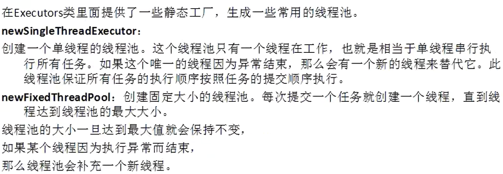


```java
// import java.util.concurrent.ExecutorService;
import java.util.concurrent.Executors;
import java.util.concurrent.ScheduledExecutorService;
import java.util.concurrent.TimeUnit;

// 线程池（JDK1.5之后的概念）
public class ThreadDemo7 {
    public static void main(String[] args) {

        // 线程池的创建（方法1、2用的最多）

        // 创建线程池1：创建一个单线程的线程池
        // ExecutorService es = Executors.newSingleThreadExecutor();

        // 创建线程池2：创建固定大小的线程池
        // ExecutorService es = Executors.newFixedThreadPool(2);

        // 创建线程池3：创建一个可缓存的线程池
        // ExecutorService es = Executors.newCachedThreadPool();

        // 创建线程池4：创建一个大小无限的线程池
        // ScheduledExecutorService是ExecutorService的子类
        ScheduledExecutorService es = Executors.newScheduledThreadPool(4);

        // 执行command
        es.execute(new MyRunnable8());
        es.execute(new MyRunnable8());
        es.execute(new MyRunnable8());

        // 线程池4独有，表示延迟300毫秒后执行
        es.schedule(new MyRunnable8(), 300, TimeUnit.MILLISECONDS);

        // 启动有序关闭，其中先前提交的任务将被执行，但不会接受任何新任务
        // 未执行完的线程继续执行，但不接受新的任务
        es.shutdown();

        // 尝试停止所有主动执行的任务，停止等待任务的处理，并返回正在等待执行的任务列表
        // 未执行完的线程进行中断状态标记
        // es.shutdownNow();
    }
}

class MyRunnable8 implements Runnable {
    @Override
    public void run() {
        for(int i = 0; i < 10; i++) {
            System.out.println(Thread.currentThread().getName()+"-->"+i);

            try {
                Thread.sleep(300);
            } catch (InterruptedException e) {
                e.printStackTrace();
                return ;
            }
        }
    }
}
```

# 五十一、网络编程

## 51.1 基本概念


## 51.2 单个客户端与单个服务器端通信示例

1. 服务器端

```java
import java.io.BufferedOutputStream;
import java.io.BufferedReader;
import java.io.IOException;
import java.io.InputStreamReader;
import java.io.PrintStream;
import java.net.ServerSocket;
import java.net.Socket;

public class EchoServerDemo {
    public static void main(String[] args) {
        try {
            // 创建一个服务器端的socket
            ServerSocket server = new ServerSocket(6666);

            System.out.println("服务器已启动，正在等待客户端连接...");

            // 等待客户端的连接。无连接，阻塞
            // 如果有客户端连接成功，立即返回一个Socket对象
            Socket socket = server.accept();

            System.out.println("客户端连接成功！"+socket.getInetAddress());

            BufferedReader br = new BufferedReader(new InputStreamReader(socket.getInputStream()));

            // 通过输入流读取网络数据。没有数据时，阻塞
            String info = br.readLine();
            System.out.println(info);

            // 获取输出流，向客户端返回消息
            PrintStream ps = new PrintStream(new BufferedOutputStream(socket.getOutputStream()));
            ps.println("echo:"+info);
            ps.flush();

            // 关闭流
            br.close();
            ps.close();

            socket.close();
            server.close();
        } catch (IOException e) {
            e.printStackTrace();
        }
    }
}
```

2. 客户端

```java
import java.io.BufferedOutputStream;
import java.io.BufferedReader;
import java.io.IOException;
import java.io.InputStreamReader;
import java.io.PrintStream;
import java.net.Socket;
import java.net.UnknownHostException;

public class EchoClientDemo {
    public static void main(String[] args) {
        try {
            // 创建一个Socket
            Socket socket = new Socket("127.0.0.1", 6666);

            // 获取socket的输出输入流
            PrintStream ps = new PrintStream(new BufferedOutputStream(socket.getOutputStream()));
            BufferedReader br = new BufferedReader(new InputStreamReader(socket.getInputStream()));

            // 向服务器写数据
            ps.println("我相信你，你很优秀");
            ps.flush();

            // 读取服务器端返回的数据
            String info = br.readLine();
            System.out.println(info);

            // 关闭流
            ps.close();
            br.close();

            socket.close();
        } catch (UnknownHostException e) {
            e.printStackTrace();
        } catch (IOException e) {
            e.printStackTrace();
        } 
    }
}
```

## 51.3 服务器与多客户端通信


server端：

```java
import java.io.BufferedOutputStream;
import java.io.BufferedReader;
import java.io.IOException;
import java.io.InputStreamReader;
import java.io.PrintStream;
import java.net.ServerSocket;
import java.net.Socket;
import java.util.concurrent.ExecutorService;
import java.util.concurrent.Executors;

public class MultiServerDemo {
    public static void main(String[] args) {

        // 创建线程池
        ExecutorService es = Executors.newFixedThreadPool(4);

        try(ServerSocket server = new ServerSocket(6666)) {

            System.out.println("服务器已启动，正在等待连接...");

            while(true) {
                Socket s = server.accept();

                System.out.println(s.getInetAddress().getHostAddress());

                es.execute(new UserThread(s));
            }
        } catch (IOException e) {
            e.printStackTrace();
        }
    }
}

// 用来处理客户端请求的线程任务
class UserThread implements Runnable {
    public Socket s;

    public UserThread() {
    }
    public UserThread(Socket s) {
        this.s = s;
    }

    @Override
    public void run() {
        try {
            BufferedReader br = new BufferedReader(new InputStreamReader(s.getInputStream()));
            PrintStream ps = new PrintStream(new BufferedOutputStream(s.getOutputStream()));

            String info = br.readLine();
            System.out.println(info);
            ps.println("echo:"+info);

            ps.flush();
            ps.close();
            br.close();
        } catch (IOException e) {
            e.printStackTrace();
        }
    }
}
```

client端：

```java
import java.io.BufferedOutputStream;
import java.io.BufferedReader;
import java.io.IOException;
import java.io.InputStreamReader;
import java.io.PrintStream;
import java.io.StreamTokenizer;
import java.net.Socket;
import java.net.UnknownHostException;

public class MultiClientDemo {
    public static void main(String[] args) {

        StreamTokenizer st = new StreamTokenizer(new BufferedReader(new InputStreamReader(System.in)));

        try {
            // 创建一个Socket
            Socket socket = new Socket("127.0.0.1", 6666);

            // 获取socket的输出输入流
            PrintStream ps = new PrintStream(new BufferedOutputStream(socket.getOutputStream()));
            BufferedReader br = new BufferedReader(new InputStreamReader(socket.getInputStream()));

            System.out.println("请输入：");

            // 将空格当作单词要素进行处理
            st.wordChars(' ', ' ');

            st.nextToken();

            // 向服务器写数据
            ps.println(st.sval);
            ps.flush();

            // 读取服务器端返回的数据
            String info = br.readLine();
            System.out.println(info);

            // 关闭流
            ps.close();
            br.close();

            socket.close();
        } catch (UnknownHostException e) {
            e.printStackTrace();
        } catch (IOException e) {
            e.printStackTrace();
        } 
    }
}
```

上述客户端代码使用了StreamTokenizer类代替了Scanner类从命令行获取数据。

上述服务端代码使用了线程池，当连接的客户端数量超过了线程池的数量时，后面的客户端将进行等待，直到占用线程的客户端执行结束释放线程时才可以执行。

上述服务端代码线程池大小为4，当创建5个客户端时，最后一个客户端等待。如下图：


## 51.4 多客户端之间的通信


使用TCP协议实现方案：


代码示例：

Server:

```java
import java.io.IOException;
import java.io.ObjectInputStream;
import java.io.ObjectOutputStream;
import java.net.ServerSocket;
import java.net.Socket;
import java.util.Vector;
import java.util.concurrent.ExecutorService;
import java.util.concurrent.Executors;

public class Server {
    public static void main(String[] args) {
        // 保存客户端处理的线程，方便对线程进行管理
        Vector<UserThread> vector = new Vector<>();

        // 创建线程池，用来执行Vector集合中的线程
        ExecutorService es = Executors.newFixedThreadPool(6);

        try (ServerSocket server = new ServerSocket(6666)) {
            System.out.println("服务器已启动，正在等待连接...");

            while (true) {
                Socket socket = server.accept();

                System.out.println("客户端连接成功！");

                UserThread user = new UserThread(socket, vector);
                // 将线程添加进集合中
                vector.add(user);

                es.execute(user);
            }
        } catch (IOException e) {
            e.printStackTrace();
        }
    }
}

class UserThread implements Runnable {
    // 客户端编号（唯一）
    private String id;
    // 客户端socket
    private Socket socket;
    // 客户端处理的线程的集合
    private Vector<UserThread> vector;
    // 对象序列化
    private ObjectInputStream ois;
    private ObjectOutputStream oos;

    public UserThread(Socket socket, Vector<UserThread> vector) {
        this.socket = socket;
        this.vector = vector;
    }

    @Override
    public void run() {
        System.out.println("客户端" + socket.getInetAddress().getHostAddress() + "已连接！");

        try {
            ois = new ObjectInputStream(socket.getInputStream());
            oos = new ObjectOutputStream(socket.getOutputStream());

            while (true) {
                // 读取消息对象
                Message msg = (Message) ois.readObject();
                int type = msg.getType();
                switch (type) {
                    case MessageType.TYPE_LOGIN:
                        id = msg.getFrom();
                        msg.setInfo("登录成功，欢迎使用！");
                        oos.writeObject(msg);
                        break;
                    case MessageType.TYPE_SEND:
                        String to = msg.getTo();

                        for(UserThread u : vector) {
                            if (u.id.equals(to) && u != this) {
                                u.oos.writeObject(msg);
                                break;
                            }
                        }
                        break;
                }
            }
        } catch (IOException | ClassNotFoundException e) {
            e.printStackTrace();
        }

    }
}
```

Client:

```java
import java.io.BufferedReader;
import java.io.IOException;
import java.io.InputStreamReader;
import java.io.ObjectInputStream;
import java.io.ObjectOutputStream;
import java.io.StreamTokenizer;
import java.net.Socket;
import java.util.concurrent.ExecutorService;
import java.util.concurrent.Executors;
import java.util.concurrent.ThreadFactory;

public class Client {
    // 客户端编号（唯一）
    private static String id;

    public static void main(String[] args) {

        StreamTokenizer st = new StreamTokenizer(new BufferedReader(new InputStreamReader(System.in)));

        // ordinaryChars():删除给定范围内的字符作为注释字符、单词组件、字符串分隔符、空格或数字字符的任何特殊意义
        // wordChars():表示位于给定范围内的所有字符都是单词成分
        st.ordinaryChars(' ', ' ');
        st.wordChars(' ', ' ');
        st.ordinaryChars('0', '9');
        st.wordChars('0', '9');

        // 通过线程工厂ThreadFactory对线程池中的线程重写
        // 将线程池中的线程设置为守护线程
        ExecutorService es = Executors.newSingleThreadExecutor(new ThreadFactory() {
            @Override
            public Thread newThread(Runnable r) {
                Thread t = Executors.defaultThreadFactory().newThread(r);
                t.setDaemon(true);
                return t;
            }
        });

        try (Socket socket = new Socket("127.0.0.1", 6666)) {

            System.out.println("服务器连接成功");

            ObjectOutputStream oos = new ObjectOutputStream(socket.getOutputStream());
            ObjectInputStream ois = new ObjectInputStream(socket.getInputStream());

            // 向服务器发送登录信息
            System.out.print("请输入账号：");

            st.nextToken();
            id = st.sval;
            Message msg = new Message(id, null, MessageType.TYPE_LOGIN, null);
            oos.writeObject(msg);

            // 读取客户端返回的信息
            msg = (Message) ois.readObject();
            System.out.println(msg.getInfo() + msg.getFrom());

            // 启动读取消息的线程
            es.execute(new ReadInfoThread(ois));

            // 使用主线程实现消息的发送
            while (true) {
                msg = new Message();

                st.nextToken();
                msg.setTo(st.sval);

                msg.setFrom(id);
                msg.setType(MessageType.TYPE_SEND);

                System.out.print("Info：");
                st.nextToken();
                msg.setInfo(st.sval);

                oos.writeObject(msg);
            }
        } catch (IOException | ClassNotFoundException e) {
            e.printStackTrace();
        }
    }
}

class ReadInfoThread implements Runnable {
    ObjectInputStream in;

    public ReadInfoThread(ObjectInputStream in) {
        this.in = in;
    }

    @Override
    public void run() {
        try {
            while (true) {
                Message msg = (Message) in.readObject();
                System.out.println("[" + msg.getFrom() + "]：" + msg.getInfo());
            }
        } catch (ClassNotFoundException | IOException e) {
            e.printStackTrace();
        }
    }
}
```

Message:

```java
import java.io.Serializable;

public class Message implements Serializable {
    // 消息发送者
    private String from;
    // 消息接收者
    private String to;
    // 消息类型
    private byte type;
    // 消息对象
    private String info;

    public Message() {
    }

    public Message(String from, String to, byte type, String info) {
        this.from = from;
        this.to = to;
        this.type = type;
        this.info = info;
    }

    public String getFrom() {
        return this.from;
    }

    public void setFrom(String from) {
        this.from = from;
    }

    public String getTo() {
        return this.to;
    }

    public void setTo(String to) {
        this.to = to;
    }

    public int getType() {
        return this.type;
    }

    public void setType(byte type) {
        this.type = type;
    }

    public String getInfo() {
        return this.info;
    }

    public void setInfo(String info) {
        this.info = info;
    }  
}
```

MessageType:

```java
// 消息类型
public final class MessageType {
    // 登录消息类型
    public static final byte TYPE_LOGIN = 1;
    // 发送消息类型
    public static final byte TYPE_SEND = 2;
}
```

问题：

Server  中的  ObjectOutputStream  和  ObjectInputStream  创建时顺序颠倒没关系。

Client  中的  ObjectOutputStream  和  ObjectInputStream  创建时顺序颠倒会阻塞。

原因：

先创建  ObjectInputStream  的话，程序会阻塞。之所以在  Server  中顺序颠倒也可以，是因为  Server  中要阻塞，接收  Client  发送的消息，不管顺序是否颠倒，都无所谓。

## 51.5 网络编程UDP协议


客户端代码：

```java
import java.io.IOException;
import java.net.DatagramPacket;
import java.net.DatagramSocket;
import java.net.SocketException;

public class UDPClientDemo {
    public static void main(String[] args) {
        byte[] bytes = new byte[1024];

        DatagramPacket dp = new DatagramPacket(bytes, bytes.length);

        try (DatagramSocket socket = new DatagramSocket(6666)) {
            System.out.println("正在接收数据...");

            socket.receive(dp);

            String s = new String(dp.getData(), 0, dp.getLength());
            System.out.println(s);


        } catch (SocketException e) {
            e.printStackTrace();
        } catch (IOException e) {
            e.printStackTrace();
        }
    }
}
```

服务器端代码：

```java
import java.io.IOException;
import java.net.DatagramPacket;
import java.net.DatagramSocket;
import java.net.InetAddress;
import java.net.SocketException;
import java.net.UnknownHostException;

public class UDPServerDemo {
    public static void main(String[] args) {
        String info = "Good Good Study, 我爱你！";
        byte[] bytes = info.getBytes();

        // 该端口号为本程序的端口号
        try (DatagramSocket socket = new DatagramSocket(9999)) {
            // 封装一个数据报包，该端口号为数据报包接收方端口号
            DatagramPacket dp = new DatagramPacket(bytes, 0, bytes.length, InetAddress.getByName("127.0.0.1"), 6666);

            // 发送数据报包
            socket.send(dp);
        } catch (UnknownHostException e) {
            e.printStackTrace();
        } catch (SocketException e) {
            e.printStackTrace();
        } catch (IOException e) {
            e.printStackTrace();
        }
    }
}
```

与遵照TCP协议写的代码不同的是，UDP协议写的代码要先启动客户端，由服务端发送信息给客户端。与广播类似，客户端负责监听。服务端负责发送消息，当客户端未启动，服务端发送的消息因无客户端接收而作废。（无论是先启动客户端还是先启动服务器端，程序都不会报错）

## 51.6 URL


网络上网站的端口号一般公开默认的都是  80。

代码示例：

```java
import java.io.BufferedInputStream;
import java.io.BufferedOutputStream;
import java.io.FileOutputStream;
import java.io.IOException;
import java.net.HttpURLConnection;
import java.net.MalformedURLException;
import java.net.URL;
import java.util.Scanner;

public class URLDemo {
    public static void main(String[] args) {
        Scanner scanner = new Scanner(System.in);

        System.out.print("请输入要下载的图片资源的URL：");
        String str = scanner.nextLine();

        scanner.close();

        if ("".equals(str)) {
            str = "https://ts1.cn.mm.bing.net/th/id/R-C.2a8002786585474d4ba3c2c6393492a6?rik=6p%2fePhKzUk7GMQ&riu=http%3a%2f%2fimg.mm4000.com%2ffile%2fe%2f4f%2f6c4ddb3f57.jpg&ehk=S2owQTfF9PU1TpBo%2fp51Ob7MGzWCUHZlhmSMsroRRTo%3d&risl=&pid=ImgRaw&r=0";
        }

        try {
            URL url = new URL(str);

            HttpURLConnection conn = (HttpURLConnection)url.openConnection();

            BufferedInputStream bis = new BufferedInputStream(conn.getInputStream());
            BufferedOutputStream bos = new BufferedOutputStream(new FileOutputStream("wangluobiancheng/URL_Photo.jpg"));

            byte[] bytes = new byte[1024];
            int len = -1;

            while ((len = bis.read(bytes)) != -1) {
                bos.write(bytes, 0, len);
            }

            bis.close();
            bos.close();

            System.out.println("getPath: "+url.getPath());
            System.out.println("getFile: "+url.getFile());
            System.out.println("getHost: "+url.getHost());
            System.out.println("getPort: "+url.getPort());
            System.out.println("getProtocol: "+url.getProtocol());
            System.out.println("getUserInfo: "+url.getUserInfo());

            System.out.println("资源下载成功！");
        } catch (MalformedURLException e) {
            e.printStackTrace();
        } catch (IOException e) {
            e.printStackTrace();
        }

    }
}
```

输出结果：


## 51.7 MINA框架


需要重写的消息处理器（最重要：messageReceived、sessionClosed、sessionOpened）（客户端服务端重写消息处理器都需要继承  IoHandlerAdapter  类）：

```java
public void sessionCreated(org.apache.mina.core.session.IoSession session) throws java.lang.Exception {
}

public void sessionOpened(org.apache.mina.core.session.IoSession session) throws java.lang.Exception {
}

public void sessionClosed(org.apache.mina.core.session.IoSession session) throws java.lang.Exception {
}

public void sessionIdle(org.apache.mina.core.session.IoSession session, org.apache.mina.core.session.IdleStatus status) throws java.lang.Exception {
}

public void exceptionCaught(org.apache.mina.core.session.IoSession session, java.lang.Throwable cause) throws java.lang.Exception {
}

public void messageReceived(org.apache.mina.core.session.IoSession session, java.lang.Object message) throws java.lang.Exception {
}

public void messageSent(org.apache.mina.core.session.IoSession session, java.lang.Object message) throws java.lang.Exception {
}

public void inputClosed(org.apache.mina.core.session.IoSession session) throws java.lang.Exception {
}

public void event(org.apache.mina.core.session.IoSession session, org.apache.mina.filter.FilterEvent event) throws java.lang.Exception {
}
```

```java
import java.io.IOException;
import java.net.InetSocketAddress;

import org.apache.mina.core.filterchain.DefaultIoFilterChainBuilder;
import org.apache.mina.core.service.IoHandlerAdapter;
import org.apache.mina.core.session.IoSession;
import org.apache.mina.filter.codec.ProtocolCodecFilter;
import org.apache.mina.filter.codec.serialization.ObjectSerializationCodecFactory;
// import org.apache.mina.filter.codec.textline.TextLineCodecFactory;
import org.apache.mina.transport.socket.SocketAcceptor;
import org.apache.mina.transport.socket.nio.NioSocketAcceptor;

public class Server {
    public static void main(String[] args) {
        // 创建一个非阻塞的Server端Socket NIO
        SocketAcceptor acceptor = new NioSocketAcceptor();

        // 创建一个接收数据的过滤器
        DefaultIoFilterChainBuilder chain = acceptor.getFilterChain();

        // 设定过滤器功能：一行一行的读取数据(/r/n)，第一个参数为过滤器名称
        // chain.addLast("myChain", new ProtocolCodecFilter(new TextLineCodecFactory()));

        // 设定过滤器功能：以对象为单位读取数据
        chain.addLast("myChain", new ProtocolCodecFilter(new ObjectSerializationCodecFactory()));

        // 创建一个消息处理器
        acceptor.setHandler(new MINAServerHandler());

        // 服务器端口号
        int port = 6666;

        // 绑定端口，启动服务器（不会阻塞，立即返回）
        try {
            acceptor.bind(new InetSocketAddress(port));
        } catch (IOException e) {
            e.printStackTrace();
        }

        System.out.println("MINA Server is running, listener on "+port);
    }
}

// 服务器端的消息处理器
class MINAServerHandler extends IoHandlerAdapter {
    // 打开一次会话
    @Override
    public void sessionOpened(IoSession session) throws Exception {
        super.sessionOpened(session);

        System.out.println("welcome client "+session.getRemoteAddress());
    }

    // 关闭一次会话
    @Override
    public void sessionClosed(IoSession session) throws Exception {
        super.sessionClosed(session);

        System.out.println("client closed");
    }

    // 接收消息
    @Override
    public void messageReceived(IoSession session, Object message) throws Exception {
        super.messageReceived(session, message);

        // 接收到的消息对象（因为设计的过滤器是一行一行以文本形式获取的数据，所以可以转成String）
        // String msg = (String)message;
        Message msg = (Message) message;

        System.out.println("收到客户端发来的消息："+msg);

        //向客户端发送消息对象
        session.write(msg);
    }
}
```

输出结果：


虽然服务端运行时main函数运行到了末尾，但是程序并没有结束，因为还有线程在运行。

使用Windows下连接网络的一个测试的工具：telent对服务端进行测试，只需输入IP和端口号就能与服务器建立连接。


在命令行中输入  good。


当关闭命令行窗口时，服务端不会报错，也不会退出。这是MINA框架一大优势。


上述图片中  connector.setConnectorTimeout()  方法已弃用。

目前采用  connector.setConnectTimeoutMillis()  方法设置连接超时。

```java
import java.net.InetSocketAddress;
import java.util.Scanner;

import org.apache.mina.core.filterchain.DefaultIoFilterChainBuilder;
import org.apache.mina.core.future.ConnectFuture;
import org.apache.mina.core.service.IoHandlerAdapter;
import org.apache.mina.core.session.IoSession;
import org.apache.mina.filter.codec.ProtocolCodecFilter;
import org.apache.mina.filter.codec.serialization.ObjectSerializationCodecFactory;
// import org.apache.mina.filter.codec.textline.TextLineCodecFactory;
import org.apache.mina.transport.socket.SocketConnector;
import org.apache.mina.transport.socket.nio.NioSocketConnector;

public class Client {
    public static void main(String[] args) {
        // 创建连接
        SocketConnector connector = new NioSocketConnector();

        DefaultIoFilterChainBuilder chain = connector.getFilterChain();

        // chain.addLast("myChain", new ProtocolCodecFilter(new TextLineCodecFactory()));

        chain.addLast("myChain", new ProtocolCodecFilter(new ObjectSerializationCodecFactory()));

        connector.setHandler(new MINAClientHandler());

        // 设置连接超时为10秒，10秒后则连接超时
        connector.setConnectTimeoutMillis(10000);

        // 连接服务器
        ConnectFuture cf = connector.connect(new InetSocketAddress("127.0.0.1", 6666));
        // 尝试等待连接，会立即返回
        cf.awaitUninterruptibly();

        /*
        Scanner scanner = new Scanner(System.in);
        for(int i = 0; i < 10; i++) {
            String info = scanner.nextLine();

            // 发送消息
            cf.getSession().write(info);
        }
        scanner.close();
        */

        Scanner scanner = new Scanner(System.in);
        for(int i = 0; i < 10; i++) {
            Message msg = new Message();

            msg.setFrom("me");
            msg.setTo("you");
            msg.setType((byte) 0);
            msg.setInfo(scanner.nextLine());

            cf.getSession().write(msg);
        }
        scanner.close();

        // 等待服务器关闭以后，此次客户端与服务器连接失效。该语句会一直阻塞，直到连接断开
        cf.getSession().getCloseFuture().awaitUninterruptibly();

        // 结束客户端，释放资源
        connector.dispose();
    }
}

class MINAClientHandler extends IoHandlerAdapter {
    // 打开一次会话
    @Override
    public void sessionOpened(IoSession session) throws Exception {
        super.sessionOpened(session);

        System.out.println("client opened " + session.getRemoteAddress());
    }

    // 关闭一次会话
    @Override
    public void sessionClosed(IoSession session) throws Exception {
        super.sessionClosed(session);

        System.out.println("client closed");
    }

    // 接收消息
    @Override
    public void messageReceived(IoSession session, Object message) throws Exception {
        super.messageReceived(session, message);

        // 接收到的消息对象（因为设计的过滤器是一行一行以文本形式获取的数据，所以可以转成String）
        // String msg = (String)message;
        Message msg = (Message) message;

        System.out.println("收到服务端发来的消息：" + msg);
    }
}
```


server修改：

```java
// 设定过滤器功能：一行一行的读取数据(/r/n)，第一个参数为过滤器名称
// chain.addLast("myChain", new ProtocolCodecFilter(new TextLineCodecFactory()));
// 设定过滤器功能：以对象为单位读取数据
chain.addLast("myChain", new ProtocolCodecFilter(new ObjectSerializationCodecFactory()));


// 接收到的消息对象（因为设计的过滤器是一行一行以文本形式获取的数据，所以可以转成String）
// String msg = (String)message;
Message msg = (Message) message;
```

client修改：

```java
// chain.addLast("myChain", new ProtocolCodecFilter(new TextLineCodecFactory()));
chain.addLast("myChain", new ProtocolCodecFilter(new ObjectSerializationCodecFactory()));

/*
Scanner scanner = new Scanner(System.in);
for(int i = 0; i < 10; i++) {
    String info = scanner.nextLine();

    // 发送消息
    cf.getSession().write(info);
}
scanner.close();
*/
Scanner scanner = new Scanner(System.in);
for(int i = 0; i < 10; i++) {
    Message msg = new Message();

    msg.setFrom("me");
    msg.setTo("you");
    msg.setType((byte) 0);
    msg.setInfo(scanner.nextLine());

    cf.getSession().write(msg);
}
scanner.close();


// 接收到的消息对象（因为设计的过滤器是一行一行以文本形式获取的数据，所以可以转成String）
// String msg = (String)message;
Message msg = (Message) message;
```

Message：

```java
import java.io.Serializable;

public class Message implements Serializable {
    private String from;
    private String to;
    private byte type;
    private String info;

    public String getFrom() {
        return this.from;
    }

    public void setFrom(String from) {
        this.from = from;
    }

    public String getTo() {
        return this.to;
    }

    public void setTo(String to) {
        this.to = to;
    }

    public byte getType() {
        return this.type;
    }

    public void setType(byte type) {
        this.type = type;
    }

    public String getInfo() {
        return this.info;
    }

    public void setInfo(String info) {
        this.info = info;
    }

    @Override
    public String toString() {
        return "{" +
            " from='" + getFrom() + "'" +
            ", to='" + getTo() + "'" +
            ", type='" + getType() + "'" +
            ", info='" + getInfo() + "'" +
            "}";
    }
}
```

# 五十二、反射与内省

## 52.1 基本概念


下述代码中的Dog类属性和构造方法：

```java
class Dog {
    // 私有属性
    private String name;
    private int age;
    private String color;
    // 公有属性
    public String sex;
    // 保护属性
    protected String parent;
    // 默认属性
    String child;

    public Dog() {
    }

    public Dog(String name, int age, String color) {
        this.name = name;
        this.age = age;
        this.color = color;
    }

    public Dog(String name, int age, String color, String sex, String parent, String child) {
        this.name = name;
        this.age = age;
        this.color = color;
        this.sex = sex;
        this.parent = parent;
        this.child = child;
    }

    private String speakDog() {
        return "Dog is very beautiful";
    }

    public String getName() {
        return this.name;
    }

    public void setName(String name) {
        this.name = name;
    }

    public int getAge() {
        return this.age;
    }

    public void setAge(int age) {
        this.age = age;
    }

    public String getColor() {
        return this.color;
    }

    public void setColor(String color) {
        this.color = color;
    }

    public String getSex() {
        return this.sex;
    }

    public void setSex(String sex) {
        this.sex = sex;
    }

    public String getParent() {
        return this.parent;
    }

    public void setParent(String parent) {
        this.parent = parent;
    }

    public String getChild() {
        return this.child;
    }

    public void setChild(String child) {
        this.child = child;
    }

    @Override
    public String toString() {
        return "{" +
            " name='" + getName() + "'" +
            ", age='" + getAge() + "'" +
            ", color='" + getColor() + "'" +
            ", sex='" + getSex() + "'" +
            ", parent='" + getParent() + "'" +
            ", child='" + getChild() + "'" +
            "}" +
            speakDog();
    }
}
```


```java
Dog dog1 = new Dog("喵喵", 4, "Red");

// 获取Class类的对象的三种方式

// 通过对象的getClass()方法
Class<? extends Dog> class1 = dog1.getClass();
System.out.println(class1);

// 通过类.class获取
Class<Dog> class2 = Dog.class;
System.out.println(class2);

// 通过Class类中的静态方法Class.forName()，参数要写包名。
try {
    Class<?> class3 = Class.forName("fansheyuneixing.Dog");
    System.out.println(class3);
} catch (ClassNotFoundException e) {
    e.printStackTrace();
}
```


```java
// 通过反射来实例化对象

/*
通过Class类的对象实例化目标类的对象，调用默认无参构造方法。
若类中没有无参构造方法，则报错。
为何类中保留无参构造方法？因为很多框架都是通过反射来实例化对象。
方法已弃用。
*/
// Dog dog2 = class2.newInstance();

// 获取类中的所有构造方法
Constructor<?>[] constructors = class1.getConstructors(); 
for(Constructor<?> c : constructors) {
    System.out.println(c);  // 构造方法
    System.out.println(c.getName());  // 构造方法名
    System.out.println(c.getParameterCount());  // 构造方法参数个数
}

try {
    // 获取一个指定的构造器（无参与有参）
    Constructor<Dog> constructor1 = class2.getConstructor();
    Constructor<Dog> constructor2 = class2.getConstructor(String.class, int.class, String.class);

    // 调用无参数的构造器来实例化对象
    Dog dog3 = constructor1.newInstance();
    System.out.println(dog3);

    // 调用有参数的构造器来实例化对象
    Dog dog4 = constructor2.newInstance("拉拉", 6, "White");
    System.out.println(dog4);

} catch (NoSuchMethodException | SecurityException | InstantiationException | IllegalAccessException | IllegalArgumentException | InvocationTargetException e) {
    e.printStackTrace();
}
```


```java
// 获取类所在的包
Package package1 = class1.getPackage();
System.out.println(package1.getName());
```

```java
// 获取类中的所有公有属性，只能获取public权限的属性，继承的public属性也能获取
Field[] fields1 = class1.getFields();
for(Field f : fields1) {
    System.out.println(f.getName());
}

System.out.println("-------------------------------------");

// 获取类中的所有属性，所有权限的属性都能获取，但不能获取继承的属性
Field[] fields2 = class2.getDeclaredFields();
for(Field f : fields2) {
    System.out.println(f.getName());
}

System.out.println("-------------------------------------");

for(Field f : fields2) {
    /*
    输出属性修饰符（以整数的形式[0, 1, 2, 3, 4]）
    0: default, 1: public, 2: private, 4: protected, 
    3: public private, 8: static ......
    只要是修饰符，都有对应的整形
    如果属性有多个修饰符，那么多个修饰符组合起来也有对应的整形，如3。
    */
    // 输出属性修饰符（整数表达）
    System.out.print(f.getModifiers()+", ");
    // 输出属性修饰符
    System.out.print(Modifier.toString(f.getModifiers())+" ");
    // 输出属性名
    System.out.print(f.getName()+", ");
    // 输出属性数据类型（eg: int, class java.lang.String, ...）
    System.out.println(f.getType());
}
```

```java
// 获取类中的所有公有方法，只能获取public权限的方法，继承的public方法也能获取（如Object类中的方法）
Method[] methods1 = class1.getMethods();
for (Method m : methods1) {
    System.out.println(m.getName());
}

System.out.println("-------------------------------------");

// 获取类中的所有方法，所有权限的方法都能获取，但不能获取继承的方法
Method[] methods2 = class2.getDeclaredMethods();
for (Method m : methods2) {
    System.out.println(m.getName());
}

System.out.println("-------------------------------------");

// 获取指定的属性和方法，特点与上述获取所有属性和方法相同
try {
    System.out.println(class1.getField("sex"));
    System.out.println(class2.getDeclaredField("name"));

    System.out.println(class1.getMethod("setName", String.class));
    System.out.println(class1.getMethod("getName"));
    System.out.println(class2.getDeclaredMethod("setAge", int.class));
} catch (NoSuchFieldException e) {
    e.printStackTrace();
} catch (SecurityException e) {
    e.printStackTrace();
} catch (NoSuchMethodException e) {
    e.printStackTrace();
}
```


```java
// 方法和属性的调用
try {
    // 调用公有方法

    Method method1 = class1.getMethod("toString");

    // 第一个参数为执行此方法的对象，第二个参数为方法的参数
    // 有返回值时，返回Object对象，无返回值时，返回null
    String str1 = (String)method1.invoke(dog1);
    System.out.println(str1);

    System.out.println("-------------------------------------");

    // 调用私有方法

    Method method2 = class2.getDeclaredMethod("speakDog");

    // 若方法是私有的，执行下述方法使其变成可访问的
    // 属性Field也有这个方法
    // 反射打破了封装这一概念，在框架中使用的很多
    method2.setAccessible(true);

    String str2 = (String)method2.invoke(dog1);
    System.out.println(str2);

    System.out.println("-------------------------------------");

    // 调用公有属性

    Field field1 = class1.getField("sex");
    System.out.println(field1);

    // 设置属性
    field1.set(dog1, "公");

    // 取得属性
    String str3 = (String)field1.get(dog1);
    System.out.println(str3);

    System.out.println("-------------------------------------");

    // 调用私有属性

    Field field2 = class2.getDeclaredField("name");
    System.out.println(field2);

    field2.setAccessible(true);

    // 设置属性
    field2.set(dog1, "拉拉");

    // 取得属性
    String str4 = (String)field2.get(dog1);
    System.out.println(str4);

} catch (NoSuchMethodException | SecurityException | IllegalAccessException | IllegalArgumentException | InvocationTargetException | NoSuchFieldException e) {
    e.printStackTrace();
}
```

## 52.2 动态代理模式


```java
import java.lang.reflect.InvocationHandler;
import java.lang.reflect.InvocationTargetException;
import java.lang.reflect.Method;
import java.lang.reflect.Proxy;

/*
动态代理类VS静态代理类：
1、静态代理类只能代理一种接口。
2、动态代理类由于其被代理的对象是Object类型，所以它可以代理多种接口。
3、当多种接口的代理类执行的前后操作相同时，用动态代理可以使得代码更加简洁。
*/
public class ProxyDemo {
    public static void main(String[] args) {
        // 创建代理对象的对象
        CreateProxy cp1 = new CreateProxy();
        CreateProxy cp2 = new CreateProxy();

        // 创建被代理对象
        Subject person1 = new Person1();
        Hotel person2 = new Person1();

        Food person3 = new Person2();

        // 创建代理对象
        Subject proxy1 = (Subject)cp1.create(person1);
        Hotel proxy2 = (Hotel)cp1.create(person2);

        Food proxy3 = (Food)cp2.create(person3);

        // 这里会调用invoke()方法
        proxy1.shopping();
        System.out.println("-----------------------------");
        proxy2.reserve();
        System.out.println("-----------------------------");

        proxy3.choose();
        System.out.println("-----------------------------");
    }
}

interface Subject {
    public void shopping();
}

interface Hotel {
    public void reserve();
}

interface Food {
    public void choose();
}

class Person1 implements Subject, Hotel {
    @Override
    public void shopping() {
        System.out.println("付款买到心仪的商品。");
    }

    @Override
    public void reserve() {
        System.out.println("付预订款，订飞机前往目的地。");
    }
}

class Person2 implements Food {
    @Override
    public void choose() {
        System.out.println("付款买食物。");
    }
}

// 动态生成代理对象
class CreateProxy implements InvocationHandler {
    // 被代理的对象
    private Object target;

    // 创建代理对象
    public Object create(Object target) {
        this.target = target;

        Object proxy = Proxy.newProxyInstance(target.getClass().getClassLoader(), target.getClass().getInterfaces(), this);

        return proxy;
    }

    // 代理对象要执行的方法
    @Override
    public Object invoke(Object proxy, Method method, Object[] args) {
        System.out.println("上海外寻找客户要的商品...");
        System.out.println("跟客户确认商品...");

        // 此处调用的invoke()方法与上述重写的invoke()方法不是同一个
        // 此处的invoke()方法是反射中调用类中的方法
        // args表示执行方法的参数，此处可不写（因为方法无参）
        try {
            method.invoke(target, args);
        } catch (IllegalAccessException e) {
            e.printStackTrace();
        } catch (IllegalArgumentException e) {
            e.printStackTrace();
        } catch (InvocationTargetException e) {
            e.printStackTrace();
        }

        System.out.println("完成本次购物！");

        return null;
    }
}
```

## 52.3 类加载器原理分析


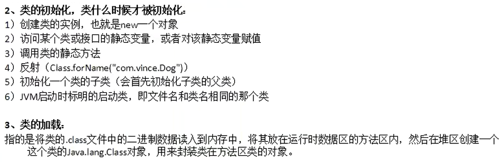

## 52.4 JavaBean


```java
import java.lang.reflect.InvocationTargetException;

import org.apache.commons.beanutils.BeanUtils;

public class BeanTest {
    public static void main(String[] args) {
        // 从客户端传输到服务端的数据全部都是字符串的形式
        // 从客户端（网页等）中获取的数据是这样
        String name = "拉拉";
        String age = "18";
        String salary = "20000";

        BeanDemo person = new BeanDemo();

        // 使用BeanUtils工具类可以更加方便地将数据进行类型转换和赋值，而无需我们一个一个去判断
        // 使用BeanUtils工具类处理对象赋值，对象复制等很方便
        try {
            BeanUtils.setProperty(person, "name", name);
            BeanUtils.setProperty(person, "age", age);
            BeanUtils.setProperty(person, "salary", salary);
        } catch (IllegalAccessException e) {
            e.printStackTrace();
        } catch (InvocationTargetException e) {
            e.printStackTrace();
        }

        System.out.println(person);
    }
}
```

```java
public class BeanDemo {
    private String name;
    private int age;
    private int salary;


    public String getName() {
        return this.name;
    }

    public void setName(String name) {
        this.name = name;
    }

    public int getAge() {
        return this.age;
    }

    public void setAge(int age) {
        this.age = age;
    }

    public int getSalary() {
        return this.salary;
    }

    public void setSalary(int salary) {
        this.salary = salary;
    }

    @Override
    public String toString() {
        return "{" +
            " name='" + getName() + "'" +
            ", age='" + getAge() + "'" +
            ", salary='" + getSalary() + "'" +
            "}";
    }
}
```

## 52.5 内省


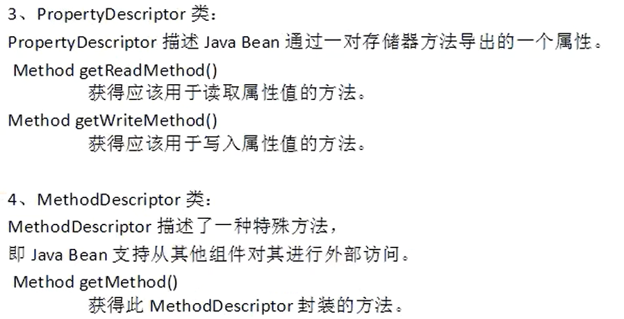

```java
public class Config {
    private String userName;
    private String password;
    private String url;

    public Config() {
    }

    public Config(String userName, String password, String url) {
        this.userName = userName;
        this.password = password;
        this.url = url;
    }

    public String getUserName() {
        return this.userName;
    }

    public void setUserName(String userName) {
        this.userName = userName;
    }

    public String getPassword() {
        return this.password;
    }

    public void setPassword(String password) {
        this.password = password;
    }

    public String getUrl() {
        return this.url;
    }

    public void setUrl(String url) {
        this.url = url;
    }

    @Override
    public String toString() {
        return "{" +
            " userName='" + getUserName() + "'" +
            ", password='" + getPassword() + "'" +
            ", url='" + getUrl() + "'" +
            "}";
    }
}
```

```properties
# config.properties

bean.name=fansheyuneixing.neixing.Config
bean.userName=admin
bean.password=123
bean.url=https://www.baidu.com
```

```java
import java.beans.BeanInfo;
import java.beans.IntrospectionException;
import java.beans.Introspector;
import java.beans.PropertyDescriptor;
import java.io.IOException;
import java.io.InputStream;
import java.lang.reflect.InvocationTargetException;
import java.lang.reflect.Method;
import java.util.Properties;

// 通过内省的API来装配一个Bean对象，Bean对象的值是通过配置文件来获取
// 目的是为了提高维护性
public class BeanFactory {
    private static Properties prop = new Properties();
    // 使用静态代码块读取配置文件
    static {
        InputStream is = Thread.currentThread().getContextClassLoader()
                .getResourceAsStream("fansheyuneixing/config.properties");

        try {
            prop.load(is);
        } catch (IOException e) {
            e.printStackTrace();
        }
    }

    public static Object getBean(String name) {
        Object bean = null;

        String beanName = prop.getProperty(name);
        try {
            // 获取类
            Class<?> forName = Class.forName(beanName);
            // 对类对象进行初始化
            bean = forName.getConstructor().newInstance();

            // 通过类信息获取JavaBean的描述
            BeanInfo beanInfo = Introspector.getBeanInfo(forName);
            // 通过JavaBean描述信息，获取该类的所有属性描述器
            PropertyDescriptor[] propertyDescriptors = beanInfo.getPropertyDescriptors();
            for (PropertyDescriptor p : propertyDescriptors) {
                String n = p.getName();

                Method writeMethod = p.getWriteMethod();

                if ("userName".equals(n) || "password".equals(n) || "url".equals(n)) {
                    writeMethod.invoke(bean, prop.getProperty("bean." + n));
                }
            }
        } catch (ClassNotFoundException | IntrospectionException | InstantiationException | IllegalAccessException
                | IllegalArgumentException | InvocationTargetException | NoSuchMethodException | SecurityException e) {
            e.printStackTrace();
        }

        return bean;
    }
}
```

```java
import org.junit.Test;

public class BeanTest {
    @Test
    public void getBeanTest() {
        Config bean = (Config)BeanFactory.getBean("bean.name");
        System.out.println(bean);
    }
}
```


## 52.6 AOP框架


```java
public interface IManager {
    public void add(String item);
}
```

```java
import java.util.ArrayList;

public class IManagerImpl implements IManager {
    private ArrayList<String> list = new ArrayList<>();

    @Override
    public void add(String item) {
        list.add(item);
        System.out.println(item);
    }
}
```

---

```java
public interface Advice {
    public void beforeAdvice();
    public void afterAdvice();
}
```

```java
public class LogAdvice implements Advice {

    @Override
    public void beforeAdvice() {
        System.out.println("start time: "+System.currentTimeMillis());
    }

    @Override
    public void afterAdvice() {
        System.out.println("end time: "+System.currentTimeMillis());
    }
}
```

---

```java
import java.lang.reflect.InvocationHandler;
import java.lang.reflect.Method;
import java.lang.reflect.Proxy;

public class ProxyBean implements InvocationHandler {
    private Object target;
    private Advice advice;

    public Object getProxy() {
        return Proxy.newProxyInstance(target.getClass().getClassLoader(), target.getClass().getInterfaces(), this);
    }

    @Override
    public Object invoke(Object proxy, Method method, Object[] args) throws Throwable {
        advice.beforeAdvice();
        Object obj = method.invoke(target, args);
        advice.afterAdvice();
        return obj;
    }

    public Object getTarget() {
        return this.target;
    }

    public void setTarget(Object target) {
        this.target = target;
    }

    public Advice getAdvice() {
        return this.advice;
    }

    public void setAdvice(Advice advice) {
        this.advice = advice;
    }
}
```

---

```java
import java.beans.BeanInfo;
import java.beans.IntrospectionException;
import java.beans.Introspector;
import java.beans.PropertyDescriptor;
import java.io.IOException;
import java.io.InputStream;
import java.lang.reflect.InvocationTargetException;
import java.lang.reflect.Method;
import java.util.Properties;

public class BeanFactory {
    private Properties prop = new Properties();

    public BeanFactory(InputStream in) {
        try {
            prop.load(in);
        } catch (IOException e) {
            e.printStackTrace();
        }
    }

    public Object getBean(String name) {
        Object bean = null;

        try {
            // 获取代理类对象
            Class<?> forName1 = Class.forName(prop.getProperty(name));
            bean = forName1.getConstructor().newInstance();

            // 获取目标类对象
            Class<?> forName2 = Class.forName(prop.getProperty(name + ".target"));
            Object iManager = forName2.getConstructor().newInstance();

            // 获取目标执行前后操作类对象
            Class<?> forName3 = Class.forName(prop.getProperty(name + ".advice"));
            Object advice = forName3.getConstructor().newInstance();

            // 获取代理类属性
            BeanInfo beanInfo = Introspector.getBeanInfo(forName1);
            PropertyDescriptor[] pds = beanInfo.getPropertyDescriptors();

            // 将目标类对象和目标执行前后操作类对象赋值给代理类对象的属性
            for(PropertyDescriptor p : pds) {
                String n = p.getName();

                Method writeMethod = p.getWriteMethod();
                if("target".equals(n)) {
                    writeMethod.invoke(bean, iManager);
                } else if ("advice".equals(n)) {
                    writeMethod.invoke(bean, advice);
                }
            }
        } catch (ClassNotFoundException | InstantiationException | IllegalAccessException | IllegalArgumentException
                | InvocationTargetException | NoSuchMethodException | SecurityException | IntrospectionException e) {
            e.printStackTrace();
        }
        return bean;
    }
}
```

---

```properties
bean.target=AOP.IManagerImpl
bean.advice=AOP.LogAdvice
bean=AOP.ProxyBean
```

```java
import java.io.InputStream;

import org.junit.Test;

public class AOPTest {
    @Test
    public void test() {
        // 读取配置文件
        InputStream resourceAsStream = Thread.currentThread().getContextClassLoader()
                .getResourceAsStream("AOP/bean.properties");

        // 创建Bean的工厂类对象
        BeanFactory bf = new BeanFactory(resourceAsStream);

        // 获取代理对象
        ProxyBean bean = (ProxyBean) bf.getBean("bean");
        IManager proxy = (IManager)bean.getProxy();
        proxy.add("我相信自己！");
    }
}
```


上述代码使用了如下方式：

1. 反射(ProxyBean)

2. 内省(BeanFactory)

3. 动态代理模式(ProxyBean)

4. 简单工厂模式(BeanFactory)

## 52.7 单例模式优化


```java
import java.io.Serializable;

// 使得单例对象可以被序列化
public class Singleton implements Serializable {
    // 加上volatile关键字，保证变量取值的一致性
    private volatile static Singleton s;

    private Singleton() {
        // 防止反射调用私有构造方法
        if(s != null) {
            throw new RuntimeException("单例模式类已被实例化！");
        }
    }

    public static Singleton getInstance() {
        // 单线程访问时同步锁影响性能
        // 所以在外面再判断一次，只影响创建时的那一次性能
        if (s == null) {
            // 多线程访问时不安全，所以加上同步锁
            synchronized (Singleton.class) {
                if (s == null) {
                    s = new Singleton();
                }
            }
        }
        return s;
    }
}
```

以后写单例模式尽量这样写，面试时也一样。 

# 五十三、泛型


泛型的嵌套使用：


代码示例如下：

```java
// 把泛型当作对象/数据类型来使用就行，如：int,Integer,String等
public class GenericDemo<T> {
    private T data;

    public GenericDemo() {
    }

    public GenericDemo(T data) {
        this.data = data;
    }

    public T getData() {
        return this.data;
    }

    public void setData(T data) {
        this.data = data;
    }

    public static void main(String[] args) {
        GenericDemo<String> genericDemo1 = new GenericDemo<>("我相信自己，能成功！");
        System.out.println(genericDemo1.getData());

        GenericDemo<Integer> genericDemo2 = new GenericDemo<>(10);
        setTest(genericDemo2);

    }

    public static void setTest(GenericDemo<? extends Number> g) {
        System.out.println(g.getData());
    }
}
```

# 五十四、正则表达式


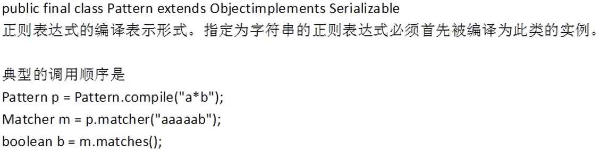


```java
import java.util.regex.Matcher;
import java.util.regex.Pattern;

import org.junit.Test;

public class RegexDemo {
    // 判断字符串是否全部由数字组成
    @Test
    public void test() {
        String s = "5201314";

        // 方法1：将字符串转换为字符数组后一个一个字符判断

        char[] chars = s.toCharArray();
        int size = chars.length;
        // true表示字符串是数字组成
        boolean flag = true;
        for (int i = 0; i < size; i++) {
            if(chars[i] < '0' || chars[i]>'9') {
                flag = false;
                break;
            }
        }
        System.out.println("字符串是否为数字组成："+flag);

        // 方法2：使用正则表达式

        // 方式1
        Pattern p = Pattern.compile("\\d+");
        Matcher m = p.matcher(s);
        boolean matches1 = m.matches();
        System.out.println("字符串是否为数字组成："+matches1);
        // 方式2
        boolean matches2 = s.matches("[0-9]+");
        System.out.println("字符串是否为数字组成："+matches2);
    }
}
```


# 五十五、枚举


```java
public class EnumDemo {
    // 这样定义的话color0可以随便赋值
    public static final int RED = 1;
    public static final int GREEN = 2;
    public static final int BLUE = 3;
    public static int color0;
}
```

---

```java
// 定义一个枚举类型
enum Color1 {
    // 这三个是枚举(Color)的实例化对象
    // 枚举对象只能在枚举内部被定义
    RED, GREEN, BLUE;
}
```

```java
// color1只能取枚举中的值
public static Color1 color1;

@Test
public void test1() {
    color1 = Color1.RED;

    System.out.println(color1);
    System.out.println(color1.name());
    System.out.println(color1.ordinal());

    System.out.println(Arrays.toString(Color1.values()));
}
```

```java
@Test
public void test2() {
    // 创建EnumSet对象

    // 方法1
    EnumSet<Color1> es1 = EnumSet.allOf(Color1.class);

    es1.forEach((v)->System.out.println(v));

    System.out.println("----------------");

    // 方法2
    Collection<Color1> c1 = new HashSet<>();
    // Collection<Color> c1 = new ArrayList<>();

    c1.add(Color1.RED);
    c1.add(Color1.BLUE);
    c1.add(Color1.GREEN);
    c1.add(Color1.RED);

    EnumSet<Color1> es2 = EnumSet.copyOf(c1);

    es2.forEach(System.out::println);

    System.out.println("----------------");
}
```

```java
@Test
public void test3() {
    // 创建EnumMap对象

    // 方法1
    EnumMap<Color1, String> map1 = new EnumMap<>(Color1.class);

    map1.put(Color1.RED, "红色");
    map1.put(Color1.BLUE, "蓝色");
    map1.put(Color1.GREEN, "绿色");

    map1.forEach((k, v)-> System.out.println(k+", "+v));

    System.out.println("----------------");

    Map<Color1, String> m = new HashMap<>();

    m.put(Color1.RED, "红色");
    m.put(Color1.BLUE, "蓝色");
    m.put(Color1.GREEN, "绿色");

    EnumMap<Color1, String> map2 = new EnumMap<>(m);

    map2.forEach((k, v)-> System.out.println(k+", "+v));

    System.out.println("----------------");
}
```

---

```java
// 带构造方法的枚举
enum Color2 {
    // 枚举对象只能在类内部进行创建，
    // 所以枚举构造方法只能由其内部对象调用，
    // 因此构造方法只能定义为私有，定义公有报错。
    RED(10), GREEN, BLUE(30);

    private int color;

    private Color2() {
        System.out.println("使用了无参构造器");
    }
    private Color2(int color) {
        this.color = color;
        System.out.println("使用了有参构造器");
    }

    public int getColor() {
        return color;
    }
}
```

```java
@Test
public void test4() {
    EnumSet<Color2> es1 = EnumSet.allOf(Color2.class);
    es1.forEach((v)->System.out.println(v+", "+v.getColor()));
}
```

---

```java
interface Info {
    public String getColor();
}

// 枚举实现接口
// 枚举内部方法的另一种写法，匿名子类
// 实现接口也可以按照Color2枚举样式写
enum Color3 implements Info {
    RED {
        @Override
        public String getColor() {
            return "红色";
        }
    },
    GREEN {
        @Override
        public String getColor() {
            return "绿色";
        }
    },
    BLUE {
        @Override
        public String getColor() {
            return "蓝色";
        }
    };
}
```

```java
@Test
public void test5() {
    EnumSet<Color3> es1 = EnumSet.allOf(Color3.class);
    es1.forEach((v)->System.out.println(v+", "+v.getColor()));
}
```

---

```java
// 在枚举中使用抽象方法
enum Color4 {
    // 这里面每个对象的匿名子类都是继承了Color4类
    RED {
        @Override
        public String getColor() {
            return "红色";
        }
    },
    GREEN {
        @Override
        public String getColor() {
            return "绿色";
        }
    },
    BLUE {
        @Override
        public String getColor() {
            return "蓝色";
        }
    };

    public abstract String getColor();
}
```

---

```java
// 枚举实现单例模式
enum Singleton {
    SINGLETON;

    public Singleton getInstance() {
        return SINGLETON;
    }
}
```

```java
@Test
public void test6() {
    System.out.println(Singleton.SINGLETON.getInstance());
}
```

---


由于枚举是一个特殊的类，它比常量要占用更多的内存空间。如果是在安卓等内存较敏感的设备上，建议使用常量。

# 五十六、”new 对象“ 后加大括号{}


# 五十七、注解

JDK1.5开始，Java增加了对元数据(即类的组成单元数据)的支持，也就是(Annotation)注解，他是代码里做的特殊标记，这些标记可以在编译，类加载，运行时在不改变原有逻辑的情况下，被读取，并执行相应的处理，通过使用Annotation，程序员可以在源文件中嵌入一些补充的信息。代码分析工具,开发工具和部署工具可以通过这些补充信息进行验证或者进行部署。Annotation类似于修饰符一样被使用，可以用于包，类，构造方法，方法,成员变量，参数，局部变量的声明。

元数据：

1. 解释数据的数据。eg：类中有一个  name  属性，其值为  "lala"  ，那么  "lala"  就是数据，name  就是解释  "lala"  这个数据的数据。这时  name  被称为元数据。

2. 数据库中的元数据也是这个意思，如  姓名，年龄，地址  等，具体的值被称为数据，而  姓名，年龄，地址  则被称为元数据。


## 57.1 自定义Annotation

注解应用需要三个步骤：

1. 编写注解

2. 在类上应用注解

3. 对应用了注解的类进行反射操作的类

自定义Annotation的语法如下：

"访问控制权限 @interface Annotation名称 {}"。eg：public @interface MyAnnotation {}。

```java
public enum Colors {
    RED, GREEN, BLUE;
}
```

```java
import java.lang.annotation.Retention;
import java.lang.annotation.RetentionPolicy;

// 表示该注解的作用范围为java运行时
@Retention(RetentionPolicy.RUNTIME)
// 自定义注解
public @interface MyAnnotation {
    // 定义变量，在调用此Annotation时必须设置变量值
    // @MyAnnotation(name = "lala", age = 2, friends = { "haha" }, color = Colors.RED)

    // public String name();
    // public int age();
    // public String[] friends();
    // public Color color();

    // 通过default指定变量默认值后，在使用时可以不设值
    // @MyAnnotation

    public String name() default "lala";
    public int age() default 2;
    public String[] friends() default {"mengmeng", "nana", "miaomiao"};
    public Colors color() default Colors.RED;
}
```

```java
import java.util.Arrays;

@SuppressWarnings("all")
@MyAnnotation
public class AnnotationDemo {
    private String name;
    private int age;
    private String[] friends;
    private Colors color;

    public AnnotationDemo() {
    }

    public AnnotationDemo(String name, int age, String[] friends, Colors color) {
        this.name = name;
        this.age = age;
        this.friends = friends;
        this.color = color;
    }

    public String getName() {
        return this.name;
    }

    public void setName(String name) {
        this.name = name;
    }

    public int getAge() {
        return this.age;
    }

    public void setAge(int age) {
        this.age = age;
    }

    public String[] getFriends() {
        return this.friends;
    }

    public void setFriends(String[] friends) {
        this.friends = friends;
    }

    public Colors getColor() {
        return this.color;
    }

    public void setColor(Colors color) {
        this.color = color;
    }

    @Override
    public String toString() {
        return "{" +
            " name='" + getName() + "'" +
            ", age='" + getAge() + "'" +
            ", friends='" + Arrays.toString(getFriends()) + "'" +
            ", color='" + getColor() + "'" +
            "}";
    }
}
```

```java
import java.lang.reflect.Constructor;
import java.lang.reflect.InvocationTargetException;

public class AnnotationTest {
    // 通过反射来处理注解
    public static void main(String[] args) {
        Class<AnnotationDemo> annClass = AnnotationDemo.class;
        // 获取AnnotationDemo类上应用的指定注解
        MyAnnotation annotation = annClass.getAnnotation(MyAnnotation.class);

        // 获取注解上的变量值
        String name = annotation.name();
        int age = annotation.age();
        String[] friends = annotation.friends();
        // 此处的Colors是自己定义的类，虽然是在同包下赋值，但是却是在其他包中定义，所以该类必须是public
        Colors color = annotation.color();

        Constructor<AnnotationDemo> constructor;
        try {
            constructor = annClass.getConstructor(String.class, int.class, String[].class, Colors.class);
            AnnotationDemo ann1 = constructor.newInstance(name, age, friends, color);

            System.out.println(ann1);
        } catch (NoSuchMethodException | SecurityException | InstantiationException | IllegalAccessException | IllegalArgumentException | InvocationTargetException e) {
            e.printStackTrace();
        }
    }
}
```

## 57.2 Retention和RetentionPolicy


上述3个注解生命周期长度为  SOURCE < CLASS < RUNTIME  。

1. 源程序文件

2. class文件

3. jvm加载class文件之后

作用域范围：

+ SOURCE：1

+ CLASS：1、2

+ RUNTIME：1、2、3

## 57.3 反射与Annotation


```java
public class AnnotationTest {
    // 通过反射来处理注解
    public static void main(String[] args) {
        Class<AnnotationDemo> annClass = AnnotationDemo.class;
        // 获取AnnotationDemo类上应用的指定注解
        MyAnnotation annotation = annClass.getAnnotation(MyAnnotation.class);

        // 获取注解上的变量值
        String name = annotation.name();
        int age = annotation.age();
        String[] friends = annotation.friends();
        // 此处的Colors是自己定义的类，虽然是在同包下赋值，但是却是在其他包中定义，所以该类必须是public
        Colors color = annotation.color();

        Constructor<AnnotationDemo> constructor;
        try {
            constructor = annClass.getConstructor(String.class, int.class, String[].class, Colors.class);
            AnnotationDemo ann1 = constructor.newInstance(name, age, friends, color);

            System.out.println(ann1);
        } catch (NoSuchMethodException | SecurityException | InstantiationException | IllegalAccessException | IllegalArgumentException | InvocationTargetException e) {
            e.printStackTrace();
        }
    }
}
```


## 57.4 @Documented注解

@Documented 是一个标记注解，没有成员变量。用 @Documented 注解修饰的注解类会被 JavaDoc 工具提取成文档。默认情况下，JavaDoc 是不包括注解的，但如果声明注解时指定了 @Documented，就会被 JavaDoc 之类的工具处理，所以注解类型信息就会被包括在生成的帮助文档中。

更改上述代码：

```java
@Documented
@Retention(RetentionPolicy.RUNTIME)
public @interface MyAnnotation {

    public String name() default "lala";
    public int age() default 2;
    public String[] friends() default {"mengmeng", "nana", "miaomiao"};
    public Colors color() default Colors.RED;
}

@SuppressWarnings("all")
@MyAnnotation(name = "lala", age = 2, friends = { "haha" }, color = Colors.RED)
public class AnnotationDemo {
    private String name;
    private int age;
    private String[] friends;
    private Colors color;
    // ......
}
```

使用命令：

```
javadoc -d doc AnnotationDemo.java AnnotationTest.java Colors.java MyAnnotation.java
```

输出结果对比：

+ 不加@Documented
  
  

+ 加@Documented
  
  

## 57.5 @Target注解


不写代表任何地方均可用。

```java
@Documented
@Target(value = { ElementType.PACKAGE, ElementType.TYPE })
@Retention(RetentionPolicy.RUNTIME)
public @interface MyAnnotation {

    public String name() default "lala";
    public int age() default 2;
    public String[] friends() default { "mengmeng", "nana", "miaomiao" };
    public Colors color() default Colors.RED;
}
```

## 57.6 @Inherited注解

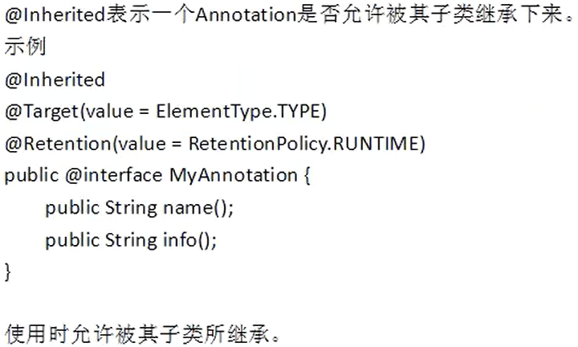

```java
@Documented
@Target(value = { ElementType.PACKAGE, ElementType.TYPE })
@Retention(RetentionPolicy.RUNTIME)
@Inherited
public @interface MyAnnotation {

    public String name() default "lala";
    public int age() default 2;
    public String[] friends() default { "mengmeng", "nana", "miaomiao" };
    public Colors color() default Colors.RED;
}
```

# 五十八、XML与JSON

XML是  数据传输、数据存储、配置文件  的一种格式。


## 58.1 SAX解析XML


SAX解析特点：

1. 基于事件驱动

2. 顺序读取，速度快

3. 不能任意读取元素（灵活性差）

4. 更适合在性能要求较高的设备上使用（Android等）

代码分析：

+ person.xml

```xml
<?xml version="1.0" encoding="UTF-8"?>
<people>
    <person personId="E01">
        <name>Tony Blair</name>
        <address>10 Downing Street, London, UK</address>
        <tel>(061) 98765</tel>
        <age>26</age>
        <email>blair@everywhere.com</email>
    </person>
    <person personId="E02">
        <name>Bill Clinton</name>
        <address>White House, USA</address>
        <tel>(001) 6400 98765</tel>
        <age>39</age>
        <email>bill@everywhere.com</email>
    </person>
</people>
```

+ Person.java

```java
public class Person {
    private String personId;
    private String name;
    private String address;
    private String tel;
    private int age;
    private String email;

    public Person() {
    }

    public Person(String personId, String name, String address, String tel, int age, String email) {
        this.personId = personId;
        this.name = name;
        this.address = address;
        this.tel = tel;
        this.age = age;
        this.email = email;
    }

    public String getPersonId() {
        return this.personId;
    }

    public void setPersonId(String personId) {
        this.personId = personId;
    }

    public String getName() {
        return this.name;
    }

    public void setName(String name) {
        this.name = name;
    }

    public String getAddress() {
        return this.address;
    }

    public void setAddress(String address) {
        this.address = address;
    }

    public String getTel() {
        return this.tel;
    }

    public void setTel(String tel) {
        this.tel = tel;
    }

    public int getAge() {
        return this.age;
    }

    public void setAge(int age) {
        this.age = age;
    }

    public String getEmail() {
        return this.email;
    }

    public void setEmail(String email) {
        this.email = email;
    }

    @Override
    public String toString() {
        return "{" +
            " personId='" + getPersonId() + "'" +
            ", name='" + getName() + "'" +
            ", address='" + getAddress() + "'" +
            ", tel='" + getTel() + "'" +
            ", age='" + getAge() + "'" +
            ", email='" + getEmail() + "'" +
            "}";
    }
}
```

+ XMLDemo.java

```java
// import java.io.File;
import java.io.IOException;
import java.io.InputStream;
import java.util.List;

import javax.xml.parsers.ParserConfigurationException;
import javax.xml.parsers.SAXParser;
import javax.xml.parsers.SAXParserFactory;

import org.junit.Test;
import org.xml.sax.SAXException;

public class XMLDemo {
    @Test
    public void saxParseXML() {
        // 创建一个SAX解析器工厂对象
        SAXParserFactory spf = SAXParserFactory.newInstance();

        try {
            // 通过工厂对象创建SAX解析器
            SAXParser sp = spf.newSAXParser();

            // 创建一个数据处理器（自己编写）
            PersonHandler personHandler = new PersonHandler();

            // 开始解析
            // sp.parse(new File("XMLyuJSON/SAX/person.xml"), personHandler);
            // 使用上述方法时不能用Test测试类运行，因为其无法正确找到相对路径位置
            // sp.parse(new File("D:/Desktop/Jworkspace/XMLyuJSON/SAX/person.xml"), personHandler);
            InputStream is = Thread.currentThread().getContextClassLoader().getResourceAsStream("XMLyuJSON/SAX/person.xml");
            sp.parse(is, personHandler);

            List<Person> persons = personHandler.getPersons();
            persons.forEach(System.out::println);
        } catch (ParserConfigurationException e) {
            e.printStackTrace();
        } catch (SAXException e) {
            e.printStackTrace();
        } catch (IOException e) {
            e.printStackTrace();
        }
    }
}
```

+ PersonHandler.java

```java
import java.lang.reflect.InvocationTargetException;
import java.util.ArrayList;
import java.util.List;

import org.apache.commons.beanutils.BeanUtils;
import org.xml.sax.Attributes;
import org.xml.sax.SAXException;
import org.xml.sax.helpers.DefaultHandler;

public class PersonHandler extends DefaultHandler {
    // 用来存储xml文件中存储的对象
    private List<Person> persons;
    // 定义当前正在解析的临时对象
    private Person p;
    // 定义一个临时的标签名,用于记录当前正在解析的标签名(元素名)
    private String tag;

    // 开始解析文档时调用
    @Override
    public void startDocument() throws SAXException {
        super.startDocument();

        persons = new ArrayList<>();

        System.out.println("开始解析文档");
    }

    // 解析文档完成后调用
    @Override
    public void endDocument() throws SAXException {
        super.endDocument();

        System.out.println("文档解析结束");
    }

    // 开始解析元素时调用
    /*
     * uri：命名空间(与C++中的命名空间类似，类似于Java中的包)
     * 
     * localName：不带前缀的标签(eg：<person>...</person>)
     * qName：带前缀的标签(eg：<aa:person>...</person>，aa是前缀)
     * 当标签没有前缀时，localName = qName
     * 当标签中有前缀时，localName = person，qName = aa:person
     * 
     * attributes：当前标签的属性集合
     */
    @Override
    public void startElement(String uri, String localName, String qName, Attributes attributes) throws SAXException {
        super.startElement(uri, localName, qName, attributes);

        if ("person".equals(qName)) {
            p = new Person();

            // 根据属性名从标签属性集合中获取属性值
            String value = attributes.getValue("personId");

            // p.setPersonId(value);
            try {
                BeanUtils.setProperty(p, "personId", value);
            } catch (IllegalAccessException e) {
                e.printStackTrace();
            } catch (InvocationTargetException e) {
                e.printStackTrace();
            }
        }

        tag = qName;

        System.out.println("startElement----"+qName);
    }

    // 解析元素结束时调用
    @Override
    public void endElement(String uri, String localName, String qName) throws SAXException {
        super.endElement(uri, localName, qName);

        if("name".equals(tag)) {
            persons.add(p);
        }

        tag = null;

        System.out.println("endElement----"+qName);
    }

    // 解析元素内容时调用
    @Override
    public void characters(char[] ch, int start, int length) throws SAXException {
        super.characters(ch, start, length);

        if(tag != null) {
            if("name".equals(tag)) {
                // p.setName(new String(ch, start, length));
                try {
                    BeanUtils.setProperty(p, "name", new String(ch, start, length));
                } catch (IllegalAccessException e) {
                    e.printStackTrace();
                } catch (InvocationTargetException e) {
                    e.printStackTrace();
                }
            } else if("address".equals(tag)) {
                // p.setAddress(new String(ch, start, length));
                try {
                    BeanUtils.setProperty(p, "address", new String(ch, start, length));
                } catch (IllegalAccessException e) {
                    e.printStackTrace();
                } catch (InvocationTargetException e) {
                    e.printStackTrace();
                }
            } else if("tel".equals(tag)) {
                // p.setTel(new String(ch, start, length));
                try {
                    BeanUtils.setProperty(p, "tel", new String(ch, start, length));
                } catch (IllegalAccessException e) {
                    e.printStackTrace();
                } catch (InvocationTargetException e) {
                    e.printStackTrace();
                }
            } else if("age".equals(tag)) {
                // p.setAge(Integer.parseInt(new String(ch, start, length)));
                try {
                    BeanUtils.setProperty(p, "age", new String(ch, start, length));
                } catch (IllegalAccessException e) {
                    e.printStackTrace();
                } catch (InvocationTargetException e) {
                    e.printStackTrace();
                }
            } else if("email".equals(tag)) {
                // p.setEmail(new String(ch, start, length));
                try {
                    BeanUtils.setProperty(p, "email", new String(ch, start, length));
                } catch (IllegalAccessException e) {
                    e.printStackTrace();
                } catch (InvocationTargetException e) {
                    e.printStackTrace();
                }
            }
        }

        System.out.println("characters----start:"+start+", length:"+length);
        System.out.println(ch);
    }

    public List<Person> getPersons() {
        return persons;
    }
}
```

输出结果：


......


1. characters()  方法有  char[] ch, int start, int length  三个参数，之所以  length  的值会等于5，是因为xml文件中  <people>  标签后面一个换行算一个字符，  <person>  标签前面4个空格算四个字符，加起来总共5个字符。其他依次类推。

2. 除了读取到标签以外，读取到其他任何内容都会调用  characters()  方法。

3. 在传输xml文件时，我们应将所有空格去除，这样就可以减少  characters()  方法多余的调用，即减少该方法调用次数，也可以减少  characters()  方法中字符数组的长度。
   
   ```xml
   <?xml version="1.0" encoding="UTF-8"?><people><person personId="E01"><name>Tony Blair</name><address>10 Street, London, UK</address><tel>(061) 98765</tel><age>26</age><email>blair@everywhere.com</email></person><person personId="E02"><name>Bill Clinton</name><address>White House, USA</address><tel>(001) 6400 98765</tel><age>39</age><email>bill@everywhere.com</email></person></people>
   ```

4. characters()  方法第一次执行就输出这么多内容，原因如下：


将xml文件中空格全部去除后，输出结果：


......

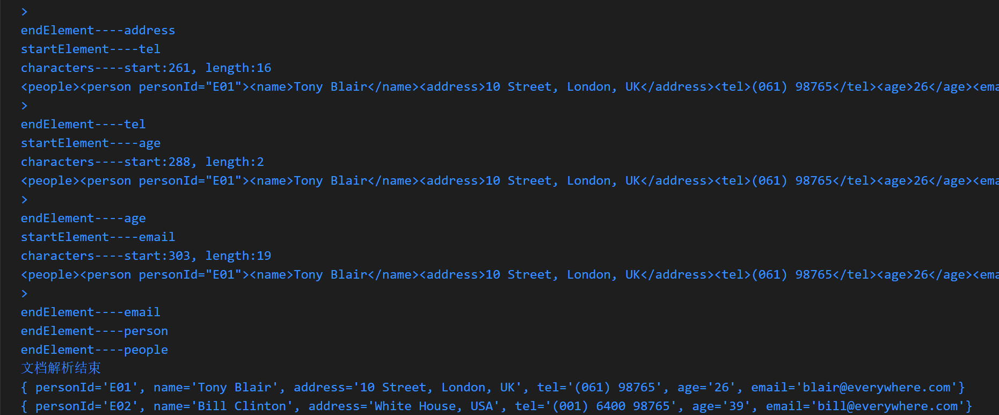


## 58.2 DOM解析XML


代码分析：

+ person.xml  :  与SAX解析XML中的person.xml一致。

+ Person.java  :  与SAX解析XML中的Person.java一致。

+ XMLDemo.java

```java
import java.io.IOException;
import java.io.InputStream;
import java.lang.reflect.InvocationTargetException;
import java.util.ArrayList;
import java.util.List;

import javax.xml.parsers.DocumentBuilder;
import javax.xml.parsers.DocumentBuilderFactory;
import javax.xml.parsers.ParserConfigurationException;

import org.apache.commons.beanutils.BeanUtils;
import org.junit.Test;
import org.w3c.dom.Document;
import org.w3c.dom.Node;
import org.w3c.dom.NodeList;
import org.xml.sax.SAXException;

public class XMLDemo {
    @Test
    public void domParseXML() {
        // 创建一个DOM解析器工厂对象
        DocumentBuilderFactory dbf = DocumentBuilderFactory.newInstance();

        try {
            // 通过工厂对象创建解析器对象
            DocumentBuilder db = dbf.newDocumentBuilder();

            InputStream is = Thread.currentThread().getContextClassLoader().getResourceAsStream("XMLyuJSON/DOM/person.xml");
            // 解析文档，此时整个XML文件已被加载到内存中，以树状形式存储
            Document parse = db.parse(is);

            // 从内存中读取数据，此处获取节点名称为person的所有节点，返回节点集合
            NodeList personNode = parse.getElementsByTagName("person");

            // 操作数据

            List<Person> persons = new ArrayList<>();

            Person p = null;

            int size = personNode.getLength();
            for (int i = 0; i < size; i++) {
                p = new Person();

                Node n1 = personNode.item(i);

                // 获取节点的属性值
                String personId = n1.getAttributes().getNamedItem("personId").getNodeValue();
                BeanUtils.setProperty(p, "personId", personId);

                System.out.println("n1:");
                System.out.println("nodeName: " + n1.getNodeName() + ", nodeValue: " + n1.getNodeValue());

                // 获取当前节点的所有子节点
                NodeList cn = n1.getChildNodes();

                int sizeC = cn.getLength();
                for (int j = 0; j < sizeC; j++) {
                    Node n2 = cn.item(j);

                    String nodeName = n2.getNodeName();

                    System.out.println("n2:");
                    System.out.println("nodeName: " + nodeName + ", nodeValue: " + n2.getNodeValue());

                    // 在DOM解析中，每个标签和标签外的内容都会被存储到一个节点中作为树的的一个节点
                    if ("name".equals(nodeName)) {
                        Node firstChild = n2.getFirstChild();

                        System.out.println("n3:");
                        System.out.println("nodeName: " + firstChild.getNodeName() + ", nodeValue: " + firstChild.getNodeValue());

                        BeanUtils.setProperty(p, "name", firstChild.getNodeValue());
                    } else if ("address".equals(nodeName)) {
                        Node firstChild = n2.getFirstChild();

                        System.out.println("n3:");
                        System.out.println("nodeName: " + firstChild.getNodeName() + ", nodeValue: " + firstChild.getNodeValue());

                        BeanUtils.setProperty(p, "address", firstChild.getNodeValue());
                    } else if ("tel".equals(nodeName)) {
                        Node firstChild = n2.getFirstChild();

                        System.out.println("n3:");
                        System.out.println("nodeName: " + firstChild.getNodeName() + ", nodeValue: " + firstChild.getNodeValue());

                        BeanUtils.setProperty(p, "tel", firstChild.getNodeValue());
                    } else if ("age".equals(nodeName)) {
                        Node firstChild = n2.getFirstChild();

                        System.out.println("n3:");
                        System.out.println("nodeName: " + firstChild.getNodeName() + ", nodeValue: " + firstChild.getNodeValue());

                        BeanUtils.setProperty(p, "age", firstChild.getNodeValue());
                    } else if ("email".equals(nodeName)) {
                        Node firstChild = n2.getFirstChild();

                        System.out.println("n3:");
                        System.out.println("nodeName: " + firstChild.getNodeName() + ", nodeValue: " + firstChild.getNodeValue());

                        BeanUtils.setProperty(p, "email", firstChild.getNodeValue());
                    }
                }

                persons.add(p);
            }

            persons.forEach(System.out::println);
        } catch (ParserConfigurationException | SAXException | IOException | IllegalAccessException | InvocationTargetException e) {
            e.printStackTrace();
        }
    }
}
```

输出结果：


将xml文件中空格全部去除后（如上节SAX解析XML中的一样），输出结果：


此时会发现，DOM解析所生成的Document树会少去许多无用的节点。原因是DOM在解析XML时会将标签和标签之外的内容均存储到节点中作为树的一个节点，上述输出结果中许多的无用节点其实是标签与标签之间的换行和空格所得到的。

## 58.3 DOM解析  VS  SAX解析

DOM解析：一次性把xml文档内容加载进内存，构建成Document树。

1. 不适合读取大容量的xml文件

2. Dom解析可以随意读取，甚至往回读

3. Dom解析可以增删改查

4. 解析工具： DOM4j

SAX解析： 读取一点，解析一点。

1. 适合读取大容量的xml文件

2. 从上往下逐点读取，不能往回读

3. SAX解析通常只读取文件，不修改文件

## 58.4 JDOM解析XML

JDOM简化了与XML的交互并且比使用DOM实现更快，JDOM与DOM主要有两方面不同，首先，JDOM仅使用具体类而不使用接口，这在某些方面简化了APl，但是也限制了灵活性。第二，API大量使用了Collections类，简化了那些已经熟悉这些类的lava开发者的使用。

JDOM具有树的便利，也有SAX的JAVA规则。在需要平衡时使用。

代码分析：

- person.xml : 与SAX解析XML中的person.xml一致。

- Person.java : 与SAX解析XML中的person.java一致。

- XMLDemo.java

```java
import java.io.IOException;
import java.io.InputStream;
import java.lang.reflect.InvocationTargetException;
import java.util.ArrayList;
import java.util.List;

import org.apache.commons.beanutils.BeanUtils;
import org.jdom2.Document;
import org.jdom2.Element;
import org.jdom2.JDOMException;
import org.jdom2.input.SAXBuilder;
import org.junit.Test;

public class XMLDemo {
    @Test
    public void jdomParseXML() {
        // 创建JDOM解析器
        SAXBuilder builder = new SAXBuilder();

        InputStream is = Thread.currentThread().getContextClassLoader().getResourceAsStream("XMLyuJSON/JDOM/person.xml");
        try {
            // 解析文档
            Document build = builder.build(is);

            // 获取树的根节点（people）
            Element rootElement = build.getRootElement();

            List<Person> list = new ArrayList<>();

            Person p;

            // 获取根节点的子节点（两个person）
            List<Element> children1 = rootElement.getChildren();

            for (Element e1 : children1) {
                p = new Person();

                // 获取person标签的属性值
                String attributeValue = e1.getAttributeValue("personId");

                BeanUtils.setProperty(p, "personId", attributeValue);

                System.out.println("e1:");
                System.out.println("getName: " + e1.getName());
                System.out.println("getText: " + e1.getText());
                System.out.println("getValue: " + e1.getValue());
                System.out.println("getNamespace: "+e1.getNamespace());

                // 获取person的子节点
                List<Element> children2 = e1.getChildren();

                for (Element e2 : children2) {
                    // 获取节点名
                    String tag = e2.getName();

                    System.out.println("e2:");
                    System.out.println("getName: " + e2.getName());
                    System.out.println("getText: " + e2.getText());
                    System.out.println("getValue: " + e2.getValue());
                    System.out.println("getNamespace: "+e2.getNamespace());

                    if ("name".equals(tag)) {
                        BeanUtils.setProperty(p, "name", e2.getText());
                    } else if ("address".equals(tag)) {
                        BeanUtils.setProperty(p, "address", e2.getText());
                    } else if ("tel".equals(tag)) {
                        BeanUtils.setProperty(p, "tel", e2.getText());
                    } else if ("age".equals(tag)) {
                        BeanUtils.setProperty(p, "age", e2.getText());
                    } else if ("email".equals(tag)) {
                        BeanUtils.setProperty(p, "email", e2.getText());
                    }
                }

                list.add(p);
            }

            list.forEach(System.out::println);
        } catch (JDOMException e) {
            e.printStackTrace();
        } catch (IOException e) {
            e.printStackTrace();
        } catch (IllegalAccessException e1) {
            e1.printStackTrace();
        } catch (InvocationTargetException e1) {
            e1.printStackTrace();
        }
    }
}
```

输出结果：


将xml文件中空格全部去除后（如上节DOM解析XML中的一样），输出结果：


## 58.5 DOM4J解析XML

dom4j是一个非常非常优秀的Java XML APl，具有性能优异、功能强大和极端易用使用的特点，同时它也是一个开放源代码的软件，可以在SourceForge上找到它。在对主流的Java XML API进行的性能、功能和易用性的评测，dom4j无论在那个方面都是非常出色的。如今你可以看到越来越多的Java软件都在使用dom4j来读写XML，特别值得一提的是连Sun的JAXM也在用dom4j。这是必须使用的jar包，Hibernate用它来读写配置文件。

代码分析：

- person.xml : 与SAX解析XML中的person.xml一致。

- Person.java : 与SAX解析XML中的person.java一致。

- XMLDemo.java

```java
import java.io.InputStream;
import java.lang.reflect.InvocationTargetException;
import java.util.ArrayList;
import java.util.Iterator;
import java.util.List;

import org.apache.commons.beanutils.BeanUtils;
import org.dom4j.Document;
import org.dom4j.DocumentException;
import org.dom4j.Element;
import org.dom4j.io.SAXReader;
import org.junit.Test;

public class XMLDemo {
    @Test
    public void dom4jParseXML() {
        // 创建DOM4J的解析器对象
        SAXReader reader = new SAXReader();

        InputStream is = Thread.currentThread().getContextClassLoader().getResourceAsStream("XMLyuJSON/DOM4J/person.xml");
        try {
            // 解析文档
            Document read = reader.read(is);

            // 获取树的根节点（people）
            Element rootElement = read.getRootElement();

            // 通过根节点获取其迭代器（迭代其子节点）
            Iterator<Element> elementIterator1 = rootElement.elementIterator();

            List<Person> list = new ArrayList<>();

            Person p = null;

            while (elementIterator1.hasNext()) {
                p = new Person();

                Element e1 = elementIterator1.next();
                BeanUtils.setProperty(p, "personId", e1.attributeValue("personId"));

                System.out.println("e1:");
                System.out.println("getName: " + e1.getName());
                System.out.println("getText: " + e1.getText());
                System.out.println("getPath: " + e1.getPath());
                System.out.println("getNamespace: " + e1.getNamespace());

                Iterator<Element> elementIterator2 = e1.elementIterator();
                while (elementIterator2.hasNext()) {
                    Element e2 = elementIterator2.next();

                    String tag = e2.getName();

                    System.out.println("e2:");
                    System.out.println("getName: " + e2.getName());
                    System.out.println("getText: " + e2.getText());
                    System.out.println("getPath: " + e2.getPath());
                    System.out.println("getNamespace: " + e2.getNamespace());

                    if ("name".equals(tag)) {
                        BeanUtils.setProperty(p, "name", e2.getText());
                    } else if ("address".equals(tag)) {
                        BeanUtils.setProperty(p, "address", e2.getText());
                    } else if ("tel".equals(tag)) {
                        BeanUtils.setProperty(p, "tel", e2.getText());
                    } else if ("age".equals(tag)) {
                        BeanUtils.setProperty(p, "age", e2.getText());
                    } else if ("email".equals(tag)) {
                        BeanUtils.setProperty(p, "email", e2.getText());
                    }
                }

                list.add(p);
            }

            list.forEach(System.out::println);
        } catch (DocumentException | IllegalAccessException | InvocationTargetException e) {
            e.printStackTrace();
        }
    }
}
```

输出结果：


将xml文件中空格全部去除后（如上节DOM解析XML中的一样），输出结果：


## 58.6 SAX  VS  DOM  VS  JDOM  VS  DOM4J

DOM：

+ 优点：
  
  1. 整个 Dom 树都加载到内存中了，所以允许随机读取访问数据。
  
  2. 允许随机的对文档结构进行增删。

+ 缺点：
  
  1. 整个 XML 文档必须一次性解析完，耗时。
  
  2. 整个 Dom 树都要加载到内存中，占内存。

+ 适用范围：
  
  文档较小，且需要修改文档内容。

---

SAX：

+ 优点：
  
  1. 访问能够立即进行，不需要等待所有数据被加载。
  
  2. 只在读取数据时检查数据，不需要保存在内存中。
  
  3. 不需要将整个数据都加载到内存中，占用内存少。
  
  4. 允许注册多个Handler,可以用来解析文档内容，DTD约束等等。

+ 缺点：
  
  1. 需要应用程序自己负责TAG的处理逻辑（例如维护父/子关系等），文档越复杂程序就越复杂。
  
  2. 单向导航，无法定位文档层次，很难同时访问同一文档的不同部分数据，不支持XPath。
  
  3. 不能随机访问 xml 文档，不支持原地修改xml。

+ 适用范围：
  
  文档较大，只需要读取文档数据。

---

JDOM：

+ 优点：
  
  1. 使用具体类而不是接口，简化了DOM的API。
  
  2. 大量使用了Java集合类，方便了Java开发人员。

+ 缺点：
  
  1. 不能处理大于内存的文档。
  
  2. API 简单，没有较好的灵活性。

---

DOM4J：

+ 优点：
  
  1. 大量使用了Java集合类，方便Java开发人员，同时提供一些提高性能的替代方法。
  
  2. 支持XPath，查找节点特别快。
  
  3. 灵活性高。

+ 缺点：
  
  1. 大量的使用了接口，API复杂，理解难。
  
  2. 移植性差。

---

综合比较：

1. DOM4J性能最好。

2. JDOM和DOM在性能测试时表现不佳，在测试10M文档时内存溢出，但可移植。

综上所述：

+ 如果XML文档较大且不考虑移植性问题建议采用DOM4J。

+ 如果XML文档较小则建议采用JDOM。

+ 如果需要及时处理而不需要保存数据则考虑SAX。

## 58.7 通过对象生成XML文件

+ Person.java : 与SAX解析XML中的person.java一致。

+ XMLEncoderDecoder.java

```java
import java.beans.XMLDecoder;
import java.beans.XMLEncoder;
import java.io.BufferedInputStream;
import java.io.BufferedOutputStream;
import java.io.File;
import java.io.FileInputStream;
import java.io.FileNotFoundException;
import java.io.FileOutputStream;

public class XMLEncoderDecoder {
    public static void main(String[] args) {
        XMLEncoder();
        XMLDecoder();
    }

    // 通过对象生成xml文件
    public static void XMLEncoder() {
        try {
            BufferedOutputStream bos = new BufferedOutputStream(new FileOutputStream(new File("XMLyuJSON/XMLEncoderDecoder/person.xml")));

            XMLEncoder xe = new XMLEncoder(bos);

            Person p = new Person("E03", "Bob", "China", "13845679889", 26, "afes@163.com");

            xe.writeObject(p);
            xe.close();
        } catch (FileNotFoundException e) {
            e.printStackTrace();
        }
    }

    // 通过xml文件生成对象
    public static void XMLDecoder() {
        try {
            BufferedInputStream bis = new BufferedInputStream(new FileInputStream(new File("XMLyuJSON/XMLEncoderDecoder/person.xml")));

            XMLDecoder xd = new XMLDecoder(bis);

            Person readObject = (Person)xd.readObject();

            xd.close();

            System.out.println(readObject);
        } catch (FileNotFoundException e) {
            e.printStackTrace();
        }
    }
}
```

生成的xml文件：观察可知这种xml文件格式并不符合标准，标签采用java的方式命名。

```xml
<?xml version="1.0" encoding="UTF-8"?>
<java version="17.0.6" class="java.beans.XMLDecoder">
 <object class="XMLyuJSON.XMLEncoderDecoder.Person">
  <void property="address">
   <string>China</string>
  </void>
  <void property="age">
   <int>26</int>
  </void>
  <void property="email">
   <string>afes@163.com</string>
  </void>
  <void property="name">
   <string>Bob</string>
  </void>
  <void property="personId">
   <string>E03</string>
  </void>
  <void property="tel">
   <string>13845679889</string>
  </void>
 </object>
</java>
```

## 58.8 XStream 生成/解析 xml文件

- Person.java : 与SAX解析XML中的person.java一致。

- XMLEncoderDecoder.java

```java
import com.thoughtworks.xstream.XStream;
import com.thoughtworks.xstream.io.xml.Xpp3Driver;

public class XMLDemo {
    public static void main(String[] args) {
        String xml = xStream1();
        xStream2(xml);
    }

    // 通过对象生成xml文件
    public static String xStream1() {
        Person p = new Person("E03", "Bob", "China", "13845679889", 26, "afes@163.com");

        XStream xStream = new XStream(new Xpp3Driver());

        // 为某个属性设置别名
        xStream.alias("person", Person.class);

        // 设置某个属性在xml标签中作为标签的属性
        xStream.useAttributeFor(Person.class, "personId");

        String xml = xStream.toXML(p);


        System.out.println(xml);

        return xml;
    }

    // 通过xml文件生成对象
    public static void xStream2(String xml) {
        XStream xStream = new XStream(new Xpp3Driver());

        // 将类添加进白名单
        xStream.allowTypeHierarchy(Person.class);

        // 为某个属性设置别名
        xStream.alias("person", Person.class);

        // 设置某个属性在xml标签中作为标签的属性
        xStream.useAttributeFor(Person.class, "personId");

        Person fromXML = (Person)xStream.fromXML(xml);

        System.out.println(fromXML);
    }
}
```

输出结果：


注意事项：为什么要加  xStream.allowTypeHierarchy(Person.class);  


XStream将XML转换为对象时，对象的属性类型也会被考虑在内，无需我们手动转换类型。

## 58.9 JSON


JSON中，大括号{}  代表的是对象，中括号[]  代表的是数组。

JSON中属性一定要用双引号，而其值则须根据数据类型判断是否使用双引号（数字等不需要，字符串需要）。

### 58.9.1 JSON：GSON 解析 JSON


解析一个简单的json文件：

+ names1.json：

```json
[
    {
        "firstName": "lala",
        "lastName": "may",
        "email": "13898657286@163.com",
        "age": 26
    },
    {
        "firstName": "nana",
        "lastName": "lei",
        "email": "15842869438@126.com",
        "age": 45
    }
]
```

+ Name1.java

```java
public class Name1 {
    private String firstName;
    private String lastName;
    private String email;
    private int age;

    public Name1() {
    }

    public Name1(String firstName, String lastName, String email, int age) {
        this.firstName = firstName;
        this.lastName = lastName;
        this.email = email;
        this.age = age;
    }

    public String getFirstName() {
        return this.firstName;
    }

    public void setFirstName(String firstName) {
        this.firstName = firstName;
    }

    public String getLastName() {
        return this.lastName;
    }

    public void setLastName(String lastName) {
        this.lastName = lastName;
    }

    public String getEmail() {
        return this.email;
    }

    public void setEmail(String email) {
        this.email = email;
    }

    public int getAge() {
        return this.age;
    }

    public void setAge(int age) {
        this.age = age;
    }

    @Override
    public String toString() {
        return "{" +
            " firstName='" + getFirstName() + "'" +
            ", lastName='" + getLastName() + "'" +
            ", email='" + getEmail() + "'" +
            ", age='" + getAge() + "'" +
            "}";
    }
}
```

+ GsonDemo1.java：

```java
import java.io.IOException;
import java.io.InputStream;
import java.io.InputStreamReader;
import java.util.ArrayList;
import java.util.List;

import org.junit.Test;

import com.google.gson.stream.JsonReader;

public class GsonDemo1 {

    // 解析一个JSON数组
    @Test
    public void parseJsonNames() {
        InputStream is = Thread.currentThread().getContextClassLoader().getResourceAsStream("XMLyuJSON/GSON/names1.json");

        // 创建一个JSON解析器
        JsonReader reader = new JsonReader(new InputStreamReader(is));

        List<Name1> list = new ArrayList<>();

        try {
            // 开始解析数组
            reader.beginArray();

            while(reader.hasNext()) {
                list.add(parseName(reader));        
            }

            // 结束解析数组
            reader.endArray();
        } catch (IOException e) {
            e.printStackTrace();
        }

        list.forEach(System.out::println);
    }

    private Name1 parseName(JsonReader jsonReader) {
        Name1 name = new Name1();

        try {
            // 开始解析对象
            jsonReader.beginObject();

            while(jsonReader.hasNext()) {
                String attrName = jsonReader.nextName();

                if("firstName".equals(attrName)) {
                    name.setFirstName(jsonReader.nextString());
                } else if("lastName".equals(attrName)) {
                    name.setLastName(jsonReader.nextString());
                } else if("email".equals(attrName)) {
                    name.setEmail(jsonReader.nextString());
                } else if("age".equals(attrName)) {
                    name.setAge(jsonReader.nextInt());
                }
            }

            // 结束解析对象
            jsonReader.endObject();
        } catch (IOException e) {
            e.printStackTrace();
        }

        return name;
    }
}
```

---

解析一个复杂的json文件：

+ messages2.json

```json
[
    {
        "id": 912345678901,
        "text": "How do I read a JSON stream in Java?",
        "geo": null,
        "user": {
            "name": "json_newb",
            "followers_count": 41
        }
    },
    {
        "id": 912345678902,
        "text": "@json_newb just use JsonReader!",
        "geo": [
            50.454722,
            -104.606667
        ],
        "user": {
            "name": "jesse",
            "followers_count": 2
        }
    }
]
```

+ Message2.java

```java
import java.util.List;

public class Message2 {
    private long id;
    private String text;
    private List<Double> geo;
    private User2 user;

    public Message2() {
    }

    public Message2(long id, String text, List<Double> geo, User2 user) {
        this.id = id;
        this.text = text;
        this.geo = geo;
        this.user = user;
    }

    public long getId() {
        return this.id;
    }

    public void setId(long id) {
        this.id = id;
    }

    public String getText() {
        return this.text;
    }

    public void setText(String text) {
        this.text = text;
    }

    public List<Double> getGeo() {
        return this.geo;
    }

    public void setGeo(List<Double> geo) {
        this.geo = geo;
    }

    public User2 getUser() {
        return this.user;
    }

    public void setUser(User2 user) {
        this.user = user;
    }

    @Override
    public String toString() {
        return "{" +
            " id='" + getId() + "'" +
            ", text='" + getText() + "'" +
            ", geo='" + getGeo() + "'" +
            ", user='" + getUser() + "'" +
            "}";
    }
}
```

+ User2.java

```java
public class User2 {
    private String name;
    private int followers_count;

    public User2() {
    }

    public User2(String name, int followers_count) {
        this.name = name;
        this.followers_count = followers_count;
    }

    public String getName() {
        return this.name;
    }

    public void setName(String name) {
        this.name = name;
    }

    public int getFollowers_count() {
        return this.followers_count;
    }

    public void setFollowers_count(int followers_count) {
        this.followers_count = followers_count;
    }

    @Override
    public String toString() {
        return "{" +
            " name='" + getName() + "'" +
            ", followers_count='" + getFollowers_count() + "'" +
            "}";
    }
}
```

+ GsonDemo2.java

```java
import java.io.IOException;
import java.io.InputStream;
import java.io.InputStreamReader;
import java.util.ArrayList;
import java.util.List;

import org.junit.Test;

import com.google.gson.stream.JsonReader;
import com.google.gson.stream.JsonToken;

public class GsonDemo2 {

    // 解析一个复杂的json
    @Test
    public void parseJsonMessages2() {
        InputStream is = Thread.currentThread().getContextClassLoader().getResourceAsStream("XMLyuJSON/GSON/messages2.json");

        // 创建一个json解析器
        JsonReader jsonReader = new JsonReader(new InputStreamReader(is));

        // 解析json中的数组
        List<Message2> list = readMessage2Array(jsonReader);

        list.forEach(System.out::println);
    }

    // 解析Messages2对象数组
    private List<Message2> readMessage2Array(JsonReader jsonReader) {
        List<Message2> list = new ArrayList<>();

        try {
            jsonReader.beginArray();

            while(jsonReader.hasNext()) {
                list.add(readMessage2(jsonReader));
            }

            jsonReader.endArray();
        } catch (IOException e) {
            e.printStackTrace();
        }

        return list;
    }

    // 解析Message2对象
    private Message2 readMessage2(JsonReader jsonReader) {
        Message2 m = new Message2();

        try {
            jsonReader.beginObject();

            while(jsonReader.hasNext()) {
                String attrName = jsonReader.nextName();

                if("id".equals(attrName)) {
                    m.setId(jsonReader.nextLong());
                } else if("text".equals(attrName)) {
                    m.setText(jsonReader.nextString());
                } else if("geo".equals(attrName) && jsonReader.peek() != JsonToken.NULL) {
                    // 当获取的属性为 geo 且该属性值不为空时执行此方法
                    m.setGeo(readGeoArray(jsonReader));
                } else if("user".equals(attrName)) {
                    m.setUser(readUser2(jsonReader));
                } else {
                    // jsonReader跳过当前值
                    /*
                    之所以添加这一句，
                    是因为上面geo的判断可能导致这些if语句一个都没执行，
                    从而导致jsonReader一直卡在这里。
                    */
                    // 当我们要舍弃json中的某些属性值时，也可用此方法
                    // 最好每个解析判断中末尾都加上这一句，防止出错
                    jsonReader.skipValue();
                }
            }

            jsonReader.endObject();
        } catch (IOException e) {
            e.printStackTrace();
        }

        return m;
    }

    // 解析Message2对象中geo属性数组
    private List<Double> readGeoArray(JsonReader jsonReader) {
        List<Double> list = new ArrayList<>();

        try {
            jsonReader.beginArray();

            while(jsonReader.hasNext()) {
                list.add(jsonReader.nextDouble());
            }

            jsonReader.endArray();
        } catch (IOException e) {
            e.printStackTrace();
        }

        return list;
    }

    // 解析User2对象
    private User2 readUser2(JsonReader jsonReader) {
        User2 u = new User2();

        try {
            jsonReader.beginObject();

            while(jsonReader.hasNext()) {
                String attrName = jsonReader.nextName();

                if("name".equals(attrName)) {
                    u.setName(jsonReader.nextString());
                } else if("followers_count".equals(attrName)) {
                    u.setFollowers_count(jsonReader.nextInt());
                }
            }

            jsonReader.endObject();
        } catch (IOException e) {
            e.printStackTrace();
        }

        return u;
    }
}
```


---


Json Token为枚举类型：


### 58.9.2 JSON：GSON  生成  JSON

通过对象生成JSON：

+ User3.java

```java
public class User3 {
    private String name;
    private int age;
    private String address;

    public User3() {
    }

    public User3(String name, int age, String address) {
        this.name = name;
        this.age = age;
        this.address = address;
    }

    public String getName() {
        return this.name;
    }

    public void setName(String name) {
        this.name = name;
    }

    public int getAge() {
        return this.age;
    }

    public void setAge(int age) {
        this.age = age;
    }

    public String getAddress() {
        return this.address;
    }

    public void setAddress(String address) {
        this.address = address;
    }

    @Override
    public String toString() {
        return "{" +
            " name='" + getName() + "'" +
            ", age='" + getAge() + "'" +
            ", address='" + getAddress() + "'" +
            "}";
    }
}
```

+ GsonDemo3.java

```java
import java.util.ArrayList;
import java.util.List;

import org.junit.Test;

import com.google.gson.JsonArray;
import com.google.gson.JsonObject;

public class GsonDemo3 {
    // 通过对象生成JSON
    @Test
    public void createJSON() {
        // 创建一个User3对象数组
        List<User3> users3 = new ArrayList<>();
        users3.add(new User3("lala", 25, "London"));
        users3.add(new User3("nana", 28, "BeiJing"));
        users3.add(new User3("haha", 32, "Tokyo"));

        // 创建一个JSON数组
        JsonArray array = new JsonArray();

        // 将User3对象转换为JSON对象，并将转换后的JSON对象存入JSON数组
        JsonObject object = null;
        for(User3 u : users3) {
            object = new JsonObject();

            object.addProperty("name", u.getName());
            object.addProperty("age", u.getAge());
            object.addProperty("address", u.getAddress());

            array.add(object);
        }

        System.out.println(array);
    }
}
```

+ 输出结果：

```json
[
    {
        "name": "lala",
        "age": 25,
        "address": "London"
    },
    {
        "name": "nana",
        "age": 28,
        "address": "BeiJing"
    },
    {
        "name": "haha",
        "age": 32,
        "address": "Tokyo"
    }
]
```

---


若是将对象数组(eg：List<User>)转换成JSON数据，或者将JSON数据转换成对象数组该怎么做？答：使用TypeToken类指定类型。

综合示例代码：

+ monkey4_1.json

```json
{
    "name": "花花",
    "age": 6
}
```

+ monkey4_2.json

```json
[
    {
        "name": "花花",
        "age": 6
    },
    {
        "name": "拉拉",
        "age": 8
    }
]
```

+ Monkey4.java

```java
public class Monkey4 {
    private String name;
    private int age;

    public Monkey4() {
    }

    public Monkey4(String name, int age) {
        this.name = name;
        this.age = age;
    }

    public String getName() {
        return this.name;
    }

    public void setName(String name) {
        this.name = name;
    }

    public int getAge() {
        return this.age;
    }

    public void setAge(int age) {
        this.age = age;
    }

    @Override
    public String toString() {
        return "{" +
            " name='" + getName() + "'" +
            ", age='" + getAge() + "'" +
            "}";
    }
}
```

+ GsonDemo4.java

```java
import java.io.InputStream;
import java.io.InputStreamReader;
import java.io.Reader;
import java.util.List;

import org.junit.Test;

import com.google.gson.Gson;
import com.google.gson.reflect.TypeToken;

public class GsonDemo4 {
    // 对象与JSON数据互转
    @Test
    public void gson1() {
        InputStream is = Thread.currentThread().getContextClassLoader().getResourceAsStream("XMLyuJSON/GSON/monkey4_1.json");
        Reader reader = new InputStreamReader(is);

        Gson gson = new Gson();

        Monkey4 monkey = gson.fromJson(reader, Monkey4.class);
        System.out.println(monkey);

        String json = gson.toJson(monkey);
        System.out.println(json);

        System.out.println("------------------------------------------------");
    }

    // 对象数组与JSON数据互转
    @Test
    public void gson2() {
        InputStream is = Thread.currentThread().getContextClassLoader().getResourceAsStream("XMLyuJSON/GSON/monkey4_2.json");
        Reader reader = new InputStreamReader(is);

        Gson gson = new Gson();

        // public class TypeToken<T> extends Object
        /*
        创建一个TypeToken类的子类实现类
        相当于 class MyTypeToken extends TypeToken<List<Monkey4>> {}
        目的是为了指定List<Monkey4>这一泛型，因为泛型只有在实例化对象时才能定义
        */
        TypeToken<List<Monkey4>> list = new TypeToken<>() {};

        List<Monkey4> monkeys = gson.fromJson(reader, list.getType());
        monkeys.forEach(System.out::println);

        String json = gson.toJson(monkeys, list.getType());
        System.out.println(json);
    }
}
```

+ 输出结果：


## 58.10 XML  VS  JSON

1. JSON和XML的数据可读性基本相同

2. JSON和XML同样拥有丰富的解析手段

3. JSON相对于XML来讲,数据的体积小

4. JSON与JavaScript的交互更加方便

5. JSON对数据的描述性比XML较差

6. JSON的速度要远远快于XML

# 五十九、GUI


## 59.1 事件处理（适配器模式再应用）


```java
import java.awt.Button;
import java.awt.FlowLayout;
import java.awt.Frame;
import java.awt.event.ActionEvent;
import java.awt.event.ActionListener;
import java.awt.event.WindowAdapter;
import java.awt.event.WindowEvent;

public class MyFrame1 extends Frame implements ActionListener {

    // 在构造方法中初始化窗体的属性
    public MyFrame1() {
        // 窗体大小设置
        this.setSize(400, 300);
        // 设置窗体标题
        this.setTitle("我的第1个GUI");

        // 窗体中放置一个按钮
        Button button = new Button("确定");
        // 给按钮添加单击事件
        button.addActionListener(this);

        // 创建一个线性布局
        FlowLayout flowLayout = new FlowLayout();
        // 将布局应用到窗体上
        this.setLayout(flowLayout);

        // 把按钮添加到窗体上
        this.add(button);

        // 重点：
        // 给窗体添加事件(关闭窗口事件)，使用了WindowAdapter适配器类
        // public synchronized void addWindowListener(WindowListener l)
        this.addWindowListener(new WindowAdapter() {
            @Override
            public void windowClosing(WindowEvent e) {
                super.windowClosing(e);

                // 关闭窗口时程序结束
                System.exit(0);
            }
        });

        // 将窗体显示出来
        this.setVisible(true);
    }

    // 单击事件处理的方法(按钮的)
    @Override
    public void actionPerformed(ActionEvent e) {        
        System.out.println("已点击按钮！");
    }

    public static void main(String[] args) {
        new MyFrame1();
    }
}
```

上述代码  ”重点“  中  事件适配器类  的使用：

Window  类中的  addWindowListener()  方法中的参数是  WindowListener  接口类型。

```java
public interface WindowListener extends EventListener {
    public void windowOpened(WindowEvent e);

    public void windowClosing(WindowEvent e);

    public void windowClosed(WindowEvent e);

    public void windowIconified(WindowEvent e);

    public void windowDeiconified(WindowEvent e);

    public void windowActivated(WindowEvent e);

    public void windowDeactivated(WindowEvent e);
}
```

如果上述代码的  MyFrame1  类直接实现这个接口（...   implements   WindowListener），那么就需要将该接口中的方法全部实现（@Override）。但是根据代码可知，我们只想实现windowClosing (WindowEvent e);  这一个方法。

此时就需要使用  事件适配器类+匿名子类  的方法来实现上述要求：

```java
public abstract class WindowAdapter implements WindowListener, WindowStateListener, WindowFocusListener {
    protected WindowAdapter() {}

    public void windowOpened(WindowEvent e) {}

    public void windowClosing(WindowEvent e) {}

    public void windowClosed(WindowEvent e) {}

    public void windowIconified(WindowEvent e) {}

    public void windowDeiconified(WindowEvent e) {}

    public void windowActivated(WindowEvent e) {}

    public void windowDeactivated(WindowEvent e) {}

    public void windowStateChanged(WindowEvent e) {}

    public void windowGainedFocus(WindowEvent e) {}

    public void windowLostFocus(WindowEvent e) {}
}
```

上述代码为  事件适配器类  ，该类只是将接口中的方法全部实现，但是方法内容为空。其方法由其子类进行重写。

```java
// 重点：
// 给窗体添加事件(关闭窗口事件)，使用了WindowAdapter适配器类
// public synchronized void addWindowListener(WindowListener l)
this.addWindowListener(new WindowAdapter() {
    @Override
    public void windowClosing(WindowEvent e) {
        super.windowClosing(e);

        // 关闭窗口时程序结束
        System.exit(0);
    }
});
```

Window 类中的 addWindowListener() 方法中的参数是 WindowListener 接口类型。而我们将实现了  WindowListener 接口的实现类  WindowAdapter  作为它的参数，该实现类后面加的大括号就是匿名子类，通过该匿名子类就可以重写  WindowAdapter  实现类中的任意方法（因为继承无需将方法全部重写）。避免因继承接口导致所有方法（有用无用的）都要全部实现。

## 59.2 事件处理的接口回调


```java
import java.awt.Button;
import java.awt.FlowLayout;
import java.awt.Frame;
import java.awt.Label;
import java.awt.event.ActionEvent;
import java.awt.event.ActionListener;

public class MyFrame2_1 extends Frame implements MyFrame2_2.MoneyListener {
    // 窗体中显示金额的标签
    private Label label = new Label("金额：");
    // 窗体中执行购买的按钮
    private Button button = new Button("购买");

    public MyFrame2_1() {

        this.setSize(400, 300);

        this.setTitle("我的第2.1个GUI");

        this.setLayout(new FlowLayout());

        this.add(button);
        this.add(label);

        button.addActionListener(new ActionListener() {

            @Override
            public void actionPerformed(ActionEvent e) {
                // public void setMoneyListener(MoneyListener moneyListener)
                /*
                将MyFrame2_1类赋值给MyFrame2_2类的MoneyListener接口，
                MyFrame2_1类实现了MoneyListener接口，
                然后由MyFrame2_2类操作MyFrame2_1类向上转换的MoneyListener接口，
                即由MyFrame2_2类操作MyFrame2_1类中实现了MoneyListener接口的那部分内容。
                */
                // (MyFrame2_1.this，不能直接写)
                new MyFrame2_2().setMoneyListener(MyFrame2_1.this);
            }

        });

        this.setVisible(true);
    }

    // 实现MyFrame2_2类中的接口中的方法
    /*
    谁想获得MyFrame2_2类中传递的参数，
    谁就去实现MyFrame2_2类中的接口，
    然后将它传递给MyFrame2_2类中的接口进行操作。
    */
    @Override
    public void setMoney(String money) {
        label.setText(money);
    }

    public static void main(String[] args) {
        new MyFrame2_1();
    }
}
```

```java
import java.awt.Button;
import java.awt.FlowLayout;
import java.awt.Frame;
import java.awt.TextField;
import java.awt.event.ActionEvent;
import java.awt.event.ActionListener;

public class MyFrame2_2 extends Frame {
    // 窗体中存储金额的输入框
    private TextField textField = new TextField(20);
    // 窗体中执行付款的按钮
    private Button button = new Button("付款");

    // 定义MoneyListener接口，
    public static interface MoneyListener {
        public void setMoney(String money);
    }

    // 定义MoneyListener变量
    private MoneyListener moneyListener;


    // 将实现了MoneyListener接口的对象赋值给上述MoneyListener变量
    public void setMoneyListener(MoneyListener moneyListener) {
        this.moneyListener = moneyListener;
    }

    public MyFrame2_2() {

        this.setSize(400, 300);

        this.setTitle("我的第2.2个GUI");

        this.setLayout(new FlowLayout());

        this.add(button);
        this.add(textField);

        button.addActionListener(new ActionListener() {

            @Override
            public void actionPerformed(ActionEvent e) {
                String text = textField.getText();

                // 将textField输入框中的值赋值给传递过来的MoneyListener对象
                moneyListener.setMoney(text);
            }
        });

        this.setVisible(true);
    }
}
```

通过上述代码可知，

对象1想获得  MyFrame2_2  类的输入框中的内容，它就去实现  MyFrame2_2  类定义的接口，然后将它自己以  MyFrame2_2  类定义的接口的形式传递给  MyFrame2_2 类对象，由MyFrame2_2  类对象操作对象1并为其赋值。

也就是说对象1以  MyFrame2_2  类定义的接口的形式跑到  MyFrame2_2  类的对象中，再由MyFrame2_2  类对象为其赋值。

就像  List  集合，List  是一个接口，里面声明了许多方法，而  ArrayList  类实现了  List  接口，所以  ArrayList  类对象可以赋值给  List  接口声明的变量，但是  ArrayList  类除了实现了  List  接口中的方法以外，它还定义了许多其他方法，如果被赋值的变量是  ArrayList  类型，那么它可以使用该类所有方法，但是如果被赋值的变量是  List  类型，那么它只能使用  List  接口中声明了的方法。相当于  List  对象就是  ArrayList  对象，但是  List  对象只能使用  ArrayList  对象中  部分/全部  方法。这也是接口的妙用之处。

## 59.3 观察者设计模式


```java
// 被观察者接口
public interface MessageSubject {
    // 注册观察者
    public void registerObserver(Observer ob);
    // 移除观察者
    public void removeObserver(Observer ob);
    // 通知所有观察者
    public void notifyObserver();
}
```

```java
// 观察者接口
public interface Observer {
    // 更新消息
    public void updatde(String message);
}
```

```java
import java.util.ArrayList;
import java.util.List;

// 具体的被观察者
public class Message implements MessageSubject {

    // 维护的观察者列表
    private List<Observer> list = new ArrayList<>();

    private String message;

    public void setMessage(String message) {
        this.message = message;
        notifyObserver();
    }

    @Override
    public void notifyObserver() {
        for(Observer ob : list) {
            ob.updatde(message);
        }
    }

    @Override
    public void registerObserver(Observer ob) {
        list.add(ob);
    }

    @Override
    public void removeObserver(Observer ob) {
        list.remove(ob);
    }
}
```

```java
// 具体的观察者
public class User implements Observer {

    private String name;

    public User(String name) {
        this.name = name;
    }

    @Override
    public void updatde(String message) {
        System.out.println("["+name+"]"+"收到消息:"+message);
    }
}
```

```java
import org.junit.Test;

public class TestDemo {
    @Test
    public void testObserver() {
        Message message = new Message();

        Observer ob1 = new User("lala");
        Observer ob2 = new User("nana");
        Observer ob3 = new User("mengmeng");

        message.registerObserver(ob1);
        message.registerObserver(ob2);
        message.registerObserver(ob3);

        message.setMessage("Hello World");

        System.out.println("-------------------------------");

        message.removeObserver(ob3);

        message.setMessage("How are you");
    }
}
```

输出结果：


为何使用接口可以降低耦合性？

如果上述代码不使用接口，两个类之间直接关联，观察者列表定义为  List<User>  ，那么当观察者更换了之后，观察者列表也要更改，这就要改被观察者类代码了，因为两个类耦合性较高。

但如果使用了接口，那么其他类也要做观察者时，只需实现  Observer  接口即可，不必改动被观察者类，这样就降低了耦合性。

# 六十、其他


---


---


