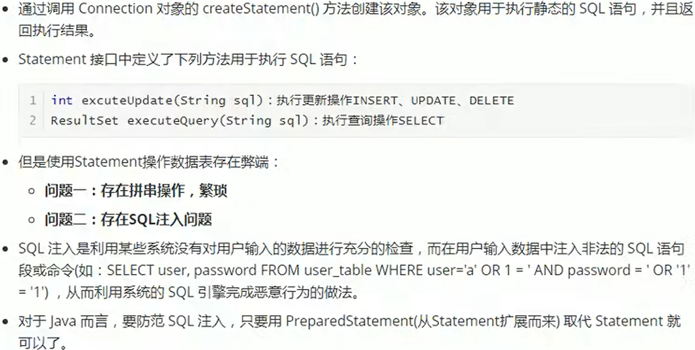
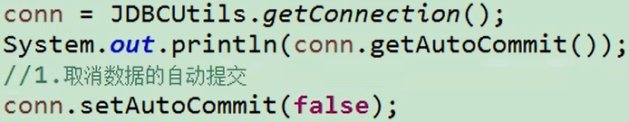
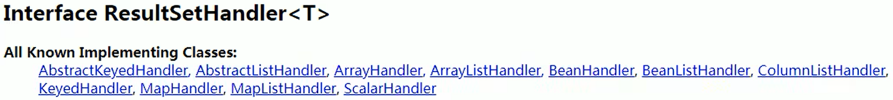
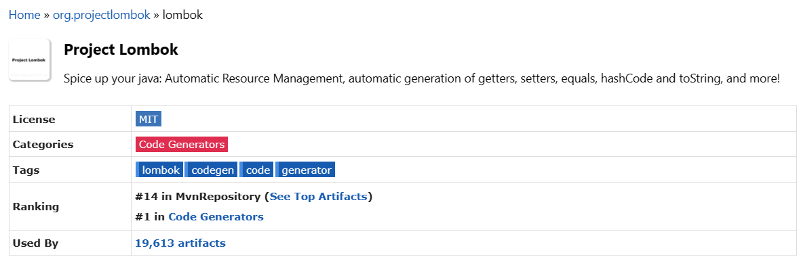
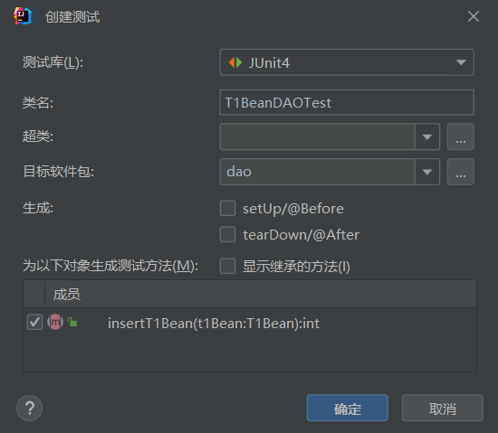
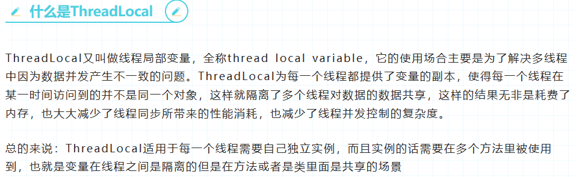
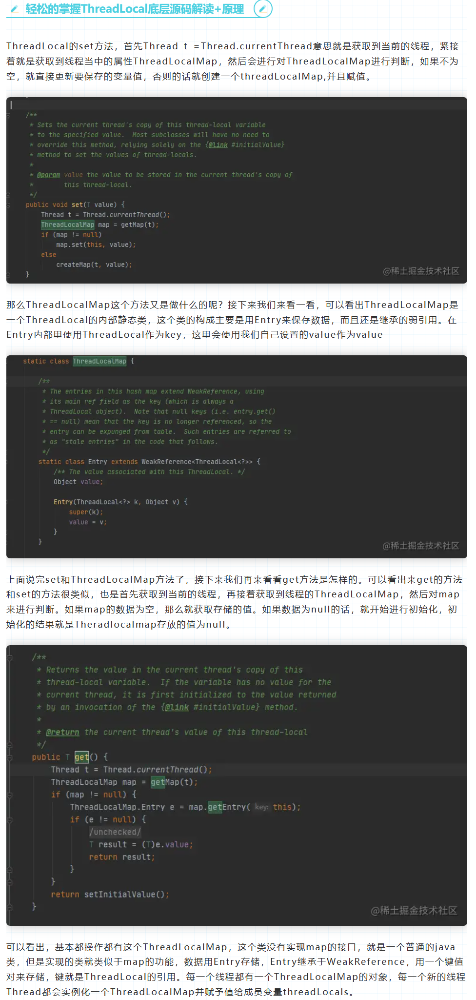
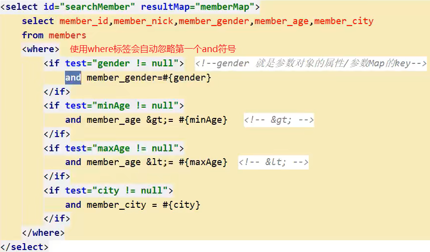

# 一、JDBC

## 1.1 JDBC概述


## 1.2 获取数据库连接

方式一：

```java
Driver driver = new com.mysql.cj.jdbc.Driver();

String url = "jdbc:mysql://127.0.0.1:3306/test";

Properties properties = new Properties();
properties.setProperty("user", "root");
properties.setProperty("password", "123456789");

Connection connect = driver.connect(url, properties);
System.out.println(connect);

connect.close();
```

方式二：

```java
Class<?> aClass = Class.forName("com.mysql.cj.jdbc.Driver");
Driver driver = (Driver) aClass.getConstructor().newInstance();

String url = "jdbc:mysql://127.0.0.1:3306/test";

Properties properties = new Properties();
properties.setProperty("user", "root");
properties.setProperty("password", "123456789");

Connection connect = driver.connect(url, properties);
System.out.println(connect);

connect.close();
```

方式三：

```java
Class<?> aClass = Class.forName("com.mysql.cj.jdbc.Driver");
Driver driver = (Driver) aClass.getConstructor().newInstance();

String url = "jdbc:mysql://127.0.0.1:3306/test";
String user = "root";
String password = "123456789";

DriverManager.registerDriver(driver);
Connection connect = DriverManager.getConnection(url, user, password);

System.out.println(connect);

connect.close();
```

方式四：

```java
Class.forName("com.mysql.cj.jdbc.Driver");

String url = "jdbc:mysql://127.0.0.1:3306/test";
String user = "root";
String password = "123456789";

Connection connect = DriverManager.getConnection(url, user, password);

System.out.println(connect);

connect.close();

// 之所以不用写Driver，原因是MySQL的Driver中静态代码块已写
/*
public class Driver extends NonRegisteringDriver implements java.sql.Driver {
    //
    // Register ourselves with the DriverManager
    //
    static {
        try {
            java.sql.DriverManager.registerDriver(new Driver());
        } catch (SQLException E) {
            throw new RuntimeException("Can't register driver!");
        }
    }
......
}
*/
// 其实Class.forName("com.mysql.cj.jdbc.Driver");也可以省略
// 原因如下，因为mysql的JDBC驱动已经帮我们导入。但是尽量不要省，因为其他数据库不一定导入
```


方式五：

```java
InputStream resourceAsStream = Test1.class.getClassLoader().getResourceAsStream("jdbc.properties");
Properties properties = new Properties();
try {
    properties.load(resourceAsStream);

    String driverClass = properties.getProperty("driverClass");
    String url = properties.getProperty("url");
    String user = properties.getProperty("user");
    String password = properties.getProperty("password");

    Class.forName(driverClass);

    Connection connect = DriverManager.getConnection(url, user, password);

    System.out.println(connect);

    connect.close();
} catch (IOException | ClassNotFoundException | SQLException e) {
    throw new RuntimeException(e);
}
// 使用配置文件，实现了数据和代码的分离，实现了解耦
```

## 1.3 使用PreparedStatement实现CRUD

在java.sql包中有3个接口分别定义了对数据库的调用的不同方式

+ Statement：用于执行静态SQL语句并返回它所生成结果的对象

+ PreparedStatement：SQL语句被预编译并存储在此对象中，可以使用此对象多次高效地执行该语句

+ CallableStatement：用于执行SQL存储过程

### 1.3.1 使用Statement操作数据表的弊端



拼串：（就是一个字符串因为要添加其他数据而将其使用+号连接）

```java
String user = 'abc';
String password = '123456';
String sql = "select * from test where user = '" + user + "' and password = '" + password + "'";
```

注入：（如上图中举例）


将 user = "1' or"，password = "=1 or '1' = '1"时，会发现 where '1' = '1'恒成立

### 1.3.2 PreparedStatement的使用

PreparedStatement接口是Statement的子接口


增删改：

```java
String sql1 = "insert into biao1(name, email, birth) values (?, ?, ?)";
// String sql2 = "delete from biao where name = ?";
// String sql3 = "update biao1 set name = ? where id = ?";
PreparedStatement ps = connect.prepareStatement(sql1);

ps.setString(1, "张三");
ps.setString(2, "1111@qq.com");

SimpleDateFormat sdf = new SimpleDateFormat("yyyy-MM-dd");
Date parse = sdf.parse("2001-09-11");
ps.setDate(3, new java.sql.Date(parse.getTime()));

// 上述全部可以改成：ps.setObject(parameterIndex, Object);参数照着写

// ps.execute();
preparedStatement.executeUpdate();  // 返回int类型结果，表示影响的行数

ps.close();

// 增删改操作可以写成一个通用的方法，此时要使用setObject()方法填充占位符
// 由于通用方法中sql和占位符个数不确定，所以将他们作为方法参数传入，如下
// public void update(String sql, Object ...args){}。用可变参数来传递占位符
// 如果sql语句中的表名等是关键字，一定要加``与关键字区分，不然报错
```


查：

```java
String sql = "select c1, c2, c3, c4 from t1 where c2 = ?";
try (PreparedStatement preparedStatement = connection.prepareStatement(sql)) {
    preparedStatement.setObject(1, 22);

    // 执行并返回结果集
    ResultSet resultSet = preparedStatement.executeQuery();

    // 处理结果集
    if(resultSet.next()) {  // 判断结果集下一条是否有数据，如果有返回true并指针下移，没有则只返回false
        // 获取当前数据的各个字段值
        int c1 = resultSet.getInt(1);
        int c2 = resultSet.getInt(2);
        String c3 = resultSet.getString(3);
        Time c4 = resultSet.getTime(4);

        // 将数据封装成一个对象
        ArrayList<T1Bean> t1 = new ArrayList<>();
        t1.add(new T1Bean(c1, c2, c3, c4));
        System.out.println(t1.get(0));
    }

    resultSet.close();
} catch (SQLException e) {
    throw new RuntimeException(e);
}

// ORM编程思想（Object Relational Mapping）
/*
 一个数据表对应一个Java类
 表中的一条记录对应Java类的一个对象
 表中的一个字段对应Java类的一个属性
*/

public class T1Bean {
    private int c1;
    private int c2;
    private String c3;
    private Date c4;

    // 构造方法，get和set方法，toString方法...
}
```


针对某一表的通用查询操作：

```java
try (PreparedStatement preparedStatement = connection.prepareStatement(sql)) {
    for (int i = 0; i < args.length; i++) {
        preparedStatement.setObject(i + 1, args[i]);
    }

    ResultSet resultSet = preparedStatement.executeQuery();

    // 获取结果集的元数据
    ResultSetMetaData metaData = resultSet.getMetaData();
    // 通过元数据获取结果集中的列数
    int columnCount = metaData.getColumnCount();

    T1Bean t1Bean = null;
    if (resultSet.next()) {
        t1Bean = new T1Bean();

        for (int i = 0; i < columnCount; i++) {
            Object object = resultSet.getObject(i + 1);

            // 通过元数据获取每个列的列名（尽量别用）
            // String columnName = metaData.getColumnName(i + 1);
            // 通过元数据获取每个列的别名（推荐使用）
            String columnLabel = metaData.getColumnLabel(i + 1);
            // 通过反射将值赋值给对象
            Field declaredField = T1Bean.class.getDeclaredField(columnLabel);
            declaredField.setAccessible(true);
            declaredField.set(t1Bean, object);
        }
    }

    resultSet.close();

    return t1Bean;
} catch (SQLException | NoSuchFieldException | IllegalAccessException e) {
    throw new RuntimeException(e);
}

String sql = "select c1, c2, c3, c4 from t1 where c2 = ?";
T1Bean t1Bean = selectData2(connection, sql, "11");
System.out.println(t1Bean);

// PreparedStatement会为占位符?的两边自动加上单引号
// 所以PreparedStatement只能用来为可以加引号’的参数（如参数值）设置动态参数，即用?占位，不可用于表名、字段名等

// 如果表的字段名与bean类的属性名不一致，解决方法是sql语句使用别名并且将获取列的列名改成获取列的别名。举例如下：
// String sql = "select c_1 c1, c_2 c2, c_3 c3, c_4 c4 from ....";
// 原先：String columnName = metaData.getColumnName(i + 1); 尽量不用
// 更改：String columnLabel = metaData.getColumnLabel(i + 1);  推荐使用
// 使用 metaData.getColumnLabel() 获取别名时，如果没有别名，那么便会获取其列名
```

针对不同表的通用查询操作：

```java
// 与针对某一表的通用查询操作类似，只是将固定的对象用泛型表示
public static <T> T selectData3(Class<T> clazz, Connection connection, String sql, Object ...args) {
    try (PreparedStatement preparedStatement = connection.prepareStatement(sql)) {
        for (int i = 0; i < args.length; i++) {
            preparedStatement.setObject(i + 1, args[i]);
        }

        ResultSet resultSet = preparedStatement.executeQuery();

        // 获取结果集的元数据
        ResultSetMetaData metaData = resultSet.getMetaData();
        // 通过元数据获取结果集中的列数
        int columnCount = metaData.getColumnCount();

        T t = null;
        if (resultSet.next()) {
            t = clazz.getConstructor().newInstance();

            for (int i = 0; i < columnCount; i++) {
                Object object = resultSet.getObject(i + 1);

                // 通过元数据获取每个列的列名
                String columnName = metaData.getColumnName(i + 1);
                // 通过反射将值赋值给对象
                Field declaredField = clazz.getDeclaredField(columnName);
                declaredField.setAccessible(true);
                declaredField.set(t, object);
            }
        }

        resultSet.close();

        return t;
    } catch (SQLException | NoSuchFieldException | IllegalAccessException | InvocationTargetException |
             InstantiationException | NoSuchMethodException e) {
        throw new RuntimeException(e);
    }
}

String sql = "select c1, c2, c3, c4 from t1 where c2 = ?";
T1Bean t1Bean = selectData3(T1Bean.class, connection, sql, "11");
System.out.println(t1Bean);
```

---

使用PreparedStatement预编译sql语句好处：

1. 可以操作Blob类型的数据（因为占位符可以通过流的方式进行填充。Statement做不到）

2. 可以实现更高效地批量操作（只需编译一次，之后填充占位符即可。Statement是编译一次执行一次）

## 1.4 操作BLOB类型字段


插入Blob数据：(删/改 操作与增一样，只需更改sql语句即可)

```java
String sql = "insert into t1(c2, c3, c4, c5) values(?, ?, ?, ?)";
try (PreparedStatement preparedStatement = connection.prepareStatement(sql)) {
    preparedStatement.setObject(1, 55);
    preparedStatement.setObject(2, "haha");
    preparedStatement.setObject(3, "2023-04-21");

    InputStream resourceAsStream = JDBCDemo.class.getClassLoader().getResourceAsStream("123.jpg");
    preparedStatement.setBlob(4, resourceAsStream);

    preparedStatement.executeUpdate();
} catch (SQLException e) {
    throw new RuntimeException(e);
}
```

查询Blob数据：

```java
String sql = "select * from t1 where c2 = ?";
try (PreparedStatement preparedStatement = connection.prepareStatement(sql)) {
    preparedStatement.setObject(1, 33);

    ResultSet resultSet = preparedStatement.executeQuery();

    if (resultSet.next()) {
        // 方式一：
        // int c1 = resultSet.getInt(1);
        // int c2 = resultSet.getInt(2);
        // String c3 = resultSet.getString(3);
        // Date c4 = resultSet.getDate(4);
        // Blob c5 = resultSet.getBlob(5);

        // 方式二：可读性更强，建议这样写
        int c1 = resultSet.getInt("c1");
        int c2 = resultSet.getInt("c2");
        String c3 = resultSet.getString("c3");
        Date c4 = resultSet.getDate("c4");
        Blob blob = resultSet.getBlob("c5");

        T1Bean t1Bean = new T1Bean(c1, c2, c3, c4);

        // 将Blob类型数据下载下来，并以文件形式保存到本地
        InputStream binaryStream = blob.getBinaryStream();
        FileOutputStream fos = new FileOutputStream(new File("src/main/resources/456.jpg"));

        byte[] bytes = new byte[1024];
        int len = -1;

        while ((len = binaryStream.read(bytes)) != -1) {
            fos.write(bytes, 0, len);
        }

        fos.close();
        binaryStream.close();
    }
} catch (SQLException | IOException e) {
    throw new RuntimeException(e);
}

/*
 注意：
 如果使用通用查询(使用了反射)，那么不能获取数据库中Blob数据，
 因为Blob类型数据不支持反射
*/
```

## 1.5 批量插入

update、delete、select本身就具有批量操作的效果。此处批量操作，主要指批量插入

---

方式一：使用Statement（每执行一次，就要编译一次sql语句并与数据库交互一次）


---

方式二：使用PreparedStatement（每执行一次，都要与数据库交互一次）


---

方式三：使用`addBatch(), executeBatch(), clearBatch()`方法进行批量处理


5.1.13以上版本的驱动，添加参数`rewriteBatchedStatements=true`可实现高性能的批量插入，所以mysql驱动需更新到该版本或以上


+ Statement 也可以使用方式三中的批量处理

+ 上述代码中，当sql存储到500个时，就与数据库进行一次交互。此时要注意最后一步，如果最后一步求余不等于0，要单独考虑（此处20000被500求余等于0，所以最后一步不用单独考虑）

---

方式四：使用事务来减少提交次数，也能提高效率


`+` 方式三代码 `+`


---

**PreparedStatement  VS  Statement**


## 1.6 数据库事务


**DDL一旦执行，就会自动提交，设置 autocommit 变量对其无效**

---



`+` sql语句执行 `+`


`+`


---


---


很多数据库变量可以直接用 Connection 对象的 getXXX(), setXXX() 来获取和设置

数据库中事务的隔离级别一般设置成 READ COMMITTED 即可，避免脏读就够了，或者设置成 REPEATABLE READ，一般不用 READ UNCOMMITTED 和 SERIALIZABLE

## 1.7 DAO及其实现类


基本DAO(通用型)：

```java
public abstract class DAO<T> {

    private Class<T> clazz = null;

    {
        // 获取当前 DAO 的子类继承的父类中的泛型(也可写在构造方法中)
        /*
         在 T1BeanDAOImplTest 类中创建了 T1DAO t1Test = new T1DAOImpl(); 对象，
         在创建该对象时会首先执行 T1DAOImpl 的构造方法，
         在执行 T1DAOImpl 构造方法时第一行首先会执行 super(); 调用其父类 DAO<T> 的构造方法，
         在调用 DAO<T> 构造方法前会首先执行该代码块，
         注意，此处的 this 指的是 T1DAO t1Test = new T1DAOImpl(); 这一对象，而不是 DAO<T>，因为自始至终并没有创建该对象
        */
        Type genericSuperclass = this.getClass().getGenericSuperclass();

        ParameterizedType parameterizedType = (ParameterizedType) genericSuperclass;

        // 获取父类的泛型参数(由于泛型<T1, T2, ...>可以设置多个类型参数，所以是一个泛型数组)
        Type[] actualTypeArguments = parameterizedType.getActualTypeArguments();

        clazz = (Class<T>) actualTypeArguments[0];
    }

    // 通用增删改
    public int update(Connection connection, String sql, Object ...args) {
        try (PreparedStatement preparedStatement = connection.prepareStatement(sql)) {

            for (int i = 0; i < args.length; i++) {
                preparedStatement.setObject(i+1, args[i]);
            }

            // preparedStatement.execute();
            return preparedStatement.executeUpdate();
        } catch (SQLException e) {
            throw new RuntimeException(e);
        }
    }

    // 通用查询操作(返回一个对象)
    public T getInstance(Connection connection, String sql, Object... args) {
        try (PreparedStatement preparedStatement = connection.prepareStatement(sql)) {
            for (int i = 0; i < args.length; i++) {
                preparedStatement.setObject(i + 1, args[i]);
            }

            ResultSet resultSet = preparedStatement.executeQuery();

            // 获取结果集的元数据
            ResultSetMetaData metaData = resultSet.getMetaData();
            // 通过元数据获取结果集中的列数
            int columnCount = metaData.getColumnCount();

            T t = null;
            if (resultSet.next()) {
                t = clazz.getConstructor().newInstance();

                for (int i = 0; i < columnCount; i++) {
                    Object object = resultSet.getObject(i + 1);

                    // 通过元数据获取每个列的列名
                    String columnName = metaData.getColumnName(i + 1);
                    // 通过反射将值赋值给对象
                    Field declaredField = clazz.getDeclaredField(columnName);
                    declaredField.setAccessible(true);
                    declaredField.set(t, object);
                }
            }

            resultSet.close();

            return t;
        } catch (SQLException | NoSuchFieldException | IllegalAccessException | InvocationTargetException |
                 InstantiationException | NoSuchMethodException e) {
            throw new RuntimeException(e);
        }
    }

    // 通用查询操作(返回多个对象)
    public List<T> getInstances(Connection connection, String sql, Object... args) {
        try (PreparedStatement preparedStatement = connection.prepareStatement(sql)) {
            for (int i = 0; i < args.length; i++) {
                preparedStatement.setObject(i + 1, args[i]);
            }

            ResultSet resultSet = preparedStatement.executeQuery();

            // 获取结果集的元数据
            ResultSetMetaData metaData = resultSet.getMetaData();
            // 通过元数据获取结果集中的列数
            int columnCount = metaData.getColumnCount();

            ArrayList<T> list = new ArrayList<>();
            while (resultSet.next()) {
                T t = clazz.getConstructor().newInstance();

                for (int i = 0; i < columnCount; i++) {
                    Object object = resultSet.getObject(i + 1);

                    // 通过元数据获取每个列的列名
                    String columnName = metaData.getColumnName(i + 1);
                    // 通过反射将值赋值给对象
                    Field declaredField = clazz.getDeclaredField(columnName);
                    declaredField.setAccessible(true);
                    declaredField.set(t, object);
                }

                list.add(t);
            }

            resultSet.close();

            return list;
        } catch (SQLException | NoSuchFieldException | IllegalAccessException | InvocationTargetException |
                 InstantiationException | NoSuchMethodException e) {
            throw new RuntimeException(e);
        }
    }

    // 用于查询特殊值(COUNT(*)等等)
    public <E> E getValue(Connection connection, String sql, Object ...args) {
        try (PreparedStatement preparedStatement = connection.prepareStatement(sql)) {
            for (int i = 0; i < args.length; i++) {
                preparedStatement.setObject(i+1, args[i]);
            }

            ResultSet resultSet = preparedStatement.executeQuery();

            if (resultSet.next()) {
                return (E) resultSet.getObject(1);
            }
        } catch (SQLException e) {
            throw new RuntimeException(e);
        }
        return null;
    }
}
```

针对于具体的表，我们需要提供具体的DAO

针对T1表的具体DAO接口：

```java
public interface T1DAO {
    // 将对象t1Bean添加到数据库中
    void insert(Connection connection, T1Bean t1Bean);

    // 根据指定的c1，删除表中的记录
    void deleteByC1(Connection connection, int c1);

    // 根据c1修改表中的对应的记录
    void updateByc1(Connection connection, int c1, T1Bean t1Bean);

    // 根据c1查询表中的对应的单条记录
    T1Bean getT1BeanByc1(Connection connection, int c1);

    // 查询表中的所有记录
    List<T1Bean> getT1BeanAll(Connection connection);

    // 获取表中记录的数量
    Long getCount(Connection connection);

    // 查询c4中最大的日期
    Date getMaxC4(Connection connection);
}
```

针对T1表的具体DAO接口的实现：

```java
public class T1DAOImpl extends DAO<T1Bean> implements T1DAO {
    @Override
    public void insert(Connection connection, T1Bean t1Bean) {
        String sql = "insert into t1(c2, c3, c4) values(?, ?, ?)";
        update(connection, sql, t1Bean.getC2(), t1Bean.getC3(), t1Bean.getC4());
    }

    @Override
    public void deleteByC1(Connection connection, int c1) {
        String sql = "delete from t1 where c1 = ?";
        update(connection, sql, c1);
    }

    @Override
    public void updateByc1(Connection connection, int c1, T1Bean t1Bean) {
        String sql = "update t1 set c2 = ?, c3 = ?, c4 = ? where c1 = ?";
        update(connection, sql, t1Bean.getC2(), t1Bean.getC3(), t1Bean.getC4(), c1);
    }

    @Override
    public T1Bean getT1BeanByc1(Connection connection, int c1) {
        String sql = "select c1, c2, c3, c4 from t1 where c1 = ?";
        return getInstance(connection, sql, c1);
    }

    @Override
    public List<T1Bean> getT1BeanAll(Connection connection) {
        String sql = "select c1, c2, c3, c4 from t1";
        return getInstances(connection, sql);
    }

    @Override
    public Long getCount(Connection connection) {
        String sql = "select count(*) from t1";
        return getValue(connection, sql);
    }

    @Override
    public Date getMaxC4(Connection connection) {
        String sql = "select max(c4) from t1";
        return getValue(connection, sql);
    }
}
```

测试：

```java
public class T1BeanDAOImplTest {
    T1DAO t1Test = new T1DAOImpl();

    @Test
    public void testInsert() {
        try(Connection connection = JDBCDemo.getConnection()){
            T1Bean t1Bean = new T1Bean();
            t1Bean.setC2(66);
            t1Bean.setC3("huahua");
            t1Bean.setC4(new Date(96514685465L));

            t1Test.insert(connection, t1Bean);
        } catch (SQLException e) {
            throw new RuntimeException(e);
        }
    }

    @Test
    public void testDelete() {
        try(Connection connection = JDBCDemo.getConnection()){
            t1Test.deleteByC1(connection, 7);
        } catch (SQLException e) {
            throw new RuntimeException(e);
        }
    }

    @Test
    public void testUpdate() {
        try(Connection connection = JDBCDemo.getConnection()){
            T1Bean t1Bean = new T1Bean();
            t1Bean.setC2(11);
            t1Bean.setC3("huahua");
            t1Bean.setC4(new Date(96514685465L));

            t1Test.updateByc1(connection, 1, t1Bean);
        } catch (SQLException e) {
            throw new RuntimeException(e);
        }
    }

    @Test
    public void testGetByC1() {
        try(Connection connection = JDBCDemo.getConnection()){
            System.out.println(t1Test.getT1BeanByc1(connection, 3));
        } catch (SQLException e) {
            throw new RuntimeException(e);
        }
    }

    @Test
    public void testGetAll() {
        try(Connection connection = JDBCDemo.getConnection()){
            List<T1Bean> list = t1Test.getT1BeanAll(connection);
            list.forEach(System.out::println);
        } catch (SQLException e) {
            throw new RuntimeException(e);
        }
    }

    @Test
    public void testGetCount() {
        try(Connection connection = JDBCDemo.getConnection()){
            System.out.println(t1Test.getCount(connection));
        } catch (SQLException e) {
            throw new RuntimeException(e);
        }
    }

    @Test
    public void testGetMaxC4() {
        try(Connection connection = JDBCDemo.getConnection()){
            System.out.println(t1Test.getMaxC4(connection));
        } catch (SQLException e) {
            throw new RuntimeException(e);
        }
    }
}
```

## 1.8 数据库连接池


---


---


---


---


### 1.8.1 C3P0

方式一：

```java
// 获取C3P0数据库连接池
ComboPooledDataSource cpds = new ComboPooledDataSource();
try {
    cpds.setDriverClass("com.mysql.cj.jdbc.Driver");
    cpds.setJdbcUrl("jdbc:mysql://localhost:3306/test");
    cpds.setUser("root");
    cpds.setPassword("123456789");

    // 设置连接池中初始连接数量为10
    cpds.setInitialPoolSize(10);

    Connection connection = cpds.getConnection();

    // 将连接放回连接池
    connection.close();

    // 销毁连接池(一般不会执行此步骤)
    DataSources.destroy(cpds);
} catch (PropertyVetoException | SQLException e) {
    throw new RuntimeException(e);
}
```

方式二：使用xml配置文件(配置文件名为：c3p0-config.xml，固定不变的)

配置文件模板：

```xml
<?xml version="1.0" encoding="UTF-8" ?>
<!--配置文件模板-->
<c3p0-config>
    <default-config>
        <property name="automaticTestTable">con_test</property>
        <property name="checkoutTimeout">30000</property>
        <property name="idleConnectionTestPeriod">30</property>
        <property name="initialPoolSize">10</property>
        <property name="maxIdleTime">30</property>
        <property name="maxPoolSize">100</property>
        <property name="minPoolSize">10</property>
        <property name="maxStatements">200</property>

        <user-overrides user="test-user">
            <property name="maxPoolSize">10</property>
            <property name="minPoolSize">1</property>
            <property name="maxStatements">0</property>
        </user-overrides>
    </default-config>

    <named-config name="intergalactoApp">
        <property name="acquireIncrement">50</property>
        <property name="initialPoolSize">100</property>
        <property name="minPoolSize">50</property>
        <property name="maxPoolSize">1000</property>

        <property name="maxStatements">0</property>
        <property name="maxStatementsPerConnection">5</property>

        <user-overrides user="master-of-the-universe">
            <property name="acquireIncrement">1</property>
            <property name="initialPoolSize">1</property>
            <property name="minPoolSize">1</property>
            <property name="maxPoolSize">5</property>
            <property name="maxStatementsPerConnection">50</property>
        </user-overrides>
    </named-config>
</c3p0-config>
```

实际常用部分：

```xml
<?xml version="1.0" encoding="UTF-8" ?>
<c3p0-config>
    <!--name-config：自定义配置。其中name为配置文件名，自定义-->
    <named-config name="c3p0Test">

        <!--提供获取连接的4个基本信息-->
        <!--仔细观察会发现，方式一中的cpds.setXXX()方法中，XXX与下述name对应，配置的时候可以相互参考-->

        <property name="driverClass">com.mysql.cj.jdbc.Driver</property>
        <property name="jdbcUrl">jdbc:mysql://localhost:3306/test</property>
        <property name="user">root</property>
        <property name="password">123456789</property>

        <!--进行数据库连接池管理的基本信息-->

        <!--当数据库连接池中的连接数不够时，c3p0一次性向数据库服务器申请的连接数，此处为5个-->
        <property name="acquireIncrement">5</property>
        <!--初始化连接数量，此处为10个-->
        <property name="initialPoolSize">10</property>
        <!--数据库连接池维护的最少连接数，此处为10个-->
        <property name="minPoolSize">10</property>
        <!--数据库连接池维护的最多连接数，此处为100个，当访问的连接超过100时，进入等待队列中等待-->
        <property name="maxPoolSize">100</property>
        <!--数据库连接池中维护的最多的Statement个数(Statement包括PreparedStatement)，此处为50个-->
        <property name="maxStatements">50</property>
        <!--每个连接可以使用的最多的Statement个数，此处为2个-->
        <property name="maxStatementsPerConnection">2</property>

        <!--此外还可以设置最大空闲时间，当某些连接空闲时长超过最大空闲时间时，就将其释放，减少连接数-->
    </named-config>
</c3p0-config>

<!--注意，该文件应放在resources资源目录下-->
```

使用：

```java
// 获取C3P0数据库连接池
ComboPooledDataSource cpds = new ComboPooledDataSource("c3p0Test");
try {
    Connection connection = cpds.getConnection();

    connection.close();

    DataSources.destroy(cpds);
} catch (SQLException e) {
    throw new RuntimeException(e);
}
```

### 1.8.2 DBCP

方式一：

```java
// 获取DBCP数据库连接池
BasicDataSource source = new BasicDataSource();

// 设置连接池基本信息(必须)

source.setDriverClassName("com.mysql.cj.jdbc.Driver");
source.setUrl("jdbc:mysql://localhost:3306/test");
source.setUsername("root");
source.setPassword("123456789");

// 设置连接池基本信息(可选)，不写使用默认值

// 连接池启动时创建的初始化连接数量（默认为0）
source.setInitialSize(10);
// 连接池中可同时连接的最大连接数（默认值为8）
source.setMaxActive(20);
// 连接池中最大的空闲的连接数，超过的空闲连接将被释放，如果设置为负数表示不限制（默认为8）
source.setMaxIdle(10);
// 连接池中最小的空闲的连接数，低于这个数量会被创建新的连接（默认为0）
source.setMinIdle(6);
// 最大等待时间，当没有可用的连接时，连接池等待连接释放的最大时间，超过该时间限制会抛出异常
source.setMaxWait(8);
// 开启池的prepared（默认为false，经测试，开启后性能没有关闭好）
// source.setPoolPreparedStatements(false);
// 开启池的prepared后的同时最大连接数（默认无限制）
// source.setMaxOpenPreparedStatements(10);
// 连接池中的连接在设置的时间段内一直空闲，则被逐出连接池
source.setMinEvictableIdleTimeMillis(5000);
// 超出时间限制，回收没有用(废弃)的连接（默认为300秒）
source.setRemoveAbandonedTimeout(300);
// 超过RemoveAbandonedTimeout时间后，是否进行没用连接的回收（默认为false）
source.setRemoveAbandoned(false);


try (Connection connection = source.getConnection()) {
    System.out.println(connection);
} catch (SQLException e) {
    throw new RuntimeException(e);
}
```

方式二：使用properties配置文件

```properties
driverClassName=com.mysql.cj.jdbc.Driver
url=jdbc:mysql://localhost:3306/test
username=root
password=123456789
initialSize=10
# 仔细观察会发现，方式一中的source.setXXX()方法中，XXX与上述键对应，配置的时候可以相互参考
```

```java
// 获取DBCP数据库连接池
Properties properties = new Properties();
try(InputStream resourceAsStream = C3P0Test.class.getClassLoader().getResourceAsStream("dbcp.properties")) {
    properties.load(resourceAsStream);
    DataSource dataSource = BasicDataSourceFactory.createDataSource(properties);

    Connection connection = dataSource.getConnection();
    System.out.println(connection);

    connection.close();
} catch (Exception e) {
    throw new RuntimeException(e);
}
```

### 1.8.3 Druid

用法与DBCP基本一致

方式一：

```java
// 获取Druid数据库连接池
try (DruidDataSource druidDataSource = new DruidDataSource()) {
    druidDataSource.setDriverClassName("com.mysql.cj.jdbc.Driver");
    druidDataSource.setUrl("jdbc:mysql://localhost:3306/test");
    druidDataSource.setUsername("root");
    druidDataSource.setPassword("123456789");

    Connection connection = druidDataSource.getConnection();
    System.out.println(connection);

    connection.close();
} catch (SQLException e) {
    throw new RuntimeException(e);
}
```

方式二：使用properties配置文件

```properties
driverClassName=com.mysql.cj.jdbc.Driver
url=jdbc:mysql://localhost:3306/test
username=root
password=123456789
initialSize=10
maxActive=20
# 仔细观察会发现，方式一中的druidDataSource.setXXX()方法中，XXX与上述键对应，配置的时候可以相互参考
```

```java
// 获取Druid数据库连接池
Properties properties = new Properties();
try (InputStream resourceAsStream = ConnectionPoolTest.class.getClassLoader().getResourceAsStream("druid.properties")) {
    properties.load(resourceAsStream);
    DataSource dataSource = DruidDataSourceFactory.createDataSource(properties);

    Connection connection = dataSource.getConnection();
    System.out.println(connection);

    connection.close();
} catch (Exception e) {
    throw new RuntimeException(e);
}
```

## 1.9 DBUtils实现CRUD操作


---

增删改：

```java
QueryRunner queryRunner = new QueryRunner();

try (Connection connection = JDBCDemo.getConnection()) {
    String sql = "insert into t1(c2, c3, c4) values(?, ?, ?)";

    queryRunner.update(connection, sql, 66, "lala", "2023-04-22");
} catch (SQLException e) {
    throw new RuntimeException(e);
}
```


---

查：(使用 BeanHandler，用于封装表中的一条记录)

```java
QueryRunner queryRunner = new QueryRunner();

try (Connection connection = JDBCDemo.getConnection()) {
    String sql = "select c1, c2, c3, c4 from t1 where c1 = ?";

    BeanHandler<T1Bean> beanHandler = new BeanHandler<>(T1Bean.class);

    T1Bean query = queryRunner.query(connection, sql, beanHandler, 1);

    System.out.println(query);
} catch (SQLException e) {
    throw new RuntimeException(e);
}
```

查：(使用 BeanListHandler，用于封装表中的多条记录)

```java
QueryRunner queryRunner = new QueryRunner();

try (Connection connection = JDBCDemo.getConnection()) {
    String sql = "select c1, c2, c3, c4 from t1 where c1 < ?";

    BeanListHandler<T1Bean> beanListHandler = new BeanListHandler<>(T1Bean.class);

    List<T1Bean> query = queryRunner.query(connection, sql, beanListHandler, 8);

    query.forEach(System.out::println);
} catch (SQLException e) {
    throw new RuntimeException(e);
}
```

查：(使用 MapHandler，用于将查询的一个结果中的每个字段值存入Map中，Key为字段)

```java
QueryRunner queryRunner = new QueryRunner();

try (Connection connection = JDBCDemo.getConnection()) {
    String sql = "select c1, c2, c3, c4 from t1 where c1 = ?";

    MapHandler mapHandler = new MapHandler();

    Map<String, Object> query = queryRunner.query(connection, sql, mapHandler, 1);

    System.out.println(query);
} catch (SQLException e) {
    throw new RuntimeException(e);
}
```

查：(使用 MapListHandler，用于将查询的多个结果中的每个字段值存入List集合中的Map中)

```java
QueryRunner queryRunner = new QueryRunner();

try (Connection connection = JDBCDemo.getConnection()) {
    String sql = "select c1, c2, c3, c4 from t1 where c1 < ?";

    MapListHandler mapListHandler = new MapListHandler();

    List<Map<String, Object>> query = queryRunner.query(connection, sql, mapListHandler, 8);

    query.forEach(System.out::println);
} catch (SQLException e) {
    throw new RuntimeException(e);
}
```

查：(使用 ScalarHandler，用于查询一些统计等特殊值)

```java
QueryRunner queryRunner = new QueryRunner();

try (Connection connection = JDBCDemo.getConnection()) {
    String sql = "select count(*) from t1 where c1 < ?";

    ScalarHandler<Long> scalarHandler = new ScalarHandler<>();

    Long count = queryRunner.query(connection, sql, scalarHandler, 8);

    System.out.println(count);
} catch (SQLException e) {
    throw new RuntimeException(e);
}
```

查：(自定义 ResultSetHandler，用于查询操作)

```java
QueryRunner queryRunner = new QueryRunner();

try (Connection connection = JDBCDemo.getConnection()) {
    String sql = "select c1, c2, c3, c4 from t1 where c1 = ?";

    ResultSetHandler<T1Bean> myselfHandler = new ResultSetHandler<T1Bean>() {
        @Override
        public T1Bean handle(ResultSet resultSet) throws SQLException {
            if (resultSet.next()) {
                int c1 = resultSet.getInt("c1");
                int c2 = resultSet.getInt("c2");
                String c3 = resultSet.getString("c3");
                Date c4 = resultSet.getDate("c4");
                return new T1Bean(c1, c2, c3, c4);
            }
            return null;
        }
    };

    T1Bean query = queryRunner.query(connection, sql, myselfHandler, 1);

    System.out.println(query);
} catch (SQLException e) {
    throw new RuntimeException(e);
}
```


|  |
| ---------------------------------------------------------------------------- |
|  |
|  |
|  |
|  |
|  |
|  |

---

DbUtils类关闭资源操作：

```java
// 方式一（设置了判断不为空执行关闭）
try {
    DbUtils.close(connection);
} catch (SQLException e) {
    throw new RuntimeException(e);
}

// 方式二（在DbUtils.close()的基础上处理了异常）
DbUtils.closeQuietly(connection);
```

---

上述方法可以传Connection，也可以不传。如果涉及到事务，就自己传递 Connection ，否则可以不传

# 二、MyBatis

## 2.1 简介及基础使用

### 2.1.1 框架概念介绍


**SSM介绍（Spring，SpringMVC，MyBatis）**

+ MVC框架（简化了Servlet的开发步骤，负责代码跟前端交互）
  
  + Struts
  
  + Struts2
  
  + `SpringMVC`

+ 持久层框架（完成数据库操作，负责代码跟数据库交互）
  
  + DbUtils
  
  + Hibernate
  
  + Spring JPA
  
  + `MyBatis`

+ 胶水框架（负责MVC框架与持久层框架进行更好地协作）
  
  + `Spring`

注意：Struts 和 Struts2 是两个不同的框架，只是名字相似罢了

### 2.1.2 MyBatis简介

+ MyBatis是一个半自动的ORM框架

+ ORM(Object Relational Mapping)对象关系映射，将Java中的一个对象与数据表中一行记录一一对应

+ ORM框架提供了实体类与数据表的映射关系，通过映射文件的配置，实现对象的持久化

+ MyBatis的前身是iBatis，是Apache软件基金会提供的一个开源项目

+ 2010年iBatis迁移到Google Code，正式更名为MyBatis。2013年迁移到GitHub上托管

---

MyBatis特点

+ 支持自定义SQL，存储过程
+ 对源有的JDBC进行了封装，几乎消除了所有JDBC代码，让开发者只需关注SQL本身
+ 支持XML与注解配置方式自动完成ORM操作，实现结果映射

### 2.1.3 框架部署

1. 创建Maven项目
   
   + Java工程
   
   + Web工程

2. 在项目中添加MyBatis依赖
   
   + mybatis
   
   + mysql-connector-java
   
   

3. 在resources目录下创建MyBatis配置文件(mybatis-config.xml，名字固定)
   
   ```xml
   <?xml version="1.0" encoding="UTF-8" ?>
   <!DOCTYPE configuration PUBLIC "-//mybatis.org//DTD Config 3.0//EN"
           "http://mybatis.org/dtd/mybatis-3-config.dtd">
   <configuration>
   
   </configuration>
   ```

4. 在mybatis-config.xml配置文件中配置数据库连接信息
   
   ```xml
   <?xml version="1.0" encoding="UTF-8" ?>
   <!DOCTYPE configuration PUBLIC "-//mybatis.org//DTD Config 3.0//EN"
           "http://mybatis.org/dtd/mybatis-3-config.dtd">
   <configuration>
       <!--在environments中配置数据库连接信息，default用来指定使用哪个environment-->
       <environments default="mysql">
           <!--一个environment代表一套连接配置(可有多个)-->
           <environment id="mysql">
               <!--transactionManager用于配置数据库管理方式-->
               <transactionManager type="JDBC"></transactionManager>
               <!--dataSource用于配置数据库连接信息-->
               <dataSource type="POOLED">
                   <property name="driver" value="com.mysql.cj.jdbc.Driver"/>
                   <property name="url" value="jdbc:mysql://localhost:3306/test?characterEncoding=utf-8"/>
                   <property name="username" value="root"/>
                   <property name="password" value="123456789"/>
               </dataSource>
           </environment>
       </environments>
   </configuration>
   ```

附：IDEA创建文件模板


### 2.1.4 框架使用

1. 创建数据表
   
   + 使用SQL语句在连接的数据库中创建表

2. 创建实体类
   
   + 使用lombok实现get, set等方法创建bean
     
     搜索maven依赖
     
     
     
     在pom.xml文件中添加
     
     ```xml
     <!-- https://mvnrepository.com/artifact/org.projectlombok/lombok -->
     <dependency>
         <groupId>org.projectlombok</groupId>
         <artifactId>lombok</artifactId>
         <version>1.18.26</version>
         <scope>provided</scope>
     </dependency>
     ```
     
     在pojo目录中创建实体类
     
     ```java
     @Data                // 导入get, set方法
     @AllArgsConstructor  // 导入全参构造方法
     @NoArgsConstructor   // 导入无参构造方法
     @ToString            // 导入toString方法
     // 在idea中使用lombok记得安装lombok插件，不然上述注解会报红
     public class T1Bean {
         private int c1;
         private int c2;
         private String c3;
         private Date c4;
     }
     ```

3. 创建DAO接口，定义操作方法
   
   + 在dao目录中定义接口
     
     ```java
     public interface T1BeanDAO {
         public int insertT1Bean(T1Bean t1Bean);
     }
     // 由于insert, select, ...这些操作标签的id等于DAO接口的方法名，所以在DAO接口中尽量不要使用方法重载
     ```
   
   + 在mappers目录中创建DAO接口的映射文件(xml文件)实现接口中的操作（用配置文件实现接口）
     
     模板：
     
     ```xml
     <?xml version="1.0" encoding="UTF-8" ?>
     <!DOCTYPE mapper PUBLIC "-//mybatis.org//DTD Mapper 3.0//EN"
             "http://mybatis.org/dtd/mybatis-3-mapper.dtd">
     <mapper namespace="">
     
     </mapper>
     ```
     
     实现：
     
     ```xml
     <?xml version="1.0" encoding="UTF-8" ?>
     <!DOCTYPE mapper PUBLIC "-//mybatis.org//DTD Mapper 3.0//EN"
             "http://mybatis.org/dtd/mybatis-3-mapper.dtd">
     <!--namespace存放要实现的接口的全限定名[包名+类](java目录下的相对路径，不是项目根目录下的相对路径)-->
     <mapper namespace="dao.T1BeanDAO">
         <!--此处写sql语句(添加sql语句用insert标签，修改sql语句用update标签，查询sql语句用select标签)-->
     
         <!--id要跟方法名保持一致。parameterType用来设置参数类型，同样添加全限定名。#{...}中添加的是实体类的属性名-->
     
         <!--此处由于DAO接口中insertT1Bean(T1Bean t1Bean)方法指定了参数类型，所以parameterType可以省略-->
         <insert id="insertT1Bean" parameterType="pojo.T1Bean">
             insert into t1(c2, c3, c4) values(#{c2}, #{c3}, #{c4});
         </insert>
     </mapper>
     <!--如果操作方法有一个对象类型的参数，在Mapper配置中可以直接通过#{属性名}获取对象的指定属性值-->
     ```
   
   + 在主配置文件(mybatis-config.xml)中添加上述映射文件
     
     ```xml
     <?xml version="1.0" encoding="UTF-8" ?>
     <!DOCTYPE configuration PUBLIC "-//mybatis.org//DTD Config 3.0//EN"
             "http://mybatis.org/dtd/mybatis-3-config.dtd">
     <configuration>
         ......
         <mappers>
             <!--resource存放相对于mybatis-config.xml文件的映射文件的相对路径-->
             <mapper resource="mappers/T1BeanMapper.xml"></mapper>
         </mappers>
     </configuration>
     ```

4. 附：项目目录结构如下
   
   

### 2.1.5 单元测试

1. 添加 JUnit 依赖

2. 创建要测试的类/接口的测试类
   
   
   
   
   
   
   
   

3. 编写测试类
   
   ```java
   @Test
   public void testInsertT1Bean() {
   
       // 通过工厂方法设计模式获取会话工厂
       SqlSessionFactoryBuilder sqlSessionFactoryBuilder = new SqlSessionFactoryBuilder();
   
       // 加载mybatis配置文件
       try (InputStream resourceAsStream = Resources.getResourceAsStream("mybatis-config.xml");) {
   
           // MyBatis的会话工厂
           SqlSessionFactory sqlSessionFactory = sqlSessionFactoryBuilder.build(resourceAsStream);
   
           // MyBatis与数据库之间的会话（通过工厂方法设计模式获取）
           SqlSession sqlSession = sqlSessionFactory.openSession();
   
           // 通过会话获取DAO对象
           /*
            该对象是getMapper()返回的代理对象，
            首先mybatis读取mapper.xml文件，
            将文件中的标签(insert等)动态封装成一个一个的方法，
            之后将这些方法封装成一个代理类，
            最后通过代理类创建一个代理对象返回，
            该代理类实现了DAO接口。
            整个过程使用了动态代理模式
           */
           T1BeanDAO t1Bean = sqlSession.getMapper(T1BeanDAO.class);
   
           int count = t1Bean.insertT1Bean(new T1Bean(9, 77, "papa", new Date()));
   
           // 严格意义上来讲，测试的时候不应是打印，而应使用断言
           System.out.println(count);
           // 断言成功，测试成功且不打印，断言失败，测试失败且报错打印“结果错误”
           assert count==1 : "结果错误";
   
           sqlSession.close();
       } catch (IOException e) {
           throw new RuntimeException(e);
       }
   }
   ```
   
   运行后发现程序执行成功，count=1，但是数据库中却没有数据库，这是因为事务没有提交，mybatis创建的每一个会话不会自动提交事务，需要手动提交
   
   在上述代码中增加一行代码即可
   
   ```java
   sqlSession.commit();
   ```

## 2.2 CRUD操作

1. 如果操作方法有一个对象类型的参数，在Mapper配置中可以直接通过#{属性名}获取对象的指定属性值

2. 如果操作方法只有一个简单类型或者字符串类型的参数，在Mapper配置中可以直接通过#{非数字的任意值}直接获取

3. 如果操作方法有一个Map类型的参数，在Mapper配置中可以直接通过#{key值}获取对应的value值

4. 如果操作方法有多个参数，有三种方式，
   
   + 使用HashMap
   
   + 使用MyBatis内置参数，
   
   + 使用@Param注解声明参数的别名

### 2.2.1 添加操作(insert)

请查看 **2.1.5 单元测试** 这一章节

### 2.2.2 删除操作(delete)

与添加操作基本一致，请查看 **2.1.5 单元测试** 这一章节

### 2.2.3 修改操作(update)

与添加操作基本一致，请查看 **2.1.5 单元测试** 这一章节

### 2.2.4 查询操作(select)

1. 查询所有记录
   
   ```java
   public interface T1BeanDAO {
       public int insertT1Bean(T1Bean t1Bean);
   
       public List<T1Bean> listT1Bean();
   }
   ```
   
   如果实体类的属性名与数据表中字段名不一致，解决方法如下：
   
   + 方式一：
   
   ```xml
   <!--使用别名，并在select标签中添加 resultType="pojo.T1Bean" 指定返回结果的类型-->
   <!--resultType用于指定查询结果封装对象的实体类，实体类属性名与数据库字段名一致，可省略不写-->
   <!--resultSets用于指定当前操作返回的集合类型，Mybatis会自行判断，可省略不写-->
   <select id="listT1Bean" resultType="pojo.T1Bean" resultSets="java.util.List">
        select c1 实体类属性名, c2 实体类属性名, c3 实体类属性名, c4 实体类属性名
        from t1
   </select>
   ```
   
   + 方式二：建议使用，这样多条sql可以直接使用该resultMap标签，无需再写一遍别名
   
   ```xml
   <!--通过resultMap标签来指定映射关系-->
   <!--其中，column填写字段名，property填写属性名，id标签用来设置主键-->
   <resultMap id="T1BeanMap" type="pojo.T1Bean">
       <id column="c1" property="c1" />
       <result column="c2" property="c2" />
       <result column="c3" property="c3" />
       <result column="c4" property="c4" />
       <result column="c5" property="c5" />
   </resultMap>
   <!--由于resultMap中有了类型，所以此处不用再写resultType-->
   <!--在写select标签时，resultType和resultMap二选一写到里面-->
   <select id="listT1Bean" resultMap="T1BeanMap">
       select c1, c2, c3, c4
       from t1
   </select>
   ```
   
   ```java
   @Test
   public void testListT1Bean() {
       SqlSessionFactoryBuilder sqlSessionFactoryBuilder = new SqlSessionFactoryBuilder();
   
       try (InputStream resourceAsStream = Resources.getResourceAsStream("mybatis-config.xml")) {
           SqlSessionFactory sqlSessionFactory = sqlSessionFactoryBuilder.build(resourceAsStream);
   
           SqlSession sqlSession = sqlSessionFactory.openSession();
   
           T1BeanDAO t1Bean = sqlSession.getMapper(T1BeanDAO.class);
   
           List<T1Bean> t1Beans = t1Bean.listT1Bean();
   
           t1Beans.forEach(System.out::println);
   
           sqlSession.close();
       } catch (IOException e) {
           throw new RuntimeException(e);
       }
   }
   ```

2. 根据主键查询一条记录
   
   ```java
   public interface T1BeanDAO {
       public int insertT1Bean(T1Bean t1Bean);
   
       public List<T1Bean> listT1Bean();
   
       public T1Bean queryT1Bean(int c1);
   }
   ```
   
   ```xml
   <select id="queryT1Bean" resultMap="T1BeanMap">
       select c1, c2, c3, c4
       from t1
       where c1 = #{c1}
   </select>
   <!--上述#{c1}中可以填写任意非数字的字符。eg：#{aaa}等，这些都会执行成功-->
   <!--如果操作方法只有一个简单类型或者字符串类型的参数，在Mapper配置中可以直接通过#{非数字的任意值}直接获取-->
   ```
   
   ```java
   @Test
   public void testQueryT1Bean() {
       SqlSessionFactoryBuilder sqlSessionFactoryBuilder = new SqlSessionFactoryBuilder();
   
       try (InputStream resourceAsStream = Resources.getResourceAsStream("mybatis-config.xml")) {
           SqlSessionFactory sqlSessionFactory = sqlSessionFactoryBuilder.build(resourceAsStream);
   
           SqlSession sqlSession = sqlSessionFactory.openSession();
   
           T1BeanDAO t1Bean = sqlSession.getMapper(T1BeanDAO.class);
   
           T1Bean t1Beans = t1Bean.queryT1Bean(2);
   
           System.out.println(t1Beans);
   
           sqlSession.close();
       } catch (IOException e) {
           throw new RuntimeException(e);
       }
   }
   ```

3. 查询总记录数（返回int）
   
   与查询所有记录基本一致
   
   ```xml
   <select id="getCount" resultType="int">
       select count(1) from t1
   </select>
   ```
   
   注意，一定要用resultType指定返回类型，否则报错

4. 多参数查询（此处用分页查询举例）
   
   当操作方法有多个参数时，不能再按照上述方法写#{...}，否则会报错显示无法识别参数
   
   方式一：可以使用HashMap来传递参数
   
   ```java
   public interface T1BeanDAO {
       public int insertT1Bean(T1Bean t1Bean);
   
       public List<T1Bean> listT1Bean();
   
       public T1Bean queryT1Bean(int c1);
   
       public List<T1Bean> listT1BeanByPage(HashMap<String, Integer> map);
   }
   ```
   
   ```xml
   <select id="listT1BeanByPage" resultMap="T1BeanMap">
       select c1, c2, c3, c4
       from t1
       limit #{start}, #{pageSize}
   </select>
   <!--如果操作方法有一个Map类型的参数，在Mapper配置中可以直接通过#{key值}获取对应的value值-->
   ```
   
   ```java
   @Test
   public void testListT1BeanByPage() {
       SqlSessionFactoryBuilder sqlSessionFactoryBuilder = new SqlSessionFactoryBuilder();
   
       try (InputStream resourceAsStream = Resources.getResourceAsStream("mybatis-config.xml")) {
           SqlSessionFactory sqlSessionFactory = sqlSessionFactoryBuilder.build(resourceAsStream);
   
           SqlSession sqlSession = sqlSessionFactory.openSession();
   
           T1BeanDAO t1Bean = sqlSession.getMapper(T1BeanDAO.class);
   
           HashMap<String, Integer> map = new HashMap<>();
           map.put("start", 0);
           map.put("pageSize", 2);
   
           List<T1Bean> t1Beans = t1Bean.listT1BeanByPage(map);
   
           t1Beans.forEach(System.out::println);
   
           sqlSession.close();
       } catch (IOException e) {
           throw new RuntimeException(e);
       }
   }
   ```
   
   方式二：使用MyBatis的内置写法（arg1, arg0, ...）或（param1, param2, ...）
   
   ```java
   public interface T1BeanDAO {
       public int insertT1Bean(T1Bean t1Bean);
   
       public List<T1Bean> listT1Bean();
   
       public T1Bean queryT1Bean(int c1);
   
       public List<T1Bean> listT1BeanByPage(int start, int pageSize);
   }
   ```
   
   ```xml
   <select id="listT1BeanByPage" resultMap="T1BeanMap">
       select c1, c2, c3, c4
       from t1
       limit #{arg0}, #{arg1}
   </select>
   <!--也可以写成 limit #{param1}, #{param2}-->
   <!--该方式缺点就是需要记住参数顺序，arg0/param1代表第一个参数，以此类推-->
   ```
   
   ```java
   @Test
   public void testListT1BeanByPage() {
       SqlSessionFactoryBuilder sqlSessionFactoryBuilder = new SqlSessionFactoryBuilder();
   
       try (InputStream resourceAsStream = Resources.getResourceAsStream("mybatis-config.xml")) {
           SqlSessionFactory sqlSessionFactory = sqlSessionFactoryBuilder.build(resourceAsStream);
   
           SqlSession sqlSession = sqlSessionFactory.openSession();
   
           T1BeanDAO t1Bean = sqlSession.getMapper(T1BeanDAO.class);
   
           List<T1Bean> t1Beans = t1Bean.listT1BeanByPage(0, 2);
   
           t1Beans.forEach(System.out::println);
   
           sqlSession.close();
       } catch (IOException e) {
           throw new RuntimeException(e);
       }
   }
   ```
   
   方式三：使用@Param注解声明参数的别名（建议使用）
   
   ```java
   public interface T1BeanDAO {
       public int insertT1Bean(T1Bean t1Bean);
   
       public List<T1Bean> listT1Bean();
   
       public T1Bean queryT1Bean(int c1);
   
       public List<T1Bean> listT1BeanByPage(@Param("start") int start, @Param("pageSize") int pageSize);
   }
   ```
   
   ```xml
   <select id="listT1BeanByPage" resultMap="T1BeanMap">
       select c1, c2, c3, c4
       from t1
       limit #{start}, #{pageSize}
   </select>
   ```
   
   ```java
   @Test
   public void testListT1BeanByPage() {
       SqlSessionFactoryBuilder sqlSessionFactoryBuilder = new SqlSessionFactoryBuilder();
   
       try (InputStream resourceAsStream = Resources.getResourceAsStream("mybatis-config.xml")) {
           SqlSessionFactory sqlSessionFactory = sqlSessionFactoryBuilder.build(resourceAsStream);
   
           SqlSession sqlSession = sqlSessionFactory.openSession();
   
           T1BeanDAO t1Bean = sqlSession.getMapper(T1BeanDAO.class);
   
           List<T1Bean> t1Beans = t1Bean.listT1BeanByPage(0, 2);
   
           t1Beans.forEach(System.out::println);
   
           sqlSession.close();
       } catch (IOException e) {
           throw new RuntimeException(e);
       }
   }
   ```

### 2.2.5 添加操作主键回填

如果数据表中的主键设置为自增，那么我们是无法添加主键的，可是在某些操作中我们需要知道该条记录的主键值是多少，因此可通过如下方式获取

```java
public interface T1BeanDAO {
    public int insertT1Bean(T1Bean t1Bean);

    public List<T1Bean> listT1Bean();

    public T1Bean queryT1Bean(int c1);

    public List<T1Bean> listT1BeanByPage(@Param("start") int start, @Param("pageSize") int pageSize);

    public int insertT1BeanGetPrimaryKey(T1Bean t1Bean);
}
```

方式一：

```xml
<!--useGeneratedKeys：设置添加操作是否需要回填生成的主键-->
<!--keyProperty：设置回填的主键值复制到参数对象的哪个属性-->
<insert id="insertT1BeanGetPrimaryKey" useGeneratedKeys="true" keyProperty="c1">
    insert into t1(c1, c2, c3, c4) values(#{c1}, #{c2}, #{c3}, #{c4})
</insert>
```

方式二：

```xml
<insert id="insertT1BeanGetPrimaryKey">
    <selectKey keyProperty="c1" resultType="java.lang.Integer">
        select last_insert_id()
    </selectKey>
    insert into t1(c1, c2, c3, c4) values(#{c1}, #{c2}, #{c3}, #{c4})
</insert>
```

```java
@Test
public void testInsertT1BeanGetPrimaryKey() {

    SqlSessionFactoryBuilder sqlSessionFactoryBuilder = new SqlSessionFactoryBuilder();

    // 加载mybatis配置文件
    try (InputStream resourceAsStream = Resources.getResourceAsStream("mybatis-config.xml")) {

        // 会话工厂
        SqlSessionFactory sqlSessionFactory = sqlSessionFactoryBuilder.build(resourceAsStream);

        // 会话
        SqlSession sqlSession = sqlSessionFactory.openSession();

        // 通过会话获取DAO对象
        T1BeanDAO t1Bean = sqlSession.getMapper(T1BeanDAO.class);

        T1Bean bean = new T1Bean(0, 77, "papa", new Date());

        int count = t1Bean.insertT1BeanGetPrimaryKey(bean);

        sqlSession.commit();

        System.out.println(bean);

        System.out.println(count);
        assert count==1 : "结果错误";

        sqlSession.close();
    } catch (IOException e) {
        throw new RuntimeException(e);
    }
}
```

主键回填输出结果：


若不回填输出结果：


### 2.2.6 工具类封装

```java
public class MyBatisUtil {

    private static SqlSessionFactory sqlSessionFactory;

    private static final ThreadLocal<SqlSession> local = new ThreadLocal<>();

    static {
        SqlSessionFactoryBuilder sqlSessionFactoryBuilder = new SqlSessionFactoryBuilder();

        // 加载mybatis配置文件
        try (InputStream resourceAsStream = Resources.getResourceAsStream("mybatis-config.xml")) {

            // 会话工厂
            sqlSessionFactory = sqlSessionFactoryBuilder.build(resourceAsStream);
        } catch (IOException e) {
            throw new RuntimeException(e);
        }
    }

    public static SqlSessionFactory getSqlSessionFactory() {
        return sqlSessionFactory;
    }

    public static SqlSession getSqlSession() {
        return getSqlSession(false);
    }

    private static SqlSession getSqlSession(boolean isAutoCommit) {
        SqlSession sqlSession = local.get();

        if (sqlSession == null) {
            sqlSession = sqlSessionFactory.openSession(isAutoCommit);
            local.set(sqlSession);
        }

        return sqlSession;
    }

    public static <T> T getMapper(Class<T> clazz) {
        SqlSession sqlSession = getSqlSession(true);
        return sqlSession.getMapper(clazz);
    }
}
```

如果sql执行需要事务管理（增删改，因为这些需要提交才会写入数据库），那么调用上述代码中 getSession() 方法

如果sql执行不需要事务管理（查，因为这些不需要提交也会显示结果），那么调用上述代码中 getMapper() 方法

上述代码还可进行优化，请看 **4.2.8 事务管理**。

### 2.2.7 ThreadLocal(线程局部变量)







### 2.2.8 事务管理

1. SqlSession对象两大主要功能
   
   + getMapper(); 获取Mapper（DAO接口的实例）
   
   + 事务管理（当我们获取SqlSession对象时，就默认开启了事务）

2. 可将sql执行操作放在try-catch中，如果出现异常，可在异常处理中调用rollback()回滚

3. 自动提交事务设置：不写参数默认参数为 false
   
   ```java
   SqlSession sqlSession = sqlSessionFactory.openSession(true);
   ```

## 2.3 配置文件

### 2.3.1 主配置文件(mybatis-config.xml)

```xml
<?xml version="1.0" encoding="UTF-8" ?>
<!DOCTYPE configuration PUBLIC "-//mybatis.org//DTD Config 3.0//EN"
        "http://mybatis.org/dtd/mybatis-3-config.dtd">
<configuration>
    <!--properties作用：1、定义键值对，2、引用属性文件-->
    <!--方式一：这样写都是在同一个文件下，没有意义
    <properties>
        <property name="mysql_driver" value="com.mysql.cj.jdbc.Driver"/>
        <property name="mysql_url" value="jdbc:mysql://localhost:3306/test?characterEncoding=utf-8"/>
        <property name="mysql_username" value="root"/>
        <property name="mysql_password" value="123456789"/>
    </properties>
    -->
    <!--方式二：-->
    <properties resource="jdbc.properties"></properties>

    <!--用来设置相关的属性信息-->
    <settings>
        <!--全局性地开启所有映射器配置文件中已配置的任何缓存(启动二级缓存)-->
        <setting name="cacheEnabled" value="true"/>
        <!--延迟加载的全局开关开启，所有关联对象都会延迟加载。 特定关联关系中可通过设置 fetchType 属性来覆盖该项的开关状态-->
        <setting name="lazyLoadingEnabled" value="true"/>
    </settings>

    <!--类型别名可为 Java 类型设置一个缩写名字。 它仅用于 XML 配置，意在降低冗余的全限定类名书写-->
    <typeAliases>
        <!--在映射文件中，凡是需要使用全限定名的地方，均可替换可下方的别名-->
        <!--<mapper namespace="dao.T1BeanDAO">可替换为<mapper namespace="T1BeanDAO">-->
        <typeAlias type="dao.T1BeanDAO" alias="T1BeanDAO"/>
        <typeAlias type="pojo.T1Bean" alias="T1Bean"/>
    </typeAliases>

    <!--MyBatis 允许你在映射语句执行过程中的某一点使用插件来进行拦截调用-->
    <!--后面会进行详述
    <plugins>
        <plugin interceptor=""></plugin>
    </plugins>
    -->

    <!--在environments中配置数据库连接信息，default用来指定使用哪个environment-->
    <environments default="mysql">
        <!--一个environment代表一套连接配置(可有多个)-->
        <environment id="mysql">
            <!--transactionManager用于配置数据库管理方式-->
            <transactionManager type="JDBC"></transactionManager>
            <!--dataSource用于配置数据库连接信息-->
            <dataSource type="POOLED">
                <!--通过 ${key} 这种方式可获取 properties 标签中的属性值-->
                <property name="driver" value="${mysql_driver}"/>
                <property name="url" value="${mysql_url}"/>
                <property name="username" value="${mysql_username}"/>
                <property name="password" value="${mysql_password}"/>
            </dataSource>
        </environment>
    </environments>

    <!--mappers标签用于载入映射配置（映射文件，DAO注解）-->
    <mappers>
        <!--resource存放相对于mybatis-config.xml文件的映射文件的相对路径-->
        <mapper resource="mappers/T1BeanMapper.xml"></mapper>
    </mappers>
</configuration>
```

mybatis-config.xml文件中标签种类、顺序和用法（下述标签在主配置文件中顺序不能更改）


### 2.3.2 映射文件(xxxMapper.xml)

MyBatis初始化过程：


```xml
<?xml version="1.0" encoding="UTF-8" ?>
<!DOCTYPE mapper PUBLIC "-//mybatis.org//DTD Mapper 3.0//EN"
        "http://mybatis.org/dtd/mybatis-3-mapper.dtd">
<!--namespace存放要实现的接口的全限定名[包名+类](java目录下的相对路径，不是项目根目录下的相对路径)-->
<mapper namespace="dao.T1BeanDAO">

    <!--默认情况下，只启用了本地的会话缓存。要启用全局的二级缓存，需添加 <cache/>，后面缓存章节会细说-->
    <!--
    <cache type="" size="" readOnly=""/>
    -->

    <!--此处写sql语句(添加sql语句用insert标签，修改sql语句用update标签，查询sql语句用select标签)-->

    <!--id要跟方法名保持一致。parameterType用来设置参数类型，同样添加全限定名。#{...}中添加的是实体类的属性名-->

    <!--此处由于DAO接口中insertT1Bean(T1Bean t1Bean)方法指定了参数类型，所以parameterType可以省略-->
    <insert id="insertT1Bean" parameterType="pojo.T1Bean">
        insert into t1(c2, c3, c4)
        values (#{c2}, #{c3}, #{c4})
    </insert>

    <!--如果实体类的属性名与数据表中字段名不一致，可以使用别名，并在select标签中添加 resultType="pojo.T1Bean" 指定返回结果的类型-->
    <!--resultType用于指定查询结果封装对象的实体类，实体类属性名与数据库字段名一致，可省略不写-->
    <!--resultSets用于指定当前操作返回的集合类型，Mybatis会自行判断，可省略不写-->
    <!--
    <select id="listT1Bean" resultType="pojo.T1Bean" resultSets="java.util.List">
         select c1, c2, c3, c4
         from t1
    </select>
    -->
    <!--如果实体类的属性名与数据表中字段名不一致，可以通过resultMap标签来指定映射关系-->
    <!--其中，column填写字段名，property填写属性名，id标签用来设置主键-->
    <resultMap id="T1BeanMap" type="pojo.T1Bean">
        <id column="c1" property="c1"/>
        <result column="c2" property="c2"/>
        <result column="c3" property="c3"/>
        <result column="c4" property="c4"/>
        <result column="c5" property="c5"/>
    </resultMap>

    <!--这个元素可以用来定义可重用的 SQL 代码片段，以便在其它语句中使用-->
    <!--在sql语句中使用<include refid="...">来调用sql标签-->
    <sql id="selectAll"> c1, c2, c3, c4 </sql>

    <!--由于resultMap中有了类型，所以此处不用再写resultType-->
    <select id="listT1Bean" resultMap="T1BeanMap">
        select <include refid="selectAll"/>
        from t1
    </select>

    <select id="queryT1Bean" resultMap="T1BeanMap">
        select <include refid="selectAll"/>
        from t1
        where c1 = #{c1}
    </select>

    <select id="listT1BeanByPage" resultMap="T1BeanMap">
        select <include refid="selectAll"/>
        from t1
        limit #{start}, #{pageSize}
    </select>

    <!--timeout单位是毫秒，当等待时间超过该值时，则停止等待并返回失败-->
    <insert id="insertT1BeanGetPrimaryKey" useGeneratedKeys="true" keyProperty="c1" timeout="3000">
        insert into t1(c1, c2, c3, c4)
        values (#{c1}, #{c2}, #{c3}, #{c4})
    </insert>
    <!--方式二：
    <insert id="insertT1BeanGetPrimaryKey">
        <selectKey keyProperty="c1" resultType="java.lang.Integer">
            select last_insert_id()
        </selectKey>
        insert into t1(c1, c2, c3, c4) values(#{c1}, #{c2}, #{c3}, #{c4})
    </insert>
    -->
</mapper>
```


### 2.3.3 分页插件

分页插件（PageHelper）是一个独立于MyBatis框架之外的第三方插件

第一步：添加依赖（pom.xml）

```xml
<!-- https://mvnrepository.com/artifact/com.github.pagehelper/pagehelper -->
<dependency>
    <groupId>com.github.pagehelper</groupId>
    <artifactId>pagehelper</artifactId>
    <version>5.3.2</version>
</dependency>
```

第二步：配置插件（mybatis-config.xml）


复制上述文件引用

```xml
<!--MyBatis 允许你在映射语句执行过程中的某一点使用插件来进行拦截调用-->
<plugins>
    <plugin interceptor="com.github.pagehelper.PageInterceptor"></plugin>
</plugins>
```

第三步：使用插件

```java
@Test
public void testListT1BeanByPagePlugin() {
    SqlSessionFactoryBuilder sqlSessionFactoryBuilder = new SqlSessionFactoryBuilder();

    try (InputStream resourceAsStream = Resources.getResourceAsStream("mybatis-config.xml")) {
        SqlSessionFactory sqlSessionFactory = sqlSessionFactoryBuilder.build(resourceAsStream);

        SqlSession sqlSession = sqlSessionFactory.openSession();

        T1BeanDAO t1Bean = sqlSession.getMapper(T1BeanDAO.class);

        // 查询第1页，每页显示2条记录，该操作一定要在sql语句执行之前
        PageHelper.startPage(1, 2);

        List<T1Bean> t1Beans = t1Bean.listT1Bean();

        PageInfo<T1Bean> pageInfo = new PageInfo<>(t1Beans);

        List<T1Bean> list = pageInfo.getList();

        for (T1Bean bean : list) {
            System.out.println(bean);
        }

        sqlSession.close();
    } catch (IOException e) {
        throw new RuntimeException(e);
    }
}
```

## 2.4 关联映射

表1和表2一旦建立了外键关联(表2的外键关联了表1的主键)，那么在删除表1中的数据时，就必须把表2中关联的数据一并删除(级联删除)，否则单独删除表1的数据会删除失败。这导致**在很多企业中两张表会建立逻辑上的外键关联，但不会建立物理上的外键关联(即表2外键与表1主键对应，但不会使用`constraint fk_user foreign key(外键) references 表1(主键)` sql语句建立物理上的关联)**

### 2.4.1 一对一关联

数据表关联方式：

1. 主键关联（表1的主键和表2的主键相同时，表示是匹配的数据）

2. 唯一外键关联（表1和表2主键无法关联时，在表2中创建表1的唯一外键实现两表关联）

---

1. 关联增删改
   
   与单张表插入一样，先将一数据插入一张表，再将另一数据插入另一张表。此时**注意这两次操作应该放在同一事物中**

2. 关联查
   
   
   
   方式一：连接查询
   
   
   
   
   
   方式二：子查询
   
   
   
   

### 2.4.2 一对多关联

数据表关联方式：

1. 外键关联（在“一对多关联”的两表中，在“多”的这张表建立外键[非唯一]实现两表关联）

---

1. 关联查
   
   
   
   方式一：连接查询
   
   
   
   方式二：子查询
   
   
   
   

### 2.4.3 多对一关联

数据表关联方式：

1. 外键关联（在“一对多关联”的两表中，在“多”的这张表建立外键[非唯一]实现两表关联）

---

1. 关联查
   
   
   
   方式一：连接查询
   
   多对一关联可理解为多个一对一关联，所以其连接查询与一对一连接查询一样
   
   方式二：子查询
   
   多对一关联可理解为多个一对一关联，所以其子查询与一对一子查询一样

### 2.4.4 多对多关联

数据表关联方式：(将多对多关联转化为两个一对多关联)

1. 建立第三张表关联（第三张表中，添加两个外键[非唯一]分别与两张表的主键进行关联）

---

1. 关联查
   
   创建 学生表、课程表、选课信息表(成绩表)
   
   其中，选课信息表包含学生表和课程表的主键以及成绩(=-1表示还未考试)，在选课信息表中，其他两表的主键在这里都不是主键，也不是唯一键
   
   查询一：
   
   
   
   与一对多关联查询完全一致
   
   查询二：
   
   
   
   与一对多关联查询完全一致
   
   ---
   
   总结：
   
   上述Student类和Course类尽量不要互相包含对方，因为这样逻辑会十分复杂，根据业务需求，一个类包含另一个类的集合对象即可，如上图
   
   此时可以考虑再创建一个选课信息(成绩)类，将Student类和Course类的集合对象放入其中。这两个类互相不包含对方，而是通过这个选课信息(成绩)类间接地实现互相包含

## 2.5 动态SQL

### 2.5.1 介绍

根据查询条件动态完成SQL的拼接，用于查询条件个数不确定的情况


### 2.5.2 案例(相亲平台心仪对象搜索)

图1：


图2：


图3：


图4：


图5：


图6：


图7：


图8：



图9：


图10：


图11：


### 2.5.3 模糊查询(#{}，${})

DAO接口：


## 2.6 日志配置(log4j)

MyBatis作为一个封装好的ORM框架，其运行过程我们没有办法跟踪，所以为了让开发者了解MyBatis执行流程及每个执行步骤所完成的工作，MyBatis框架本身支持log4j日志框架，对运行的过程进行跟踪记录。(log4j中的4是单词for的谐音，所以不要读成了数字叫法)


---

1. 添加日志框架依赖
   
   ```xml
   <!-- https://mvnrepository.com/artifact/log4j/log4j -->
   <dependency>
       <groupId>log4j</groupId>
       <artifactId>log4j</artifactId>
       <version>1.2.17</version>
   </dependency>
   ```

2. 添加日志配置文件
   
   在resources目录下创建名为`log4j.properties`的文件（文件名固定）
   
   在该文件中配置日志输出的方式，配置如下：
   
   ```properties
   # 声明日志的输出级别及输出方式(告诉log4j输出debug信息到stdout(控制台)中)
   log4j.rootLogger=DEBUG,stdout
   # MyBatis logging configuration...
   log4j.logger.org.mybatis.example.BlogMapper=TRACE
   # Console output...
   log4j.appender.stdout=org.apache.log4j.ConsoleAppender
   log4j.appender.stdout.layout=org.apache.log4j.PatternLayout
   # 定义日志的打印格式(%t:线程名称, %p:日志信息优先级, %m:具体日志信息, %n:换行)
   log4j.appender.stdout.layout.ConversionPattern=[%t] %5p - %m%n
   ```
   
   日志信息优先级介绍
   
   | 优先级   | 说明    |
   |:-----:|:-----:|
   | DEBUG | 调试信息  |
   | INFO  | 提示信息  |
   | WARN  | 警告信息  |
   | ERROR | 一般性错误 |
   | FATAL | 致命性错误 |
   
   运行结果(不是测试结果)如下：
   
   ```
   [main] DEBUG - Logging initialized using 'class org.apache.ibatis.logging.log4j.Log4jImpl' adapter.
   [main] DEBUG - 
   
   ,------.                           ,--.  ,--.         ,--.                         
   |  .--. '  ,--,--.  ,---.   ,---.  |  '--'  |  ,---.  |  |  ,---.   ,---.  ,--.--. 
   |  '--' | ' ,-.  | | .-. | | .-. : |  .--.  | | .-. : |  | | .-. | | .-. : |  .--' 
   |  | --'  \ '-'  | ' '-' ' \   --. |  |  |  | \   --. |  | | '-' ' \   --. |  |    
   `--'       `--`--' .`-  /   `----' `--'  `--'  `----' `--' |  |-'   `----' `--'    
                      `---'                                   `--'                        is intercepting.
   
   [main] DEBUG - PooledDataSource forcefully closed/removed all connections.
   [main] DEBUG - PooledDataSource forcefully closed/removed all connections.
   [main] DEBUG - PooledDataSource forcefully closed/removed all connections.
   [main] DEBUG - PooledDataSource forcefully closed/removed all connections.
   [main] DEBUG - Opening JDBC Connection
   [main] DEBUG - Created connection 1542520418.
   [main] DEBUG - Setting autocommit to false on JDBC Connection [com.mysql.cj.jdbc.ConnectionImpl@5bf0fe62]
   [main] DEBUG - ==>  Preparing: select c1, c2, c3, c4 from t1
   [main] DEBUG - ==> Parameters: 
   [main] DEBUG - <==      Total: 7
   T1Bean(c1=1, c2=11, c3=huahua, c4=Mon Jan 22 00:00:00 CST 1973)
   T1Bean(c1=2, c2=22, c3=nana, c4=Wed Apr 19 00:00:00 CST 2023)
   T1Bean(c1=3, c2=33, c3=mengmeng, c4=Fri Apr 21 00:00:00 CST 2023)
   T1Bean(c1=4, c2=44, c3=miaomiao, c4=Fri Apr 21 00:00:00 CST 2023)
   T1Bean(c1=5, c2=55, c3=haha, c4=Fri Apr 21 00:00:00 CST 2023)
   T1Bean(c1=8, c2=66, c3=lala, c4=Sat Apr 22 00:00:00 CST 2023)
   T1Bean(c1=10, c2=77, c3=papa, c4=Sun Apr 23 00:00:00 CST 2023)
   [main] DEBUG - Resetting autocommit to true on JDBC Connection [com.mysql.cj.jdbc.ConnectionImpl@5bf0fe62]
   [main] DEBUG - Closing JDBC Connection [com.mysql.cj.jdbc.ConnectionImpl@5bf0fe62]
   [main] DEBUG - Returned connection 1542520418 to pool.
   ```

## 2.7 数据库连接池(Druid)


---

1. 添加Druid依赖
   
   ```xml
   <!-- https://mvnrepository.com/artifact/com.alibaba/druid -->
   <dependency>
       <groupId>com.alibaba</groupId>
       <artifactId>druid</artifactId>
       <version>1.2.17</version>
   </dependency>
   ```

2. 创建Druid连接池工厂
   
   ```java
   package utils;
   
   public class DruidDataSourceFactory extends PooledDataSourceFactory {
       public DruidDataSourceFactory() {
           // 重新指定MyBatis的数据源
           this.dataSource = new DruidDataSource();
       }
   }
   ```

3. 将Druid连接池工厂配置给MyBatis数据源
   
   ```xml
   <environments default="mysql">
       <!--一个environment代表一套连接配置(可有多个)-->
       <environment id="mysql">
           <!--transactionManager用于配置数据库管理方式-->
           <transactionManager type="JDBC"/>
           <!--dataSource用于配置数据库连接信息-->
   
           <!--type="..."表示mybatis获取连接的方式，通过连接池工厂类中的getDataSource()方法获得数据源(连接池)，如下所示-->
           <!--POOLED：MyBatis内置的连接池-->
           <!--type="..."这个属性值是支持自定义的，自定义的话MyBatis需要一个连接池工厂，用来产生数据库连接池-->
           <!--MyBatis提供连接池工厂的类是PooledDataSourceFactory类，如下所示-->
           <!--所以type属性值是一个数据库连接池工厂，且该工厂类型必须是PooledDataSourceFactory类的类型-->
           <!--根据PooledDataSourceFactory类和UnpooledDataSourceFactory类可知，我们只要更改UnpooledDataSourceFactory类中的dataSource变量即可，如上所示-->
           <!--这里使用了多态的方式，DruidDataSourceFactory类通过继承PooledDataSourceFactory类之后再通过type传递-->
           <dataSource type="utils.DruidDataSourceFactory">
   
               <!--通过 ${key} 这种方式可获取 properties 标签中的属性值-->
               <property name="driverClassName" value="${mysql_driver}"/>
               <property name="url" value="${mysql_url}"/>
               <property name="username" value="${mysql_username}"/>
               <property name="password" value="${mysql_password}"/>
           </dataSource>
       </environment>
   </environments>
   ```

4. 查看结果
   
   

---

```java
// 上述2中Druid连接池工厂继承的类PooledDataSourceFactory

public class PooledDataSourceFactory extends UnpooledDataSourceFactory {
    public PooledDataSourceFactory() {
        this.dataSource = new PooledDataSource();
    }
}

// PooledDataSourceFactory继承的类UnpooledDataSourceFactory
public class UnpooledDataSourceFactory implements DataSourceFactory {
    private static final String DRIVER_PROPERTY_PREFIX = "driver.";
    private static final int DRIVER_PROPERTY_PREFIX_LENGTH = "driver.".length();
    // 上述2中继承的dataSource就是来自这里
    protected DataSource dataSource = new UnpooledDataSource();

    public UnpooledDataSourceFactory() {
    }
    // ......
}

// UnpooledDataSourceFactory类获得数据源的方法
public DataSource getDataSource() {
    return this.dataSource;
}
```

## 2.8 缓存机制

MyBatis引入缓存机制，用于提升MyBatis的检索效率

缓存：存储数据的内存

### 2.8.1 缓存原理


### 2.8.2 一级缓存

一级缓存是为SqlSession分配的缓存，无需手动开启，该缓存只在其SqlSession下共享

执行代码：


测试结果：


查看自定义的MyBatisUtil类可知，memberDAO和memberDAO2使用了同一个SqlSession

由此可判断，第二次执行同样的查询，MyBatis并没有查询数据库，而是直接从缓存中获取结果

执行代码：


测试结果：


由此可知，清空缓存后，第二次执行同样的查询，MyBatis依旧会查询数据库

执行代码：


测试结果：


由此可知，一级缓存中，每个SqlSession的缓存只在其内部共享，彼此之间互不共享

执行代码：


测试结果：


由此可知，member1和member2虽然栈地址不同，但是它们指向堆内存(缓存)中的对象是相同的

在`member1.setMemberAge(99);`语句后执行`sqlSession1.clearCache()`方法，该对象会被清除出缓存，但是该对象并不会回收，因为member1指向了它。当再次查询时，MyBatis会查询数据库记录并存入缓存，member2指向了它，此时member1和member2指向的就不是堆内存中的同一对象

---

总结：

1. 当两次查询同一个东西的时候，因为缓存，只会执行一次sql

2. 当两次查询中间有一次增删改的操作(insert, update, delete，不是如上述那种修改)的时候，会清空缓存

3. SqlSession执行clearCache()方法可手动清理缓存

注意：

上述2中在两次查询中间执行增删改操作时，会发现第二次查询结果是修改后的结果，但是查看数据库会发现数据表并未被修改？

数据表并未被修改原因：事务未提交，修改的只是内存数据页中的数据，并未写入磁盘

第二次查询结果是修改后的结果原因：此时要注意，数据库运行时数据页在内存中的缓存与MyBatis的缓存不是同一个，MyBatis执行事务时，操作的是内存中的缓存页，只有事务提交，数据才会写入磁盘。所以说，执行增删改清除MyBatis缓存后，数据库未修改却还是读到了修改后的数据原因就是MyBatis执行sql操作的是内存中的数据页。这个是事务的特征，未提交，就不会写入磁盘。数据库中的内存数据页由数据库本身操作，MyBatis只是使用数据库而已，就像我们平时直接使用数据库一样，在执行事务操作时，只要未提交，就不会写入磁盘，但是执行操作后的结果却是可以在事务中查看到

---


### 2.8.3 二级缓存

二级缓存也称为SqlSessionFactory级别的缓存，通过同一个factory对象获取的SqlSession可以共享二级缓存，在整个项目中SqlSessionFactory是单例的(只创建并赋值一次)，因此二级缓存可以实现全局共享

二级缓存默认关闭，需要手动开启(在mybatis-config.xml文件中设置)

二级缓存只能缓存实现了序列化接口的对象

---

第一步：设置mybatis-config.xml文件

```xml
<!--用来设置相关的属性信息-->
<settings>
    <!--全局性地开启所有映射器配置文件中已配置的任何缓存(启动二级缓存)-->
    <setting name="cacheEnabled" value="true"/>
</settings>
```

第二步：在需要使用二级缓存的mapper.xml文件中配置

```xml
<!--默认情况下，只启用了本地的会话缓存。要启用全局的二级缓存，需添加 <cache/>-->
<!--详情请见“4.3.2 映射文件”章节中缓存部分-->
<cache />
```

第三步：对实体类进行序列化

```java
@Data                // 导入get, set方法
@AllArgsConstructor  // 导入全参构造方法
@NoArgsConstructor   // 导入无参构造方法
@ToString            // 导入toString方法
// 在idea中使用lombok记得安装lombok插件，不然上述注解会报红
public class T1Bean implements Serializable {
    private int c1;
    private int c2;
    private String c3;
    private Date c4;
}
```

---

执行代码：


测试结果：


## 2.9 延迟加载

在MyBatis中引入延迟加载机制，用于减少对数据库不必要的访问，默认关闭

如果在MyBatis中开启了延迟加载，则执行子查询（至少查询两次及以上）时，默认只执行第一次查询，当用到子查询的查询结果时，才会触发子查询的执行，如果无需使用子查询的查询结果，则子查询不会执行

延迟加载只在子查询中有效

当我们使用延迟加载执行了第一次查询后关闭连接，再使用第二次查询的对象时，它会重新打开一个JDBC Connection继续执行第二次查询，所以关闭连接对延迟加载没有影响

---


或者

```xml
<settings>
    <!--延迟加载的全局开关开启，所有关联对象都会延迟加载。 特定关联关系中可通过设置 fetchType 属性来覆盖该项的开关状态-->
    <setting name="lazyLoadingEnabled" value="true"/>
</settings>
```

# 三、MyBatis-Plus
