# 一、MySQL基础

## 1.1 MySQL登录

```shell
mysql -h localhost -P 3306 -u root -p ***

// -h : 主机（host）
// -P : 端口号（port）
// -u : 用户（user）
// -p : 密码（password）

// -p 与后面的密码之间不能有空格，其他有无均可
```

## 1.2 MySQL常用基本命令

```sql
-- 如果数据库不存在，则创建数据库
CREATE DATABASE IF NOT EXISTS study;

-- 使用 ** 数据库
USE study;

-- 查看当前所有数据库
SHOW DATABASES;

-- 查看目前所在的数据库
SELECT DATABASE();

-- 查看当前数据库的版本(或者在dos窗口输入："mysql --version 或 --V")
SELECT VERSION();

-- 查看数据库中的数据表（需要先使用 "USE 数据库" 命令）
SHOW tables;

-- 查看指定数据库中的数据表
SHOW tables FROM world;

-- 创建数据表
CREATE TABLE IF NOT EXISTS exm (
    id INT,
    -- 最后一个属性不能加 “,”
    name VARCHAR(20)
);

-- 查看数据表的结构（或者使用 "DESC 数据表"）
DESCRIBE exm;

-- 删除数据表
DROP TABLE IF EXISTS exm;

-- 删除指定数据库
DROP DATABASE IF EXISTS study;
```

注意：

1. MySQL不区分大小写，但建议关键字大写，表明，列名等小写。

2. 写SQL语句时，建议关键字单独占一行。

## 1.3 DQL语言

DQL：Data Query Language

SQL Select语句完整的执行顺序： 

1. **from**子句组装来自不同数据源的数据； 

2. **where**子句基于指定的条件对记录行进行筛选； 

3. **group by**子句将数据划分为多个分组； 

4. 使用聚集函数进行计算； 

5. 使用**having**子句筛选分组； 

6. 计算所有的表达式； 

7. **select** 的字段；

8. 使用**order by**对结果集进行排序。

### 1.3.1 查询字段

```sql
SELECT 查询列表 FROM 表名;
-- 查询列表可以是：字段、常量值、表达式、函数
-- 查询结果是一个虚拟的表格
```

```sql
SELECT * FROM users;
-- 不足：查询字段顺序与表中顺序一致，顺序无法自定义
```

```sql
SELECT `last_name` FROM users;
-- `` 符号用来标识字段名，当字段名与关键字冲突时(eg：name)必须用，否则可不用
-- 字段名与关键字冲突时，运行不会报错，就是查看代码时会造成歧义
```

### 1.3.2 查询常量

```sql
SELECT 100;
-- 字段名为其本身
-- 如果后面加上 "FROM 表名"，那么输出的表中有多少行，常量就将输出多少行
```

```sql
SELECT 'helloworld';
-- MySQL中不区分字符和字符串，所以单引号双引号都行，都认为是字符
-- 不过尽量用单引号，有些IDE用双引号报错
-- 字符型和日期型常量值必须用单/双引号括起来
```

### 1.3.3 查询表达式

```sql
SELECT 100*9;
-- 字段名为其本身，值为其计算结果
```

### 1.3.4 查询函数

```sql
SELECT VERSION();
```

---

### 1.3.5 为字段起别名(AS)

```sql
-- 方式一：
SELECT 100*9 AS 结果;
-- 方式二：AS可直接省略
SELECT 100*9 结果;

-- 别名中有特殊符号时(eg：空格，#等)，需加上单/双引号
SELECT 100*9 "#金额 结果#"

-- “结果”就是100*9的别名，输出时字段名为其别名，这样增强了结果的可读性
-- 查询时(连接查询等)如果字段有重名，使用别名可以将其区分
```

### 1.3.6 去重(DISTINCT)

```sql
-- 查询员工表中涉及到的所有的部门编号
SELECT DISTINCT department_id FROM users;

/*
 使用了DISTINCT去重后，
 后面只能加一个字段或使用函数等求得的最后结果为一个字段，
 不会报错，但是得出来的结果不规则。
*/
-- 以下写法均错误
SELECT DISTINCT a, b
FROM 表名;

SELECT DISTINCT a, DISTINCT b
FROM 表名;
-- 可以推测，如果a字段有重复的，b字段没有重复的，那么淘汰重复的a时b该淘汰哪个？
```

### 1.3.7 “+”号的作用(只能作为运算符)

```sql
-- 两个操作数都为数值型，则做加法运算。输出190
SELECT 100 + 90;

-- 其中一方为字符型时，MySQL会试图将字符型转换为数值型
-- 如果转换成功，则做加法运算。输出190
SELECT '100' + 90;
-- 如果转换失败，那么字符型转换为0。分别输出90和0
SELECT 'haha' + 90
SELECT 'haha' + 'lala';

-- 其中一方为null，则结果肯定为null。输出null
SELECT null + 100;
```

### 1.3.8 concat函数实现连接

```sql
-- 输出结果为abc
SELECT CONCAT('a', 'b', 'c') AS 结果;

-- 输出结果为null
-- null与任何数据拼接结果均为null
SELECT CONCAT('a', null, 'c') AS 结果;
-- 解决方法1(如果IFNULL(expr1, expr2)中expr1为空，则用expr2替代，否则不替代)
SELECT CONCAT('a', IFNULL(null, '0'), 'c');
-- 解决方法2(如果ISNULL(expr)中expr为空，则返回1[true]，否则返回0[false])
SELECT CONCAT('a', ISNULL(null), 'c');
```

### 1.3.9 条件查询(WHERE)

```sql
SELECT last_name, first_name
FROM users
WHERE department_id <> 3;
/*
 WHERE中的筛选条件分类：
    1、按条件表达式筛选（>, <, =, <>[!=], >=, <=）
    2、按逻辑表达式筛选（AND[&&], OR[||], NOT[!]）
    3、模糊查询（LIKE, BETWEEN AND, IN, IS NULL）
*/
```

```sql
/*
 like（模糊查询）一般与通配符搭配使用
    "%"：任意多个字符（包含0个字符）
    "_"：任意单个字符
*/

-- 查询员工名中第三个字符为e，第五个字符为a的员工信息
SELECT *
FROM users
WHERE last_name LIKE '__e_a%';

-- 查询员工名中第三个字符为_，第五个字符为a的员工信息
SELECT *
FROM users
-- WHERE last_name like '__\__a%';
WHERE last_name LIKE '__$__a%' ESCAPE '$';
-- 自定义转义符号“$”。MySQL推荐。
```

```sql
/*
 between and（模糊查询）特点
    1、提高简洁度
    2、包含临界值
    3、两个临界值不要调换顺序
*/

-- 查询员工编号在100到120之间的员工信息
SELECT *
FROM users
-- WHERE users_id >= 100 AND users_id <= 120;
WHERE users_id BETWEEN 100 AND 120;
-- 上述两个WHERE等价，均包含临界值100和120
/*
 between and中的100和120不能颠倒顺序
 WHERE users_id BETWEEN 120 AND 100;

 颠倒顺序就等价于
 WHERE users_id >= 120 AND users_id <= 100;
 */

-- 查询员工编号不在100到120之间的员工信息
SELECT *
FROM users
-- WHERE users_id <= 100 OR users_id >= 120;
WHERE users_id NOT BETWEEN 100 AND 120;
```

```sql
/*
 in（模糊查询）特点
    1、提高简洁度
    2、in后面括号中的值类型必须一致或兼容(可隐式转换，eg：'123'可隐式转换为123)
    3、in后面括号中的值不能使用通配符(因为其等价于=)
*/

-- 查询员工的工种编号是IT_PROG、AD_VP、AD_PRES中的一个员工信息
SELECT *
FROM users
-- WHERE job_id = 'IT_PROG' OR job_id = 'AD_VP' OR job_id = 'AD_PRES';
WHERE job_id IN ('IT_PROG', 'AD_VP', 'AD_PRES');
-- 上述两个WHERE等价
```

```sql
-- "="或者"<>"运算符不能判断null值，须使用is（IS NULL, IS NOT NULL）
-- is不能取代"="，eg：WHERE salary = 1200 不能写成 WHERE salary IS 1200;

-- 查询没有奖金的员工信息
SELECT *
FROM users
WHERE commission_pct IS NULL;
```

### 1.3.10 安全等于(<=>)

```sql
-- 使用安全等于<=>也可判断null值，但是可读性较差
-- 不能判断not null（eg：WHERE commission_pct <=> NOT NULL 是错的）

-- 查询没有奖金的员工信息(使用安全等于<=>)
SELECT *
FROM users
WHERE commission_pct <=> NULL;
-- 查询工资为1200的员工信息
SELECT *
FROM users
WHERE salary <=> 1200;
```

### 1.3.11 排序查询(ORDER BY)

```sql
/*
 SELECT 查询列表
 FROM 表
 [WHERE 筛选条件]
 ORDER BY 排序列表 ASC(升序, 默认, 可不写)|DESC(降序)

 除了limit子句以外，其他子句全部放在ORDER BY前面
*/

SELECT *
FROM users
ORDER BY salary DESC;

-- 按年薪从高到低显示员工信息和其年薪
SELECT *, salary*12*(1+IFNULL(commission_pct, 0)) 年薪
FROM users
ORDER BY 年薪;
-- ORDER BY 的查询列表也支持别名

-- 按姓名长度从大到小显示员工姓名和工资
SELECT LENGTH(last_name) 字符长度, last_name, salary
FROM users
ORDER BY LENGTH(last_name) DESC;
-- LENGTH(str:varchar)返回字符串的字节长度
-- 一个汉字占3个字节，因为MySQL使用utf-8编码，所以LENGTH('尊')结果为3

-- 查询员工信息，先按工资升序，再按员工编号降序(多个字段排序)
SELECT *
FROM users
ORDER BY salary ASC, users_id DESC;
-- 按工资升序排序，当工资相同时，按员工编号降序排序
```

### 1.3.12 常见函数

单行函数：

+ 传一个值，返回一个结果

+ eg：CONCAT(), LENGTH(), IFNULL()等

```sql
-- 字符函数
/*
 大小写控制函数
     LOWER(), UPPER()
 字符控制函数
     CONCAT(), SUBSTR(), LENGTH(), INSTR(),
     LPAD()|RPAD(), TRIM(), REPLACE(), INSERT()
*/

-- LENGTH(str:varchar)返回字符串的字节长度
-- 一个汉字占3个字节，因为MySQL使用utf-8编码，所以LENGTH('尊')结果为3

-- CONCAT(str:varchar*)返回字符串连接后的结果

-- UPPER(str:varchar)返回字符串的大写形式
-- LOWER(str:varchar)返回字符串的小写形式
-- 如果字符串是数字、汉字等没有大小写之分的，上述函数返回原值

-- 截取字符串（字符串下标从1开始）
-- 一个汉字、数字、字母等均算作一个字符，此处下标指向的是字符
/*
 1、SUBSTR(str:varchar, pos:int)
 从下标pos开始截取其后的字符(包括下标)并返回

 2、SUBSTR(str:varchar FROM pos:int)
 从下标pos开始截取其后的字符(包括下标)并返回
 eg：SELECT SUBSTR('abcdefg' FROM 2); 输出"bcdefg"

 3、SUBSTR(str:varchar, pos:int, len:int)
 从下标pos开始截取其后的len字符长度的字符(包括下标)并返回

 4、SUBSTR(str:varchar FROM pos:int FOR len:int)
 从下标pos开始截取其后的len字符长度的字符(包括下标)并返回
 eg：SELECT SUBSTR('abcdefg' FROM 2 FOR 3); 输出"bcd"

 1和2相等，3和4相等，唯一的区别就是参数传递方式不同

 SUBSTR()和SUBSTRING()两个函数用法参数功能完全相同。
 MySQL：SUBSTR(), SUBSTRING()
 Oracle：SUBSTR()
 SQL Server：SUBSTRING()
*/

-- INSERT(str:varchar, pos:int, len:int, newstr:varchar)
-- 将newstr替换str中从pos位置开始(包括pos)的长度为len的字符
-- eg：SELECT INSERT('abcdefg', 2, 4, 'pqs'); 输出apqsfg
-- eg：SELECT INSERT('abcdefg', 2, 0, 'pqs'); 输出apqsbcdefg

-- INSTR(str:varchar, substr:varchar)
-- 返回substr在str中第一次出现的起始位置的下标(索引)
-- eg：SELECT INSTR('abcdefg', 'bc'); 输出2
-- eg：SELECT INSTR('abcdefg', 'pqr'); 输出0
-- eg：SELECT INSTR('abcdefgbc', 'bc'); 输出2
-- eg：SELECT INSTR('abcdefg', 'bd'); 输出0

-- TRIM(...)去除字符串左右指定字符
/*
 1、TRIM(str:varchar)
 去除字符串左右空格

 2、TRIM([{BOTH | LEADING | TRAILING}] [remstr:varchar] FROM str:varchar)
 eg：SELECT TRIM('s' FROM 'sssabcsssabcsss'); 输出abcsssabc
 去除字符串左右指定字符's'
 eg：SELECT TRIM('ss' FROM 'sssabcsssabcsss'); 输出sabcsssabcs
 去除字符串左右指定字符'ss'，此处'ss'算一个字符
 eg：SELECT TRIM(BOTH 's' FROM 'sssabcsssabcsss'); 输出abcsssabc
 去除字符串左右指定字符's'，BOTH为默认
 eg：SELECT TRIM(LEADING 's' FROM 'sssabcsssabcsss'); 输出abcsssabcsss
 去除字符串左边指定字符's'
 eg：SELECT TRIM(TRAILING 's' FROM 'sssabcsssabcsss'); 输出sssabcsssabc
 去除字符串右边指定字符's'
*/

-- LPAD(str:varchar, len:int, padstr:varchar)
-- 当str的长度小于len时，在其左边填充padstr
-- eg：SELECT LPAD('abc', 6, 's'); 输出sssabc
-- eg：SELECT LPAD('abc', 2, 's'); 输出ab
-- eg：SELECT LPAD('abc', 6, 'pq'); 输出pqpabc

-- RPAD(str:varchar, len:int, padstr:varchar)
-- 当str的长度小于len时，在其右边填充padstr
-- 用法与LPAD一样，只是功能上一个填充左边，一个填充右边

-- REPLACE(str:varchar, from_str:varchar, to_str:varchar)
-- eg：SELECT REPLACE('abcabcdefgabc', 'abc', 'pq'); 输出pqpqdefgpq
```

```sql
-- 数学函数
/*
 ROUND(), CEIL(), FLOOR(), TRUNCATE(), MOD(), RAND()
*/

-- ROUND(...)对数值的小数部分进行 舍/入
/*
 1、ROUND(X:decimal)
 对x的小数部分进行四舍五入
 eg：SELECT ROUND(3.1415); 输出3
 eg：SELECT ROUND(3.5415); 输出4
 eg：SELECT ROUND(-3.1415); 输出-3
 eg：SELECT ROUND(-3.5415); 输出-4
 先对x取绝对值，四舍五入后再加上符号

 2、ROUND(X:decimal, D:int)
 对x的小数部分进行四舍五入（保留小数后D位）
 eg：SELECT ROUND(3.1415, 3); 输出3.142
*/

-- CEIL(X:decimal)对x进行向上取整，返回>=该参数的最小整数
-- eg：SELECT CEIL(1.002); 输出2
-- eg：SELECT CEIL(-1.902); 输出-1
-- eg：SELECT CEIL(1.00); 输出1

-- FLOOR(X:decimal)对x进行向下取整，返回<=该参数的最大整数
-- 用法与CEIL()相同，只是二者功能相反

-- TRUNCATE(X:decimal, D:int)对x截断，保留小数点后D位，剩下的全部舍去
-- eg：SELECT TRUNCATE(1.26, 1); 输出1.2

-- MOD(N:int, M:int)取余，计算N % M

-- RAND()|RAND(N:int)
-- 返回一个介于 0（包括）和 1（不包括）之间的随机数
-- N为随机数种子。如果指定了种子，它将返回一个可重复的随机数序列，
-- 如果没有指定种子，则返回一个完全随机数
-- eg：SELECT RAND()*5+5; 返回一个随机浮点数 >= 5 且 <10
-- eg：SELECT FLOOR(RAND()*6+5); 返回一个随机整数 >= 5 且 <=10
```

```sql
-- 日期函数
/*
 NOW(), CURDATE(), CURTIME(), 
 YEAR(), MONTH(), DAY(), 
 HOUR(), MINUTE(), SECOND(), 
 STR_TO_DATE(), DATE_FORMAT(), DATEDIFF(), 
 MONTHNAME(), DAYNAME()
*/

-- NOW()返回当前系统日期+时间
-- eg：SELECT NOW(); 输出2023-03-28 23:12:30

-- CURDATE()返回当前系统日期
-- eg：SELECT CURDATE(); 输出2023-03-28

-- CURTIME()返回当前系统时间
-- eg：SELECT CURTIME(); 输出23:16:07

-- YEAR(date:date)返回时间中的年
-- eg：SELECT YEAR(NOW()); 输出2023
-- eg：SELECT YEAR('1998-7-7'); 输出1998

-- MONTH(date:date)返回时间中的月

-- DAY(date:date)返回时间中的日

-- HOUR(time:time)返回时间中的时
-- eg：SELECT HOUR(CURTIME()); 输出23
-- eg：SELECT HOUR('23:25:06'); 输出23

-- MINUTE(time:time)返回事件中的分

-- SECOND(time:time)返回时间中的秒

-- STR_TO_DATE(str:varchar, format:varchar)
-- 将日期格式的字符转换成指定格式的日期
-- eg：SELECT STR_TO_DATE('9-13-1999', '%m-%d-%Y'); 输出1999-09-13
-- eg：SELECT STR_TO_DATE('1999-9-13', '%Y-%m-%d'); 输出1999-09-13
-- eg：SELECT STR_TO_DATE('2018/12/24', '%Y-%m-%d'); 输出null
-- eg：SELECT STR_TO_DATE('2018-12-24', '%Y/%m/%d'); 输出null
-- 注意str和format的格式要保持一致，且年月日的顺序也要一致
-- SELECT STR_TO_DATE('2018/12/24', '%Y/%m/%d'); 输出2018-12-24

-- DATE_FORMAT(date:date, format:varchar)将日期转换成字符
-- eg：SELECT DATE_FORMAT('2020/6/6', '%Y年%m月%d日'); 输出2020年06月06日
-- eg：SELECT DATE_FORMAT('2020/6/6', '%m月%d日%Y年'); 输出06月06日2020年

-- DATEDIFF(expr1:datetime, expr2:datetime)
-- 计算两个日期的差值（expr1 - expr2，返回天数[int]）
-- eg：SELECT DATEDIFF('1998-08-28', '2023-03-29'); 输出-8979

-- MONTHNAME(date:date)以英文形式返回月份
-- eg：SELECT MONTHNAME('1998-06-08'); 输出June

-- DAYNAME(date:date)以英文形式返回日
-- eg：SELECT DAYNAME('1998-06-08'); 输出Monday
```


```sql
-- 其他函数
/*
 VERSION(), DATABASE(), USER(), 
 PASSWORD(), 
 MD5(), SHA(), SHA1(), SHA2(), 
 COALESCE()
*/

-- VERSION()返回MySQL当前版本

-- DATABASE()返回当前操作的数据库

-- USER()返回当前用户

-- PASSWORD(str:varchar)返回该字符的密码形式
-- MySQL8以后移除了该函数，所以加密的话可用MD5()和SHA()替代

-- MD5(str:varchar)
-- 返回该字符的md5加密形式
-- 结果为一个 32 位的由十六进制字符组成的字符串
-- eg：SELECT MD5('123456'); 输出e10adc3949ba59abbe56e057f20f883e

/*
 SHA(str:varchar)
 SHA1(str:varchar)

 SHA(str:varchar) = SHA1(str:varchar)

 SHA2(str:varchar, hash_length:int)
 计算并返回给定字符串的 SHA-2 摘要，
 包括：SHA-224, SHA-256, SHA-384, 和 SHA-512 算法
 str：
 一个要计算 SHA-2 校验和的字符串
 hash_length：
 哈希长度，可用值包括 224, 256, 384, 512 和 0 (相当于 256)，
 分别对应了 SHA-224, SHA-256, SHA-384, 和 SHA-512 算法。

 结果为一个由十六进制字符组成的字符串

 eg：
 SELECT SHA('123456'); 输出210a28f50a8e9a0986df287ac9ae224de95b8978
*/

-- COALESCE(value:any*)
-- (expression_1, expression_2, ..., expression_n)依次参考各参数表达式，
-- 遇到非null值即停止并返回该值。如果所有的表达式都是空值，最终将返回一个空值
```

```sql
-- 流程控制函数
/*
 IF(), CASE()
*/

-- IF(expr1:any, expr2:any, expr3:any)
-- 如果expr1为true，返回expr2，否则返回expr3
-- eg：SELECT IF(10>5, '大', '小'); 输出大

-- CASE()
/*
 用法一：类似 java 中 switch case 的效果

 结构：
 CASE 要判断的变量或表达式
 WHEN 常量1 THEN 要显示的值1或语句1
 WHEN 常量2 THEN 要显示的值2或语句2
 ...
 ELSE 要显示的值n或语句n
 END

 CASE相当于switch，WHEN相当于case，THEN相当于':'，
 ELSE相当于default，END代表结束。

 eg：
 查询员工的工资，要求
 1、部门号=30，显示的工资为1.1倍
 2、部门号=40，显示的工资为1.2倍
 3、部门号=50，显示的工资为1.3倍
 4、其他部门，显示的工资为原工资
 SELECT
    salary AS 原始工资, department_id,
    CASE department_id
        WHEN 30
            THEN salary*1.1
        WHEN 40
            THEN salary*1.2
        WHEN 50
            THEN salary*1.3
        ELSE salary
    END AS 新工资
 FROM
    users;
 此处CASE是作为一个表达式

 用法二：类似 java 中 多重 if 的效果

 结构：
 CASE
 WHEN 条件1 THEN 要显示的值1或语句1
 WHEN 条件2 THEN 要显示的值2或语句2
 ...
 ELSE 要显示的值n或语句n
 END

 eg：
 查询员工的工资情况，要求
 1、如果工资>20000，显示A级别
 2、如果工资>15000，显示B级别
 3、如果工资>10000，显示C级别
 4、否则，显示D级别
 SELECT
    salary,
    CASE
        WHEN salary>20000
            THEN 'A'
        WHEN salary>15000
            THEN 'B'
        WHEN salary>10000
            THEN 'C'
        ELSE 'D'
    END AS 工资级别
 FROM users;

 注意：
 CASE放在SELECT后面，相当于 “作为一个表达式”，此时THEN后面不能放语句，只能放值。
 CASE “作为一个语句” 时，THEN后面可以放语句
*/
```

分组函数：

+ 传一组值，返回一个结果。

+ 做统计使用。

+ 又称为统计函数、聚合函数、组函数

+ eg：COUNT(), SUM()等

```sql
/*
 SUM(), AVG(), MAX(), MIN(), COUNT()
 这些函数在使用时全部忽略null值，即null值不计算在内
*/

-- SUM([{DISTINCT | ALL}] expr:decimal)
-- 求和（去重求和/全部求和）

-- AVG([{DISTINCT | ALL}] expr:decimal)
-- 求平均值（去重求平均/全部求平均）

-- MAX([{DISTINCT | ALL}] expr:decimal/varchar)
-- 求最大值（此处DISTINCT/ALL用不用效果一样）

-- MIN([{DISTINCT | ALL}] expr:decimal/varchar)
-- 求最小值（此处DISTINCT/ALL用不用效果一样）

/*
 COUNT({DISTINCT | ALL}] expr:any*)
 求统计的值的个数（去重求个数/全部求个数）

 eg：SELECT COUNT(*) FROM users;
 上述示例统计users表中数据行数，任意字段只要有一个不为null，那就要计算上

 eg：SELECT COUNT(1/2...) FROM users;
 也是统计users表中数据行数，相当于在表中添加了一列1/2...，计算时该列没有null

 效率：
 MySQL 5.5 版本前存储引擎默认：MYISAM，5.5 版本后存储引擎默认：INNODB

 MYISAM存储引擎下，COUNT(*)效率高，
 因为该存储引擎内部有一计数器，它直接返回了个数

 INNODB存储引擎下，COUNT(*)和COUNT(1)效率相近，但比COUNT(字段)要高，
 因为COUNT(字段)有一个判断,要判断字段是否为null

 综上所述，建议使用 COUNT(*) 来统计表中数据行数

 和分组函数一同查询的字段要求是 GROUP BY 后的字段
*/
```

### 1.3.13 分组查询(GROUP BY)

```sql
/*
 SELECT 分组函数, 列(要求出现在 GROUP BY 后面)
 FROM 表
 [WHERE 筛选条件]
 GROUP BY 分组的列表
 [ORDER BY 子句]

 查询列表要求是 分组函数 和 GROUP BY 后出现的字段

 eg：
 1、查询每个工种的最高工资

 SELECT MAX(salary), job_id
 FROM users
 GROUP BY job_id;

 2、查询邮箱中包含a字符的，每个部门的平均工资（添加分组前的筛选，用 WHERE）

 SELECT AVG(salary), department_id
 FROM users
 WHERE email LIKE '%a%'
 GROUP BY department_id;

 3、查询哪个部门的员工人数大于2（添加分组后的筛选，用 HAVING）
 SELECT COUNT(*), department_id
 FROM users
 GROUP BY department_id
 HAVING COUNT(*) > 2;

 4、按员工姓名长度分组，查询每一组的员工个数，筛选员工个数大于5的有哪些
 SELECT COUNT(*), LENGTH(last_name)
 FROM users
 GROUP BY LENGTH(last_name)
 HAVING COUNT(*) > 5;

 5、查询每个部门每个工种的员工的平均工资（部门和工种均相同才放在一个组中）
 SELECT AVG(salary), department_id, job_id
 FROM users
 GROUP BY department_id, job_id;

 6、查询每个部门每个工种的员工的平均工资，并按平均工资的高低降序显示
 SELECT AVG(salary), department_id, job_id
 FROM users
 GROUP BY department_id, job_id
 ORDER BY AVG(salary) DESC;

 比较示例 2和3：

 分组前筛选：(数据源：原始表)，(位置：GROUP BY子句的前面[WHERE])
 分组后筛选：(数据源：分组后的结果集)，(位置：GROUP BY子句的后面[HAVING])

 分组函数做筛选条件肯定是放在HAVING子句中

 1、WHERE是针对FROM后的表进行筛选，
 而FROM后的表没有COUNT(*)这一字段，
 所以示例3不能用WHERE

 2、HAVING用来对分组后的结果进行筛选，
 能放在WHERE后的筛选条件也能放在HAVING后面，
 但是在HAVING子句中使用无聚合条件会导致效率低下，
 所以能放在WHERE后的筛选条件建议放在WHERE后

 MySQL支持 GROUP BY 和 HAVING 后面用别名，但是不支持 WHERE 后面用别名
 Oracle等不支持 GROUP BY 和 HAVING 后面用别名，所以尽量别用别名
*/
```

### 1.3.14 连接查询(又称多表查询)

连接查询分类：

+ 按年代分类：
  
  + sql92标准（MySQL中仅支持内连接）
  
  + sql99标准（MySQL中支持 内连接 + 外连接[左外和右外] + 交叉连接）

+ 按功能分类：
  
  + 内连接（等值连接，非等值连接，自连接）
  
  + 外连接（左外连接，右外连接，全外连接）
  
  + 交叉连接

---


```sql
SELECT name, boyName
FROM boys, beauty;
-- 笛卡尔乘积现象：（产生原因是因为没有有效的连接条件）
-- 假设表boys有m行，表beauty有n行，那么将两个表连接起来查询后有m*n行
-- 解决方法如下：（添加有效的连接条件）
SELECT name, boyName
FROM boys, beauty
WHERE beauty.`boyfriend_id` = boys.`id`;
```

```sql
-- 等值连接（sql92标准）

SELECT name, boyName
FROM boys, beauty
WHERE beauty.`boyfriend_id` = boys.`id`;

-- 为表起别名（减少当表与表之间字段相同时，用 表名.字段 表示具体表的字段的长度）
SELECT name, boyName
FROM boys AS bo, beauty be
WHERE be.`boyfriend_id` = bo.`id` AND userCP > 600;
-- 如果为表起了别名，由于FROM子句最先执行，
-- 所以整个SQL语句中不能使用 表名.字段，只能使用 别名.字段

-- 多表等值连接的结果为多表的交集部分
-- n表连接，至少需要n-1个连接条件
```

```sql
-- 非等值连接（sql92标准）

SELECT salary, grade_level
FROM users u, job_grades g
WHERE salary BETWEEN g.lowest_sal AND g.highest_sal;
```

```sql
-- 自连接（sql92标准）

-- 查询员工名和其上级的名称（users_id = manager_id）
SELECT e.last_name 员工名, m.last_name 领导名
FROM users e, users m
WHERE e.manager_id = m.users_id;
```

```sql
-- sql99标准
/*
 SELECT 查询列表
 FROM 表1 别名
     [连接类型 {内/外/交叉连接}] JOIN 表2 别名 ON 连接条件
 [WHERE 筛选条件]
 [GROUP BY 分组]
 [HAVING 筛选条件]
 [ORDER BY 排序列表]

 将筛选条件与连接条件分离（sql92将二者都放在了WHERE子句中）

 连接类型：
 内连接：inner
 外连接：{左连接：left [outer]，右链接：right [outer]，全外连接：full [outer]}
 交叉连接：cross
*/
```

```sql
-- 等值连接（sql99）

SELECT last_name, department_name
FROM users u
    INNER JOIN departments d on u.department_id = d.department_id;

-- 多表连接
SELECT last_name, department_name, job_title
FROM users u
    INNER JOIN departments d on u.department_id = d.department_id
    INNER JOIN jobs j on u.job_id = j.job_id
ORDER BY department_name DESC;

-- inner可以省略，因为inner是默认的
```

```sql
-- 非等值连接（sql99）

SELECT salary, grade_level
FROM users u
    JOIN job_grades g ON u.salary BETWEEN g.lowest_sal AND g.highest_sal;
```

```sql
-- 自连接（sql99）

SELECT e.last_name, m.last_name
FROM users e
    JOIN users m ON e.manager_id = m.users_id;
```

```sql
-- 外连接（sql99）
/*
 用于查询一个表中有，另一个表中没有的记录

 左连接中，LEFT JOIN 左边的是主表
 右连接中，RIGHT JOIN 右边的是主表
 所以说，左外和右外交换两个表的顺序，可以实现同样的效果

 查询结果为主表中的所有记录，
 如果从表中有和它匹配的(满足连接条件)，则与内连接一样，从表数据与主表数据匹配
 如果从表中没有和它匹配的(满足连接条件)，则主表数据与null匹配
*/

-- 查询beauty表中，boyfriend_id不在boys表中的name
-- 左外连接
SELECT be.name
FROM beauty be
    LEFT OUTER JOIN boys bo ON be.boyfriend_id = bo.id
WHERE bo.id IS NULL;
-- 右外连接
SELECT be.name
FROM boys bo
    RIGHT OUTER JOIN beauty be ON be.boyfriend_id = bo.id
WHERE bo.id IS NULL;

-- 全外连接（MySQL不支持）
-- 全外连接 = 左连接 + 右连接（即全外连接中每个表既是主表又是从表）
SELECT COALESCE(A.id, B.id) id, A.name A_name, B.name B_name
FROM Class_A A
    FULL OUTER JOIN Class_B B ON A.id = B.id 
-- 输出结果如下图：
```


```sql
-- 交叉连接（sql99）{又称 笛卡尔连接}

SELECT be.*, bo.*
FROM beauty be
    CROSS JOIN boys bo;
-- 上述代码等价于
SELECT be.*, bo.*
FROM beauty be
    INNER JOIN boys bo;
-- 上述代码等价于
SELECT be.*, bo.*
FROM beauty be, boys bo;

/*
 之所以会产生笛卡尔积，
 是因为以上写法既没有使用 WHERE 子句也没有使用 ON 子句，
 数据库引擎不知道根据什么条件来连接两个表，
 也不知道根据什么条件来筛选结果集，只能返回笛卡尔积。
 如果给 CROSS JOIN 加上 ON 子句或者 WHERE 子句，
 它返回的结果和 INNER JOIN 是一样的

 INNER JOIN 和 CROSS JOIN 后面可以加 ON 子句，也可以不加，
 但是 左右连接和全外连接一定要加，不然报错
*/
```

---

用法如下图：


### 1.3.15 子查询

```sql
/*
 出现在其他语句中的SELECT语句，称为子查询或内查询。
 如果外部是查询语句，则称为主查询或外查询

 分类：
 按子查询出现的位置
     1、SELECT后面：仅仅支持标量子查询
     2、FROM后面：支持表子查询（只要是结果集就行）
     3、WHERE或HAVING后面：支持标量子查询，列子查询和行子查询
     4、EXISTS后面：支持表子查询（只要是结果集就行）[其后面的子查询也称相关子查询]
 按结果集的行列数
     1、标量子查询（结果集只有一行一列）一般搭配单行操作符[> < = <> ...]使用
     2、列子查询（结果集只有一列多行）一般搭配多行操作符[IN ANY SOME ALL]使用
     3、行子查询（结果集为一行多列）
     4、表子查询（结果集一般为多行多列）

 子查询中特定关键字：IN，ANY，SOME，ALL
 ANY、SOME、ALL前面必须用> < <> 等操作符修饰，IN前面不能用这些操作符
 ANY、SOME、ALL某些情况下可被替换（请看下述示例3），IN使用最广泛
     = ANY 与 IN 等价，<> ALL 与 NOT IN 等价
     > ANY，< ANY 可分别用 > (MIN())，< (MAX()) 代替
     > ALL，< ALL 可分别用 > (MAX())，< (MIN()) 代替
 a <> ANY (s1, s2, ...)：表示只要有一个s不等于a，就成立

 EXISTS(...)表示的是 存在... ，如果为true，返回1，否则返回0。类似一个bool判断

 子查询要放在小括号中

 eg：子查询放在WHERE或HAVING后面

 1、谁的工资比Abel高（标量子查询）
 SELECT *
 FROM users
 WHERE salary > (
     SELECT salary
     FROM users
     WHERE last_name = 'Abel'
     );

 2、返回location_id是400或1700的部门中的所有员工姓名（列子查询）
 SELECT last_name
 FROM users
 WHERE department_id IN (
     SELECT DISTINCT department_id
     FROM departments
     WHERE locations_id IN (1400, 1700)
     );

 3、返回其他工种中比job_id为'IT_PROG'工种的任一人工资低的员工的员工号、job_id
 SELECT users_id, job_id
 FROM users
 WHERE salary < ANY/SOME (
     SELECT DISTINCT salary
     FROM users
     WHERE job_id = 'IT_PROG'
     ) AND job_id <> 'IT_PROG';
 上述代码等价于
 SELECT users_id, job_id
 FROM users
 WHERE salary < (
     SELECT MAX(salary)
     FROM users
     WHERE job_id = 'IT_PROG'
     ) AND job_id <> 'IT_PROG';

 4、查询员工编号比所有人都小且工资比所有人都高的员工信息[可能不存在]（行子查询/表子查询）
 SELECT *
 FROM users
 WHERE (users_id, salary) = (
     SELECT MIN(users_id), MAX(salary)
     FROM users
     );
 上述代码等价于
 SELECT *
 FROM users
 WHERE users_id = (
     SELECT MIN(users_id)
     FROM users
     ) AND salary = (
         SELECT MAX(salary)
         FROM users
     );

 eg：子查询放在SELECT后面

 1、查询每个部门的员工个数（部门没有员工的显示0人）
 SELECT d.*, (
     SELECT COUNT(*)
     FROM users u
     WHERE u.department_id = d.department_id
     ) 员工个数
 FROM departments d;
 如果在users表中用分组求和的方式只能计算部门有人的情况下人数，部门没有人将不显示
 但是可以用外连接来做（departments表做主表）

 eg：子查询放在FROM后面

 1、查询每个部门的平均工资的工资等级
 SELECT ag_dep.*, g.grade_level
 FROM (
     SELECT AVG(salary) ag, department_id
     FROM users
     GROUP BY department_id
      ) ag_dep
     INNER JOIN job_grades g ON ag_dep.ag BETWEEN lowest_sal AND highest_sal;
 子查询结果充当一张表时，要求必须起别名，否则该表无法使用

 eg：子查询放在EXISTS后面

 1、查询有员工的部门名
 SELECT department_name
 FROM departments d
 WHERE EXISTS(
     SELECT *
     FROM users u
     WHERE d.department_id = u.department_id
 );

 关联子查询与非关联子查询执行顺序：
     关联子查询：先执行外层查询，再执行内层查询
     非关联子查询：先执行内层查询，再执行外层查询
*/
```

### 1.3.16 分页查询(LIMIT)

```sql
/*
 SELECT 查询列表
 FROM 表
 WHERE 筛选条件
 GROUP BY 分组列表
 HAVING 分组后的筛选条件
 ORDER BY 排序的字段
 LIMIT offset, size

 其中，offset表示要显示条目的起始索引(起始索引从0开始)，size表示要显示的条目数
 如果offset是从0开始，默认可省略

 LIMIT子句放在语句最后，且其执行顺序也是最后

 eg：
 查询前5条员工信息
 SELECT *
 FROM users
 -- 查看前五条数据
 LIMIT 0, 5; / LIMIT 5;
 -- 查看11条~25条数据
 LIMIT 10, 15;

 LIMIT结合ORDER BY也可求出聚合函数得到的最大/最小值
 只需用ORDER BY进行升序/降序，然后用LIMIT取第一条数据，得到最小/最大值
*/
```

---

eg：查询每个专业的男生人数和女生人数


```sql
-- 方法一：（输出不直观）
SELECT COUNT(*) 个数, sex, majorid
FROM student
GROUP BY sex, majorid;
```


```sql
-- 方法二：（输出直观）
SELECT majorid, 
    (SELECT COUNT(*) FROM student WHERE sex = '男' AND majorid = s.majorid) 男, 
    (SELECT COUNT(*) FROM student WHERE sex = '女' AND majorid = s.majorid) 女
FROM student s
GROUP BY majorid;

-- 这样写更好
SELECT majorid, 
    (SELECT COUNT(*) FROM student WHERE sex = '男' AND majorid = m.majorid) 男, 
    (SELECT COUNT(*) FROM student WHERE sex = '女' AND majorid = m.majorid) 女
FROM major m;
```


方法二中，仔细观察会发现SELECT子句用了主查询中的FROM表，为什么可以用？

从SELECT查询语句的执行顺序去考虑

---

### 1.3.17 联合查询(UNION)

```sql
/*
 将多条查询语句的结果合并成一个结果

 查询语句1
 UNION
 查询语句2
 UNION
 查询语句3
 ......;
*/

-- eg：查询部门编号>90或邮箱包含a的员工信息
-- 不使用联合查询
SELECT *
FROM users
WHERE email LIKE '%a%' OR department_id > 90;
-- 使用联合查询
SELECT *
FROM users
WHERE email LIKE '%a%'
UNION
SELECT *
FROM users
WHEREdepartment_id > 90;
-- 当WHERE子句中的筛选条件较多时，使用UNION可以使得代码更加的简洁

-- 某些情况下必须要使用UNION

-- eg：查询中国男性用户的信息以及外国男性用户的信息（中外用户信息保存在各自的表中）
SELECT id, cname, csex
FROM t_ca
WHERE csex = '男'
UNION
SELECT id, uname, usex
FROM t_ua
WHERE usex = 'male';
-- 输出如下图，会发现字段名为第一个SELECT语句中的字段名

-- 注意，多个SELECT联合查询时，SELECT后面的查询列表中的字段数量一定要相等，不然报错，
-- 如果SELECT后面的查询列表中的字段数量相等，但顺序不对，不报错，结果各自输出各自的
-- 如下图所示。

-- 使用UNION关键字联合查询时，它会自动去重，如果想不去重，将 UNION 改成 UNION ALL
```

   

## 1.4 DML语言

DML：Data Manipulation Language

### 1.4.1 插入语句(INSERT)

+ 方式一


插入时，列数和值的个数必须一致，且二者顺序也必须一致。


+ 方式二


+ 方式一 VS 方式二


方式一可以通过子查询将其他表中的数据添加到本表中

### 1.4.2 修改语句(UPDATE)


---


### 1.4.3 删除语句(DELETE / TRUNCATE)


多表删除时若想删除哪个表中的数据，DELETE后面就写哪个表，删除多个表时，用逗号隔开


TRUNCATE关键字表示删除表中所有数据，其后没有WHERE筛选条件，

类似于`DELETE FROM 表名`。


---

TRUNCATE 和 DELETE 区别：

1. DELETE可以加WHERE筛选条件，TRUNCATE不能

2. 假如要删除的表中有自增长列，如果用DELETE删除后，再插入数据，自增长列的值从断点开始，而TRUNCATE删除后，再插入数据，自增长列的值从1开始
   
   
   
   

3. TRUNCATE删除没有返回值，DELETE删除有返回值
   
   + 调用TRUNCATE：
     
     
   
   + 调用DELETE：
     
     

4. TRUNCATE删除不能回滚，DELETE删除可以回滚

## 1.5 DDL语言

DDL：Data Definition Language

### 1.5.1 库的管理

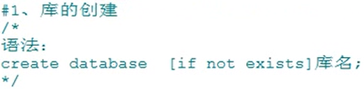    创建的库保存在下图所在位置


---


由于`RENAME DATABASE 原库名 TO 新库名`存在安全隐患，目前已取消这条语句

---


### 1.5.2 表的管理


---


`change column`：其中，publishdate 为原字段名，pubDate 为新字段名


`modify column`：其中，TIMESTAMP 为新的数据类型


`add column`：其中，annual 为新列的字段，DOUBLE 为新列的数据类型


`drop column`：其中，annual 为要删除的列


1. `rename to`：其中，book_author 为新的表名

2. 上述代码只有`change column`可以省略column，其他都不能省

3. `IF EXISTS`只在表的添加和删除中可用，不可用在表的修改中

4. 在添加列的语句(add column)最后面添加 【first，after 字段名】，表示将列添加到【首位，某个字段的后面】
   
   

5. 上述表修改语法中，最后面的约束为列级约束（约束详情请见1.7）
   
   + 添加表级约束，如下：
     
     `alter table 表名 add 表级约束;`
   
   + 添加/修改/删除列级约束，如下：(该语法是对字段进行重新定义[主键不会])
     
     `alter table 表名 modify column 字段名 字段类型 新约束;`
     
     主键的删除只能使用下方 删除表级约束 语法删除
   
   + 删除表级约束，如下：
     
     `alter table 表名 drop [primary key(删除主键)/index 约束名(删除唯一)/foreign key 约束名(删除外键)];`

---


其中，book_author 为要删除的表名

---


对 author 表进行复制，使得 copy 表与 author 表结构相同

其中，copy 为复制表，author 为被复制表


完全复制表利用了 子查询，由此可知，通过对 子查询 SELECT 操作，我们可以复制表中部分数据，或者复制表中部分字段等


上述代码仅仅复制了部分字段，没有复制数据，原因是 0 代表 false，表示 WHERE 永不成立

---


其中，表 departments 在 myemployees 数据库中，表 dept2 在 test 数据库中，要想在 test 数据库中操作 数据库 myemployees 中的表 departments，即跨越数据库操作表，可以用 `库名.表名` 的方式

## 1.6 DCL语言

DCL：Data Control Language


修改权限后需要对权限进行刷新（`flush privileges`）


---


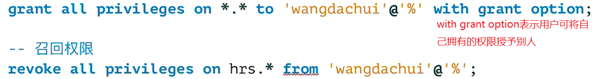

## 1.7 MySQL数据类型

### 1.7.1 整数

| 整数类型        | 字节  |
|:-----------:|:---:|
| Tinyint     | 1   |
| Smallint    | 2   |
| Mediumint   | 3   |
| Int、Integer | 4   |
| Bigint      | 8   |

Int 和 Integer 是一致的，这里面没有基本数据类型和引用数据类型之分

|  |
| ---------------------------------------------------------------------------- |
| 上图 tab_int 表中，t1 为有符号 INT，t2 为无符号 INT（t2 后面加了 unsigned 约束）                   |

向无符号数据类型字段中插入负数，插入结果为其最低临界值 0

如果插入的数值超出了整形的范围，那么插入的结果为与插入值相近的临界值

|                    |
| ---------------------------------------------------------------------------------------------- |
| 上图在数据类型后添加了长度，该长度不是值的范围，而是值显示的位宽。当值的位数大于等于7时，值正常显示。当值的位数小于7时，默认用 '' 在数值的前面进行填充。如果不设置位宽，会有默认的位宽 |
| 数据类型后面的约束 zerofill 表示当数值小于位宽时，用 0 填充，加了该约束，默认数据类型为无符号型。显示结果如下图                                 |
|                                                       |

### 1.7.2 小数

| 浮点数类型        | 字节  |
|:------------:|:---:|
| float(m, d)  | 4   |
| double(m, d) | 8   |

| 定点数类型                   | 字节    |
|:-----------------------:|:-----:|
| dec(m, d)、decimal(m, d) | m + 2 |

其最大取值范围与 double 相同，给定 decimal 的有效取值范围由 m 和 d 决定

定点型数据比浮点型数据的 精度 更高

m：整数部分长度 + 小数部分长度

d：小数部分的位数

eg：设置 float(5, 2)。操作如下表

| 输入      | 输出     |
|:-------:|:------:|
| 123.45  | 123.45 |
| 123.456 | 123.46 |
| 123.4   | 123.40 |
| 1523.4  | 999.99 |

由此可知，小数位数超出，进行四舍五入，小数位数不够，补0，总长度超出，显示与输入值相近的临界值

如果不写 m, d，float 和 double 会根据插入的值的精度来决定精度（就是没有精度），而 decimal/dec 默认精度为 (10, 0)

### 1.7.3 位类型

| 位类型    | 字节  | 范围            |
|:------:|:---:|:-------------:|
| Bit(m) | 1~8 | Bit(1)~Bit(8) |

### 1.7.4 字符型（文本型）

| 字符串类型      | 最多字符数 | 描述及存储需求           | 区别      | 空间耗费 | 效率  |
|:----------:|:-----:|:-----------------:|:-------:| ---- | --- |
| char(m)    | m     | m 为 0~255 之间的整数   | 固定长度的字符 | 比较耗费 | 高   |
| varchar(m) | m     | m 为 0~65535 之间的整数 | 可变长度的字符 | 比较节省 | 低   |

上述表格中的类型用来保存 较短的 文本型字符串

此处为字符数（一个汉字，一个字母，均为一个字符），而不是字节数

使用时应根据情况，eg：性别，用 char 更好

char 后面的括号可以省略，默认为1，varchar后面的括号不能省略

较长的文本字符串可以使用 text 数据类型

### 1.7.5 字符型（二进制型）

| 字符串类型     | 描述           |
|:---------:|:------------:|
| binary    | 用法与char类似    |
| varbinary | 用法与varchar类似 |

上述表格中的类型用来保存 较短的 二进制字符串

较长的二进制字符串可以使用 blob 数据类型，eg：存储图片等

### 1.7.6 枚举类型(Enum)


由上图可知，要插入 A，结果存入了 a，且没报错，原因是 MySQL 不区分大小写

### 1.7.7 集合类型(Set)


### 1.7.8 日期类型


|  |
| ---------------------------------------------------------------------------- |
| 输出结果：                                                                        |
|                                     |
| 更改当前MySQL时区：                                                                 |
|  |
| 更改时区后输出结果：                                                                   |
|                                     |

## 1.8 MySQL约束

### 1.8.1 六大常见约束


1、CHECK 约束用法：CHECK(筛选条件)

eg：`CHECK(sex = '男' OR sex = '女')`。也可将 = 改成 IN

2、DEFAULT 约束用法：DEFAULT 默认值

eg：`DEFAULT 18`。表示默认值为18

3、查看表中所有索引：`SHOW INDEX FROM 表名;`

4、主键、外键、唯一键 都会自动生成索引。索引可自己创建


1、constraint 后面添加的 pk, uq, ... 表示约束名

2、使用`SHOW INDEX FROM 表名;`查看所有索引时，Key_name 显示的就是约束名。MySQL主键不支持自定义约束名

3、表级约束中，`constraint 约束名`可省略不写，直接写后面的`约束类型(字段名)`即可，此时约束名默认等于字段名

4、使用表级约束时，其上的最后一个字段定义后面要加 “,”，如红框所示

5、外键定义时，REFERENCES 关键字后面为 `主表(从表外键连接的字段)`

6、使用了唯一键约束，可以存在多个 NULL 值，但不能存在相同的 非NULL 值

|     | 唯一性 | 为空  | 在表中数量 | 组合多个字段为一个键 |
|:---:|:---:|:---:|:-----:|:----------:|
| 主键  | √   | ×   | 至多一个  | √          |
| 唯一键 | √   | √   | 可有多个  | √          |

1、组合多个字段为一个键只能用表级约束：`PRIMARY KEY / UNIQUE (id, name, ...)`

外键的创建与使用（创建外键的表为从表）：

+ 要求从表的外键列的类型和主表的关联列的类型一致或兼容

+ 列名无所谓

+ 主表的关联列必须是主键或唯一键或外键

+ 插入数据时，先插入主表，再插入从表

+ 删除数据时，先删除从表，再删除主表（可使用级联删除/级联置空解决，如下所示）


上述方式一中，最后面的 on delete cascade 意思是允许级联删除(cascade的意思是级联)，当删除主表中的数据时，从表中外键与其关联的数据也会一并删除

上述方式二中，最后面的 on delete set null 意思是允许级联置空，当删除主表中的数据时，从表中外键与其关联的数据，其外键将会设置为null

### 1.8.2 标识列(自增长列)


1、在定义的字段后面添加 auto_increment 约束

2、标识列必须是一个key(主键、唯一键、外键)

3、标识列最多只有一个

4、标识列的数据类型必须是数字类型(int, double, float, ...)


之所以插入 NULL，是为了与 VALUES 前面的字段顺序和个数保持一致。如果将 NULL改为具体的值(eg：10)，那么自增长列将会从该值(10)开始进行自增长

## 1.9 TCL语言

TCL：Transaction Control Language


1、开启事务除了使用 `start transaction;` 以外，还可以使用 `begin;`。

2、事务中的sql语句只能是(select, insert, update, delete)，不能是 DDL 语言


1、虽然使用`begin/start transaction`开启一个事务后，自动提交保持禁止，但是使用命令`show variables like 'autocommit'`查看发现自动提交依旧保持开启。原因是该命令查看的是整个会话的自动提交，而使用`begin/start transaction`开启一个事务后，自动提交禁止仅仅作用在该事务内部

2、变量autocommit分会话系统变量与全局系统变量

| `show session variables like 'autocommit';`    |
| ---------------------------------------------- |
| 查看的是当前会话的autocommit变量                          |
| **`show global variables like 'autocommit';`** |
| 查看的是全局的autocommit变量                            |

上述代码中，session可省略，但是global不能省略

3、修改autocommit模式分会话修改和全局修改

| `set session autocommit=0;`          |
| ------------------------------------ |
| 修改当前会话autocommit变量，关闭当前会话修改即消失       |
| **`set global autocommit=0;`**       |
| 修改全局autocommit变量，关闭并重启mysql服务后，修改即消失 |

上述代码中，session可省略，但是global不能省略


在MySQL中，可以通过show variables like '%tx_isolation%'或select @@tx_isolation;语句来查看当前事务隔离级别

提示：在MySQL 8.0.3 中，tx_isolation 变量被 transaction_isolation 变量替换了。在 MySQL 8.0.3 版本中查询事务隔离级别，只要把上述查询语句中的 tx_isolation 变量替换成 transaction_isolation 变量即可


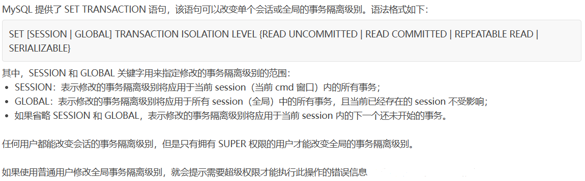

如果修改事务的隔离级别使用的是global，那么只需将mysql服务关闭后重启即可恢复原样，目前已存在的session不受影响，包括它自己所在的session


## 1.10 触发器

### 1.10.1 触发器概述


### 1.10.2 创建触发器

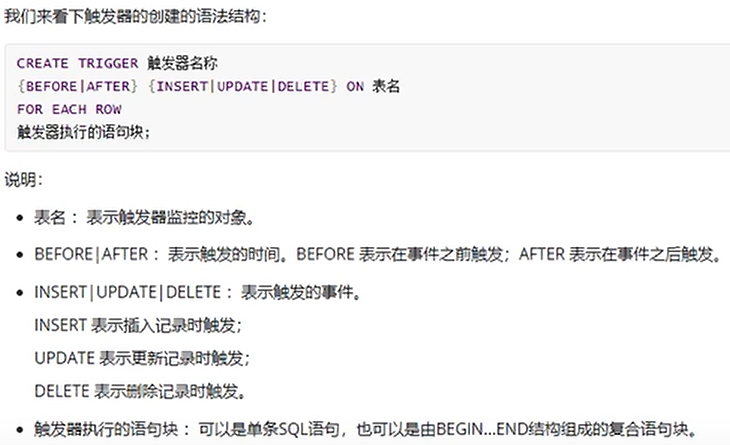

### 1.10.3 查看触发器


### 1.10.4 删除触发器


### 1.10.5 触发器优缺点


每操作一条数据，就会调用一次触发器，如果数据量很大，那么触发器对性能的影响将会是巨大的

综上所述，尽量少使用触发器，不建议使用

## 1.11 视图


视图的优点：


上图中的语句表示 如果视图不存在，就创建视图，如果视图存在，就替换(修改)视图

该语句既可用来创建视图，也可用来修改视图

创建视图不可以用 IF NOT EXISTS

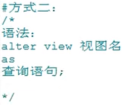


上图中的语句可同时删除多个视图


查看的是视图的结构


1、更新视图时，也会更新其底层的表

2、如果视图中的字段不包含其底层表中的所有非空字段，那么向视图中插入数据一定失败。这是因为向视图中插入数据，视图中不包含其底层表的字段全部设置为null进行存储


因此视图一般很少更新

## 1.12 变量

在MySQL中，@ 是用户变量，@@ 是系统变量

### 1.12.1 系统变量

系统变量按照作用域划分可分为两种：全局变量，会话变量

全局变量作用域：

服务器每次启动将为所有的全局变量赋初值，针对于所有的会话(连接)都有效，但不能跨重启

会话变量作用域：

仅仅针对当前会话(连接)有效


### 1.12.2 自定义变量

自定义变量按照作用域划分可分为两种：用户变量，局部变量

+ 用户变量（声明时必须初始化）
  
  
  
  
  
  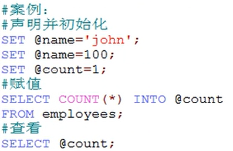
  
  一个用户变量可以为其赋不同数据类型的值，赋什么类型的值，它就是什么类型，它的数据类型随其值的数据类型的变化而变化

+ 局部变量（声明时可不初始化）
  
  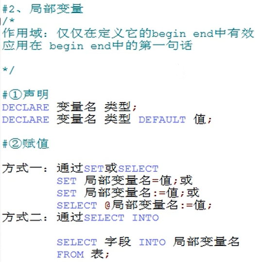
  
  

+ 用户变量与局部变量使用
  
  
  
  上图中局部变量没有放在 begin end，所以无法执行，但是语法没错

## 1.13 存储过程和函数

### 1.13.1 存储过程


| eg：                                                                                 |
| ----------------------------------------------------------------------------------- |
|         |
|         |
|         |
|                                            |
|         |
| 使用 out 模式参数时，调用该存储过程， out 模式参数可以用用户变量接收，只需在参数列表中直接写即可(自动声明并初始化)，无需再次声明并初始化 set @la; |
| delimiter 用法是设置定界符(分隔符)，它的作用范围为整个会话。如果要修改定界符，只需再次执行 delimiter 命令即可                  |
| 存储过程一定要使用定界符，因为存储过程中的SQL语句要用 ';'，不用定界符无法执行                                          |
| 调用时可以传递常量，也可传递变量                                                                    |
| 存储过程中如果有多个参数，用逗号隔开                                                                  |
| 存储过程中如果存在参数名和表中字段名相同的名字，采用就近原则(就是参数名)                                               |
| 如果存储过程发生了更改，一定要再编译一次才会生效                                                            |
| 如果参数列表中的参数不写参数模式，默认为 in                                                             |

由于MySQL使用的是 utf-8 编码，而 Windows 命令行使用的是 GBK 编码，一旦使用汉字等符号，会出现编码错误，此时可以使用 set names 'gbk';


存储过程一次只能删除一个。其与视图不同，视图可一次删除多个


`show create procedure 存储过程名;`

注意：不能使用 `DESC 存储过程名;` ，该命令只能查看视图和表的结构信息

### 1.13.2 函数


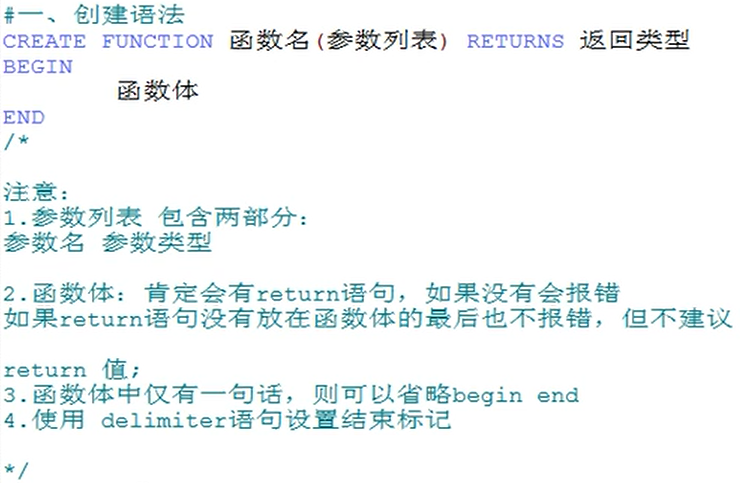

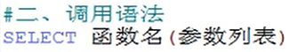


## 1.14 流程控制结构

### 1.14.1 分支结构

> CASE作用范围
> 
> > 作为表达式，嵌套在其他语句中使用，可以放在任何地方(THEN后为值)
> 
> > 作为独立的语句使用，只能放在 begin end 中(THEN后为语句)
> 
> CASE语法介绍
> 
> > 如果 WHEN 成立，则执行对应的 THEN 后面的语句，并且结束 CASE
> > 
> > 如果都不满足，则执行 ELSE 中的语句
> 
> > ELSE 可以省略，如果 ELSE 省略了，并且所有 WHEN 条件都不满足，则返回 NULL
> 
> CASE语法结构
> 
> > 查看 1.3.12 中的流程控制函数


---


if 结构只能放在 begin end 中


### 1.14.2 循环结构

循环结构只能放在 begin end 中


由于 loop 没有循环条件，所以如果循环体中没有循环控制 leave，那么其将是一个死循环


如果在循环结构中使用循环控制，那么循环结构一定要加标签


### 1.14.3 游标


# 二、MySQL高级

## 2.1 MySQL架构

### 2.1.1 简介


高级MySQL需要掌握的内容：

+ mysql内核

+ sql优化攻城狮

+ mysql服务器优化

+ 各种参数常量设定

+ 查询语句优化

+ 主从复制

+ 软硬件升级

+ 容灾备份

+ sql编程

### 2.1.2 安装(Linux版)

+ CentOS：


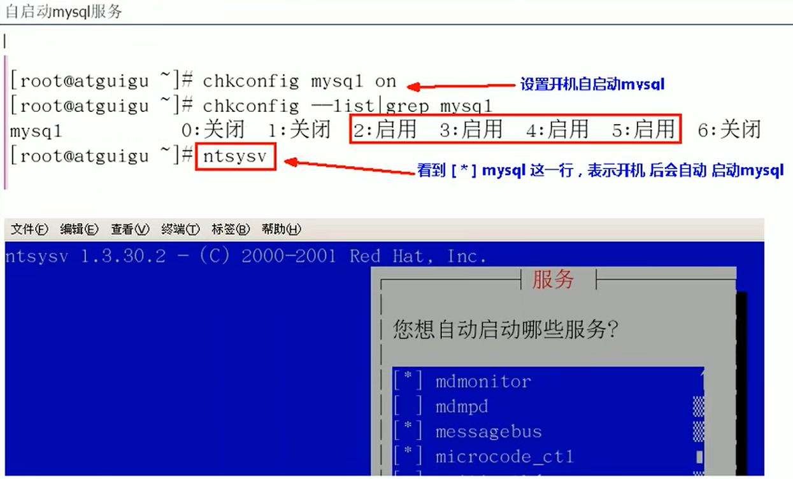


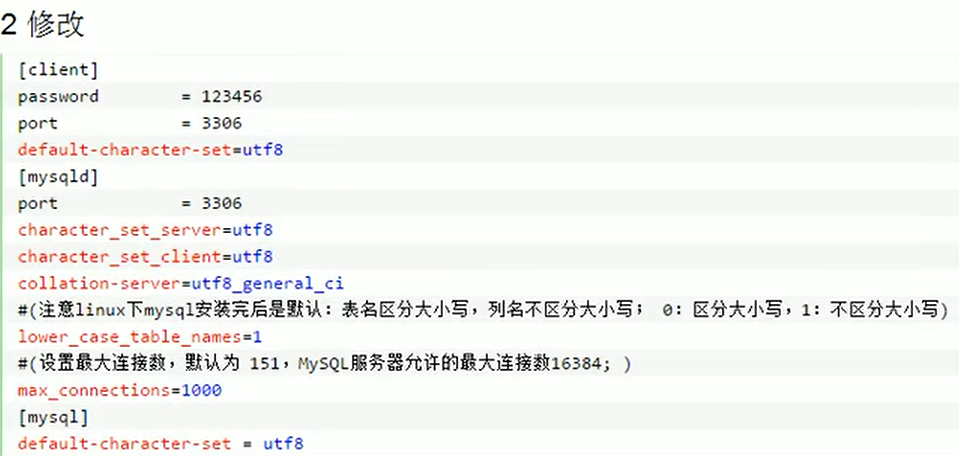

+ Ubuntu


### 2.1.3 配置文件

> my.ini 是Windows版本的MySQL配置文件，my.cnf 是Linux版本的MySQL配置文件

> 二进制日志 log-bin="DESKTOP-4ARD9F3-bin"，用于主从复制

> 错误日志 log-error="DESKTOP-4ARD9F3.err"，默认是关闭的，记录严重的警告和错误信息，每次启动和关闭的详细信息等

> 查询日志 log，默认关闭，记录查询的sql语句，如果开启会减低mysql的整体性能，因为记录日志也是需要消耗系统资源的
> 
> 


### 2.1.4 逻辑架构


### 2.1.5 存储引擎


InnoDB适合操作数据库，MyISAM适合读取数据库


## 2.2 索引优化分析

### 2.2.1 索引背景


+ 单值索引：为一张表的一个字段创建的索引
  
  

+ 唯一索引：索引列的值必须唯一，但是允许有空值

+ 复合索引：为一张表的多个字段创建的索引
  
  

+ 索引名：idx为index缩写，表示索引，user为表名，name为字段名

+ 复合索引优于单值索引

### 2.2.2 SQL执行顺序

+ 手写SQL
  
  

+ 机读SQL
  
  

### 2.2.3 索引简介


索引用于排序和快速查找，所以索引会影响到 WHERE 后面的筛选查找以及 ORDER BY 后面的排序

索引的两大功能：查找、排序


当创建或设置主键的时候，mysql会自动添加一个与主键对应的唯一索引，不需要再做额外的添加。数据库管理系统对于主键会自动生成唯一索引，所以主键是一个特殊的索引


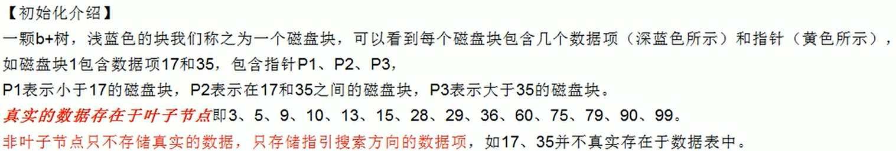


需要创建索引的情况：


不要建索引的情况：


### 2.2.4 InnoDB数据存储


InnoDB存储引擎使用的是数据页存储数据，而MyISAM存储引擎并不是采用数据页来存储数据（搜索数据页，全是介绍InnoDB的，MyIASAM完全没有），所以关于数据页的概念（页合并，页分裂等）并不能用来介绍和解释MyISAM

为了避免页分裂，我们设置自增字段为主键，没有自增字段就额外创建一个(没其他含义，就是为了建立聚簇索引)，然后其他字段根据需要创建二级索引，通过二级索引找到对应主键值然后到聚簇索引(主键索引)中查找数据

### 2.2.5 性能分析


+ 表的读取顺序（id）
  
  
  
  由上图可知，id相同，表t1，t2，t3加载顺序依次为t1，t3，t2
  
  
  
  由上图可知，id不同，数值越大的越先加载，表t1，t2，t3加载顺序依次为t3，t1，t2
  
  
  
  上图中，table一列中的 derived2 的意思是 该表是由 id=2 处执行所衍生的，derived2中的2对应的就是id中的2

+ 数据读取操作的操作类型（select_type）
  
  
  
  
  
  

+ 访问类型排列（type）
  
  
  
  
  
  
  
  
  
  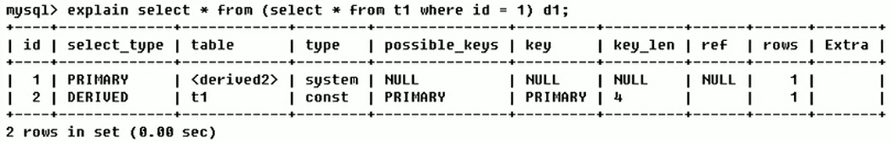
  
  
  
  
  
  
  
  
  
  

+ 初步判断可能使用的索引（possible_keys）
  
  

+ 执行时候实际使用的索引（key）
  
  
  
  

+ 索引字段的最大可能长度[字节数]（key_len）
  
  
  
  

+ 记录索引哪一列被使用了（ref）
  
  
  
  
  
  上图中 shared.t2.col1 表示 共享数据库中的t2表中的col1列(字段)

+ 找到所需记录需要读取的行数（rows）
  
  
  
  

+ 额外信息（extra）
  
  
  
  
  
  
  
  对比上图两条分析语句可知，第一条 order by col3，第二条 order by col2, col3，创建的索引为复合索引(col1, col2, col3)
  
  根据复合索引的最左前缀原则(详情请见2.2.4 InnoDB数据存储)，该索引树是基于col1建立的，在col1的基础上对col2进行排序，col2相同的话再对col3进行排序，所以如果要使用该复合索引，使用col2时一定要先使用col1，使用col3时一定要先使用col1，col2（有例外，见下述）
  
  第一条语句使用col3时只是用了col1，没有使用col2，所以在where子句中使用了索引，但是在order by中没有使用到索引
  
  第二条语句使用col2前已经使用了col1，使用col3前已经使用了col2，所以where和order by都使用了索引
  
  注意：如果将order by col2, col3改成order by col3, col2的话，那么order by没有使用索引(order by不像where一样，条件顺序一般可以交换[MySQL优化器会以性能最高的顺序来执行]，order by中顺序是不能交换的，这也导致使用col2前一定要使用col3)
  
  
  
  
  
  
  
  观察第一幅图第二、四条语句会发现，明明没有遵循最左前缀原则，为什么还是使用了联合索引？
  
  原因是我们查询的列表(select c1)和使用的筛选条件(c2 ...)都是在联合索引中，即mysql只需要对联合索引遍历就可以得到结果，所以此时mysql为了提升性能会进行索引扫描而不是全表扫描，仔细观察type类型会发现为index。如果查询的列表或筛选的条件中有字段不在索引中(观察第二、三幅图)，再加上其不符合最左前缀原则，那么mysql只能进行全表扫描来得到结果
  
  
  
  
  
  第一条语句在使用col2前明明使用了col1，为什么group by还是没有使用索引？
  
  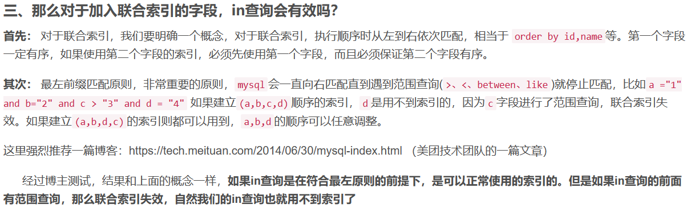
  
  所以说，在第一条语句中，where使用范围查询用到了索引，但是它后面的却无法使用索引
  
  
  
  
  
  
  
  
  
  
  
  
  
  
  
  using index ：使用覆盖索引的时候就会出现
  
  using where：在查找使用索引的情况下，需要回表去查询所需的数据
  
  using index condition：查找使用了索引，但是需要回表查询数据
  
  using index & using where：查找使用了索引，但是需要的数据都在索引列中能找到，所以不需要回表查询数据

### 2.2.6 索引优化

+ 索引单表优化案例
  
  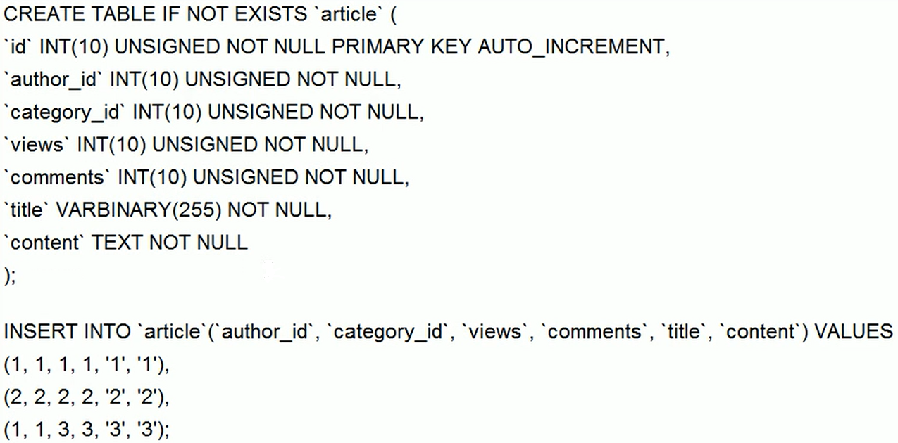
  
  
  
  
  
  
  
  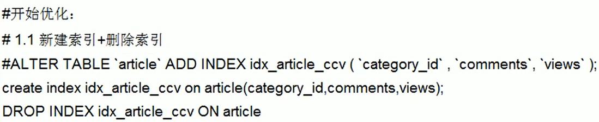
  
  
  
  
  
  
  
  
  
  
  
  建联合索引时如果某个字段进行了范围查询，那么需要将其从联合索引中去除

+ 索引两表优化案例
  
  
  
  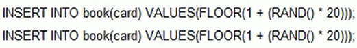
  
  
  
  
  
  建立左连接时，右边是关键，应在右边建立索引，右连接相反

+ 索引三表优化案例
  
  
  
  
  
  
  
  会发现Extra中有Join buffer(连接缓存)，因为连接的表多了以后，MySQL会使用缓存来提高性能

+ 总结
  
  

---

+ 建表
  
  
  
  在MySQL数据库中，字段或列的注释是用属性comment来添加。
  
  查看表注释的方法：`show create table 表名`
  
  查看字段注释的方法：`show full columns from 表名`

+ 避免索引失效且优化索引性能的10种方法
  
  

+ 方法1
  
  
  
  查询的精度越高，索引字段的最大长度就越大，性能也就越低，但这是没办法的

+ 方法2
  
  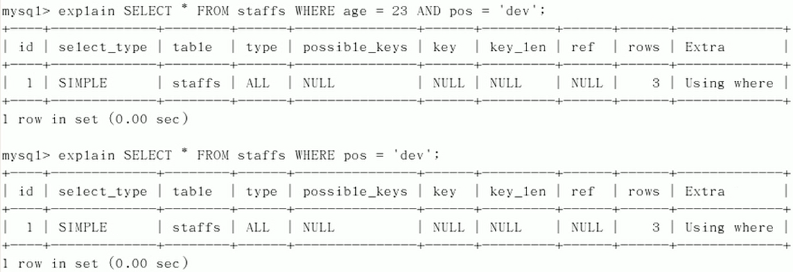
  
  查询要从索引的最左前列开始，并且不跳过索引中的列(查询某一列，那么其联合索引前面的列也必须使用到)

+ 方法3
  
  
  
  LEFT(str, length) 函数是一个字符串函数，它返回具有指定长度的字符串的左边部分

+ 方法4
  
  
  
  查询要从索引的最左前列开始，并且不跳过索引中的列(查询某一列，那么其联合索引前面的列也必须使用到且不能是范围查询[in, between, >, <])

+ 方法5
  
  
  
  尽量是用什么字段，就检索什么字段，尽量不要使用 * 检索全部字段

+ 方法6
  
  
  
  视具体情况而定，该使用 <>, != 时还是得使用

+ 方法7
  
  
  
  创建字段时，如果可以的话，为其设置默认值，尽量不要使其为空

+ 方法8
  
  
  
  解决方法举例如下（使用覆盖索引）
  
  
  
  
  
  
  
  
  
  
  
  此时访问类型为index，虽用上了索引，但只是遍历索引，而不是使用索引进行检索，但这也比all强，因为all是全表扫描，index是索引扫描，在数据页中，索引节点存储的数量比数据行多(数据行占用存储更多)，因此相同情况下索引节点读入内存中的数量也比数据行多
  
  
  
  上图索引为(c1, c2, c3)
  
  注意：like是模糊查询，不是范围查询。所以上图中c1, c2, c3都使用到了索引

+ 方法9
  
  
  
  不要让其进行隐式类型转换

+ 方法10
  
  

+ 总结
  
  在MySQL8版本中，对一些性能进行了改进，比如在使用 !=和<>和or 时依旧会使用到索引(index)，而不是(all)
  
  索引优化：最左前缀 -> 列表不做操作(函数等) -> 使用覆盖索引 -> 不使用(!=, <>) -> 不使用(is null, is not null) -> 使用like时通配符在前，使用覆盖索引 -> 不要出现隐式转换 -> 不要用(or)

+ 面试题讲解
  
  
  
  
  
  
  
  四个字段全部使用到了联合索引
  
  问：仔细观察会发现，明明没有遵循最左前缀原则，为什么还是使用了联合索引？
  
  答：原因是在服务层MySQL优化器会对其进行优化
  
  
  
  第一条语句只有c1, c2, c3使用到了联合索引。第二条语句全部使用到了联合索引
  
  原因是在服务层MySQL优化器会对其进行优化
  
  只要能够进行交换的，MySQL优化器会选择性能最高的顺序来执行
  
  
  
  问：语句中c1, c2, c3都使用到了联合索引，c4没有，为什么？
  
  答：因为c1, c2是用来查找字段，而c3是用来排序字段，所以c4用不到索引
  
  注：order by中的c3使用到了索引，只是性能分析时没有显示出来，因为key_len表示的是索引字段的最大可能长度，它与 possible_keys一样，不准确，仅供参考
  
  
  
  问：为什么此时order by使用了索引(没有出现“文件排序”)？
  
  答：因为在where中已经使用了c1, c2字段，所以order by中顺序c3, c2也可以，此时排序c3时，由于where中使用c1, c2，所以可用索引，排序c2时，由where中使用了c1，所以可用索引
  
  注意：
  
  + 使用order by没用索引，会出现 using filesort
  
  + 使用group by没用索引，会出现 using temporary, using filesort。因为group by虽是分组，但分组前必排序

+ 一般性建议
  
  

## 2.3 查询截取分析

SQL语句分析优化过程：


### 2.3.1 查询优化

+ 永远小表驱动大表（类似嵌套循环Nested Loop）
  
  
  
  
  
  
  
  总结上面的描述，个人认为其主要的原因在于对索引的使用。任何情况下，只要是大表的索引被使用，就可以使效率提高

+ ORDER BY 关键字优化
  
  
  
  FileSort方式排序
  
  
  
  
  
  问1：为什么查询 select * 还是会使用联合索引？
  
  答1：因为该索引包含了该表的所有字段
  
  问2：为什么最后一条语句使用了“文件排序”？
  
  答2：在age上使用的是升序排序，在age排好序的基础上再在birth上使用降序排序，这会导致birth无法使用到索引，因为索引查找时不可能又升序又降序，所以要么同时升序，要么同时降序
  
  小诀窍：你就记得索引查询只会执行一遍，所以当所有条件能够同时在索引上查找一遍就成功时，就可以同时使用索引，否则前面的条件使用了索引，后面的就不能使用。就像本题，升序降序不能同时执行，所以升序执行了索引后，降序就不能执行索引
  
  
  
  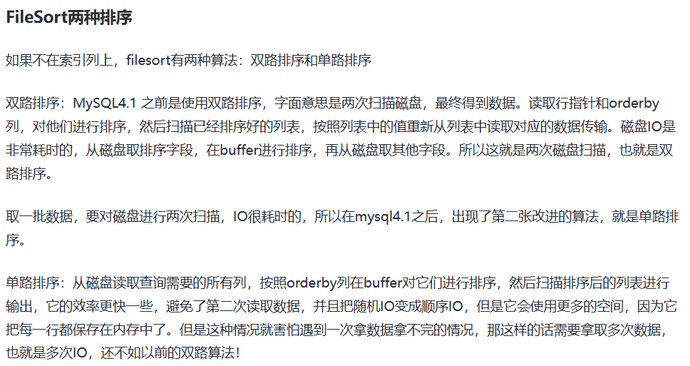
  
  
  
  
  
  
  
  

+ GROUP BY 关键字优化
  
  优化与ORDER BY 几乎相同
  
  

### 2.3.2 慢查询日志


修改了long_query_time后，如果修改的范围是global，需要重新连接或新开一个会话才会生效，如果修改的范围是配置文件，需要重启MySQL服务器才会生效


### 2.3.3 批量数据脚本

+ 建表
  
  
  
  

+ 设置参数
  
  

+ 创建函数（随机产生字符串）
  
  

+ 创建函数（随机产生部门编号）
  
  

+ 创建存储过程（emp表插入数据）
  
  

+ 创建存储过程（dept表插入数据）
  
  

### 2.3.4 Show Profile


### 2.3.5 全局查询日志


全局查询日志用于保存所有的sql执行记录

全局查询日志功能与show profile类似，但是show profile只作用于当前会话，而全局查询日志作用于全局

## 2.4 MySQL锁机制

### 2.4.1 概述


### 2.4.2 表锁(偏读)


+ 建表
  
  

+ 加锁
  
  
  
  
  
  
  
  
  
  
  
  

+ 加读锁
  
  
  
  session_1会话对表mylock加读锁：
  
  + 这张表每个会话都可以读
  
  + session_1会话更新该表会报错，其他会话更新该表会阻塞
  
  + session_1除非将当前锁定的所有表进行解锁，否则其不能查询和操作其他任何表，因为一旦你要操作其他表，那么这张锁定的表就不再继续操作，此时应当赶紧解锁，供其他会话操作该表，从而避免出现锁冲突
  
  + session_1会话一解锁该表，那些被阻塞的会话立马抢着执行操作该表

+ 加写锁
  
  
  
  session_1会话对表mylock加写锁：
  
  + 这张表只有session_1会话可以查询更新等，其他表要查询和更新该表都会阻塞
  
  + session_1除非将当前锁定的所有表进行解锁，否则其不能查询和操作其他任何表
  
  + session_1会话一解锁该表，那些被阻塞的会话立马抢着执行操作该表

+ 总结
  
  
  
  
  
  
  
  

### 2.4.3 行锁(偏写)


+ 建表
  
  

+ 问题
  
  

+ 行锁定演示
  
  

+ 无索引行锁变表锁
  
  
  
  

+ 间隙锁
  
  由上图可知，数据表中a=2的行并不存在
  
  
  
  
  
  

+ 锁定某一行
  
  

+ 行锁分析
  
  
  
  
  
  
  
  

+ 总结
  
  

### 2.4.4 页锁


## 2.5 主从复制


---

一主一从常见配置：

1. mysql版本一致且后台以服务运行（版本不一致可能会出问题）

2. 主从都配置在[mysqld]节点下，都是小写（大写也可）

3. 主从机修改（my.ini / my.cnf）配置文件

4. 因修改过配置文件，所以主从机都需重启后台mysql服务

5. 主从机都关闭防火墙
   
   + Windows手动关闭
   
   + Linux关闭防火墙命令：`service iptables stop`

6. 在主机上建立账户并授权slave

7. 在从机上配置需要复制的主机

8. 主机新建库、新建表、insert记录、从机复制

9. 停止从机服务复制功能

---

查看Ubuntu中MySQL安装目录


---

测试主从机是否处在同一网段（主：Ubuntu，从：Windows）

1、分别查看Windows和Ubuntu的本机的IP地址


2、使用ping命令测试二者是否处于同一网段


---

主机修改配置文件（my.ini / my.cnf）


从机修改配置文件（my.ini / my.cnf）


注意：主从机修改配置文件时，server-id不能相同

---

Ubuntu防火墙设置


Windows除了关闭防火墙以外，还可以设置3306端口允许通过防火墙


---

在主机上建立账户并授权slave


查看master的状态(记录File和Position的值，Position是File文件中的位置，不是端口)


---

在从机上配置需要复制的主机

```sql
-- MySQL版本低于8.0.23
CHANGE MASTER TO 
MASTER_HOST='主机IP',
MASTER_PORT=主机端口,
MASTER_USER='主机授权账户名',
MASTER_PASSWORD='主机授权账户的密码',
MASTER_LOG_FILE='上述File名字',
MASTER_LOG_POS=上述Position值;

-- MySQL版本自8.0.23以后
CHANGE REPLICATION SOURCE TO 
SOURCE_HOST='主机IP',
SOURCE_PORT=主机端口,
SOURCE_USER='主机授权账户名',
SOURCE_PASSWORD'主机授权账户的密码',
SOURCE_LOG_FILE='上述File名字',
SOURCE_LOG_POS=上述Position值;
```


启动从服务器复制功能

(低于8.0.22版本：`start slave`，自8.0.22版本后：`start replica`)


或


查看配置是否成功


如果显示如下结果


说明主从连接失败，要么是防火墙没有打开，要么是3306端口出现了问题。看下方


注意：如果主机mysql服务重启了或者对MySQL进行了一些操作(数据库的增删改查等)，那么其`show master status`中的file和position的值都会改变，此时从机需要重新配置需要复制的主机

---

主机新建库、新建表、insert记录，从机进行复制（不管是哪个用户在主机上操作，从机都会复制其操作的数据库等，因为我们在授权时是授权给rewopteg用户复制所有库表的权限）

主机操作：


从机显示：


---

停止/删除 slave 服务


---


