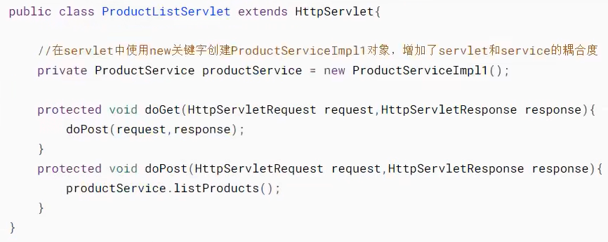
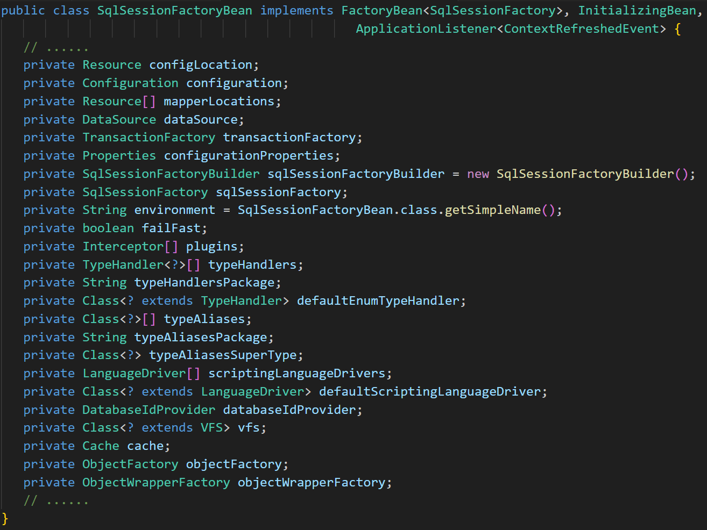
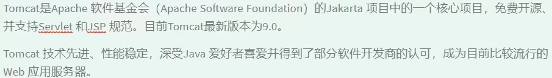
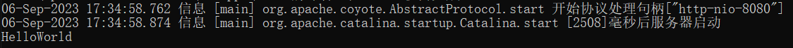
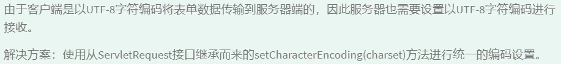
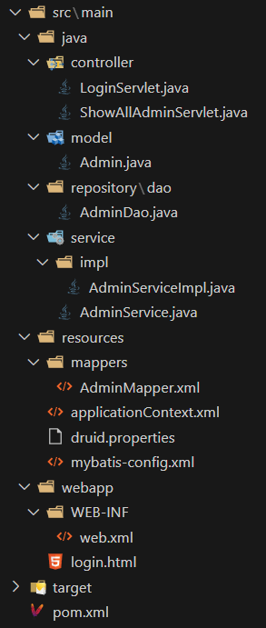
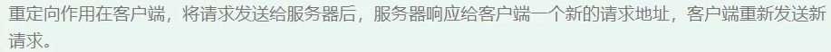
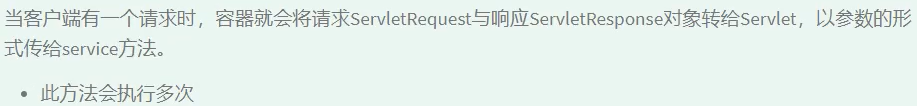
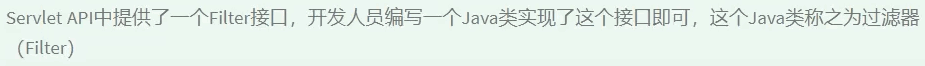

# 一、Spring

## 1.1 Spring介绍

### 1.1.1 面向接口编程

   




### 1.1.2 Spring简介

Spring是一个轻量级的控制反转和面向切面的容器框架，主要用来解决企业项目开发的复杂度问题--解耦

Spring全家桶

+ Spring Framework（Spring核心，IoC，AOP）

+ Spring Boot（整合项目的工具框架）

+ Spring Cloud（微服务架构）

+ Spring Data（数据访问的客户端）

+ Spring Security（安全框架，用户认证与授权）

**轻量级**

+ 体积小

+ 对代码没有侵入性 (就是在自己的代码中无需编写任何Spring代码，不像Mybatis，在自己的代码中要调用MyBatis的类)

**控制反转(IoC--Inverse of Control)**

把创建对象的工作交由Spring完成，Spring在创建对象的时候同时可以完成对象属性赋值(DI)

DI：依赖注入

所以说，以后在开发项目时，new关键字基本不会再使用

**面向切面(AOP--Aspect Oriented Programming)**

可以在不改变原有业务逻辑的情况下实现对业务的增强

**容器**

实例的容器，管理创建的对象

**使用**

Spring有两种使用方式：基于XML文件、基于注解。

如果是在自己编写的类中，二者均可使用。但如果使用的是第三方jar包中的类，那么此时只能使用基于xml文件的方式使用Spring，因为我们无法在已编译好的类中添加注解。

### 1.1.3 Spring体系结构


**Core Container**


**Data Access/Integeration**


**Web**


**AOP**


**Aspects**


**Instrumentation**


**Messaging**


**Test**


## 1.2 IoC

### 1.2.1 基于XML

**框架部署**

1. 创建Maven工程
   
   + Java
   
   + Web

2. 添加SpringIoC依赖
   
   + core
   
   + beans
   
   + context
   
   + AOP
   
   + expression
   
   ```xml
   <!-- https://mvnrepository.com/artifact/org.springframework/spring-core -->
   <dependency>
       <groupId>org.springframework</groupId>
       <artifactId>spring-core</artifactId>
       <version>6.0.8</version>
   </dependency>
   
   <!-- https://mvnrepository.com/artifact/org.springframework/spring-beans -->
   <dependency>
       <groupId>org.springframework</groupId>
       <artifactId>spring-beans</artifactId>
       <version>6.0.8</version>
   </dependency>
   
   <!-- https://mvnrepository.com/artifact/org.springframework/spring-context -->
   <dependency>
       <groupId>org.springframework</groupId>
       <artifactId>spring-context</artifactId>
       <version>6.0.8</version>
   </dependency>
   
   <!-- https://mvnrepository.com/artifact/org.springframework/spring-expression -->
   <dependency>
       <groupId>org.springframework</groupId>
       <artifactId>spring-expression</artifactId>
       <version>6.0.8</version>
   </dependency>
   
   <!-- https://mvnrepository.com/artifact/org.springframework/spring-aop -->
   <dependency>
       <groupId>org.springframework</groupId>
       <artifactId>spring-aop</artifactId>
       <version>6.0.8</version>
   </dependency>
   ```

3. 创建Spring配置文件（“告诉”Spring容器创建什么对象，给对象属性赋什么值）
   
   在resources目录下创建名为`applicationContext.xml`的文件（文件名自定义）
   
   ```xml
   <?xml version="1.0" encoding="UTF-8" ?>
   <beans xmlns="http://www.springframework.org/schema/beans"
          xmlns:xsi="http://www.w3.org/2001/XMLSchema-instance"
          xmlns:context="http://www.springframework.org/schema/context"
          xmlns:aop="http://www.springframework.org/schema/aop"
          xmlns:mvc="http://www.springframework.org/schema/mvc"
          xsi:schemaLocation="http://www.springframework.org/schema/beans
          http://www.springframework.org/schema/beans/spring-beans.xsd
          http://www.springframework.org/schema/context
          http://www.springframework.org/schema/context/spring-context.xsd
          http://www.springframework.org/schema/aop
          http://www.springframework.org/schema/aop/spring-aop.xsd
          http://www.springframework.org/schema/mvc
          http://www.springframework.org/schema/mvc/spring-mvc.xsd">
   
       <!--对于一个xml文件，如果作为框架的配置文件，需要遵守框架的配置规则-->
       <!--通常一个框架为了让开发者能够正确配置，都会提供xml的规范文件（dtd/xsd）-->
   
       <!--
       dtd/xsd区别：
       1、导入方式不同，xsd是在根标签中导入，dtd是在根标签之前导入(查看MyBatis文件配置导入)
       2、一个文档可以导入多个xsd，但只能导入一个dtd。Spring是多组件的，所以使用xsd，使用哪个组件，导入那个组件的xsd
       -->
   
   </beans>
   ```

---

**框架使用**

使用Spring Ioc组件创建并管理对象

第一步：创建实体类

```java
public class Student {
    private String stuNum;
    private String stuName;
    private String stuGender;
    private int stuAge;
    private Date enrollment;
    // ......
}
```

第二步：配置文件中添加bean标签

```xml
<?xml version="1.0" encoding="UTF-8" ?>
<beans xmlns="http://www.springframework.org/schema/beans"
       xmlns:xsi="http://www.w3.org/2001/XMLSchema-instance"
       xsi:schemaLocation="http://www.springframework.org/schema/beans
       http://www.springframework.org/schema/beans/spring-beans.xsd">

    <!--通过bean标签将实体类配置给Spring容器进行管理-->
    <!--class属性表示管理的实体类-->
    <!--id属性表示实体类的唯一标识，用来区分实体类，值自定义，一般用实体类的类名(首字母小写)-->
    <!--完成了IoC-->
    <bean id="student" class="bean.Student">
        <!--property标签用来配置对象属性值-->
        <!--完成了DI-->
        <property name="stuNum" value="2024"/>
        <property name="stuName" value="nana"/>
        <property name="stuGender" value="女"/>
        <property name="stuAge" value="28"/>
    </bean>
</beans>
```

第三步：通过Spring容器创建对象

```java
public class Main {
    public static void main(String[] args) {
        // 创建一个学生对象

        // 方式一：
        Student student1 = new Student();
        // 给学生对象赋值
        student1.setStuNum("2023");
        student1.setStuName("lala");
        student1.setStuGender("男");
        student1.setStuAge(26);
        student1.setEnrollment(new Date());

        System.out.println(student1);

        // 方式二：使用Spring容器
        // 初始化Spring容器，加载Spring配置文件
        ClassPathXmlApplicationContext context = new ClassPathXmlApplicationContext("applicationContext.xml");
        // 通过Spring容器获取Student对象，使用bean标签的id值作为参数
        Student student2 = (Student) context.getBean("student");

        System.out.println(student2);
    }
}
```

第四步：运行查看结果


总结：

使用Spring的IoC与DI，当我们需要修改创建的对象或者是修改对象的属性时，我们只需修改配置文件即可，而无需修改代码

---

**IoC与DI**

IoC (控制反转)：依赖Spring对象工厂完成对象的创建

DI (依赖注入)：在Spring完成对象创建的同时，依赖Spring容器完成对象属性的赋值

配置文件的bean标签除了可以写自定义的类外，还可以写java自带的类

```xml
<bean id="date" class="java.util.Date"/>
```


查看上述 `框架使用` 这一节我们会发现Student对象的enrollment属性未赋值，原因是Date日期是一个对象，我们需要先在配置文件中创建一个bean标签用来创建Date对象

```xml
<?xml version="1.0" encoding="UTF-8" ?>
<beans xmlns="http://www.springframework.org/schema/beans"
       xmlns:xsi="http://www.w3.org/2001/XMLSchema-instance"
       xsi:schemaLocation="http://www.springframework.org/schema/beans
       http://www.springframework.org/schema/beans/spring-beans.xsd">

    <!--通过bean标签将实体类配置给Spring进行管理-->
    <!--class属性表示管理的实体类-->
    <!--id属性表示实体类的唯一标识，用来区分实体类，值自定义，一般用实体类的类名(首字母小写)-->
    <bean id="student" class="bean.Student">
        <property name="stuNum" value="2024"/>
        <property name="stuName" value="nana"/>
        <property name="stuGender" value="女"/>
        <property name="stuAge" value="28"/>
        <!--从Spring创建Date对象并赋值给enrollment属性-->
        <property name="enrollment" ref="date"/>
    </bean>

    <bean id="date" class="java.util.Date"/>
</beans>
```

---

**自动装配**

bean标签中使用autowire属性自动为对象属性赋值(注意，Java自带的Date类不行)

```java
public class Student {
    private String stuNum;
    private String stuName;
    private String stuGender;
    private int stuAge;
    private Date enrollment;
    private Clazz clazz;
    // ......
}

public class Clazz {
}
```

```xml
<?xml version="1.0" encoding="UTF-8" ?>
<beans xmlns="http://www.springframework.org/schema/beans"
       xmlns:xsi="http://www.w3.org/2001/XMLSchema-instance"
       xsi:schemaLocation="http://www.springframework.org/schema/beans
       http://www.springframework.org/schema/beans/spring-beans.xsd">

    <!--通过bean标签将实体类配置给Spring进行管理-->
    <!--class属性表示管理的实体类-->
    <!--id属性表示实体类的唯一标识，用来区分实体类，值自定义，一般用实体类的类名(首字母小写)-->
    <!--autowire属性用法如下图所示-->
    <bean id="student" class="bean.Student" autowire="byType">
    </bean>

    <bean id="date" class="java.util.Date"/>

    <bean id="clazz" class="bean.Clazz"/>

</beans>
```


---

**DI三种方式**

第一种：通过setXXX()方法注入

在bean标签中通过配置property标签给属性赋值，实际上就是通过反射调用setXXX()方法完成属性的注入

property标签中可添加的子标签：


1. 简单类型(int, float, double, boolean等)和字符串类型(String)可以直接使用下述property标签中的value属性来赋值
   
   ```xml
   <bean id="student" class="bean.Student" autowire="byType">
       <property name="flag" value="true"/>
   </bean>
   ```

2. 日期类型的对象赋值方式有两种：
   
   方式一：
   
   在property标签中通过ref属性引用Spring容器中的一个对象
   
   ```xml
   <bean id="student" class="bean.Student" autowire="byType">
       <!--从Spring创建Date对象并赋值给enrollment属性-->
       <property name="enrollment" ref="date"/>
   </bean>
   
   <bean id="date" class="java.util.Date">
       <property name="time" value="135484564646"/>
   </bean>
   ```
   
   方式二：
   
   在property标签中创建一个bean子标签来为其指定对象
   
   ```xml
   <bean id="student" class="bean.Student" autowire="byType">
       <!--从Spring创建Date对象并赋值给enrollment属性-->
       <property name="enrollment">
           <bean class="java.util.Date">
               <property name="time" value="56845631315"/>
           </bean>
       </property>
   </bean>
   ```

3. 自定义类型赋值方式与上述日期类型一致

4. 集合类型赋值
   
   List
   
   ```xml
   <!--字符串类型-->
   <bean id="student" class="bean.Student" autowire="byType">
       <property name="lists">
           <list value-type="java.lang.String">
               <value type="java.lang.String">lala</value>
               <value type="java.lang.String">nana</value>
           </list>
       </property>
   </bean>
   
   <!--其他对象类型-->
   <!--方式一-->
   <bean id="student" class="bean.Student" autowire="byType">
       <property name="lists">
           <list value-type="bean.Clazz">
               <bean class="bean.Clazz">
                   <property name="classId" value="123"/>
                   <property name="className" value="abc"/>
               </bean>
               <bean class="bean.Clazz">
                   <property name="classId" value="456"/>
                   <property name="className" value="def"/>
               </bean>
           </list>
       </property>
   </bean>
   <!--方式二-->
   <bean id="student" class="bean.Student" autowire="byType">
       <property name="lists">
           <list value-type="bean.Clazz">
               <ref bean="clazz"/>
               <ref bean="clazz"/>
           </list>
       </property>
   </bean>
   
   <bean id="clazz" class="bean.Clazz"/>
   ```
   
   Set
   
   与上述List一样，只需将标签`<list>`换成`<set>`即可
   
   Map
   
   ```xml
   <bean id="student" class="bean.Student">
       <property name="map">
           <map key-type="java.lang.String" value-type="bean.Clazz">
               <!--键值对-->
               <entry>
                   <!--键-->
                   <key>
                       <value type="java.lang.String">123</value>
                   </key>
                   <!--值-->
                   <bean class="bean.Clazz"/>
               </entry>
               <entry>
                   <key>
                       <value type="java.lang.String">456</value>
                   </key>
                   <bean class="bean.Clazz"/>
                   <!--键值对中的值也可用<value>...</value>标签，如果值不是对象(String除外)-->
               </entry>
           </map>
       </property>
   </bean>
   ```
   
   Properties
   
   键和值都是String类型
   
   由于继承了Hashtable，所以对其赋值与对Map赋值一样
   
   ```java
   public class Properties extends Hashtable<Object,Object> {
       //......
   }
   ```
   
   但是这样会很麻烦，所以也可用另一种方式
   
   ```xml
   <bean id="student" class="bean.Student">
       <property name="properties">
           <props>
              <prop key="123">abc</prop>
               <prop key="456">def</prop>
           </props>
       </property>
   </bean>
   ```

第二种：通过构造器

在bean标签中通过配置constructor-arg标签给构造器参数传值，通过反射调用构造方法完成属性的注入

constructor-arg标签中可添加的子标签：


操作与 “第一种：通过setXXX()方法注入” 类似

```xml
<bean id="student" class="bean.Student">
    <!--index属性表示构造器参数下标，从0开始，如果不写index属性，需要按参数顺序依次写constructor-arg-->
    <constructor-arg index="0" value="2023"/>
    <constructor-arg index="1" value="lala"/>
    <constructor-arg index="2" value="女"/>
    <constructor-arg index="3" value="26"/>
    <constructor-arg index="4" type="java.util.Date">
        <bean class="java.util.Date">
            <property name="time" value="165465168451635"/>
        </bean>
    </constructor-arg>
    <constructor-arg index="5" type="bean.Clazz">
        <bean class="bean.Clazz">
            <property name="classId" value="123"/>
            <property name="className" value="abc"/>
        </bean>
    </constructor-arg>
    <constructor-arg index="6" value="true"/>
    <constructor-arg index="7" type="java.util.List">
        <list value-type="bean.Clazz">
            <bean class="bean.Clazz">
                <property name="classId" value="456"/>
                <property name="className" value="def"/>
            </bean>
            <bean class="bean.Clazz">
                <property name="classId" value="789"/>
                <property name="className" value="ghi"/>
            </bean>
        </list>
    </constructor-arg>
    <constructor-arg index="8">
        <map>
            <entry>
                <key>
                    <value type="java.lang.String">aaa</value>
                </key>
                <bean class="bean.Clazz"/>
            </entry>
            <entry>
                <key>
                    <value type="java.lang.String">bbb</value>
                </key>
                <bean class="bean.Clazz"/>
            </entry>
        </map>
    </constructor-arg>
    <constructor-arg index="9">
        <props>
            <prop key="ccc">ccc</prop>
            <prop key="ddd">ddd</prop>
        </props>
    </constructor-arg>
</bean>
```

第三种：通过接口（不常用）

---

**Bean的作用域**

```xml
<!--Spring管理类使用的是单例模式（默认为饿汉式。如需懒汉式，可在bean标签中使用lazy-init="true"属性），这就是为什么下述代码中student1与student2是同一个对象的原因-->
<bean id="student1" class="bean.Student">
    <property name="stuNum" value="20181398" />
    <property name="stuNam" value="陈瑾" />
    <property name="stuAge" value="25" />
    <property name="enrollment" ref="date" />
</bean>

<!--解决方法1：在bean标签中使用scope属性（值有singleton(默认)和prototype两个）-->
<bean id="student1" class="bean.Student" scope="prototype">
    <property name="stuNum" value="20181398" />
    <property name="stuNam" value="陈瑾" />
    <property name="stuAge" value="25" />
    <property name="enrollment" ref="date" />
</bean>

<!--解决方法2：需要多少个不同的对象，就在Spring配置文件中写几个bean标签-->
<bean id="student1" class="bean.Student">
    <property name="stuNum" value="20181398" />
    <property name="stuNam" value="陈瑾" />
    <property name="stuAge" value="25" />
    <property name="enrollment" ref="date" />
</bean>
<bean id="student2" class="bean.Student">
    <property name="stuNum" value="20181398" />
    <property name="stuNam" value="陈瑾" />
    <property name="stuAge" value="25" />
    <property name="enrollment" ref="date" />
</bean>
```

```java
public static void main(String[] args) {
    ClassPathXmlApplicationContext context = new ClassPathXmlApplicationContext("applicationContext.xml");
    Student student1 = (Student) context.getBean("student1");
    Student student2 = (Student) context.getBean("student1");
    // student1和student2是同一个对象。如下图输出结果所示。

    System.out.println(student1);
    System.out.println(student2);

    context.close();
}
```

第一个bean标签输出结果：


第二个bean标签输出结果：


第三、四个bean标签输出结果：


---

**Bean的生命周期方法**

```java
@NoArgsConstructor
@AllArgsConstructor
@Getter
@Setter
public class Student {
    private String stuNum;  // 学号
    private String stuNam;  // 姓名
    private int stuAge;  // 年龄
    private Date enrollment;  // 入学日期

    // 初始化方法：在创建当前类对象时调用的方法，进行一些资源准备性工作。
    // 在对象创建之后(构造方法之后)执行。
    public void init() {
        System.out.println("------init------");
    }
    // 销毁方法：在Spring容器销毁对象时调用的方法，进行一些资源回收性工作。
    // 在对象销毁之前执行。
    public void destroy() {
        System.out.println("------destroy------");
    }
}
```

```xml
<!--单例模式下，Spring容器关闭后对象就会被销毁，所以下图输出结果会执行destroy方法。-->
<!--多例模式下，对象的销毁与Spring容器关闭与否无关，Spring容器也不知道对象何时销毁。所以多例模式下，下述代码context关闭后destroy方法不会执行，只有对象销毁时才会执行。-->
<bean id="student3" class="bean.Student" init-method="init" destroy-method="destroy" />
```

```java
public class Test1 {
    public static void main(String[] args) {
        ClassPathXmlApplicationContext context = new ClassPathXmlApplicationContext("applicationContext.xml");
        Student student3 = (Student) context.getBean("student3");

        System.out.println(student3);

        context.close();
    }
}
```

输出结果：


---

**IoC原理分析**


初始化Spring容器时，会加载applicationContext.xml配置文件，此时会通过cofig Map中的信息利用反射创建单例模式饿汉式对象，单例模式懒汉式和非单例模式则是在通过getBean()方法获取对象时创建对象。

单例模式饿汉式和懒汉式创建的对象会存放在bean Map容器中，而非单例模式不会，因为非单例模式每次获取对象时都需要创建对象。

### 1.2.2 基于注解

**框架部署及配置**

1. 创建Maven工程

2. 添加SpringIoC依赖

3. 创建Spring配置文件
   
   因为Spring容器初始化时，只会加载applicationContext.xml文件。那么我们在实体类中添加的注解就不会被Spring扫描，所以我们需要在applicationContext.xml文件中声明Spring扫描范围，以达到Spring初始化时扫描带有注解的实体类并完成初始化工作。
   
   ```xml
   <?xml version="1.0" encoding="UTF-8"?>
   <beans xmlns="http://www.springframework.org/schema/beans"
       xmlns:xsi="http://www.w3.org/2001/XMLSchema-instance"
       xmlns:context="http://www.springframework.org/schema/context"
       xmlns:aop="http://www.springframework.org/schema/aop"
       xmlns:mvc="http://www.springframework.org/schema/mvc"
       xsi:schemaLocation="http://www.springframework.org/schema/beans http://www.springframework.org/schema/beans/spring-beans.xsd
                           http://www.springframework.org/schema/context http://www.springframework.org/schema/context/spring-context.xsd
                           http://www.springframework.org/schema/aop http://www.springframework.org/schema/aop/spring-aop.xsd
                           http://www.springframework.org/schema/mvc http://www.springframework.org/schema/mvc/spring-mvc.xsd">
   
       <!--声明使用注解配置-->
       <context:annotation-config />
       <!--声明Spring工厂注解的扫描范围（此处的bean表示Spring扫描的包的相对路径）-->
       <context:component-scan base-package="bean" />
   </beans>
   ```

---

**@Component**（类注解）【作用于类上的注解就是类注解】

```java
package bean;

import lombok.*;

import java.util.Date;

import org.springframework.stereotype.Repository;

// import org.springframework.stereotype.Controller;
// import org.springframework.stereotype.Component;
// import org.springframework.stereotype.Service;

// 将该类交给Spring容器进行管理，此时bean的id为类名(首字母小写)student。
// @Component
// 将该类交给Spring容器进行管理，其中value属性用来设置bean的id。此时bean的id为student1，“value=”可省略不写。
// @Component(value = "student1")
// @Service(value = "student1")
// @Controller(value = "student1")
@Repository(value = "student1")
@NoArgsConstructor
@AllArgsConstructor
@Getter
@Setter
@ToString
public class Student {
    private String stuNum;  // 学号
    private String stuNam;  // 姓名
    private int stuAge;  // 年龄
    private Date enrollment;  // 入学日期
    ......
}
```

**@Service**（类注解）VS  **@Controller**（类注解）VS  **@Repository**（类注解）

+ 相同：用法均与 @Component 一致。

+ 不同：三者主要是语义上的区别。
  
  1. @Controller 注解主要声明将控制器类配置给Spring容器管理，例如Servlet。
  
  2. @Service 注解主要声明将业务处理类配置给Spring容器管理，例如Service接口的实现类。
  
  3. @Repository 注解主要声明将持久化类配置给Spring容器管理，例如DAO接口。
  
  4. @Component 除了控制器类、业务处理类和持久化类以外，其他类一律使用该注解。

使用上述注解的方式时，如果要实现依赖注入，直接在类的属性后面赋初值即可。如下所示：

```java
// 将该类交给Spring容器进行管理，此时bean的id为类名(首字母小写)student。
@Component
@NoArgsConstructor
@AllArgsConstructor
@Getter
@Setter
@ToString
public class Student {
    private String stuNum = "2018";  // 学号
    private String stuNam = "张三";  // 姓名
    private int stuAge = 25;  // 年龄
    private Date enrollment = new Date();  // 入学日期
    ......
}
```

---

**@Scope**（类注解）

使用上述 @Component 等注解将类交给Spring容器管理，创建的对象默认为单例模式。如下所示：

```java
public static void main(String[] args) {
    ClassPathXmlApplicationContext context = new ClassPathXmlApplicationContext("applicationContext.xml");
    Student student1 = (Student) context.getBean("student");
    Student student2 = (Student) context.getBean("student");

    System.out.println(student1);
    System.out.println(student2);

    context.close();
}
```

输出结果：


使用 @Scope 可以将单例模式变成非单例模式。

```java
package bean;

import lombok.*;

import java.util.Date;

import org.springframework.context.annotation.Scope;
import org.springframework.stereotype.Component;

// 将该类交给Spring容器进行管理，此时bean的id为类名(首字母小写)student。
@Component
// 设置Spring容器管理该类时使用单例模式还是非单例模式。value属性的值有singleton(默认)和prototype。"value="可省略。
@Scope(value = "prototype")
@NoArgsConstructor
@AllArgsConstructor
@Getter
@Setter
public class Student {
    private String stuNum = "2018";  // 学号
    private String stuNam = "张三";  // 姓名
    private int stuAge = 25;  // 年龄
    private Date enrollment = new Date();  // 入学日期
    ......
}
```

输出结果：


---

**@Lazy**（类注解）

如果交给Spring容器管理的类设置的是单例模式，那么默认使用饿汉式，如果要使用懒汉式，可以使用 @Lazy 注解。

```java
package bean;

import lombok.*;

import java.util.Date;

import org.springframework.context.annotation.Lazy;
import org.springframework.context.annotation.Scope;
import org.springframework.stereotype.Component;

// 将该类交给Spring容器进行管理，此时bean的id为类名(首字母小写)student。
@Component
// 设置Spring管理该类时使用单例模式还是非单例模式。value属性的值有singleton(默认)和prototype。"value="可省略。
@Scope(value = "singleton")
// 设置单例模式使用饿汉式还是懒汉式。value属性的值有true(默认)和false。"value="可省略。
@Lazy(value = true)
@NoArgsConstructor
@AllArgsConstructor
@Getter
@Setter
public class Student {
    private String stuNum = "2018";  // 学号
    private String stuNam = "张三";  // 姓名
    private int stuAge = 25;  // 年龄
    private Date enrollment = new Date();  // 入学日期
    ......
}
```

---

**@PostConstruct**（方法注解）

声明一个方法为当前类的初始化方法（在构造期之后执行）。

**@PreDestroy**（方法注解）

声明一个方法为当前类的销毁方法（在对象销毁之前执行）。

```java
package bean;

import lombok.*;

import java.util.Date;

import javax.annotation.PostConstruct;
import javax.annotation.PreDestroy;

import org.springframework.context.annotation.Lazy;
import org.springframework.context.annotation.Scope;
import org.springframework.stereotype.Component;

// 将该类交给Spring容器进行管理，此时bean的id为类名(首字母小写)student。
@Component
// 设置Spring管理该类时使用单例模式还是非单例模式。value属性的值有singleton(默认)和prototype。"value="可省略。
@Scope(value = "singleton")
// 设置单例模式使用饿汉式还是懒汉式。value属性的值有true(默认)和false。"value="可省略。
@Lazy
@NoArgsConstructor
@AllArgsConstructor
@Getter
@Setter
public class Student {
    private String stuNum = "2018";  // 学号
    private String stuNam = "张三";  // 姓名
    private int stuAge = 25;  // 年龄
    private Date enrollment = new Date();  // 入学日期

    // 初始化方法：在创建当前类对象时调用的方法，进行一些资源准备性工作。
    // 在对象创建之后(构造方法之后)执行。
    @PostConstruct
    public void init() {
        System.out.println("------init------");
    }
    // 销毁方法：在Spring容器销毁对象时调用的方法，进行一些资源回收性工作。
    // 在对象销毁之前执行。
    @PreDestroy
    public void destroy() {
        System.out.println("------destroy------");
    }
}
```


jdk8自带上述依赖包：javax.annotation-api（javax表示java扩展包）。

---

**@Autowired**（属性注解、方法注解【只能放在setXXX()方法上】）

声明当前属性自动装配，默认采用的是类型匹配（byType）。如果要采用名称匹配（byName【严格意义上叫ref引用】），则需要将该注解放在setXXX()方法上，且在setXXX()方法参数前加上@Qualifier("名称")注解。

```java
package bean;

import org.springframework.stereotype.Component;

import lombok.AllArgsConstructor;
import lombok.Getter;
import lombok.NoArgsConstructor;
import lombok.Setter;
import lombok.ToString;

@Component(value = "teachers")
@NoArgsConstructor
@AllArgsConstructor
@Getter
@Setter
@ToString
public class Teacher {
    private String teaNum = "2014"; // 学号
    private String teaNam = "王八"; // 姓名
    private int teaAge = 38; // 年龄
}
```

```java
package bean;

import lombok.*;

import java.util.Date;

import org.springframework.beans.factory.annotation.Autowired;
import org.springframework.beans.factory.annotation.Qualifier;
import org.springframework.context.annotation.Lazy;
import org.springframework.context.annotation.Scope;
import org.springframework.stereotype.Component;

// 将该类交给Spring容器进行管理，此时bean的id为类名(首字母小写)student。
@Component
// 设置Spring管理该类时使用单例模式还是非单例模式。value属性的值有singleton(默认)和prototype。"value="可省略。
@Scope(value = "singleton")
// 设置单例模式使用饿汉式还是懒汉式。value属性的值有true(默认)和false。"value="可省略。
@Lazy
@NoArgsConstructor
@AllArgsConstructor
@Getter
@ToString
public class Student {
    private String stuNum = "2018";  // 学号
    private String stuNam = "张三";  // 姓名
    private int stuAge = 25;  // 年龄
    private Date enrollment = new Date();  // 入学日期

    // @Autowired默认使用类型匹配(byType)。
    /*
     @Autowired的required属性设置当前自动装配是否为必须。
     若为true(默认)，当Spring容器中没有与之匹配的类型时，则抛出异常。
     若为false，当Spring容器中没有与之匹配的类型时，则不匹配(属性值为null)。
    */
    // @Autowired除了放在属性上面之外，还可以放在setXXX()方法上面。
    // @Autowired除了可以自动装配该属性的类型以外，还可以自动装配该属性的子类。
    /*
     @Autowired如果使用类型匹配，会出现一个问题：
     a：属性的类型，b：属性类型的子类1，c：属性类型的子类2。
     1、当a、b、c都交给Spring容器管理时，Spring会使用a自动装配，正常。
     2、当b交给Spring容器管理时，Spring会使用b自动装配，因为Java具有多态性，子类可以赋值给父类，正常。
     3、当b、c交给Spring容器管理时，Spring会报错，因为Spring不知道使用哪个子类自动装配，异常。
    */
    // @Autowired(required = false)
    private Teacher teachers;

    // 如果要采用名称匹配(byName【严格意义上叫ref引用】)，需在setXXX()方法的参数前加上@Qualifier()注解。
    // @Qualifier()注解中的值表示要匹配Spring容器管理的类的id，也就是@Component(value = "{id}")
    // 严格意义上说这不叫byName匹配，而是叫ref引用，因为它不根据属性名称进行匹配，而是根据@Qualifier()注解中的值进行匹配。
    @Autowired(required = false)
    public void setTeachers(@Qualifier("teachers") Teacher teachers) {
        this.teachers = teachers;
    }

    public void setStuNum(String stuNum) {
        this.stuNum = stuNum;
    }

    public void setStuNam(String stuNam) {
        this.stuNam = stuNam;
    }

    public void setStuAge(int stuAge) {
        this.stuAge = stuAge;
    }

    public void setEnrollment(Date enrollment) {
        this.enrollment = enrollment;
    }
}
```

**@Resource**（属性注解、方法注解【只能放在setXXX()方法上】）

声明当前属性自动装配。

@Resource注解括号中的name属性为空，看spring容器中的bean的id与@Resource要注解的那个变量属性名是否相同，如相同，匹配成功；如果不相同，看spring容器中bean的id对应的类型是否与@Resource要注解的那个变量属性对应的类型是否相等，若相等，匹配成功，若不相等，匹配失败。即首先使用byName匹配，匹配失败使用byType匹配，还是匹配失败则报错。

@Resource注解括号中的name属性不为空，看name的属性值和容器中的bean的id名是否相等，如相等，则匹配成功；如不相等，则匹配失败。作用与上述@Qualifier()注解一样。

```java
package bean;

import lombok.*;

import java.util.Date;

import javax.annotation.Resource;

import org.springframework.context.annotation.Lazy;
import org.springframework.context.annotation.Scope;
import org.springframework.stereotype.Component;

// 将该类交给Spring容器进行管理，此时bean的id为类名(首字母小写)student。
@Component
// 设置Spring管理该类时使用单例模式还是非单例模式。value属性的值有singleton(默认)和prototype。"value="可省略。
@Scope(value = "singleton")
// 设置单例模式使用饿汉式还是懒汉式。value属性的值有true(默认)和false。"value="可省略。
@Lazy
@NoArgsConstructor
@AllArgsConstructor
@Getter
@Setter
@ToString
public class Student {
    private String stuNum = "2018";  // 学号
    private String stuNam = "张三";  // 姓名
    private int stuAge = 25;  // 年龄
    private Date enrollment = new Date();  // 入学日期

    // @Resource没有像@Autowired一样的required属性（值为false时，匹配不到则不匹配，属性为null），匹配不到就是报错。
    // @Resource除了可以自动装配该属性的类型以外，还可以自动装配该属性的子类。
    /*
     如果@Resource名称匹配失败，采用类型匹配时，会出现一个问题：
     a：属性的类型，b：属性类型的子类1，c：属性类型的子类2。
     1、当a、b、c都交给Spring容器管理时，Spring会使用a自动装配，正常。
     2、当b交给Spring容器管理时，Spring会使用b自动装配，因为Java具有多态性，子类可以赋值给父类，正常。
     3、当b、c交给Spring容器管理时，Spring会报错，因为Spring不知道使用哪个子类自动装配，异常。
    */
    @Resource(name = "teacher")
    private Teacher teacher;
}
```

注意：@Resource注解Spring 6.0.11能使用，但是Spring 6.0.9不能使用，在jdk17中使用时注入后会是null值（原因不详）。

## 1.3 AOP

### 1.3.1 代理模式

**静态代理**

1. 被代理对象
   
   ```java
   package dao;
   
   /**
    * @author REWOPTEG
    */
   public interface GeneralDAO {
       /**
        * 该方法用于添加数据到数据库中。
        */
       void insert();
   }
   ```
   
   ```java
   package dao.impl;
   
   import dao.GeneralDAO;
   
   /**
    * @author REWOPTEG
    */
   public class StudentDAOImpl implements GeneralDAO {
       public void insert() {
           System.out.println("学生执行数据库添加操作！");
       }
   }
   ```
   
   ```java
   package dao.impl;
   
   import dao.GeneralDAO;
   
   /**
    * @author REWOPTEG
    */
   public class TeacherDAOImpl implements GeneralDAO {
       public void insert() {
           System.out.println("老师执行数据库添加操作！");
       }
   
   }
   ```

2. 代理对象
   
   ```java
   package dao.impl;
   
   import dao.GeneralDAO;
   
   /**
    * @author REWOPTEG
    */
   public class StaticProxy {
   
       private GeneralDAO generalDAO;
       private long time1, time2;
   
       public StaticProxy(GeneralDAO generalDAO) {
           this.generalDAO = generalDAO;
       }
   
       public void insert() {
           begin();
           generalDAO.insert();
           end();
       }
   
       private void begin() {
           time1 = System.currentTimeMillis();
           System.out.println("开启事务！");
       }
   
       private void end() {
           System.out.println("关闭事务！");
           time2 = System.currentTimeMillis();
           // 如果输出结果为0，表示执行时间小于1毫秒，因为获取的时间的单位是毫秒。
           System.out.println(generalDAO.getClass() + "执行时间：" + (time2 - time1));
       }
   }
   ```

3. 执行
   
   ```java
   package beantest;
   
   import dao.impl.StaticProxy;
   import dao.impl.StudentDAOImpl;
   import dao.impl.TeacherDAOImpl;
   
   /**
    * @author REWOPTEG
    */
   public class Test2 {
       public static void main(String[] args) {
           // 被代理对象
           StudentDAOImpl studentDAOImpl = new StudentDAOImpl();
           TeacherDAOImpl teacherDAOImpl = new TeacherDAOImpl();
   
           // 代理对象（如果一个代理对象代理多个类，可以使用接口，让多个类都实现该接口，代理对象定义接口变量即可）
           StaticProxy staticProxy1 = new StaticProxy(studentDAOImpl);
           StaticProxy staticProxy2 = new StaticProxy(teacherDAOImpl);
   
           staticProxy1.insert();
           staticProxy2.insert();
       }
   }
   ```

代理类只能为特定的类（实现了接口的类，如上述代码）产生代理。如果要解除这一限制，可以使用动态代理。

使用代理的好处：

+ 被代理类中只需关注核心业务的实现，将通用的管理型逻辑（事务管理、日志管理等）和业务型逻辑分离。

+ 将通用的代码放在代理类中实现，提高了代码的复用性。

+ 通过在代理类中添加业务逻辑，实现在不改变被代理对象源码的情况下对原有业务逻辑的扩展（只需更改代理类的代码，无需更改大量被代理类的代码）。

---

**动态代理（JDK / CGLIB）**

动态代理几乎可以为所有的类产生代理对象。

Java中动态代理的实现方式有2种：JDK动态代理、CGLIB动态代理。

1. JDK动态代理
   
   接口：
   
   ```java
   package dao;
   
   /**
    * @author REWOPTEG
    */
   public interface GeneralDAO {
       /**
        * 该方法用于添加数据到数据库中。
        */
       void insert();
   }
   ```
   
   被代理类：
   
   ```java
   package dao.impl;
   
   import dao.GeneralDAO;
   
   /**
    * @author REWOPTEG
    */
   public class StudentDAOImpl implements GeneralDAO {
       public void insert() {
           System.out.println("学生执行数据库添加操作！");
       }
   }
   ```
   
   代理类（第一种写法：创建 InvocationHandler 拦截器）：
   
   ```java
   package dao.impl;
   
   import java.lang.reflect.InvocationHandler;
   import java.lang.reflect.Method;
   import java.lang.reflect.Proxy;
   
   /**
    * @author REWOPTEG
    *         JDK动态代理：通过被代理对象实现的接口产生其代理对象。因此，未实现(任意)接口的类无法产生代理对象。
    */
   public class JDKDynamicProxy {
       /**
        * 被代理对象
        */
       private Object object;
   
       public JDKDynamicProxy(Object object) {
           this.object = object;
       }
   
       /**
        * 产生并返回代理对象。
        */
       public Object getProxy() {
           // 获取被代理对象的类加载器。
           ClassLoader classLoader = object.getClass().getClassLoader();
           // 获取被代理对象的类实现的接口。
           Class<?>[] interfaces = object.getClass().getInterfaces();
   
           // 下述Proxy.newProxyInstance(...)方法所需的拦截器(第三个参数)。
           // InvocationHandler是一个接口，所以创建其实例时需要实现其相应抽象方法。
           InvocationHandler handler = new InvocationHandler() {
               private long time1, time2;
   
               @Override
               public Object invoke(Object arg0, Method arg1, Object[] arg2) throws Throwable {
                   begin();
                   Object obj = arg1.invoke(object, arg2);
                   end();
                   return obj;
               }
   
               private void begin() {
                   time1 = System.currentTimeMillis();
                   System.out.println("开启事务！");
               }
   
               private void end() {
                   System.out.println("关闭事务！");
                   time2 = System.currentTimeMillis();
                   // 如果输出结果为0，表示执行时间小于1毫秒，因为获取的时间的单位是毫秒。
                   System.out.println("执行时间：" + (time2 - time1));
               }
           };
   
           // 产生代理对象（通过被代理对象的类加载器和实现的接口来产生代理对象）
           // 第一个参数：被代理对象的类加载器。第二个参数：被代理对象实现的接口。第三个参数：使用产生的代理对象调用方法时，用于拦截方法执行的拦截器(处理器)。
           Object newProxyInstance = Proxy.newProxyInstance(classLoader, interfaces, handler);
   
           return newProxyInstance;
       }
   }
   ```
   
   代理类（第二种写法：实现 InvocationHandler 接口）：
   
   ```java
   package dao.impl;
   
   import java.lang.reflect.InvocationHandler;
   import java.lang.reflect.Method;
   import java.lang.reflect.Proxy;
   
   /**
    * @author REWOPTEG
    *         JDK动态代理：通过被代理对象实现的接口产生其代理对象。因此，未实现(任意)接口的类无法产生代理对象。
    */
   public class JDKDynamicProxy implements InvocationHandler {
       /**
        * 被代理对象
        */
       private Object object;
   
       private long time1, time2;
   
       public JDKDynamicProxy(Object object) {
           this.object = object;
       }
   
       /**
        * 产生并返回代理对象。
        */
       public Object getProxy() {
           // 获取被代理对象的类加载器。
           ClassLoader classLoader = object.getClass().getClassLoader();
           // 获取被代理对象的类实现的接口。
           Class<?>[] interfaces = object.getClass().getInterfaces();
   
           // 产生代理对象（通过被代理对象的类加载器和实现的接口来产生代理对象）
           // 第一个参数：被代理对象的类加载器。第二个参数：被代理对象实现的接口。第三个参数：使用产生的代理对象调用方法时，用于拦截方法执行的拦截器(处理器)。
           Object newProxyInstance = Proxy.newProxyInstance(classLoader, interfaces, this);
   
           return newProxyInstance;
       }
   
       @Override
       public Object invoke(Object arg0, Method arg1, Object[] arg2) throws Throwable {
           begin();
           Object obj = arg1.invoke(object, arg2);
           end();
           return obj;
       }
   
       private void begin() {
           time1 = System.currentTimeMillis();
           System.out.println("开启事务！");
       }
   
       private void end() {
           System.out.println("关闭事务！");
           time2 = System.currentTimeMillis();
           // 如果输出结果为0，表示执行时间小于1毫秒，因为获取的时间的单位是毫秒。
           System.out.println("执行时间：" + (time2 - time1));
       }
   }
   ```
   
   测试：
   
   ```java
   package beantest;
   
   import dao.GeneralDAO;
   import dao.impl.JDKDynamicProxy;
   import dao.impl.StudentDAOImpl;
   
   /**
    * @author REWOPTEG
    */
   public class Test3 {
       public static void main(String[] args) {
           // 被代理对象
           StudentDAOImpl studentDAOImpl = new StudentDAOImpl();
   
           // 代理对象
           GeneralDAO proxy = (GeneralDAO) new JDKDynamicProxy(studentDAOImpl).getProxy();
   
           // 使用代理对象调用的方法，并不会执行调用的方法，而是进入到创建代理对象时指定的InvocationHandler类中的invoke(...)方法。
           // 调用的方法作为一个参数传递给了invoke方法。
           proxy.insert();
       }
   }
   ```
   
   

2. CGLIB动态代理
   
   介绍：
   
   + CGLIB(Code Generation Library)是一个开源、高性能、高质量的Code生成类库（代码生成包）。
   
   + 它可以在运行期扩展Java类与实现Java接口。Hibernate用它实现PO(Persistent Object 持久化对象)字节码的动态生成，Spring AOP用它提供方法的interception（拦截）。
   
   + CGLIB的底层是通过使用一个小而快的字节码处理框架ASM，来转换字节码并生成新的类。但不鼓励大家直接使用ASM框架，因为对底层技术要求比较高。
   
   依赖（Spring中包含CGLIB依赖【org.springframework.cglib.proxy.*】，所以导入了CGLIB后无需再导入此包，否则会导致冲突运行报错）：
   
   ```xml
   <!-- https://mvnrepository.com/artifact/cglib/cglib -->
   <dependency>
       <groupId>cglib</groupId>
       <artifactId>cglib</artifactId>
       <version>3.3.0</version>
   </dependency>
   ```
   
   被代理类：
   
   ```java
   package dao.impl;
   
   import dao.GeneralDAO;
   
   /**
    * @author REWOPTEG
    */
   public class StudentDAOImpl implements GeneralDAO {
       public void insert() {
           System.out.println("学生执行数据库添加操作！");
       }
   }
   ```
   
   代理类：
   
   ```java
   package dao.impl;
   
   import java.lang.reflect.Method;
   
   import org.springframework.cglib.proxy.Enhancer;
   import org.springframework.cglib.proxy.MethodInterceptor;
   import org.springframework.cglib.proxy.MethodProxy;
   
   /**
    * @author REWOPTEG
    *         CGLIB动态代理：通过创建被代理类的子类来创建代理对象的。
    *         因此，即使没有实现任何接口的类也可以通过CGLIB产生代理对象。
    *         但也因此，使用final关键字修饰的类不能通过CGLIB动态代理产生代理对象。
    */
   public class CGLIBDynamicProxy implements MethodInterceptor {
       /**
        * 被代理对象
        */
       private Object object;
   
       private long time1, time2;
   
       public CGLIBDynamicProxy(Object object) {
           this.object = object;
       }
   
       public Object getProxy() {
           Enhancer enhancer = new Enhancer();
   
           // 指定代理类的父类(被代理类)
           enhancer.setSuperclass(object.getClass());
   
           // 指定方法的回调。
           // 该方法参数为Callback类型。
           // 该类实现的MethodInterceptor接口继承了Callback接口。
           /*
            * 此处也可按上述JDK动态代理的代理类写法一样，按照如下方式写：
            * MethodInterceptor methodInterceptor = new MethodInterceptor() {
            * 
            * @Override
            * public Object intercept(Object arg0, Method arg1, Object[] arg2, MethodProxy
            * arg3) throws Throwable {
            * // TODO Auto-generated method stub
            * throw new UnsupportedOperationException("Unimplemented method 'intercept'");
            * }
            * }
            * 
            * enhancer.setCallback(methodInterceptor);
            */
           enhancer.setCallback(this);
   
           Object create = enhancer.create();
   
           return create;
       }
   
       // 此方法与JDK动态代理中的invoke(...)方法类似。
       // arg0：表示要进行增强的对象；代理对象引用
       // arg1：表示要被拦截的方法；被代理对象的方法的描述引用
       // arg2：表示要被拦截方法的参数；方法参数
       // arg3：表示要触发父类的方法对象；代理对象 对目标对象的方法的描述
       @Override
       public Object intercept(Object arg0, Method arg1, Object[] arg2, MethodProxy arg3) throws Throwable {
           begin();
           /*
            * 也可使用下述方法（注意参数的不同）：
            * Object obj = arg3.invoke(object, arg2);
            * Object obj = arg3.invokeSuper(arg0, arg2);
            */
           // invoke(...)执行的是子类的方法。
           // invokeSuper(...)执行的是原始类的方法。
           // 这也是为何invoke(...)方法中第一个参数是原对象object，而invokeSuper(...)方法中第一个参数是增强的对象arg0。若参数搞反了，会造成死循环。
           Object obj = arg1.invoke(object, arg2);
           end();
           return obj;
       }
   
       private void begin() {
           time1 = System.currentTimeMillis();
           System.out.println("开启事务！");
       }
   
       private void end() {
           System.out.println("关闭事务！");
           time2 = System.currentTimeMillis();
           // 如果输出结果为0，表示执行时间小于1毫秒，因为获取的时间的单位是毫秒。
           System.out.println("执行时间：" + (time2 - time1));
       }
   }
   ```
   
   测试：
   
   ```java
   package beantest;
   
   import dao.impl.CGLIBDynamicProxy;
   import dao.impl.StudentDAOImpl;
   
   /**
    * @author REWOPTEG
    */
   public class Test4 {
       public static void main(String[] args) {
           // 被代理对象
           StudentDAOImpl studentDAOImpl = new StudentDAOImpl();
   
           // 代理对象（实际上是被代理类的子类）
           // 如果被代理类实现了接口，也可转换为接口类型：
           // GeneralDAO proxy = (GeneralDAO) new CGLIBDynamicProxy(studentDAOImpl).getProxy();
           StudentDAOImpl proxy = (StudentDAOImpl) new CGLIBDynamicProxy(studentDAOImpl).getProxy();
   
           // 使用代理对象调用的方法，并不会执行调用的方法，而是进入到创建代理对象时指定的MethodInterceptor类中的intercept(...)方法。
           // 调用的方法作为一个参数传递给了intercept方法。
           proxy.insert();
       }
   }
   ```

3. JDK动态代理与CGLIB对比
   
   + JDK动态代理：
     
     基于Java反射机制实现，必须要实现了接口的业务类才生成代理对象。
   
   + CGLIB动态代理：
     
     基于ASM机制实现，通过生成业务类的子类作为代理类。
   
   + JDK Proxy的优势：
     
     最小化依赖关系、代码实现简单、简化开发和维护、JDK原生支持，比CGLIB更加可靠，随JDK版本平滑升级。而字节码类库通常需要进行更新以保证在新版Java上能够使用。
   
   + 基于CGLIB的优势：
     
     无需实现接口，达到代理类无侵入，只操作关心的类，而不必为其他相关类增加工作量。高性能。
   
   + Java动态代理使用Java原生的反射API进行操作（运行期），在生成类上比较高效。 CGLIB使用ASM框架直接对字节码进行操作（编译期），在类的执行过程中比较高效
   
   + CGLIB 动态代理执行代理方法效率之所以比 JDK 动态代理高，是因为 CGLIB 采用了 FastClass 机制。FastClass 的原理简单来说就是：为代理类和被代理类各生成一个 Class，这个 Class 会为代理类或被代理类的方法分配一个 index，根据这个 index，FastClass 就可以直接定位要调用的方法直接进行调用，这样省去了反射调用，所以调用效率比 JDK 动态代理通过反射调用高。(简单理解一下FastClass：为一个对象A创建它的FastClass对象，这个FastClass对象相当于A的方法索引，根据A的方法名生成并关联一个index、每个index对应A的一个方法。后续只要根据这个index以及A的实例，就可以调用fastClass的invoke(instanceOfA, index, args)方法来快速的调用A的方法了。实现了Java反射的“运行时动态调用指定类的方法”的功能，但是使用了不同的机制。我们知道，java反射调用方法是比较“重”的操作，要经过一系列的权限验证、通过native方法请求jvm去方法区查找方法定义、以及最后的invoke仍然可能要通过JNI调用native方法。而相比之下，FastClass方式则跟一般的一个普通的对象方法调用没啥区别、只是多了一步根据index判断调用委托类的哪个方法这一步骤、性能损耗基本没有。FastClass机制算是一种技巧层面的东西，在java内存里边维护一个index值和对象的方法之间的逻辑映射，然后运行期可以根据index和实例来动态调用方法、且不用使用比较“重”的Java反射功能。)

### 1.3.2 AOP介绍

+ 连接点（方法）
  
  程序中的方法。

+ 切入点（方法）
  
  被Spring横切的方法。

+ 通知/增强（策略）
  
  配置新增的业务的方式（定义新增的业务方法(切点)是放在切入点的前面/后面/环绕）。

+ 切点（方法）
  
  添加到切入点的新增的业务方法。

+ 切面（类）
  
  定义切点方法的类。

---

**框架部署**

1. 添加依赖
   
   ```xml
   <!-- https://mvnrepository.com/artifact/org.springframework/spring-core -->
   <dependency>
       <groupId>org.springframework</groupId>
       <artifactId>spring-core</artifactId>
       <version>6.0.11</version>
   </dependency>
   <!-- https://mvnrepository.com/artifact/org.springframework/spring-beans -->
   <dependency>
       <groupId>org.springframework</groupId>
       <artifactId>spring-beans</artifactId>
       <version>6.0.11</version>
   </dependency>
   <!-- https://mvnrepository.com/artifact/org.springframework/spring-context -->
   <dependency>
       <groupId>org.springframework</groupId>
       <artifactId>spring-context</artifactId>
       <version>6.0.11</version>
   </dependency>
   <!-- https://mvnrepository.com/artifact/org.springframework/spring-expression -->
   <dependency>
       <groupId>org.springframework</groupId>
       <artifactId>spring-expression</artifactId>
       <version>6.0.11</version>
   </dependency>
   <!-- https://mvnrepository.com/artifact/org.springframework/spring-aop -->
   <dependency>
       <groupId>org.springframework</groupId>
       <artifactId>spring-aop</artifactId>
       <version>6.0.11</version>
   </dependency>
   <!-- https://mvnrepository.com/artifact/org.springframework/spring-aspects -->
   <dependency>
       <groupId>org.springframework</groupId>
       <artifactId>spring-aspects</artifactId>
       <version>6.0.11</version>
   </dependency>
   ```

2. 配置 applicationContext.xml 文件
   
   ```xml
   <?xml version="1.0" encoding="UTF-8"?>
   <beans xmlns="http://www.springframework.org/schema/beans"
       xmlns:xsi="http://www.w3.org/2001/XMLSchema-instance"
       xmlns:context="http://www.springframework.org/schema/context"
       xmlns:aop="http://www.springframework.org/schema/aop"
       xsi:schemaLocation="http://www.springframework.org/schema/beans
                           http://www.springframework.org/schema/beans/spring-beans.xsd
                           http://www.springframework.org/schema/context
                           http://www.springframework.org/schema/context/spring-context.xsd
                           http://www.springframework.org/schema/aop
                           http://www.springframework.org/schema/aop/spring-aop.xsd">
   </beans>
   ```

### 1.3.3 基于XML

接口：

```java
package dao;

/**
 * @author REWOPTEG
 */
public interface GeneralDAO {
    /**
     * 该方法用于添加数据到数据库中。
     */
    void insert();
}
```

切入点：

```java
package dao.impl;

import dao.GeneralDAO;

/**
 * @author REWOPTEG
 */
public class StudentDAOImpl implements GeneralDAO {
    public void insert() {
        System.out.println("学生执行数据库添加操作！");

        // throw new NullPointerException("故意抛出空指针异常！");
    }
}
```

切面：

```java
package dao.impl;

import org.aspectj.lang.ProceedingJoinPoint;

/**
 * @author REWOPTEG
 */
public class TxManager {
    private long time1, time2;

    public void begin() {
        time1 = System.currentTimeMillis();
        System.out.println("开启事务！");
    }

    public void end() {
        System.out.println("关闭事务！");
        time2 = System.currentTimeMillis();
        // 如果输出结果为0，表示执行时间小于1毫秒，因为获取的时间的单位是毫秒。
        System.out.println("执行时间：" + (time2 - time1));
    }

    public void throwing() {
        System.out.println("错误处理！（代理）");
    }

    public void returning() {
        System.out.println("返回处理！（代理）");
    }

    /*
     * 环绕通知的切点方法，必须遵循如下定义规则：
     * 1、必须带有一个ProceedingJoinPoint类型的参数，决定是否执行目标方法。
     * 2、在前后增强的业务逻辑之间执行"Object proceed = point.proceed();"代码，表示切入点方法的执行。
     * 3、必须有Object类型的返回值proceed，返回值即为目标方法的返回值。
     * 
     * 下述代码除了两个System.out.println(...);可修改以外(增强的业务逻辑代码)，其他代码为固定代码，不可修改。
     */
    public Object arounding(ProceedingJoinPoint point) {
        Object proceed = null;

        System.out.println("环绕处理开始！（代理）");

        try {
            // 该代码表示切入点方法的执行。
            proceed = point.proceed();    
        } catch (Throwable e) {
            e.printStackTrace();
        }

        System.out.println("环绕处理结束！（代理）");

        return proceed;
    }
}
```

配置：

```xml
<?xml version="1.0" encoding="UTF-8"?>
<beans xmlns="http://www.springframework.org/schema/beans"
    xmlns:xsi="http://www.w3.org/2001/XMLSchema-instance"
    xmlns:aop="http://www.springframework.org/schema/aop"
    xsi:schemaLocation="http://www.springframework.org/schema/beans
                        http://www.springframework.org/schema/beans/spring-beans.xsd
                        http://www.springframework.org/schema/aop
                        http://www.springframework.org/schema/aop/spring-aop.xsd">

    <bean id="studentDAOImpl" class="dao.impl.StudentDAOImpl" />
    <bean id="txManager" class="dao.impl.TxManager" />

    <aop:config>
        <!--声明切入点，aop execution 表达式解析请看下述-->
        <aop:pointcut id="studentDAOCut" expression="execution(* *())" />
        <!--声明txManager为切面类-->

        <aop:aspect ref="txManager">
            <!--通知/策略-->
            <!--Spring基于XML的声明式通知的执行顺序与配置文件中的声明顺序有关【（前置、环绕(前半部分)）+ 切入点 +（后置、异常、返回、环绕(后半部分)）：括号中先配置的先执行】-->

            <!--前置通知：切入到指定切入点之前执行-->
            <aop:before method="begin" pointcut-ref="studentDAOCut" />

            <!--后置通知：切入到指定切入点之后执行-->
            <aop:after method="end" pointcut-ref="studentDAOCut" />

            <!--异常通知：切入点抛出异常后执行，由于打印异常是由另一个的线程执行(System.out和System.err由不同的线程执行)，所以使用该切点打印时可能会出现在异常打印之前-->
            <aop:after-throwing method="throwing" pointcut-ref="studentDAOCut" />

            <!--返回通知：切入点返回值返回之后执行-->
            <!--
                后置通知 VS 返回通知：
                前者是切入点中代码执行完毕后执行，后者是切入点返回值返回之后执行。
                对于Java而言，返回值也是方法的一部分。
                因此，“代码执行完毕后”和“返回值返回之后”是同一个时间点。
                所以"aop:after"和"aop:after-returning"是根据配置的顺序来决定执行的顺序。
                即 applicationContext.xml 文件中，"aop:after-returning"标签在"aop:after"之前，则其比"aop:after"标签先执行，反之，比"aop:after"后执行。

                注意：如果切入点在返回值返回之前抛出了异常，那么"aop:after-returning"异常通知将不会执行，但是"aop:after"后置通知会执行。
                原因：因为切入点出现异常后将不会执行返回值返回操作。
            -->
            <aop:after-returning method="returning" pointcut-ref="studentDAOCut" />

            <!--环绕通知：在切入点的前后都执行，将切入点环绕了起来-->
            <aop:around method="arounding" pointcut-ref="studentDAOCut" />
        </aop:aspect>
    </aop:config>
</beans>
```

测试：

```java
package beantest;

import org.springframework.context.support.ClassPathXmlApplicationContext;

import dao.GeneralDAO;

/**
 * @author REWOPTEG
 */
public class Test5 {
    public static void main(String[] args) {
        ClassPathXmlApplicationContext context = new ClassPathXmlApplicationContext("applicationContext.xml");

        /*
         * Spring AOP代理（详情请看下述图片）：
         * 1.默认使用JDK动态代理，这样便可以代理所有的接口类型（interface）。
         * 2.Spring AOP也支持CGLIB的代理方式。如果被代理对象没有实现任何接口或者实现的接口都是空接口，则使用CGLIB动态代理。
         * 3.我们可以强制使用CGLIB动态代理，在<aop:config>标签中使用属性<aop:config proxy-target-class="true"> 或者 基于注解@EnableAspectJAutoProxy(proxyTargetClass = true)。
         */
        /*
         * 此处StudentDAOImpl类实现了接口，所以默认使用JDK动态反射。
         * 因此此处不能写成 "StudentDAOImpl stu = (StudentDAOImpl)context.getBean("studentDAOImpl");"。
         * 如果使用CGLIB动态代理，上下两种写法均可。
         */
        GeneralDAO stu = (GeneralDAO) context.getBean("studentDAOImpl");
        stu.insert();

        context.close();
    }
}
```

上述代码中，aop execution 表达式解析：

eg：execution(\* com.sample.service.impl..\*.\*(..))

解释如下：

| 符号                      | 含义                         |
|:-----------------------:|:--------------------------:|
| execution()             | 表达式的主体                     |
| 第一个"\*"符号               | 表示返回值的类型任意                 |
| com.sample.service.impl | AOP所切的服务的包名，即，我们的业务部分      |
| 包名后面的".."               | 表示当前包及子包                   |
| 第二个"\*"符号               | 表示类名，\*即所有类。此处可以自定义，下文有举例  |
| .\*(..)                 | 表示任何方法名，括号表示参数，两个点表示任何参数类型 |

AspectJ 中的 exection 表达式小结：

基本语法格式为（下述格式中 "?" 表示其前面的模式可省略）：

execution(<修饰符模式>?<返回类型模式><方法名模式>(<参数模式>)<异常模式>?)  除了返回类型模式、方法名模式和参数模式外，其它项都是可选的。

上述表达式是按照顺序从左往右依次匹配。如（com.sample.impl..\*.\*(..)）："com."表示在com包下，"sample."表示在com包下的sample包下，"impl.."表示com包下的sample包下的impl包及其子包下。

下面，我们给出各种使用 execution() 函数实例。

1. 通过方法签名定义切点
   
   + execution(public \* \*(..))
     
     匹配所有目标类的public方法。第一个\*代表返回类型，第二个\*代表方法名，而..代表任意入参的方法；
   
   + execution(\* \*To(..))
     
     匹配目标类所有以To为后缀的方法。第一个\*代表返回类型，而\*To代表任意以To为后缀的方法；

2. 通过类定义切点
   
   + execution(\* com.baobaotao.Waiter.\*(..))
     
     匹配Waiter接口的所有方法。第一个\*代表返回任意类型，com.baobaotao.Waiter.\*代表Waiter接口中的所有方法；
   
   + execution(\* com.baobaotao.Waiter\+.\*(..))
     
     匹配Waiter接口及其所有实现类的方法（实现类中那些未在接口中声明的方法也会被匹配）。

3. 通过类包定义切点
   
   在类名模式串中，".\*"表示包下的所有类，而"..\*"表示包、子孙包下的所有类。
   
   + execution(\* com.baobaotao.\*.\*(..))
     
     匹配com.baobaotao包下所有类的所有方法；
   
   + execution(\* com.baobaotao..\*.\*(..))
     
     匹配com.baobaotao包、子孙包下所有类的所有方法，如com.baobaotao.dao，com.baobaotao.servier以及com.baobaotao.dao.user包下的所有类的所有方法都匹配。
   
   + execution(\* com..\*.\*Dao.find\*(..))
     
     匹配包名前缀为com的任何包下类名后缀为Dao的方法，方法名必须以find为前缀。如com.baobaotao.UserDao#findByUserId()、com.baobaotao.dao.ForumDao#findById()的方法都匹配切点。

4. 通过方法入参定义切点
   
   切点表达式中方法入参部分比较复杂，可以使用"\*"和".."通配符，其中"\*"表示任意类型的参数，而".."表示任意类型参数且参数个数不限。
   
   + execution(\* joke(String, int))
     
     匹配所有包中所有类的joke(String, int)方法，且joke()方法的第一个入参是String，第二个入参是int。如果方法中的入参类型是java.lang包下的类，可以直接使用类名，否则必须使用全限定类名，如joke(java.util.List, int)；
   
   + execution(\* joke(String, \*))
     
     匹配所有包中所有类的joke()方法，该方法第一个入参为String，第二个入参可以是任意类型，如joke(String s1, String s2)和joke(String s1, double d2)都匹配，但joke(String s1, double d2, String s3)则不匹配；
   
   + execution(\* joke(String, ..))
     
     匹配所有包中所有类的joke()方法，该方法第一个入参为String，后面可以有任意个入参且入参类型不限，如joke(String s1)、joke(String s1, String s2)和joke(String s1, double d2, String s3)都匹配。
   
   + execution(\* joke(Object+))
     
     匹配所有包中所有类的joke()方法，方法拥有一个入参，且入参是Object类型或该类的子类。它匹配joke(String s1)和joke(Client c)等。如果我们定义的切点是execution(\* joke(Object))，则只匹配joke(Object object)而不匹配joke(String s1)和joke(Client c)。
   
   + execution(\* \*(..))
     
     匹配所有包中所有类的所有方法。


**\<aop:advisor\>标签的用法**


### 1.3.4 基于注解

接口：

```java
package dao;

/**
 * @author REWOPTEG
 */
public interface GeneralDAO {
    /**
     * 该方法用于添加数据到数据库中。
     */
    void insert();
}
```

切入点：

```java
package dao.impl;

import org.springframework.stereotype.Component;

import dao.GeneralDAO;

/**
 * @author REWOPTEG
 */
@Component(value = "studentDAOImpl")

public class StudentDAOImpl implements GeneralDAO {
    public void insert() {
        System.out.println("学生执行数据库添加操作！");

        // throw new NullPointerException("故意抛出空指针异常！");
    }
}
```

切面：

```java
package dao.impl;

import org.aspectj.lang.ProceedingJoinPoint;
import org.aspectj.lang.annotation.After;
import org.aspectj.lang.annotation.AfterReturning;
import org.aspectj.lang.annotation.AfterThrowing;
import org.aspectj.lang.annotation.Around;
import org.aspectj.lang.annotation.Aspect;
import org.aspectj.lang.annotation.Before;
import org.aspectj.lang.annotation.Pointcut;
import org.springframework.stereotype.Component;

/**
 * @author REWOPTEG
 */
@Component(value = "txManager")
// 声明该类为切面类。类似<aop:aspect>标签。
@Aspect
public class TxManager {
    private long time1, time2;

    // 声明切入点。类似<aop:pointcut>标签。方法名随意，只要是无参方法就行。详情请看下述。
    @Pointcut(value = "execution(* dao.impl.StudentDAOImpl.insert())")
    public void txPointCut() {}

    /*
     * @Before(...)、@After(...)、@AfterThrowing(...)、@AfterReturning(...)、@Around(...)
     * 若不声明切入点，可直接在上述注解括号中指定切入点：value = "execution(* dao.impl.StudentDAOImpl.insert())"
     * 不过这样写修改起来麻烦(因为有几个上述注解，就要指定几遍切入点)，因此建议声明切入点。
     * 
     * 与xml配置不同的是，上述注解执行顺序不因声明顺序不同而改变。
     * 执行顺序：环绕(前半部分)->前置->切入点->返回【异常】->后置->环绕(后半部分)【无】
     */

    @Before(value = "txPointCut()")
    public void begin() {
        time1 = System.currentTimeMillis();
        System.out.println("开启事务！");
    }

    @After(value = "txPointCut()")
    public void end() {
        System.out.println("关闭事务！");
        time2 = System.currentTimeMillis();
        // 如果输出结果为0，表示执行时间小于1毫秒，因为获取的时间的单位是毫秒。
        System.out.println("执行时间：" + (time2 - time1));
    }

    @AfterThrowing(value = "txPointCut()")
    public void throwing() {
        System.out.println("错误处理！（代理）");
    }

    @AfterReturning(value = "txPointCut()")
    public void returning() {
        System.out.println("返回处理！（代理）");
    }

    /*
     * 环绕通知的切点方法，必须遵循如下定义规则：
     * 1、必须带有一个ProceedingJoinPoint类型的参数，决定是否执行目标方法。
     * 2、在前后增强的业务逻辑之间执行"Object proceed = point.proceed();"代码，表示切入点方法的执行。
     * 3、必须有Object类型的返回值proceed，返回值即为目标方法的返回值。
     * 
     * 下述代码除了两个System.out.println(...);可修改以外(增强的业务逻辑代码)，其他代码为固定代码，不可修改。
     */
    @Around(value = "txPointCut()")
    public Object arounding(ProceedingJoinPoint point) {
        Object proceed = null;

        System.out.println("环绕处理开始！（代理）");

        try {
            // 该代码表示切入点方法的执行。
            proceed = point.proceed();    
        } catch (Throwable e) {
            e.printStackTrace();
        }

        System.out.println("环绕处理结束！（代理）");

        return proceed;
    }
}
```

配置：

```xml
<?xml version="1.0" encoding="UTF-8"?>
<beans xmlns="http://www.springframework.org/schema/beans"
    xmlns:xsi="http://www.w3.org/2001/XMLSchema-instance"
    xmlns:context="http://www.springframework.org/schema/context"
    xmlns:aop="http://www.springframework.org/schema/aop"
    xsi:schemaLocation="http://www.springframework.org/schema/beans http://www.springframework.org/schema/beans/spring-beans.xsd
                        http://www.springframework.org/schema/context http://www.springframework.org/schema/context/spring-context.xsd
                        http://www.springframework.org/schema/aop http://www.springframework.org/schema/aop/spring-aop.xsd">

    <!--基于注解配置的IoC-->
    <context:annotation-config />
    <context:component-scan base-package="dao.impl" />

    <!--基于注解配置的AOP-->
    <aop:aspectj-autoproxy />    
</beans>
```

测试：

```java
package beantest;

import org.springframework.context.support.ClassPathXmlApplicationContext;

import dao.GeneralDAO;

/**
 * @author REWOPTEG
 */
public class Test6 {
    public static void main(String[] args) {
        ClassPathXmlApplicationContext context = new ClassPathXmlApplicationContext("applicationContext.xml");

        GeneralDAO bean = (GeneralDAO) context.getBean("studentDAOImpl");
        bean.insert();

        context.close();
    }
}
```

[【spring AOP】@Pointcut的12种用法 - satire - 博客园 (cnblogs.com)](https://www.cnblogs.com/satire/p/14874827.html)


## 1.4 整合MyBatis

Spring IoC：

可以为Mybatis完成"DataSource"、"SqlSessionFactory"、"SqlSession"以及DAO对象(Mapper)的创建。

Spring AOP：

可以使用Spring提供的事务管理切面类完成对MyBatis数据库操作中的事务管理。

---

### 1.4.1 项目配置

**项目依赖**

```xml
<!--MyBatis依赖-->
<!-- https://mvnrepository.com/artifact/com.mysql/mysql-connector-j -->
<dependency>
    <groupId>com.mysql</groupId>
    <artifactId>mysql-connector-j</artifactId>
    <version>8.1.0</version>
</dependency>
<!-- https://mvnrepository.com/artifact/org.mybatis/mybatis -->
<dependency>
    <groupId>org.mybatis</groupId>
    <artifactId>mybatis</artifactId>
    <version>3.5.13</version>
</dependency>

<!--Spring依赖-->
<!-- https://mvnrepository.com/artifact/org.springframework/spring-core -->
<dependency>
    <groupId>org.springframework</groupId>
    <artifactId>spring-core</artifactId>
    <version>6.0.11</version>
</dependency>
<!-- https://mvnrepository.com/artifact/org.springframework/spring-beans -->
<dependency>
    <groupId>org.springframework</groupId>
    <artifactId>spring-beans</artifactId>
    <version>6.0.11</version>
</dependency>
<!-- https://mvnrepository.com/artifact/org.springframework/spring-context -->
<dependency>
    <groupId>org.springframework</groupId>
    <artifactId>spring-context</artifactId>
    <version>6.0.11</version>
</dependency>
<!-- https://mvnrepository.com/artifact/org.springframework/spring-expression -->
<dependency>
    <groupId>org.springframework</groupId>
    <artifactId>spring-expression</artifactId>
    <version>6.0.11</version>
</dependency>
<!-- https://mvnrepository.com/artifact/org.springframework/spring-aop -->
<dependency>
    <groupId>org.springframework</groupId>
    <artifactId>spring-aop</artifactId>
    <version>6.0.11</version>
</dependency>
<!-- https://mvnrepository.com/artifact/org.springframework/spring-aspects -->
<dependency>
    <groupId>org.springframework</groupId>
    <artifactId>spring-aspects</artifactId>
    <version>6.0.11</version>
</dependency>
<!-- https://mvnrepository.com/artifact/org.springframework/spring-jdbc -->
<dependency>
    <groupId>org.springframework</groupId>
    <artifactId>spring-jdbc</artifactId>
    <version>6.0.11</version>
</dependency>

<!--Spring整合MyBatis的依赖-->
<!-- https://mvnrepository.com/artifact/org.mybatis/mybatis-spring -->
<dependency>
    <groupId>org.mybatis</groupId>
    <artifactId>mybatis-spring</artifactId>
    <version>3.0.2</version>
</dependency>
```

**创建 mybatis-config.xml 配置文件**

```xml
<?xml version="1.0" encoding="UTF-8" ?>
<!DOCTYPE configuration PUBLIC "-//mybatis.org//DTD Config 3.0//EN"
        "http://mybatis.org/dtd/mybatis-3-config.dtd">
<configuration>
<!--数据源等由Spring提供，所以此处大部分内容无需进行配置-->
</configuration>
```

**创建 applicationContext.xml 配置文件**

```xml
<?xml version="1.0" encoding="UTF-8"?>
<beans xmlns="http://www.springframework.org/schema/beans"
    xmlns:xsi="http://www.w3.org/2001/XMLSchema-instance"
    xmlns:context="http://www.springframework.org/schema/context"
    xmlns:aop="http://www.springframework.org/schema/aop"
    xmlns:tx="http://www.springframework.org/schema/tx"
    xsi:schemaLocation="http://www.springframework.org/schema/beans
                        http://www.springframework.org/schema/beans/spring-beans.xsd
                        http://www.springframework.org/schema/context
                        http://www.springframework.org/schema/context/spring-context.xsd
                        http://www.springframework.org/schema/aop
                        http://www.springframework.org/schema/aop/spring-aop.xsd
                        http://www.springframework.org/schema/tx
                        http://www.springframework.org/schema/tx/spring-tx.xsd">

</beans>
```

### 1.4.2 整合IoC配置

**依赖导入**

```xml
<!-- https://mvnrepository.com/artifact/com.alibaba/druid -->
<dependency>
    <groupId>com.alibaba</groupId>
    <artifactId>druid</artifactId>
    <version>1.2.18</version>
</dependency>
```

**创建 druid.properties 属性文件（配置数据源(Druid)）**

```properties
# 连接数据库的参数配置

druid.driver=com.mysql.cj.jdbc.Driver
druid.url=jdbc:mysql://localhost:3306/test?characterEncoding=utf-8
druid.username=root
druid.password=123456789

# 创建连接池的参数配置

# 设置初始时在连接池中创建6个连接
druid.pool.init=6
# 连接池使用高峰期过后，连接池中大量连接将会逐步销毁，此时连接池中最少保留连接个数
druid.pool.minIdle=8
# 连接池使用高峰期时，连接池中创建的最多的连接个数
druid.pool.maxActive=20
# 连接池中的连接达到最大个数且全部处在使用中时，没有拿到连接的任务将进行等待，等待时间为***毫秒(此处是30秒)
druid.pool.timeout=30000
```

**在 applicationContext.xml 文件中配置DruidDataSource(数据源)**


上图中的属性和方法均属于 DruidAbstractDataSource 类，我们发现，属性名为 driverClass 的 Setter 方法的方法名为 setDriverClassName；属性名为 jdbcUrl 的 Setter 方法的方法名为 setUrl。所以我们在下述 applicationContext.xml 文件中通过 Setter 方法为其属性进行注入时，属性名应为 driverClassName 和 url。如下所示。

```xml
<?xml version="1.0" encoding="UTF-8"?>
<beans xmlns="http://www.springframework.org/schema/beans"
    xmlns:xsi="http://www.w3.org/2001/XMLSchema-instance"
    xmlns:context="http://www.springframework.org/schema/context"
    xmlns:aop="http://www.springframework.org/schema/aop"
    xmlns:tx="http://www.springframework.org/schema/tx"
    xmlns:mvc="http://www.springframework.org/schema/mvc"
    xsi:schemaLocation="http://www.springframework.org/schema/beans http://www.springframework.org/schema/beans/spring-beans.xsd
                        http://www.springframework.org/schema/context http://www.springframework.org/schema/context/spring-context.xsd
                        http://www.springframework.org/schema/aop http://www.springframework.org/schema/aop/spring-aop.xsd
                        http://www.springframework.org/schema/tx http://www.springframework.org/schema/tx/spring-tx.xsd
                        http://www.springframework.org/schema/mvc http://www.springframework.org/schema/mvc/spring-mvc.xsd">

    <!--1、将DataSource数据源交给Spring管理-->

    <!--使用Druid数据源-->

    <!--加载druid.properties属性文件-->
    <context:property-placeholder location="classpath:druid.properties" />

    <!--获取Druid的jar包中dataSource对象的路径并将该对象交给Spring管理。详情请看上图-->
    <bean id="dataSource1" class="com.alibaba.druid.pool.DruidDataSource">
        <!--属性中的name值要与dataSource对象中的属性一致。详情请看上图-->

        <property name="driverClassName" value="${druid.driver}" />
        <property name="url" value="${druid.url}" />
        <property name="username" value="${druid.username}" />
        <property name="password" value="${druid.password}" />

        <property name="initialSize" value="${druid.pool.init}" />
        <property name="minIdle" value="${druid.pool.minIdle}" />
        <property name="maxActive" value="${druid.pool.maxActive}" />
        <property name="maxWait" value="${druid.pool.timeout}" />
    </bean>

    <!--使用MyBatis自带的数据源，***.properties属性文件是通用的-->

    <!--查看其包中的dataSource类与上述查看Druid的dataSource类一样-->
    <bean id="dataSource2" class="org.apache.ibatis.datasource.pooled.PooledDataSource">
        <property name="driver" value="${druid.driver}" />
        <property name="url" value="${druid.url}" />
        <property name="username" value="${druid.username}" />
        <property name="password" value="${druid.password}" />
    </bean>

    <!--未完待续，承接下述代码-->
</beans>
```

**在 applicationContext.xml 文件中配置SqlSessionFactory**

根据下图可知，SqlSessionFactory是一个接口，不能交给Spring管理。


因此我们需要使用 mybatis-spring-(版本号).jar 中的 SqlSessionFactoryBean 类。如下图所示




```xml
<?xml version="1.0" encoding="UTF-8"?>
<beans xmlns="http://www.springframework.org/schema/beans"
    xmlns:xsi="http://www.w3.org/2001/XMLSchema-instance"
    xmlns:context="http://www.springframework.org/schema/context"
    xmlns:aop="http://www.springframework.org/schema/aop"
    xmlns:tx="http://www.springframework.org/schema/tx"
    xmlns:mvc="http://www.springframework.org/schema/mvc"
    xsi:schemaLocation="http://www.springframework.org/schema/beans http://www.springframework.org/schema/beans/spring-beans.xsd
                        http://www.springframework.org/schema/context http://www.springframework.org/schema/context/spring-context.xsd
                        http://www.springframework.org/schema/aop http://www.springframework.org/schema/aop/spring-aop.xsd
                        http://www.springframework.org/schema/tx http://www.springframework.org/schema/tx/spring-tx.xsd
                        http://www.springframework.org/schema/mvc http://www.springframework.org/schema/mvc/spring-mvc.xsd">

    <!--未完待续，承接上述代码-->

    <!--2、将SqlSessionFactory交给Spring管理-->

    <!--获取mybatis-spring-(版本号).jar中的SqlSessionFactoryBean对象的路径并将该对象交给Spring管理。详情请看上图-->
    <bean id="sqlSessionFactory" class="org.mybatis.spring.SqlSessionFactoryBean">
        <!--
            try (InputStream is = Resources.getResourceAsStream("mybatis-config.xml")) {
                SqlSessionFactoryBuilder sqlSessionFactoryBuilder = new SqlSessionFactoryBuilder();
                SqlSessionFactory build = sqlSessionFactoryBuilder.build(is);
                // ......
            } catch (IOException e) {
                e.printStackTrace();
            }

            传统方式需要通过SqlSessionFactoryBuilder来读取并解析mybatis-config.xml文件，
            之后调用build(...)方法根据mybatis-config.xml文件中的属性创建SqlSessionFactory对象。

            此处我们使用Spring来创建并管理SqlSessionFactory对象，因此我们需要对其需要的属性进行配置。
            相当于是将mybatis-config.xml文件中的属性通过<property>标签在Spring中配置。
            如下所示：
        -->

        <!--配置数据源-->
        <property name="dataSource" ref="dataSource1" />

        <!--配置Mapper文件。value属性值：资源目录下mappers文件夹中后缀名为Mapper的所有xml文件-->
        <property name="mapperLocations" value="classpath:mappers/*Mapper.xml" />

        <!--配置别名（别名就是类名）。此时我们在*mapper.xml文件中配置类时，无需写全部路径，只写类名即可。如下：凡是在dao/pojo包下的类均可只写类名，无需写全部路径-->
        <property name="typeAliasesPackage" value="dao.pojo" />

        <!--配置mybatis-config.xml文件，如果有哪些属性不愿用上述方式配置，或者上述方式无法配置，可直接在mybatis-config.xml文件中配置，然后通过下述标签读取mybatis-config.xml文件-->
        <!--不管mybatis-config.xml文件中是否配置了属性，此处尽量都加上下述标签，万一以后mybatis-config.xml文件中配置了属性也可直接读取（如配置插件等）-->
        <property name="configLocation" value="classpath:mybatis-config.xml" />
    </bean>
</beans>
```

**在 applicationContext.xml 文件中配置MapperScannerConfigurer**


```xml
<?xml version="1.0" encoding="UTF-8"?>
<beans xmlns="http://www.springframework.org/schema/beans"
    xmlns:xsi="http://www.w3.org/2001/XMLSchema-instance"
    xmlns:context="http://www.springframework.org/schema/context"
    xmlns:aop="http://www.springframework.org/schema/aop"
    xmlns:tx="http://www.springframework.org/schema/tx"
    xmlns:mvc="http://www.springframework.org/schema/mvc"
    xsi:schemaLocation="http://www.springframework.org/schema/beans http://www.springframework.org/schema/beans/spring-beans.xsd
                        http://www.springframework.org/schema/context http://www.springframework.org/schema/context/spring-context.xsd
                        http://www.springframework.org/schema/aop http://www.springframework.org/schema/aop/spring-aop.xsd
                        http://www.springframework.org/schema/tx http://www.springframework.org/schema/tx/spring-tx.xsd
                        http://www.springframework.org/schema/mvc http://www.springframework.org/schema/mvc/spring-mvc.xsd">

    <!--未完待续，承接上述代码-->

    <!--3、将Mapper交给Spring管理-->

    <!--获取mybatis-spring-(版本号).jar中的MapperScannerConfigurer(DAO生产工厂)对象的路径。详情请看上图-->
    <!--
        Spring工厂初始化时会加载MapperScannerConfigurer工厂，
        该工厂通过sqlSessionFactoryBeanName值创建SqlSessionFactory工厂，并通过该工厂创建SqlSession来生成Mapper(接口实现类)，
        之后会扫描basePackage值所指定的包并使用SqlSession将包中所有的接口对应的Mapper(接口实现类)都创建好并存储在Spring容器中。
        这也是为什么下述bean标签没有id属性的原因。因为我们不显式的使用MapperScannerConfigurer对象，不需要。

        配置好后，可通过如下方式获得对应Mapper（此时Mapper在Spring容器中的id为接口名(首字母小写)）：
        ClassPathXmlApplicationContext context = new ClassPathXmlApplicationContext("applicationContext.xml");
        DataTest1DAO bean = (DataTest1DAO) context.getBean("dataTest1DAO");
        List<DataTest1> queryDataTest1 = bean.queryDataTest1();
        System.out.println(queryDataTest1);
        context.close();
    -->
    <bean class="org.mybatis.spring.mapper.MapperScannerConfigurer">
        <!--
            SqlSession openSession = sessionFactory.openSession();
            DataTest1DAO mapper = openSession.getMapper(DataTest1DAO.class);

            由Mapper的获取方式可知，要获取Mapper，首先需获取SqlSessionFactory，通过SqlSessionFactory来创建Mapper对象。
        -->

        <!--获取SqlSessionFactory对象-->
        <!--由上图代码可知，sqlSessionFactoryBeanName属性是String类型，因此使用value为其赋值，而不是ref。此处不是赋值对象，而是赋值对象名-->
        <property name="sqlSessionFactoryBeanName" value="sqlSessionFactory" />

        <!--设置DAO包的位置所在，使得Spring前往指定的包进行扫描-->
        <property name="basePackage" value="dao" />
    </bean>
</beans>
```

### 1.4.3 整合AOP事务管理


**事务配置（基于xml）**

```xml
<?xml version="1.0" encoding="UTF-8"?>
<beans xmlns="http://www.springframework.org/schema/beans"
    xmlns:xsi="http://www.w3.org/2001/XMLSchema-instance"
    xmlns:context="http://www.springframework.org/schema/context"
    xmlns:aop="http://www.springframework.org/schema/aop"
    xmlns:tx="http://www.springframework.org/schema/tx"
    xsi:schemaLocation="http://www.springframework.org/schema/beans http://www.springframework.org/schema/beans/spring-beans.xsd
                        http://www.springframework.org/schema/context http://www.springframework.org/schema/context/spring-context.xsd
                        http://www.springframework.org/schema/aop http://www.springframework.org/schema/aop/spring-aop.xsd
                        http://www.springframework.org/schema/tx http://www.springframework.org/schema/tx/spring-tx.xsd">

    <!--未完待续，承接上述代码-->

    <!--4、将事务管理切面类交给Spring管理-->

    <!--将Spring提供的事务管理类(位于spring-jdbc-(版本号).jar中)配置给Spring容器。详情请看上图-->
    <bean id="transactionManager" class="org.springframework.jdbc.datasource.DataSourceTransactionManager">
        <property name="dataSource" ref="dataSource1" />
    </bean>

    <!--将事务管理切面类交给Spring管理后，接着需要进行面向切面的配置-->
    <!--通过spring-jdbc提供的tx标签，配置事务管理的策略-->
    <!--transaction-manager属性设置事务管理器-->
    <tx:advice id="txAdvice" transaction-manager="transactionManager">
        <!--attributes设置事务的属性-->
        <tx:attributes>
            <!--设置-->
            <!--
                name="insert*"：只要前缀是insert的方法，就执行为其配置的事务。
                isolation设置事务的隔离级别(DEFAULT、READ_UNCOMMITTED、READ_COMMITTED、REPEATABLE_READ、SERIALIZABLE)。
                propagation设置事务的传播机制(MANDATORY、NESTED、NEVER、NOT_SUPPORTED、REQUIRED、REQUIRES_NEW、SUPPORTS)。

                事务传播机制详情请看下图。
            -->
            <tx:method name="insert*" isolation="REPEATABLE_READ" propagation="REQUIRED" />
            <tx:method name="query*" isolation="READ_COMMITTED" propagation="SUPPORTS" />
        </tx:attributes>
    </tx:advice>

    <!--将上述事务管理策略通过AOP配置应用到service层的方法(切入点)上-->
    <aop:config>
        <aop:pointcut id="crud" expression="execution(* service.*.*(..))" />

        <aop:advisor advice-ref="txAdvice" pointcut-ref="crud" />
    </aop:config>
</beans>
```

**事务隔离级别**


**事务传播机制**


**事务配置（基于注解）**

```xml
<?xml version="1.0" encoding="UTF-8"?>
<beans xmlns="http://www.springframework.org/schema/beans"
    xmlns:xsi="http://www.w3.org/2001/XMLSchema-instance"
    xmlns:context="http://www.springframework.org/schema/context"
    xmlns:aop="http://www.springframework.org/schema/aop"
    xmlns:tx="http://www.springframework.org/schema/tx"
    xsi:schemaLocation="http://www.springframework.org/schema/beans http://www.springframework.org/schema/beans/spring-beans.xsd
                        http://www.springframework.org/schema/context http://www.springframework.org/schema/context/spring-context.xsd
                        http://www.springframework.org/schema/aop http://www.springframework.org/schema/aop/spring-aop.xsd
                        http://www.springframework.org/schema/tx http://www.springframework.org/schema/tx/spring-tx.xsd">

    <!--未完待续，承接上述代码-->

    <!--4、将事务管理切面类交给Spring管理-->

    <!--将Spring提供的事务管理类(位于spring-jdbc-(版本号).jar中)配置给Spring容器。详情请看上图-->
    <bean id="transactionManager" class="org.springframework.jdbc.datasource.DataSourceTransactionManager">
        <property name="dataSource" ref="dataSource1" />
    </bean>

    <!--声明使用注解完成事务配置-->
    <tx:annotation-driven transaction-manager="transactionManager" />
</beans>
```

```java
package dao.impl;

import java.util.List;

import org.springframework.stereotype.Component;
import org.springframework.transaction.annotation.Isolation;
import org.springframework.transaction.annotation.Propagation;
import org.springframework.transaction.annotation.Transactional;

import dao.DataTest1DAO;
import dao.pojo.DataTest1;

/**
 * @author REWOPTEG
 */
@Component
public class DataTest1Impl implements DataTest1DAO {

    private DataTest1DAO dataTest1DAO;

    /*
     * 方法【queryDataTest1】需要在Transactional注解指定rollbackFor或者在方法中显式的rollback。
     * (事务场景中，抛出异常被catch后，如果需要回滚，一定要手动回滚事务。)
     */

    @Transactional(isolation = Isolation.REPEATABLE_READ, propagation = Propagation.REQUIRED, rollbackFor = Exception.class)
    @Override
    public List<DataTest1> queryDataTest1() {
        return dataTest1DAO.queryDataTest1();
    }

    @Transactional(isolation = Isolation.REPEATABLE_READ, propagation = Propagation.REQUIRED, rollbackFor = Exception.class)
    @Override
    public int insertDataTest1(DataTest1 dataTest1) {
        DataTest1 t = new DataTest1(4, 4, "马六", null);

        return dataTest1DAO.insertDataTest1(t);
    }
}
```

## 1.5 基于Spring单元测试（Spring的JUnit集成）

**优势**

可以简化测试代码（不需要手动创建上下文，即手动创建Spring容器）。

**导入依赖（该依赖可以整合JUnit）**

```xml
<!-- https://mvnrepository.com/artifact/org.springframework/spring-test -->
<dependency>
    <groupId>org.springframework</groupId>
    <artifactId>spring-test</artifactId>
    <version>6.0.11</version>
    <scope>test</scope>
</dependency>
<!-- https://mvnrepository.com/artifact/junit/junit -->
<dependency>
    <groupId>junit</groupId>
    <artifactId>junit</artifactId>
    <version>4.13.2</version>
    <scope>test</scope>
</dependency>
```

**使用注解**

Student类：

```java
package bean;

import lombok.*;

/**
 * @author REWOPTEG
 */
@NoArgsConstructor
@AllArgsConstructor
@Getter
@Setter
@ToString
public class Student {
    /**
     * 学号
     */
    private String stuNum = "2018";
    /**
     * 姓名
     */
    private String stuNam = "张三";
    /**
     * 年龄
     */
    private int stuAge = 25;

    private Teacher teacher;
}
```

Teacher类：

```java
package bean;

import lombok.AllArgsConstructor;
import lombok.Getter;
import lombok.NoArgsConstructor;
import lombok.Setter;
import lombok.ToString;

/**
 * @author REWOPTEG
 */
@NoArgsConstructor
@AllArgsConstructor
@Getter
@Setter
@ToString
public class Teacher {
    /**
     * 学号
     */
    private String teaNum = "2014";
    /**
     * 姓名
     */
    private String teaNam = "王八";
    /**
     * 年龄
     */
    private int teaAge = 38;
}
```

applicationContext.xml文件配置：

```xml
<?xml version="1.0" encoding="UTF-8"?>
<beans xmlns="http://www.springframework.org/schema/beans"
    xmlns:xsi="http://www.w3.org/2001/XMLSchema-instance"
    xmlns:context="http://www.springframework.org/schema/context"
    xsi:schemaLocation="http://www.springframework.org/schema/beans http://www.springframework.org/schema/beans/spring-beans.xsd
                        http://www.springframework.org/schema/context http://www.springframework.org/schema/context/spring-context.xsd">

    <bean id="student" class="bean.Student">
        <!--property标签用来配置对象属性值-->
        <!--完成了DI-->
        <property name="stuNum" value="2024" />
        <property name="stuNam" value="nana" />
        <property name="stuAge" value="28" />
        <property name="teacher" ref="teacher" />
    </bean>

    <bean id="teacher" class="bean.Teacher" />
</beans>
```

测试类：

```java
import javax.annotation.Resource;

import org.junit.Test;
import org.junit.runner.RunWith;
import org.springframework.test.context.ContextConfiguration;
import org.springframework.test.context.junit4.SpringJUnit4ClassRunner;

import bean.Student;

// 该注解使用JUnit整合Spring
@RunWith(SpringJUnit4ClassRunner.class)
// 该注解用来指定Spring容器的位置（加载核心配置文件，自动构建Spring容器）。其中locations属性是一个数组，如果有多个配置文件，可以使用{}。eg：{"...", "...", ...}
@ContextConfiguration(locations = "classpath:applicationContext.xml")
/*
 * @RunWith和@ContextConfiguration注解无需在applicationContext.xml文件中
 * 配置<context:annotation-config />和<context:component-scan>。
 * 因为使用测试类运行的时候，会自动启动注解的支持。
 */
public class SpringJunitTest {

    @Resource
    private Student student;

    @Test
    public void testSpringTest() {
        System.out.println(student);
    }
}
```


# 二、Servlet

[Servlet教程 (biancheng.net)](http://c.biancheng.net/servlet2/)

## 2.1 C/S和B/S架构

C/S和B/S是软件发展过程中出现的两种软件架构方式。

### 2.1.1 C/S架构(Client/Server  客户端/服务器)

+ 特点：必须在客户端安装特定软件。

+ 优点：图形效果显示较好（eg：3D游戏）。

+ 缺点：服务器的软件和功能进行升级，客户端也必须升级，不利于维护。

+ 常见的C/S程序：QQ、微信等。


### 2.1.2 B/S架构(Browser/Server  浏览器/服务器)

+ 特点：无需安装客户端，任何浏览器都可直接访问。

+ 优点：涉及到功能的升级，只需要升级服务器端。

+ 缺点：图形显示效果不如C/S架构。

+ 需要通过HTTP协议访问。


## 2.2 服务器(Tomcat)

### 2.2.1 Web


### 2.2.2 常见服务器


### 2.2.3 Tomcat介绍



### 2.2.4 Tomcat安装


### 2.2.5 Tomcat目录结构


### 2.2.6 Tomcat启动和停止


### 2.2.7 项目部署及访问静态资源


**项目创建（部署）**


**URL访问资源**


### 2.2.8 常见错误

1. Tomcat闪退
   
   

2. 404
   
   

## 2.3 Servlet使用


### 2.3.1 概念


### 2.3.2 开发步骤

**搭建开发环境(三种方式)**

1. 将 servlet-api.jar 所在的路径配置到环境变量中的 classpath 变量中。
   
   

2. 将 servlet-api.jar 添加到项目的依赖中（非Maven等的项目）
   
   

3. 导入如下依赖（Maven项目）
   
   ```xml
   <!-- https://mvnrepository.com/artifact/jakarta.servlet/jakarta.servlet-api -->
   <dependency>
       <groupId>jakarta.servlet</groupId>
       <artifactId>jakarta.servlet-api</artifactId>
       <version>6.0.0</version>
       <scope>provided</scope>
   </dependency>
   ```

**编写Servlet**

```java
package controller;

import java.io.IOException;

import jakarta.servlet.Servlet;
import jakarta.servlet.ServletConfig;
import jakarta.servlet.ServletException;
import jakarta.servlet.ServletRequest;
import jakarta.servlet.ServletResponse;

/**
 * @author REWOPTEG
 * 
 * 1、实现Servlet接口。
 * 2、重写该接口中的5个方法。
 * 
 * 注意：5个方法中最重要的就是service(..)方法。
 */
public class MyServlet implements Servlet {

    @Override
    public void destroy() {
    }

    @Override
    public ServletConfig getServletConfig() {
        return null;
    }

    @Override
    public String getServletInfo() {
        return null;
    }

    @Override
    public void init(ServletConfig arg0) throws ServletException {
    }

    @Override
    public void service(ServletRequest arg0, ServletResponse arg1) throws ServletException, IOException {
        System.out.println("HelloWorld");
    }
}
```


**部署Servlet**


或者


**配置Servlet**


```xml
<?xml version="1.0" encoding="UTF-8"?>

<web-app xmlns="https://jakarta.ee/xml/ns/jakartaee"
  xmlns:xsi="http://www.w3.org/2001/XMLSchema-instance"
  xsi:schemaLocation="https://jakarta.ee/xml/ns/jakartaee
                      https://jakarta.ee/xml/ns/jakartaee/web-app_6_0.xsd"
  version="6.0"
  metadata-complete="true">

    <!--添加servlet节点-->
    <servlet>
        <servlet-name>MyServlet</servlet-name>
        <!--部署时该Servlet类生成的.class文件应根据其包名放在WEB-INF/classes文件夹中的相应位置（此处：WEB-INF/classes/controller/MyServlet.class）-->
        <servlet-class>controller.MyServlet</servlet-class>
    </servlet>

    <!--添加servlet-mapping节点-->
    <servlet-mapping>
        <servlet-name>MyServlet</servlet-name>
        <url-pattern>/myservlet</url-pattern>
    </servlet-mapping>
</web-app>
```

**访问Servlet**

1. 启动Tomcat

2. 输入统一资源定位符：`http://localhost:8080/(tomcat中webapps目录下的项目名)/(web.xml文件中的url-pattern值)`
   
   
   
   
   
   注意：上图之所以会输出 "HelloWorld" ，是因为在 service(..) 方法中打印了该字符串（`System.out.println("HelloWorld");`）。

### 2.3.3 HTTP协议

**简介**


**特点**


**流程**


**常见状态码**


### 2.3.4 GenericServlet


```java
public abstract class GenericServlet implements Servlet, ServletConfig, Serializable {
   private static final long serialVersionUID = -8592279577370996712L;
   private static final String LSTRING_FILE = "jakarta.servlet.LocalStrings";
   private static ResourceBundle lStrings = ResourceBundle.getBundle("jakarta.servlet.LocalStrings");
   private transient ServletConfig config;

   // ......

   // 除了service(..)方法外，其他方法都实现了。因此如果无其他特殊需求，只需重写service(..)方法即可。如下述代码所示。
   public abstract void service(ServletRequest var1, ServletResponse var2) throws ServletException, IOException;

   // ......
}
```

```java
package controller;

import java.io.IOException;

import jakarta.servlet.GenericServlet;
import jakarta.servlet.ServletException;
import jakarta.servlet.ServletRequest;
import jakarta.servlet.ServletResponse;

/**
 * @author REWOPTEG
 */
public class MyServlet extends GenericServlet {

    @Override
    public void service(ServletRequest arg0, ServletResponse arg1) throws ServletException, IOException {
        System.out.println("HelloWorld");
    }
}
```

### 2.3.5 HttpServlet


```java
public abstract class HttpServlet extends GenericServlet {

    // ......

    /*
     * 通过观察doGet(..)、doPost(..)、doPut(..)、doDelete(..)方法可知，它们的执行代码几乎一致。
     * 这也是为什么我们在重写他们时，如无特殊要求，一般重写一个方法，其他方法调用这一个方法。如下所示：
     * 
     * protected void doGet(HttpServletRequest req, HttpServletResponse resp) throws ServletException, IOException {
     *     // ......
     * }
     * 
     * protected void doPost(HttpServletRequest req, HttpServletResponse resp) throws ServletException, IOException {
     *     doGet(req, resp);
     * }
     *
     * 上述do*(..)这些原始方法中的代码执行过程都是获得请求的协议，然后打印错误。除此之外没做其他操作。
     *
     * 通过下述代码可知，服务器发送过来请求后，首先调用service(..)方法，service(..)方法判断请求方式是get还是post等，然后调用相应的方法执行。
     */

    protected void doGet(HttpServletRequest req, HttpServletResponse resp) throws ServletException, IOException {
       String protocol = req.getProtocol();
       String msg = lStrings.getString("http.method_get_not_supported");
       resp.sendError(this.getMethodNotSupportedCode(protocol), msg);
    }

    protected void doPost(HttpServletRequest req, HttpServletResponse resp) throws ServletException, IOException {
       String protocol = req.getProtocol();
       String msg = lStrings.getString("http.method_post_not_supported");
       resp.sendError(this.getMethodNotSupportedCode(protocol), msg);
    }

    protected void doPut(HttpServletRequest req, HttpServletResponse resp) throws ServletException, IOException {
       String protocol = req.getProtocol();
       String msg = lStrings.getString("http.method_put_not_supported");
       resp.sendError(this.getMethodNotSupportedCode(protocol), msg);
    }

    protected void doDelete(HttpServletRequest req, HttpServletResponse resp) throws ServletException, IOException {
       String protocol = req.getProtocol();
       String msg = lStrings.getString("http.method_delete_not_supported");
       resp.sendError(this.getMethodNotSupportedCode(protocol), msg);
    }

    protected void service(HttpServletRequest req, HttpServletResponse resp) throws ServletException, IOException {
       String method = req.getMethod();
       long lastModified;
       if (method.equals("GET")) {
          lastModified = this.getLastModified(req);
          if (lastModified == -1L) {
             this.doGet(req, resp);
          } else {
             long ifModifiedSince = req.getDateHeader("If-Modified-Since");
             if (ifModifiedSince < lastModified) {
                this.maybeSetLastModified(resp, lastModified);
                this.doGet(req, resp);
             } else {
                resp.setStatus(304);
             }
          }
       } else if (method.equals("HEAD")) {
          lastModified = this.getLastModified(req);
          this.maybeSetLastModified(resp, lastModified);
          this.doHead(req, resp);
       } else if (method.equals("POST")) {
          this.doPost(req, resp);
       } else if (method.equals("PUT")) {
          this.doPut(req, resp);
       } else if (method.equals("DELETE")) {
          this.doDelete(req, resp);
       } else if (method.equals("OPTIONS")) {
          this.doOptions(req, resp);
       } else if (method.equals("TRACE")) {
          this.doTrace(req, resp);
       } else {
          String errMsg = lStrings.getString("http.method_not_implemented");
          Object[] errArgs = new Object[]{method};
          errMsg = MessageFormat.format(errMsg, errArgs);
          resp.sendError(501, errMsg);
       }
    }

    // 该方法将ServletRequest和ServletResponse强转为HttpServletRequest和HttpServletResponse，之后再交给上述service(..)方法执行。
    /*
     * public interface HttpServletRequest extends ServletRequest {......}
     * public interface HttpServletResponse extends ServletResponse {......}
     */
    public void service(ServletRequest req, ServletResponse res) throws ServletException, IOException {
       if (req instanceof HttpServletRequest && res instanceof HttpServletResponse) {
          HttpServletRequest request = (HttpServletRequest)req;
          HttpServletResponse response = (HttpServletResponse)res;
          this.service(request, response);
       } else {
          throw new ServletException("non-HTTP request or response");
       }
    }
 }
```

### 2.3.6 Servlet使用xml文件配置(web.xml)

通过 web.xml 文件的方式配置 Servlet 被使用在 Servlet API 2.5 版本之前。在 3.0 版本之后添加了注解的配置方式。（web.xml配置各版本都支持，注解配置需3.0版本及以上）


### 2.3.7 Servlet使用注解配置


注意：在 Servlet 配置时，（同一个/不同的）Servlet实现类可同时使用 web.xml 和 注解 两种方式配置，它们不冲突。

### 2.3.8 Request


**Request主要方法**


**get中文乱码**


**post中文乱码**



### 2.3.9 Response

**Response主要方法**


**实例**


**解决输出中文乱码**


方法一（不推荐）：


之所以设置客户端响应头的内容(编码格式)，是担心服务端设置编码格式为utf-8，而客户端编码格式不是这个。

方法二（推荐）：


### 2.3.10 综合案例【Spring+Servlet】

实现登录功能、展示所有用户功能。

**创建数据表**

```sql
CREATE TABLE IF NOT EXISTS admin (
    `id` INT(4) NOT NULL AUTO_INCREMENT PRIMARY KEY,
    `username` VARCHAR(20) NOT NULL UNIQUE,
    `phone` VARCHAR(11) NOT NULL,
    `address` VARCHAR(20) NOT NULL
)ENGINE=innodb DEFAULT CHARSET=utf8;
```

**添加数据**

```sql
INSERT INTO admin (`username`, `password`, `phone`, `address`) VALUES
('张三', '123456', '13864589459', '江西南昌'), 
('李四', '123456', '15879468523', '江苏南京'),
('王五', '123456', '18862389457', '安徽合肥');
```

**导入依赖**

```xml
<!-- https://mvnrepository.com/artifact/com.mysql/mysql-connector-j -->
<dependency>
  <groupId>com.mysql</groupId>
  <artifactId>mysql-connector-j</artifactId>
  <version>8.1.0</version>
</dependency>
<!-- https://mvnrepository.com/artifact/org.mybatis/mybatis -->
<dependency>
  <groupId>org.mybatis</groupId>
  <artifactId>mybatis</artifactId>
  <version>3.5.13</version>
</dependency>
<!-- https://mvnrepository.com/artifact/org.projectlombok/lombok -->
<dependency>
  <groupId>org.projectlombok</groupId>
  <artifactId>lombok</artifactId>
  <version>1.18.28</version>
  <scope>provided</scope>
</dependency>
<!-- https://mvnrepository.com/artifact/com.alibaba/druid -->
<dependency>
  <groupId>com.alibaba</groupId>
  <artifactId>druid</artifactId>
  <version>1.2.18</version>
</dependency>
<!-- https://mvnrepository.com/artifact/org.springframework/spring-core -->
<dependency>
  <groupId>org.springframework</groupId>
  <artifactId>spring-core</artifactId>
  <version>6.0.11</version>
</dependency>
<!-- https://mvnrepository.com/artifact/org.springframework/spring-beans -->
<dependency>
  <groupId>org.springframework</groupId>
  <artifactId>spring-beans</artifactId>
  <version>6.0.11</version>
</dependency>
<!-- https://mvnrepository.com/artifact/org.springframework/spring-context -->
<dependency>
  <groupId>org.springframework</groupId>
  <artifactId>spring-context</artifactId>
  <version>6.0.11</version>
</dependency>
<!-- https://mvnrepository.com/artifact/org.springframework/spring-expression -->
<dependency>
  <groupId>org.springframework</groupId>
  <artifactId>spring-expression</artifactId>
  <version>6.0.11</version>
</dependency>
<!-- https://mvnrepository.com/artifact/org.springframework/spring-aop -->
<dependency>
  <groupId>org.springframework</groupId>
  <artifactId>spring-aop</artifactId>
  <version>6.0.11</version>
</dependency>
<!-- https://mvnrepository.com/artifact/org.springframework/spring-aspects -->
<dependency>
  <groupId>org.springframework</groupId>
  <artifactId>spring-aspects</artifactId>
  <version>6.0.11</version>
</dependency>
<!-- https://mvnrepository.com/artifact/org.springframework/spring-web -->
<dependency>
  <groupId>org.springframework</groupId>
  <artifactId>spring-web</artifactId>
  <version>6.0.11</version>
</dependency>
<!-- https://mvnrepository.com/artifact/org.springframework/spring-jdbc -->
<dependency>
  <groupId>org.springframework</groupId>
  <artifactId>spring-jdbc</artifactId>
  <version>6.0.11</version>
</dependency>
<!-- https://mvnrepository.com/artifact/org.mybatis/mybatis-spring -->
<dependency>
  <groupId>org.mybatis</groupId>
  <artifactId>mybatis-spring</artifactId>
  <version>3.0.2</version>
</dependency>
<!-- https://mvnrepository.com/artifact/javax.annotation/javax.annotation-api -->
<dependency>
  <groupId>javax.annotation</groupId>
  <artifactId>javax.annotation-api</artifactId>
  <version>1.3.2</version>
</dependency>
<!-- https://mvnrepository.com/artifact/jakarta.servlet/jakarta.servlet-api -->
<dependency>
  <groupId>jakarta.servlet</groupId>
  <artifactId>jakarta.servlet-api</artifactId>
  <version>6.0.0</version>
  <scope>provided</scope>
</dependency>
```

**项目结构**



**web.xml**

```xml
<?xml version="1.0" encoding="UTF-8"?>

<!--
    metadata-complete="true"表示仅支持配置映射。
    metadata-complete="false"表示支持配置映射和注解映射。
    如果我们使用注解配置Servlet【@WebServlet(value = "/login")】，一定要将metadata-complete属性值设为false。否则配置无效。
-->
<web-app xmlns="https://jakarta.ee/xml/ns/jakartaee"
    xmlns:xsi="http://www.w3.org/2001/XMLSchema-instance"
    xsi:schemaLocation="https://jakarta.ee/xml/ns/jakartaee https://jakarta.ee/xml/ns/jakartaee/web-app_6_0.xsd"
    version="6.0"
    metadata-complete="false">

    <!--
        Java工程中初始化Spring的上下文环境，获取Spring的上下文对象：
        ApplicationContext context = new ClassPathXmlApplicationContext("applicationContext.xml");

        Web工程中初始化Spring的上下文环境：
        在web.xml中添加监听器，加载xml配置文件
        (
        ContextLoaderListener继承ContextLoader类，
        ContextLoader中有一个静态常量CONFIG_LOCATION_PARAM = "contextConfigLocation"。
        ContextLoaderListener读取Spring默认文件的位置就是"contextConfigLocation"的值，
        而这个值可以在web.xml <context-param>标签里设置contextConfigLocation。
        )
        目的：tomcat启动的时候会自动根据配置文件创建spring对象。
    -->
    <listener>
        <listener-class>
            <!--此类由spring-web-(版本号).jar提供。详情请看下图-->
            org.springframework.web.context.ContextLoaderListener
        </listener-class>
    </listener>

    <!--
        ContextLoaderListener读取Spring默认文件的位置：/WEB-INF/classes/applicationContext.xml
        可以改变读取的位置。配置context-param参数。
    -->
    <context-param>
        <param-name>contextConfigLocation</param-name>
        <param-value>classpath:applicationContext.xml</param-value>
    </context-param>
</web-app>
```


**druid.properties**

```properties
# 连接数据库的参数配置

druid.driver=com.mysql.cj.jdbc.Driver
druid.url=jdbc:mysql://localhost:3306/test?characterEncoding=utf-8
druid.username=root
druid.password=123456789

# 创建连接池的参数配置

# 设置初始时在连接池中创建3个连接
druid.pool.init=6
# 连接池使用高峰期过后，连接池中大量连接将会逐步销毁，此时连接池中最少保留连接个数
druid.pool.minIdle=8
# 连接池使用高峰期时，连接池中创建的最多的连接个数
druid.pool.maxActive=20
# 连接池中的连接达到最大个数且全部处在使用中时，没有拿到连接的任务将进行等待，等待时间为***毫秒(此处是30秒)
druid.pool.timeout=30000
```

**applicationContext.xml**

```xml
<?xml version="1.0" encoding="UTF-8"?>
<beans xmlns="http://www.springframework.org/schema/beans"
    xmlns:xsi="http://www.w3.org/2001/XMLSchema-instance"
    xmlns:context="http://www.springframework.org/schema/context"
    xmlns:aop="http://www.springframework.org/schema/aop"
    xmlns:tx="http://www.springframework.org/schema/tx"
    xmlns:mvc="http://www.springframework.org/schema/mvc"
    xsi:schemaLocation="http://www.springframework.org/schema/beans http://www.springframework.org/schema/beans/spring-beans.xsd
                        http://www.springframework.org/schema/context http://www.springframework.org/schema/context/spring-context.xsd
                        http://www.springframework.org/schema/aop http://www.springframework.org/schema/aop/spring-aop.xsd
                        http://www.springframework.org/schema/tx http://www.springframework.org/schema/tx/spring-tx.xsd
                        http://www.springframework.org/schema/mvc http://www.springframework.org/schema/mvc/spring-mvc.xsd">

    <context:annotation-config />
    <!--声明Spring工厂注解的扫描范围（此处的bean表示Spring扫描的包的相对路径）。若有多个包，使用逗号隔开-->
    <context:component-scan base-package="model, service.impl, controller" />

    <!--1、将DataSource数据源交给Spring管理-->

    <!--使用Druid数据源-->

    <!--加载druid.properties属性文件-->
    <context:property-placeholder location="classpath:druid.properties" />

    <!--获取Druid的jar包中dataSource对象的路径并将该对象交给Spring管理-->
    <bean id="dataSource1" class="com.alibaba.druid.pool.DruidDataSource">
        <!--属性中的name值要与dataSource对象中的属性一致-->

        <property name="driverClassName" value="${druid.driver}" />
        <property name="url" value="${druid.url}" />
        <property name="username" value="${druid.username}" />
        <property name="password" value="${druid.password}" />

        <property name="initialSize" value="${druid.pool.init}" />
        <property name="minIdle" value="${druid.pool.minIdle}" />
        <property name="maxActive" value="${druid.pool.maxActive}" />
        <property name="maxWait" value="${druid.pool.timeout}" />
    </bean>

    <!--2、将SqlSessionFactory交给Spring管理-->

    <!--获取mybatis-spring-(版本号).jar中的SqlSessionFactoryBean对象的路径并将该对象交给Spring管理-->
    <bean id="sqlSessionFactory" class="org.mybatis.spring.SqlSessionFactoryBean">
        <!--配置数据源-->
        <property name="dataSource" ref="dataSource1" />

        <!--配置Mapper文件。value属性值：资源目录下mappers文件夹中后缀名为Mapper的所有xml文件-->
        <property name="mapperLocations" value="classpath:mappers/*Mapper.xml" />

        <!--配置别名（别名就是类名）。此时我们在*mapper.xml文件中配置类时，无需写全部路径，只写类名即可。如下：凡是在dao/pojo包下的类均可只写类名，无需写全部路径-->
        <property name="typeAliasesPackage" value="model"  />

        <!--配置mybatis-config.xml文件，如果有哪些属性不愿用上述方式配置，或者上述方式无法配置，可直接在mybatis-config.xml文件中配置，然后通过下述标签读取mybatis-config.xml文件-->
        <!--不管mybatis-config.xml文件中是否配置了属性，此处尽量都加上下述标签，万一以后mybatis-config.xml文件中配置了属性也可直接读取（如配置插件等）-->
        <property name="configLocation" value="classpath:mybatis-config.xml" />
    </bean>

    <!--3、将Mapper交给Spring管理-->

    <!--获取mybatis-spring-(版本号).jar中的MapperScannerConfigurer(DAO生产工厂)对象的路径-->
    <bean class="org.mybatis.spring.mapper.MapperScannerConfigurer">
        <!--获取SqlSessionFactory对象-->
        <!--由上图代码可知，sqlSessionFactoryBeanName属性是String类型，因此使用value为其赋值，而不是ref。此处不是赋值对象，而是赋值对象名-->
        <property name="sqlSessionFactoryBeanName" value="sqlSessionFactory" />

        <!--设置DAO包的位置所在，使得Spring前往指定的包进行扫描-->
        <property name="basePackage" value="repository.dao" />
    </bean>

    <!--4、将事务管理切面类交给Spring管理-->

    <!--将Spring提供的事务管理类(位于spring-jdbc-(版本号).jar中)配置给Spring容器-->
    <bean id="transactionManager" class="org.springframework.jdbc.datasource.DataSourceTransactionManager">
        <property name="dataSource" ref="dataSource1" />
    </bean>

    <!--声明使用注解完成事务配置-->
    <tx:annotation-driven transaction-manager="transactionManager" />
</beans>
```

**AdminMapper.xml**

```xml
<?xml version="1.0" encoding="UTF-8" ?>
<!DOCTYPE mapper PUBLIC "-//mybatis.org//DTD Mapper 3.0//EN"
        "http://mybatis.org/dtd/mybatis-3-mapper.dtd">
<mapper namespace="repository.dao.AdminDao">

    <select id="selectAdmin" parameterType="String">
        SELECT `id`, `username`, `password`, `phone`, `address`
        FROM `admin`
        WHERE `username` = #{username}
    </select>

    <select id="selectAllAdmin">
        SELECT `id`, `username`, `password`, `phone`, `address`
        FROM `admin`
    </select>
</mapper>
```

**Admin.java**

```java
package model;

import org.springframework.context.annotation.Scope;
import org.springframework.stereotype.Component;

import lombok.AllArgsConstructor;
import lombok.Getter;
import lombok.NoArgsConstructor;
import lombok.Setter;
import lombok.ToString;

/**
 * @author REWOPTEG
 */

@Component
@Scope("prototype")
@NoArgsConstructor
@AllArgsConstructor
@Getter
@Setter
@ToString
public class Admin {
    private int id;
    private String username;
    private String password;
    private String phone;
    private String address;
}
```

**AdminDao.java**

```java
package repository.dao;

import java.util.List;

import model.Admin;

/**
 * @author REWOPTEG
 */
public interface AdminDao {
    /**
     * 根据用户名查询Admin数据表中某一条数据。
     * 
     * @param username
     * @return 返回查询到的数据。
     */
    public Admin selectAdmin(String username);

    /**
     * 查询Admin数据表中的所有数据。
     * 
     * @return 返回查询到的数据的集合。
     */
    public List<Admin> selectAllAdmin();
}
```

**AdminService.java**

```java
package service;

import java.util.List;

import model.Admin;

/**
 * @author REWOPTEG
 */
public interface AdminService {
    /**
     * 登录功能。
     * 
     * @param username
     * @param password
     * @return 返回登录成功后的Admin对象。
     */
    public Admin login(String username, String password);

    /**
     * 查询数据表中所有Admin数据。
     * 
     * @return 返回Admin数据的集合。
     */
    public List<Admin> showAllAdmin();
}
```

**AdminServiceImpl.java**

```java
package service.impl;

import java.util.List;

import javax.annotation.Resource;

import org.springframework.stereotype.Component;
import org.springframework.transaction.annotation.Isolation;
import org.springframework.transaction.annotation.Propagation;
import org.springframework.transaction.annotation.Transactional;

import model.Admin;
import repository.dao.AdminDao;
import service.AdminService;

/**
 * @author REWOPTEG
 */
@Component
public class AdminServiceImpl implements AdminService {

    @Resource
    private AdminDao adminDao;

    @Transactional(isolation = Isolation.REPEATABLE_READ, rollbackFor = Exception.class, propagation = Propagation.REQUIRED)
    @Override
    public Admin login(String username, String password) {
        Admin result = null;

        Admin selectAdmin = adminDao.selectAdmin(username);

        if (selectAdmin != null) {
            if (selectAdmin.getPassword().equals(password)) {
                System.out.println(selectAdmin);
                System.out.println("登录成功！");
                result = selectAdmin;
            } else {
                System.out.println("密码错误！");
            }
        } else {
            System.out.println("该用户不存在！");
        }

        return result;
    }

    @Transactional(isolation = Isolation.REPEATABLE_READ, rollbackFor = Exception.class, propagation = Propagation.REQUIRED)
    @Override
    public List<Admin> showAllAdmin() {
        return adminDao.selectAllAdmin();
    }
}
```

**LoginServlet.java**

```java
package controller;

import java.io.IOException;
import java.io.PrintWriter;

import org.springframework.context.ApplicationContext;
import org.springframework.web.context.support.WebApplicationContextUtils;

import jakarta.servlet.ServletConfig;
import jakarta.servlet.ServletException;
import jakarta.servlet.annotation.WebServlet;
import jakarta.servlet.http.HttpServlet;
import jakarta.servlet.http.HttpServletRequest;
import jakarta.servlet.http.HttpServletResponse;
import model.Admin;
import service.AdminService;

/**
 * @author REWOPTEG
 */
@WebServlet(value = "/login")
public class LoginServlet extends HttpServlet {

    /*
     * 从application作用域（ServletContext）获得spring容器
     * 
     * 方式1：手动从作用域获取getAttribute返回的Object类型(需要强转)
     *      ApplicationContext applicationContext1 = (ApplicationContext) this.getServletContext().getAttribute(WebApplicationContext.ROOT_WEB_APPLICATION_CONTEXT_ATTRIBUTE);
     * 
     * 方式2：通过工具获取
     *      ApplicationContext applicationContext2 = WebApplicationContextUtils.getWebApplicationContext(this.getServletContext());
     */
    private static ApplicationContext context = null;

    @Override
    public void init(ServletConfig config) throws ServletException {
        super.init(config);

        if (context == null) {
            synchronized(LoginServlet.class) {
                if (context == null) {
                    // this.getServletContext()方法源码请看下图。
                    context = WebApplicationContextUtils.getWebApplicationContext(this.getServletContext());
                }
            }
        }
    }

    @Override
    protected void doGet(HttpServletRequest req, HttpServletResponse resp) throws ServletException, IOException {
        String username = req.getParameter("username");
        String password = req.getParameter("password");

        AdminService adminService = (AdminService) context.getBean("adminServiceImpl");

        Admin result = adminService.login(username, password);

        PrintWriter writer = resp.getWriter();

        if (result != null) {
            writer.println("<html>");
            writer.println("<head>");
            writer.println("<meta http-equiv='Content-Type' content='text/html;charset=utf-8'/>");
            writer.println("<title>结果</title>");
            writer.println("</head>");
            writer.println("<body>");
            writer.println("<p>登录成功！</p>");
            writer.println("</body>");
            writer.println("</html>");
        } else {
            writer.println("<html>");
            writer.println("<head>");
            writer.println("<meta http-equiv='Content-Type' content='text/html;charset=utf-8'/>");
            writer.println("<title>结果</title>");
            writer.println("</head>");
            writer.println("<body>");
            writer.println("<p>登录失败！</p>");
            writer.println("</body>");
            writer.println("</html>");
        }

        writer.close();
    }

    @Override
    protected void doPost(HttpServletRequest req, HttpServletResponse resp) throws ServletException, IOException {
        doGet(req, resp);
    }
}
```


**ShowAllAdminServlet.java**

```java
package controller;

import java.io.IOException;
import java.io.PrintWriter;
import java.util.List;

import org.springframework.context.ApplicationContext;
import org.springframework.web.context.support.WebApplicationContextUtils;

import jakarta.servlet.ServletConfig;
import jakarta.servlet.ServletException;
import jakarta.servlet.annotation.WebServlet;
import jakarta.servlet.http.HttpServlet;
import jakarta.servlet.http.HttpServletRequest;
import jakarta.servlet.http.HttpServletResponse;
import model.Admin;
import service.AdminService;

/**
 * @author REWOPTEG
 */
@WebServlet(value = "/ShowAllAdmin")
public class ShowAllAdminServlet extends HttpServlet {

    private static ApplicationContext context = null;

    @Override
    public void init(ServletConfig config) throws ServletException {
        super.init(config);

        if (context == null) {
            synchronized (ShowAllAdminServlet.class) {
                if (context == null) {
                    context = WebApplicationContextUtils.getWebApplicationContext(this.getServletContext());
                }
            }
        }
    }

    @Override
    protected void doGet(HttpServletRequest req, HttpServletResponse resp) throws ServletException, IOException {
        AdminService adminService = (AdminService) context.getBean("adminServiceImpl");

        List<Admin> showAllAdmin = adminService.showAllAdmin();

        PrintWriter writer = resp.getWriter();

        if (showAllAdmin != null) {
            writer.println("<html>");
            writer.println("<head>");
            writer.println("<meta http-equiv='Content-Type' content='text/html;charset=utf-8'/>");
            writer.println("<title>结果</title>");
            writer.println("</head>");
            writer.println("<body>");
            writer.println("<table border='1'>");
            writer.println("<tr>");
            writer.println("<td>id</td>");
            writer.println("<td>username</td>");
            writer.println("<td>password</td>");
            writer.println("<td>phone</td>");
            writer.println("<td>address</td>");
            writer.println("</tr>");

            for (Admin s : showAllAdmin) {
                writer.println("<tr>");
                writer.println("<td>" + s.getId() + "</td>");
                writer.println("<td>" + s.getUsername() + "</td>");
                writer.println("<td>" + s.getPassword() + "</td>");
                writer.println("<td>" + s.getPhone() + "</td>");
                writer.println("<td>" + s.getAddress() + "</td>");
                writer.println("</tr>");
            }

            writer.println("</table>");
            writer.println("</body>");
            writer.println("</html>");
        } else {
            writer.println("<html>");
            writer.println("<head>");
            writer.println("<meta http-equiv='Content-Type' content='text/html;charset=utf-8'/>");
            writer.println("<title>结果</title>");
            writer.println("</head>");
            writer.println("<body>");
            writer.println("<p>用户为空！</p>");
            writer.println("</body>");
            writer.println("</html>");
        }

        writer.close();
    }

    @Override
    protected void doPost(HttpServletRequest req, HttpServletResponse resp) throws ServletException, IOException {
        doGet(req, resp);
    }
}
```

### 2.3.11 转发

**页面跳转**


**数据传递**


**转发特点**


### 2.3.12 重定向



**页面跳转**


与转发不同，方法中的参数(目标URI)要从项目名称开始（/项目名/目标URL-pattern）。


**数据传递**


**重定向特点**


### 2.3.13 Servlet生命周期

生命周期四个阶段：

1. 实例化
   
   

2. 初始化
   
   

3. 服务
   
   

4. 销毁
   
   

### 2.3.14 Servlet线程安全问题

**问题**


**解决方法**


### 2.3.15 状态管理

**现有问题**


**概念**


**分类**


## 2.4 Cookie

### 2.4.1 知识点讲解


```java
Cookie cookie = new Cookie(URLEncoder.encode("姓名", "UTF-8"), URLEncoder.encode("张三", "UTF-8"));

System.out.println(URLDecoder.decode(cookie.getName(), "UTF-8") + ":" + URLDecoder.decode(cookie.getValue(), "UTF-8"));
```


## 2.5 Session

### 2.5.1 知识点讲解


+ 同一个浏览器访问某一网站(项目)时，为什么发起多次的请求使用的是同一个Session：
  
  客户端第一次访问某一网站发起第一次请求时，服务端会自动创建一个Session并将该Session的SessionID以Cookie的形式发送给客户端。该Cookie的作用范围(URI)为整个项目("/项目名")，所以客户端之后每次发起请求时都会将该Cookie(存有SessionID)发送给服务端，服务端接收后会匹配对应的Session进行操作。

+ 为什么浏览器关闭后，再次打开并访问该网站(项目)时，会重新创建一个Session：
  
  因为服务端在将存有SessionID的Cookie发送给客户端时，默认设置的最大有效时间为setMaxAge(-1)，当浏览器关闭后，存有SessionID的Cookie将会失效，此时浏览器打开并再次访问该网站时，因没有发送存有SessionID的Cookie从而服务端会认为其是第一次访问，此时会为其再创建一个Session。

+ 为什么浏览器禁用Cookie后，在没有重启浏览器的情况下，每次访问同一个网站(项目)时，发送N个请求，服务端就会创建N个Session：
  
  因为浏览器没有保存Cookie，所以每次发起请求时，都不会发送存有SessionID的Cookie，那么服务端会把每次请求都当做是第一次请求。解决方法：URL重写（详情请见下文）等。


---

通过上述学习Request转发我们发现，Request转发和Session在操作数据时使用的都是Attribute(..)方法。

```java
request.setAttribute(key, value);
request.getAttribute(key);

session.setAttribute(key, value);
session.getAttribute(key);
```

它们的区别如下：


---


---


```java
String newUrl = response.encodeRedirectURL("/javastudy_war_exploded/ShowAllAdmin");
// newUrl输出结果如下图
System.out.println(newUrl);
response.sendRedirect(newUrl);
```


如果浏览器未禁用Cookie，那么encodeRedirectURL(..)方法不会在路径后面添加 "jsessiopnid=......"。


---

### 2.5.2 综合案例【保存用户登录信息、验证码】

**创建管理员数据表**

```sql
CREATE TABLE IF NOT EXISTS `Manager` (
    `username` VARCHAR(20) PRIMARY KEY,
    `password` VARCHAR(20) NOT NULL
);
```

**添加数据**

```sql
INSERT INTO Manager (username, password) VALUES ('喵喵', '123456'),
                                                ('拉拉', '123456');
```

**导入依赖**

```xml
<!-- https://mvnrepository.com/artifact/com.mysql/mysql-connector-j -->
<dependency>
  <groupId>com.mysql</groupId>
  <artifactId>mysql-connector-j</artifactId>
  <version>8.1.0</version>
</dependency>
<!-- https://mvnrepository.com/artifact/org.mybatis/mybatis -->
<dependency>
  <groupId>org.mybatis</groupId>
  <artifactId>mybatis</artifactId>
  <version>3.5.13</version>
</dependency>
<!-- https://mvnrepository.com/artifact/org.projectlombok/lombok -->
<dependency>
  <groupId>org.projectlombok</groupId>
  <artifactId>lombok</artifactId>
  <version>1.18.28</version>
  <scope>provided</scope>
</dependency>
<!-- https://mvnrepository.com/artifact/com.alibaba/druid -->
<dependency>
  <groupId>com.alibaba</groupId>
  <artifactId>druid</artifactId>
  <version>1.2.18</version>
</dependency>
<!-- https://mvnrepository.com/artifact/org.springframework/spring-core -->
<dependency>
  <groupId>org.springframework</groupId>
  <artifactId>spring-core</artifactId>
  <version>6.0.11</version>
</dependency>
<!-- https://mvnrepository.com/artifact/org.springframework/spring-beans -->
<dependency>
  <groupId>org.springframework</groupId>
  <artifactId>spring-beans</artifactId>
  <version>6.0.11</version>
</dependency>
<!-- https://mvnrepository.com/artifact/org.springframework/spring-context -->
<dependency>
  <groupId>org.springframework</groupId>
  <artifactId>spring-context</artifactId>
  <version>6.0.11</version>
</dependency>
<!-- https://mvnrepository.com/artifact/org.springframework/spring-expression -->
<dependency>
  <groupId>org.springframework</groupId>
  <artifactId>spring-expression</artifactId>
  <version>6.0.11</version>
</dependency>
<!-- https://mvnrepository.com/artifact/org.springframework/spring-aop -->
<dependency>
  <groupId>org.springframework</groupId>
  <artifactId>spring-aop</artifactId>
  <version>6.0.11</version>
</dependency>
<!-- https://mvnrepository.com/artifact/org.springframework/spring-aspects -->
<dependency>
  <groupId>org.springframework</groupId>
  <artifactId>spring-aspects</artifactId>
  <version>6.0.11</version>
</dependency>
<!-- https://mvnrepository.com/artifact/org.springframework/spring-web -->
<dependency>
  <groupId>org.springframework</groupId>
  <artifactId>spring-web</artifactId>
  <version>6.0.11</version>
</dependency>
<!-- https://mvnrepository.com/artifact/org.springframework/spring-jdbc -->
<dependency>
  <groupId>org.springframework</groupId>
  <artifactId>spring-jdbc</artifactId>
  <version>6.0.11</version>
</dependency>
<!-- https://mvnrepository.com/artifact/org.mybatis/mybatis-spring -->
<dependency>
  <groupId>org.mybatis</groupId>
  <artifactId>mybatis-spring</artifactId>
  <version>3.0.2</version>
</dependency>
<!-- https://mvnrepository.com/artifact/javax.annotation/javax.annotation-api -->
<dependency>
  <groupId>javax.annotation</groupId>
  <artifactId>javax.annotation-api</artifactId>
  <version>1.3.2</version>
</dependency>
<!-- https://mvnrepository.com/artifact/jakarta.servlet/jakarta.servlet-api -->
<dependency>
  <groupId>jakarta.servlet</groupId>
  <artifactId>jakarta.servlet-api</artifactId>
  <version>6.0.0</version>
  <scope>provided</scope>
</dependency>
```

**导入验证码依赖包**

ValidateCode.jar。（该依赖包不存在于maven仓库，需百度搜索下载）

将此包添加到 webapp/WEB-INF/lib 目录下，并设置为库。否则Maven打包时不会添加此包。

**项目结构**


**web.xml**

```xml
<?xml version="1.0" encoding="UTF-8"?>

<!--
    metadata-complete="true"表示仅支持配置映射。
    metadata-complete="false"表示支持配置映射和注解映射。
    如果我们使用注解配置Servlet【@WebServlet(value = "/login")】，一定要将metadata-complete属性值设为false。否则配置无效。
-->
<web-app xmlns:xsi="http://www.w3.org/2001/XMLSchema-instance"
         xmlns="https://jakarta.ee/xml/ns/jakartaee"
         xsi:schemaLocation="https://jakarta.ee/xml/ns/jakartaee
                             https://jakarta.ee/xml/ns/jakartaee/web-app_6_0.xsd"
         version="6.0"
         metadata-complete="false">

    <!--
        Java工程中初始化Spring的上下文环境，获取Spring的上下文对象：
        ApplicationContext context = new ClassPathXmlApplicationContext("applicationContext.xml");

        Web工程中初始化Spring的上下文环境：
        在web.xml中添加监听器，加载xml配置文件
        (
        ContextLoaderListener继承ContextLoader类，
        ContextLoader中有一个静态常量CONFIG_LOCATION_PARAM = "contextConfigLocation"。
        ContextLoaderListener读取Spring默认文件的位置就是"contextConfigLocation"的值，
        而这个值可以在web.xml <context-param>标签里设置contextConfigLocation。
        )
        目的：tomcat启动的时候会自动根据配置文件创建spring对象。
    -->
    <listener>
        <!--此类由spring-web-(版本号).jar提供。详情请看下图-->
        <listener-class>
            org.springframework.web.context.ContextLoaderListener
        </listener-class>
    </listener>

    <!--
        ContextLoaderListener读取Spring默认文件的位置：/WEB-INF/classes/applicationContext.xml
        可以改变读取的位置。配置context-param参数。
    -->
    <context-param>
        <param-name>contextConfigLocation</param-name>
        <param-value>classpath:applicationContext.xml</param-value>
    </context-param>
</web-app>
```

**druid.properties**

```properties
druid.driver=com.mysql.cj.jdbc.Driver
druid.url=jdbc:mysql://localhost:3306/test?characterEncoding=utf-8
druid.username=root
druid.password=123456789

druid.pool.init=6
druid.pool.minIdle=8
druid.pool.maxActive=20
druid.pool.timeout=30000
```

**applicationContext.xml**

```xml
<?xml version="1.0" encoding="UTF-8"?>

<beans xmlns:xsi="http://www.w3.org/2001/XMLSchema-instance"
       xmlns:context="http://www.springframework.org/schema/context"
       xmlns:aop="http://www.springframework.org/schema/aop"
       xmlns:tx="http://www.springframework.org/schema/tx"
       xmlns:mvc="http://www.springframework.org/schema/mvc"
       xmlns="http://www.springframework.org/schema/beans"
       xsi:schemaLocation="http://www.springframework.org/schema/beans
                           http://www.springframework.org/schema/beans/spring-beans.xsd
                           http://www.springframework.org/schema/context
                           http://www.springframework.org/schema/context/spring-context.xsd
                           http://www.springframework.org/schema/aop
                           http://www.springframework.org/schema/aop/spring-aop.xsd
                           http://www.springframework.org/schema/tx
                           http://www.springframework.org/schema/tx/spring-tx.xsd
                           http://www.springframework.org/schema/mvc
                           http://www.springframework.org/schema/mvc/spring-mvc.xsd">

    <context:annotation-config/>
    <context:component-scan base-package="model, service.impl, controller"/>

    <!--1、将DataSource数据源交给Spring管理-->

    <!--使用Druid数据源-->

    <!--加载druid.properties属性文件-->
    <context:property-placeholder location="classpath:druid.properties"/>

    <!--获取Druid的jar包中dataSource对象的路径并将该对象交给Spring管理。详情请看上图-->
    <bean id="dataSource1" class="com.alibaba.druid.pool.DruidDataSource">
        <!--属性中的name值要与dataSource对象中的属性一致。详情请看上图-->

        <property name="driverClassName" value="${druid.driver}"/>
        <property name="url" value="${druid.url}"/>
        <property name="username" value="${druid.username}"/>
        <property name="password" value="${druid.password}"/>

        <property name="initialSize" value="${druid.pool.init}"/>
        <property name="minIdle" value="${druid.pool.minIdle}"/>
        <property name="maxActive" value="${druid.pool.maxActive}"/>
        <property name="maxWait" value="${druid.pool.timeout}"/>
    </bean>

    <!--2、将SqlSessionFactory交给Spring管理-->

    <!--获取mybatis-spring-(版本号).jar中的SqlSessionFactoryBean对象的路径并将该对象交给Spring管理。详情请看上图-->
    <bean id="sqlSessionFactory" class="org.mybatis.spring.SqlSessionFactoryBean">
        <!--配置数据源-->
        <property name="dataSource" ref="dataSource1"/>

        <!--配置Mapper文件。value属性值：资源目录下mappers文件夹中后缀名为Mapper的所有xml文件-->
        <property name="mapperLocations" value="classpath:mappers/*Mapper.xml"/>

        <!--配置别名（别名就是类名）。此时我们在*mapper.xml文件中配置类时，无需写全部路径，只写类名即可。如下：凡是在dao/pojo包下的类均可只写类名，无需写全部路径-->
        <property name="typeAliasesPackage" value="model"/>

        <!--配置mybatis-config.xml文件，如果有哪些属性不愿用上述方式配置，或者上述方式无法配置，可直接在mybatis-config.xml文件中配置，然后通过下述标签读取mybatis-config.xml文件-->
        <!--不管mybatis-config.xml文件中是否配置了属性，此处尽量都加上下述标签，万一以后mybatis-config.xml文件中配置了属性也可直接读取（如配置插件等）-->
        <property name="configLocation" value="classpath:mybatis-config.xml"/>
    </bean>

    <!--3、将Mapper交给Spring管理-->

    <!--获取mybatis-spring-(版本号).jar中的MapperScannerConfigurer(DAO生产工厂)对象的路径。详情请看上图-->
    <bean class="org.mybatis.spring.mapper.MapperScannerConfigurer">
        <!--获取SqlSessionFactory对象-->
        <!--由上图代码可知，sqlSessionFactoryBeanName属性是String类型，因此使用value为其赋值，而不是ref。此处不是赋值对象，而是赋值对象名-->
        <property name="sqlSessionFactoryBeanName" value="sqlSessionFactory"/>

        <!--设置DAO包的位置所在，使得Spring前往指定的包进行扫描-->
        <property name="basePackage" value="repository.dao"/>
    </bean>

    <!--4、将事务管理切面类交给Spring管理-->

    <!--将Spring提供的事务管理类(位于spring-jdbc-(版本号).jar中)配置给Spring容器。详情请看上图-->
    <bean id="transactionManager" class="org.springframework.jdbc.datasource.DataSourceTransactionManager">
        <property name="dataSource" ref="dataSource1"/>
    </bean>

    <!--声明使用注解完成事务配置-->
    <tx:annotation-driven transaction-manager="transactionManager"/>

    <!--获取ValidateCode的jar包中ValidateCode对象的路径并将该对象交给Spring管理-->
    <bean id="validateCode" class="cn.dsna.util.images.ValidateCode">
        <constructor-arg name="width" value="80"/>
        <constructor-arg name="height" value="20"/>
        <constructor-arg name="lineCount" value="40"/>
        <constructor-arg name="codeCount" value="5"/>
    </bean>
</beans>
```

**AdminMapper.xml**

```xml
<?xml version="1.0" encoding="UTF-8" ?>

<!DOCTYPE mapper PUBLIC "-//mybatis.org//DTD Mapper 3.0//EN"
        "http://mybatis.org/dtd/mybatis-3-mapper.dtd">

<mapper namespace="repository.dao.AdminDao">

    <select id="selectAllAdmin" resultType="model.Admin">
        SELECT `id`, `username`, `password`, `phone`, `address`
        FROM `admin`
    </select>
</mapper>
```

**ManagerMapper.xml**

```xml
<?xml version="1.0" encoding="utf-8" ?>

<!DOCTYPE mapper PUBLIC "-//mybatis.org//DTD Mapper 3.0//EN"
        "http://mybatis.org/dtd/mybatis-3-mapper.dtd">

<mapper namespace="repository.dao.ManagerDao">

    <select id="selectManager" parameterType="string" resultType="model.Manager">
        SELECT `username`, `password`
        FROM `manager`
        WHERE `username` = #{username}
    </select>
</mapper>
```

**Admin.java**

```java
package model;

import org.springframework.context.annotation.Scope;
import org.springframework.stereotype.Component;

import lombok.AllArgsConstructor;
import lombok.Getter;
import lombok.NoArgsConstructor;
import lombok.Setter;
import lombok.ToString;

/**
 * @author REWOPTEG
 */

@Component
@Scope("prototype")
@NoArgsConstructor
@AllArgsConstructor
@Getter
@Setter
@ToString
public class Admin {
    private int id;
    private String username;
    private String password;
    private String phone;
    private String address;
}
```

**AdminDao.java**

```java
package repository.dao;

import java.util.List;

import model.Admin;

/**
 * @author REWOPTEG
 */
public interface AdminDao {
    /**
     * 查询Admin数据表中的所有数据。
     * 
     * @return 返回查询到的数据的集合。
     */
    public List<Admin> selectAllAdmin();
}
```

**AdminService.java**

```java
package service;

import java.util.List;

import model.Admin;

/**
 * @author REWOPTEG
 */
public interface AdminService {
    /**
     * 查询数据表中所有Admin数据。
     * 
     * @return 返回Admin数据的集合。
     */
    public List<Admin> showAllAdmin();
}
```

**AdminServiceImpl.java**

```java
package service.impl;

import java.util.List;

import javax.annotation.Resource;

import org.springframework.stereotype.Component;
import org.springframework.transaction.annotation.Isolation;
import org.springframework.transaction.annotation.Propagation;
import org.springframework.transaction.annotation.Transactional;

import model.Admin;
import repository.dao.AdminDao;
import service.AdminService;

/**
 * @author REWOPTEG
 */
@Component
public class AdminServiceImpl implements AdminService {

    @Resource
    private AdminDao adminDao;

    @Transactional(isolation = Isolation.REPEATABLE_READ, rollbackFor = Exception.class, propagation = Propagation.REQUIRED)
    @Override
    public List<Admin> showAllAdmin() {
        return adminDao.selectAllAdmin();
    }
}
```

**ShowAllAdminServlet.java**

```java
package controller;

import java.io.IOException;
import java.io.PrintWriter;
import java.util.List;

import jakarta.servlet.http.HttpSession;
import model.Manager;
import org.springframework.context.ApplicationContext;
import org.springframework.web.context.support.WebApplicationContextUtils;

import jakarta.servlet.ServletConfig;
import jakarta.servlet.ServletException;
import jakarta.servlet.annotation.WebServlet;
import jakarta.servlet.http.HttpServlet;
import jakarta.servlet.http.HttpServletRequest;
import jakarta.servlet.http.HttpServletResponse;
import model.Admin;
import service.AdminService;

/**
 * @author REWOPTEG
 */
@WebServlet(value = "/ShowAllAdmin")
public class ShowAllAdminServlet extends HttpServlet {

    private static ApplicationContext context = null;

    @Override
    public void init(ServletConfig config) throws ServletException {
        super.init(config);

        if (context == null) {
            synchronized (ShowAllAdminServlet.class) {
                if (context == null) {
                    context = WebApplicationContextUtils.getWebApplicationContext(this.getServletContext());
                }
            }
        }
    }

    @Override
    protected void doGet(HttpServletRequest req, HttpServletResponse resp) throws ServletException, IOException {

        HttpSession session = req.getSession();
        Manager manager = (Manager) session.getAttribute("Manager");

        if (manager == null) {
            resp.sendRedirect("/javastudy_war_exploded/loginMgr.html");
            return;
        }

        AdminService adminService = (AdminService) context.getBean("adminServiceImpl");

        List<Admin> showAllAdmin = adminService.showAllAdmin();

        PrintWriter writer = resp.getWriter();

        if (showAllAdmin != null) {
            writer.println("<html>");
            writer.println("<head>");
            writer.println("<meta http-equiv='Content-Type' content='text/html;charset=utf-8'/>");
            writer.println("<title>结果</title>");
            writer.println("</head>");
            writer.println("<body>");
            writer.println("<p>" + manager.getUsername() + "</p>");
            writer.println("<table border='1'>");
            writer.println("<tr>");
            writer.println("<td>id</td>");
            writer.println("<td>username</td>");
            writer.println("<td>password</td>");
            writer.println("<td>phone</td>");
            writer.println("<td>address</td>");
            writer.println("</tr>");

            for (Admin s : showAllAdmin) {
                writer.println("<tr>");
                writer.println("<td>" + s.getId() + "</td>");
                writer.println("<td>" + s.getUsername() + "</td>");
                writer.println("<td>" + s.getPassword() + "</td>");
                writer.println("<td>" + s.getPhone() + "</td>");
                writer.println("<td>" + s.getAddress() + "</td>");
                writer.println("</tr>");
            }

            writer.println("</table>");
            writer.println("</body>");
            writer.println("</html>");
        } else {
            writer.println("<html>");
            writer.println("<head>");
            writer.println("<meta http-equiv='Content-Type' content='text/html;charset=utf-8'/>");
            writer.println("<title>结果</title>");
            writer.println("</head>");
            writer.println("<body>");
            writer.println("<p>用户为空！</p>");
            writer.println("</body>");
            writer.println("</html>");
        }

    }

    @Override
    protected void doPost(HttpServletRequest req, HttpServletResponse resp) throws ServletException, IOException {
        doGet(req, resp);
    }
}
```

**Manager.java**

```java
package model;

import lombok.*;
import org.springframework.context.annotation.Scope;
import org.springframework.stereotype.Component;

/**
 * @author REWOPTEG
 */

@Component
@Scope("prototype")
@NoArgsConstructor
@AllArgsConstructor
@Setter
@Getter
@ToString
public class Manager {
    private String username;

    private String password;
}
```

**ManagerDao.java**

```java
package repository.dao;

import model.Manager;

/**
 * @author REWOPTEG
 */
public interface ManagerDao {
    /**
     * 根据用户名查询Manager数据表中某一条数据。
     *
     * @param username
     * @return 返回查询到的值。
     */
    public Manager selectManager(String username);
}
```

**ManagerService.java**

```java
package service;

import model.Manager;

/**
 * @author REWOPTEG
 */
public interface ManagerService {
    /**
     * 登录功能。
     *
     * @param username
     * @param password
     * @return 返回登录成功后的Manager对象。
     */
    public Manager login(String username, String password);
}
```

**ManagerServiceImpl.java**

```java
package service.impl;

import model.Manager;
import org.springframework.stereotype.Component;
import org.springframework.transaction.annotation.Isolation;
import org.springframework.transaction.annotation.Propagation;
import org.springframework.transaction.annotation.Transactional;
import repository.dao.ManagerDao;
import service.ManagerService;

import javax.annotation.Resource;

/**
 * @author REWOPTEG
 */
@Component
public class ManagerServiceImpl implements ManagerService {

    @Resource
    private ManagerDao managerDao;

    @Transactional(isolation = Isolation.REPEATABLE_READ, rollbackFor = Exception.class, propagation = Propagation.REQUIRED)
    @Override
    public Manager login(String username, String password) {
        Manager result = null;

        Manager selectManager = managerDao.selectManager(username);

        if (selectManager != null) {
            if (selectManager.getPassword().equals(password)) {
                System.out.println(selectManager);
                System.out.println("登录成功！");
                result = selectManager;
            } else {
                System.out.println("密码错误！");
            }
        } else {
            System.out.println("该用户不存在！");
        }

        return result;
    }
}
```

**CreateValidateCodeServlet.java**

```java
package controller;

import cn.dsna.util.images.ValidateCode;
import jakarta.servlet.ServletConfig;
import jakarta.servlet.ServletException;
import jakarta.servlet.annotation.WebServlet;
import jakarta.servlet.http.HttpServlet;
import jakarta.servlet.http.HttpServletRequest;
import jakarta.servlet.http.HttpServletResponse;
import jakarta.servlet.http.HttpSession;
import org.springframework.context.ApplicationContext;
import org.springframework.web.context.support.WebApplicationContextUtils;

import java.io.IOException;

/**
 * @author REWOPTEG
 */
@WebServlet(value = "/CreateValidateCode")
public class CreateValidateCodeServlet extends HttpServlet {

    private static ApplicationContext context = null;

    @Override
    public void init(ServletConfig config) throws ServletException {
        super.init(config);

        if (context == null) {
            synchronized (CreateValidateCodeServlet.class) {
                if (context == null) {
                    context = WebApplicationContextUtils.getWebApplicationContext(this.getServletContext());
                }
            }
        }
    }

    @Override
    protected void doGet(HttpServletRequest req, HttpServletResponse resp) throws ServletException, IOException {
        // 创建验证码图片。
        ValidateCode code = (ValidateCode) context.getBean("validateCode");

        // 将验证码存入Session中。
        String result = code.getCode();
        HttpSession session = req.getSession();
        session.setAttribute("validateCodeResult", result);

        // 将验证码图片响应给客户端。
        code.write(resp.getOutputStream());
    }

    @Override
    protected void doPost(HttpServletRequest req, HttpServletResponse resp) throws ServletException, IOException {
        doGet(req, resp);
    }
}
```

**LoginMgrServlet.java**

```java
package controller;

import jakarta.servlet.ServletConfig;
import jakarta.servlet.ServletException;
import jakarta.servlet.annotation.WebServlet;
import jakarta.servlet.http.HttpServlet;
import jakarta.servlet.http.HttpServletRequest;
import jakarta.servlet.http.HttpServletResponse;
import jakarta.servlet.http.HttpSession;
import model.Manager;
import org.springframework.context.ApplicationContext;
import org.springframework.web.context.support.WebApplicationContextUtils;
import service.ManagerService;

import java.io.IOException;

/**
 * @author REWOPTEG
 */
@WebServlet(value = "/LoginMgr")
public class LoginMgrServlet extends HttpServlet {

    private static ApplicationContext context = null;

    @Override
    public void init(ServletConfig config) throws ServletException {
        super.init(config);

        if (context == null) {
            synchronized (LoginMgrServlet.class) {
                if (context == null) {
                    context = WebApplicationContextUtils.getWebApplicationContext(this.getServletContext());
                }
            }
        }
    }

    @Override
    protected void doGet(HttpServletRequest req, HttpServletResponse resp) throws ServletException, IOException {
        String username = req.getParameter("username");
        String password = req.getParameter("password");
        String validateCode = req.getParameter("validateCode");

        String validateCodeResult = (String) req.getSession().getAttribute("validateCodeResult");

        if (validateCode.isEmpty() || !validateCode.equalsIgnoreCase(validateCodeResult)) {
            resp.sendRedirect("/javastudy_war_exploded/loginMgr.html");
            return;
        }

        ManagerService managerService = (ManagerService) context.getBean("managerServiceImpl");

        Manager result = managerService.login(username, password);

        if (result != null) {
            HttpSession session = req.getSession();
            session.setAttribute("Manager", result);

            resp.sendRedirect("/javastudy_war_exploded/ShowAllAdmin");
        } else {
            resp.sendRedirect("/javastudy_war_exploded/loginMgr.html");
        }
    }

    @Override
    protected void doPost(HttpServletRequest req, HttpServletResponse resp) throws ServletException, IOException {
        doGet(req, resp);
    }
}
```

**loginMgr.html**

```html
<!DOCTYPE html>
<html lang="en">
<head>
    <meta content="text/html;charset=utf-8" http-equiv="Content-Type"/>
    <title>管理员登录</title>
</head>
<body>
<form action="/javastudy_war_exploded/LoginMgr" method="post">
    用户名：<input name="username" type="text"/>
    <br/>
    密码：<input name="password" type="password"/>
    <br/>
    验证码：<input name="validateCode" type="text" /> 
    <br/>
    <input type="submit" value="登录"/>
</form>
</body>
</html>
```

## 2.6 ServletContext

### 2.6.1 概述


### 2.6.2 获取ServletContext对象


### 2.6.3 ServletContext作用

1. 获取项目真实路径
   
   
   
   输出结果如下（"/"：表示当前项目）：
   
   

2. 获取项目上下文路径
   
   
   
   输出结果如下：
   
   

3. 全局容器
   
   

### 2.6.4 特点


### 2.6.5 作用域总结


## 2.7 Filter过滤器

### 2.7.1 概念


### 2.7.2 过滤器作用


### 2.7.3 编写过滤器




```java
// 与Servlet接口相类似。如无特殊要求，只需关注doFilter(..)方法即可。
public interface Filter {
    default void init(FilterConfig filterConfig) throws ServletException {
    }

    void doFilter(ServletRequest var1, ServletResponse var2, FilterChain var3) throws IOException, ServletException;

    default void destroy() {
    }
}
```

```java
package controller.filter;

import jakarta.servlet.*;
import jakarta.servlet.annotation.WebFilter;

import java.io.IOException;

// value属性是一个string数组。如果只有一个Servlet，可以省略大括号。
@WebFilter(value = {"要过滤的Servlet的URI", ...})
public class MyFilter implements Filter {

    @Override
    public void init(FilterConfig filterConfig) throws ServletException {
        Filter.super.init(filterConfig);
    }

    @Override
    public void doFilter(ServletRequest servletRequest, ServletResponse servletResponse, FilterChain filterChain) throws IOException, ServletException {
        // 执行共性代码1。

        /*
         * 如果我们要使用过滤器进行登录权限验证，发现ServletRequest类没有getSession()方法，
         * getSession()方法是在HttpServletRequest类中，
         * 此时我们可以使用强转(向下转型)将ServletRequest强转为HttpServletRequest从而获得HttpSession对象。
         */

        /*
         * 按照过滤器链的顺序向下继续执行。
         *    如果是多个过滤器嵌套，则执行下一个过滤器中的“共性代码1”，
         *    到达链的尽头时，执行被过滤的Servlet，
         *    执行完Servlet后，按照过滤器链的顺序反向依次执行各个过滤器中的“共性代码2”。
         * 过滤器链的的执行方式类似于递归。
         * 过滤器链及其执行顺序详情请看 2.7.5 章节。
         */
        filterChain.doFilter(servletRequest, servletResponse);

        // 执行共性代码2。
    }

    @Override
    public void destroy() {
        Filter.super.destroy();
    }
}
```

### 2.7.4 过滤器配置

**注解配置**


**xml配置**


### 2.7.5 过滤器链和优先级


### 2.7.6 过滤器拦截路径配置


## 2.8 BaseServlet


## 2.9 Servlet的urlPatterns匹配方式


Spring MVC是对Servlet的封装，因此，上述匹配方式也是Spring MVC的匹配方式。

# 三、Spring MVC

## 3.1 概述


## 3.2 框架部署

1. 创建Maven项目（Web工程）。

2. 导入Tomcat依赖。
   
   
   
   
   
   或者
   
   ```xml
   <!-- https://mvnrepository.com/artifact/jakarta.servlet/jakarta.servlet-api -->
   <dependency>
       <groupId>jakarta.servlet</groupId>
       <artifactId>jakarta.servlet-api</artifactId>
       <version>6.0.0</version>
       <scope>provided</scope>
   </dependency>
   <!-- https://mvnrepository.com/artifact/javax.servlet.jsp/javax.servlet.jsp-api -->
   <dependency>
       <groupId>javax.servlet.jsp</groupId>
       <artifactId>javax.servlet.jsp-api</artifactId>
       <version>2.3.3</version>
       <scope>provided</scope>
   </dependency>
   ```

3. 导入依赖
   
   ```xml
   <properties>
       <maven.compiler.source>17</maven.compiler.source>
       <maven.compiler.target>17</maven.compiler.target>
       <project.build.sourceEncoding>UTF-8</project.build.sourceEncoding>
   
       <!--依赖中spring版本可统一配置，需要更改时可一步修改完成-->
       <spring.version>6.0.11</spring.version>
   </properties>
   
   <!--通过${..}可添加<properties>标签中的子标签内容-->
   <dependencies>
       <!-- https://mvnrepository.com/artifact/org.springframework/spring-core -->
       <dependency>
           <groupId>org.springframework</groupId>
           <artifactId>spring-core</artifactId>
           <version>${spring.version}</version>
       </dependency>
       <!-- https://mvnrepository.com/artifact/org.springframework/spring-beans -->
       <dependency>
           <groupId>org.springframework</groupId>
           <artifactId>spring-beans</artifactId>
           <version>${spring.version}</version>
       </dependency>
       <!-- https://mvnrepository.com/artifact/org.springframework/spring-context -->
       <dependency>
           <groupId>org.springframework</groupId>
           <artifactId>spring-context</artifactId>
           <version>${spring.version}</version>
       </dependency>
       <!-- https://mvnrepository.com/artifact/org.springframework/spring-expression -->
       <dependency>
           <groupId>org.springframework</groupId>
           <artifactId>spring-expression</artifactId>
           <version>${spring.version}</version>
       </dependency>
       <!-- https://mvnrepository.com/artifact/org.springframework/spring-aop -->
       <dependency>
           <groupId>org.springframework</groupId>
           <artifactId>spring-aop</artifactId>
           <version>${spring.version}</version>
       </dependency>
       <!-- https://mvnrepository.com/artifact/org.springframework/spring-aspects -->
       <dependency>
           <groupId>org.springframework</groupId>
           <artifactId>spring-aspects</artifactId>
           <version>${spring.version}</version>
       </dependency>
       <!-- https://mvnrepository.com/artifact/org.springframework/spring-web -->
       <dependency>
           <groupId>org.springframework</groupId>
           <artifactId>spring-web</artifactId>
           <version>${spring.version}</version>
       </dependency>
       <!-- https://mvnrepository.com/artifact/org.springframework/spring-webmvc -->
       <dependency>
           <groupId>org.springframework</groupId>
           <artifactId>spring-webmvc</artifactId>
           <version>${spring.version}</version>
       </dependency>
   </dependencies>
   ```

4. 创建SpringMVC配置文件（spring-servlet.xml）
   
   该配置文件原先叫applicationContext.xml，只是现在使用SpringMVC开发，普遍用spring-servlet.xml命名。
   
   ```xml
   <?xml version="1.0" encoding="UTF-8" ?>
   
   <beans xmlns="http://www.springframework.org/schema/beans"
          xmlns:xsi="http://www.w3.org/2001/XMLSchema-instance"
          xmlns:context="http://www.springframework.org/schema/context"
          xmlns:aop="http://www.springframework.org/schema/aop"
          xmlns:mvc="http://www.springframework.org/schema/mvc"
          xsi:schemaLocation="http://www.springframework.org/schema/beans
                              http://www.springframework.org/schema/beans/spring-beans.xsd
                              http://www.springframework.org/schema/context
                              http://www.springframework.org/schema/context/spring-context.xsd
                              http://www.springframework.org/schema/aop
                              http://www.springframework.org/schema/aop/spring-aop.xsd
                              http://www.springframework.org/schema/mvc
                              http://www.springframework.org/schema//spring-mvc.xsd">
   
       <context:annotation-config />
       <!--与Servlet不同的是，控制器(等同Servlet类)需要交给Spring管理-->
       <context:component-scan base-package="model, service, controller" />
   
       <aop:aspectj-autoproxy />
   
       <!--声明MVC使用注解配置-->
       <mvc:annotation-driven />
   </beans>
   ```

5. 在web.xml文件中配置SpringMVC前端控制器
   
   
   
   
   
   ```xml
   <?xml version="1.0" encoding="UTF-8"?>
   
   <web-app xmlns:xsi="http://www.w3.org/2001/XMLSchema-instance"
            xmlns="https://jakarta.ee/xml/ns/jakartaee"
            xsi:schemaLocation="https://jakarta.ee/xml/ns/jakartaee
                                https://jakarta.ee/xml/ns/jakartaee/web-app_6_0.xsd"
            version="6.0"
            metadata-complete="false">
   
       <servlet>
           <servlet-name>SpringMVC</servlet-name>
           <servlet-class>org.springframework.web.servlet.DispatcherServlet</servlet-class>
   
           <!--参数名需是配置的servlet类中的成员变量，详情请看下述代码-->
           <init-param>
               <param-name>contextConfigLocation</param-name>
               <param-value>classpath:spring-servlet.xml</param-value>
           </init-param>
   
           <!--该SpringMVC前端控制器启动时需要加载Spring配置文件，因此需设置其初始化参数，如上所示-->
           <load-on-startup>1</load-on-startup>
       </servlet>
   
       <servlet-mapping>
           <servlet-name>SpringMVC</servlet-name>
           <url-pattern>/*</url-pattern>
       </servlet-mapping>
   </web-app>
   ```
   
   ```java
   import org.springframework.web.servlet;
   
   public class DispatcherServlet extends FrameworkServlet {
       // ......
   }
   
   import org.springframework.web.servlet;
   
   public abstract class FrameworkServlet extends HttpServletBean implements ApplicationContextAware {
       // ......
   
       @Nullable
       private String contextAttribute;
       private Class<?> contextClass;
       @Nullable
       private String contextId;
       @Nullable
       private String namespace;
       @Nullable
       private String contextConfigLocation;
       private final List<ApplicationContextInitializer<ConfigurableApplicationContext>> contextInitializers;
       @Nullable
       private String contextInitializerClasses;
       private boolean publishContext;
       private boolean publishEvents;
       private boolean threadContextInheritable;
       private boolean dispatchOptionsRequest;
       private boolean dispatchTraceRequest;
       private boolean enableLoggingRequestDetails;
       @Nullable
       private WebApplicationContext webApplicationContext;
       private boolean webApplicationContextInjected;
       private volatile boolean refreshEventReceived;
       private final Object onRefreshMonitor;
   
       // ......
   }
   ```

## 3.3 创建控制器类


```java
package controller;

import org.springframework.stereotype.Controller;
import org.springframework.web.bind.annotation.RequestMapping;

/*
 * 声明此类为SpringMVC控制器。
 *
 * 该注解有两重语义：
 * 1、将该类交给Spring管理（该注解使用了@Component）。
 *    @Target({ElementType.TYPE})
 *    @Retention(RetentionPolicy.RUNTIME)
 *    @Documented
 *    @Component
 *    public @interface Controller {
 *        @AliasFor(
 *                annotation = Component.class
 *        )
 *        String value() default "";
 *    }
 * 2、声明其可以接收用户请求。
 */
@Controller
// 声明此控制器的请求路径。由于路径类型是String数组，所以可设置多个路径（{"..", "..", ..}）。
@RequestMapping("/student")
public class StudentController {
    /*
     * 在一个控制器中可以定义多个方法处理不同的请求。方式如下：
     * 在每个方法上添加@RequestMapping("URI")注解，用于声明当前方法的请求URI。
     */

    /*
     * 此时该方法的访问路径为“/项目名/student/allStudent”。
     * 删除类上的@RequestMapping("/student")注解，请求不受影响，只是请求路径变为“/项目名/allStudent”。
     * 请求路径为“/项目名/student/allStudent”时还有一种写法（不推荐）：
     *    1、删除类上的@RequestMapping("/student")注解。
     *    2、方法注解改为@RequestMapping("/student/allStudent")。
     */
    @RequestMapping("/allStudent")
    public void selectAllStudent() {
        System.out.println("HelloWorld");
    }
}
```

## 3.4 静态资源配置


```xml
<?xml version="1.0" encoding="UTF-8" ?>

<beans xmlns="http://www.springframework.org/schema/beans"
       xmlns:xsi="http://www.w3.org/2001/XMLSchema-instance"
       xmlns:context="http://www.springframework.org/schema/context"
       xmlns:aop="http://www.springframework.org/schema/aop"
       xmlns:mvc="http://www.springframework.org/schema/mvc"
       xsi:schemaLocation="http://www.springframework.org/schema/beans
                           http://www.springframework.org/schema/beans/spring-beans.xsd
                           http://www.springframework.org/schema/context
                           http://www.springframework.org/schema/context/spring-context.xsd
                           http://www.springframework.org/schema/aop
                           http://www.springframework.org/schema/aop/spring-aop.xsd
                           http://www.springframework.org/schema/mvc
                           http://www.springframework.org/schema/mvc/spring-mvc.xsd">

    <context:annotation-config />
    <context:component-scan base-package="model, service, controller" />

    <aop:aspectj-autoproxy />

    <!--声明MVC使用注解配置-->
    <mvc:annotation-driven />

    <!--静态资源的放行配置（Spring MVC提供）-->
    <!--location元素表示相对于webapp目录下存放的文件，mapping元素表示不会拦截该配置的路径-->
    <!--当浏览器请求路径为“/static/**”(mapping)时，服务器一律到“static/”(location)目录下寻找资源-->
    <!--该标签可配置多个-->
    <mvc:resources mapping="/static/**" location="static/" />
</beans>
```

Servlet对URL的匹配既不是Ant风格，也不是Regex。特殊符号只有单个的\*，且使用位置有强约束。详情请见（2.9 Servlet的urlPatterns匹配方式）这一章节。

Spring MVC中的路径匹配要比标准的web.xml要灵活的多。路径模式是使用了Apache Ant的样式路径。


## 3.5 前端提交数据

### 3.5.1 请求报文与响应报文

1. 请求报文
   
   报文内容从上到下依次为：请求行、请求头、请求空行、请求体。
   
   请求行：
   
   ```html
   请求方式 请求url 请求协议/版本号
   
   GET /day14_war_exploded/login.html HTTP/1.1
   
   请求方式：
       GET：
         1、请求参数在请求行中(url中)。
         2、请求的url的长度是有限制的。
         3、相对不安全。
       POST：
         1、请求参数在请求体中。
         2、请求url的长度是没有限制的。
         3、相对安全。
   ```
   
   请求头：
   
   ```html
   格式：请求名称:请求值
   
   常见的请求头：
       1、User-Agent:浏览器告诉服务器，我访问你使用的浏览器版本信息。可以在服务器端获取头信息，解决浏览器的兼容性问题。
       2、Referer:http://localhost/login.html。告诉服务器，我（当前请求）从哪里来？
       作用：1、防盗链。2、统计工作。
   ```
   
   请求空行：
   
   ```html
   空行(分割POST。把请求头和请求体隔开)。
   ```
   
   请求体：
   
   ```html
   封装POST请求消息的请求体的内容。
   ```

2. 响应报文
   
   报文内容从上到下依次为：响应行、响应头、响应空行、响应体。
   
   相应行：
   
   ```html
   协议/版本号 响应状态码 状态码描述
   
   响应状态码：服务器告诉客户端浏览器本次请求和响应的一个状态。状态码都是3位数字
       分类：
         1xx：服务器接收客户端消息，但没有接收完成，等一段时间后，发送1xx。
         2xx：成功。代表：200。
         3xx：重定向。代表：302(重定向)，304(访问缓存，自身有)。
         4xx：客户端错误。代表：404(请求路径没有资源。就是路径错误)，405(请求方式没有对应doXxx方法)。
         5xx：服务器端错误。代表：500(服务器端出现异常)。
   ```
   
   响应头：
   
   ```html
   格式：头名称:值
   
   常见的响应头：
       1、content-type:text/html;charset=utf-8;
          服务器告诉客户端本次响应体数据格式及编码格式(浏览器解析，自动变换到相应的编码方式)。
       2、content-disposition:fileName=XXX;
          服务器告诉客户端以什么格式打开响应体数据。
          XXX值可为：
            in-line：默认值，在当前页面打开。
            attachment：以附件形式打开响应体（如文件下载）。
   ```
   
   相应空行：
   
   ```html
   空行(把响应头和响应体隔开)。
   ```
   
   响应体：
   
   ```html
   传输的数据。
   ```

### 3.5.2 数据提交方式

| 序号  | 方法      | 描述                                                                               |
|:---:|:-------:| -------------------------------------------------------------------------------- |
| 1   | OPTIONS | 返回服务器针对特定资源所支持的HTTP请求方法，也可以利用向web服务器发送'\*'的请求来测试服务器的功能性                          |
| 2   | HEAD    | 向服务器索与GET请求相一致的响应，只不过响应体将不会被返回。这一方法可以在不传输整个响应内容的情况下，就可以获取包含在响应消息头中的元信息           |
| 3   | GET     | 向特定的资源发出请求。注意：GET方法不应当被用于产生"副作用"的操作中，例如在Web Application中，其中一个原因是GET可能会被网络蜘蛛等随意访问 |
| 4   | POST    | 向指定资源提交数据进行处理请求（例如提交表单或者上传文件）。数据被包含在请求体中。POST请求可能会导致新的资源的建立或已有资源的修改              |
| 5   | PUT     | 向指定资源位置上传其最新内容                                                                   |
| 6   | DELETE  | 请求服务器删除Request-URL所标识的资源                                                         |
| 7   | TRACE   | 回显服务器收到的请求，主要用于测试和诊断                                                             |
| 8   | CONNECT | HTTP/1.1协议中预留给能够将连接改为管道方式的代理服务器                                                  |

### 3.5.3 数据格式

`enctype`属性规定在发送到服务器之前应该如何对表单数据进行编码。默认地，表单数据会编码为`application/x-www-form-urlencoded`。就是说，在发送到服务器之前，所有字符都会进行编码（空格转换为"+"号，特殊符号转换为ASCII HEX值）。

| 序号  | 值                                 | 描述                                       |
|:---:|:---------------------------------:| ---------------------------------------- |
| 1   | application/x-www-form-urlencoded | 在发送前编码所有字符（默认）                           |
| 2   | multipart/form-data               | 不对字符编码。在使用包含文件上传控件的表单时，必须使用该值            |
| 3   | application/json                  | 作为请求头告诉服务端消息主体是序列化的JSON字符串。除低版本的IE，基本都支持 |
| 4   | text/plain                        | 空格转换为"+"号，但不对特殊字符编码                      |

### 3.5.4 表单提交

输入框需要提供name属性，SpringMVC控制器是通过name属性取值的。

```html
<!--action还可以这样写："${pageContext.request.contextPath}/student/addStudent"，或者是："/项目名/student/addStudent"【这是绝对路径】-->
<form action="student/addStudent" method="post">
    <p>学生姓名：<input type="text" name="username"></p>
    <p>学生密码：<input type="password" name="password"></p>
    <p>学生年龄：<input type="text" name="age"></p>
    <p>学生地址：<input type="text" name="address"></p>
    <p><input type="submit" value="表单提交数据"></p>
</form>
```

### 3.5.5 URL提交

```html
<a href="student/addStudent?username=张三&password=123456&age=28&address=江苏南京">超链接提交数据</a>
```

### 3.5.6 AJAX提交

请求行、请求头、请求体都可以用来传值。

导入依赖【不要用】（直接写AJAX有点复杂，使用JQuery更简单）

```xml
<!-- https://mvnrepository.com/artifact/org.webjars/jquery -->
<dependency>
    <groupId>org.webjars</groupId>
    <artifactId>jquery</artifactId>
    <version>3.7.1</version>
</dependency>
<!--在SpringMVC中不要使用此方法，因为这样无法配置静态资源放行，所以尽量直接引入相应JQuery文件-->
```


```html
<input type="button" value="AJAX提交数据" id="btn1">
<script type="text/javascript" src="static/js/jquery-3.7.1.min.js"></script>
<script type="text/javascript">
    $("#btn1").click(function () {

        let obj = {};
        obj.username="张三";
        obj.password="123456";
        obj.age=24;
        obj.address="江西省南昌市";

        $.ajax({
            <!--在url中使用?key=value传值，此为请求行传值-->
            url:"student/addStudent",

            type:"post",

            <!--此为请求头传值，注意：请求头中值不能有中文，否则执行无反应-->
            headers:{
                username:"lisi",
                password:"123456",
                age:25,
                address:"China"
            },

            <!--此为请求体传值，一般用来传递一个对象结构，此时需要声明传递的数据类型。如下所示-->
            <!--
                此处的data:obj相当于下述代码
                data:{
                    username:"李四",
                    password:123456,
                    age:25,
                    address:"江西宜春"
                }
                只是传递对象这一方式可读性更好。
                注意：执行代码时这一段注释需要删除，因为运行时这段代码注释符号"<!--......-->"不起作用，注释中的代码依旧会被执行。注释符号"<!---->"中没有代码的可不用删除。
            -->
            contentType:"application/json",
            data:obj,

            <!--回调方法-->
            success:function (res) {
                console.log(res);
            }
        });
    });
</script>
```

## 3.6 控制器接收数据

### 3.6.1 @RequestParam

```java
package org.springframework.web.bind.annotation;

import java.lang.annotation.Documented;
import java.lang.annotation.ElementType;
import java.lang.annotation.Retention;
import java.lang.annotation.RetentionPolicy;
import java.lang.annotation.Target;
import org.springframework.core.annotation.AliasFor;

@Target({ElementType.PARAMETER})
@Retention(RetentionPolicy.RUNTIME)
@Documented
public @interface RequestParam {
    @AliasFor("name")
    String value() default "";

    @AliasFor("value")
    String name() default "";

    boolean required() default true;

    String defaultValue() default "\n\t\t\n\t\t\n\ue000\ue001\ue002\n\t\t\t\t\n";
}
```


前端代码：

```html
<form action="student/addStudent" method="post">
    <p>学生姓名：<input type="text" name="username"></p>
    <p>学生密码：<input type="password" name="password"></p>
    <p>学生年龄：<input type="text" name="age"></p>
    <p>学生地址：<input type="text" name="address"></p>
    <p><input type="submit" value="表单提交数据"></p>
</form>

<a href="student/addStudent?username=张三&password=123456&age=28&address=江苏南京">超链接提交数据</a>
```

后端代码：

```java
package controller;

import org.springframework.stereotype.Controller;
import org.springframework.web.bind.annotation.RequestMapping;
import org.springframework.web.bind.annotation.RequestParam;

@Controller
// 声明此控制器的请求路径。由于路径类型是String数组，所以可设置多个路径（{"..", "..", ..}）。
@RequestMapping("/student")
public class StudentController {

    // 如果控制器参数名与前端传递过来的数据的key名称一致，那么@RequestParam注解可省略。此时控制器参数效果与@RequestParam(value = "key", required = false)一致。
    @RequestMapping("/addStudent")
    public void addStudent(@RequestParam(value = "username", required = false) String username,
                           @RequestParam(value = "password", required = false) String password,
                           @RequestParam(value = "age", required = false, defaultValue = "0") Integer age,
                           @RequestParam(value = "address", required = false) String address) {
        System.out.println(username+", "+password+", "+age+", "+address);
    }
}
```

运行测试：

|                                                                                                                                          |
| -------------------------------------------------------------------------------------------------------------------------------------------------------------------------------------------------------------------- |
|                                                                                                                                          |
| required = true(默认)：表单提交未赋值时，它也传递了数据给服务器（传递""字符串），因此String类型参数不会报错。但是int和Integer类型会报错，因为""无法转换为int和integer类型（解决方法：设置required = false【此时age为Integer类型时值为null，为int类型时依旧报错，因为null无法赋值给int类型】或者设置默认值defaultValue = "0"）。 |
| required = false：表单提交没有赋值的默认传值""(不是null)。上述代码中参数age为int类型，如果没有默认值且表单提交未赋值，那么程序报错，因为""字符串无法强转为int类型（解决方法：将age类型由int改为Integer，此时给age赋值""时，虽然Integer类型不能接收""类型的值，但是它可被null赋值，所以此时age结果为null）。                           |

|                                                                                     |
| --------------------------------------------------------------------------------------------------------------------------------------------------------------- |
|                                                                                     |
| required = true(默认)：使用GET提交时所有参数都要加上，否则报错。因为不加参数的话就不会传值给服务端（与表单提交不一样）。                                                                                          |
| required = false：URL后加键值对提交数据(GET提交数据)时没有写的参数默认值为null。上述代码中参数age为int类型，如果没有默认值且GET提交未写参数，那么程序报错，因为null无法赋值给int类型参数（解决方法：将age类型由int改为Integer，此时给age赋值时，结果为null）。 |

注意1：在Spring MVC中，接收参数时操作的都是对象，这也是为什么设置了required = false后，如果控制器没有收到参数，其值为null的原因。因此在开发中控制器接收参数时，尽量使用对象类型(Integer等)。

注意2：控制器使用@RequestParam注解接收数据时可接收请求行和编码格式为application/x-www-form-urlencoded的请求体数据，不能接收请求头中的数据。

### 3.6.2 @RequestHeader

```java
package org.springframework.web.bind.annotation;

import java.lang.annotation.Documented;
import java.lang.annotation.ElementType;
import java.lang.annotation.Retention;
import java.lang.annotation.RetentionPolicy;
import java.lang.annotation.Target;
import org.springframework.core.annotation.AliasFor;

@Target({ElementType.PARAMETER})
@Retention(RetentionPolicy.RUNTIME)
@Documented
public @interface RequestHeader {
    @AliasFor("name")
    String value() default "";

    @AliasFor("value")
    String name() default "";

    boolean required() default true;

    String defaultValue() default "\n\t\t\n\t\t\n\ue000\ue001\ue002\n\t\t\t\t\n";
}
// 变量与@RequestParam一致，用法也是一样的。
```

前端代码：

```html
<input type="button" value="AJAX提交数据" id="btn1">
<script type="text/javascript" src="static/js/jquery-3.7.1.min.js"></script>
<script type="text/javascript">
    $("#btn1").click(function () {
        $.ajax({
            <!--在url中使用?key=value传值，此为请求行传值-->
            url:"student/addStudent",

            type:"post",

            <!--此为请求头传值，注意：请求头中值不能有中文，否则执行无反应-->
            headers:{
                username:"lisi",
                password:"123456",
                age:25,
                address:"China"
            },

            <!--回调方法-->
            success:function (res) {
            console.log(res);
            }
        });
    });
</script>
```

后端代码：

```java
package controller;

import org.springframework.stereotype.Controller;
import org.springframework.web.bind.annotation.RequestHeader;
import org.springframework.web.bind.annotation.RequestMapping;

@Controller
// 声明此控制器的请求路径。由于路径类型是String数组，所以可设置多个路径（{"..", "..", ..}）。
@RequestMapping("/student")
public class StudentController {

    // 与@RequestParam不同的是，即使控制器参数名与前端传递过来的数据的key名称一致，@RequestHeader注解也不可省略。
    @RequestMapping("/addStudent")
    public void addStudent(@RequestHeader("username") String username,
                           @RequestHeader("password") String password,
                           @RequestHeader("age") Integer age,
                           @RequestHeader("address") String address) {

        System.out.println(username+", "+password+", "+age+", "+address);
    }
}
```

注意：控制器接收请求头中的数据只能使用@RequestHeader注解。

### 3.6.3 @RequestBody

```java
package org.springframework.web.bind.annotation;

import java.lang.annotation.Documented;
import java.lang.annotation.ElementType;
import java.lang.annotation.Retention;
import java.lang.annotation.RetentionPolicy;
import java.lang.annotation.Target;

@Target({ElementType.PARAMETER})
@Retention(RetentionPolicy.RUNTIME)
@Documented
public @interface RequestBody {
    boolean required() default true;
}
```

前端代码：

```html
<input type="button" value="AJAX提交数据" id="btn1">
<script type="text/javascript" src="static/js/jquery-3.7.1.min.js"></script>
<script type="text/javascript">
    $("#btn1").click(function () {

        let obj = {};
        obj.username="张三";
        obj.password="123456";
        obj.age=24;
        obj.address="江西省南昌市";

        $.ajax({
            <!--在url中使用?key=value传值，此为请求行传值-->
            url:"student/addStudent",

            <!--
                如果使用的是get请求，那么下述data:JSON.stringify(obj)代码要改成data:obj。
                因为JSON.stringify(obj)将对象转换成JSON字符串时结果会是{"username":"zhangsan","password":"123456","age":24,"address":"江西"}，
                此时将其作为URL的参数时浏览器会将双引号这样的特殊字符编码为如%22这样的方式(http://...?{%22username%22:%22zhangsan%22,...})，
                不会省略双引号，这样服务器无法正确解析(报错：在请求目标中找到无效字符【URL参数中键不能有双引号】)
            -->
            type:"post",

            <!--此为请求体传值，一般用来传递一个对象结构，此时需要声明传递的数据类型。如下所示-->
            <!--
                1、
                data: obj,
                2、
                data:JSON.stringify(obj),
                3、
                contentType:"application/json",
                data:obj,
                4、
                contentType:"application/json",
                data:JSON.stringify(obj),
            -->

            <!--回调方法-->
            success:function (res) {
            console.log(res);
            }
        });
    });
</script>
```

后端代码接收数据的对象：

```java
package model;

import lombok.*;

@NoArgsConstructor
@AllArgsConstructor
@Getter
@Setter
@ToString
public class Student {
    private String username;
    private String password;
    private Integer age;
    private String address;
}
```

后端代码1：

```java
package controller;

import jakarta.servlet.ServletInputStream;
import jakarta.servlet.http.HttpServletRequest;
import org.springframework.stereotype.Controller;
import org.springframework.web.bind.annotation.RequestMapping;

import java.io.IOException;

@Controller
@RequestMapping("/student")
public class StudentController {

    // 使用Servlet（需要导入Servlet依赖）读取AJAX发送过来的请求体中的数据。注意前端请求体中发送的数据的编码方式。
    @RequestMapping("/addStudent")
    public void addStudent(HttpServletRequest request) {
        StringBuffer str = new StringBuffer();

        try (ServletInputStream inputStream = request.getInputStream();) {
            byte[] bytes = new byte[1024];
            int len = -1;
            while ((len = inputStream.read(bytes)) != -1) {
                str.append(new String(bytes, 0, len));
            }
        } catch (IOException e) {
            throw new RuntimeException(e);
        }

        // 此时需对字符串按照&进行切分，然后判断=左边的key值并将其赋值给Student对象。很麻烦！
        System.out.println(str.toString());
    }
}
```

1，2，3，4运行结果依次为：

```log
username=%E5%BC%A0%E4%B8%89&password=123456&age=24&address=%E6%B1%9F%E8%A5%BF%E7%9C%81%E5%8D%97%E6%98%8C%E5%B8%82
23-Sep-2023 11:10:39.549 警告 [http-nio-8080-exec-6] org.springframework.web.servlet.DispatcherServlet.noHandlerFound No mapping for POST /javastudy_war_exploded/student/student/addStudent
{"username":"寮犱笁","password":"123456","age":24,"address":"姹熻タ鐪佸崡鏄屽競"}
23-Sep-2023 11:11:02.509 警告 [http-nio-8080-exec-10] org.springframework.web.servlet.DispatcherServlet.noHandlerFound No mapping for POST /javastudy_war_exploded/student/student/addStudent
username=%E5%BC%A0%E4%B8%89&password=123456&age=24&address=%E6%B1%9F%E8%A5%BF%E7%9C%81%E5%8D%97%E6%98%8C%E5%B8%82
23-Sep-2023 11:11:26.794 警告 [http-nio-8080-exec-2] org.springframework.web.servlet.DispatcherServlet.noHandlerFound No mapping for POST /javastudy_war_exploded/student/student/addStudent
{"username":"寮犱笁","password":"123456","age":24,"address":"姹熻タ鐪佸崡鏄屽競"}
23-Sep-2023 11:11:58.561 警告 [http-nio-8080-exec-9] org.springframework.web.servlet.DispatcherServlet.noHandlerFound No mapping for POST /javastudy_war_exploded/student/student/addStudent
```

后端代码2：

```java
package controller;

import model.Student;
import org.springframework.stereotype.Controller;
import org.springframework.web.bind.annotation.RequestBody;
import org.springframework.web.bind.annotation.RequestMapping;

@Controller
@RequestMapping("/student")
public class StudentController {

    @RequestMapping("/addStudent")
    public void addStudent(@RequestBody Student student) {
        System.out.println(student);
    }
}
```

注意：Spring MVC默认采用Jackson解析Json（jackson详情见3.6.5），因此需要导入依赖包。（jackson-databind包含另外两个包，因此只需导入其一个包即可）

```xml
<!-- https://mvnrepository.com/artifact/com.fasterxml.jackson.core/jackson-core -->
<dependency>
    <groupId>com.fasterxml.jackson.core</groupId>
    <artifactId>jackson-core</artifactId>
    <version>2.15.2</version>
</dependency>
<!-- https://mvnrepository.com/artifact/com.fasterxml.jackson.core/jackson-annotations -->
<dependency>
    <groupId>com.fasterxml.jackson.core</groupId>
    <artifactId>jackson-annotations</artifactId>
    <version>2.15.2</version>
</dependency>
<!-- https://mvnrepository.com/artifact/com.fasterxml.jackson.core/jackson-databind -->
<dependency>
    <groupId>com.fasterxml.jackson.core</groupId>
    <artifactId>jackson-databind</artifactId>
    <version>2.15.2</version>
</dependency>
```

如果不导入包，那么1，2，3，4运行结果依次为：

```log
23-Sep-2023 10:52:05.173 警告 [http-nio-8080-exec-3] org.springframework.web.servlet.handler.AbstractHandlerExceptionResolver.logException Resolved [org.springframework.web.HttpMediaTypeNotSupportedException: Content-Type 'application/x-www-form-urlencoded;charset=UTF-8' is not supported]
23-Sep-2023 10:52:34.162 警告 [http-nio-8080-exec-7] org.springframework.web.servlet.handler.AbstractHandlerExceptionResolver.logException Resolved [org.springframework.web.HttpMediaTypeNotSupportedException: Content-Type 'application/x-www-form-urlencoded;charset=UTF-8' is not supported]
23-Sep-2023 10:53:22.281 警告 [http-nio-8080-exec-10] org.springframework.web.servlet.handler.AbstractHandlerExceptionResolver.logException Resolved [org.springframework.web.HttpMediaTypeNotSupportedException: Content-Type 'application/json;charset=UTF-8' is not supported]
23-Sep-2023 10:53:48.441 警告 [http-nio-8080-exec-4] org.springframework.web.servlet.handler.AbstractHandlerExceptionResolver.logException Resolved [org.springframework.web.HttpMediaTypeNotSupportedException: Content-Type 'application/json;charset=UTF-8' is not supported]
```

导入包后，1，2，3，4运行结果依次为：

```log
23-Sep-2023 10:56:54.217 警告 [http-nio-8080-exec-5] org.springframework.web.servlet.handler.AbstractHandlerExceptionResolver.logException Resolved [org.springframework.web.HttpMediaTypeNotSupportedException: Content-Type 'application/x-www-form-urlencoded;charset=UTF-8' is not supported]
23-Sep-2023 10:57:23.723 警告 [http-nio-8080-exec-9] org.springframework.web.servlet.handler.AbstractHandlerExceptionResolver.logException Resolved [org.springframework.web.HttpMediaTypeNotSupportedException: Content-Type 'application/x-www-form-urlencoded;charset=UTF-8' is not supported]
23-Sep-2023 10:58:06.777 警告 [http-nio-8080-exec-2] org.springframework.web.servlet.handler.AbstractHandlerExceptionResolver.logException Resolved [org.springframework.http.converter.HttpMessageNotReadableException: JSON parse error: Unrecognized token 'username': was expecting (JSON String, Number, Array, Object or token 'null', 'true' or 'false')]
Student(username=张三, password=123456, age=24, address=江西省南昌市)
23-Sep-2023 10:58:31.156 警告 [http-nio-8080-exec-4] org.springframework.web.servlet.DispatcherServlet.noHandlerFound No mapping for POST /javastudy_war_exploded/student/student/addStudent
```

### 3.6.4 @RequestParam VS @RequestBody

`@RequestParam`和`@RequestBody`注解，分别以POST和GET方式发送`application/x-www-form-urlencoded`和`appliaction/json`数据格式的数据时的区别。

+ `@RequestParam`可以接收以POST和GET方式发送的数据
  
  + 数据格式为`application/x-www-form-urlencoded`
    
    + 发送方式为GET时，可以把数据封装到Map集合中。没有`@RequestParam`注解可以封装到POJO对象中但不能封装到Map集合中(值为空"{}"，不是`null`)，有`@RequestParam`注解不能封装到POJO对象中但能封装到Map集合中。
    
    + 发送方式为POST时，与GET一致。
    
    (`application/x-www-from-urlencoded`会将表单内的数据转换为键值对，比如`name=zhangsan&age=18`，这也是为何它编码的数据可以封装到Map集合(就是键值对)中。)
  
  + 数据格式为`application/json`
    
    + 发送方式为GET时，与数据格式为`application/x-www-form-urlencoded`的发送方式为GET的结果一致。
    
    + 发送方式为POST时，有`@ReuquesParam`注解既不能封装到Map集合中(值为空"{}"，不是`null`)，也不能封装到POJO对象中，没有`@ReuquesParam`注解不能封装到Map集合中(值为空"{}"，不是`null`)，也不能封装到POJO对象中(成员变量值全部为`null`)。
    
    (之所以JSON格式数据(也是键值对)通过POST方式发送时无法解析封装，是因为JSON需要专门的解析方式才能解析(Jackson、Gson等)。)
  
  注意：封装POJO对象中，不能使用注解，直接省略就可以自动封装到对象中。使用会报400。(发送JSON格式时，可以不是字符串，JSON对象即可)

+ `@RequestBody`只能接收以POST方式发送的数据，因为GET没有请求体。数据格式能是`application/json`(需导入JSON解析依赖，Spring MVC默认使用Jackson)，但是数据格式不能是`application/x-www-form-urlencoded`。正好弥补了`@RequestParam`的不足。当然还有其他数据格式可以自己了解下。该注解可以把数据封装到Map和POJO对象中。(该注解需要发送JSON字符串)

---

封装List集合。

+ `@RequestParam`：
  
  get方式，数据格式`application/x-www-form-urlencode`或者`application/json`，发送数组，那么到后端的键变为key+[]也就是字符串"key[]",获取用key[]获取不是原来的key。
  
  post方式，数据格式`application/x-www-form-urlencode`，发送数组，获取格式同上。

+ `@RequestBody`：
  
  post方式，数据格式`application/json`，直接把请求体中的数组封装成List集合。

注意：

1. POST发送方式发送`application/x-www-form-urlencoded`数据格式的JSON字符串(`JSON.stringify(obj)`)相当于一个变量（此时使用@RequestParam注解封装Map集合时，键为JSON字符串，值为空），发送JSON对象相当于把每个键值对看做一个变量。

2. POST发送方式发送`application/json`数据格式的JSON对象时，无论是`@RequestParam`还是`@RequestBody`都无法解析，值均为`null`。所以POST发送方式发送`application/json`数据格式的JSON对象时，一定要将其转换成JSON字符串(`JSON.stringify(obj)`)。GET则是相反，一定不能转换成JSON字符串(`JSON.stringify(obj)`)。

3. GET发送方式发送`application/json`或`application/x-www-form-urlencoded`数据格式的数据时，传送数据不需要是JSON字符串(`JSON.stringify(obj)`)，JSON对象即可，否则会报错。原因在于第1点，此处我们需要把每个键值对看作是一个变量。

4. 封装到POJO对象的时候是不需要`@RequestParam`注解的。不用注解的时候数据格式`application/x-www-form-urlcoded`的数据通过GET或POST方式发送都可以的，数据格式`application/json`的数据用GET方式发送可以，POST不行。封装Map集合的时候需要有`@RequestParam`注解，否则封装不能成功。

---


### 3.6.5 总结


## 3.7 控制器响应前端请求

+ 同步请求：form表单、超链接等。

+ 异步请求：AJAX等。

### 3.7.1 响应同步请求

处理同步请求的方法的返回类型定义为`String`或者是`ModelAndView`，以实现页面的请求跳转(也叫转发)/重定向。

+ 返回类型为`String`时：
  
  ```java
  package controller;
  
  import org.springframework.stereotype.Controller;
  import org.springframework.web.bind.annotation.RequestMapping;
  import org.springframework.web.bind.annotation.RequestParam;
  
  @Controller
  @RequestMapping("/student")
  public class StudentController {
  
      @RequestMapping("/addStudent")
      public String addStudent(@RequestParam(value = "username") String username,
                               @RequestParam(value = "password") String password,
                               @RequestParam(value = "age", defaultValue = "0") Integer age,
                               @RequestParam(value = "address") String address) {
  
          /*
           * 跳转到指定的页面。
           * 注意：
           *   此处不能写成 return "tips.jsp";
           * 原因：
           *   在类上我们定义了@RequestMapping("/student")，
           *   如果写成return "tips.jsp";，那么其URI路径将为"/项目名/student/tips.jsp"
           *   (
           *     1、
           *     将类上的@RequestMapping("/student")去掉，
           *     方法上的注解改成@RequestMapping("/student/addStudent")，
           *     结果一样。
           *     2、
           *     return "tips.jsp";使用的是相对路径，表示在当前路径下。
           *     而"/addStudent"是在"/student"路径下，return "tips.jsp";与"/addStudent"在同一路径下，
           *     因此，return "tips.jsp";表示的是在"/student"路径下的tips.jsp文件。
           *   )，
           *   显然，tips.jsp文件在webapp目录下，不在student目录下，所以显示404。
           * 解决：
           *   1、
           *   将tips.jsp放在webapp目录的student目录下(webapp/student/tips.jsp)。
           *   2、
           *   将相对路径(return "tips.jsp";)改为绝对路径(return "/tips.jsp";)。
           *   此时URI路径为"/项目名/tips.jsp"（前提是tips.jsp在webapp目录下）。
           *   3、
           *   将路径"/student/addStudent"改为"/student-addstudent"(就是将当前控制器方法的路径由"/student"改为根路径)，
           *   这样tips.jsp与"/addStudent"就都在根目录下了。
           */
          return "/tips.jsp";
  
          // 重定向到指定页面。
          return "redirect:/tips.jsp";
      }
  }
  ```

+ 返回类型为`ModelAndView`时：
  
  ```java
  package controller;
  
  import org.springframework.stereotype.Controller;
  import org.springframework.web.bind.annotation.RequestMapping;
  import org.springframework.web.bind.annotation.RequestParam;
  import org.springframework.web.servlet.ModelAndView;
  
  @Controller
  @RequestMapping("/student")
  public class StudentController {
  
      @RequestMapping("/addStudent")
      public ModelAndView addStudent(@RequestParam(value = "username") String username,
                                     @RequestParam(value = "password") String password,
                                     @RequestParam(value = "age", defaultValue = "0") Integer age,
                                     @RequestParam(value = "address") String address) {
  
          System.out.println(username+", "+password+", "+age+", "+address);
  
          // 跳转到指定页面。
          ModelAndView modelAndView = new ModelAndView("/tips.jsp");
          return modelAndView;
  
          // 重定向到指定页面。
          ModelAndView modelAndView = new ModelAndView("redirect:/tips.jsp");
          return modelAndView;
      }
  }
  ```

### 3.7.2 响应异步请求

+ 前端代码：
  
  ```html
  <input type="button" value="AJAX提交数据" id="btn1">
  <script type="text/javascript" src="static/js/jquery-3.7.1.min.js"></script>
  <script type="text/javascript">
      $("#btn1").click(function () {
  
          let obj = {};
          obj.username="张三";
          obj.password="123456";
          obj.age=24;
          obj.address="江西省南昌市";
  
          let s = JSON.stringify(obj);
          console.log(s);
  
          $.ajax({
              <!--在url中使用?key=value传值，此为请求行传值-->
              url:"student/addStudent",
  
              type:"post",
  
              <!--此为请求体传值，一般用来传递一个对象结构，此时需要声明传递的数据类型。如下所示-->
              contentType:"application/json",
              data: JSON.stringify(obj),
  
              <!--回调方法-->
              success:function (res) {
              console.log(res);
              }
          });
      });
  </script>
  ```

+ 使用`response`中的输出流进行响应：
  
  + 控制器方法的返回类型为`void`。
  
  + 控制器方法添加`HttpServletResponse resp`参数。
  
  + 在方法中通过`resp`获取输出流，使用输出流来响应异步请求。
  
  ```java
  package controller;
  
  import com.fasterxml.jackson.databind.ObjectMapper;
  import jakarta.servlet.http.HttpServletResponse;
  import model.Student;
  import org.springframework.stereotype.Controller;
  import org.springframework.web.bind.annotation.RequestBody;
  import org.springframework.web.bind.annotation.RequestMapping;
  
  import java.io.IOException;
  import java.io.PrintWriter;
  
  @Controller
  @RequestMapping("/student")
  public class StudentController {
  
      @RequestMapping("/addStudent")
      public void addStudent(@RequestBody Student student, HttpServletResponse resp) throws IOException {
          System.out.println(student);
  
          // 使用Jackson将对象转换成JSON格式的字符串。
          String s = new ObjectMapper().writeValueAsString(student);
  
          // 设置响应的数据类型和编码格式。
          resp.setContentType("application/json; charset=utf-8");
  
          // 获取输出流
          PrintWriter writer = resp.getWriter();
  
          writer.println(s);
  
          writer.flush();
          writer.close();
      }
  }
  ```
  
  运行结果：
  
  

+ 直接在控制器方法返回响应的对象（Spring MVC提供）：
  
  + 控制器方法的返回类型设置为响应给AJAX请求的对象类型（可以是单个、数组、集合等）。
  
  + 在控制器方法前添加`@ResponseBody`注解，将返回的对象转换成JSON格式响应给AJAX请求。
  
  ```java
  package controller;
  
  import model.Student;
  import org.springframework.stereotype.Controller;
  import org.springframework.web.bind.annotation.RequestBody;
  import org.springframework.web.bind.annotation.RequestMapping;
  import org.springframework.web.bind.annotation.ResponseBody;
  
  import java.util.ArrayList;
  import java.util.List;
  
  @Controller
  @RequestMapping("/student")
  public class StudentController {
  
      @RequestMapping("/addStudent")
      // @ResponseBody和@RequestBody都需要使用到jackson-databind依赖。
      // 如果控制器类中所有的方法都是响应AJAX异步请求，可以将@ResponseBody注解统一放在类上。但是这样的话该控制器类便不能再做同步请求了。
      @ResponseBody
      public List<Student> addStudent(@RequestBody Student student) {
          System.out.println(student);
  
          List<Student> students = new ArrayList<>();
          students.add(student);
          students.add(student);
  
          return students;
      }
  }
  ```
  
  运行结果：
  
  

### 3.7.3 控制器响应同步请求的数据传递

前端代码（index.jsp）：

```html
<form action="student/addStudent" method="post">
    <p>学生姓名：<input type="text" name="username"></p>
    <p>学生密码：<input type="password" name="password"></p>
    <p>学生年龄：<input type="text" name="age"></p>
    <p>学生地址：<input type="text" name="address"></p>
    <p><input type="submit" value="表单提交数据"></p>
</form>
```

前端代码（tips.jsp）：

```html
<body>
<!--参数名与后端传递的键值对中的键保持一致-->
<p>学校：${school}</p>
<p>学生：${student}</p>
</body>
```

运行结果：


下述方法为使用Spring MVC原生的方法进行数据传递，除此之外还可使用Servlet中的`HttpServletRequest`进行数据的传递（详情请看Servlet章节）。

+ 返回类型为`String`时：
  
  + 在控制器方法中定义一个`Model`类型的参数。
  
  + 在`return`之前，向`Model`中添加要转发的参数(键值对)，添加的参数就会被传递到转发的页面。
  
  ```java
  package controller;
  
  import model.Student;
  import org.springframework.stereotype.Controller;
  import org.springframework.ui.Model;
  import org.springframework.web.bind.annotation.RequestMapping;
  
  @Controller
  @RequestMapping("/student")
  public class StudentController {
  
      @RequestMapping("/addStudent")
      public String addStudent(String username, String password, Integer age, String address, Model model) {
          System.out.println(username+", "+password+", "+age+", "+address);
  
          model.addAttribute("school", "绝望小学");
          model.addAttribute("student", new Student(username, password, age, address));
  
          return "/tips.jsp";
      }
  }
  ```

+ 返回类型为`ModelAndView`时：
  
  ```java
  package controller;
  
  import model.Student;
  import org.springframework.stereotype.Controller;
  import org.springframework.web.bind.annotation.RequestMapping;
  import org.springframework.web.servlet.ModelAndView;
  
  @Controller
  @RequestMapping("/student")
  public class StudentController {
  
      @RequestMapping("/addStudent")
      public ModelAndView addStudent(String username, String password, Integer age, String address) {
          System.out.println(username+", "+password+", "+age+", "+address);
  
          ModelAndView modelAndView = new ModelAndView("/tips.jsp");
  
          modelAndView.addObject("school", "绝望小学");
          modelAndView.addObject("student", new Student(username, password, age, address));
  
          return modelAndView;
      }
  }
  ```

## 3.8 处理中文乱码问题

+ 设置前端页面
  
  JSP页面
  
  ```js
  <%@ page contentType="text/html;charset=UTF-8" pageEncoding="utf-8" %>
  ```
  
  HTML页面
  
  ```html
  <meta charset="UTF-8">
  ```

+ 设置服务器编码
  
  打开`apache-tomcat-10.1.12/conf/server.xml`文件，在如下标签添加`URIEncoding="UTF-8"`属性，这样便可解决请求行传值时的乱码问题。
  
  ```xml
  <Connector port="8080" protocol="HTTP/1.1" connectionTimeout="20000" redirectPort="8443" maxParameterCount="1000" URIEncoding="UTF-8"/>
  ```

+ 设置Spring MVC编码
  
  在web.xml文件中配置Spring MVC编码过滤器的编码方式
  
  ```xml
  <filter>
      <filter-name>EncodingFilter</filter-name>
      <!--该类在Spring-Web包下，成员变量如下所示-->
      <filter-class>org.springframework.web.filter.CharacterEncodingFilter</filter-class>
      <!--设置编码格式，除此之外，还可使用类中forceRequestEncoding和forceResponseEncoding成员变量来设置强制请求/响应编码格式-->
      <init-param>
          <param-name>encoding</param-name>
          <param-value>UTF-8</param-value>
      </init-param>
  </filter>
  <filter-mapping>
      <filter-name>EncodingFilter</filter-name>
      <!--过滤所有HTTP请求，包括.jsp-->
      <url-pattern>/*</url-pattern>
  </filter-mapping>
  ```
  
  ```java
  public class CharacterEncodingFilter extends OncePerRequestFilter {
      @Nullable
      private String encoding;
      private boolean forceRequestEncoding;
      private boolean forceResponseEncoding;
      // ......
  }
  ```

## 3.9 请求处理流程


注意：Spring MVC提供了多个处理器映射器(`HandlerMapping`)和视图解析器(`ViewResolver`)的实现(接口的实现，分别在handler目录和view目录下)，因此可根据需要进行配置。详情请见3.10章节和3.11章节。


## 3.10 处理器映射器配置


不同的处理器映射器对URL处理的方式也不相同。

Spring MVC提供的处理器映射器：

+ `BeanNameUrlHandlerMapping`
  
  此时无需使用注解`@RequestMapping("/student")`，控制器的URL路径就是控制器类的`name`值。
  
  ```java
  public class BeanNameUrlHandlerMapping extends AbstractDetectingUrlHandlerMapping {
      // 父类除外，类中无成员变量，构造方法也只有无参构造方法。
      // ......
  }
  ```
  
  配置方式是只需在Spring MVC的配置文件中通过bean标签声明处理器映射器即可。
  
  ```xml
  <bean class="org.springframework.web.servlet.handler.BeanNameUrlHandlerMapping" />
  ```
  
  使用如下：
  
  + spring-servlet.xml
    
    ```xml
    <bean class="org.springframework.web.servlet.handler.BeanNameUrlHandlerMapping" />
    <!--注意：name属性值需以"/"开始-->
    <bean name="/student" class="controller.StudentController" />
    ```
  
  + StudentController.java
    
    ```java
    package controller;
    
    import jakarta.servlet.http.HttpServletRequest;
    import jakarta.servlet.http.HttpServletResponse;
    // import org.springframework.stereotype.Controller;
    // 注意导入的Controller接口的来源，别导错了包（如上所示，此为使用@Controller注解需导入的包。如下才是使用Controller接口需导入的包）。
    import org.springframework.web.servlet.mvc.Controller;
    import org.springframework.web.servlet.ModelAndView;
    
    // 需要实现Controller接口。
    public class StudentController implements Controller {
        @Override
        public ModelAndView handleRequest(HttpServletRequest request, HttpServletResponse response) throws Exception {
            return new ModelAndView("/tips.jsp");
        }
    }
    ```
  
  + 运行结果
    
    
  
  根据spring-webmvc-6.0.11.jar\org\springframework\web\servlet\DispatcherServlet.properties文件可知，`BeanNameUrlHandlerMapping`为默认的处理器映射器。
  
  ```properties
  # Default implementation classes for DispatcherServlet's strategy interfaces.
  # Used as fallback when no matching beans are found in the DispatcherServlet context.
  # Not meant to be customized by application developers.
  
  org.springframework.web.servlet.LocaleResolver=org.springframework.web.servlet.i18n.AcceptHeaderLocaleResolver
  
  org.springframework.web.servlet.ThemeResolver=org.springframework.web.servlet.theme.FixedThemeResolver
  
  org.springframework.web.servlet.HandlerMapping=org.springframework.web.servlet.handler.BeanNameUrlHandlerMapping,\
      org.springframework.web.servlet.mvc.method.annotation.RequestMappingHandlerMapping,\
      org.springframework.web.servlet.function.support.RouterFunctionMapping
  
  org.springframework.web.servlet.HandlerAdapter=org.springframework.web.servlet.mvc.HttpRequestHandlerAdapter,\
      org.springframework.web.servlet.mvc.SimpleControllerHandlerAdapter,\
      org.springframework.web.servlet.mvc.method.annotation.RequestMappingHandlerAdapter,\
      org.springframework.web.servlet.function.support.HandlerFunctionAdapter
  ```
  
  org.springframework.web.servlet.HandlerExceptionResolver=org.springframework.web.servlet.mvc.method.annotation.ExceptionHandlerExceptionResolver,\
  
      org.springframework.web.servlet.mvc.annotation.ResponseStatusExceptionResolver,\
      org.springframework.web.servlet.mvc.support.DefaultHandlerExceptionResolver
  
  org.springframework.web.servlet.RequestToViewNameTranslator=org.springframework.web.servlet.view.DefaultRequestToViewNameTranslator
  
  org.springframework.web.servlet.ViewResolver=org.springframework.web.servlet.view.InternalResourceViewResolver
  
  org.springframework.web.servlet.FlashMapManager=org.springframework.web.servlet.support.SessionFlashMapManager

```
+ `SimpleUrlHandlerMapping`

```java
public class SimpleUrlHandlerMapping extends AbstractUrlHandlerMapping {
    private final Map<String, Object> urlMap = new LinkedHashMap();

    // ......

    public void setMappings(Properties mappings) {
        CollectionUtils.mergePropertiesIntoMap(mappings, this.urlMap);
    }

    public void setUrlMap(Map<String, ?> urlMap) {
        this.urlMap.putAll(urlMap);
    }

    // ......
}
```

  与`BeanNameUrlHandlerMapping`不同的是，`SimpleUrlHandlerMapping`处理器解析器解析的URL路径与控制器的`id`及`name`无关，即控制器类的路径可自行随意设置，与其`id`和`name`属性无关。

```xml
<bean class="org.springframework.web.servlet.handler.SimpleUrlHandlerMapping">
    <!--
        通过上述类中的setMappings(Properties mappings)方法可知，
        我们可通过Properties方式来为类中成员变量urlMap赋值。
    -->
    <property name="mappings">
        <props>
            <!--key为控制器类的路径值，value为控制器类的id值。-->
            <prop key="/student">studentController</prop>
        </props>
    </property>
</bean>

<bean id="studentController" class="controller.StudentController" />
```

  控制器类的实现与上述StudentController.java一致。

在Spring中，Controller注解(`@Controller`)用于指示Spring类的实例是一个控制器，相对于实现Controller接口变得更加简单。实现Controller接口只能处理一个单一的请求，而使用`@Controller`注解可以支持同时处理多个请求动作，更加灵活。`@Controller`用于标记一个类，使用他标记的类就是一个SpringMVC Controller对象，即一个控制器类，Spring使用扫描机制查找应用程序中所有基于注解的控制器类。分发处理器会扫描使用了该注解的类的方法，并检测该方法是否使用了`@RequestMapping`注解，使用了`@RequestMapping`注解的方法才是真正处理请求的处理器。

## 3.11 视图解析器配置


根据spring-webmvc-6.0.11.jar\org\springframework\web\servlet\DispatcherServlet.properties文件可知（详情请见3.10章节），`InternalResourceViewResolver`为默认的视图解析器。

---

`UrlBasedViewResolver`使用举例：

+ spring-servlet.xml
  
  ```xml
  <!--注意，导入视图解析器时，其bean的id值固定为viewResolver，否则Spring MVC无法识别-->
  <bean id="viewResolver" class="org.springframework.web.servlet.view.UrlBasedViewResolver">
      <!--使用Spring MVC中的JstlView类时需要导入JSTL依赖-->
      <property name="viewClass" value="org.springframework.web.servlet.view.JstlView" />
      <!--处理器返回tips(视图名称)时（return "tips";），视图解析器会在其前/后添加如下前/后缀（"/tips.jsp"）-->
      <property name="prefix" value="/" />
      <property name="suffix" value=".jsp" />
  </bean>
  ```
  
  注意：
  
  观察Spring MVC提供的`JstlView`类可知，Spring MVC(6版本)提供的`JstlView`类使用的JSTL依赖其artifactId为`jakarta.servlet.jsp.jstl`。而不是`javax.servlet`。如果导包错误或者是不导包，会出现如下错误。
  
  
  
  ```java
  package org.springframework.web.servlet.view;
  
  import jakarta.servlet.ServletContext;
  import jakarta.servlet.http.HttpServletRequest;
  import org.springframework.context.MessageSource;
  import org.springframework.lang.Nullable;
  // 查看JstlUtils类。如下所示。
  import org.springframework.web.servlet.support.JstlUtils;
  import org.springframework.web.servlet.support.RequestContext;
  
  public class JstlView extends InternalResourceView {
      // ......
  }
  ```
  
  ```java
  package org.springframework.web.servlet.support;
  
  import jakarta.servlet.ServletContext;
  import jakarta.servlet.http.HttpServletRequest;
  import jakarta.servlet.http.HttpSession;
  // 由此可知，Spring MVC(6版本)提供的JstlView类使用的JSTL依赖其artifactId为jakarta.servlet.jsp.jstl。
  import jakarta.servlet.jsp.jstl.core.Config;
  import jakarta.servlet.jsp.jstl.fmt.LocalizationContext;
  import java.util.Locale;
  import java.util.ResourceBundle;
  import java.util.TimeZone;
  import org.springframework.context.MessageSource;
  import org.springframework.context.support.MessageSourceResourceBundle;
  import org.springframework.context.support.ResourceBundleMessageSource;
  import org.springframework.lang.Nullable;
  
  public abstract class JstlUtils {
      // ......
  }
  ```
  
  ```xml
  <!-- https://mvnrepository.com/artifact/javax.servlet.jsp.jstl/jstl -->
  <dependency>
      <groupId>javax.servlet</groupId>
      <artifactId>jstl</artifactId>
      <version>1.2</version>
  </dependency>
  <!-- https://mvnrepository.com/artifact/javax.servlet.jsp.jstl/jstl -->
  <dependency>
      <groupId>javax.servlet.jsp.jstl</groupId>
      <artifactId>jstl</artifactId>
      <version>1.2</version>
  </dependency>
  
  <!--上述包都是错误的（不是Spring MVC(6版本)需要使用的包）-->
  
  <!-- https://mvnrepository.com/artifact/jakarta.servlet.jsp.jstl/jakarta.servlet.jsp.jstl-api -->
  <dependency>
      <groupId>jakarta.servlet.jsp.jstl</groupId>
      <artifactId>jakarta.servlet.jsp.jstl-api</artifactId>
      <version>3.0.0</version>
  </dependency>
  
  <!--这个包才是正确的-->
  ```

+ StudentControl.java
  
  ```java
  package controller;
  
  import model.Student;
  import org.springframework.stereotype.Controller;
  import org.springframework.web.bind.annotation.RequestMapping;
  
  @Controller
  @RequestMapping("/student")
  public class StudentController {
  
      @RequestMapping("/addStudent")
      public String addStudent(Student student) {
          System.out.println(student);
          return "tips";
      }
  }
  ```

`InternalResourceViewResolver`使用举例：

+ spring-servlet.xml
  
  ```xml
  <!--注意，导入视图解析器时，其bean的id值固定为viewResolver，否则Spring MVC无法识别-->
  <bean id="viewResolver" class="org.springframework.web.servlet.view.InternalResourceViewResolver">
      <!--
          如果设置了viewClass为JstlView类，
          那么InternalResourceViewResolver会使用JstlView作为视图类，
          否则，使用InternalResourceView作为视图类。
          因此，使用InternalResourceViewResolver视图解析器时，可以不写<property name="viewClass" ...>标签。
  
          <property name="viewClass" value="org.springframework.web.servlet.view.JstlView" />
      -->
      <!--处理器返回tips(视图名称)时（return "tips";），视图解析器会在其前/后添加如下前/后缀（"/tips.jsp"）-->
      <property name="prefix" value="/" />
      <property name="suffix" value=".jsp" />
  </bean>
  ```
  
  注意：
  
  通过如下代码可知，如果程序导入了`"jakarta.servlet.jsp.jst`依赖，那么`InternalResourceViewResolver`视图解析器会使用`JstlView`视图类，否则使用`InternalResourceView`视图类。
  
  ```java
  public class InternalResourceViewResolver extends UrlBasedViewResolver {
      private static final boolean jstlPresent = ClassUtils.isPresent("jakarta.servlet.jsp.jstl.core.Config", InternalResourceViewResolver.class.getClassLoader());
      @Nullable
      private Boolean alwaysInclude;
  
      public InternalResourceViewResolver() {
          Class<?> viewClass = this.requiredViewClass();
          // "=="的优先级高于"&&"。
          if (InternalResourceView.class == viewClass && jstlPresent) {
              viewClass = JstlView.class;
          }
  
          this.setViewClass(viewClass);
      }
  
      protected Class<?> requiredViewClass() {
          return InternalResourceView.class;
      }
  }
  ```

+ StudentController.java
  
  ```java
  package controller;
  
  import model.Student;
  import org.springframework.stereotype.Controller;
  import org.springframework.web.bind.annotation.RequestMapping;
  
  @Controller
  @RequestMapping("/student")
  public class StudentController {
  
      @RequestMapping("/addStudent")
      public String addStudent(Student student) {
          System.out.println(student);
          return "tips";
      }
  }
  ```

## 3.12 自定义日期转换器

```html
<!--如果前端输入框类型为text(type="text")，那么日期格式可自定义，但需手动输入格式-->
<!--如果前端输入框类型为date(type="date")，那么日期格式是固定的（如下图所示），但无需手动输入格式-->
<p>出生日期：<input type="date" name="birthDate"></p>
```

浏览器显示：


提交表单后传输的数据格式：


---

如果前端输入日期，在控制器中转换成`Date`对象，Spring MVC要求前端输入的日期格式必须为`yyyy/MM/dd`，否则报如下错误：

```log
30-Sep-2023 16:08:37.991 警告 [http-nio-8080-exec-6] org.springframework.web.servlet.handler.AbstractHandlerExceptionResolver.logException Resolved [org.springframework.web.bind.MethodArgumentNotValidException: Validation failed for argument [0] in public void controller.StudentController.addStudent(model.Student): [Field error in object 'student' on field 'birthDate': rejected value [2023-08-08]; codes [typeMismatch.student.birthDate,typeMismatch.birthDate,typeMismatch.java.util.Date,typeMismatch]; arguments [org.springframework.context.support.DefaultMessageSourceResolvable: codes [student.birthDate,birthDate]; arguments []; default message [birthDate]]; default message [Failed to convert property value of type 'java.lang.String' to required type 'java.util.Date' for property 'birthDate'; Failed to convert from type [java.lang.String] to type [java.util.Date] for value [2023-08-08]]] ]
```


`@DateTimeFormat`注解源码：

```java
package org.springframework.format.annotation;

import java.lang.annotation.Documented;
import java.lang.annotation.ElementType;
import java.lang.annotation.Retention;
import java.lang.annotation.RetentionPolicy;
import java.lang.annotation.Target;

@Documented
@Retention(RetentionPolicy.RUNTIME)
@Target({ElementType.METHOD, ElementType.FIELD, ElementType.PARAMETER, ElementType.ANNOTATION_TYPE})
public @interface DateTimeFormat {
    String style() default "SS";

    ISO iso() default DateTimeFormat.ISO.NONE;

    String pattern() default "";

    /*
     * 当上述pattern属性匹配失败后，便会使用fallbackPatterns中的模式进行匹配。
     * eg：@DateTimeFormat(pattern = "yyyy-MM-dd", fallbackPatterns = {"yyyy/MM/dd", "yyyy年MM月dd日"})
     * 当pattern = "yyyy-MM-dd"匹配失败，便会使用fallbackPatterns = {"yyyy/MM/dd", "yyyy年MM月dd日"}中的模式进行匹配。
     * 也就是说，添加上述注解的Date变量可以匹配"yyyy-MM-dd"、"yyyy/MM/dd"、"yyyy年MM月dd日"这三种模式。
     */
    String[] fallbackPatterns() default {};

    public static enum ISO {
        DATE,
        TIME,
        DATE_TIME,
        NONE;

        private ISO() {
        }
    }
}
```

Spring转换器接口`Converter<S, T>`源码：

```java
package org.springframework.core.convert.converter;

import org.springframework.lang.Nullable;
import org.springframework.util.Assert;

@FunctionalInterface
// S:source要转换的源类型，T:target要转换成的数据类型。
public interface Converter<S, T> {
    @Nullable
    T convert(S source);

    default <U> Converter<S, U> andThen(Converter<? super T, ? extends U> after) {
        Assert.notNull(after, "'after' Converter must not be null");
        return (s) -> {
            T initialResult = this.convert(s);
            return initialResult != null ? after.convert(initialResult) : null;
        };
    }
}
```

存放转换器的工厂`FormattingConversionServiceFactoryBean`源码：

```java
package org.springframework.format.support;

import java.util.Iterator;
import java.util.Set;
import org.springframework.beans.factory.FactoryBean;
import org.springframework.beans.factory.InitializingBean;
import org.springframework.context.EmbeddedValueResolverAware;
import org.springframework.core.convert.support.ConversionServiceFactory;
import org.springframework.format.AnnotationFormatterFactory;
import org.springframework.format.Formatter;
import org.springframework.format.FormatterRegistrar;
import org.springframework.lang.Nullable;
import org.springframework.util.StringValueResolver;

public class FormattingConversionServiceFactoryBean implements FactoryBean<FormattingConversionService>, EmbeddedValueResolverAware, InitializingBean {
    @Nullable
    private Set<?> converters;
    @Nullable
    private Set<?> formatters;
    @Nullable
    private Set<FormatterRegistrar> formatterRegistrars;
    private boolean registerDefaultFormatters = true;
    @Nullable
    private StringValueResolver embeddedValueResolver;
    @Nullable
    private FormattingConversionService conversionService;

    // ......
}
```

## 3.13 综合案例【文件上传与下载】

**主页面（index.jsp）**

```html
<table style="width: 100%; height: 700px">
    <caption>学生操作</caption>
    <tr>
        <th><p>操作</p></th>
        <th><p>内容</p></th>
    </tr>
    <tr>
        <td style="width: 200px">
            <ul>
                <li><a href="add-student.jsp" target="mainFrame">添加学生</a></li>
                <li><a href="list-student.jsp" target="mainFrame">学生列表</a></li>
            </ul>
        </td>
        <td>
            <iframe name="mainFrame" style="width: 100%; height: 700px" title="学生操作"></iframe>
        </td>
    </tr>
</table>
```

**学生类（Student.java）**

```java
package model;

import lombok.*;
import org.springframework.format.annotation.DateTimeFormat;
import org.springframework.stereotype.Component;

import java.util.Date;

@Component
@NoArgsConstructor
@AllArgsConstructor
@Getter
@Setter
@ToString
public class Student {
    private String username;
    private Integer age;
    private String address;

    @DateTimeFormat(pattern = "yyyy-MM-dd")
    private Date startDate;

    private String stuImgPath;
}
```

**添加学生页面（add-student.jsp）**

```html
<h2>添加学生信息</h2>
<form action="student/add" method="post" enctype="multipart/form-data">
    <p>学生名字：<input type="text" name="username" /></p>
    <p>学生年龄：<input type="text" name="age" /></p>
    <p>学生地址：<input type="text" name="address" /></p>
    <p>入学日期：<input type="date" name="startDate" /></p>
    <p>学生照片：<input type="file" name="stuImg" /></p>
    <p><input type="submit" value="提交" /></p>
</form>
```

注意：使用`multipart/form-data`格式提交的数据，控制器接收时需要使用文件解析器（详情请见下文），否则上述数据均无法接收，控制器无法解析使用。

**学生控制器类【文件上传部分】（StudentController.java）**

Spring MVC处理上传文件需要借助于`CommonsMultipartResolver`或`StandardServletMultipartResolver`这两个Multipart格式数据解析器中的一个（这两个类由Spring-web组件提供【其中`CommonsMultipartResolver`是从Spring 6版本开始被取消了】）。

使用`CommonsMultipartResolver`解析器需要添加相应的依赖（`commons-io`，`commons-fileupload`，【后者包含了前者】）：

```xml
<!-- https://mvnrepository.com/artifact/commons-io/commons-io -->
<dependency>
    <groupId>commons-io</groupId>
    <artifactId>commons-io</artifactId>
    <version>2.14.0</version>
</dependency>
<!-- https://mvnrepository.com/artifact/commons-fileupload/commons-fileupload -->
<dependency>
    <groupId>commons-fileupload</groupId>
    <artifactId>commons-fileupload</artifactId>
    <version>1.5</version>
</dependency>
```

在spring-servlet.xml文件中配置文件解析器：

```xml
<bean id="multipartResolver" class="org.springframework.web.multipart.commons.CommonsMultipartResolver">
    <!--设置文件大小的最大值，单位为字节，此处设置为10MB（1024*1024*10=10485760）-->
    <property name="maxUploadSize" value="10485760" />
    <!--设置文件上传至服务器时的最大缓存大小，单位为字节，此处设置为10KB-->
    <property name="maxInMemorySize" value="10240" />
    <!--设置文件上传编码，此处设置为utf-8-->
    <property name="defaultEncoding" value="utf-8" />
    <!--设置文件上传至服务器时的缓存目录，此处设置为根目录下的static目录下的temp目录-->
    <property name="uploadTempDir" value="static/temp" />
</bean>

<!--或者-->

<bean id="multipartResolver" class="org.springframework.web.multipart.support.StandardServletMultipartResolver" />

<!--注意：上述bean标签中的id值固定为multipartResolver-->
<!--
    二者区别在于前者是在bean标签中配置属性，后者是在web.xml文件中的前端处理器标签中的<multipart-config>标签中配置属性。
    原因是前者是使用commons-fileupload来处理multipart请求，后者是基于Servlet 3.0来处理multipart请求。
    如下代码所示
-->
```

```xml
<?xml version="1.0" encoding="UTF-8"?>

<web-app xmlns:xsi="http://www.w3.org/2001/XMLSchema-instance"
         xmlns="https://jakarta.ee/xml/ns/jakartaee"
         xsi:schemaLocation="https://jakarta.ee/xml/ns/jakartaee
                             https://jakarta.ee/xml/ns/jakartaee/web-app_6_0.xsd"
         version="6.0"
         metadata-complete="false">

    <servlet>
        <servlet-name>SpringMVC</servlet-name>
        <servlet-class>org.springframework.web.servlet.DispatcherServlet</servlet-class>

        <!--参数名需是配置的servlet类中的成员变量，详情请看下图-->
        <init-param>
            <param-name>contextConfigLocation</param-name>
            <param-value>classpath:spring-servlet.xml</param-value>
        </init-param>

        <!--该SpringMVC前端控制器启动时需要加载Spring配置文件，因此需设置其初始化参数，如上所示-->
        <load-on-startup>1</load-on-startup>

        <multipart-config>
            <max-file-size>10485760</max-file-size>
            <max-request-size>20971520</max-request-size>
        </multipart-config>
    </servlet>

    <servlet-mapping>
        <servlet-name>SpringMVC</servlet-name>
        <url-pattern>/</url-pattern>
    </servlet-mapping>

</web-app>
```

此时控制器便可对add-student.jsp页面中提交的数据进行封装（封装到`Student`类中【除了`stuImgPath`变量】）。

控制器接收文件信息（add-student.jsp页面中传递过来的文件`stuImg`）使用的是`MultipartFile`类型的对象。

```java
package controller;

import jakarta.servlet.http.HttpServletRequest;
import model.Student;
import org.springframework.stereotype.Controller;
import org.springframework.web.bind.annotation.RequestMapping;
import org.springframework.web.multipart.MultipartFile;

import java.io.File;
import java.io.IOException;

@Controller
@RequestMapping("/student")
public class StudentController {
    @RequestMapping("/add")
    // MultipartFile类型的对象名应与前端页面提交过来的数据的name值一致，否则无法接收。
    public String addStudent(Student student, MultipartFile stuImg, HttpServletRequest request) {

        // 保存用户上传的文件。

        /*
         * 获取用户上传的文件的文件名【文件名.后缀名】。
         * 注意：
         *   不要使用用户上传的文件名保存，否则可能导致文件名重复造成冲突。
         *   这里获取文件名的目的是为了得到文件的后缀名）。
         */
        String originalFilename = stuImg.getOriginalFilename();
        // 获取文件后缀名。
        String substring = originalFilename.substring(originalFilename.lastIndexOf("."));
        // 生成新的文件名。
        String fileName = System.currentTimeMillis() + substring;

        /*
         * 获取imges目录的路径。
         * 注意：
         *   如果img目录为空目录，那么编译后该目录不会被创建，此时获取imges目录的路径将会报错。
         *   所以我们可以在该目录中随便放一些东西。
         */
        String realPath = request.getServletContext().getRealPath("/static/imges");
        // 根据路径和文件名获得文件的保存路径。
        String savePath = realPath + "/" + fileName;

        // 保存文件。
        try {
            stuImg.transferTo(new File(savePath));
        } catch (IOException e) {
            throw new RuntimeException(e);
        }

        // 将文件的访问路径（相对路径）存入Student对象中。
        student.setStuImgPath("static/imges/" + fileName);

        // 保存Student对象到数据库。略。
        System.out.println(student);

        // tips.jsp页面显示操作成功。
        return "/tips.jsp";
    }
}
```


**显示学生页面（list-student.jsp）**

```html
<h2>展示学生信息</h2>

<div class="row" id="container"></div>

<script type="text/javascript" src="static/js/jquery-3.7.1.min.js"></script>
<link rel="stylesheet" href="static/css/bootstrap.min.css" />
<script type="text/javascript" src="static/js/bootstrap.min.js"></script>
<script type="text/javascript">
    $.get("student/list", function (res) {
        for (let i = 0; i < res.length; i++) {
            let fn = res[i];
            let htmlStr = "<div class='col-lg-2 col-md-3 col-sm-4'><div class='thumbnail'><div class='caption'><p><a href='student/download?fileName=" + fn + "' class='btn btn-primary' role='button'>下载</a></p></div></div></div>";
            $("#container").append(htmlStr);
        }
    }, "json");
</script>
```

**学生控制器类【文件显示部分】（StudentController.java）**

```java
package controller;

import jakarta.servlet.http.HttpServletRequest;
import org.springframework.stereotype.Controller;
import org.springframework.web.bind.annotation.RequestMapping;
import org.springframework.web.bind.annotation.ResponseBody;

import java.io.File;

@Controller
@RequestMapping("/student")
public class StudentController {
    @RequestMapping("/list")
    public @ResponseBody String[] listStudent(HttpServletRequest request) {

        // 从imges目录下获取所有文件(图片)信息。

        String path = request.getServletContext().getRealPath("/static/imges");
        File imgDir = new File(path);

        return imgDir.list();
    }
}
```

**学生控制器类【文件下载部分】（StudentController.java）**

```java
package controller;


import jakarta.servlet.http.HttpServletRequest;
import jakarta.servlet.http.HttpServletResponse;
import org.apache.commons.io.IOUtils;
import org.springframework.stereotype.Controller;
import org.springframework.web.bind.annotation.RequestMapping;

import java.io.FileInputStream;

@Controller
@RequestMapping("/student")
public class StudentController {
    @RequestMapping("/download")
    public void downloadStudent(String fileName, HttpServletRequest request, HttpServletResponse response) {
        String dir = request.getServletContext().getRealPath("/static/imges");
        String filePath = dir + "/" + fileName;
        try {
            FileInputStream fileInputStream = new FileInputStream(filePath);

            /*
             * 浏览器有一个特性，那就是如果服务端传送过来的文件浏览器可识别，那就会直接打开，否则就会弹出下载框让用户下载。
             * 而图片格式的文件浏览器是可以识别的，因此浏览器会直接打开图片，而不会弹出下载框。
             * 如果要弹出下载框下载图片，只需将响应的数据类型设置为浏览器不识别的即可。
             * 如下所示。
             *
             * 我们发现，设置了响应数据类型为浏览器无法识别的之后，虽然会弹出下载框，但是文件的名字和类型都不对。
             * 此时我们还需要设置响应头。
             * 如下所示。
             *
             * 使用commons-io依赖中的IOUtils.copy()方法可将输入流中的数据复制到输出流中。
             * 如下所示。
             */
            response.setContentType("application/exe");
            response.addHeader("content-disposition", "attachment;filename=" + fileName);
            // IOUtils.copy(fileInputStream, response.getOutputStream());

            // IOUtils.copy()方法也可使用如下方式替代。
            ServletOutputStream outputStream = response.getOutputStream();
            byte[] bytes = new byte[1024];
            int len = -1;
            while((len = fileInputStream.read(bytes)) != -1) {
                outputStream.write(bytes, 0, len);
            }

        } catch (IOException e) {
            throw new RuntimeException(e);
        }
    }
}
```

## 3.14 统一异常处理

### 3.14.1 HTTP状态异常

**基于Servlet进行异常处理**

1. 创建一个用于进行异常提示的页面（404.jsp）
   
   ```html
   <!DOCTYPE html>
   <html lang="en">
   <head>
       <title>访问错误</title>
   </head>
   <body>
   <p>您的访问地址有误，请检查...</p>
   </body>
   </html>
   ```

2. 在web.xml中进行配置
   
   ```xml
   <!--
       只要出现异常码为404的错误，就自动跳转到404.jsp页面中。
       若还需处理其他异常码错误，可实现多个<error-page>标签。
   -->
   <error-page>
       <error-code>404</error-code>
       <location>/404.jsp</location>
   </error-page>
   ```

3. 显示结果
   
   

### 3.14.2 Java代码异常

**基于Servlet进行异常处理**

1. 创建一个用于进行异常提示的页面（err.jsp）
   
   ```html
   <!DOCTYPE html>
   <html lang="en">
   <head>
       <title>Java代码异常</title>
   </head>
   <body>
   <p>服务器出现了错误，请过一段时间访问！</p>
   </body>
   </html>
   ```

2. 在web.xml中进行配置
   
   ```xml
   <!--
       只要出现代码异常为NumberFormatException的错误，就自动跳转到err.jsp页面中。
       若还需处理其他代码异常错误，可实现多个<error-page>标签。
       若需多个异常跳转到同一个页面，可以使用异常的父类。如：Exception，此时所有异常都会跳转到err.jsp页面。
   -->
   <error-page>
       <exception-type>java.lang.NumberFormatException</exception-type>
       <location>/err.jsp</location>
   </error-page>
   ```

**Spring MVC进行异常处理**

1. 自定义一个异常处理类
   
   ```java
   package handler;
   
   import org.springframework.web.bind.annotation.ControllerAdvice;
   import org.springframework.web.bind.annotation.ExceptionHandler;
   
   // @ControllerAdvice注解是Controller增强器，作用是给Controller控制器添加统一的操作或处理。
   @ControllerAdvice
   public class MyExceptionHandler {
       @ExceptionHandler(NullPointerException.class)
       public String nullHandler() {
           return "/err.jsp";
       }
   
       @ExceptionHandler(NumberFormatException.class)
       public String numberHandler() {
           return "/err.jsp";
       }
   }
   ```

2. 创建一个用于进行异常提示的页面（err.jsp）
   
   ```html
   <!DOCTYPE html>
   <html lang="en">
   <head>
       <title>Java代码异常</title>
   </head>
   <body>
   <p>服务器出现了错误，请过一段时间访问！</p>
   </body>
   </html>
   ```


## 3.15 拦截器

### 3.15.1 过滤器 VS 拦截器

过滤器：

+ 是Servlet规范的一部分，所有的web项目都可以使用。

+ 在web.xml中配置（也可使用注解），能够拦截所有web请求。

拦截器：

+ 是Spring MVC框架的实现，只有在Spring MVC框架中才能使用。

+ 拦截器在Spring MVC配置文件中(spring-servlet.xml)进行配置，不会拦截Spring MVC放行的资源（xx.jsp / xx.html等）。


注意：拦截器不能替代过滤器，他不能拦截如xx.jsp、xx.html等Spring MVC放行资源的请求。

### 3.15.2 自定义拦截器


1. 创建拦截器
   
   创建一个类实现`HandlerInterceptor`接口。
   
   ```java
   package org.springframework.web.servlet;
   
   import jakarta.servlet.http.HttpServletRequest;
   import jakarta.servlet.http.HttpServletResponse;
   import org.springframework.lang.Nullable;
   
   public interface HandlerInterceptor {
       // 下述三个方法中，handler参数表示处理器，通常情况下可以表示我们使用注解@Controller定义的控制器。
   
       // 处理器执行之前执行，如果返回false将跳过处理器、拦截器、postHandle方法、视图渲染等，直接执行拦截器afterCompletion方法。
       default boolean preHandle(HttpServletRequest request, HttpServletResponse response, Object handler) throws Exception {
           return true;
       }
   
       // 处理器执行后，视图渲染前执行，如果处理器抛出异常，将跳过该方法直接执行拦截器afterCompletion方法。
       default void postHandle(HttpServletRequest request, HttpServletResponse response, Object handler, @Nullable ModelAndView modelAndView) throws Exception {
       }
   
       // 视图渲染后执行，不管处理器是否抛出异常，该方法都将执行。
       default void afterCompletion(HttpServletRequest request, HttpServletResponse response, Object handler, @Nullable Exception ex) throws Exception {
       }
   }
   ```
   
   注意：
   
   + 自从前后端分离之后，Spring MVC中的处理器方法执行后通常不会再返回视图，而是返回表示json或xml的对象，`@Controller`方法返回值类型如果为`ResponseEntity`或标注了`@ResponseBody`注解，此时处理器方法一旦执行结束，Spring将使用`HandlerMethodReturnValueHandler`对返回值进行处理，具体来说会将返回值转换为json或xml，然后写入响应，后续也不会进行视图渲染，这时`postHandle`将没有机会修改响应体内容。
   
   + 如果需要更改响应内容，可以定义一个实现`ResponseBodyAdvice`接口的类，然后将这个类直接定义到`RequestMappingHandlerAdapter`中的`requestResponseBodyAdvice`或通过`@ControllerAdvice`注解添加到`RequestMappingHandlerAdapter`。
   
   ```java
   package handler;
   
   import jakarta.servlet.http.HttpServletRequest;
   import jakarta.servlet.http.HttpServletResponse;
   import org.springframework.web.servlet.HandlerInterceptor;
   import org.springframework.web.servlet.ModelAndView;
   
   import java.util.Enumeration;
   
   public class MyInterceptor implements HandlerInterceptor {
       // 预处理方法。返回值boolean代表是否放行。
       @Override
       public boolean preHandle(HttpServletRequest request, HttpServletResponse response, Object handler) throws Exception {
           System.out.println("执行预处理！");
   
           // 获取请求中传递过来的参数的key值。
           Enumeration<String> parameterNames = request.getParameterNames();
   
           while (parameterNames.hasMoreElements()) {
               String key = parameterNames.nextElement();
   
               // 如果请求传递过来的参数的key有"stuID"这个值，那么便放行，执行控制器。
               if ("stuID".equals(key)) {
                   return true;
               }
           }
   
           // 如果请求传递过来的参数的key没有"stuID"这个值，那么响应状态码为400。
           response.setStatus(400);
           // 拦截器不放行，控制器不会执行，直接由拦截器预处理方法进行响应。
           return false;
       }
   
       // 后处理方法。在控制器方法执行完毕后，视图渲染之前执行的。
       @Override
       public void postHandle(HttpServletRequest request, HttpServletResponse response, Object handler, ModelAndView modelAndView) throws Exception {
           // 如果在控制器中没有传递数据，那么可以在后处理方法中传递，此时数据一样会传递到响应页面(xx.jsp等)。
           if (modelAndView != null) {
               modelAndView.addObject("key值", "value值/对象");
           }
   
           System.out.println("执行后处理！");
       }
   
       // 后处理完成方法，视图渲染之后执行。
       @Override
       public void afterCompletion(HttpServletRequest request, HttpServletResponse response, Object handler, Exception ex) throws Exception {
           System.out.println("执行afterCompletion！");
       }
   }
   ```

2. 配置拦截器
   
   在spring-servlet.xml文件中添加如下代码。
   
   ```xml
   <!--拦截器全部配置到此标签中-->
   <mvc:interceptors>
   
       <!--<mvc:interceptors ...>标签下的拦截器bean将应用到所有的处理器。-->
       <bean class="handler.MyInterceptor" />
   
       <!--配置单个拦截器-->
       <mvc:interceptor>
   
           <!--配置拦截器的映射，指定哪个请求路径使用拦截器-->
           <mvc:mapping path="/student/list" />
           <!--
               1、
               单个拦截器配置中可配置多个拦截器映射（即<mvc:mapping ...>标签可设置多个）
               <mvc:mapping path="/student/list" />
               <mvc:mapping path="/student/download" />
               2、
               拦截"/student/..."路径下的所有路径
               <mvc:mapping path="/student/**" />
               拦截的路径不包括"/student/add"，即该路径除外
               <mvc:exclude-mapping path="/student/add" />
           -->
   
           <!--指定拦截器类-->
           <bean class="handler.MyInterceptor1" />
   
       </mvc:interceptor>
   
   </mvc:interceptors>
   ```
   
   

### 3.15.3 拦截器链


```xml
<mvc:interceptors>
    <!--
        下述两个拦截器拦截了相同的路径，此时会按照配置的顺序先执行拦截器1，再执行拦截器2。
        执行顺序为：
            预处理1
            预处理2
            控制器
            后处理2
            后处理1
            后处理完成2
            后处理完成1
    -->
    <mvc:interceptor>
        <mvc:mapping path="/student/list" />
        <bean class="handler.MyInterceptor1" />
    </mvc:interceptor>
    <mvc:interceptor>
        <mvc:mapping path="/student/list" />
        <bean class="handler.MyInterceptor2" />
    </mvc:interceptor>
</mvc:interceptors>
```


### 3.15.4 拦截器原理分析


# 四、SSM整合

1. 创建Web项目
   
   略。

2. 添加依赖
   
   ```xml
   <properties>
       <spring.version>6.0.11</spring.version>
   </properties>
   
   <dependencies>
       <!-- https://mvnrepository.com/artifact/org.apache.tomcat/tomcat-servlet-api -->
       <dependency>
           <groupId>org.apache.tomcat</groupId>
           <artifactId>tomcat-servlet-api</artifactId>
           <version>10.1.12</version>
       </dependency>
       <!-- https://mvnrepository.com/artifact/org.apache.tomcat/tomcat-jsp-api -->
       <dependency>
           <groupId>org.apache.tomcat</groupId>
           <artifactId>tomcat-jsp-api</artifactId>
           <version>10.1.12</version>
       </dependency>
       <!-- https://mvnrepository.com/artifact/com.mysql/mysql-connector-j -->
       <dependency>
           <groupId>com.mysql</groupId>
           <artifactId>mysql-connector-j</artifactId>
           <version>8.1.0</version>
       </dependency>
       <!-- https://mvnrepository.com/artifact/org.mybatis/mybatis -->
       <dependency>
           <groupId>org.mybatis</groupId>
           <artifactId>mybatis</artifactId>
           <version>3.5.13</version>
       </dependency>
       <!-- https://mvnrepository.com/artifact/com.alibaba/druid -->
       <dependency>
           <groupId>com.alibaba</groupId>
           <artifactId>druid</artifactId>
           <version>1.2.19</version>
       </dependency>
       <!-- https://mvnrepository.com/artifact/org.projectlombok/lombok -->
       <dependency>
           <groupId>org.projectlombok</groupId>
           <artifactId>lombok</artifactId>
           <version>1.18.30</version>
           <scope>provided</scope>
       </dependency>
       <!-- https://mvnrepository.com/artifact/org.springframework/spring-core -->
       <dependency>
           <groupId>org.springframework</groupId>
           <artifactId>spring-core</artifactId>
           <version>${spring.version}</version>
       </dependency>
       <!-- https://mvnrepository.com/artifact/org.springframework/spring-beans -->
       <dependency>
           <groupId>org.springframework</groupId>
           <artifactId>spring-beans</artifactId>
           <version>${spring.version}</version>
       </dependency>
       <!-- https://mvnrepository.com/artifact/org.springframework/spring-context -->
       <dependency>
           <groupId>org.springframework</groupId>
           <artifactId>spring-context</artifactId>
           <version>${spring.version}</version>
       </dependency>
       <!-- https://mvnrepository.com/artifact/org.springframework/spring-expression -->
       <dependency>
           <groupId>org.springframework</groupId>
           <artifactId>spring-expression</artifactId>
           <version>${spring.version}</version>
       </dependency>
       <!-- https://mvnrepository.com/artifact/org.springframework/spring-aop -->
       <dependency>
           <groupId>org.springframework</groupId>
           <artifactId>spring-aop</artifactId>
           <version>${spring.version}</version>
       </dependency>
       <!-- https://mvnrepository.com/artifact/org.springframework/spring-aspects -->
       <dependency>
           <groupId>org.springframework</groupId>
           <artifactId>spring-aspects</artifactId>
           <version>${spring.version}</version>
       </dependency>
       <!-- https://mvnrepository.com/artifact/org.springframework/spring-web -->
       <dependency>
           <groupId>org.springframework</groupId>
           <artifactId>spring-web</artifactId>
           <version>${spring.version}</version>
       </dependency>
       <!-- https://mvnrepository.com/artifact/org.springframework/spring-webmvc -->
       <dependency>
           <groupId>org.springframework</groupId>
           <artifactId>spring-webmvc</artifactId>
           <version>${spring.version}</version>
       </dependency>
       <!-- https://mvnrepository.com/artifact/org.springframework/spring-test -->
       <dependency>
           <groupId>org.springframework</groupId>
           <artifactId>spring-test</artifactId>
           <version>${spring.version}</version>
           <scope>test</scope>
       </dependency>
       <!-- https://mvnrepository.com/artifact/org.springframework/spring-jdbc -->
       <dependency>
           <groupId>org.springframework</groupId>
           <artifactId>spring-jdbc</artifactId>
           <version>${spring.version}</version>
       </dependency>
       <!-- https://mvnrepository.com/artifact/org.mybatis/mybatis-spring -->
       <dependency>
           <groupId>org.mybatis</groupId>
           <artifactId>mybatis-spring</artifactId>
           <version>3.0.2</version>
       </dependency>
       <!-- https://mvnrepository.com/artifact/junit/junit -->
       <dependency>
           <groupId>junit</groupId>
           <artifactId>junit</artifactId>
           <version>4.13.2</version>
           <scope>test</scope>
       </dependency>
       <!-- https://mvnrepository.com/artifact/jakarta.annotation/jakarta.annotation-api -->
       <dependency>
           <groupId>jakarta.annotation</groupId>
           <artifactId>jakarta.annotation-api</artifactId>
           <version>2.1.1</version>
       </dependency>
       <!-- https://mvnrepository.com/artifact/com.fasterxml.jackson.core/jackson-core -->
       <dependency>
           <groupId>com.fasterxml.jackson.core</groupId>
           <artifactId>jackson-core</artifactId>
           <version>2.15.2</version>
       </dependency>
       <!-- https://mvnrepository.com/artifact/com.fasterxml.jackson.core/jackson-annotations -->
       <dependency>
           <groupId>com.fasterxml.jackson.core</groupId>
           <artifactId>jackson-annotations</artifactId>
           <version>2.15.2</version>
       </dependency>
       <!-- https://mvnrepository.com/artifact/com.fasterxml.jackson.core/jackson-databind -->
       <dependency>
           <groupId>com.fasterxml.jackson.core</groupId>
           <artifactId>jackson-databind</artifactId>
           <version>2.15.2</version>
       </dependency>
       <!-- https://mvnrepository.com/artifact/jakarta.servlet.jsp.jstl/jakarta.servlet.jsp.jstl-api -->
       <dependency>
           <groupId>jakarta.servlet.jsp.jstl</groupId>
           <artifactId>jakarta.servlet.jsp.jstl-api</artifactId>
           <version>3.0.0</version>
       </dependency>
   </dependencies>
   ```

3. 创建mybatis-config.xml文件
   
   ```xml
   <?xml version="1.0" encoding="UTF-8" ?>
   
   <!DOCTYPE configuration PUBLIC "-//mybatis.org//DTD Config 3.0//EN"
           "http://mybatis.org/dtd/mybatis-3-config.dtd">
   
   <configuration>
   
   </configuration>
   ```

4. 创建spring-context.xml文件（该文件只配置注解声明、以及类的管理）
   
   ```xml
   <?xml version="1.0" encoding="UTF-8" ?>
   
   <beans xmlns="http://www.springframework.org/schema/beans"
          xmlns:xsi="http://www.w3.org/2001/XMLSchema-instance"
          xmlns:context="http://www.springframework.org/schema/context"
          xsi:schemaLocation="http://www.springframework.org/schema/beans
                              http://www.springframework.org/schema/beans/spring-beans.xsd
                              http://www.springframework.org/schema/context
                              http://www.springframework.org/schema/context/spring-context.xsd">
   
       <context:annotation-config />
       <context:component-scan base-package="model, controller, service" />
   
   </beans>
   ```

5. 创建spring-mvc.xml文件（该文件进行mvc的相关配置，如：静态资源配置、拦截器配置等）
   
   ```xml
   <?xml version="1.0" encoding="UTF-8" ?>
   
   <beans xmlns="http://www.springframework.org/schema/beans"
          xmlns:xsi="http://www.w3.org/2001/XMLSchema-instance"
          xmlns:mvc="http://www.springframework.org/schema/mvc"
          xsi:schemaLocation="http://www.springframework.org/schema/beans
                              http://www.springframework.org/schema/beans/spring-beans.xsd
                              http://www.springframework.org/schema/mvc
                              http://www.springframework.org/schema/mvc/spring-mvc.xsd">
   
       <mvc:annotation-driven />
       <mvc:resources mapping="/static/**" location="static/" />
   
   </beans>
   ```

6. 创建druid.properties文件
   
   ```properties
   druid.driver=com.mysql.cj.jdbc.Driver
   druid.url=jdbc:mysql://localhost:3306/test?characterEncoding=utf-8
   druid.username=root
   druid.password=123456789
   
   druid.pool.init=1
   druid.pool.minIdle=3
   druid.pool.maxActive=20
   druid.pool.timeout=30000
   ```

7. 创建spring-mybatis.xml文件（该文件进行spring与mybatis整合相关的配置）
   
   ```xml
   <?xml version="1.0" encoding="UTF-8" ?>
   
   <beans xmlns="http://www.springframework.org/schema/beans"
          xmlns:xsi="http://www.w3.org/2001/XMLSchema-instance"
          xmlns:context="http://www.springframework.org/schema/context"
          xmlns:aop="http://www.springframework.org/schema/aop"
          xmlns:tx="http://www.springframework.org/schema/tx"
          xsi:schemaLocation="http://www.springframework.org/schema/beans
                              http://www.springframework.org/schema/beans/spring-beans.xsd
                              http://www.springframework.org/schema/context
                              http://www.springframework.org/schema/context/spring-context.xsd
                              http://www.springframework.org/schema/aop
                              http://www.springframework.org/schema/aop/spring-aop.xsd
                              http://www.springframework.org/schema/tx
                              http://www.springframework.org/schema/tx/spring-tx.xsd">
   
       <!--该标签在spring配置文件中只能使用一次，此处使用了之后，那么在其他所有spring配置文件中都不能使用-->
       <context:property-placeholder location="classpath:druid.properties" />
   
       <bean id="druidDataSource" class="com.alibaba.druid.pool.DruidDataSource">
           <property name="driverClassName" value="${druid.driver}" />
           <property name="url" value="${druid.url}" />
           <property name="username" value="${druid.username}" />
           <property name="password" value="${druid.password}" />
   
           <property name="initialSize" value="${druid.pool.init}" />
           <property name="minIdle" value="${druid.pool.minIdle}" />
           <property name="maxActive" value="${druid.pool.maxActive}" />
           <property name="maxWait" value="${druid.pool.timeout}" />
       </bean>
   
       <bean id="sqlSessionFactoryBean" class="org.mybatis.spring.SqlSessionFactoryBean">
           <property name="dataSource" ref="druidDataSource" />
           <property name="mapperLocations" value="classpath:mappers/*.xml" />
           <property name="typeAliasesPackage" value="model" />
           <property name="configLocation" value="classpath:mybatis-config.xml" />
       </bean>
   
       <bean class="org.mybatis.spring.mapper.MapperScannerConfigurer">
           <property name="basePackage" value="repository" />
           <property name="sqlSessionFactoryBeanName" value="sqlSessionFactoryBean" />
       </bean>
   
       <bean id="transactionManager" class="org.springframework.jdbc.datasource.DataSourceTransactionManager">
           <property name="dataSource" ref="druidDataSource" />
       </bean>
   
       <tx:annotation-driven transaction-manager="transactionManager" />
   
   </beans>
   ```

8. 在web.xml文件中配置spring mvc的前端控制器
   
   ```xml
   <?xml version="1.0" encoding="UTF-8" ?>
   
   <web-app xmlns:xsi="http://www.w3.org/2001/XMLSchema-instance"
            xmlns="https://jakarta.ee/xml/ns/jakartaee"
            xsi:schemaLocation="https://jakarta.ee/xml/ns/jakartaee
                                https://jakarta.ee/xml/ns/jakartaee/web-app_6_0.xsd"
            version="6.0"
            metadata-complete="false">
   
       <servlet>
           <servlet-name>SpringMVC</servlet-name>
           <servlet-class>org.springframework.web.servlet.DispatcherServlet</servlet-class>
   
           <init-param>
               <param-name>contextConfigLocation</param-name>
               <!--spring-*.xml表示所有前缀为spring-的xml文件，因为此处需要导入多个配置文件-->
               <param-value>classpath:spring-*.xml</param-value>
           </init-param>
   
           <load-on-startup>0</load-on-startup>
       </servlet>
       <servlet-mapping>
           <servlet-name>SpringMVC</servlet-name>
           <url-pattern>/</url-pattern>
       </servlet-mapping>
   
   </web-app>
   ```

9. 项目结构如下图
   
   
