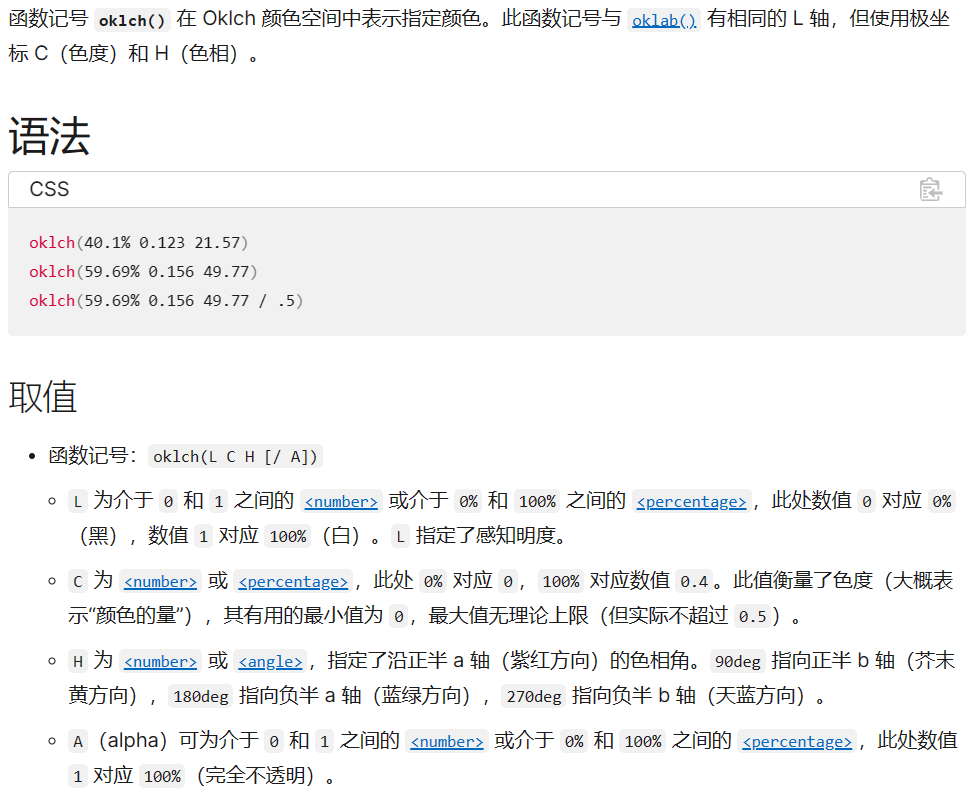
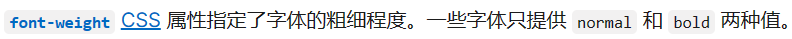
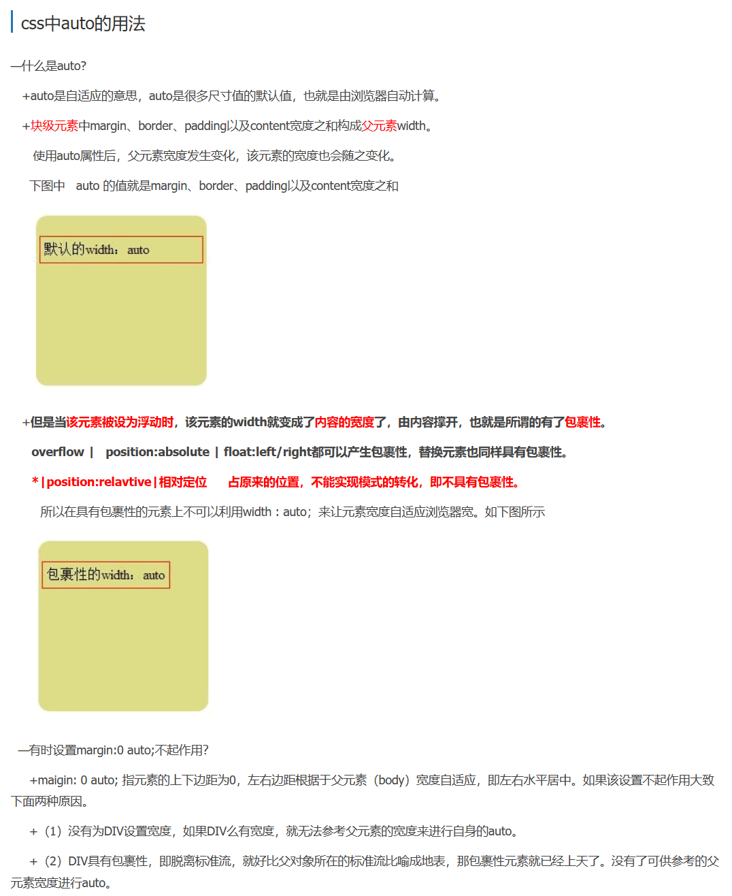
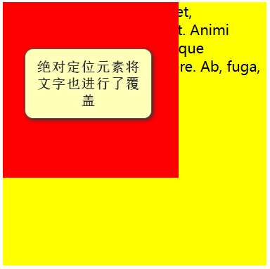
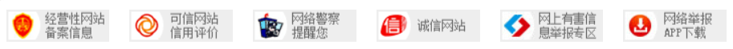
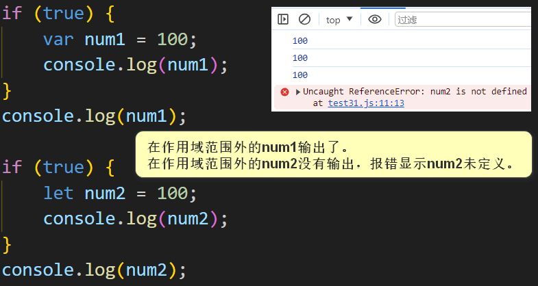

# 一、HTML

[HTML（超文本标记语言） | MDN (mozilla.org)](https://developer.mozilla.org/zh-CN/docs/Web/HTML)

## 1.1 介绍

### 1.1.1 常规标记

也叫双标记。

`<标记></标记>`

`<标记 属性="属性值"></标记>`

标记也可叫标签或元素。

### 1.1.2 空标记

也叫单标记。

`<标记 />`

`<标记 属性="属性值" />`

## 1.2 常用标签

### 1.2.1 文档声明

```html
<!--告诉浏览器使用html5标准解析该html文档-->
<!DOCTYPE html>
```

### 1.2.2 文档语言

```html
<!--
    此处lang属性表示告诉浏览器该html代码包含的语言是英文的，

    但是为何在html文档中输入中文也不会乱码？
    因为该属性不是指定html页面的字符编码，而是告诉浏览器该页面使用的是什么语言。
    如果我们在lang属性中设置该页面为英文(日文)的，那么该html文档在浏览器中显示时，会提示“英语(日文)是否翻译为中文”。
    不管你html文件中使用的是英文还是中文，因为你告诉浏览器的就是该文档使用的是英文。

    该属性值使用的是全球语言代码（ISO 639-1）
    "en"：英文，"zh"：中文，"ja"：日文，......
    后面也可指定使用的国家（推荐）："en-US"：美国英语，"zh-CN"：中国简体中文，"zh-tw"：台湾繁体中文，......
-->
<html lang="en">
</html>
```

### 1.2.3 字符编码

```html
<head>
    <!--告诉浏览器该文档是使用的UTF-8编码方式进行的编码，让它同样以UTF-8编码方式进行解码-->
    <!--如果charset属性设置为UTF-8，而文档的编码方式却为ISO-8859-4，那么浏览器会按照UTF-8编码方式进行解码，此时中文会出现乱码-->
    <meta charset="UTF-8">
</head>
```

### 1.2.4 文本标题

```html
<!--文本标题标签自带加粗，有自己的文本大小，并且独占一行，有默认间距-->
<h1>一级标题</h1>
<h2>二级标题</h2>
<h3>三级标题</h3>
<h4>四级标题</h4>
<h5>五级标题</h5>
<h6>六级标题</h6>
```

### 1.2.5 段落文本

```html
<!--标识一个段落，段落与段落之间有间距-->
<p>段落文本内容</p>
```

### 1.2.6 换行

```html
<br />
```

### 1.2.7 水平线

```html
<!--
    color属性设置水平线颜色，
    width属性设置水平线横向宽度(长度)，
    align属性设置水平线对齐（居左、居中(默认)、居右等），
    noshade属性设置水平线去除阴影（noshade="noshade"）【当属性与属性值相同时，可省略属性值，如下所示】。

    <hr />：默认颜色为灰色，长度为屏幕长度，对齐方式为居中，有阴影。
-->
<hr color="red" width="200px" align="left" noshade />
```

### 1.2.8 文本加粗

```html
<!--下述两个标签显示效果相同-->

<!--只是显示加粗-->
<b>加粗的内容</b>
<!--突出的文本（推荐）-->
<strong>强调的内容</strong>
```

### 1.2.9 文本倾斜

```html
<!--下述两个标签显示效果相同-->

<!--突出的文本（推荐）-->
<em>强调文本</em>
<!--只是显示倾斜-->
<i>倾斜文本</i>
```

### 1.2.10 删除线

```html
<!--下述两个标签显示效果相同-->

<s>文本</s>
<!--（推荐）-->
<del>文本</del>
```

### 1.2.11 下划线

```html
<u>文本</u>
```

### 1.2.12 上下标

```html
<sub>下标</sub>
<sup>上标</sup>
```

## 1.3 特殊符号

| 特殊符号 | 解释                                                                                                   |
| ---- | ---------------------------------------------------------------------------------------------------- |
| 尖角号  | `&lt;`左尖角号(\<)。`&gt;`右尖角号(\>)。                                                                       |
| 空格   | `&nbsp;`半角的不换行(不截断)空格，它是按下space键产生的空格，该空格占据宽度受字体影响明显而强烈。`&emsp;`全角的空格（占据的宽度正好是1个中文宽度）。`&ensp;`半角的空格。 |
| 版权   | `&copy;`表示符号©。                                                                                       |
| 商标   | `&trade;`表示符号™。`&reg;`表示符号®。                                                                         |
| 与号   | `&amp;`表示符号&。                                                                                        |
| 双引号  | `&quot;`表示符号"。                                                                                       |
| 单引号  | `&apos;`表示符号'。                                                                                       |

**`&nbsp;`用法：**


**HTML页面中特殊符号的表示方法：**


## 1.4 VsCode快捷键

1. `按住键盘 Shift + Alt + 向下箭头【上下左右箭头中的下箭头】`：快速复制当前行至下一行。

2. `键入 lorem`：快速生成一段随机单词组成的段落。

3. `选中内容，按住键盘 Alt + w 【需添加htmltagwrap插件】`：快速添加标签将选中内容包围。

4. `键入 p*3`：同时创建3个p标签。其他标签也一样。

5. `键入 div{1111}`：大括号中的内容正是标签中的内容，结果会创建`<div>1111</div>`代码。

6. `键入 !`：输出整个HTML页面基本框架。

7. `按住Ctrl不放，先按k，再按u或c`：选中内容快速（添加/取消）注释。

8. `键入 ul>li`：表示在`ul`标签中创建`li`子标签。其他标签也一样。

9. `键入 dl>dt+dd`：表示在`dl`标签中创建`dt`和`dd`子标签，其他标签也一样。

10. Live Server插件打开html页面时URL路径不包含项目名的解决方法
    
    
    
    
    
    设置前：
    
    `http://127.0.0.1:5500/pages/test9.html`
    
    设置后：
    
    `http://127.0.0.1:5500/webstudy/pages/test9.html`

## 1.5 div和span标签

`<div>`标签：

没有具体含义，用来划分页面的区域，独占一行。

`<span>`标签：

没有实际意义，主要应用在对于文本独立修饰的时候（有一段文字，其中某一部分文字需要单独用css等修饰的时候，就可以在该部分文字使用该标签），内容有多宽就占用多宽的空间距离（不会像`div`标签一样独占一行）。

## 1.6 列表

### 1.6.1 有序列表

```html
<!--<ol>标签中只能放<li>标签，但是<li>标签中可以放其他标签-->
<!--type属性设置序号类型（值只有【1, A, a, I, i】这五个），默认为1-->
<!--
    start属性设置序号从哪里开始（
        值：5，表示从第5个序号【5，e，E，v，V】开始往下排，
        值只能是数字，
        如果值超过了序号最大值【如果类型为a，值为27】，那么第一个序号为aa，依次往下排ab，ac，......
    ），
    默认为1
-->
<ol type="a" start="27">
    <li>有序列表</li>
    <li>有序列表</li>
</ol>
```

### 1.6.2 无序列表

```html
<!--<ul>标签中只能放<li>标签，但是<li>标签中可以放其他标签-->
<!--
    type属性设置序号类型（
        值只有【"disc"：实心圆, "circle"：空心圆, "square"：实心正方形, "none"：无序号】这四个
    ），
    默认为"disc"
-->
<ul type="none">
    <li>无序列表</li>
    <li>无序列表</li>
</ul>
```

### 1.6.3 自定义列表

```html
<!--
    dl标签中可以放多组子标签(dt标签和dd标签)，但建议是只放一组，
    因为这样，
    若我们需为每组标签添加统一样式时，只需统一给dl标签添加即可，而无需给每组标签分别添加样式。
-->
<dl>
    <dt>可以是文字，也可以是图</dt>
    <dd>相关文字</dd>
</dl>
```

## 1.7 图片

```html
<!--
    相对路径（相对于编辑文件的位置[所在的目录]）：
        "./xxx"或"xxx"：当前目录下的xxx。
        "../xxx"：上一级目录下的xxx。
        "../../xxx"：上一级的上一级目录下xxx。
        "/xxx"：根目录下的xxx。
-->
<!--
    属性：
        "src"：图片路径。
        "title"：鼠标悬停上去之后的提示信息。
        "alt"：图片不显示之后(加载失败)的提示信息。

        "width"：图片宽度。
        "height"：图片高度。
        如果只设置了宽度，没有设置高度，那么高度会按照图片原有的宽高比进行等比例缩放。只设置高度也是一样。
-->

```

## 1.8 超链接

```html
<!--
    target属性值：
        "_self"：
            默认值，
            它使得目标文档载入并显示在相同的框架或者窗口中作为源文档。
            这个目标是多余且不必要的，除非和文档标题<base>标签中的target属性一起使用。
        "_blank"：
            浏览器总在一个新打开、未命名的窗口中载入目标文档。
        "_parent"：
            这个目标使得文档载入父窗口或者包含来自超链接引用的框架的框架集。
            如果这个引用是在窗口或者在顶级框架中，那么它与目标_self等效。
        "_top"：
            这个目标使得文档载入包含这个超链接的窗口，用_top目标将会清除所有被包含的框架并将文档载入整个浏览器窗口。
        "iframe标签或frame标签的name属性值"：
            这个目标使得文档载入到iframe或frame标签中（相当于给iframe或frame标签中的src属性赋值）。

    提示：
        这些target的所有4个值都以下划线开始。
        任何其他用一个下划线作为开头的窗口或者目标都会被浏览器忽略，
        因此，不要将下划线作为文档中定义的任何框架name或id的第一个字符。
-->
<a href="路径" title="鼠标悬停上去之后的提示信息" target="规定在何处打开文档">内容（可以是文字，图片【】等）</a>
```

## 1.9 表格

```html
<!--创建表格，标签内只能有tr标签和caption标签-->
<!--
    表格属性：
        wdith：表格宽度（
                            值为百分比时是相对于父元素的，如果父元素为body标签，
                            那么此时表示宽度为相对于父元素【整个页面】的百分之几，
                            如果父元素【页面】宽度缩放了的话，它也会进行相应的缩放。
                            下述height标签也一样
                        ）。
        height：表格高度（
                            注意：
                                body标签若未设置相应属性，
                                默认其宽度为页面宽度，而高度则是页面中内容所占的高度，
                                若无内容，则其高度为0
                        ）。
        border：表格边框（
                            最外层边框，不包括单元格边框，
                            但只要设置了，单元格边框也会出现，只是粗细是固定的，不受值的本值的影响。
                            本值为数字，值越大，最外层边框越粗，但单元格边框粗细不变
                        ）。
        bordercolor：表格边框颜色（最外层边框与单元格边框颜色都受本值的影响）。
        bgcolor：背景颜色。
        align：水平对齐（表格相对于页面而言，值有【left(居左)、right(居右)、center(居中)】）。
        cellspacing：单元格与单元格之间的间距。
        cellpadding：单元格与内容之间的空隙。
-->
<table width="600px" border="3" bordercolor="blue" bgcolor="yellow" align="center" cellspacing="20px" cellpadding="20px">
    <!--创建表格标题，位于表格上方，标签内可有文字，图片等等-->
    <caption>表格标题（知识一览表）</caption>
    <!--创建行，标签内只能有th标签和td标签-->
    <!--
        tr属性：
            height：行高度。
            bgcolor：背景颜色。
            align：文字水平对齐（文字相对单元格而言，值有【left(居左)、right(居右)、center(居中)】）。
            valign：文字垂直对齐（文字相对单元格而言，值有【top(居上)、bottom(居下)、middle(居中)】）。
    -->
    <tr height="100px" bgcolor="red" align="left" valign="bottom">
        <!--创建表头(表格第一行，用于说明每列的内容)，标签内可有文字，图片等等，默认水平居中，上下居中-->
        <th width="100px" height="200px" bgcolor="orange" align="center" valign="top">姓名</th>
        <th>性别</th>
        <th>年龄</th>
    </tr>
    <tr>
        <!--创建单元格，标签内可有文字，图片等等，默认水平居左，上下居中-->
        <!--
            td属性：
                width：单元格宽度（注意：width和height属性影响的是整个一列，其他属性只影响其所在的单元格）。
                height：单元格高度。
                bgcolor：背景颜色。
                align：文字水平对齐（文字相对单元格而言，值有【left(居左)、right(居右)、center(居中)】）。
                valign：文字垂直对齐（文字相对单元格而言，值有【top(居上)、bottom(居下)、middle(居中)】）。

                colspan：单元格所跨的列数(值为2时，表示该单元格占两列)。也叫做单元格的合并列(即将x列的单元格合并成了一个单元格)。
                rowspan：单元格所跨的行数(值为2时，表示该单元格占两行)。也叫做单元格的合并行(即将x行的单元格合并成了一个单元格)。
        -->
        <td width="100px" height="200px" bgcolor="orange" align="center" valign="top" colspan="2" rowspan="2">张三</td>
        <td>25</td>
    </tr>
    <tr>
        <td>28</td>
    </tr>
</table>
<!--通过运行可知，table标签属性作用于整个表格，tr标签属性作用于某一行，td或th标签属性作用于某一个单元格-->
```

## 1.10 表单

```html
<form method="get或者post" action="向何处发送表单数据">
    <!--
        type属性：定义输入框的类型。
            01、"button"：定义可点击的按钮（通常与JavaScript一起使用来启动脚本）。
            02、"checkbox"：定义复选框。
            03、"color"：定义拾色器。
            04、"date"：定义date控件（包括年、月、日，不包括时间）。
            05、"datetime"：定义date和time控件（包括年、月、日、时、分、秒、几分之一秒，基于UTC时区）。
            06、"datetime-local"：定义date和time控件（包括年、月、日、时、分、秒、几分之一秒，不带时区）。
            07、"email"：定义用于e-mail地址的字段。
            08、"file"：定义文件选择字段和"浏览..."按钮，供文件上传。
            09、"hidden"：定义隐藏输入字段。
            10、"image"：定义图像作为提交按钮。
            11、"month"：定义month和year控件（不带时区）。
            12、"number"：定义用于输入数字的字段。
            13、"password"：定义密码字段（字段中的字符会被遮蔽）。
            14、"radio"：定义单选按钮。
            15、"range"：定义用于精确值不重要的输入数字的控件（比如slider控件）。
            16、"reset"：定义重置按钮（重置所有的表单值为默认值）。
            17、"search"：定义用于输入搜索字符串的文本字段。
            18、"submit"：定义提交按钮。
            19、"tel"：定义用于输入电话号码的字段。
            20、"text"：默认。定义一个单行的文本字段（默认宽度为20个字符）。
            21、"time"：定义用于输入时间的控件（不带时区）。
            22、"url"：定义用于输入URL的字段。
            23、"week"：定义week和year控件（不带时区）。

        placeholder属性：
            描述输入字段预期值的简短的提示信息。兼容到IE8以上。

        name属性：
            必须设置，否则在提交表单时，用户在其中输入的数据不会被发送给服务器。

        value属性：
            设置输入框中要显示的值。
    -->

    <!--value属性值显示在按钮上。点击按钮时将会启动js的msg()方法-->
    <p>01、button：<input type="button" value="执行" onclick="msg()" /></p>
    <br />
    <!--checked属性设置默认选中的复选按钮-->
    <p>02、checkbox：<input type="checkbox" name="checkbox[]" value="bike" checked />自行车</p>
    <p>02、checkbox：<input type="checkbox" name="checkbox[]" value="car" checked />小轿车</p>
    <p>02、checkbox：<input type="checkbox" name="checkbox[]" value="boat" />船</p>
    <br />
    <!--
        URL 编码将字符转换为可通过因特网传输的格式。
        URL 只能使用 ASCII 字符集 通过因特网进行发送。
        由于 URL 通常包含 ASCII 集之外的字符，因此必须将 URL 转换为有效的 ASCII 格式。
        URL 编码使用后跟十六进制数字的 "%" 替代不安全的 ASCII 字符。
        URL 不能包含空格。URL 编码通常使用加号（+）或 %20 替代空格。
    -->
    <!--使用form表单将color值提交给后端时，传输的数据格式是%23xxxxxx。其中，23表示"#"在Unicode编码中的十六进制表示，xxxxxx表示的是颜色的六位十六进制数（eg: #ffffff -> %23ffffff）-->
    <p>03、color：<input type="color" name="color" /></p>
    <p>04、date：<input type="date" name="date" /></p>
    <p>05、datetime：<input type="datetime" name="datetime" placeholder="请输入具体时间" /></p>
    <p>06、datetime-local：<input type="datetime-local" name="datetime-local" /></p>
    <p>07、email：<input type="email" name="email" /></p>
    <p>08、file：<input type="file" name="file" /></p>
    <br />
    <!--定义隐藏字段，隐藏字段对于用户是不可见的。隐藏字段常常存储默认值，或者由JavaScript改变它们的值-->
    <p>09、hidden：<input type="hidden" name="hidden" value="hidden" /></p>
    <br />
    <!--width和height属性用来设置图片的宽高。alt属性设置图片不显示之后(加载失败)的提示信息。-->
    <p>10、image：<input type="image" src="/imgs/01.jpg" width="160px" height="90px" alt="这是图片" /></p>
    <br />
    <p>11、month：<input type="month" name="month" /></p>
    <br />
    <!--max属性设置允许的最大值。min属性设置允许的最小值。step属性设置合法数字间隔。value属性设置默认值-->
    <!--step属性设置为2，如果此时值为3时，鼠标点击一下(增大/缩小)数字，数字变为(5/1)-->
    <p>12、number：<input type="number" name="number" min="1" max="5" step="2" value="1" /></p>
    <br />
    <p>13、password：<input type="password" name="password" /></p>
    <br />
    <p>14、radio：<input type="radio" name="radio" value="男" />男</p>
    <!--checked属性设置默认选中的单选按钮-->
    <p>14、radio：<input type="radio" name="radio" value="女" checked />女</p>
    <br />
    <!--max属性设置允许的最大值。min属性设置允许的最小值。step属性设置合法数字间隔(即鼠标移动增大/缩小数字时的跨幅)。value属性设置默认值-->
    <!--step属性设置为20，如果此时值为50时，鼠标向(左/右)移动一下，数字变为(30/70)-->
    <p>15、range：<input type="range" name="range" min="10" max="90" step="20" value="60" /></p>
    <br />
    <!--value属性值显示在按钮上-->
    <p>16、reset：<input type="reset" value="恢复默认" /></p>
    <br />
    <p>17、search：<input type="search" name="search" /></p>
    <br />
    <!--value属性值显示在按钮上-->
    <p>18、submit：<input type="submit" value="上传数据" /></p>
    <!--上下两个提交按钮标签效果一样-->
    <p>18、submit：<button type="submit">上传数据</button></p>
    <br />
    <!--在手机端使用tel类型的input元素时，会弹出拨号键盘，pc端没有效果-->
    <p>19、tel：<input type="tel" name="tel" /></p>
    <p>20、text：<input type="text" name="text" placeholder="请输入一段文本" /></p>
    <p>21、time：<input type="time" name="time" /></p>
    <p>22、url：<input type="url" name="url" /></p>
    <p>23、week：<input type="week" name="week" /></p>
</form>
```

显示结果：


表单提交注意事项：

```html
<form>
    <span>用户账号或密码错误</span>
    <br>
    用户名：<input name="username" type="text">
    <br>
    密码：<input name="password" type="text">
    <br>
    <button>登录</button>
    <!--
        问题：
            在写表单页面的时候，点击button按钮就会出现自动提交表单的情况（明明没有指明其type="submit"）。
        原因：
            form表单下的按钮在没有指定type类型的时候，button会有一个默认的type="submit"属性。
        解决：
            给button设置一个类型type="button"，这样button的类型就不是默认的submit了，就不会自动提交表单了。
            eg：<button type="button">登录</button>
    -->
</form>

<script>
    let form = document.querySelector("form");

    form.onsubmit = (e) => {
        // 当我们点击表单提交按钮时，表单会默认提交（点击提交后URL后面出现?key=value&...）。
        // 如果我们要使用AJAX来异步提交表单，那么我们就要阻止表单的默认提交行为。
        // 下述语法作用是阻止表单的默认提交行为。此时点击表单会触发此处的提交事件，但是不会默认提交表单。
        e.preventDefault();

        console.log("aswerfgb");
    }
</script>
```

# 二、CSS

[CSS：层叠样式表 | MDN (mozilla.org)](https://developer.mozilla.org/zh-CN/docs/Web/CSS)

## 2.1 介绍

1. 每个CSS样式由两部分组成，即选择符和声明，声明又分为属性和属性值。

2. 属性必须放在花括号中，属性与属性值用冒号连接。

3. 每条声明用分号结束。

4. 当一个属性有多个属性值时，属性值与属性值不分先后顺序，用空格隔开。

5. 在书写样式过程中，空格、换行等操作不影响属性显示。


CSS书写规范（不按规范写不一定会报错，但是尽量按照规范写）：

- 空格规范
  
  - 选择器与"{"之间必须包含空格。
  
  - 属性名与之后的":"之间不允许包含空格，":"与属性值之间必须包含空格。

- 选择器规范
  
  - 当一个rule包含多个selector时，每个选择器声明必须独占一行。
  
  - 嵌套层级应该不大于三级。

- 属性规范
  
  - 属性定义必须以分号结尾。
  
  - 属性定义必须另起一行。

## 2.2 样式表的创建

### 2.2.1 内部样式表

```html
<!--样式写在html页面中，并用style标签包裹（可写在body标签中，也可写在head标签中【推荐】）-->
<style>
    h1 {
        color: blue;
    }
    h2 {
        color: chartreuse;
    }
</style>
```

### 2.2.2 外部样式表

```html
<!--CSS外部引入方式1（推荐）-->
<!--rel(relation)定义关联性为stylesheet(样式表)-->
<link rel="stylesheet" type="text/css" href="/css/test1.css" />

<!--CSS外部引入方式2-->
<style type="text/css">
    @import url("/css/test1.css");
</style>

<!--
    外部样式表导入后相当于如下内部样式表：
    <style>
        "/css/test1.css"中的样式从头到尾依次排列。
    </style>
-->
```


### 2.2.3 行内样式表

行内样式又称为内联样式、嵌入式样式。

```html
<h1 style="color: aqua; width: 300px;">学习CSS第一天</h1>
```

### 2.2.4 样式表优先级

就近原则（行内样式优先级最高，内部样式`<style>`和外部样式`<link>`谁最靠近目标标签谁优先级高）。

如果要改变优先级，可以在属性值后添加`!important`规则，如下所示，添加该规则的属性优先级最高。要是都添加了该规则，那么优先级还是以就近原则为准。

注意：优先级最高并不是只执行该样式表，其他样式表不执行，如果其他样式表有不同的属性(样式)，那么一样会执行。即优先级只针对于相同样式表中的相同属性。

```html
<style>
    h1 {
        /* 外部样式表同理 */
        color: chartreuse!important;
    }
</style>

<h1 style="color: blue!important;">学习CSS</h1>
```

## 2.3 选择器

使用选择器的目的是为了实现对HTML页面中的元素进行一对一、一对多或者多对一的控制。

### 2.3.1 元素选择器

[类型选择器 - CSS：层叠样式表 | MDN (mozilla.org)](https://developer.mozilla.org/zh-CN/docs/Web/CSS/Type_selectors)

元素选择器又称为类型选择器、element选择器、标签选择器。

元素选择符就是以文档语言对象类型作为选择符，即使用结构中元素名称作为选择符。eg：`div`、`body`等。

用法：

1. 改变某个元素的默认样式时，可使用类型选择器。eg：改变文档所有p段落默认样式。

2. 当统一文档某个元素的显示效果时，可使用类型选择器。eg：改变文档所有p段落样式。

```css
div {
    color: blue;
    background-color: chartreuse;
}
```

### 2.3.2 类选择器

[类选择器 - CSS：层叠样式表 | MDN (mozilla.org)](https://developer.mozilla.org/zh-CN/docs/Web/CSS/Class_selectors)

类选择器又称为class选择器。

当我们使用class选择符时，应先为每个元素定义一个class名称。用法如下所示。

```html
<!--一个标签可以有多个类名。类名必须以字母开头，且区分大小写-->
<!--
    如果一个标签中使用的多个类选择器有相同属性，
    那么按照就近原则，哪个选择器离标签最近，哪个属性优先级就高，
    而不是按照标签中类名的顺序判断优先级。
-->
<div class="top down">...</div>

<h1 class="top">...</h1>
```

```css
/* 使用类选择器时要在类名前加上一个点(.) */
.top {
    color: blue;
    background-color: chartreus;
}

.down {
    color: red;
}

/* 去掉div与.top之间的空格，就不是包含选择器了，它表示选择div元素且元素中class属性包含top这个值 */
div.top {
    width: 200px;
}

/* 去掉.top与.down之间的空格，就不是包含选择器了，它表示选择class属性同时包含top和down这两个值的元素 */
.top.down {
    width: 300px;
}
```

class选择器更适合定义一类样式。

### 2.3.3 id选择器

[ID 选择器 - CSS：层叠样式表 | MDN (mozilla.org)](https://developer.mozilla.org/zh-CN/docs/Web/CSS/ID_selectors)

在实际中，浏览器并不会检查id的唯一性，设置多个id，可以为这些具有相同id的元素应用相同样式，但在编写DOM脚本时只能识别该id的第一个元素。所以我们在一个HTML文档中，需要保证id的唯一性。

当我们使用id选择符时，应先为每个元素定义一个id属性。用法如下所示。

```html
<!--取名时要取英文名，且不能是关键字-->
<!--一个标签只能有一个id。一个id名称只能对应文档中一个具体的元素对象（唯一性）。id必须以字母开头，且区分大小写-->
<div id="box">...</div>
```

```css
/* 使用id选择器时要在类名前加上一个井号(#) */
#box {
    color: red;
}
```

### 2.3.4 通配符选择器

[通配选择器 - CSS：层叠样式表 | MDN (mozilla.org)](https://developer.mozilla.org/zh-CN/docs/Web/CSS/Universal_selectors)

通配选择符的写法是"\*"，其含义就是所有元素。用法如下所示。

```css
/* 清除所有元素的默认边距值和填充值。这是通配符选择器最常用的用法 */
* {
    /* 盒子模型：(margin：外边距，border：边框，padding：内边距) */
    margin: 0;
    padding: 0;
}
```

### 2.3.5 属性选择器

[属性选择器 - CSS：层叠样式表 | MDN (mozilla.org)](https://developer.mozilla.org/zh-CN/docs/Web/CSS/Attribute_selectors)

属性选择器可以根据元素的属性及属性值来选择元素。

注意：属性选择器中的值不使用双引号包围也可以，但编码规范中要求使用双引号`""`包围。

```css
/* 第一种：[att]简单属性选择器 */
/* 通过某个属性来选中元素，而不论属性值是什么 */

/* 选择所有包含class属性的h1标签 */
h1[class] {color: red;}
/* 选择所有同时包含href属性和title属性的a标签 */
a[href][title] {color: red;}
#div[class] {color: red;}
.box[id] {color: red;}
/* 选择所有包含class属性的所有标签 */
[class] {color: red;}


/* 第二种：[att=val]具体属性选择器 */
/* 通过某个属性的属性值是什么来选中元素 */

/* 选择所有包含class属性且属性值为"test box"的所有标签，class里面的值以及顺序必须完全相同，并且不可多空格或者少空格 */
[class = "test box"] {color: red;}
/* id选择器和指定id属性的属性选择器并不是一回事，主要在于优先级不同 */
[id = "tox"] {color: red;}
a[href = "http://www.baidu.com"][title ="baidu"] {color: red;} 


/* 第三种：部分属性选择器。这里以class为例 */
/*
[class ~= "b"] 选择class属性值在用空格分隔的词列表中包含词语"b"的所有元素（此时的b是一个类名，不是类名的一部分）。
[class ^= "b"] 选择class属性值以"b"开头的所有元素。
[class $= "b"] 选择class属性值以"b"结尾的所有元素。
[class *= "b"] 选择class属性值包含"b"的所有元素。
[class |= "b"] 选择class属性值等于b或以b-开头的所有元素。
*/
```

### 2.3.6 子选择器

[子组合器 - CSS：层叠样式表 | MDN (mozilla.org)](https://developer.mozilla.org/zh-CN/docs/Web/CSS/Child_combinator)

使用大于号">"(子结合符)，比如E > F，匹配E元素的所有直接子元素F。

```css
/* ">"选择器的两边各保留一个空格 */

/* 选取h1元素的第一代子元素中所有的strong元素 */
h1 > strong {color: red;} 

/* 选择作为td元素第一代子元素中所有的p元素，这个td元素本身从table元素继承，该table元素有一个包含company的class属性 */
table.company td > p {color: blue;}
```

### 2.3.7 相邻兄弟选择器

[接续兄弟组合器 - CSS：层叠样式表 | MDN (mozilla.org)](https://developer.mozilla.org/zh-CN/docs/Web/CSS/Next-sibling_combinator)

相邻兄弟选择器使用加号"+"，比如E + F，匹配E元素之后的同级元素F（直接相邻，即E元素和F元素之间不能有其他元素，但是两个元素之间的文本内容不会影响相邻兄弟结合符起作用）。

```css
/* "+"选择器的两边各保留一个空格 */

/* 选择紧接在h1元素后出现的段落，h1和p元素拥有共同的父元素 */
h1 + p {margin-top: 50px;}

/* 这个选择器只会把列表中的第二个和第三个列表项的字体颜色变为红色，第一个列表项不受影响。因为第三个li是第二个li的兄弟元素，所以也会应用样式，如果第三个并不是li元素（即不为第二个li元素的兄弟元素了），那么它不会应用样式 */
/* 这种情况下，如果我们想为之后的li元素应用样式，即使不为兄弟元素，我们可使用通用兄弟选择器 */
li + li {color: red;}

/* 相邻兄弟结合符还可以结合其他结合符 */
/* 下面这个选择器解释为：选择紧接在table元素后出现的所有兄弟ul元素，该table元素包含在一个body元素中，body元素本身是html元素的子元素 */
html > body table + ul {margin-top: 20px;}
```

### 2.3.8 通用兄弟选择器

[后续兄弟选择器 - CSS：层叠样式表 | MDN (mozilla.org)](https://developer.mozilla.org/zh-CN/docs/Web/CSS/Subsequent-sibling_combinator)

通用兄弟选择器使用波浪号"~"，比如E ~ F，匹配E元素之后的所有同级元素F（无论直接相邻与否）。

```css
/* 选择器会把h2元素之后的所有同级别的p元素的字体颜色变为红色 */
h2 ~ p {color: red;}
```

### 2.3.9 群组选择器

[选择器列表 - CSS：层叠样式表 | MDN (mozilla.org)](https://developer.mozilla.org/zh-CN/docs/Web/CSS/Selector_list)

当有多个选择符应用相同的声明时，可以将选择符用","分隔的方式合并为一组。

语法：选择符1, 选择符2, 选择符3, ...{声明(属性: 属性值);}。

```html
<h1>大标题</h1>
<h2>中标题</h2>
<h3>小标题</h3>
```

```css
h1,
h2,
h3 {
    color: blue;
}
```

### 2.3.10 包含选择器

[后代选择器 - CSS：层叠样式表 | MDN (mozilla.org)](https://developer.mozilla.org/zh-CN/docs/Web/CSS/Descendant_combinator)

包含选择器又称为后代选择器。

语法：选择符1 [空格] 选择符2{声明(属性: 属性值);}。含义就是选择符1中包含的所有选择符2的样式表。

```html
<ul class="list">
    <li>第一行</li>
    <li>第二行</li>
    <li>第三行</li>
</ul>
```

```css
/* 包含选择符的匹配是从右往左的(原因如下图所示)，即先匹配所有的li标签，然后在此基础上再匹配所有外层包含了类名为list的标签 */
.list li {
    color: aqua;
}
```

包含选择器与子选择器的区别：

1. 子选择器指选择某元素的直接后代，或者可以理解为作用于其第一代子元素。而后代选择器是作用于其所有子后代元素。

2. 后代选择器通过空格来进行选择，子控制器是通过">"进行选择。


### 2.3.11 伪类选择器

[CSS：层叠样式表 | MDN (mozilla.org)](https://developer.mozilla.org/zh-CN/docs/Web/CSS)目录中的Pseudo-classes节。

CSS引入伪类和伪元素的概念是为了格式化文档树以外的信息。也就是说，伪类和伪元素是用来修饰不在文档树中的部分，比如，一句话中的第一个字母，或者是列表中的第一个元素等。

伪类用于当已有元素处于某个状态时，为其添加对应的样式，这个状态是根据用户行为而动态变化的。比如说，当用户悬停在指定的元素时，我们可以通过`:hover`来描述这个元素的状态。虽然它和普通的CSS类相似，可以为已有的元素添加样式，但是它只有处于DOM树无法描述的状态下才能为元素添加样式，所以将其称为伪类。


注意：伪类名称对大小写不敏感。

```css
/* 状态伪类 */


/* 1、静态伪类（只能应用于超链接） */

/* 选择器选择未访问的链接（对初始状态的链接执行样式） */
a:link {background-color: pink;}
/* 选择器选择已访问的链接（对访问过后的链接执行样式），visited伪类只能设置字体颜色的样式 */
a:visited {color: orange;}

/* 2、动态伪类（可应用于任何元素） */

/* 拥有焦点时（焦点在HTML和JS中是指光标[在页面上屏幕中闪动的小竖线]。鼠标点击就可获得光标，Tab键可按照设置的Tabindex来进行切换焦点） */
a:focus {background-color: lightgrey;}
/* 选择鼠标指针浮动在其上的元素 */
a:hover {background-color: lightblue;}
/* 选择活动的链接。正被点击，即手指未松开，即还未跳转到新页面 */
a:active {background-color: lightgreen;}
/* IE7-浏览器不支持 :focus、:hover和 :active。在IE6-浏览器下只支持给<a>设置 */

/* 3、伪类编写时的顺序（口诀：LVFHA） */

/*
link和visited必须在最前面，且没有先后顺序，否则link和visited的效果将被覆盖。

hover、active、focus这三个伪类必须是focus、hover、active的顺序 。

所以最终的顺序只有两种：link、visited、focus、hover、active或visited、link、focus、hover、active。

原因：
    首先注意关键的两点：1、这5个伪类特指度相同。2、一个链接可能同时处于多种状态，即同时属于多个伪类。

    未点击链接前，link伪类长期处于激活状态，鼠标悬停（或点击）时，<a>链接同时处于link和hover(或active)状态，
    由于它们特指度相同，在同时激活的情况下，后出现的伪类样式会覆盖前面的伪类样式（就近原则），故link状态必须写在hover(或active)之前。

    再讨论hover和active的顺序，若把hover放在active后面，当点击链接的一瞬间，
    实际你在激活active状态的同时触发了hover伪类，hover在后面覆盖了active的颜色，所以无法看到active的颜色。故hover在active之前。

    其次，若把visited放在hover后面，那已访问过的链接一直触发着visited伪类，会覆盖hover样式。

    之后，link、visited两个伪类之间顺序无所谓（因为它俩不可能同时触发，即又未访问同时又已访问）。

    最后，其他情况依此类推。
*/

/* 不仅可以使用单一伪类，也可以伪类结合使用（注意：结合使用的伪类需要满足可同时触发这一条件，否则该样式无效。就像a:link:visited {color: blue;}这一样式就是无效的） */
/* 超链接被访问后，鼠标指针浮动在其上时执行的样式。超链接被访问前，鼠标指针浮动在其上时不会执行该样式 */
a:visited:hover {color: red;}
/* 注意：顺序无关。即上述样式写成a:hover:visited {color: red;}也是一样的。 */
```

```css
/* 结构化伪类（IE8-浏览器不支持） */


/*
":not()"（否定选择器）（IE8-浏览器不支持）：
    选择器匹配不符合参数的元素。参数可以是"元素／选择器"。可以简单理解为：就它没有，其余都有。
    语法格式：父元素:not(子元素／子选择器)、Father:not(Children/selector)。
*/
/* nav直接子元素中，最后一个a类型元素不应用此样式 */
nav > a:not(:last-of-type) {
    border-right: 1px solid red;
}

/*
":target"（IE8-浏览器不支持）：
    当URL带有锚名称，指向文档内某个具体的元素时，":target"匹配该元素。
*/

/*
以下情况都是E为父元素，F为子元素：
    E F:nth-child(x) 选择父元素的第x个子元素，且该子元素是F。第一个编号为1。（注意：不是所有f子元素中，第x个f元素，而是第x个子元素且该元素是f元素。下述一样）
    E F:nth-last-child(x) 选择父元素的倒数第x个子元素，且该子元素是F。倒数第一个编号为1。
    E F:first-child （IE6-不支持）父元素的第一个子元素，且该子元素是F。与E F:nth-child(1)等同。
    E F:last-child （IE6-不支持）父元素的最后一个子元素，且该子元素是F。与E F:nth-last-child(1)等同。
    E F:only-child 选择父元素中只包含一个子元素，且该子元素是F。
    -------------------------------------------------------------------------------------------------------------------------------------
    E F:nth-of-type(x) 选择父元素的第x个f子元素。（注意：与上述相反，不是第x个子元素且该元素是f元素，而是所有f子元素中，第x个f元素。下述一样）
    E F:nth-last-of-type(x) 选择父元素的倒数第x个f子元素。
    E F:first-of-type 选择父元素的第1个f子元素，与E F:nth-of-type(1)等同。
    E F:last-of-type 选择父元素的最后1个f子元素，与E F:nth-last-of-type(1)等同。
    E F:only-of-type 选择父元素中只包含一个f子元素的f元素。

E F:only-child与E F:only-of-type的区别：
    前者是父元素E中只能有一个子元素，且该子元素还必须是f元素。
    后者是父元素E中可以有多个子元素，但是f子元素只能有一个。

注意：上述中的x有如下形式。
         1、可以是整数（
                        从0开始【第0个元素不存在，因为是从1开始排序。但是为0也没错，只是无效】
                     ）。
         2、可以是公式（
                        如n、2n、3n+5等。
                        注意：
                            此处的n【只能是n，不能是其他字母等】有特殊含义，表示"0, 1, 2, 3, ..."即每个元素，
                            2n表示匹配第"0, 2, 4, ..."个元素即所有偶数项。
                            公式不能使用乘法，比如n*n等不能使用
                     ）。
         3、可以是关键字（
                        如even【偶数项】、odd【奇数项】
                       ）。
*/

/*
举例（CSS样式的序号对应下述HTML页面注释中的序号）

1、
a:nth-child(2n) {color: crimson;} 表示在所有标签的子标签中的a标签。注意：每个标签的子标签中的a标签单独考虑。即在同级标签中考虑。
2、
div a:nth-child(2n) {color: crimson;} 表示在所有div标签的子标签中的a标签。注意：每个标签的子标签中的a标签单独考虑。即在同级标签中考虑。
3、
div > a:nth-child(2n) {color: crimson;} 表示在所有div标签的第一代子标签中的a标签。注意：每个标签的子标签中的a标签单独考虑。即在同级标签中考虑。

html、
<body>
    <div>
        <span>
            <a href="test1.html">我相信我就是你</a>

            <!--
                1、变红【span标签下的第2个子标签且为a标签】。
                2、变红【div标签下的span标签下的第2个子标签且为a标签】。
            -->
            <a href="test1.html">我相信我就是你</a>

            <a href="test1.html">我相信我就是你</a>

            <!--
                1、变红【span标签下的第4个子标签且为a标签】。
                2、变红【div标签下的span标签下的第4个子标签且为a标签】。
            -->
            <a href="test1.html">我相信我就是你</a>
        </span>

        <!--
            1、变红【div标签下的第2个子标签且为a标签(注：div标签下第1个子标签为span标签)】。
            2、变红【div标签下的第2个子标签且为a标签(注：div标签下第1个子标签为span标签)】。
            3、变红【div标签下的第一代子标签中的第2个子标签且为a标签(注：div标签下的第一代子标签中的第1个子标签为span标签)】。
        -->
        <a href="test1.html">我相信我就是你</a>  

        <a href="test1.html">我相信我就是你</a>
    </div>

    <!--1、变红【body标签下的第2个子标签且为a标签(注：body标签下第1个子标签为div标签)】。-->
    <a href="test1.html">我相信我就是你</a>

    <a href="test1.html">我相信我就是你</a>
</body>
*/
```

```css
/* 表单相关伪类 */


/* UI元素伪类包括：":enabled"、":disabled"、":checked"三个，主要针对于HTML中的form元素（IE8-浏览器不支持） */
/* 匹配没有设置disabled属性的表单元素 */
input:enabled {color: #ccc;}
/* 匹配禁用的表单元素 */
input:disabled {color: red;}
/* 匹配被选中的input元素，这个input元素包括radio和checkbox） */
input:checked {color: green;}

/* 匹配默认选中的元素 */
/*
<select id="pet-select">
  <option value="cat">Cat</option>
  <option value="hamster" selected>Hamster</option> 匹配成功。
  <option value="parrot">Parrot</option>
</select>
......
option:default {color: blue;}
或者
<input type="radio" name="season" id="spring" />
<input type="radio" name="season" id="summer" checked /> 匹配成功。
<input type="radio" name="season" id="fall" />
......
input:default {color: blue;}
*/
option:default {color: blue;}

/* 匹配没有子元素的button元素。如果元素中含有文本节点、HTML元素或者一个空格，则":empty"不能匹配这个元素 */
/*
<button type="button" style="width: 200px; height: 200px;"></button> 匹配成功。
<button type="button" value="123456789o">wsedrftg</button> 匹配失败。
*/
button:empty {background-color: black;}


/* ":in-range"匹配指定区域内的元素 */
/*
<!--当数字选择器的数字在5到10时，匹配下述样式（其边框变为指定样式）-->
<input type="number" min="5" max="10">
*/
input[type=number]:in-range {
    border: 1px solid green;
}
/* ":out-of-range"与":in-range"相反，它匹配不在指定区域内的元素 */
/*
<!--当数字选择器的数字不在5到10时，匹配下述样式（其边框变为指定样式）-->
<input type="number" min="5" max="10">
*/
input[type=number]:out-of-range {
    border: 1px solid green;
}

/* indeterminate的英文意思是“不确定的”。当某组中的单选框或复选框还没有选取状态时，":indeterminate"匹配该组中所有的单选框或复选框 */
/*
<input type="radio" name="address"> 江苏
<input type="radio" name="address"> 江西
<input type="radio" name="address"> 安徽
<input type="radio" name="address"> 广东
如果上述单选按钮还没有选取，那么下述样式将会匹配上述所有按钮。一旦选取了某个按钮，那么该组所有按钮都将不匹配。
判断单选按钮是否属于同一组，只需判断它们的name属性值是否相同。
*/
input[type=radio]:indeterminate {box-shadow: 0 0 2px 1px coral;}

/* ":valid"匹配条件验证正确的表单元素 */
/*
<input type="number" min="2" max="6">
当输入框中输入的数字不在2-6范围内或者输入其他无效的值时，下述样式不匹配。
只有输入的是2-6范围内的数字这些有效值时，才会匹配成功。
除此之外，还有输入框类型为emial时验证输入的email值的有效性等等。
*/
input[type=number]:valid {background-color: blue;}
/* ":invalid"与":valid"相反，匹配条件验证错误的表单元素 */
input[type=number]:invalid {background-color: blue;}
/*
关闭验证的方法：
    1、在<form>标签中添加novalidate属性（<form novalidate>）。
    2、在提交按钮中添加formnovalidate属性（<input type="submit" formnovalidate />）
*/

/* ":optional"匹配具有optional属性的表单元素。当表单元素没有设置为required时，即为optional属性（默认） */
/*
<!--
    required属性表示“必填”，即使用该属性的输入框等不能为空。如果为空，提交表单时会在相应输入框等旁边提示“请填写此字段”等。表单提交失败（可按上述方法关闭验证即可使该属性失效）。
    optional属性表示“可选”，即使用该属性的输入框等可为空。
-->
<form action="#" method="post">
    <input type="text" name="aa" required />

    <!--没有显式设置required属性和optional属性时，默认为optional属性-->
    <input type="text" name="bb" />

    <input type="submit" value="登录" />
</form>
name为"aa"的输入框匹配下述第2个样式。
name为"bb"的输入框匹配下述第1个样式。
*/
input:optional {background-color: blue;}
input:required {background-color: chartreuse;}
/* ":required"与":optional"相反，匹配设置了required属性的表单元素 */

/* ":read-only"匹配设置了只读属性的元素。表单元素可以通过设置"readonly"属性来定义元素只读 */
/*
<input type="text" value="明天会更好！" readonly />
*/
input:read-only {color: chartreuse;}
/* ":read-write"匹配处于编辑状态的元素。"input", "textarea"和设置了"contenteditable"的HTML元素获取焦点时即处于编辑状态 */
/*
全局属性contenteditable是一个枚举属性，表示元素是否可被用户编辑。如果可以，浏览器会修改元素的组件以允许编辑。

举例（下述标签中的文字在浏览器中均可编辑）：
<blockquote contenteditable="true">
  <p>Edit this content to add your own quote</p>
</blockquote>
<cite contenteditable="true">-- Write your own name here</cite>
<p contenteditable="true">这是一个可编辑段落。</p>

该属性必须是下面的值之一：
    true或空字符串，表示元素是可编辑的。
    false表示元素不是可编辑的。

如果没有设置该属性的值（例如：<label contenteditable>Example Label</label>），则其值被视为空字符串。

如果没给出该属性或设置了无效的属性值，则其默认值继承自父元素。即，如果父元素可编辑，该子元素也可编辑。

注意：虽然该属性允许设定的值包括true和false，但该属性仍是一个枚举(en-US)属性而非布尔属性。
*/

/* ":scope"匹配以某一元素为根元素，即作用域范围为该元素内部(子标签等等)。若没有设置scope伪类，该样式会对整个html起作用(作用域范围为全局) */
/* 具体用法如下图所示 */
```


```css
/* 语言相关伪类 */


/* ":dir(ltr或rtl)"匹配指定阅读方向的元素，当HTML元素中设置了dir属性时该伪类才能生效 */
/* 现时支持的阅读方向有两种：ltr（从左往右）和rtl（从右往左） */
/*
<p dir="ltr">从左往右读</p>
<p dir="rtl">从右往左读</p>
运行结果如下图所示。通过观察可知，它有点类似于水平对齐中的居左、居右。
文字从左向右书写时，使用ltr属性值，从右向左书写时，使用rtl属性。
*/
p:dir(rtl) {background-color: aqua;}
/* dir属性浏览器都支持，但是":dir(ltr或rtl)"伪类edge浏览器、chrome浏览器都不支持，firefox浏览器支持 */

/* ":lang(<language-code>)"匹配设置了特定语言的元素（IE7-浏览器不支持） */
/* 设置特定语言可以通过为HTML元素设置lang=""属性，设置meta元素的charset=""属性，或者是在http头部上设置语言属性 */
/* 实际上，lang=""属性不止可以在html标签上设置，也可以在其他的元素上设置 */
/*
<html lang=""zh_CN>
......
</html>
或者
<div lang="en">
......
</div>
等等
*/
/* 匹配设置了语言为zh_CN的所有div元素 */
div:lang(zh_CN) {background-color: aqua;}
```


```css
/* 其他伪类 */


/* ":root"匹配文档的根元素。一般的html文件的根元素是html元素，而SVG或XML文件的根元素则可能是其他元素 */
/*
<html style="background-color: aqua;">
......
</html>
下述样式与上述是一样的。
*/
:root {background-color: aqua;}

/* ":fullscreen"匹配处于全屏模式下的元素 */
/* 全屏模式不是通过按F11来打开的全屏模式，而是通过Javascript的Fullscreen API来打开的，不同的浏览器有不同的Fullscreen API */
/* 目前，":fullscreen"需要添加前缀才能使用 */

/* ":focus-within"，匹配当前获得焦点的目标元素 */
/* 匹配获得焦点的那个input元素 */
input:focus-within {background-color: aqua;}
```

### 2.3.12 伪元素选择器

[CSS：层叠样式表 | MDN (mozilla.org)](https://developer.mozilla.org/zh-CN/docs/Web/CSS)目录中的Pseudo-elements节。

伪元素用于创建一些不在文档树中的元素，并为其添加样式。比如说，我们可以通过`:before`在一个元素前增加一些文本，并为这些文本添加样式。虽然用户可以看到这些文本，但是这些文本实际上不在文档树中。


```css
/* 在CSS3中，为了区分伪类选择器和伪元素选择器，伪元素选择器前用两个冒号 */

/*
所有伪元素都必须放在出现该伪元素的选择器的最后面（即伪元素放在选择器最后面）。
若写成p::before em {content: "no!"}就是不合法的（自己读都读不通顺），p em::before {content: "ok!";}合法。
*/

/* "::first-letter"匹配元素中文本的首字符（首字母或第一个文字） */
div::first-letter {color: red;}
/* 所有前导标点符号应与第一个字母一同应用该样式 */
/* 只能与块级元素关联 */

/* "::first-line"匹配元素中第一行的文本。这个伪元素只能用在块元素中，不能用在内联(又称行内)元素中。 */
div::first-line {color: green;}

/* 被"::first-letter"和"::first-line"修饰的首字符在div标签中，但不能是其子标签中的首字符（firefox浏览器是这样，但是edge浏览器和chrome浏览器没有这一限制）。如下 */
/*
上述"::first-letter"和"::first-line"伪元素选择器在firefox浏览器中不匹配文字1（官方规定就是这样匹配的），所以样式无效。而edge浏览器和chrome浏览器却匹配文字1。
<div>
    <p>文字1</p>
    文字2
</div>
*/

/* "::before"在被选元素前插入内容。需要使用content属性来指定要插入的内容。被插入的内容实际上不在文档树中（IE7-不支持） */
/* 这里是插入文字 */
div::before {content: "是啊！";}
/* 默认这个伪元素(::before)是行内元素，且继承元素(div)可继承的属性（此处添加的文字或其他内容等的样式与div标签中的内容的样式一样，即继承了div标签的样式） */

/* "::after"在被选元素后插入内容，其用法和特性与":before"一样（IE7-不支持） */
/* 这里是插入图片 */
div::after {content: url(girl.jpg);}
/* 默认这个伪元素(::after)是行内元素，且继承元素(div)可继承的属性（此处添加的文字或其他内容等的样式与div标签中的内容的样式一样，即继承了div标签的样式） */
/* 使用"::before"和"::after"的主要目的是为了省略不必要的标签。其中content属性是必不可少的 */
/* 注意：通过"::before"或"::after"生成的元素并不在DOM文档树中，所以通过":first-child"或":last-child"是匹配不到它们的 */

/* 以上伪元素还支持单冒号写法 */

/* "::selection"匹配用户被用户选中或者处于高亮状态的部分（IE8-浏览器不支持） */
/* 这里用户选择的内容文字颜色会变为红色，并有蓝色背景。注意：这里的文字是div标签中的，不能是其子标签中的文字 */
/*
<div>
    <p>不匹配样式</p>
    匹配样式
</div>
*/
div::selection{color: red;  background-color: blue;}
/* 只支持双冒号写法。只支持color和background-color两个属性 */

/* "::placeholder"匹配占位符的文本，只有元素设置了placeholder属性时，该伪元素才能生效 */
/* 该伪元素不是CSS的标准，它的实现可能在将来会有所改变，所以要决定使用时必须谨慎 */
/*
显示时文本框中”请输入密码“这几个字变为蓝色。
<input type="text" placeholder="请输入密码">
*/
/* chrome浏览器下建议采用如下这种写法。测试中发现，不加前缀也可以 */
input::-webkit-input-placeholder{color: blue;}

/* "::backdrop"匹配任何处于全屏模式（不是浏览器中的按F11进入全屏模式的那个）的元素 */
/* 设置全屏模式下的h1标签的背景颜色，全屏模式的默认颜色为黑色。该伪元素只支持双冒号的形式 */
h1:fullscreen::backdrop {background: orange;}
/* 将视频全屏显示时的背景颜色改为蓝色而不是大多数浏览器默认的黑色。如下图所示 */
video::backdrop {background: blue;}
```


```css
/* content属性 */


/* content属性应用于before和after伪元素 */
div::before {
    content: normal;  /* 默认 */
}
/* content: <string>|<url>|attr(<identifier>) */
/* <string>面的内容会原样显示，即使包含某种标记也不例外。比如content: "前缀<br>";页面上依然原样显示 */
/* 如果希望生成内容中有一个换行，则需要使用"\A" */
/* 若是一个很长的字符串，需要它拆分成多行则需要用"\"对换行符转义 */
div::before {
    content: "第一段\
              第二段";
}
div::after {
    content: "\A后缀";
}
/* url */
div::before {
    content: url(girl.jpg);
}
/* attr(<identifier>) */
/*
<a href="https://www.baidu.com">百度一下</a>
该标签配合下述样式显示结果：百度一下(https://www.baidu.com)。
由此可知，content值也可以是attr()方法，用来获取指定属性的值（注意，是html标签中的属性，而不是其css中的属性），可插入到指定的位置。
*/
a::after {
    content: '('attr(href)')';
}


/* quotes属性 */


/*
quotes属性用于设置引号(", ', <, ...)的样式。
值有：
    none：content属性的值open-quote和close-quote将不会展示引号。
    auto：用适当的引号，基于在所选元素上设置的任何语言值（例如，通过lang属性）。
    [<string> <string>]+：一组或者多组<string>的值对应open-quote和close-quote。第一对表示引号的外层，第二对表示第一个嵌套层，下一对表示第三层，依此类推。
*/
/*
   引号              unicode编码
中文前单引号     ->     \2018
中文后单引号     ->     \2019
中文前双引号     ->     \201C
中文后双引号     ->     \201D
*/
div: before {
    /* 也可直接用符号表示：'’' '‘' '“' '”';用双引号括起来也行。之所以用unicode编码，是因为如果使用英文引号，会无法表述(因为引号是用英文引号括起来的) */
    quotes:'201C' '201D' '2018' '2019';
}
/*
第一个值定义最外层开始引号（open-quote），第二个串定义最外层结束引号（close-quot）。
第三个值定义次外层开始引号，第四个值定义次外层结束引号。
第五个值定义次次外层开始引号，第六个值定义次次外层结束引号。
......
*/
/*
举例：
content属性有4个与quotes属性有关的值：open-quote(显示开始引号)、close-quote(显示结束引号)、no-open-quote(不显示开始引号)、no-close-quote(不显示结束引号)。
虽然no-open-quote和no-close-quote不显示引号，但是它们不会影响引号嵌套深度的增加。
如下所示。

<style type="text/css">
div {
    display: inline-block;
    <!--下述6个值分别是：前双引号, 后双引号, 前单引号, 后单引号, 前双引号, 后双引号-->
    quotes: '\201C' '\201D' '\2018' '\2019' '\201C' '\201D';
}
div:before {
    content: open-quote;
}
div:after {
    content: no-close-quote;
}
</style>

<div>
    第一层
    <div>
        第二层
        <div>
            第三层
            <div>
                第四层
            </div>
        </div>
    </div>
</div>

输出结果为： “第一层  ‘第二层  “第三层  “第四层。
由此可知，嵌套的div(此处的嵌套div为4层)下，一旦quotes属性值嵌套(此处嵌套引号为3层)不够，那么后面的div嵌套均是使用最里层的引号。
*/
```

### 2.3.13 伪类与伪元素的区分

1. 伪类表示被选择元素的某种状态，例如`:hover`。

2. 伪元素表示的是被选择元素的某个部分，这个部分看起来像一个独立的元素，但是是"假元素"，只存在于css中，所以叫"伪"的元素，例如`:before`和`:after`。

### 2.3.14 选择器的权重


eg：

样式一(11个选择器)：body header div nav ul li div p a span em {color: red;}

样式二(1个选择器)：.count {color: blue;}

按照四组计算的正确方法，上面例子中的样式一权重值应该是0, 0, 0, 11，样式二的权重值是0, 0, 1, 0。

根据规范，计算权重值时，A, B, C, D四组值，从左到右，分组比较，如果A相同，比较B，如果B相同，比较C，如果C相同，比较D，如果D相同，(就近原则)后定义的优先。

样式二和样式一的A, B相同，而样式二的C大于样式一，所以，不管D的值如何，样式二权重值都大于样式一。

## 2.4 文本属性

### 2.4.1 字体大小

[font-size - CSS：层叠样式表 | MDN (mozilla.org)](https://developer.mozilla.org/zh-CN/docs/Web/CSS/font-size)

```css
/*
font-size：
设置字体大小，
浏览器默认是16px，设计图常用字号12px。
*/
div {
    /*
    该属性的常用值有：

    1、基于用户默认字体大小（medium）的绝对大小关键字：
        xx-large（h1）（size=6）：绝对大小比为2/1的大小。
        x-large（h2）（size=5）：绝对大小比为3/2的大小。
        large（h3）（size=4）：绝对大小比为6/5的大小。
        medium（h4）（size=3）（初始值）：用户的首选字体大小（默认字体大小）。此值用作参考中间值（这些关键字的几分之几都是基于该值）。
        small（h5）（size=2）：绝对大小为8/9的大小。
        x-small：绝对大小为3/4的大小。
        xx-small（h6）（size=1）：绝对大小为3/5的大小。

    2、相对大小关键字（字体大小将相对于父元素的字体大小变大或变小）
        larger：相对大小比继承大小小一个大小。
        smaller：相对大小比继承大小大一个大小。

        关键字相对于元素的当前大小。
        如果使用上述<绝对大小>关键字定义继承的大小，则该值等于<绝对大小>表中的相邻大小。
        否则，大小的相对增加或减少在120%到150%之间。

    3、具体值
        并不是具体大小，要看它使用的单位（绝对长度单位：px等，相对长度单位：em等）
        12px
        2em（相对于父元素的大小的几倍，eg：父元素为16px，那么2em表示16px * 2 = 32px）
        ......

    4、百分比
        相对于父元素的字体大小。
        80%
        ......
    */
    font-size: 50px;
}
```

### 2.4.2 字体类型

[font-family - CSS：层叠样式表 | MDN (mozilla.org)](https://developer.mozilla.org/zh-CN/docs/Web/CSS/font-family)

```css
/*
font-family：
设置字体，如：宋体、微软雅黑等等。
如果字体有空格，加引号（没空格也可加引号）。
字体可设置多个，用逗号隔开，表示先解析第一个字体，第一个字体没有则解析第二个，依此类推。
*/
div {
    font-family: 'Times New Roman', 宋体;  /* 或者写成下述图片中的英文SimSun */
}
```


### 2.4.3 字体颜色

[<color> - CSS：层叠样式表 | MDN (mozilla.org)](https://developer.mozilla.org/zh-CN/docs/Web/CSS/color_value)

```css
/*
color：
设置字体颜色，其值有如下几种形式：

1、命名颜色
    rebeccapurple
    aliceblue
    red
    blue
    ......

2、RGB十六进制
    #f09
    #ff0099
    ......
    详情见下图

3、RGB(红、绿、蓝)
    rgb(255 0 153)
    rgb(255 0 153 / 80%)
    ......
    详情见下图

4、HSL(色相、饱和度、明度)
    hsl(150 30% 60%)
    hsl(150 30% 60% / 0.8)
    ......
    详情见下图

5、HWB(色相、白度、黑度)
    hwb(12 50% 0%)
    hwb(194 0% 0% / 0.5)
    ......
    详情见下图

6、LAB(亮度、A 轴、B 轴)
    lab(50% 40 59.5)
    lab(50% 40 59.5 / 0.5)
    ......
    详情见下图

7、LCH(亮度、色度、色相)
    lch(52.2% 72.2 50)
    lch(52.2% 72.2 50 / 0.5)
    ......
    详情见下图

8、Oklab(亮度、A 轴、B 轴)
    oklab(59% 0.1 0.1)
    oklab(59% 0.1 0.1 / 0.5)
    ......
    详情见下图

9、Oklch(亮度、色度、色相)
    oklch(60% 0.15 50)
    oklch(60% 0.15 50 / 0.5)
    ......
    详情见下图

10、color(colorspace c1 c2 c3 [ / A])
    详情见下图

11、color-mix(method, color1[ p1], color2[ p2])
    详情见下图
*/
```


+ RGB十六进制
  
  

+ RGB(红、绿、蓝)
  
  
  
  

+ HSL(色相、饱和度、明度)
  
  + 色相：
    
    我们平时看什么东西，什么颜色的第一反应，它就是色相。就比如我们平时看的红花，绿叶，蓝天等，我们可以快速看出来它们是什么颜色，那就说明它们具有不同的色相。
  
  + 饱和度：
    
    色彩的鲜艳程度。简单的说就是你所看到的颜色纯不纯，鲜艳不鲜艳。饱和度实际上就是对图片增加灰色或者减少灰色的一种过程。改变饱和度是不会有改变整体的发光强度的，只是改变了RGB的混合比例。
  
  + 明度：
    
    代表的就是光线亮度，调整明度时，就相当于调节发光量，其实就是加入了额外的白光。在`hsl()`函数中，100%是白色，0%是黑色，50%是“正常”，即50%~0%是不断增加黑色，50%~100%是不断增加白色。我们的深蓝色、浅红色等就是由明度来设置的。
  
  
  
  

+ HWB(色相、白度、黑度)
  
  
  
  
  
  

+ LAB(亮度、A 轴、B 轴)
  
  

+ LCH(亮度、色度、色相)
  
  

+ Oklab(亮度、A 轴、B 轴)
  
  

+ Oklch(亮度、色度、色相)
  
  

+ color(colorspace   c1   c2   c3   [ /   A])
  
  
  
  
  
  

+ color-mix(method,  color1[ p1],  color2[ p2])
  
  

+ currentColor关键字
  
  

+ \<color-interpolation-method\>
  
  

+ \<hue-interpolation-method\>
  
  

+ 缺失颜色成分
  
  

### 2.4.4 字体加粗

[font-weight - CSS：层叠样式表 | MDN (mozilla.org)](https://developer.mozilla.org/zh-CN/docs/Web/CSS/font-weight)




### 2.4.5 字体倾斜

[font-style - CSS：层叠样式表 | MDN (mozilla.org)](https://developer.mozilla.org/zh-CN/docs/Web/CSS/font-style)


### 2.4.6 水平对齐

[text-align - CSS：层叠样式表 | MDN (mozilla.org)](https://developer.mozilla.org/zh-CN/docs/Web/CSS/text-align)


### 2.4.7 行间距

[line-height - CSS：层叠样式表 | MDN (mozilla.org)](https://developer.mozilla.org/zh-CN/docs/Web/CSS/line-height)

注意：下述属性设置的是行的高度，通过设置行的高度来设置行间距。


### 2.4.8 字体间距

1. 字符间距（文字与文字之间，字母与字母之间）
   
   [letter-spacing - CSS：层叠样式表 | MDN (mozilla.org)](https://developer.mozilla.org/zh-CN/docs/Web/CSS/letter-spacing)
   
   
   
   

2. 单词间距（单词与单词之间【文字无效果】）
   
   [word-spacing - CSS：层叠样式表 | MDN (mozilla.org)](https://developer.mozilla.org/zh-CN/docs/Web/CSS/word-spacing)
   
   
   
   

综上，一般情况下，我们设置文字与文字之间的间距时使用`letter-spacing`，设置单词与单词之间的间距时使用`word-spacing`。

`letter-spacing`和`word-spacing`设置正值表示扩大间距，设置负值表示缩小间距。

### 2.4.9 首行缩进

[text-indent - CSS：层叠样式表 | MDN (mozilla.org)](https://developer.mozilla.org/zh-CN/docs/Web/CSS/text-indent)


### 2.4.10 文本修饰线

[text-decoration - CSS：层叠样式表 | MDN (mozilla.org)](https://developer.mozilla.org/zh-CN/docs/Web/CSS/text-decoration)

+ text-decoration-line
  
  

+ text-decoration-color
  
  
  
  

+ text-decoration-style
  
  
  
  

+ text-decoration-thickness
  
  

+ text-decoration
  
  
  
  

### 2.4.11 检索大小写

[text-transform - CSS：层叠样式表 | MDN (mozilla.org)](https://developer.mozilla.org/zh-CN/docs/Web/CSS/text-transform)


### 2.4.12 文本复合属性(font)

[font - CSS：层叠样式表 | MDN (mozilla.org)](https://developer.mozilla.org/zh-CN/docs/Web/CSS/font)


## 2.5 常见计量单位

[CSS 基本数据类型 - CSS：层叠样式表 | MDN (mozilla.org)](https://developer.mozilla.org/zh-CN/docs/Web/CSS/CSS_Types)

角度单位

- deg属性（度）（全称：degress）：一个圆有360度。

- grad属性（梯度）（全称：gradians）：一个圆共有400个梯度。

- turn属性（转、圈）（全称：turns）：一个圆共1个圈。

- rad属性（弧度）（全称：radians）：一个圆共2π弧度。

90deg = 100grad = 0.25turn ≈ 1.570796326794897rad。即：1turn = 360deg = 400grad。

## 2.6 列表属性

[list-style-type - CSS：层叠样式表 | MDN (mozilla.org)](https://developer.mozilla.org/zh-CN/docs/Web/CSS/list-style-type)

[list-style-image - CSS：层叠样式表 | MDN (mozilla.org)](https://developer.mozilla.org/zh-CN/docs/Web/CSS/list-style-image)

[list-style-position - CSS：层叠样式表 | MDN (mozilla.org)](https://developer.mozilla.org/zh-CN/docs/Web/CSS/list-style-position)

[list-style - CSS：层叠样式表 | MDN (mozilla.org)](https://developer.mozilla.org/zh-CN/docs/Web/CSS/list-style)

## 2.7 背景属性

[CSS：层叠样式表 | MDN (mozilla.org)](https://developer.mozilla.org/zh-CN/docs/Web/CSS)目录中的Properties章节中的background-\*章节。

使用`background-attachment: fixed;`属性制造出视觉差的效果。[千锋web前端开发项目教程_051-视觉差案例](https://www.bilibili.com/video/BV17z4y1D7Yj?p=52&vd_source=403a1b8f2df0b9a1508bc1c86d29bb13)

## 2.8 浮动属性

[float - CSS：层叠样式表 | MDN (mozilla.org)](https://developer.mozilla.org/zh-CN/docs/Web/CSS/float)

注意：

```html
<div class="left"></div>
<div class="center"></div>
<div class="right"></div>
```

```css
* {
    margin: 0;
    padding: 0;
}

.left,
.right {
    width: 200px;
    height: 200px;
}

.left {
    background-color: #808080;
    float: left;
}

.right {
    background-color: blue;
    float: right;
}

.center {
    height: 200px;
    background-color: yellow;
    margin-left: 200px;
    margin-right: 200px;
}
```


通过观察可以发现，左边浮动的元素在中间元素的上方，但是右边浮动的元素却出现了换行。这是因为浮动只会影响它后面的元素（代码center类的div在left的div后面，但是right类的div在其前面）。要想right类的div元素“上去”，只需将其放在center类的div前面即可。如下所示。

```html
<div class="left"></div>
<div class="right"></div>
<div class="center"></div>
```


## 2.9 盒子模型

[CSS：层叠样式表 | MDN (mozilla.org)](https://developer.mozilla.org/zh-CN/docs/Web/CSS)目录中的Properties章节中的border-\*章节、margin-\*章节、padding-\*章节。

margin特性（以两个`div`元素举例）：

1. 兄弟关系
   
   ```html
   <div class="div1"></div>
   <div class="div2"></div>
   ```
   
   1. 垂直方向
      
      ```css
      .div1, .div2 {
          width: 200px;
          height: 200px;
      }
      
      .div1 {
          background-color: yellow;
          margin-bottom: 100px;
      }
      
      /* 上下两个div元素外边距和为100px(取最大值)，下述外边距(50px)包含在了上述外边距(100px)中。 */
      /* 解决方法：在下述div元素中使用一个div元素将其包裹，构成父子关系，然后使用下面讲解的父子关系处理方式解决。 */
      
      .div2 {
          margin-top: 50px;
          background-color: red;
      }
      ```
   
   2. 水平方向
      
      ```css
      .div1, .div2 {
          width: 200px;
          height: 200px;
      }
      
      .div1 {
          float: left;
          background-color: yellow;
          margin-bottom: 100px;
      }
      
      /* 左右两个div元素外边距和为150px(相加)。 */
      
      .div2 {
          margin-top: 50px;
          background-color: red;
          float: left;
      }
      ```

2. 父子关系
   
   ```html
   <div class="div1">
       <div class="div2"></div>
   </div>
   ```
   
   ```css
   .div1 {
       width: 500px;
       height: 500px;
       background-color: yellow;
   }
   
   .div2 {
       /* 此时会发现，该外边距没有作用在子div元素，而是作用在父div元素中。原因是子div元素不知道父div元素的边界在哪里。 */
       /* 
       解决方法1：
           给父div元素设置内边距，可实现我们需要的效果。
           此时父div元素设置了内边距，其盒子高度将会增加。若需维持原有高度，需要缩减盒子外边距或边框或内容的高度。
       解决方法2：
           给父div元素设置一个边框（注意：边框大小不能为零，但是可设置边框颜色为透明）。
           此时与解决方法1一样，父div元素盒子高度会增加。
       解决方法3：
           设置子div元素或者父div元素浮动，使其不在同一个维度即可。
       解决方法4：
           设置属性 overflow: hidden; 详情请看下述章节溢出属性。
       */
       margin-top: 100px;
       background-color: red;
       width: 200px;
       height: 200px;
   }
   ```

## 2.10 auto属性值



## 2.11 溢出属性

[CSS：层叠样式表 | MDN (mozilla.org)](https://developer.mozilla.org/zh-CN/docs/Web/CSS)目录中的Properties章节中的overflow-\*章节。

[区块格式化上下文 - Web 开发者指南 | MDN (mozilla.org)](https://developer.mozilla.org/zh-CN/docs/Web/Guide/CSS/Block_formatting_context)

[white-space - CSS：层叠样式表 | MDN (mozilla.org)](https://developer.mozilla.org/zh-CN/docs/Web/CSS/white-space#%E5%90%88%E5%B9%B6%E7%A9%BA%E7%99%BD%E5%AD%97%E7%AC%A6)

[text-overflow - CSS：层叠样式表 | MDN (mozilla.org)](https://developer.mozilla.org/zh-CN/docs/Web/CSS/text-overflow)


## 2.12 元素显示类型

[display - CSS：层叠样式表 | MDN (mozilla.org)](https://developer.mozilla.org/zh-CN/docs/Web/CSS/display)

## 2.13 URL路径

### 2.13.1 绝对路径


### 2.13.2 相对路径

相对路径表示方法有两种：`./`，`../`。

+ 第一种(`./`)表示在当前目录下，可省略。

+ 第二种(`../`)表示在上一级目录下，不能省略。

### 2.13.3 基准路径

[<base>：文档根 URL 元素 - HTML（超文本标记语言） | MDN (mozilla.org)](https://developer.mozilla.org/zh-CN/docs/Web/HTML/Element/base)

为页面上所有相对URL(相对路径)规定基准URL(基准路径)。

+ 项目结构
  
  

+ 代码
  
  ```html
  <head>
      <base href="http://localhost:63342/webstudy/">
      <meta charset="UTF-8">
      <title>学习Web</title>
      <link href="css/test4.css" rel="stylesheet" type="text/css">
  </head>
  ```

+ 分析
  
  + 如果没有`<base href="http://localhost:63342/webstudy/">`这段代码，`<link href="css/test4.css" rel="stylesheet" type="text/css">`代码中的`href`指定的路径的基准路径是该页面所在路径，即`http://localhost:63342/webstudy/pages/`，所以`href`指定的路径为`http://localhost:63342/webstudy/pages/css/test4.css`。
  
  + 如果加了`<base href="http://localhost:63342/webstudy/">`这段代码，`<link href="css/test4.css" rel="stylesheet" type="text/css">`代码中的`href`指定的路径的基准路径是该页面标签`<base href="...">`指定的路径，所以`href`指定的路径为`http://localhost:63342/webstudy/css/test4.css`。

+ 总结
  
  `<base href="...">`标签指定了该页面中所有相对路径的基准路径。如果没有该标签，相对路径的基准路径为该页面所在路径的路径。

+ 注意
  
  + `<base href="...">`标签中的`href`指定的路径后面一定要加`/`，如`<base href="http://localhost:63342/webstudy/">`这段代码，如果`webstudy`后面没有加`/`，那么`href`所指定的基准路径为`http://localhost:63342/`，将不包括`webstudy`。
  
  + 该标签（基准路径）只作用于相对路径，绝对路径不受影响。

## 2.14 透明度

[opacity - CSS：层叠样式表 | MDN (mozilla.org)](https://developer.mozilla.org/zh-CN/docs/Web/CSS/opacity)

## 2.15 定位属性

[position - CSS：层叠样式表 | MDN (mozilla.org)](https://developer.mozilla.org/zh-CN/docs/Web/CSS/position)

[z-index - CSS：层叠样式表 | MDN (mozilla.org)](https://developer.mozilla.org/zh-CN/docs/Web/CSS/z-index)

绝对定位特殊情况：

+ 父子关系层叠转换
  
  ```html
  <div class="box1">
      <div class="box2"></div>
  </div>
  ```
  
  ```css
  .box1 {
      width: 200px;
      height: 200px;
      background-color: yellow;
      position: absolute;
      /*
       设置此值无法让子盒子在父盒子之下。
       z-index: 1;
       */
  }
  
  .box2 {
      width: 100px;
      height: 100px;
      background-color: blue;
      position: relative;
      /*
       设置此值可让子盒子在父盒子之下。
       z-index: -1;
       */
  }
  
  /*
   即在绝对定位中（仅在父盒子为绝对定位，子盒子为相对定位情况下），
   子盒子要想出现在父盒子之下，在子盒子中设置z-index为正数无效果，
   可在子盒子中设置z-index为负数。（这种子盒子在父盒子之下的效果应用较少）
   */
  ```
  
  

+ 行内元素转换为块元素
  
  ```html
  <span>Hello</span>
  ```
  
  ```css
  span {
      width: 200px;
      height: 200px;
      background-color: yellow;
      /* 使用相对定位并不能将行内元素转换为块元素，绝对定位可以。 */
      position: absolute;
  }
  
  /*
   行内元素转换为块元素方法：
       1、display: block;
       2、position: absolute; (相对定位不可以)
       3、float: left;
   */
  ```
  
  

定位控制元素水平垂直居中：

+ css
  
  ```css
  div {
      width: 200px;
      height: 200px;
      background-color: yellow;
  
      /* 水平居中 */
      /* margin: 0 auto; */
  
      /* 水平垂直居中 */
      position: absolute;
      /* 使得盒子左上角顶点位于屏幕中间 */
      top: 50%;
      left: 50%;
      /* 将盒子向上以及向右平移盒子长度的一半的距离 */
      margin-top: -100px;
      margin-left: -100px;
  
  }
  ```

定位与浮动的区别：

+ 浮动
  
  ```html
  <div class="box1"></div>
  <div class="box2">
      Lorem ipsum dolor sit amet, consectetur adipisicing elit. Animi asperiores itaque modi neque perferendis quis sit tempore. Ab, fuga, fugit.
  </div>
  ```
  
  ```css
  .box1 {
      width: 200px;
      height: 200px;
      background-color: red;
      float: left;
  }
  
  .box2 {
      width: 300px;
      height: 300px;
      background-color: yellow;
  }
  ```
  
  

+ 定位
  
  ```html
  <div class="box1"></div>
  <div class="box2">
      Lorem ipsum dolor sit amet, consectetur adipisicing elit. Animi asperiores itaque modi neque perferendis quis sit tempore. Ab, fuga, fugit.
  </div>
  ```
  
  ```css
  .box1 {
      width: 200px;
      height: 200px;
      background-color: red;
      position: absolute;
  }
  
  .box2 {
      width: 300px;
      height: 300px;
      background-color: yellow;
  }
  ```
  
  

+ 总结
  
  浮动属性指定一个元素应沿其容器的左侧或右侧放置，允许文本和内联元素环绕它。该元素从网页的正常流动（文档流）中移除，但是仍然保持部分的流动性（与绝对定位相反）。

## 2.16 锚点

[\<a\>：锚元素 - HTML（超文本标记语言） | MDN (mozilla.org)](https://developer.mozilla.org/zh-CN/docs/Web/HTML/Element/a)

注意：

使用锚点链接到页面中的某一位置时，如果页面使用了`<base href="http://localhost:63342/webstudy/">`标签设置了基准路径，那么它们将会发生冲突。此时点击设置了锚点的`<a href="#锚点">`链接时，页面会跳转到`http://localhost:63342/webstudy/#锚点`地址中（该地址不存在），而不是跳转到页面内的指定位置。

锚点应用：

+ html
  
  ```html
  <ul>
      <li><a>京东秒杀</a></li>
      <li><a href="#b">双11</a></li>
      <li><a>频道优选</a></li>
      <li><a>特色广场</a></li>
  </ul>
  <div>
      <p>京东秒杀</p>
      Lorem ipsum dolor sit amet, consectetur adipisicing elit. Aperiam dignissimos facere iste officia possimus. Ducimus fugiat maxime nam quod rerum? Ab aperiam, cumque hic, id ipsum maxime, nihil omnis perferendis quam temporibus totam velit. Blanditiis cum dignissimos dolores ducimus, error explicabo illum labore molestiae mollitia natus, pariatur perspiciatis qui repellendus rerum temporibus ut veritatis vero voluptas! Atque deserunt laborum non optio perspiciatis voluptatum? Amet aut deleniti dicta dolores error est fugiat magni mollitia nemo nihil, pariatur qui quisquam recusandae sapiente sint, suscipit, tempora voluptas. A accusantium alias assumenda, dicta ducimus earum eligendi harum labore magni nesciunt quam, saepe sit sunt.
  </div>
  <div id="b">
      <p>双11</p>
      Lorem ipsum dolor sit amet, consectetur adipisicing elit. Dolor dolorem, doloremque eius incidunt inventore, ipsam, ipsum laboriosam maiores maxime natus necessitatibus nobis placeat possimus provident quidem quod repudiandae totam! Ad aliquam animi fugiat officiis placeat quae voluptatum! Dignissimos dolorem ex maxime provident quasi, quo rerum. Cumque debitis dicta eum fugiat nam nesciunt, ratione! Accusamus at cum delectus excepturi hic itaque libero nostrum numquam qui quibusdam ratione, soluta tenetur vel voluptatem voluptatum. Ab earum enim iusto natus nemo officia quia recusandae repellendus sunt! Ipsam nihil, quasi. Earum eveniet iusto nesciunt nisi numquam quasi, ratione voluptate! Consequuntur earum expedita nisi qui quod?
  </div>
  <div>
      <p>频道优选</p>
      Lorem ipsum dolor sit amet, consectetur adipisicing elit. Alias consequatur et explicabo facere mollitia neque officia pariatur quae repellat rerum. Error laboriosam necessitatibus nostrum placeat quo voluptate. Ab adipisci animi aut autem beatae cum doloremque eaque ex, excepturi impedit iure labore laudantium maiores minima nihil nulla odio officia omnis pariatur, possimus quisquam quo recusandae sed sit soluta tempore tenetur veniam vitae voluptates voluptatum. Aspernatur consequuntur cum ducimus facilis fugit provident, quaerat quos ratione similique voluptatum. Enim ex id inventore ipsum magnam. Asperiores assumenda blanditiis cupiditate dignissimos doloremque dolorum eveniet fugit illum, inventore mollitia neque nostrum pariatur provident, qui, quidem rem!
  </div>
  <div>
      <p>特色广场</p>
      Lorem ipsum dolor sit amet, consectetur adipisicing elit. Esse expedita quidem quisquam voluptates voluptatum! Accusantium aspernatur cum, delectus deserunt excepturi ipsum nobis non numquam ratione, saepe similique suscipit voluptas? Aliquid aut blanditiis esse, odit optio quas quia. Alias dolorem expedita inventore nam obcaecati praesentium quis reiciendis rem. A, alias asperiores at corporis delectus dicta dignissimos, ea eos ex fuga fugit iure laboriosam laudantium minus nam necessitatibus nihil odio officiis optio pariatur quibusdam quis sint tempora veniam voluptatum. Consequatur, doloremque, reiciendis! Assumenda atque autem dolore ducimus et exercitationem incidunt, ipsum labore numquam quam quas reiciendis repudiandae similique! Aliquid et libero tempore.
  </div>
  ```

+ css
  
  ```css
  * {
      margin: 0;
      padding: 0;
  }
  
  ul {
      list-style: none;
      position: fixed;
      right: 0;
      top: 100px;
  }
  
  li {
      width: 100px;
      height: 50px;
      line-height: 50px;
      text-align: center;
      border: 1px solid black;
  }
  
  div {
      width: 500px;
      height: 600px;
      background-color: #0096da;
      border: 10px solid #808080;
  }
  ```

+ 运行结果
  
  

## 2.17 精灵图

[background-position - CSS：层叠样式表 | MDN (mozilla.org)](https://developer.mozilla.org/zh-CN/docs/Web/CSS/background-position)


精灵图的应用：

+ html代码
  
  ```html
  <div class="box1"></div>
  <div class="box2"></div>
  <div class="box3"></div>
  <div class="box4"></div>
  <div class="box5"></div>
  <div class="box6"></div>
  ```

+ css代码
  
  ```css
  * {
      margin: 0;
      padding: 0;
  }
  
  div {
      width: 103px;
      height: 32px;
      float: left;
      margin: 10px;
      background-image: url("../imgs/jingdonglogo.png");
  }
  
  .box1 {
      background-position: 0 0;
  }
  
  .box2 {
      background-position: -104px 0;
  }
  
  .box3 {
      background-position: 0 -33px;
  }
  
  .box4 {
      background-position: -104px -33px;
  }
  
  .box5 {
      background-position: 0 -66px;
  }
  
  .box6 {
      background-position: -104px -66px;
  }
  ```

+ 使用的图片
  
  

+ 运行结果
  
  

## 2.18 宽高自适应

[CSS：层叠样式表 | MDN (mozilla.org)](https://developer.mozilla.org/zh-CN/docs/Web/CSS)目录中的Properties章节中的min-\*章节和max-\*章节。

```css
div {
    /*
     宽度自适应：width属性值为auto或者是不写该属性。
     注意：
        width属性值为100%也是自适应，只不过它有所不同。它也表示宽度大小为屏幕宽度的大小。
        虽然它也会随着浏览器宽度的改变而改变，但是只需设置padding-left: 100px;属性即可发现，浏览器宽度出现了滚动条。
        而宽度自适应设置了padding-left: 100px;属性后不会，因为它会根据内容来调整宽度的大小，即使得内容加起来正好符合浏览器宽度。
        也就是说，宽度自适应会根据内容和浏览器宽度来调整宽度大小。而width属性值为100%只会根据浏览器宽度来调整宽度大小。
        即width属性值为auto是根据盒子(margin, border, padding, content)大小来进行调整(自适应)，而值为100%是根据内容(content)大小来进行调整(自适应)。
     */
    width: auto;

    /*
     高度自适应：与宽度自适应特性相同，
     注意：
        高度自适应与宽度自适应的区别是宽度自适应没有内容时默认为浏览器宽度，若有其他内容时，会根据其他内容来减少/增加自己的宽度。
        高度自适应没有内容时默认高度为零，若自身有内容时，会根据内容来增加/减少高度。
     */
    height: auto;

    /* 最小宽度设置 */
    min-width: 100px;

    /* 最小高度位置（使用最多） */
    min-height: 100px;

    /* 最大宽度设置 */
    max-width: 200px;

    /* 最大高度设置 */
    max-height: 200px;
}
```

## 2.19 高度塌陷


## 2.20 元素显示与隐藏

[visibility - CSS：层叠样式表 | MDN (mozilla.org)](https://developer.mozilla.org/zh-CN/docs/Web/CSS/visibility)

它与`display: none;`的区别是它不会改变文档的布局。即元素使用该属性隐藏后仍会占据空间。

## 2.21 窗口自适应

```html
<div></div>
```

```css
* {
    margin: 0;
    padding: 0;
}

div {
    width: 100%;
    height: 100%;
    background-color: blue;
}

/*
 如果不加此样式，那么上述div标签的高度将为0。
 因为属性的百分比是相对于其父元素（上述div标签大小是相对于其父元素body而言）或者包裹它的元素（背景图片大小是相对于设置背景图片的元素的大小而言）。
 html和body的默认宽高是多少？详情请见下图。
 */
html, body {
    height: 100%;
}
```


由此可知，若只设置`body {height: 100%;}`，那么body元素的高度依旧为零（html元素比较特殊，其默认高度8是由body的margin决定），因为它是等于html元素高度的100%，因此div元素高度为零。若只设置`html {height: 100%;}`，那么html元素高度为浏览器高度（html元素的高度是由浏览器赋予），但是此处div元素是相对于body元素而言等于body元素高度的100%，body元素此时高度依旧为零，所以div元素高度为零。因此必须html和body必须同时设置`html, body {height: 100%;}`。

若父元素设置宽度为auto，子元素设置宽度为100%，那么在改变浏览器宽度时，父元素宽度也会改变，同时，子元素宽度也会随之改变，即子元素也是自适应。

## 2.22 两栏布局

[calc() - CSS：层叠样式表 | MDN (mozilla.org)](https://developer.mozilla.org/zh-CN/docs/Web/CSS/calc)

```html
<div class="box1"></div>
<div class="box2"></div>
```

```css
/* 左边固定，右边自适应 */

* {
    margin: 0;
    padding: 0;
}

html,
body {
    height: 100%;
}

.box1 {
    width: 200px;
    height: 100%;
    background-color: #808080;
    float: left;
}

/* 方案一 */
.box2 {
    width: calc(100% - 200px);
    height: 100%;
    background-color: yellow;
    float: left;
}

/* 方案二 */
.box2 {
    height: 100%;
    background-color: yellow;
    margin-left: 200px;
}

/* 方案xx等等 */
```


## 2.23 三栏布局

```html
<!--方案一-->
<div class="left"></div>
<div class="right"></div>
<div class="center"></div>

<!--方案二-->
<div class="left"></div>
<div class="center"></div>
<div class="right"></div>
```

```css
/* 左边右边固定，中间自适应 */

* {
    margin: 0;
    padding: 0;
}

html,
body {
    height: 100%;
}

.left,
.right {
    width: 200px;
    height: 100%;
}

.left {
    background-color: #808080;
    float: left;
}

.right {
    background-color: blue;
    float: left;
}

/* 方案一 */
.center {
    height: 100%;
    background-color: yellow;
    margin-left: 200px;
    margin-right: 200px;
}

/* 方案二 */
.center {
    width: calc(100% - 400px);
    height: 100%;
    background-color: yellow;
    float: left;
}

/* 方案xx等等 */
```


## 2.24 表单进阶

[\<form\> - HTML（超文本标记语言） | MDN (mozilla.org)](https://developer.mozilla.org/zh-CN/docs/Web/HTML/Element/form)

[\<input\>：输入（表单输入）元素 - HTML（超文本标记语言） | MDN (mozilla.org)](https://developer.mozilla.org/zh-CN/docs/Web/HTML/Element/input)

### 2.24.1 单选框

[\<label\> - HTML（超文本标记语言） | MDN (mozilla.org)](https://developer.mozilla.org/zh-CN/docs/Web/HTML/Element/label)

```html
<div>
    <!--点击单选框即可选中，但是点击文字没有反应。-->
    <input type="radio" name="sex">男
    <input type="radio" name="sex">女

    <!--使用label标签将文字与单选框连接起来，实现点击文字也可选中单选框。-->
    <!--写法一：使用for属性。-->
    <input type="radio" name="evaluation" id="good">
    <label for="good">好评</label>
    <!--写法二：使用label标签包裹。-->
    <label>
        <input type="radio" name="evaluation">
        差评
    </label>
</div>

<!--除了单选框外，像多选框等可关联元素均可使用label标签与之关联。-->
```

### 2.24.2 下拉菜单

[\<select\> - HTML（超文本标记语言） | MDN (mozilla.org)](https://developer.mozilla.org/zh-CN/docs/Web/HTML/Element/select)

[\<option\> - HTML（超文本标记语言） | MDN (mozilla.org)](https://developer.mozilla.org/zh-CN/docs/Web/HTML/Element/option)

```html
<!--multiple属性用来设置多选（注意：多选时需按住Ctrl建或者Shift建）-->
<select name="address" multiple>
    <!--selected属性用来设置默认选中（多选时可设置多个默认，单选时若设置多个默认，选中最后设置的那个）-->
    <option value="山东">山东</option>
    <option value="河南">河南</option>
    <option value="江西">江西</option>
    <option value="辽宁">辽宁</option>
    <option value="北京" selected>北京</option>
    <option value="广东">广东</option>
    <option value="云南" selected>云南</option>
    <option value="陕西">陕西</option>
</select>
```

### 2.24.3 文本域

[\<textarea\>：文本区元素 - HTML（超文本标记语言） | MDN (mozilla.org)](https://developer.mozilla.org/zh-CN/docs/Web/HTML/Element/textarea)

[resize - CSS：层叠样式表 | MDN (mozilla.org)](https://developer.mozilla.org/zh-CN/docs/Web/CSS/resize)

```html
<div>
    <!--
        1、rows和cols分别用来设置文本域显示多少行文本，每行显示多少个英文字符。
            但是它们不常用，一般用CSS设置其宽高(width, height)。

        2、placeholder设置文本域提示内容。

        3、如果要设置value值，与input元素不同的是，textarea元素设置value值是直接在标签中输入内容。
    -->
    <textarea name="p1" id="p1" cols="30" rows="10" placeholder="请输入内容......">value值在此处写。若换行或加空格，显示时也会换行加空格</textarea>

    <!--
        CSS样式：
            .ta {
                width: 300px;
                height: 300px;
                /* resize值有(none、horizontal、vertical、both) */
                resize: none;
            }

        虽然在CSS中设置了其宽度和高度，但是在页面中我们仍然可以自由改变其宽高（上述设置rows和cols也一样）。
        此时若不想用户在页面中随意改变textarea元素宽高，只需添加resize属性并设置值为none。
    -->
    <textarea class="ta"></textarea>
</div>
```

### 2.24.4 字段集

[\<fieldset\> - HTML（超文本标记语言） | MDN (mozilla.org)](https://developer.mozilla.org/zh-CN/docs/Web/HTML/Element/fieldset)

[\<legend\> - HTML（超文本标记语言） | MDN (mozilla.org)](https://developer.mozilla.org/zh-CN/docs/Web/HTML/Element/legend)

```html
<form id="info" action="test9.html" method="get">
</form>

<!--
    form属性如下方式使用只有opera浏览器支持，所以须将fieldset元素放入form元素中。
    此时可通过js获得fieldset的form属性值[var x = document.getElementById("fieldset").form.id;]（浏览器都支持），
    该值为其所在的form元素的id值）。
-->
<!--通过为fieldset设置border属性可改变边框样式。fieldset边框默认为2px groove(有雕刻效果的边框)。-->
<fieldset form="info">
    <legend>性别</legend>

    <input type="radio" name="sex" id="man" value="男">
    <label for="man">男</label>
    <input type="radio" name="sex" id="woman" value="女">
    <label for="woman">女</label>

    <input type="submit">
</fieldset>
```

## 2.25 HTML5语义化标签


eg：（注意：上述标签没有固定用法，只要语义说得通，那就都可以）

```html
<header>header</header>
<section>
    <nav>nav</nav>
    <main>
        <article class="article1">
            <header>article-header</header>
            <p>内容</p>
            <footer>article-footer</footer>
        </article>
        <article class="article2">
            <header>article-header</header>
            <p>内容</p>
            <footer>article-footer</footer>
        </article>
    </main>
    <aside>aside</aside>
</section>
<footer>footer</footer>
```

```css
* {
    margin: 0;
    padding: 0;
}

html,
body {
    height: 100%;
}

header,
footer {
    height: 100px;
    line-height: 100px;
    text-align: center;
    background-color: orange;
}

section {
    height: calc(100% - 200px);
}

nav,
aside {
    width: 100px;
    height: 100%;
    background-color: #cccccc;
    float: left;
    text-align: center;
}

main {
    float: left;
    width: calc(100% - 200px);
    height: 100%;
    background-color: white;
}

main .article1 {
    height: 50%;
}

main .article2 {
    height: 50%;
}

p {
    text-align: center;
}
```


## 2.26 音频标签

[\<audio\> - HTML（超文本标记语言） | MDN (mozilla.org)](https://developer.mozilla.org/zh-CN/docs/Web/HTML/Element/audio)

## 2.27 视频标签

[\<video\>: 视频嵌入元素 - HTML（超文本标记语言） | MDN (mozilla.org)](https://developer.mozilla.org/zh-CN/docs/Web/HTML/Element/video)

## 2.28 表单-数据列表

[\<datalist\>：HTML 数据列表元素 - HTML（超文本标记语言） | MDN (mozilla.org)](https://developer.mozilla.org/zh-CN/docs/Web/HTML/Element/datalist)

```html
<form action="">
    <input type="url" list="url_list" name="link1">
    <!--<input type="text" list="url_list" name="link2">-->

    <datalist id="url_list">
        <option label="百度一下" value="https://www.baidu.com"></option>
        <option label="Google" value="https://www.google.com"></option>
        <option label="Bing" value="https://www.biying.com"></option>
    </datalist>

    <input type="submit">
</form>
```


它与下拉菜单的区别是它支持模糊搜索。

## 2.29 表单-属性


## 2.30 CSS3新特性


## 2.31 给复选框设置样式无效原因

[appearance - CSS：层叠样式表 | MDN (mozilla.org)](https://developer.mozilla.org/zh-CN/docs/Web/CSS/appearance)


复选框自行设置样式：

```html
<input type="checkbox">
```

```css
input[type="checkbox"] {
    /* 设置不使用系统原生样式。 */
    appearance: none;

    background-color: aqua;
    width: 10px;
    height: 10px;
    border: 1px solid black;
}

input:checked {
    /* 选中复选框后背景变为红色。 */
    background-color: red;
}
```


## 2.32 文本阴影

[text-shadow - CSS：层叠样式表 | MDN (mozilla.org)](https://developer.mozilla.org/zh-CN/docs/Web/CSS/text-shadow)

该属性有四个值（offset-x | offset-y | blur-radius[可选] | color[可选]），其中blur-radius表示的是模糊半径。若想了解什么是模糊半径，可搜索“高斯模糊”进行查询。

## 2.33 盒子阴影

[box-shadow - CSS：层叠样式表 | MDN (mozilla.org)](https://developer.mozilla.org/zh-CN/docs/Web/CSS/box-shadow)

## 2.34 圆角边框

[border-radius - CSS：层叠样式表 | MDN (mozilla.org)](https://developer.mozilla.org/zh-CN/docs/Web/CSS/border-radius)


## 2.35 字体引入

[@font-face - CSS：层叠样式表 | MDN (mozilla.org)](https://developer.mozilla.org/zh-CN/docs/Web/CSS/@font-face)

```html
<div>学习Web123</div> 
```

```css
@font-face {
    font-family: "customFont";

    /*
     local()函数表示从用户本地(本地指的是系统安装好的)查找，
     而url()函数表示根据URL路径查找。
     可以指定多个资源，用逗号隔开，如果第一个资源未找到，便找第二个资源，依此类推。
     */
    src: local("宋体");

    /*
     如果只有一个自定义的"customFont"字体，那么该属性无效果。
     如果有多个，那么标签中字体是什么形式(正常/粗体等)，就使用对应形式的字体。

     如此处所示，如果div标签中字体使用"font-weight: bold;"形式，那么使用"宋体"字体，
     如果div标签中字体使用"font-weight: normal;"形式，那么使用"STHupo.ttf"字体。
     */
    font-weight: bold;
}

@font-face {
    font-family: "customFont";
    src: url("../../fonts/STHupo.ttf");
    font-weight: normal;
}

div {
    font-family: "customFont";
    font-weight: normal;
}
```

## 2.36 怪异盒模型

[box-sizing - CSS：层叠样式表 | MDN (mozilla.org)](https://developer.mozilla.org/zh-CN/docs/Web/CSS/box-sizing)

## 2.37 弹性盒

[弹性盒子 - 学习 Web 开发 | MDN (mozilla.org)](https://developer.mozilla.org/zh-CN/docs/Learn/CSS/CSS_layout/Flexbox)

[CSS 弹性盒子布局 - CSS：层叠样式表 | MDN (mozilla.org)](https://developer.mozilla.org/zh-CN/docs/Web/CSS/CSS_flexible_box_layout)


若要设置弹性(flex)容器中弹性(flex)项居中，只需给弹性(flex)项添加`margin: auto;`属性即可。


## 2.38 字体图标(图标形状的字体)

[iconfont-阿里巴巴矢量图标库](https://www.iconfont.cn/)

优势：将图标以字体的形式显示，这样页面在放大/缩小时图标就不会失真。

## 2.39 移动端布局

CSS像素：设备的独立像素(逻辑像素)。

物理分辨率：设备像素。

设备像素比(dpr)【也称设备缩放比】 = 物理像素 / CSS像素。

eg：

IPhone6手机：1CSS像素 = 2物理像素。即CSS设置1px，在该手机上实际是2px。不同手机像素比可能不相同。

当浏览器打开“开发人员工具”，点击切换pc端为手机端，设置使用IPhone6手机时。此时屏幕左上角显示的像素(375\*667)是CSS像素，当我们点击右侧“捕获屏幕截图”时发现屏幕物理像素为CSS像素的2倍(750\*1334)。所以说CSS像素与物理像素不一样（手机端像素会根据网页CSS像素做出相应调整，使得网页在手机端显示的更加美观），取决于设备的像素比。


```html
<!--
    设置移动端使用的布局视口：
        width=device-width：设置视口宽度(HTML页面宽度)为设备宽度（此处指定了布局视口=理想视口）。
        initial-scale=1.0：设置初始缩放比为1(不缩放)。
        maximum-scale：允许用户缩放到的最大比例。
        minimum-scale：允许用户缩放到的最小比例。
        user-scalable=no：禁止用户手动进行缩放。
-->
<meta name="viewport" content="width=device-width, initial-scale=1.0, maximum-scale=1.0, minimum-scale=1.0, user-scalable=no">
```

[viewport meta 标记 - HTML（超文本标记语言） | MDN (mozilla.org)](https://developer.mozilla.org/zh-CN/docs/Web/HTML/Viewport_meta_tag)

由于不同设备屏幕宽度不同，所以为了兼容各种机型，我们在开发时尽量不要使用写死的像素值。可使用如下方式：

1. 百分比数值

2. 弹性盒布局

3. rem单位数值

4. ......（详情请见2.43章节）

## 2.40 滚动条选择器

[::-webkit-scrollbar - CSS：层叠样式表 | MDN (mozilla.org)](https://developer.mozilla.org/zh-CN/docs/Web/CSS/::-webkit-scrollbar)

```css
/* 设置滚动条样式隐藏，即滚动条效果存在，但是右侧移动的滚动条隐藏了。 */
header ul::-webkit-scrollbar {
    display: none;
}
```

注意：该选择器只能作用于基于webkit的浏览器。如果要作用域每一个浏览器，可设置子盒子与父盒子等宽，然后利用溢出属性将滚动条隐藏（具体实现可网上搜索）。

## 2.41 多列布局

[columns - CSS：层叠样式表 | MDN (mozilla.org)](https://developer.mozilla.org/zh-CN/docs/Web/CSS/columns)

[CSS：层叠样式表 | MDN (mozilla.org)](https://developer.mozilla.org/zh-CN/docs/Web/CSS)目录中的Properties章节中的column-\*章节。

eg：

```html
<div class="box">
    <div>
        
        <p>这是韩国学生</p>
    </div>
    <!--此处省略19个div盒子。-->
</div>
```

```css
* {
    margin: 0;
    padding: 0;
}

.box {
    /* 会自动设置每列(此处.box下每个div和p的宽度)的宽度 */
    column-count: 5;
}

.box div {
    border: 2px solid black;
    padding: 5px;
    margin-bottom: 10px;
}

.box div img {
    width: 100%;
}

.box div p {
    line-height: 20px;
    text-align: center;
    font-size: 16px;
}
```


运行结果如上图所示，观察发现部分盒子因空间不够出现了中断。解决方法如下：

[CSS：层叠样式表 | MDN (mozilla.org)](https://developer.mozilla.org/zh-CN/docs/Web/CSS)目录中的Properties章节中的break-\*章节。

```css
/* 上述css中".box div"选择器添加如下代码。 */
.box div {
    /* 避免内容盒子出现中断。 */
    break-inside: avoid;
}
```


如果是在一个宽高固定的盒子(eg: div)中使用多列布局，当空间不足以容纳下一个子盒子时，子盒子会直接跳到另一列中，不会出现中断。

## 2.42 响应式布局


[@media - CSS：层叠样式表 | MDN (mozilla.org)](https://developer.mozilla.org/zh-CN/docs/Web/CSS/@media)


横竖屏检测：

[orientation - CSS：层叠样式表 | MDN (mozilla.org)](https://developer.mozilla.org/zh-CN/docs/Web/CSS/@media/orientation)

## 2.43 CSS值与单位

[CSS 的值与单位 - 学习 Web 开发 | MDN (mozilla.org)](https://developer.mozilla.org/zh-CN/docs/Learn/CSS/Building_blocks/Values_and_units)

[CSS 值与单位 - CSS：层叠样式表 | MDN (mozilla.org)](https://developer.mozilla.org/zh-CN/docs/Web/CSS/CSS_Values_and_Units)

eg：

```css
html {
    /* 设置下述js代码后，此处可省略。 */
    font-size: 100px;
}

body {
    /* 由于设备越大(小)，字体也应等比例放大(缩小)，所以此处一般不写，让页面中的字体随着设备改变也等比例进行改变。 */
    font-size: 16px;
}

/*
 当我们使用rem作为单位时，由于设置了根元素(html)的字体大小，所以body中每个元素的字体大小都需独立设置(否则都会继承使用根元素字体大小)。
 解决方法如上所示，只需再设置body的字体大小即可。
*/
```

```javascript
/*
 375表示开发时参照的设备的宽度，16表示根元素的字体大小。
 document.documentElement.clientWidth表示设备的宽度，document.documentElement.style.fontSize表示根元素字体大小。

 当我们以iphone6/7/8设备(宽高比：375*667)进行开发时，测量某个盒子宽度为60px，此时其CSS宽度为30px。
 我们将30px的单位转换为rem后(1.875rem)，将开发好的页面转移到其他设备上运行时，其宽度将会进行等比例计算。
 eg：
   页面在iphone4设备(宽高比：320*480)上运行时，根元素字体大小变为320/375*16=13.6533px，此时上述盒子宽度为13.6533*1.875=25.6px。

 所以说，我们以什么设备进行开发，下述375的位置就填写相应设备的宽度（必改）；设备的根元素字体默认多大，下述16的位置就填写该设备的字体大小（可不改）。
 这样我们测量出了某个元素的宽高，根据设备像素比计算出其CSS宽高，然后将其转换为rem单位即可。
*/
document.documentElement.style.fontSize = document.documentElement.clientWidth / 375 * 16 + 'px'
/*
 上述js代码可省略，只需将html选择器中的font-size属性值的单位改为vw即可。
*/
```

问题：

100vw等于视口（屏幕）宽度，100vh等于视口（屏幕）高度，那么100vw与100%是一样的吗？

回答：

如果没有滚动条，二者效果一样，但若有滚动条，二者就不一样了。

因为100vw的宽度包含了滚动条的宽度，而100%的宽度不包含滚动条宽度。即页面中一旦出现滚动条，100%的实际宽度将会减小。

注意：

60vw(小于100)若使用了`overflow: scroll;`属性，也不包含滚动条。100vw只是滚动条没地方放了，所以才会放到内部。但是100%遇到滚动条直接缩小其自身实际值。

## 2.44 渐变

[\<gradient\> - CSS：层叠样式表 | MDN (mozilla.org)](https://developer.mozilla.org/zh-CN/docs/Web/CSS/gradient)

### 2.44.1 线性渐变


[linear-gradient() - CSS：层叠样式表 | MDN (mozilla.org)](https://developer.mozilla.org/zh-CN/docs/Web/CSS/gradient/linear-gradient)

### 2.44.2 径向渐变


[radial-gradient() - CSS：层叠样式表 | MDN (mozilla.org)](https://developer.mozilla.org/zh-CN/docs/Web/CSS/gradient/radial-gradient)

### 2.44.3 锥形渐变

[conic-gradient() - CSS：层叠样式表 | MDN (mozilla.org)](https://developer.mozilla.org/zh-CN/docs/Web/CSS/gradient/conic-gradient)

### 2.44.4 重复渐变

[repeating-linear-gradient() - CSS：层叠样式表 | MDN (mozilla.org)](https://developer.mozilla.org/zh-CN/docs/Web/CSS/gradient/repeating-linear-gradient)

[repeating-radial-gradient() - CSS：层叠样式表 | MDN (mozilla.org)](https://developer.mozilla.org/zh-CN/docs/Web/CSS/gradient/repeating-radial-gradient)

[repeating-conic-gradient() - CSS: Cascading Style Sheets | MDN (mozilla.org)](https://developer.mozilla.org/en-US/docs/Web/CSS/gradient/repeating-conic-gradient)

## 2.45 过渡

[CSS：层叠样式表 | MDN (mozilla.org)](https://developer.mozilla.org/zh-CN/docs/Web/CSS)目录中的Properties章节中的transition-\*章节。

[\<easing-function\> - CSS: Cascading Style Sheets | MDN (mozilla.org)](https://developer.mozilla.org/en-US/docs/Web/CSS/easing-function)

**贝塞尔曲线**

在画画的时候，你可能会遇到画曲线的情况。比如你想画一个肥宅的大肚子轮廓，此时你随手一画，发现不好看，感觉太鼓了，于是你只能重新画，再画一遍，发现太小了，于是只能再重新画，如此反复许多次之后，你终于画对了。

作为一个天才小画家，你心里想，如果有一个小滑块，可以在保证曲线平滑的情况下，通过拉动滑块实现曲线形状的调节，那不就不用来回画了吗！

嘿，您别说，还真有，这个东西就叫做贝塞尔曲线（Bézier curve），有了这个，你便可以像这样调节曲线：


是不是很熟悉？没错！贝塞尔曲线广泛应用于各种绘图相关的软件中，甚至计算机中的字体设计就全靠贝塞尔曲线来控制。


接下来，我们详细讲一讲贝塞尔曲线的原理。

一个简单的例子：

讲之前，我们先看一张图：


这里的P0、P1、P2分别称之为控制点，贝塞尔曲线的产生完全与这三个点位置相关。

这也就意味着，我们可以通过调节控制点的位置，进而调整整个曲线。

贝塞尔曲线是一个对强迫症极其友好的曲线，看这个动图就让人很舒适，而它的构造方法也一样让人很舒适。

最开始，对于绿色线段的两头Q0和Q1，将其分别放在P0和P1的位置，此时让它们运动，要求：Q0往P1方向，Q1往P2方向，分别匀速运动，并且同时到达线段的另一头。

转化成数学公式，即为


在绿色线段上再取一个点B，如果B在绿色线段上的运动也满足上述的规律，那岂不是很爽！所以不妨再规定：


令上述等式等于t，t肯定是[0,1]的，其意义是点在它所处线段的位置。那么随着t的增大，Q0、Q1、B的位置也就随之确定了！最终B的轨迹，便构成了贝塞尔曲线。

递归性质：

仔细观察一下上述的构造过程，我们可以观察到：

1. 首先，有三个控制点；

2. 三个控制点形成两个线段，每个线段上有一个点在运动，于是得到两个点；

3. 两个点形成一个线段，这个线段上有一个点在运动，于是得到一个点；

最后一个点的运动轨迹便构成了贝塞尔曲线！

我们发现，实际上是每轮都是n个点，形成n-1条线段，每个线段上有一个点在运动，那么就只关注这n-1个点，循环往复。最终只剩一个点时，它的轨迹便是结果。

那么，似乎最开始的控制点，也不一定是三个。如果是四个、五个，甚至更多呢？

当然有——


## 2.46 旋转、缩放、倾斜、平移

[CSS：层叠样式表 | MDN (mozilla.org)](https://developer.mozilla.org/zh-CN/docs/Web/CSS)目录中的Properties章节中的transform-\*章节。

[transform-function - CSS：层叠样式表 | MDN (mozilla.org)](https://developer.mozilla.org/zh-CN/docs/Web/CSS/transform-function)


注意：

---

`matrix(a, b, c, d, e, f)`与`matrix3d(a1, b1, c1, d1, a2, b2, c2, d2, a3, b3, c3, d3, a4, b4, c4, d4)`的区别：

1. 前者表示二维图形的变换，后者表示三维图形的变换。

2. 前者构成矩阵的方式为
   
   
   
   后者构成矩阵的方式为
   
   

3. 前者与之相乘的坐标矩阵为
   
   
   
   后者与之相乘的坐标矩阵为
   
   

注意：三维矩阵（matrix3d()）计算方法与二维矩阵（matrix()）一致。

---

除了在transform属性中使用`translate()(平移)`、`scale()(缩放)`、`rotate()(旋转)`这些函数以外，还可以使用它们的属性来实现平移、缩放、旋转功能。如下所示：

[translate - CSS：层叠样式表 | MDN (mozilla.org)](https://developer.mozilla.org/zh-CN/docs/Web/CSS/translate)

[scale - CSS：层叠样式表 | MDN (mozilla.org)](https://developer.mozilla.org/zh-CN/docs/Web/CSS/scale)

[rotate - CSS：层叠样式表 | MDN (mozilla.org)](https://developer.mozilla.org/zh-CN/docs/Web/CSS/rotate)

`skew()(拉伸)`没有单独的属性。

上述单独的属性除了可以作用于二维图形外，还可以作用于三维图形。

---

上述函数在transform属性中使用时，如果有多个属性`eg: transform: scale(0.5) translate(400px);`，则其按照顺序依次执行（即顺序不同，效果也不同。如下所示）。


造成如上结果的原因是：

+ 图形经过平移、旋转、缩放等后，其坐标轴也会进行相应的变化。

平移 vs 旋转/缩放：

+ 先缩小一半时会将后面的平移也缩小一半（将scale(0.5)表示的martix矩阵乘以translate(400px)表示的矩阵）。

+ 而先平移400px后再缩小时平移缩小互不影响（将translate(400px)表示的martix矩阵乘以scale(0.5)表示的矩阵）。

+ 平移与旋转以此类推。

+ 所以，当transform有多个上述函数作为属性值时，先写平移，再写缩放/旋转。

旋转 vs 缩放：

+ 若沿z轴旋转，则图像的x轴、y轴坐标改变；若沿x轴旋转，则图像的y轴、z轴坐标改变；若沿y轴旋转，则图像的x轴、z轴坐标改变。

+ 图像沿x轴旋转，其y轴、z轴变化，x轴不变，此时缩放x轴的话，旋转缩放互不影响（缩放矩阵乘以旋转矩阵以及旋转矩阵乘以缩放矩阵结果一样）。

+ 图像沿x轴旋转，其y轴、z轴变化，x轴不变，此时缩放y轴、z轴，那么先写缩放再写旋转互不影响（缩放矩阵乘以旋转矩阵以及旋转矩阵乘以缩放矩阵结果不一样。此时若是y轴、z轴缩放相同倍数，相乘结果一样，旋转缩放同样互不影响），先写旋转再写缩放无效（结果矩阵无法构成图像）。

+ 其他以此类推。

使用上述平移、缩放、旋转的属性也可实现互不影响。


---

使用定位属性也可做到平移动画，那么为什么还要使用动画属性呢？


---

## 2.47 关键帧动画

[CSS：层叠样式表 | MDN (mozilla.org)](https://developer.mozilla.org/zh-CN/docs/Web/CSS)目录中的Properties章节中的animation-\*章节。

[@keyframes - CSS：层叠样式表 | MDN (mozilla.org)](https://developer.mozilla.org/zh-CN/docs/Web/CSS/@keyframes)


animate动画库：[Animate.css | A cross-browser library of CSS animations.](https://animate.style/)

## 2.48 三维图形

【平移、旋转、缩放、倾斜】请参考2.46章节。

【动画】请参考2.47章节。


[transform-style - CSS：层叠样式表 | MDN (mozilla.org)](https://developer.mozilla.org/zh-CN/docs/Web/CSS/transform-style)

[perspective - CSS：层叠样式表 | MDN (mozilla.org)](https://developer.mozilla.org/zh-CN/docs/Web/CSS/perspective)

[perspective-origin - CSS：层叠样式表 | MDN (mozilla.org)](https://developer.mozilla.org/zh-CN/docs/Web/CSS/perspective-origin)

注意：

z轴缩放代码格式：

```css
/* 注意：下述属性中函数顺序不能颠倒。 */
transform:scaleZ(m) rotateX(θ);
/* or */
transform:scaleZ(m) rotateY(θ);
```


注意：

+ z轴缩放需要配合旋转来实现。

+ 如果单纯对z轴进行缩放，则旋转角度将会受到影响。如下所示，x轴旋转过后x轴、y轴固定，z轴增大，那么图像旋转角度将会变大。
  
  

+ 如果要不改变旋转角度的同时在z轴平面进行缩放，那么x轴旋转过后y轴、z轴需等比例缩放。可以先旋转至z轴面(`rotate: 1 0 0 60deg;`)，旋转后其坐标系也会跟着旋转，这时只需缩放x轴和y轴(`scale: 1 2 2;`)即可实现在原坐标系的角度下z轴进行了缩放。除此之外也可直接使用transform属性。
  
  ```css
  transform: scaleY(2) scaleZ(2) rotateX(60deg);
  /* 或者 */
  transform: scale3d(1,2,2) rotateX(60deg);
  /* 或者 */
  transform: rotateX(60deg) scale3d(1,2,2);
  /* 或者 */
  transform: rotateX(60deg) scaleZ(2) scaleY(2);
  
  /* 因为旋转x轴，y轴、z轴改变，此时同时缩放y轴、z轴相同的倍数，那么缩放与旋转互不影响。 */
  ```

## 2.49 网格布局

[网格 - 学习 Web 开发 | MDN (mozilla.org)](https://developer.mozilla.org/zh-CN/docs/Learn/CSS/CSS_layout/Grids)

[网格布局 - CSS：层叠样式表 | MDN (mozilla.org)](https://developer.mozilla.org/zh-CN/docs/Web/CSS/CSS_grid_layout)


注意：

```css
/* 中括号([])中的字符串表示行的每根网格线的名字。其中，"header-bottom"与"main-top"为一根网格线。"/"左边为行属性值，右边为列属性值。 */
grid-template:
  [header-top] "a a a" [header-bottom]
  [main-top] "b b b" 1fr [main-bottom]
  / auto 1fr auto;

/* grid-template-columns属性和grid-template-rows属性里面，还可以使用方括号，指定每一根网格线的名字，方便以后的引用。 */
grid-template-columns: [c1] 100px [c2] 100px [c3] auto [c4];
grid-template-rows: [r1] 100px [r2] 100px [r3] auto [r4];
```

```css
/* <'grid-template-rows'> / [ auto-flow && dense? ] <'grid-auto-columns'>? values */
grid: 30% / auto-flow dense;
/* [ auto-flow && dense? ] <'grid-auto-rows'>? / <'grid-template-columns'> values */
grid: auto-flow dense / 30%;

/* auto-flow表示的是grid-auto-flow属性值，它的值是什么，取决于它在"/"的哪一边。如上所示，"/"左边设置行属性，右边设置列属性，那么auto-flow在"/"左边，其值为row，在"/"右边，为column。 */
```

## 2.50 光标类型

[cursor - CSS：层叠样式表 | MDN (mozilla.org)](https://developer.mozilla.org/zh-CN/docs/Web/CSS/cursor)

# 三、JavaScript

## 3.1 组成部分

+ BOM(Browser Object Model)：js操作浏览器发生变化的属性和方法。

+ DOM(Document Object Model)：js操作文档流发生变化的属性和方法。

+ ECMAScript：js的书写语法和书写规则。

## 3.2 书写位置

+ 行内式
  
  ```html
  <!--
      直接把代码书写在标签上。
      1、<a>标签
          书写在href属性上（注意：前缀"javascript:"不能省）。
      2、非<a>标签
          书写在行为属性上。
  -->
  <a href="javascript: alert('hello world');">点我一下</a>
  <div onclick="alert('hello world')">点我一下</div>
  ```

+ 内嵌式
  
  ```html
  <!--
      把代码书写在一个script标签对内。
      内嵌式js代码不需要依赖任何行为，打开页面就会执行。
  -->
  <script>
      // 打开页面就会弹出该提示框。
      alert("hello world");
  </script>
  ```

+ 外链式（推荐）
  
  ```html
  <!--
      把代码书写在一个.js文件内。
      外链式js代码不需要依赖任何行为，打开页面就会执
  -->
  <script src="../../js/test25.js"></script>
  ```

## 3.3 数据类型

+ 基本数据类型
  
  + 数值类型(number)
  
  + 字符串类型(string)（不区分单双引号）
  
  + 布尔类型(boolean)
  
  + 空类型
    
    + Undefined(undefined)
      
      表示没有值。即变量被定义但未赋值`var k;`
    
    + Null(object)
      
      表示有值，值为null。注意：需要为其赋值`var k = null;`

+ 引用数据类型
  
  + 对象(Object)数据类型
    
    ```js
    // 对象的创建。js中对象就是一个键值对的集合。
    var obj1 = {};
    var obj2 = {name: "喵喵", age: 24};
    
    // 对象内键值对的操作。
    // 增。两种方法。注意：使用第二种方法时中括号中的键必须是字符串格式。
    obj1.name = "拉拉";
    obj1["age"] = 18;
    // 删。两种方法。注意：使用第二种方法时中括号中的键必须是字符串格式。
    delete obj1.name;
    delete obj1["age"];
    // 改。与增加一样，当对象中没有该键值对时，则为增加，当有该键值对时，则为修改。
    obj1.name = "娜娜";
    obj1["age"] = 28;
    // 查。
    console.log(obj1.name);
    console.log(obj1["age"]);
    ```
  
  + 数组(Array)数据类型
    
    ```js
    // 数组的创建。js中数组就是一个有序的数据的集合。
    var arr1 = [];
    var arr2 = [100, true, "HelloWorld"];
    
    // 数组长度操作。
    // 数组长度获取。
    console.log(arr2.length);
    // 数组长度设置。
    /*
    若设置的长度小于原数组长度，那么数组会从后往前删除数据。
    若设置的长度大于原数组长度，那么数组输出结果为：[100, true, 'HelloWorld', <1 empty item>]。长度超出n个，就显示"<n empty item>"。
    */
    arr2.length = 4;
    // 数组数据操作。
    // 数组数据获取。
    console.log(arr2[0]);
    // 数组数据设置。
    arr2[0] = 200;
    ```
  
  + 时间(Date)数据类型
    
    ```js
    // 时间的创建。
    
    // 创建当前终端的时间。
    var time1 = new Date();
    /*
    输出结果为：
        Thu Jan 04 2024 15:51:49 GMT+0800 (中国标准时间) / 2024-01-04T07:51:49.002Z。
        前者为浏览器控制台输出。后者为命令行执行node "aaa/bbb/xxx.js"命令后输出。
        两者之间相差8个小时，前者是北京时间，后者是国际标准时间。
    */
    
    // 创建指定时间节点的时间对象。
    /*
    注意：
        下述参数中，月比较特殊。0表示一月，1表示二月，以此类推。
        参数不一定要写全。它们都有默认值。但是参数必须按照顺序（如设置了日参数，那么它前面的月、年参数必须设置）。
        若参数值超出范围，如设置月参数为13，那么程序会进行计算，得出2023年14月等于2024年2月。结果就会是2024年2月，其他以此类推。
    */
    var time2 = new Date(2023[年], 6[月], 2[日], 6[时], 26[分], 58[秒]);
    /*
    输出结果为：
        Sun Jul 02 2023 06:26:58 GMT+0800 (中国标准时间) / 2023-07-01T22:26:58.000Z
        前者为浏览器控制台输出。后者为命令行执行node "aaa/bbb/xxx.js"命令后输出。
        发现后者显示的是7月1号。原因是你设置的是北京时间，但是node会自动给你转换成国际标准时间（前者时间减去8小时等于后者时间）。
    */
    ```
  
  + 函数(Function)数据类型

+ 数据类型的检测
  
  语法：`typeof 变量;`
  
  返回结果：该变量存储的数据的数据类型。

+ 数据类型的转换
  
  + 转数值
    
    + `Number(要转换的内容)`方法
      
      要转换的内容不是数字时(eg: '123abc456')，结果为NaN(not a number)。但是类型转换成功了。
    
    + `parseInt(要转换的内容)`方法
      
      要转换的内容不是数字时(eg: '123abc456')，结果为123。转换时从前往后查找，找到第一个不是数字的字符时停止转换。
      
      若第一个字符就不是数字时，结果为NaN(not a number)。但是类型转换成功了。
    
    + `parseFloat(要转换的内容)`方法
      
      它的解析规则与`parseInt()`一致，区别是`parseInt()`只能解析到整数部分，而`parseFloat()`可以解析到小数部分。
  
  + 转字符串
    
    + `String(要转换的内容)`方法
    
    + `要转换的内容.toString()`方法
  
  + 转布尔
    
    + `Boolean(要转换的内容)`方法
      
      在js中，只有`0`、`NaN`、`""/''`、`undefined`、`null`这五个值会被转换为false，其他都会被转换为true。

## 3.4 运算符

`"==" / "!="` vs `"===" / "!=="`

`"==" / "!="`：只比较值是不是相等，不考虑数据类型（eg：`10 == '10'`结果为true）。

`"===" / "!=="`：即考虑值是不是相等，也考虑数据类型（eg：`10 === '10'`结果为false）。

## 3.5 switch语句

```js
var k = 300;

switch (k) {
    case 100:
        console.log("hello");
        break;
    case 200:
        console.log("world");
        break;
    default:
        console.log("Hello World");
}
```

## 3.6 函数

```js
function fn(n) {
    let total = 1;

    for(let i = n; i > 0; i--) {
        total *= i;
    }

    return total;
}

console.log(fn(10));
```

## 3.7 作用域

+ 全局作用域：一个页面就是一个全局作用域。

+ 私有作用域：只有函数生成私有作用域。

```js
// 若变量n从头到尾都不存在，那么报错。
var n = 100;

function f1() {
    // 若f2()不存在"var n = 300;"，且f1()不存在"var n = 200;"，输出100。
    var n = 200;
    function f2() {
        // 若f2()不存在"var n = 300;"，输出200。
        var n = 300;
        console.log(n);
        n = 400;
    }
    f2();
}

f1();

/*
1、访问：
    输出结果为300。
    上述n使用的是哪个取决于哪个作用域离它更近。
    遵循的规则是：
        自己有用自己的，自己没有用父级的，以此类推，到全局都没有就报错。
2、赋值：
    上述"n = 400;"是给f2()中的n变量赋值。
    遵循的规则是：
        自己给自己的赋值，自己没有给父级赋值，以此类推，到全局都没有时，定义为全局变量再赋值。
        如下所示，f3()输出结果为400。但是n前若添加关键字("var/let/const n = 400;")，f3()结果报错。
*/

function f1() {
    function f2() {
        // 下述改为"var/let/const n = 400;"，结果报错。
        n = 400;
    }
    f2();
}

function f3() {
    console.log(n);
}

f1();
f3();
```

## 3.8 数组常用方法

```js
/*
1、数组.push(数据)。
    将数据追加到数组的末尾。
    返回值是追加数据后数组最新的长度。
    原数组改变。
2、数组.pop()。
    删除数组最后一个数据。
    返回值是被删除的数据。
    原数组改变。
3、数组.unshift(数据)。
    将数据添加到数组的最前面。
    返回值是追加数据后数组最新的长度。
    原数组改变。
4、数组.shift()。
    删除数组最前一个数据。
    返回值是被删除的数据。
    原数组改变。
5、数组.reverse()。
    将数组反转。
    返回值是反转后的数组。
    原数组改变。
6、数组.splice(开始索引[默认为0], 删除多少个[默认为0], 要插入的数据[默认为无])。
    删除数组中的若干数据，并选择是否插入新的数据。
    以新数组的形式返回被删除的数据。
    原数组改变。
    eg：
    var arr = [100, 200, 300, 400];
    // 从索引1开始，删除2个数据，再插入数据500, 600, 700。
    var res = arr.splice(1, 2, 500, 600, 700)
    console.log(arr);
    console.log(res);
    结果为：
    arr: [100, 500, 600, 700, 400]
    res: [200, 300]
7、数组.sort() / 数组.sort(function (a, b) {return a - b;})。
    对数组进行排序。
    返回值是排序好的数组。
    第一个无参方法排序是按照位进行排序，即先按第一位(十位)排序，第一位相同时按照第二位(个位)排序，以此类推。如下所示。
    eg：[11, 1, 22, 13, 45, 32, 2] -排序后-> [1, 11, 13, 2, 22, 32, 45]
    第二个有参方法排序方式由参数决定，上述参数是按照升序排序。若将参数中的"a - b;"换成"b - a;"，则为降序排序。
    原数组改变。
8、数组.join(连接符)。
    将数组使用连接符连接成为一个字符串。
    返回值是连接好的字符串。
    原数组不变。
9、数组.concat(其他数组)。
    将其他数组和原数组拼接在一起。即两个数组合并。
    返回值是拼接好的数组。
    原数组不变。
10、数组.slice(开始索引[默认为0], 结束索引[默认为数组长度])。
    截取数组中的某些数据（截取数据包括开始索引，但不包括结束索引）。
    以新数组的形式返回截取出来的数据。
    原数组不变。
11、数组.indexOf(数据)。
    查找数据在数组中的索引位置。
    若有该数据，返回第一次出现的索引位置。若没有该数据，返回-1。
    原数组不变。
12、数组.forEach(function (item, index, arr) {})。
    遍历数组。
    返回值无。
    forEach(...)中的函数会根据数组的长度来执行。数组有多少个数据，该函数便会执行多少回。
    函数形参中，item表示每一项；index表示数组的索引；arr就是原始数组。
    参数名随意取。参数个数不固定，但是顺序是固定的，即第一个参数是每一项，第二个参数是索引，第三个参数是原数组。
    只写两个参数时，依次表示每一项、索引，原数组没有。其他个数参数以此类推。
    原数组不变。
    eg：
    var arr = [100, 200, 300, 400];
    arr.forEach( function (item, index, arr) {
        console.log(item);
        console.log(index);
        console.log(arr);
    });
    结果为：
    100
    0
    [100, 200, 300, 400]
    200
    1
    [100, 200, 300, 400]
    300
    2
    [100, 200, 300, 400]
    400
    3
    [100, 200, 300, 400]
13、数组.map(function (item, index, arr) {})。
    映射数组。
    返回值是映射后的新数组。
    map(...)中的函数参数功能与上述forEach(...)中的函数一致。区别是map(...)中的函数以return的方式书写映射条件。
    原数组不变。
    eg：
    var arr = [100, 200, 300, 400];
    var res = arr.map( function (item, index, arr) {
        // 此处条件是把原始数组中的(每一项 / 每一索引)扩大十倍。然后函数会以数组的形式返回。
        return item*10 / index*10;
    });
    console.log(res);
    结果为：
    [1000, 2000, 3000, 4000] / [0, 10, 20, 30]
14、数组.filter(function (item, index, arr) {})。
    过滤数组。
    返回值是过滤后的新数组。
    filter(...)中的函数参数功能与上述forEach(...)中的函数一致。区别是filter(...)中的函数以return的方式书写过滤条件。
    原数组不变。
    eg：
    var arr = [100, 200, 300, 400];
    var res = arr.filter( function (item, index, arr) {
        // 此处过滤条件是过滤出大于200的项。然后函数会以数组的形式返回。
        return item > 200;
    });
    console.log(res);
    结果为：
    [300, 400]
    上述将filter方法名改为map，结果为：[flase, flase, true, true]
15、数组.every(function (item, index, arr) {})。
    判断数组是不是每一项都满足条件。
    返回值是一个布尔值。
    every(...)中的函数参数功能与上述forEach(...)中的函数一致。区别是every(...)中的函数以return的方式书写条件。
    原数组不变。
    eg：
    var arr = [100, 200, 300, 400];
    var res = arr.every( function (item, index, arr) {
        // 此处条件是判断数组中的每一项是否都大于200。
        return item > 200;
    });
    console.log(res);
    结果为：
    false
16、数组.some(function (item, index, arr) {})。
    判断数组中是不是有某一项满足条件。
    返回值是一个布尔值。
    some(...)中的函数参数功能与上述forEach(...)中的函数一致。区别是some(...)中的函数以return的方式书写条件。
    原数组不变。
    eg：
    var arr = [100, 200, 300, 400];
    var res = arr.some( function (item, index, arr) {
        // 此处条件是判断数组中是否存在大于200的数据。
        return item > 200;
    });
    console.log(res);
    结果为：
    true
*/
```

## 3.9 字符串常用方法

```js
/*
在字符串中，不管是字母、符号，还是空格、中文，一个字符就是一个索引位置。

1、字符串.charAt(索引)。
    获取对应索引位置的字符。
    返回值是对应索引位置的字符。
2、字符串.toLowerCase()。
    将字符串内的字母全部转换成小写。
    返回值是转换好的字符串。
    原字符串不变。
3、字符串.toUpperCase()。
    将字符串内的字母全部转换成大写。
    返回值是转换好的字符串。
    原字符串不变。
4、字符串.replace(换下的内容, 换上的内容)。
    将字符串内第一个满足换下内容的片段替换成换上内容。
    返回值是替换好的字符串。
    原字符串不变。
5、字符串.trim()。
    去除字符串的首尾空格。
    返回值是去除空格后的字符串。
    原数组不变。
6、字符串.split(分隔符)。
    按照分隔符将字符串切割成一个数组。
    注意：分隔符是字符串中存在的一个字符。否则方法不知道从哪里开始切割。
    返回值是切割后的数组。
    原数组不变。
7、字符串.substr(开始索引, 截取个数) / 字符串.substring(开始索引, 结束索引) / 字符串.slice(开始索引, 结束索引)。
    截取字符串。
    返回值是截取出来的字符串。
    上述中使用结束索引作为第二个参数的方法，截取字符串时包括开始索引但不包括结束索引。
    原数组不变。
    三者区别：
    7.1、字符串.substr(开始索引, 截取个数)。
        开始索引——必需。要抽取的子串的起始下标。必须是数值。如果是负数，那么该参数声明从字符串的尾部开始算起的位置。也就是说，-1指字符串中最后一个字符，-2指倒数第二个字符，以此类推。
        截取个数——可选。子串中的字符数。必须是数值。如果省略了该参数，那么返回从开始索引的位置到结尾的子串。
        eg：
        var str = 'abcdefghij';
        str.substr(1, 2); // bc [从第一位开始，往取两个值]。
        str.substr(-3, 2); // hi [开始索引为-3，就是倒数第三个字符（或者可以理解为str.length - 3）的索引位置]。
        str.substr(-3); // hij [省略了截取个数，则从起始位置取到尾]。
        str.substr(3, 0); str.substr(3, -2); // '' [如果截取个数为0或负值，则substr返回一个空字符串]。注意：截取个数为0和省略是有区别的。
        str.substr(-20, 2); str.substr(-19, 2); // ab [如果开始索引为负值，且超出了字符串总长度，则算作从0开始]。
        str.substr(11, 2); // '' [开始索引超出了字符串总长度，返回空字符串]。
        注意：substr()方法已弃用。
    7.2、字符串.substring(开始索引, 结束索引)。
        开始索引——必需。需要截取的第一个字符的索引，索引位置的字符作为返回的字符串的首字母。
        结束索引——可选。一个0到字符串长度之间的整数，以该数字为索引的字符串不包含在截取的字符串内。
        eg：
        var str = 'abcdefg';
        str.substring(0, 3); // abc [包含0，不包含3]。
        str.substring(3, 0); // abc [会把小的值当成开始索引，大的值当成结束索引]。
        str.substringn(3, -3); // abc [不允许负值，负值会自动变成0]。
        str.substring(3, NaN); // abc [非数值转成0]。
        str.substring(3, 3); // '' [开始索引 === 结束索引，返回空字符串]。
        str.substring(0, 7); // abcdefg
        str.substring(0, 10); // abcdefg [结束索引超出str的总长度，取整个长度]。
    7.3、字符串.slice(开始索引, 结束索引)。
        开始索引——必需。规定从何处开始选取。如果是负数，那么它规定从数组尾部开始算起的位置。也就是说，-1指最后一个元素，-2指倒数第二个元素，以此类推。
        结束索引——可选。规定从何处结束选取。该参数是数组片断结束处的数组下标。如果没有指定该参数，那么切分的数组包含从开始索引到数组结束的所有元素。如果这个参数是负数，那么它规定的是从数组尾部开始算起的元素。
        eg：
        var str = 'The morning is upon us.';
        str.slice(1, 8); // he morn [包含1，不包含8]。
        str.slice(4, -2); // morning is upon u [结束索引为负值就会取23-2=21，所以相当于slice(4, 21)]。
        str.slice(12); // is upon us. [省略结束索引，则取到尾]。
        str.slice(30); // '' [开始索引超出了字符串长度，则返回空字符串]。
        str.slice(-3); // us. [开始索引为负值，取值为length-3，所以相当于slice(20)]。
        str.slice(-3, -1); // us [相当于slice(20, 22)]。
*/
```

## 3.10 数字常用方法

```js
/*
1、Math.random()。
    获取0~1之间的随机小数，包含0，但是不包含1。
    因为精度问题，小数点后只能保留17位。
    返回值是随机小数。
2、Math.round(数字)。
    对数字进行四舍五入取整。
    返回值是四舍五入后的整数。
3、Math.ceil(数字)。
    对数字进行向上取整。
    返回值是向上取整后的整数。
4、Math.floor(数字)。
    对数字进行向下取整。
    返回值是向下取整后的整数。
5、Math.pow(底数, 指数)。
    对数字进行取幂运算。
    返回值是取幂后的结果。
6、Math.sqrt(数字)。
    对数字进行二次方根运算。
    返回值是二次方根后的结果。
7、Math.abs(数字)。
    对数字进行绝对值运算。
    返回值是绝对值运算后的结果。
8、Math.max(数字1, 数字2, 数字3, 数字4, ...)。
    获取若干数字中的最大值。
    返回值是若干数字中的最大值。
9、Math.min(数字1, 数字2, 数字3, 数字4, ...)。
    获取若干数字中的最小值。
    返回值是若干数字中的最小值。
10、Math.PI。
    得到一个近似π的值。
    返回值是一个近似π的值。

除此之外还有其他方法（如三角函数等），只是不常用，此处省略。
*/
```

案例（获取0~10之间的随机整数）：

```js
// 第一种方法（不推荐）。
var s1 = Math.random();
var s2 = s1*10;
var res = Math.round(s2);
console.log(res);
/*
上述方式获取随机整数不推荐的原因是0和10获取到的概率比其他数值获取到的概率要低。
0~0.499...   ———— 0
0.5~1.499... ———— 1
......
8.5~9.499... ———— 9
9.5~9.999... ———— 10
这样获取的随机数字不是很严谨。
*/

// 第二种方法（推荐）。
/*
除了使用round()取证以外，还可使用ceil()和floor()进行取整。
使用ceil()取整，取整之前的范围区间是[-0.999..., 9.999...]。
使用floor()取整，取整之前的范围区间是[0, 10.999...]。
由于ceil()取整之前的范围区间复杂（既有正数又有负数）。所以我们选择floor()取整。
*/
var s1 = Math.random();
var s2 = s1*11;
var res = Math.floor(s2);
console.log(res);
/*
我们只需将从random()中获取到的随机数乘以11，即可得到[0, 10.999...]的范围区间。
0~0.999...   ———— 0
1~1.999...   ———— 1
......
9~9.999...   ———— 9
10~10.999... ———— 10
此时每个随机数获取到的概率是一样的。

规律总结：
    如果要获取0~20之间的随机整数，只需将"s1*11"改成"s1*21"即可。
    如果要获取10~20之间的随机整数，只需将"s1*11"改成"s1*11+10"即可。
    如果要获取x~y之间的随机整数，只需将"s1*11"改成"s1*(y-x+1)+x"即可。
*/
```

## 3.11 时间常用方法

```js
/*
1、时间对象.getFullYear()/.setFullYear(数字)。
    获取/设置时间对象中的年份信息。
2、时间对象.getMonth()/.setMonth(数字)。
    获取/设置时间对象中的月份信息。
    注意：获取/设置的结果中，0表示一月，1表示二月，......。
3、时间对象.getDate()/.setDate(数字)。
    获取/设置时间对象中的日份信息。
4、时间对象.getHours()/.setHours(数字)。
    获取/设置时间对象中的时份信息。
5、时间对象.getMinutes()/.setMinutes(数字)。
    获取/设置时间对象中的分份信息。
6、时间对象.getSeconds()/.setSeconds(数字)。
    获取/设置时间对象中的秒份信息。
7、时间对象.getDay()。
    获取时间对象中的周份信息（即一周中的第几天，也就是星期几）。
    注意：0表示星期天，1表示星期一，......。
8、时间对象.getTime()/.setTime(数字)。
    获取/设置时间对象中的时间戳信息。
    时间戳介绍：
        在时间轴上有一个计算机元年（1970-1-1 0:0:0），也叫格林威治时间。
        任意一个时间节点和格林威治时间相差的毫秒数，就是这个时间节点的时间戳。
        其中格林威治时间以后的时间的时间戳是正数，以前的时间的时间戳是负数。
        格林威治时间的时间戳为0。
    若不需要精确到毫秒，只需将获得的时间戳除以1000再取整即可（一般是向上取整）。
    通过时间戳获取天数等信息时，只需除以对应的数即可（计算天数时用时间戳除以[24*60*60*1000]，因为1天24小时，1小时60分钟，1分钟60秒，1秒等于1000毫秒，计算其他以此类推）。
*/
```

案例（计算“2021年2月23日11时22分18秒”与“2021年2月25日3时45分36秒”之间相差几天几小时几分几秒）：

```js
var time1 = new Date(2021, 1, 23, 11, 22, 18);
var time2 = new Date(2021, 1, 25, 3, 45, 36);

var ms1 = time1.getTime();
var ms2 = time2.getTime();

var sub = Math.ceil((ms2 - ms1) / 1000);

var day = Math.floor(sub / (24 * 60 * 60));
var hours = Math.floor(sub % (24 * 60 * 60) / (60 * 60));
var minutes = Math.floor(sub % (60 * 60) / 60);
var seconds = Math.floor(sub % 60);

console.log(day + "天" + hours + "小时" + minutes + "分" + seconds + "秒");

// 输出结果为：1天16小时23分18秒
```

## 3.12 常用的BOM操作

BOM操作包含了一整套操作浏览器相关内容的属性和方法。

我们可以使用这些方法执行如下操作。

+ 操作浏览器历史记录。

+ 操作浏览器滚动条。

+ 操作浏览器页面跳转。

+ 操作浏览器标签页的开启和关闭。

+ ......

```js
// 1、获取浏览器可视窗口尺寸。
// 获取浏览器可视窗口宽度。
var w = window.innerWidth;
// 获取浏览器可视窗口高度。
var h = window.innerHeight;

// 2、获取浏览器的弹出层。
// 提示框。无返回值。
window.alert('提示信息');
// 询问框。点击确定返回true，点击取消返回false。
var res = window.confirm('提示信息');
// 输入框。返回输入的值。点击取消，返回null。输入框无内容点击确定返回空字符串。
var res = window.prompt('提示信息');
// 显示结果如下图。

// 3、开启/关闭标签页。
// 从当前标签页打开一个新的标签页，这个新的标签页的地址就是open()方法中的参数。
var openWindow = window.open("地址");
// 关闭由"var openWindow = window.open("地址");"打开的页面。
openWindow.close();
// 关闭当前标签页。
window.close();
// 显示结果如下图。

// 4、浏览器常见事件。
// 资源加载完毕后触发window.onload。
window.onload = function() {}
// 可视窗口尺寸改变时触发window.onresize。
window.onresize = function() {}
// 浏览器滚动条位置改变时触发window.onscroll。
window.onscroll = function() {}

// 5、浏览器历史记录操作。
// 回退页面。
window.history.back();
// 前进页面。
window.history.forward();

// 6、获取浏览器卷去的尺寸。
/*
当页面大小超出浏览器可视窗口大小时，会出现滚动条，此时，
可视窗口上方没有显示出来的那部分的高度是浏览器卷去的高度
（注意：可视窗口下方没有显示出来的那部分的高度不是浏览器卷去的高度）；
可视窗口左侧没有显示出来的那部分的宽度是浏览器卷去的宽度
（注意：可视窗口右侧没有显示出来的那部分的宽度不是浏览器卷去的宽度）。
可将其理解为商店的那种卷帘门。
如下图所示。
*/
// 6.1、获取卷去的高度。
// 当页面中有DOCTYPE标签时(<!DOCTYPE [html等]>)使用该语句。若没有DOCTYPE标签使用该语句，结果为0。
document.documentElement.scrollTop
// 当页面中没有DOCTYPE标签时(<!DOCTYPE [html等]>)使用该语句。若有DOCTYPE标签使用该语句，结果为0。
document.body.scrollTop
// 通常我们使用或运算来解决兼容性问题。
var height = document.documentElement.scrollTop || document.body.scrollTop;
// 6.2、获取卷去的宽度。
// 当页面中有DOCTYPE标签时(<!DOCTYPE [html等]>)使用该语句。若没有DOCTYPE标签使用该语句，结果为0。
document.documentElement.scrollLeft
// 当页面中没有DOCTYPE标签时(<!DOCTYPE [html等]>)使用该语句。若有DOCTYPE标签使用该语句，结果为0。
document.body.scrollLeft
// 通常我们使用或运算来解决兼容性问题。在js中，0代表的布尔值是false，所以谁为真，结果就是谁。
var width= document.documentElement.scrollLeft || document.body.scrollLeft;

// 7、设置浏览器滚动条的位置。
// left表示浏览器卷去的宽度定位(eg: 300)，top表示浏览器卷去的高度定位(eg: 400)。
// 使用该参数的方法只能瞬时定位，即一旦触发，滚动条瞬间处在设置的位置。
window.scrollTo(left, top);
// 传递一个对象数据类型作为参数。
// left表示浏览器卷去的宽度定位，top表示浏览器卷去的高度定位。
// behavior表示定位的方式，其有两个值："auto"表示立即滚动(默认)，"smooth"表示平滑滚动。
window.scrollTo({
    left: xx,
    top: yy,
    behavior: 'smooth'
});
```

上述第2节——浏览器弹出层显示结果：


上述第3节——开启/关闭标签页显示结果：


上述第6节——浏览器卷去的尺寸：


## 3.13 定时器

定时器分为两种：

+ 间隔定时器：按照指定周期（毫秒）去执行指定的代码。

+ 延时定时器：在固定的时间（毫秒）后执行一次指定的代码。

```js
/*
1、间隔定时器
    语法：setInterval(函数, 时间);
    其中，函数表示每次要执行的内容，时间的单位是毫秒，表示间隔多久执行一次函数。
2、延时定时器
    语法：setTimeout(函数, 时间);
    其中，函数表示时间到达时要执行的内容，时间的单位是毫秒，表示经过多久后执行函数。

上述两种定时器都是有返回值的，返回值是定时器编号，表示当前页面的第几个定时器。

3、关闭定时器
    语法：
        clearInterval(要关闭的定时器编号);
        clearTimeout(要关闭的定时器编号);
    这两个方法关闭定时器是不区分种类的，即clearInterval()方法既可以关闭间隔定时器，也可以关闭延时定时器，clearTimeout()也一样。
    定时器关闭后，其要执行的函数将会停止执行。

注意：即使关闭了定时器，其编号也不会被释放，后面使用的定时器编号依旧会接着已关闭的定时器编号继续排下去。
*/

var timer1 = setInterval(() => {
    console.log("hello World");
}, 1000);
var timer2 = setInterval(function () {
    console.log("你好，世界");
}, 1000);

// code[占位符，添加下述代码到此处]。

var timer3 = setTimeout(() => {
    console.log("hello world");
}, 1000);
var timer4 = setTimeout(function () {
    console.log("你好，世界");
}, 1000);

console.log(timer1+", "+timer2+", "+timer3+", "+timer4);
// 输出结果为："1, 2, 3, 4"。这说明定时器编号不区分定时器种类，两种定时器使用的编号池是同一个。

// 在上述code处添加如下代码。
clearInterval(timer2);
timer2 = null;
timer2 = setInterval(() => {
    console.log("你好，世界");
}, 1000);
// 此时输出结果为："1, 3, 4, 5"。
```

## 3.14 常用的DOM操作

DOM操作包含了一整套操作文档流相关内容的属性和方法。

我们可以使用这些方法执行如下操作。

+ 操作元素修改样式。

+ 操作元素修改属性。

+ 操作元素改变位置。

+ 操作元素添加事件。

+ ......

```js
// 1、获取元素的方式。
// 1.1、根据元素id名称获取。
var elem1 = document.getElementById("id名称");
/*
获取文档流中id名称对应的一个元素。
返回值：
    如果有id对应的元素，返回值就是这个元素。
    如果没有id对应的元素，返回值就是null。
返回值是一个Element对象。
eg：
如下图所示。
*/
// 1.2、根据元素类名获取。
var elem2 = document.getElementsByClassName("元素类名");
/*
获取文档流中所有类名对应的元素。
返回值：是一个伪数组（长的很像数组，排列也按照索引排列，只是不能使用数组的常用方法）。
    如果有类名对应的元素，有多少获取多少。
    如果没有类名对应的元素，返回空的伪数组。
此处所说的伪数组其实是一个元素集合（HTMLCollection集合）。对象集合中存储的是Element对象。
eg：
如下图所示。
*/
// 1.3、根据元素标签名获取。
var elem3 = document.getElementsByTagName("标签名");
/*
获取文档流中所有标签名对应的元素。
返回值：是一个伪数组（长的很像数组，排列也按照索引排列，只是不能使用数组的常用方法）。
    如果有标签名对应的元素，有多少获取多少。
    如果没有标签名对应的元素，返回空的伪数组。
此处所说的伪数组其实是一个元素集合（HTMLCollection集合）。对象集合中存储的是Element对象。
*/
// 1.4、根据选择器获取一个。
var elem4 = document.querySelector("选择器");
/*
获取文档流中满足选择器规则的第一个元素。
返回值：
    如果有选择器对应的元素，则获取对应元素的第一个作为返回值。
    如果没有选择器对应的元素，返回值为null。
返回值是一个Element对象。
eg：
<div>1</div>
<div class="box">2</div>
<div class="box" id="cont">3</div>
<script>
    var elem4 = document.querySelector(["div" / ".box" / "#cont"]);
    console.log(elem4);
</script>
参数"div"获取的元素是第一个div元素。参数".box"获取的元素是第二个div元素。参数"#cont"获取的元素是第三个div元素。
即使没有为这些元素手动指定选择器。上述获取元素的方式依旧有效。
*/
// 1.5、根据选择器获取一组。
var elem5 = document.querySelectorAll("选择器");
/*
获取文档流中所有满足选择器规则的元素。
返回值：是一个伪数组（长的很像数组，排列也按照索引排列，只是不能使用数组的常用方法）。
    如果有选择器对应的元素，有多少获取多少。
    如果没有选择器对应的元素，返回空的伪数组。
此处所说的伪数组其实是一个节点集合（NodeList集合）。节点集合中存储的是Element对象。
eg：
如下图所示。
*/
// 1.6、什么是Element对象？什么是HTMLCollection？什么是NodeList？
// 如下述链接所示。要了解它们，首先需要了解什么是DOM树。

// 2、操作元素内容。
// 2.1、操作元素文本内容。
/*
语法：
    获取：元素.innerText。
    设置：元素.innerText = "新内容"。
注意：
    获取的内容为元素内所有的文本内容（包括子标签中的文本内容，但不包括子标签）。
    设置的新内容会将元素内所有内容（包括子标签及子标签内的内容）都替换为新内容（新内容中若有标签，也只会被当成文本内容，浏览器不会渲染出效果）。
eg：
如下图所示。
*/
// 2.2、操作元素超文本内容。
/*
语法：
    获取：元素.innerHTML。
    设置：元素.innerHTML = "新内容"。
注意：
    获取的内容为元素内所有的内容（包括子标签及子标签中的内容）。
    设置的新内容会将元素内所有内容（包括子标签及子标签内的内容）都替换为新内容（新内容中若有标签，浏览器会渲染出效果，没有标签，则与2.1一样）。
eg：
如下图所示。
*/

// 3、操作元素属性
/*
原生属性：标签本身自带的属性。eg：id, src, type, ...。
自定义属性：自己随意写的属性，没有特殊意义，只是在元素上记录一些信息。
*/
// 3.1、操作原生属性。
/*
语法：
    获取：元素.属性名。
    设置：元素.属性名 = "属性值"。
注意：操作属性"class"和"style"有点特殊。
    上述语法操作类名时语法不是“元素.class”(无效)，而是“元素.className”。
    上述语法操作行内样式时语法是"元素.style.样式名[ = '样式值']"。
        若样式中属性名带有中划线时[background-color]，在js中使用驼峰命名法[backgroundColor]。
        该方式只能获取和设置元素的行内样式。
        若要获取非行内样式，语法为"window.getComputedStyle(元素).样式名"。
            该语法根据样式优先级(行内样式->内部样式->外部样式)来获取。若行内和内部都存在该样式，则根据优先级获取行内样式，其他以此类推。
            非行内样式是只读的，因此不能修改。但我们可以设置相应的行内样式对其进行覆盖（行内样式优先级最高）。
    通过上述方法设置和获取的自定义属性，不在元素的标签中，会在元素的DOM节点中（Element对象的属性[键值对]）。
*/
// 3.2、操作自定义属性。
/*
语法：
    获取：元素.getAttribute("属性名")。
    设置：元素.setAttribute("属性名", "属性值")。
    删除：元素.removeAttribute("属性名")。
注意：
    上述语法即可以操作自定义属性，也可以操作原生属性。
    上述语法操作类名时，参数中的属性名是"class"，而不是"className"。eg：元素.setAttribute("class", "新类名")。
    操作原生属性推荐使用3.1中的语法。原因请看3.3。
*/
// 3.3、为什么操作自定义属性的语法可以操作原生属性，原生属性和自定义属性有什么区别？
// 如下图所示。

// 4、节点操作
// 4.1、创建节点
/*
语法：
    var ele = document.createElement("标签名称");
作用：
    创建一个指定标签元素。
返回值：
    一个创建好的元素节点。
*/
// 4.2、插入节点
/*
语法：
    (1) 父节点.appendChild(子节点)。
    (2) 父节点.insertBefore(要插入的子节点, 哪一个子节点的前面)。
作用：
    将创建好的节点插入到一个已经存在的结构内。
    语法1：把子节点放在父节点的内部，并且放在最后的位置。
    语法2：把子节点放在父节点的内部，并且放在指定的某个子节点的前面。
*/
// 4.3、删除节点
/*
语法：
    (1) 父节点.removeChild(子节点)。
    (2) 节点.remove()。
作用：
    语法1：从父节点内删除某一个子节点。
    语法2：把自己删除。
*/
// 4.4、替换节点
/*
语法：
    父节点.replaceChild(要换上的节点, 要换下的节点)。
作用：
    在父节点内，用要换上的节点把要换下的节点替换下来。
*/
// 4.5、克隆节点
/*
语法：
    var cloneEle = 节点.cloneNode(是否克隆后代节点[true / false(默认)])。
作用：
    复制一份该节点。
返回值：
    克隆好的新节点。
*/

// 5、获取元素尺寸。
/*
一个元素的盒子模型，其实是由border(边框)、padding(内边距)、content(内容)组成。
获取元素尺寸，其实就是获取元素的宽度和高度。
语法：
    (1-1) 元素.offsetHeight。
    (1-2) 元素.offsetWidth。
    (2-1) 元素.clientHeight。
    (2-2) 元素.clientWidth。
作用：
    语法1：获取的尺寸是"content + padding + border"的尺寸。
    语法1-1：获取元素高度。
    语法1-2：获取元素宽度。
    语法2：获取的尺寸是"content + padding"的尺寸。
    语法2-1：获取元素高度。
    语法2-2：获取元素宽度。
语法1和2的区别就是获取的尺寸是否包含边框。
*/
```

上述第1.1节——根据元素id名称获取元素的输出结果展示：


上述第1.2节——根据元素类名获取元素的输出结果展示：


上述第1.5节——根据选择器获取一组元素的输出结果展示：


上述第1.6节——问题解答：

+ Element对象：[Element - Web API 接口参考 | MDN (mozilla.org)](https://developer.mozilla.org/zh-CN/docs/Web/API/Element)

+ HTMLCollection集合：[HTMLCollection - Web API 接口参考 | MDN (mozilla.org)](https://developer.mozilla.org/zh-CN/docs/Web/API/HTMLCollection)

+ NodeList集合：[NodeList - Web API 接口参考 | MDN (mozilla.org)](https://developer.mozilla.org/zh-CN/docs/Web/API/NodeList)

上述第2.1节——操作元素文本内容效果展示：


上述第2.2节——操作元素超文本内容效果展示：


上述第3.3节——问题解答：


## 3.15 事件

事件绑定三要素：

+ 事件源。

+ 事件类型。

+ 事件处理函数。

语法：

+ `事件源.on事件类型 = 事件处理函数`。
+ `事件源.addEventListener("事件类型", 事件处理函数)`。

详解：

+ [事件介绍 - 学习 Web 开发 | MDN (mozilla.org)](https://developer.mozilla.org/zh-CN/docs/Learn/JavaScript/Building_blocks/Events)

+ [事件参考 | MDN (mozilla.org)](https://developer.mozilla.org/zh-CN/docs/Web/Events)

事件对象：

+ 事件每触发一次，浏览器便会生成并传递一个本次事件的事件对象（一个描述本次事件信息的对象数据类型）。

+ 要获取事件对象，只需在绑定事件时，在事件处理函数内接收形参即可。
  
  eg：`element.onclick() = function (obj) {}`。其中`obj`就是事件对象。
  
  当事件触发时，浏览器会自动传递实参。该实参就是本次事件的事件对象。

+ 如下图所示（此为鼠标事件的事件对象）。
  
  

+ 事件对象内的常用信息：
  
  + 鼠标事件（主要就是坐标信息【鼠标点击的位置】）：
    
    + `offsetX`和`offsetY`。
      
      相对于触发事件的元素的坐标定位。
      
      
    
    + `clientX`和`clientY`。
      
      相对于浏览器可视窗口的坐标定位。
      
      
    
    + `pageX`和`pageY`。
      
      相对于页面文档流的坐标定位。
      
      
  
  + 键盘事件（主要就是键盘编码【按下了哪一个按键】）：
    
    + `keyCode`
      
      记录键盘编码。
      
      
      
      

事件传播：

+ 浏览器响应事件的一种机制。
  
  过程如下图所示。
  
  

+ 通过浏览器的事件响应机制可知，如果我们同时给inner、center、outer绑定事件的话，那么三个元素的事件，当你点击inner元素时（当你触发inner元素绑定的事件时）都会触发。因为在传播的过程中，确实把行为传递到了这些元素身上。

+ 浏览器的传播机制默认都是在冒泡阶段触发事件的。

+ 阻止事件传播：
  
  + 当代码元素书写结构为父子结构且每个父子级元素都有自己的事件时，由于事件传播，当我们触发子级元素事件时，也同时会触发父级元素事件。这在某些情况下并不友好，此时我们需要阻止事件传播。只要事件不再继续传播，那么就不会触发父级事件了。
  
  + 语法：
    
    + `事件对象.stopPropagation()`。
    
    + 如上图所示。关于inner元素事件代码只需按照如下方式编写即可。
      
      ```js
      var inner = document.querySelector(".inner");
      
      inner.onclick = (e) => {
          e.stopPropagation();
      
          console.log("inner元素被点击了");
      }
      
      // 此时点击inner元素，就只会触发inner元素绑定的事件。center和outer元素绑定事件不会触发。
      ```

事件委托：

+ 利用事件冒泡的机制，把自己的事件委托给结构父级中的某一层。举例说明如下述代码所示。
  
  ```html
  <!--不在<li>元素上绑定事件，直接把事件绑定到<ul>身上，此时点击每一个<li>元素或者点击<ul>元素都会因为冒泡触发<ul>身上的点击事件。-->
  <ul>
      <li>1</li>
      <li>2</li>
      <li>3</li>
  </ul>
  
  <!--
      此时如果要想知道点击的是<li>元素触发的事件还是点击<ul>元素触发的事件，只需获取事件对象中的target属性即可。
      注意：target属性的数据类型为Element。也就是说它表示的是点击的那个元素。
      通过target属性中的tagName属性就能知道点击的那个元素的名字。
  -->
  <script>
      var ul = document.querySelector("ul");
  
      ul.onclick = (e) => {
          console.log("点击事件触发");
          console.log(e.target);
  
          if(e.target.tagName === "LI") {
              console.log("点击的是<li>元素");
          } else {
              console.log("点击的是<ul>元素");
          }
      }
  </script>
  ```

## 3.16 面向对象

```js
// 1、对象的创建方式。
// 1.1、字面量方式。
var obj1 = {
    name: "喵喵",
    age: 26,
    sayHi: function() {console.log("Hello Wolrd");}
};
// 1.2、内置构造函数。
var obj2 = new Object();
obj2.name = "拉拉";
obj2.age = 36;
obj2.sayHi = function() {console.log("Hello World");}
// 1.3、制造一个工厂函数，使用工厂函数创建对象。
function CreateObject1(name, age, sayHi) {
    // 也可写成 var obj = new Object();
    var obj = {};
    obj.name = name;
    obj.age = age;
    obj.sayHi = sayHi;
    return obj;
}
var obj3 = CreateObject1("梦梦", 25, function() {console.log("Hello World");});
// 1.4、自定义构造函数。
// 1.4.1、方法一。（推荐【注释写法】）
function CreateObject2(name, age) {
    // 此处的this指向的是当前实例（new关键字前面的变量[下述obj4]）。
    this.name = name;
    this.age = age;
    this.sayHi = function() {
        console.log("Hello World");
    }
    /*
    CreateObject2.prototype.sayHi = function() {
        console.log("Hello World");
    }
    */
}
var obj4 = new CreateObject2("娜娜", 18);
// 1.4.2、方法二。
function CreateObject3(name, age, sayHi) {
    // 此处的this指向的是当前实例（new关键字前面的变量[下述obj5]）。
    this.name = name;
    this.age = age;
    this.sayHi = sayHi;
    /*
    CreateObject3.prototype.sayHi = sayHi;
    */
}
var obj5 = new CreateObject3("娜娜", 18, function() {console.log("Hello World");});
// 1.4.3、方法三。
function CreateObject4(name, age, sayHi) {
    // 此处的this指向的是当前实例（new关键字前面的变量[下述obj6]）。
    this.name = name;
    this.age = age;
    this.sayHi = sayHi;
}
var sayHi = function() {
    console.log("Hello World");
}
var obj6 = new CreateObject4("娜娜", 18, sayHi);
/*
构造函数的不合理：
    问题：
        我们使用上述CreateObject2或CreateObject3构造函数创建两个对象obja和objb，
        通过比较(obja == objb)和(obja.sayHi == objb.sayHi)发现，结果都为false，
        前者说明二者不是同一个对象（需要），后者说明二者中的函数也不是同一个（不需要）。
        这说明，当我们在构造函数体内书写n个方法时，只要用该构造函数创建一次对象，就会有n个函数在占用空间。
        (obja.sayHi和objb.sayHi分别是两个对象中的函数的函数名，虽然它们函数中代码相同，但是它们不是同一个函数【两个函数体分别赋值给两个变量】)。
    原型(prototype)/原型链：
        每一个函数都自带一个原生属性，叫做"prototype"，是一个对象。
        既然prototype是一个对象，我们就可以使用对象操作的语法，向里面添加内容。
        每一个对象都自带一个原生属性，叫做"__proto__"，该属性指向所属构造函数的"prototype"（"obj4.__proto__ == CreateObject2.prototype"结果为true）。
        用"__proto__"串连起来的对象链状结构叫做原型链。
        访问一个对象的成员时，如果该对象没有这个成员，会沿着"__proto__"构成的原型链依次向上到"prototype"上查找。
    注意：
        只有函数才有原型(prototype)，对象(包括函数)有属性"__proto__"构成的原型链。所以说，对象的原型都是继承自其构造函数。
    解决：
        创建构造函数时，属性写在构造函数体内，方法写在构造函数的原型上。如上述构造函数中的注释所示。
        这样的话，当我们在构造函数的原型上书写n个方法时，无论用该构造函数创建几个对象，都只会有n个函数在占用空间。
        即(obja.sayHi == objb.sayHi)结果为true。
    注意：
        虽然按照方法三中的方法也能实现(obja.sayHi == objb.sayHi)结果为true的效果。
        但是这却破坏了对象的封装性。
        因为这样写，对象中的方法不依托对象也可单独被调用执行。
*/
```

[this - JavaScript | MDN (mozilla.org)](https://developer.mozilla.org/zh-CN/docs/Web/JavaScript/Reference/Operators/this)

[new - JavaScript | MDN (mozilla.org)](https://developer.mozilla.org/zh-CN/docs/Web/JavaScript/Reference/Operators/new)

[对象原型 - 学习 Web 开发 | MDN (mozilla.org)](https://developer.mozilla.org/zh-CN/docs/Learn/JavaScript/Objects/Object_prototypes)

[继承与原型链 - JavaScript | MDN (mozilla.org)](https://developer.mozilla.org/zh-CN/docs/Web/JavaScript/Inheritance_and_the_prototype_chain)


## 3.17 ES6

### 3.17.1 定义变量

ES6以前：使用`var`关键字定义变量。

ES6以后：使用`let`定义变量，使用`const`定义常量。

---

`let/const`与`var`的区别：

+ 前者不会进行预解析，后者会。
  
  

+ 前者不能定义重名变量，后者会。
  
  

+ 前者有块级作用域，后者没有。
  
  块级作用域：任何一个可以执行代码段的`{}`都会限制该变量的使用范围。
  
  

---

`let`与`const`的区别：

+ 前者定义变量时可不赋值，后者必须赋值。

+ 前者定义的变量可被修改，后者一经赋值，便不能修改。

### 3.17.2 箭头函数

```js
/*
1、函数表达式又称匿名函数。
2、箭头函数。
    语法：
        let/const 变量名 = (参数, ...) => {代码; ...};
        若形参只有一个，可省略小括号。
        let/const 变量名 = 参数 => {代码; ...};
        若代码只有一段，可省略大括号。此时会自动把这一段代码的结果当作函数的返回值。
        let/const 变量名 = (参数, ...) => 代码;
    注意1：
        箭头函数内没有arguments。
        eg：
        let fn1 = (a, b, c) => {console.log(arguments);}
        fn1(1, 2, 3);
        结果：报错。提示arguments未定义。
        let fn2 = function(a, b, c) {console.log(arguments);}
        fn2(1, 2, 3);
        结果：[Arguments] { '0': 1, '1': 2, '2': 3 }。
    注意2：
        箭头函数内没有this（若在箭头函数内使用this，指向的是全局作用域）。
        eg：
        let obj = {
            fn1: function() {console.log(this);},
            fn2: () => {console.log(this);}
        }
        obj.fn1();  // 输出结果证明此处this指向的是对象obj。
        obj.fn2();  // 输出结果证明此处this指向的是window{...}。
*/
```

### 3.17.3 函数参数默认值

```js
/*
函数在定义的时候，可直接给形参设置一个默认值。
若没有传递实参时，就使用默认值。
若传递了实参，就使用传递的实参。
普通函数和箭头函数都可使用。

语法：
    function(a = 默认值) {...}。
*/
```

### 3.17.4 解构赋值

快速从对象或数组中获取成员。

解构赋值分为两种：

+ 数组的解构赋值。
  
  ```js
  let arr = [1, 2];
  
  // 传统写法。获取值时只能定义变量逐个取值。
  let a = arr[0];
  let b = arr[1];
  
  // 解构数组。
  let [a, b] = arr;  // 或者"let [a, b] = [1, 2];"。
  
  console.log(a + b);
  ```

+ 对象的解构赋值。
  
  ```js
  let obj = {name: "Tom", age: 18, id: 6};
  
  // 传统写法。
  let name = obj.name;
  let age = obj["age"];
  
  // 解构对象1。
  let {name, id} = obj;
  let {age} = obj;
  // 注意：按照上述方法，大括号中的变量名需要与对象中的键名一致。
  
  console.log(name);
  console.log(age);
  
  // 解构对象2。
  let {age:a} = obj;
  // 上述方法给age起了一个别名叫a。
  
  console.log(a);
  ```

### 3.17.5 模板字符串

```js
// 模板字符串就是ES6内新增的定义字符串的方式。

// 传统的方法。
var s1 = "Hello World";

// 模板字符串。
var s2 = `Hello World`;

// 上述"s1 === s2"。

/*
二者区别：
    1、模板字符串可以换行书写。输出时会保留换行等。
    2、模板字符串可以直接在字符串内解析变量。方法是"${变量名}"。
       eg：
       var d = 6;
       var s = `今天是星期${d}`;
*/
```

### 3.17.6 展开运算符

```js
// 展开运算符："..."。作用是展开数组的中括号或对象的大括号。


// 展开数组。

let arr = [1, 2, 3, 4];
console.log(...arr);
// 输出结果为：1 2 3 4。

// 作用1：合并数组。
let arr1 = [1, 2];
let arr2 = [3, 4];
let arr3 = [...arr1, ...arr2];
console.log(arr3);
// 输出结果为：[ 1, 2, 3, 4 ]。这是一个一维数组。若不加展开运算符，结果是一个二维数组。

// 作用2：给函数传递参数。
let arr4 = [1, 2, 3, 4];
console.log(Math.max(...arr4));
// 输出结果为：4。


// 展开对象。

let obj = {name: "Marry", age: 16};
console.log(...obj);
// 结果报错。它相当于"console.log(name: "Marry", age: 16);"。

// 作用：复制对象。
let obj1 = {name: "lala", id: 6};
let obj2 = {name: "nana", age: 25, ...obj1};
console.log(obj2);
// 输出结果为：{ name: 'lala', age: 25, id: 6 }。
// 注意：若obj1和obj2中存在相同的键，那么谁写在后面，结果就是谁（后面的会将前面的覆盖掉）。
```

### 3.17.7 类语法

```js
/*
通过类语法来书写构造函数。

语法：
    class 类名 {
        // 原先ES5中的构造函数体。
        constructor (属性1, ...) {
            this.变量1 = 属性1;
            ......
        }
        // 此处直接书写原型上的方法即可。
        // 此处书写静态属性和静态方法时只需在方法前加上static关键字即可。
    }
    此时使用new创建该类的对象，属性为自有属性，方法为原型方法。
*/
class Person {
    constructor (name, age) {
        this.name = name;
        this.age = age;
    }
    sayHi () {
        console.log("Hello World");
    }
    static id1 = 8;
    static say1 () {console.log("你好，中国");}
}

// 传统方式书写静态属性和静态方法（构造方法中就是这样书写，类也可这样写）。
Person.id2 = 6;
Person.say2 = function() {console.log("你好，世界");}

let p1 = new Person("lala", 32);
// 此处不使用new关键字创建对象（let p1 = Person("lala", 32)），会直接报错。

p1.sayHi();
Person.say1();
Person.say2();
console.log(Person.id1 + Person.id2);
```

[类 - JavaScript | MDN (mozilla.org)](https://developer.mozilla.org/zh-CN/docs/Web/JavaScript/Reference/Classes)
