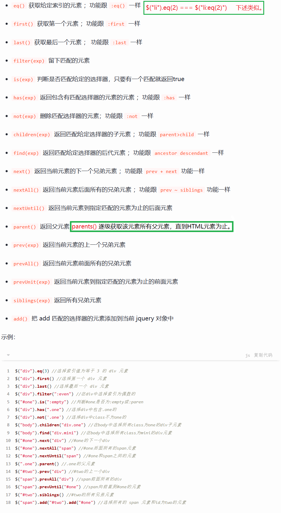
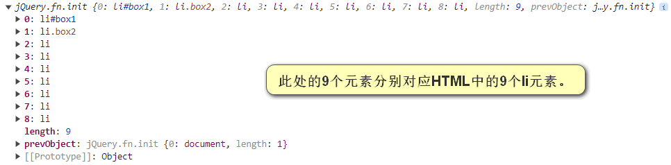
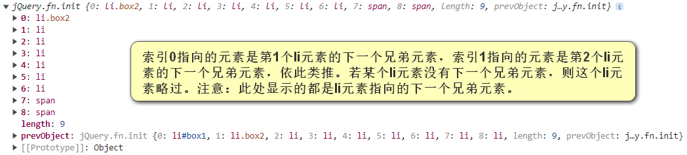
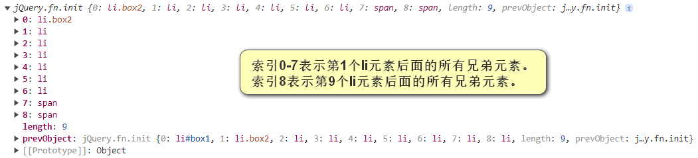

# 一、介绍

1. jQuery是一个大型的，简单的第三方类库。

2. jQuery对DOM操作进行了封装。
   
   + 获取DOM节点。
   
   + 操作节点文本。
   
   + 操作节点样式。
   
   + 操作节点类名。
   
   + 操作节点属性。
   
   + 获取节点尺寸。
   
   + 获取节点偏移量。
   
   + 操作节点事件。
   
   + 节点动画操作。
   
   + AJAX封装。
   
   + ......

3. 当我们引入jQuery文件以后，会在全局暴露两个变量名，一个是"$"，另一个是"jQuery"，二者作用以及语法完全相同。

# 二、选择器

```js
// 语法。
$("选择器")
/*
注意：
    不管使用何种选择器，获取到的元素都是一个元素集合。
    若元素集合中有多个元素，那么我们设置其属性等时会作用到每个元素上。但是获取其属性等时，只会获取第一个元素的。
*/

// eg：id选择器。
$("#box")
// eg：类名选择器。
$(".box")
// eg：标签名选择器。
$("div")
// eg：结构选择器。
$("div:nth-child(3)")
// eg：......
```

# 三、筛选器

```js
// 语法。
$("选择器").筛选器名称()
// 常用的筛选器：如下图1所示。

// eg：
/*
HTML代码：
<ul>
    <li id="box1">1</li>
    <li class="box2">2</li>
    <li>3</li>
    <li>4</li>
    <li>5</li>
    <li>6</li>
    <li>7</li>
    <li>8</li>
    <span></span>
</ul>
<div>
    <ul>
        <li>9</li>
        <span></span>
   </ul>
</div>
*/
console.log($("li"));
// 返回结果：如下图2所示。
console.log($("li").next());
// 返回结果：如下图3所示。
console.log($("li").nextAll());
// 返回结果：如下图4所示。
```

图1：



图2：



图3：



图4：



# 四、操作元素文本内容

```js
// html()。等价于原生js中的innerHTML。
console.log($("div").html());  // 获取div中的html内容。
$("div").html("<p>Hello World</p>");  // 设置div中html内容。

// text()。等价于原生js中的innerText。
console.log($("div").text());  // 获取div中的html内容(文本形式)。
$("div").text("Hello World");  // 设置div中html内容(文本形式)。

// val()。等价于原生js中的value属性。主要用于操作表单元素。
console.log($("input").val());  // 获取input元素中的value属性值。
$("input").val("Hello World");  // 设置input元素中的value属性值。
```

# 五、操作元素类名

```js
// addClass()。向元素的class属性中添加类名。
$("div").addClass("box");  // 向div中添加一个类名(box)。

// removeClass()。向元素的class属性中删除类名。
$("div").removeClass("box");  // 向div中删除一个类名(box)。

// toggleClass()。若元素的class属性中没有参数中的类名，则添加该类名；若有参数中的类名，则删除该类名。
$("div").toggleClass("box");  // div元素中若有类名box，则删除该类名box；若没有类名box，则添加类名box。
```

# 六、操作元素样式

```js
// css()。即可以操作行内样式，也可以操作非行内样式。

console.log($("div").css("width"));  // 获取div元素样式中的width属性。
// 注意：虽然该方法能够获取非行内样式，但是获取的非行内样式是只读的，与"window.getComputedStyle(元素).样式名"一样。

$("div").css("background-color", "red");  // 设置div元素行内样式background-color属性。
// 注意：若设置的样式的属性的值的单位是px，那么px可以省略。因为属性值单位默认就是px。

$("div").css({
    width: "260px",
    height: 300,
    backgroundColor: "yellow"  // 或者 "background-color": "yellow"。
})  // 传递一个对象作为参数，可批量设置样式。
```

# 七、操作元素属性

```js
// attr()。获取和设置元素的属性。一般用于操作元素的自定义属性。
console.log($("div").attr("class"));  // 获取div元素的class属性的属性值。
$("div").attr("id", "box");  // 设置div元素id属性值为box。

// removeAttr()。删除指定的元素的属性。一般用于操作元素的自定义属性。
$("div").removeAttr("class");  //删除div元素的class属性。

// prop()。获取和设置元素的属性。
/*
注意：
    该方法设置元素自定义属性时，不会响应在元素的标签中，会响应在元素的DOM节点中（Element对象的属性[键值对]）。
    获取元素属性时也只能获取Element对象中的属性[键值对]。
*/
console.log($("div").prop("class"));  // 获取div元素的class属性的属性值。
$("div").prop("id", "box");  // 设置div元素id属性值为box。

// removeProp()。删除指定的元素的属性。
/*
注意：
    该方法不能删除原生属性。
    只能删除由prop()方法设置的自定义属性。
*/
$("div").removeProp("hello");  // 删除由prop方法设置的自定义属性hello。
```

# 八、获取元素尺寸

```js
// width()。获取元素内容宽度。
console.log($("div").width());  // 获取div元素的content宽度。

// height()。获取元素内容高度。
console.log($("div").height());  // 获取div元素的content高度。

// innerWidth()。获取元素内容+内边距宽度。
console.log($("div").innerWidth());  // 获取div元素的content+padding宽度。

// innerHeight()。获取元素内容+内边距高度。
console.log($("div").innerHeight());  // 获取div元素的content+padding高度。

// outerWidth()。获取元素内容+内边距+边框宽度。
console.log($("div").outerWidth());  // 获取div元素的content+padding+border宽度。

// outerHeight()。获取元素内容+内边距+边框高度。
console.log($("div").outerHeight());  // 获取div元素的content+padding+border高度。

// outerWidth(true)。获取元素内容+内边距+边框+外边距宽度。
console.log($("div").outerWidth(true));  // 获取div元素的content+padding+border+margin宽度。

// outerHeight(true)。获取元素内容+内边距+边框+外边距高度。
console.log($("div").outerHeight(true));  // 获取div元素的content+padding+border+margin高度。
```

上述方法注意：

+ 不管元素是否隐藏(display: none)，都能获取到该元素的尺寸。

+ 不管盒子模型是什么状态(怪异盒模型)，获取到的尺寸的值可能改变，但是获取的区域不变(该是content区域，改变状态后依旧是content区域。即盒子状态改变后，content区域大小可能改变，但是content区域还是这个区域)。

# 九、获取元素偏移量

```js
// offset()。获取元素相对于页面左上角的坐标位置。
// 注意：该方法返回值是一个对象。
console.log($("div").offset());  // 输出结果模板：{top: yyy, left: xxx}。

// position()。获取的是元素的定位位置（position属性）。
// 注意：如果定位的属性由left属性、top属性换成right属性、bottom属性。那么获取偏移量时会自动转为left属性、top属性。
console.log($("div").position());  // 输出结果模板：{top: yyy, left: xxx}。
```

# 十、事件绑定

```js
// on()。
// 基础事件绑定语法：元素集合.on("事件类型", 事件处理函数);
$("div").on("click", function() {...});
// 事件委托绑定语法：元素集合.on("事件类型", "选择器", 事件处理函数);
$("div").on("click", "p", function() {...});  // 把事件绑定给div元素，当点击div元素内的p元素触发事件的时候，执行事件处理函数。点击div元素不会触发该事件。
// 批量绑定事件语法：元素集合.on({事件类型1: 处理函数, 事件类型2: 处理函数});【批量绑定事件时就不能使用事件委托了】。
$("div").on({
    click: function() {...},
    mouseover: function() {...}
});
// 又要批量绑定事件，又要使用事件委托。可以将on()方法串联起来。语法：on().on()....;
// 触发了哪个事件，便执行哪个处理函数。相同的事件类型若有多个，触发时按照书写顺序依次执行。
$("div").on("click", function() {...}).on("click", function() {...}).on("mouseover", function() {...});  

// one()。语法与上述on()方法一致。区别是one()方法绑定的事件只能执行一次（即只能触发一次，再触发无效）。

// hover()。该方法是jQuery中一个特殊的事件。
// 语法：元素集合.hover(移入时触发的函数, 移出时触发的函数);【若只有一个参数，则该参数移入移出时都触发】，【不能使用事件委托，因为它只有这一种传参方式】。
$("div").hover(function() {...}, function() {...});

// 常用事件函数。jQuery把我们最常使用的一些事件，单独做成了函数。我们可以通过调用这些事件，来达到绑定事件的效果。
// click(), mouseover(), mouseout(), change(), ......。括号中直接写事件处理函数即可。
$("div").click(function() {...});  // 绑定一个事件处理函数。
$("div").click(function() {...}).click(function() {...});  // 批量绑定多个事件处理函数。事件触发时，这些绑定的事件依次执行。
```

# 十一、事件解绑和触发

```js
$("div").click(function handlerA() {...}).click(function handlerB() {...});

// off()。事件解绑。
// 语法1：元素集合.off(事件类型);【解绑参数事件类型，该事件类型的所有处理函数都会被移除】。
$("div").off("click");  // 解绑div元素的click事件。click事件的所有处理函数都会被移除。
// 语法2：元素集合.off(事件类型, 要解绑的事件处理函数);【若该事件类型有多个处理函数，那么移除指定的那个处理函数。若该事件类型只有一个处理函数，那么相当于解绑该事件类型】。
$("div").off("cick", handlerA);  // 移除div元素中click事件绑定的handlerA()处理函数。

// trigger()。事件触发。
// 语法：元素集合.trigger(事件类型);【通过代码来触发元素上的某一事件，此时只要运行这一代码，事件就会触发】。
$("div").trigger("click");
```

# 十二、基本动画

```js
// jQuery将DOM元素基本的运动进行了封装。

/*
显示和隐藏时，元素运动轨迹是同时沿着x轴和y轴缩放（即通过改变width和height的值实现显示和隐藏）。类似如下代码。
<style>
    div {
        width: 500px;
        height: 500px;
        background-color: red;
        transition: all linear 1s;
        overflow: hidden;
        border: 1px solid black;
    }
    div:hover {
        width: 0;
        height: 0;
    }
</style>

<div>
    HelloWorld
    <p>你好，世界</p>
</div>
<div></div>
*/

// show()。显示
// 语法：元素集合.show(运动时间(毫秒 / "slow" / "normal" / "fast")[可选], 缓动函数("swing[默认]" / "linear")[可选], 运动结束的回调函数[可选]);
$("div").show(1000, function() {...});

// hide()。隐藏
// 语法：元素集合.hide(运动时间(毫秒 / "slow" / "normal" / "fast")[可选], 缓动函数("swing[默认]" / "linear")[可选], 运动结束的回调函数[可选]);
$("div").hide(1000, function() {...});

// toggle()。切换（本身是显示，那么就切换为隐藏；本身是隐藏，那么就切换为显示）。
// 语法：元素集合.toggle(运动时间(毫秒 / "slow" / "normal" / "fast")[可选], 缓动函数("swing[默认]" / "linear")[可选], 运动结束的回调函数[可选]);
$("div").toggle(1000, function() {...});

/*
Easing函数指定动画在不同点上的行进速度。
jQuery核心带有两个easings：
    一个是linear，整个动画以一个不变的速度行进；
    另一个是swing（jQuery核心默认的easing），行进速度在动画开始和结束时比在动画中间时稍慢。
*/
```

# 十三、折叠动画

```js
// slideDown()。显示。
// slideUp()。隐藏。
// slideToggle()。切换。

// 上述三个方法的语法与上述第十二章节(基本动画)一致。区别是显示和隐藏时，元素运动轨迹是沿着y轴缩放。
```

# 十四、渐隐渐显动画

```js
// fadeIn()。显示。
// fadeOut()。隐藏。
// fadeToggle()。切换。

// 上述三个方法的语法与上述第十二章节(基本动画)一致。区别是显示和隐藏时，元素的透明度进行改变，最后改变display属性(none / block / ...)。

// fadeTo()。隐藏到指定的透明度。注意：元素的透明度进行改变，但是不改变display属性(none / block / ...)。
// 语法：元素集合.fadeTo(运动时间(毫秒 / "slow" / "normal" / "fast"), 指定的透明度(0-1之间表示透明度的数字), 缓动函数("swing[默认]" / "linear")[可选], 运动结束的回调函数[可选]);
// 元素隐藏时透明度减小到参数中指定的透明度为止，不会像上述fadeOut()方法一样透明度直接减小到0。
```

# 十五、综合动画

```js
// animate()。
// 语法：元素集合.animate(要运动的样式(对象), 运动时间(毫秒 / "slow" / "normal" / "fast")[可选], 缓动函数("swing[默认]" / "linear")[可选], 运动结束的回调函数[可选]);
$("div").animate({
    width: 500,
    height: 500,
}, 1000, "linear", function() {...});  // div元素从初始宽度(高度)运动到500px的宽度(高度)，运动时间为1s，运动速度为匀速，运动完成后执行"function() {...}"函数。
/*
注意：
    要运动的样式这个对象中每个属性都表示一个可以变化的样式属性（如“height”、“top”或“opacity”）。
    不能运动的属性写进去不报错但无效。如：颜色相关属性、transform属性、display属性等等。
    所有指定的属性必须用骆驼形式，比如用marginLeft代替margin-left，或者margin-left加上双引号作为键。
*/
```

# 十六、运动结束函数

```js
/*
问题：
    我们使用jQuery设置了一个按钮(button)来控制div元素的显示和隐藏($("div").toggle(500);)。
    此时我们不停地点击按钮，div元素会在显示与隐藏之间不断地切换（切换速度小于我们的点击速度）。
    当我们停止点击按钮后，发现div元素还在不断地切换，一段时间后才会停下。
原因：
    我们每一次点击，都会被记录有一次动画需要完成。我们点击n次，动画会执行n次后结束。
    所以我们快速点击n次后，动画还没有执行n次时，就不会停止，直到执行n次后才会结束。
要求：
    停止点击后，动画立即结束。
解决：
    使用如下运动结束函数。
*/

// stop()。当任何一个运动元素执行了stop()方法后，会立即结束当前的所有运动。目前运动到什么位置，就停留在什么位置。
$("div").stop();  // div元素动画立即停止。
$("div").stop().toggle(2000);  // div元素每一次触发的时候，都会把之前的动画停止下来，只执行本次最新的动画。

// finish()。当任何一个运动元素执行了finish()方法后，会立即结束当前的所有运动，直接去到动画的结束位置(立即完成本次动画)。
$("div").finish();  // div元素立即跳转到动画结束位置后停止。
$("div").finish().toggle(2000);  // div元素每一次触发的时候，都会把之前的动画瞬间完成，只执行本次最新的动画。
```

# 十七、AJAX请求

```js
// ajax()。
/*
语法：
    $.ajax(本次发送ajax的配置项[对象类型参数]);。
    其中常用配置项有：（url必填，其他都是选填）
        1、url：请求地址。
        2、method(默认GET)：请求方式。
        3、data(默认"")：传递给后端的参数。
        4、async(默认true)：是否异步。
        5、success：请求成功的回调函数。
        6、error：请求失败的回调函数。
        ......
*/
// 注意：因为发送AJAX请求不是操作DOM，所以不需要依赖选择器去获取元素。它是直接依赖"jQuery"变量或"$"变量来被使用。
```
